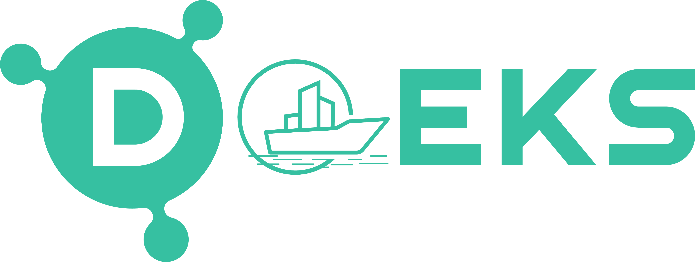

# [Data on Amazon EKS (DoEKS)](https://awslabs.github.io/data-on-eks/)
_(Pronounced: "Do.eks")_
> 💡 **Optimized Blueprints for Running Scalable Data Workloads on Kubernetes with Amazon EKS**

---

## 🔗 Quick Access

| Workload Type | Repository | Website |
|---------------|------------|---------|
| 📊 **Data on EKS (This Repo)** | [github.com/awslabs/data-on-eks](https://github.com/awslabs/data-on-eks) | [awslabs.github.io/data-on-eks](https://awslabs.github.io/data-on-eks) |
| 🤖 **AI on EKS (AI/ML Blueprints)** | [github.com/awslabs/ai-on-eks](https://github.com/awslabs/ai-on-eks) | [awslabs.github.io/ai-on-eks](https://awslabs.github.io/ai-on-eks) |

### Build, Scale, and Optimize Data Platforms on [Amazon EKS](https://aws.amazon.com/eks/) 🚀

Welcome to **Data on EKS**, your launchpad for deploying **data platforms at scale** on [Amazon EKS](https://aws.amazon.com/eks/).

Explore practical examples and patterns for running Data workloads on EKS using advanced frameworks such as [Apache Spark](https://spark.apache.org/) for distributed data processing, [Apache Flink](https://flink.apache.org/) for real-time stream processing, and [Apache Kafka](https://kafka.apache.org/) for high-throughput distributed messaging. Automate and orchestrate complex workflows with [Apache Airflow](https://airflow.apache.org/) and leverage the robust capabilities of [Amazon EMR on EKS](https://docs.aws.amazon.com/emr/latest/EMR-on-EKS-DevelopmentGuide/emr-eks.html) to build resilient clusters, seamlessly integrating Kubernetes with big data solutions for enhanced scalability and performance.

> **Note:** DoEKS is in active development. For upcoming features and enhancements, check out the [issues](https://github.com/awslabs/data-on-eks/issues) section.

## 🏗️ Architecture
The diagram below showcases the wide array of open-source data tools, Kubernetes operators, and frameworks used by DoEKS. It also highlights the seamless integration of AWS Data Analytics managed services with the powerful capabilities of DoEKS open-source tools.

## 🌟 Features
Data on EKS(DoEKS) solution is categorized into the following focus areas.

🎯  [Data Processing](https://awslabs.github.io/data-on-eks/docs/datastacks/processing) on EKS (Spark, EMR, Ray)

🎯  [Streaming Platforms](https://awslabs.github.io/data-on-eks/docs/datastacks/streaming) on EKS (Kafka, Flink)

🎯  [Orchestration](https://awslabs.github.io/data-on-eks/docs/datastacks/orchestration) on EKS (Airflow, MWAA)

🎯  [Databases & Query Engines](https://awslabs.github.io/data-on-eks/docs/datastacks/databases) on EKS (Trino, Pinot, ClickHouse)

## 🏃‍♀️ Getting Started
In this repository, you'll find a variety of deployment blueprints for creating Data/ML platforms with Amazon EKS clusters. These examples are just a small selection of the available blueprints - visit the [DoEKS website](https://awslabs.github.io/data-on-eks/) for the complete list of options.

### 📊 Data

Here are some of the ready-to-deploy blueprints included in this repo:

| Blueprint | Description |
|-------------|-------------|
| 🚀 **[EMR on EKS](https://awslabs.github.io/data-on-eks/docs/datastacks/processing/emr-on-eks/)** | Run EMR Spark workloads on EKS with cost-effective autoscaling |
| 🚀 **[Spark Operator with YuniKorn](https://awslabs.github.io/data-on-eks/docs/blueprints/data-analytics/spark-operator-yunikorn)** | Self-managed Spark with multi-tenant scheduling |
| 🚀 **[Apache Flink on EKS](https://awslabs.github.io/data-on-eks/docs/datastacks/streaming/flink-on-eks/)** | Self-managed Flink clusters on EKS |
| 🚀 **[Apache Kafka with Strimzi](https://awslabs.github.io/data-on-eks/docs/datastacks/streaming/kafka-on-eks/)** | High-throughput Kafka messaging on EKS |
| 🚀 **[Airflow on EKS](https://awslabs.github.io/data-on-eks/docs/datastacks/orchestration/airflow-on-eks/)** | DAG-based data pipeline orchestration using Apache Airflow |
| 🚀 **[Argo Workflows](https://awslabs.github.io/data-on-eks/docs/datastacks/processing/spark-on-eks/argo-workflows)** | Kubernetes-native workflow engine for CI/CD or data pipelines |

## 📚 Documentation
For instructions on how to deploy Data on EKS patterns and run sample tests, visit the [DoEKS website](https://awslabs.github.io/data-on-eks/).

## 🏆 Motivation
[Kubernetes](https://kubernetes.io/) is a widely adopted system for orchestrating containerized software at scale. As more users migrate their data platforms and workloads to Kubernetes, they often face the complexity of managing the Kubernetes ecosystem and selecting the right tools and configurations for their specific needs.

At [AWS](https://aws.amazon.com/), we understand the challenges users encounter when deploying and scaling data workloads on Kubernetes. To simplify the process and enable users to quickly conduct proof-of-concepts and build production-ready clusters, we have developed Data on EKS (DoEKS). DoEKS offers opinionated open-source blueprints that provide end-to-end logging and observability, making it easier for users to deploy and manage Spark on EKS, Airflow, Presto, Kafka and other data workloads. With DoEKS, users can confidently leverage the power of Kubernetes for their data needs without getting overwhelmed by its complexity.

## 🤝 Support & Feedback
DoEKS is maintained by AWS Solution Architects and is not an AWS service. Support is provided on a best effort basis by the Data on EKS Blueprints community. If you have feedback, feature ideas, or wish to report bugs, please use the [Issues](https://github.com/awslabs/data-on-eks/issues) section of this GitHub.

## 🔐 Security
See [CONTRIBUTING](CONTRIBUTING.md#security-issue-notifications) for more information.

## 💼 License
This library is licensed under the Apache 2.0 License.

## 🙌 Community
We're building an open-source community focused on **Data Engineering, Streaming, and Analytics** on Kubernetes.

Come join us and contribute to shaping the future of data platforms on Amazon EKS!

Built with ❤️ at AWS.
