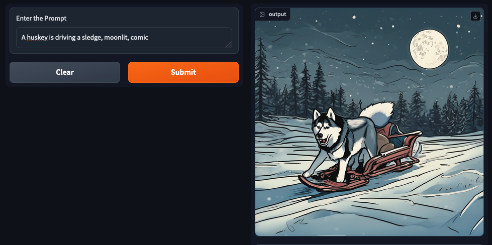

# Steps to Deploy Gradio on Your Mac

## Pre-requisites
Deploy the `trainium-inferentia` blueprint using this [link](https://awslabs.github.io/data-on-eks/docs/blueprints/ai-ml/trainium)

## Step 1: Execute Port Forward to the StableDiffusion Ray Service
First, execute a port forward to the StableDiffusion Ray Service using kubectl:

```bash
kubectl -n stablediffusion port-forward svc/stablediffusion-service 8000:8000
```

## Step 2: Deploy Gradio WebUI Locally

### 2.1. Create a Virtual Environment
Create a virtual environment for the Gradio application:

```bash
cd ai-ml/trainium-inferentia/examples/gradio-ui
python3 -m venv .venv
source .venv/bin/activate
```
### 2.2. Install Gradio WebUI app

Install all the Gradio WebUI app dependencies with pip

```bash
pip install gradio requests
```

### 2.3. Invoke the WebUI
Run the Gradio WebUI using the following command:

NOTE: `gradio-app-stablediffusion.py` refers to the port forward url. e.g., `service_name = "http://localhost:8000" `

```bash
python gradio-app-stablediffusion.py
```

You should see output similar to the following:
```text
Running on local URL:  http://127.0.0.1:7860

To create a public link, set `share=True` in `launch()`.
```

### 2.4. Access the WebUI from Your Browser
Open your web browser and access the Gradio WebUI by navigating to the following URL:

http://127.0.0.1:7860



You should now be able to interact with the Gradio application from your local machine.
