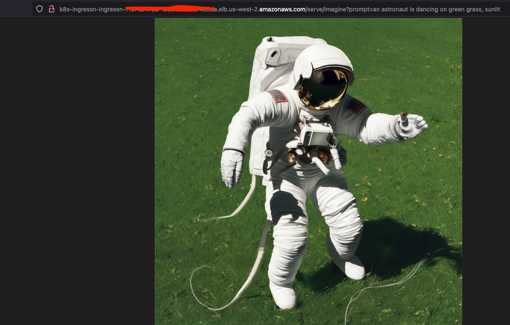

# How to deploy StableDiffusion on Inferentia2 and EKS

## Pre-requisites
Deploy the `trainium-inferentia` blueprint using this [link](https://awslabs.github.io/data-on-eks/docs/blueprints/ai-ml/trainium)

## Step 1: Deploy RayServe Cluster

To deploy the RayServe cluster with `StableDiffusion` LLM on `Inf2.24xlarge` instance, run the following command:

**IMPORTANT NOTE: RAY MODEL DEPLOYMENT CAN TAKE UPTO 8 TO 10 MINS**

```bash
cd data-on-eks/ai-ml/trainium-inferentia/examples/ray-serve/stable-diffusion-inf2
kubectl apply -f ray-service-stablediffusion.yaml
```

This will deploy a RayServe cluster with a `inf2.24xlarge` instances. The `Stable-Diffusion-xl` LLM will be loaded on the instance and will be available to serve inference requests.

Once the RayServe cluster is deployed, you can start sending inference requests to it. To do this, you can use the following steps:

Get the NLB DNS Name address of the RayServe cluster. You can do this by running the following command:

```bash
kubectl get ingress -n stablediffusion
```

Now, you can access the Ray Dashboard from the URL Below

    http://<NLB_DNS_NAME>/dashboard/#/serve

## Step 2: To Test the StableDiffusion Model

To test the StableDiffusion-xl model, you can use the following command with a prompt added at the end of the URL to generate an image.

This uses the GET method to get the response:

`http://<NLB_DNS_NAME>/serve/imagine?prompt=an astronaut is dancing on green grass, sunlit`


You will see an output like this in your browser:


