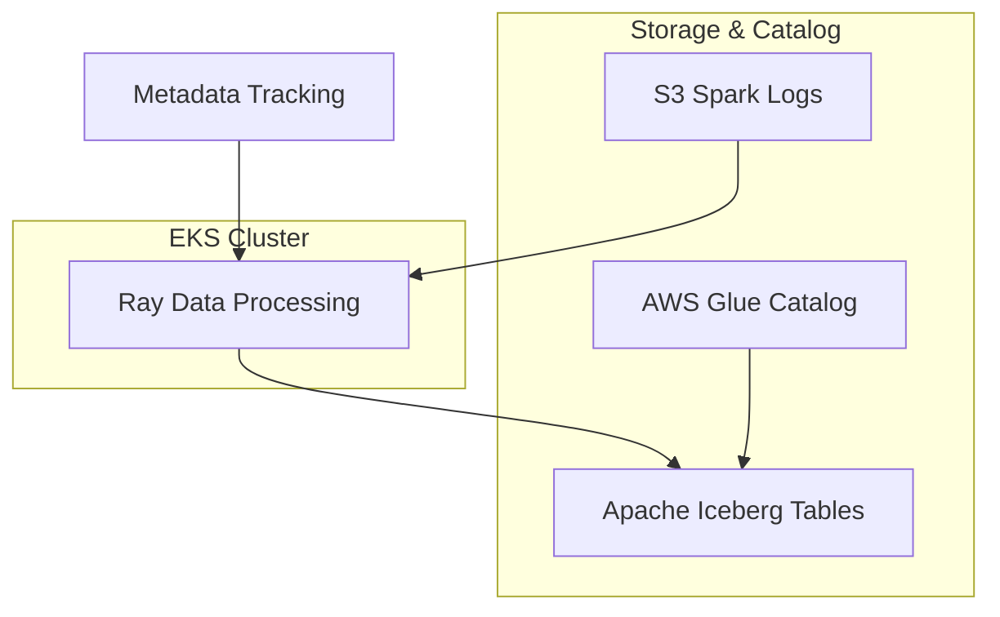

# Ray Data Spark Log Processing with Apache Iceberg

This example demonstrates how to use **Ray Data** to process Spark logs stored in S3 and write the processed data to **Apache Iceberg** tables. The solution showcases Ray Data's distributed processing capabilities with intelligent, metadata-driven processing and built-in idempotency.

## Prerequisites

Before deploying this example, ensure you have the base infrastructure ready:

- **EKS Cluster with Spark Operator**: Follow the [Spark on K8s Operator](../../../README.md) deployment guide
- **S3 bucket with Spark logs**: Structured in folders starting with `spark-*`
- **AWS CLI configured** with appropriate permissions

## Architecture Overview



## Key Features

- **Distributed Processing**: Ray Data enables scalable, parallel log processing
- **Apache Iceberg Integration**: ACID transactions and schema evolution
- **Intelligent Discovery**: Automatically finds and processes new Spark log folders
- **Idempotent Execution**: Tracks processing status to avoid reprocessing
- **AWS Glue Integration**: Uses Glue catalog for Iceberg metadata management

## Deployment

### Step 1: Enable Ray Data Processing

Add the Ray Data pipeline module to your `main.tf`:

```hcl
# Enable Ray Data processing
module "raydata_pipeline" {
  source = "./raydata-pipeline"

  aws_region        = local.region
  eks_cluster_name  = local.name
  s3_bucket         = module.s3_bucket.s3_bucket_id

  tags = local.tags
}
```

### Step 2: Deploy Infrastructure

Enable Ray Data processing by setting the feature flag:

```bash
cd analytics/terraform/spark-k8s-operator

# Deploy with Ray Data support enabled
export TF_VAR_enable_raydata_processing=true
./install.sh

# Or deploy directly with terraform
terraform plan -var="enable_raydata_processing=true"
terraform apply -var="enable_raydata_processing=true"
```

This creates:
- KubeRay operator for Ray job orchestration
- Ray service account with IRSA
- IAM roles with S3 and Glue permissions
- AWS Glue database for Iceberg
- Kubernetes namespace (`raydata`)

### Step 3: Configure the Example

Navigate to the example directory and update configuration:

```bash
cd examples/raydata-sparklogs-processing-job

# Edit execute-rayjob.sh and update:
S3_BUCKET="your-spark-logs-bucket"
S3_PREFIX="spark-logs/spark-team-a"
```

### Step 4: Deploy Ray Job

```bash
# Make script executable
chmod +x execute-rayjob.sh

# Deploy the processing job
./execute-rayjob.sh deploy
```

## Expected S3 Structure

Your Spark logs should be organized as:

```
s3://your-bucket/spark-logs/spark-team-a/
├── spark-1fce815b2d804b2caa6547718e20496c/
│   ├── driver.log
│   ├── executor-1.log
│   └── executor-2.log
├── spark-2abc123def456ghi789012345678901j/
│   ├── driver.log
│   └── executor-1.log
└── ...
```

## Monitoring and Management

### Check Job Status

```bash
# Monitor job progress
./execute-rayjob.sh monitor

# Check current status
./execute-rayjob.sh status

# View processing logs
./execute-rayjob.sh logs

# Verify processed data
./execute-rayjob.sh verify
```

### Access Ray Dashboard

```bash
# Get dashboard access info
./execute-rayjob.sh dashboard

# Port forward to local machine
kubectl port-forward svc/spark-log-processor-head-svc 8265:8265 -n raydata
```

Open http://localhost:8265 to view:
- Job execution progress
- Resource utilization
- Task-level metrics
- Cluster topology

### Expected Output

Successful processing shows:

```
🔍 Starting intelligent folder discovery with metadata tracking...
📁 Found: spark-1fce815b2d804b2caa6547718e20496c
🆕 New folder to process: spark-1fce815b2d804b2caa6547718e20496c
📋 Summary: 1 folders to process, 0 already completed

✅ Successfully processed 734 records from spark-1fce815b2d804b2caa6547718e20496c
🎯 Processing Summary:
  📊 Total records processed: 734
  ✅ Successful folders: 1
  ❌ Failed folders: 0
```

## Ray Data Processing Pipeline

The pipeline implements several intelligent features:

### 1. **Folder Discovery**
- Scans S3 for folders matching `spark-*` pattern
- Discovers new log folders automatically

### 2. **Metadata-Driven Processing**
- Maintains processing status in Iceberg metadata table
- Skips already processed folders (idempotent execution)
- Enables reprocessing of failed folders

### 3. **Schema Validation**
- Validates JSON log entries for required fields
- Filters out invalid or incomplete records
- Ensures data quality in output tables

### 4. **Distributed Writing**
- Uses Ray Data's native Iceberg integration
- Parallel writes across Ray workers
- ACID guarantees via Iceberg transactions

## Data Schema

### Input Log Format (JSON Lines)
```json
{
  "timestamp": "2024-01-15T10:30:00.000Z",
  "log_level": "INFO",
  "message": "Application started",
  "kubernetes": {
    "pod_name": "spark-driver-xyz",
    "namespace_name": "spark-team-a",
    "labels": {
      "app": "spark-pi",
      "spark-app-selector": "spark-1fce815b2d804b2caa6547718e20496c"
    }
  }
}
```

### Output Iceberg Schema
```sql
-- Data table: raydata_spark_logs.spark_logs
CREATE TABLE spark_logs (
  timestamp TIMESTAMP,
  log_level STRING,
  message STRING,
  pod_name STRING,
  namespace_name STRING,
  app STRING,
  spark_app_selector STRING,
  -- Additional Spark metadata fields
  spark_role STRING,
  spark_version STRING,
  submission_id STRING
);

-- Metadata table: raydata_spark_logs.spark_logs_processing_metadata
CREATE TABLE spark_logs_processing_metadata (
  spark_app_selector STRING,
  s3_path STRING,
  status STRING,  -- PROCESSING, SUCCESS, FAILED
  records_processed INT,
  processing_start_time TIMESTAMP,
  processing_end_time TIMESTAMP,
  error_message STRING,
  job_id STRING
);
```

## Verifying Processed Data

### Option 1: Using the Built-in Verification Tool

The easiest way to verify your data has been processed:

```bash
# First install PyIceberg if not already installed
pip install 'pyiceberg[glue,s3fs]==0.7.0' numpy pandas pyarrow

# Run verification
./execute-rayjob.sh verify
```

This will:
- Connect to AWS Glue catalog
- Query the Iceberg table using PyIceberg
- Display record counts, data samples, and statistics
- Confirm successful processing

Example output:
```
🔍 Verifying Ray Data processed logs in Iceberg...
✅ SUCCESS! Found 1287 records in Iceberg table

📋 Data Summary:
   📊 Total Records: 1287
   📅 Date Range: 2025-07-08 19:52:43 to 2025-07-08 20:00:29
   🏷️ Unique Apps: 1
   📱 Unique Pods: 5

📈 Log Level Distribution:
   INFO: 1269
   WARN: 14
   ERROR: 4
```

### Option 2: Using AWS CLI

Check table metadata without querying data:

```bash
# View Iceberg table in Glue catalog
aws glue get-table \
  --database-name raydata_spark_logs \
  --name spark_logs \
  --query 'Table.StorageDescriptor.Location'
```

## Cleanup

```bash
# Remove Ray job only (preserve infrastructure)
./execute-rayjob.sh cleanup

# Remove all infrastructure
terraform destroy
```

## Troubleshooting

### Common Issues

**Issue**: `Namespace 'raydata' not found`
```bash
# Solution: Ensure Terraform deployment completed
terraform apply
kubectl get namespace raydata
```

**Issue**: `AccessDenied` errors
```bash
# Solution: Verify IAM permissions
kubectl get serviceaccount ray-service-account -n raydata -o yaml
# Check eks.amazonaws.com/role-arn annotation
```

**Issue**: `No valid records found`
```bash
# Solution: Verify log format and required fields
# Logs must be JSON Lines with kubernetes.labels.spark-app-selector
```

For more troubleshooting, check the [main documentation](../../../README.md#troubleshooting).

## What's Next?

- **Scale Processing**: Adjust Ray worker counts in `rayjob.yaml`
- **Add Analytics**: Create dashboards using Amazon QuickSight
- **Automate**: Schedule regular processing with Kubernetes CronJobs
- **Monitor**: Set up CloudWatch alerts for job failures

This example demonstrates Ray Data's capabilities for distributed data processing on EKS, providing a foundation for building scalable data pipelines with Apache Iceberg.
