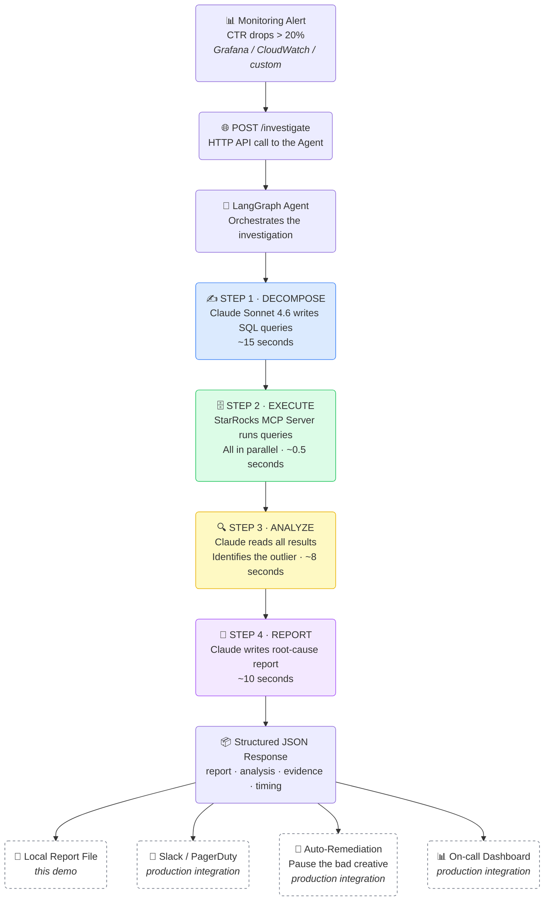

# Agentic Analytics — How It Works

> A plain-language guide for anyone curious about what this system does, why it matters, and how to think about "agentic AI" without the jargon.

---

## The Problem

You run digital ads across thousands of creatives, websites, devices, and countries. One morning your dashboard shows the click rate dropped 40% for one advertiser.

You have a million rows of data and no idea whether it's:
- One broken ad creative (bad URL, expired asset)
- One website where your ads run that went dark
- Mobile click tracking that broke after an iOS update
- A country that went offline or blocked your ads

A data analyst would spend 30–90 minutes pulling queries, staring at spreadsheets, and forming a hypothesis — *if* they even knew where to start.

**This system does the same investigation in 33 seconds and hands you a written report.**

---

## What "Agentic AI" Means (Simply)

Traditional tools answer questions **you already know to ask**.
You type a query → you get data back.

An **agentic** system decides for itself **what questions to ask**.
You give it a goal and it figures out the steps, fetches the data, reads the results, and explains what it found.

> Think of the difference between a calculator and a consultant.
> A calculator does exactly what you type. A consultant hears your problem, goes and does research, and comes back with an answer.

---

## What Happens in 33 Seconds

```
You (or your alert system) say:
"CTR dropped for advertiser_42 in the last 15 minutes — what's the root cause?"

    ┌─────────────────────────────────────────────────────────────┐
    │  STEP 1 · THINK  (~15s)                                     │
    │  The AI reads the database schema and writes 6 targeted     │
    │  SQL queries — one per dimension it wants to investigate.   │
    │  e.g. "show me CTR by creative, by country, by device..."   │
    └─────────────────────────┬───────────────────────────────────┘
                              ↓
    ┌─────────────────────────────────────────────────────────────┐
    │  STEP 2 · FETCH  (~0.5s)                                    │
    │  All 6 queries run simultaneously against StarRocks         │
    │  via the official MCP (database connector) server.          │
    │  1 million rows, 6 queries, half a second.                  │
    └─────────────────────────┬───────────────────────────────────┘
                              ↓
    ┌─────────────────────────────────────────────────────────────┐
    │  STEP 3 · ANALYZE  (~8s)                                    │
    │  The AI reads all the results and finds the outlier:        │
    │  "creative_id 8821 — 0.00% CTR vs 1.72% baseline"          │
    │  It rules out all other dimensions (device, country, etc.)  │
    └─────────────────────────┬───────────────────────────────────┘
                              ↓
    ┌─────────────────────────────────────────────────────────────┐
    │  STEP 4 · REPORT  (~10s)                                    │
    │  The AI writes a structured root-cause report with:         │
    │  - What broke and by how much                               │
    │  - Evidence (the actual numbers)                            │
    │  - Recommended action (pause the creative, fix the URL)     │
    └─────────────────────────────────────────────────────────────┘
```

---

## Production Flow



---

## What Issues It Detects

The system checks **four dimensions simultaneously** — the key advantage over a human who would check them one at a time.

| Dimension | What it catches |
|---|---|
| **Creative ID** | One specific ad stopped generating clicks — broken URL, expired asset, bad click tracking tag |
| **Placement ID** | One website or app where your ads run went dark, started blocking clicks, or had a technical outage |
| **Device Type** | Mobile click tracking broke (common after iOS/Android OS updates or privacy policy changes) |
| **Country / Region** | Geo-targeting issue, a regional ad policy change, or a market-specific outage |
| **Cross-dimensional** | Creative X only breaks on mobile in Japan — subtle interactions no single-dimension query would catch |

### Real Example from This Demo

> `creative_id = 8821` had **48,000 impressions** and **zero clicks** in 15 minutes.
> Every other creative was running at a normal ~2% click rate.
>
> The report said: *Pause this creative immediately. Check for a broken click URL or expired tracking pixel. It's burning budget every minute with zero return.*

---

## How to Think About It in Production

| Scenario | Without This System | With This System |
|---|---|---|
| CTR drops at 2 AM | On-call engineer woken up, 45 min investigation | Alert → 33-second analysis → Slack message: "Pause creative 8821" |
| Budget waste from broken creative | Hours of waste before anyone notices | Detected in the first 15-minute window |
| New analyst joins | Needs weeks to learn the data model | Agent already knows the schema, writes the queries |
| 50 advertisers spike at once | 50 × 45 min = 37 hours of analyst time | 50 × 33 seconds = 28 minutes, automated |

---

## The Components (Plain English)

| Component | What it is | Plain English |
|---|---|---|
| **LangGraph** | Workflow engine | The "brain" that decides what to do next and in what order |
| **Claude Sonnet 4.6** | AI model (Amazon Bedrock) | The analyst writing the SQL queries and reading the results |
| **StarRocks MCP Server** | Official database connector | The "hands" that actually execute queries against the data warehouse |
| **StarRocks** | Analytics database | The warehouse storing all raw ad event data at scale |
| **Amazon Bedrock + IRSA** | Managed AI + AWS security | How the AI gets permission to run — no passwords or API keys stored anywhere |

---

## The One-Line Pitch

> "Instead of a data analyst spending an hour finding a broken ad, your system finds it in 33 seconds, writes the incident report, and tells you exactly what to fix — automatically, every time an alert fires."
