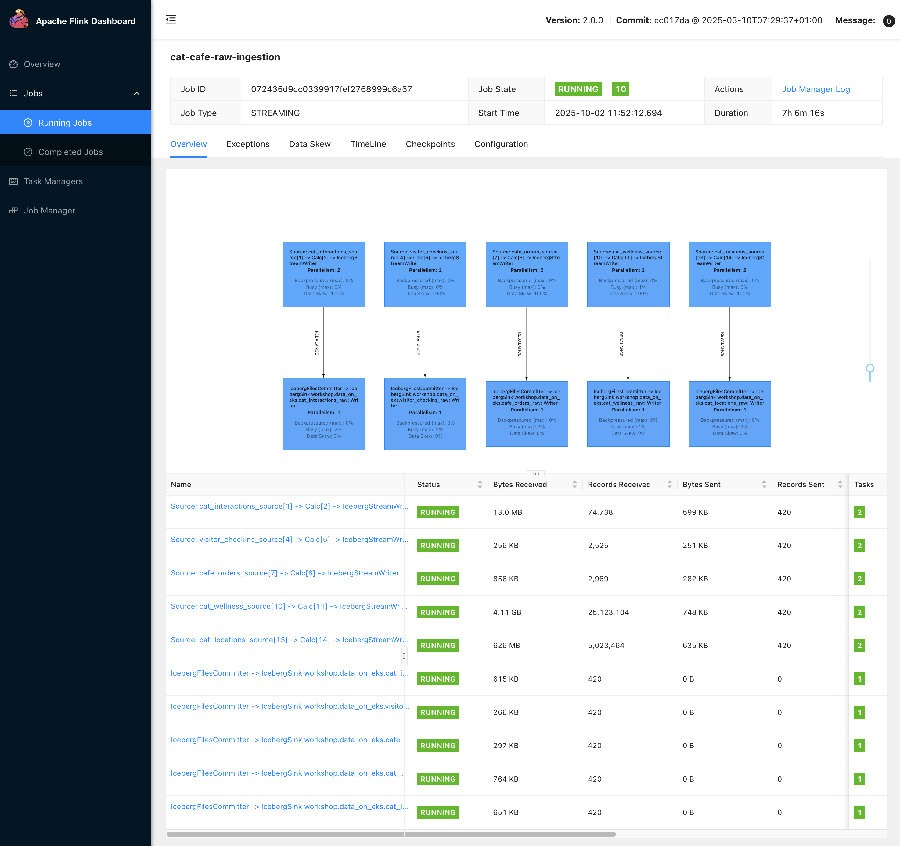
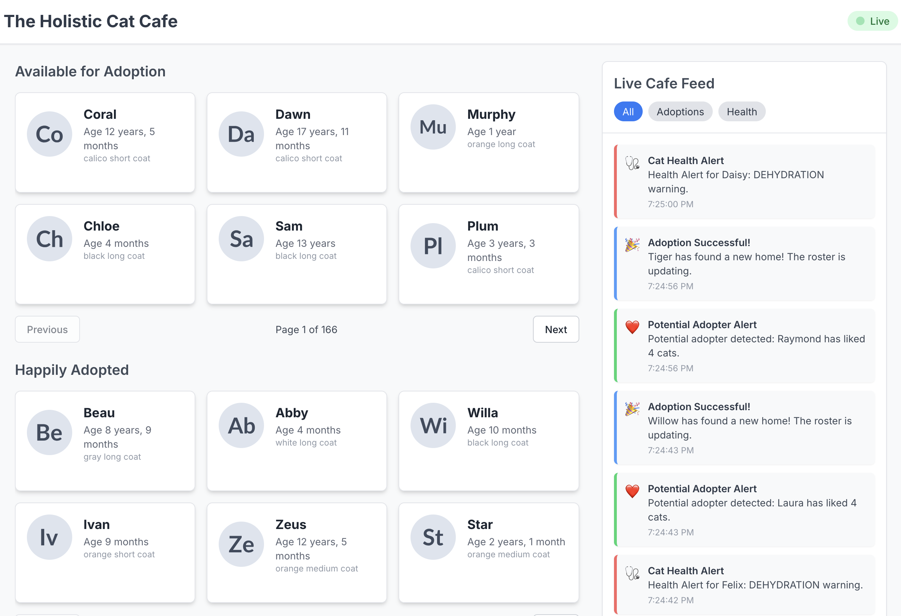
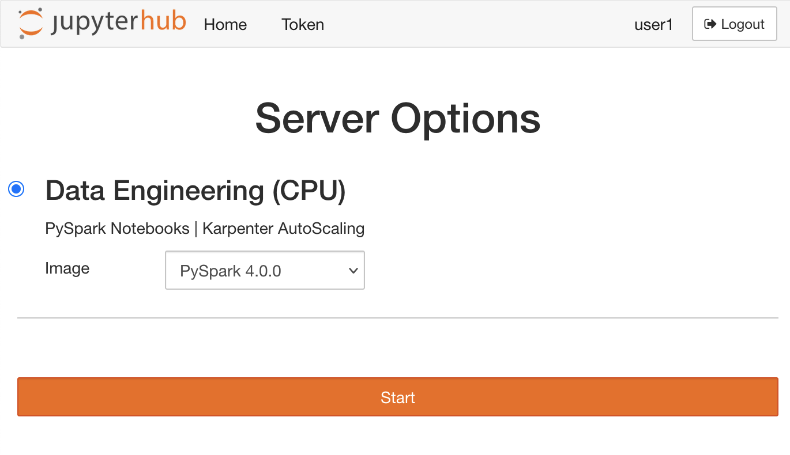
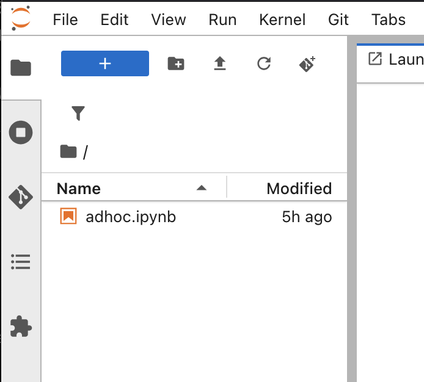
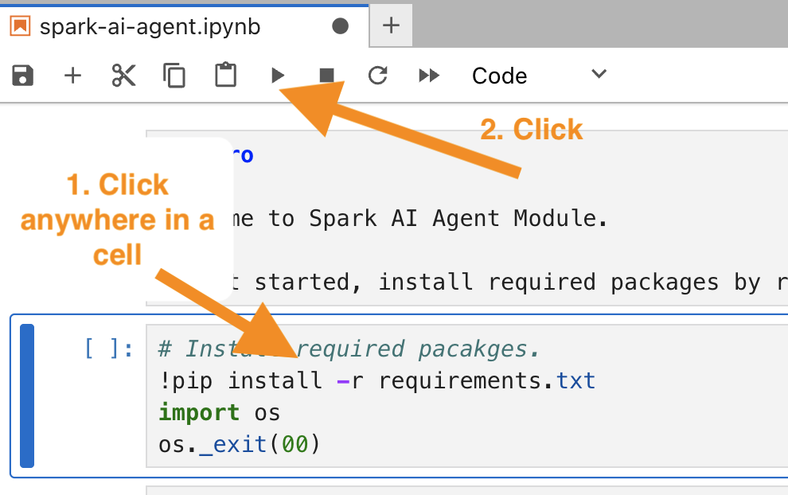
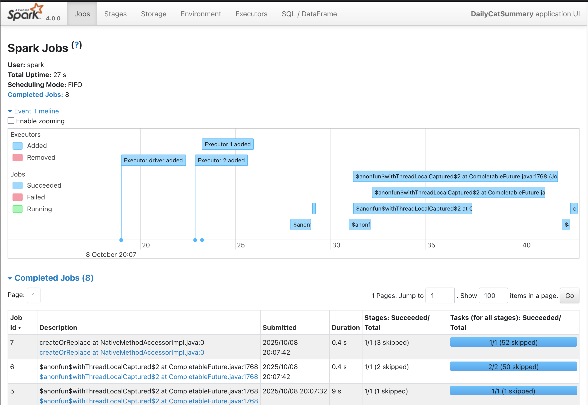
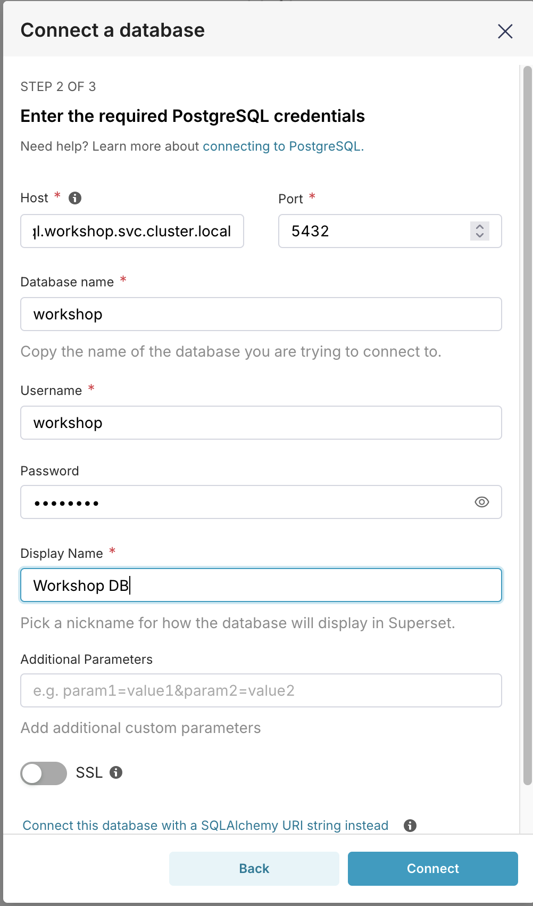
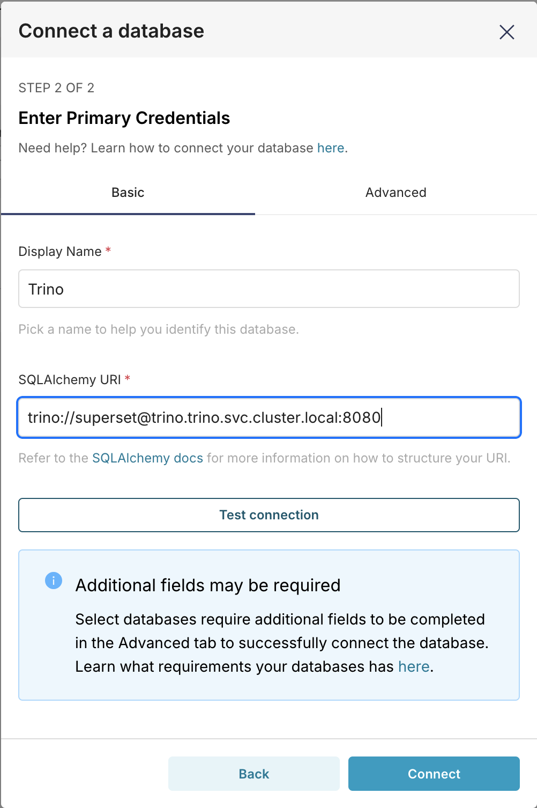

# DoEKS Cat Cafe: Real-Time Data Platform Workshop

Build a complete streaming data platform using the story of managing a modern cat cafe. This hands-on workshop covers the full data engineering stack, from real-time event processing to historical analytics, all deployed on Kubernetes.

## What You'll Build

An open source data platform that:
- Ingests live events from cafe operations (cat interactions, wellness monitoring, visitor activity)
- Processes data streams in real-time to generate alerts and insights
- Stores all data in a modern lakehouse architecture for historical analysis
- Provides live dashboards and business intelligence reports

## What You'll Learn

* **Event Streaming:** Apache Kafka as the backbone for real-time data flows
* **Stream Processing:** Apache Flink for stateless and stateful real-time analytics
* **Data Lakehouse:** Apache Iceberg on S3 for durable, queryable data storage
* **Batch Processing:** Apache Spark for large-scale data transformations
* **Cloud-Native Deployment:** Kubernetes operators for managing data infrastructure
* **Full-Stack Integration:** Connecting data pipelines to live web applications

## Prerequisites

- `kubectl` configured for your EKS cluster
- `uv` Python package manager installed
- Basic familiarity with Kubernetes concepts


## Architecture Overview

The platform follows a modern lakehouse architecture with both streaming and batch processing capabilities:

```
                                     +-----------------+
                                     |   PostgreSQL    |  (Source: Cat & Visitor Profiles)
                                     |      (DB)       |
                                     +-----------------+
                                         |         |
                              (Profile Lookups)|         | (Batch Dimension Ingestion)
                                         v         v
      +---------------------+        +-----------------+        +----------------+
      | Real-Time Producer  |------->|      Kafka      |        |   Batch Jobs   |
      | (event_producer.py) |        | (Event Broker)  |        |    (Spark)     |
      +---------------------+        +-----------------+        +----------------+
      (Generates: interactions,       (Topics: raw_events,         |         ^
       wellness, checkins)            alerts)                      |         |
                 |                            | (Alerts)           | (Analytics & Aggregates)
                 | (Raw Events)               |                    v         |
                 v                            v             +-----------------+
      +---------------------+        +-----------------+    |   Iceberg Lake  |
      |   Streaming Jobs    |------->|   Alert UI      |    |      (S3)       |
      |     (Flink)         |        |   (WebSocket)   |    +-----------------+
      +---------------------+        +-----------------+         ^        |
      (Raw Ingestion, Health         (Consumes alerts            |        |
       monitoring, adoption detection)   from Kafka)             |        v
                 |                                              +---------------+
                 '----------------------------------------------| BI Dashboard  |
                           (Writes raw events to Lake)          |  (Superset)   |
                                                                +---------------+
```

## Workshop Modules

## Module 1: Data Generation & Kafka Ingestion

**Goal:** Establish the foundational data sources for the cat cafe. You'll deploy a PostgreSQL database to act as the cafe's operational system of record and an Apache Kafka cluster to serve as the central nervous system for all real-time events.

**Why this matters:** This module simulates a real-world scenario where data originates from multiple systems. You'll learn how a relational database holds core business entities (cats, visitors), while a streaming platform like Kafka is used to capture and distribute real-time activities (interactions, sensor data) as they happen. This separation is a core pattern in modern data architectures.

### Step 1: Deploy PostgreSQL Database

First, we'll deploy a simple PostgreSQL `StatefulSet` directly from a manifest. This represents the cafe's primary operational database, which will store the profiles for all our cats and registered visitors.

```bash
# Update kubeconfig to use the created cluster
aws eks update-kubeconfig --name  data-on-eks --alias data-on-eks

export WORKSHOPDIR=$(git rev-parse --show-toplevel)/data-stacks/workshop

kubectl apply -f $WORKSHOPDIR/manifests/postgresql.yaml
```

Wait for the pod to be ready:
```bash
kubectl wait --for=condition=ready pod/postgresql-0 -n workshop --timeout=300s
```

### Step 2: Generate Sample Data

Next, we'll populate the database with thousands of cat and visitor profiles. To do this, we'll run a local Python script. We use `kubectl port-forward` to create a secure tunnel from our local machine to the PostgreSQL pod running in the Kubernetes cluster, allowing our script to connect to it.

In another terminal open port-forward:

```bash
# Port-forward to PostgreSQL
kubectl port-forward postgresql-0 5432:5432 -n workshop
```

Go back to the first terminal, then generate data:

```bash
# Generate sample data
cd $WORKSHOPDIR/src/data-flow
uv sync --frozen
uv run data-generator.py
```

In the second terminal, kill the port-forward process by pressing `ctrl + c`. 

**Validate:** Check that data was created:

```bash
# Connect to database
kubectl exec -it postgresql-0 -n workshop -- psql -U workshop

# Run these queries in psql:
SELECT COUNT(*) FROM cats;
SELECT COUNT(*) FROM visitors;
\q
```

You should see ~11,000 cats and ~1,000 visitors.

### Step 3: Create Kafka Resources

With the database ready, we'll deploy our event streaming backbone: Apache Kafka. We use the Strimzi operator, which simplifies managing Kafka on Kubernetes. We define our cluster declaratively in `kafka-cluster.yaml`, and Strimzi handles the complex setup of brokers and other components.

```bash
kubectl apply -f $WORKSHOPDIR/manifests/kafka-cluster.yaml
```

**Validate:** Wait for the Kafka cluster to be ready. This will take a few minutes. The validation step highlights a key feature of our EKS setup: autoscaling with Karpenter. When you request the Kafka cluster, Karpenter sees the pending pods and automatically provisions new EC2 instances (nodes) to run them. This demonstrates how the infrastructure elastically scales to meet workload demands.

```bash
# Verify nodeclaims are created
kubectl get nodeclaim

kubectl wait kafka/data-on-eks --for=condition=Ready -n kafka --timeout=300s

# Once the Kafka cluster is ready, the nodeclaims should also be ready
kubectl get nodeclaim
```

Next, set up the event streaming topics required for the workshop:

```bash
kubectl apply -f $WORKSHOPDIR/manifests/topics.yaml
```

**Validate:** Check that the `KafkaTopic` resources were created successfully in the `kafka` namespace.
```bash
kubectl get kafkatopics -n kafka
```

The following topics will be created:

| Topic Name             | Purpose                                            |
|------------------------|----------------------------------------------------|
| `cat-interactions`     | Raw events of visitors interacting with cats.      |
| `cat-wellness-iot`     | Raw IoT sensor data from cat wellness monitors.    |
| `visitor-checkins`     | Raw events generated when a visitor checks in.     |
| `cat-health-alerts`    | Alerts generated for cats showing health issues.   |
| `potential-adopters`   | Alerts for visitors showing strong adoption intent.|


### Step 4: Start Event Generation

Deploy a producer pod which will be used to generate live events:

```bash
kubectl apply -f $WORKSHOPDIR/manifests/event-producer.yaml
```

Connect to the producer pod and start the event generator script. The script will run in the background.

```bash
# Exec into the pod
kubectl exec -it event-producer -n workshop -- bash

# Inside the pod, run the following commands: 
apt update && apt install -y git

# Clone the repo and navigate to the correct directory
git clone https://github.com/awslabs/data-on-eks.git --depth 1 --branch v2
cd data-on-eks/data-stacks/workshop/src/data-flow

# Set environment variables for the script
export DB_HOST=postgresql-0.postgresql.workshop.svc.cluster.local
export KAFKA_BROKERS=data-on-eks-broker-0.data-on-eks-kafka-brokers.kafka.svc.cluster.local:9092

# Install dependencies and run the producer in the background
uv sync --frozen
nohup uv run event-producer.py &
```

The `event-producer.py` script running inside this pod is a simulator that mimics the real-world activity of the cat cafe. It reads cat and visitor profiles from the PostgreSQL database and then continuously generates events to Kafka based on a set of behavioral rules:

*   **Visitor Simulation:** New visitors arrive periodically. Each visitor has a "persona" (e.g., `potential_adopter`, `casual_visitor`, `family`) that determines their behavior, such as how long they stay, what they order from the cafe, and how they interact with the cats.
*   **Interaction Events:** Based on their persona, visitors generate `cat-interactions` events like 'pet', 'play', and 'like'. The behavior is specifically designed to trigger the "Adopter Detective" Flink job later in the workshop.
*   **Wellness Events:** The script also generates `cat-wellness-iot` events for each cat, simulating data from a health monitor. It includes logic to occasionally generate anomalous data (e.g., low activity or high hours since last drink) to trigger the "Cat Wellness Guardian" Flink job.


After running the `nohup` command, you can safely exit the pod shell. The process will continue running. You should see output like `Sent interaction event for cat_id=1234, visitor_id=567` printed to a `nohup.out` file.

### Step 5: Verify Event Streaming

To confirm everything is working, we'll use `kafka-console-consumer`, a standard Kafka tool that lets you subscribe to a topic and view its messages in real-time. This is an essential debugging technique for any streaming application.

Deploy a separate debug pod that contains the Kafka command-line tools:

```bash
kubectl apply -f $WORKSHOPDIR/manifests/kafka-debug-pod.yaml
```

Once the pod is running, use it to consume messages from the `cat-interactions` topic.

```bash
kubectl exec -it kafka-debug -n workshop -- \
  kafka-console-consumer \
  --bootstrap-server data-on-eks-broker-0.data-on-eks-kafka-brokers.kafka.svc.cluster.local:9092 \
  --topic cat-interactions
```

You should see a continuous stream of JSON events, confirming that the producer is working correctly.

### What You Accomplished

You successfully set up the two primary data sources for the workshop. You now have:
- A **PostgreSQL database** acting as the system of record for business entities.
- An **Apache Kafka cluster** serving as the central hub for real-time event streams.
- A **data generator** actively producing simulated events that mimic the cafe's daily operations.

**Key Takeaway:** You've established a common and powerful architectural pattern: using a relational database for master data and a streaming platform for event data. This decouples the systems that produce data from the systems that will consume and analyze it in later modules.

**Success Criteria:**
- PostgreSQL contains cat and visitor data
- Kafka topics are created
- Events are being produced to `cat-interactions`, `cat-wellness-iot`, and `visitor-checkins` topics

---


## Module 2: Raw Data Ingestion to Iceberg

**Goal:** Build a streaming pipeline with Apache Flink to ingest all raw Kafka events into an Apache Iceberg data lakehouse on S3.

**Why this matters:** You're building a "Streaming ELT" (Extract, Load, Transform) pipeline, a modern data pattern where raw data is immediately loaded into a data lake. This ensures all data is durably stored for historical analysis *before* any transformations are applied. This approach provides data resilience and flexibility for future analytics needs.

**The Technology:**
*   **Apache Flink:** A powerful, open-source stream processing framework ideal for high-throughput, low-latency data pipelines. We use it to read from Kafka and write to Iceberg in a continuous, reliable way.
*   **Apache Iceberg:** A modern table format for data lakes. It brings the reliability of a traditional database to object storage like S3 by providing ACID transactions, schema evolution, and time-travel capabilities.
*   **Amazon S3:** A scalable, durable, and cost-effective object store that serves as the storage layer for our data lake.

### Step 1: Update S3 Configuration

First, retrieve the S3 bucket name created by Terraform and set it as an environment variable. This bucket will be the home for our Iceberg data lake.

```bash
export S3_BUCKET=$(terraform -chdir=$WORKSHOPDIR/terraform/_local output -raw s3_bucket_id_spark_history_server)
```

### Step 2: Deploy Raw Ingestion Flink Job

Now, deploy the Flink SQL job. The core logic of this job is simple: read from a Kafka topic and insert into an Iceberg table.

```sql
-- Simplified example of the Flink SQL logic
INSERT INTO iceberg_raw_table SELECT * FROM kafka_topic;
```

The `deploy-flink.sh` script wraps this SQL logic into a `FlinkDeployment` custom resource and applies it to the cluster. The Flink Kubernetes Operator sees this resource and automatically deploys and manages the Flink job for us.

```bash
export DATAHUB_TOKEN=abc
bash deploy-flink.sh
```

**Validate:** Check that the Flink deployment has been created.
```bash
kubectl get flinkdeployments -n flink-team-a
```

You should see `cat-cafe-raw-ingestion` in a `RECONCILING` state, which will eventually become `RUNNING`.

### Step 3: Monitor Flink Job

Check that the Flink pods (both JobManager and TaskManager) are running.

```bash
kubectl get pods -n flink-team-a
```

### Step 4: Access Flink UI

Use `port-forward` to access the Flink Dashboard, which provides a detailed view of the running job, including its data flow, metrics, and any potential errors.

```bash
kubectl port-forward -n flink-team-a \
  svc/cat-cafe-raw-ingestion-rest 8081:8081
```

Open your browser to `http://localhost:8081`.



### Step 5: Verify Data Ingestion

In the Flink UI, you should see a running job with several sources (Kafka topics) and sinks (Iceberg tables). Check the metrics to see that records are being consumed and written.

Next, verify that Flink is writing data to your S3 bucket.

```bash
aws s3 ls s3://$S3_BUCKET/iceberg-warehouse/data_on_eks.db/cafe_orders_raw/
```

You will see `data` and `metadata` prefixes. This separation is a key aspect of Iceberg's design:
*   **`metadata/`**: Contains manifest files and snapshots that track the table's state, schema, and history, providing transactional guarantees.
*   **`data/`**: Contains the actual data, stored in an efficient columnar format (Parquet).

This structure is what enables Iceberg's powerful features, which you will explore further in Module 5.

### What You Accomplished

You built a robust, streaming ELT pipeline using Flink and Iceberg. You deployed a Flink SQL job that consumes from every raw Kafka topic and sinks the data into corresponding Iceberg tables on S3, establishing the foundation of your data lakehouse.

**Key Takeaway:** You've created an automated pipeline that transforms streaming events into a queryable historical archive. Every event flowing through Kafka is now transactionally and durably stored, ready for both real-time alerting and large-scale batch analytics.

**Success Criteria:**
- Flink deployment is in READY state
- Flink job is running without errors
- Data is flowing from Kafka topics to Iceberg tables
- The `data` and `metadata` directories are present in S3 for your Iceberg tables


## Module 3: Real-time Alerting with Flink

**Goal:** Deploy Flink SQL jobs that analyze streaming data to generate intelligent, actionable alerts.

**Why this matters:** This is where you move from simply storing data to generating real-time business value. You'll build two intelligence systems that can drive immediate action: a "Cat Wellness Guardian" that can alert staff to check on a cat, and an "Adopter Detective" that can notify the front desk to engage with a potential adopter. This is the brain of the real-time platform.

### Step 1: Deploy Alert Processing Jobs

The `deploy-flink-alert.sh` script deploys two Flink SQL jobs. This module introduces two fundamental stream processing concepts: **stateless** and **stateful** processing.

*   **Stateless Processing:** Each event is processed independently, without knowledge of any other event. It's useful for simple filtering and transformations.
*   **Stateful Processing:** The job maintains a "memory" of past events to detect patterns over time. This is essential for more complex analytics like aggregations, windowing, and pattern detection.

The script will deploy both types of jobs:

1.  **The Cat Wellness Guardian (Stateless):** This job applies a simple filter to each `cat-wellness-iot` event to see if a cat's vitals are outside the normal range.

    ```sql
    -- Simplified example of the stateless filter logic
    INSERT INTO cat_health_alerts
    SELECT cat_id, 'LOW_ACTIVITY' AS alert_type
    FROM cat_wellness_iot
    WHERE activity_level < 2;
    ```

2.  **The Adopter Detective (Stateful):** This job tracks `cat-interactions` events for each visitor, counting how many distinct cats they have "liked." It maintains a running count for each visitor as its state.

    ```sql
    -- Simplified example of the stateful aggregation logic
    INSERT INTO potential_adopters
    SELECT visitor_id, COUNT(DISTINCT cat_id) AS liked_cats
    FROM cat_interactions
    WHERE interaction_type = 'like'
    GROUP BY visitor_id
    HAVING COUNT(DISTINCT cat_id) > 3;
    ```

Deploy the jobs now:
```bash
export DATAHUB_TOKEN=abc
bash deploy-flink-alert.sh
```

**Validate:** Check that the Flink deployment was created.
```bash
kubectl get flinkdeployments -n flink-team-a
```

You should see `cat-cafe-alerts` in a `RECONCILING` state.

### Step 2: Monitor Alert Jobs

Check that the pods for the alert jobs are running.
```bash
kubectl get pods -n flink-team-a -l app=cat-cafe-alerts
```

### Step 3: Access Flink Alert UI

Port-forward to the Flink UI to inspect the running jobs. Note that we use port `8082` to avoid conflicting with the UI from Module 2.
```bash
kubectl port-forward -n flink-team-a \
  svc/cat-cafe-alerts-rest 8082:8081
```

Open your browser to `http://localhost:8082`. You will see both the "Guardian" and "Detective" jobs running.

### Step 4: Verify Alert Generation

Use the `kafka-console-consumer` tool to inspect the output topics and see the alerts as they are generated by Flink.

First, monitor the health alerts from the stateless "Guardian" job:
```bash
# Monitor health alerts
kubectl exec -it kafka-debug -n workshop -- \
  kafka-console-consumer \
  --bootstrap-server data-on-eks-broker-0.data-on-eks-kafka-brokers.kafka.svc.cluster.local:9092 \
  --topic cat-health-alerts \
  --from-beginning
```

In another terminal, monitor the adoption alerts from the stateful "Detective" job:
```bash
# Monitor adoption alerts
kubectl exec -it kafka-debug -n workshop -- \
  kafka-console-consumer \
  --bootstrap-server data-on-eks-broker-0.data-on-eks-kafka-brokers.kafka.svc.cluster.local:9092 \
  --topic potential-adopters \
  --from-beginning
```
You should see a stream of JSON events in both terminals.

### What You Accomplished

You built the intelligence layer of the real-time platform. You deployed two different kinds of Flink SQL jobs that process raw event streams and publish valuable, actionable alerts.

- **The Cat Wellness Guardian:** A stateless job that filters events independently.
- **The Adopter Detective:** A stateful job that aggregates events over time to find meaningful patterns.

**Key Takeaway:** You experienced the power of Flink to analyze data in motion, handling both simple filtering (stateless) and complex pattern detection (stateful) using only SQL. Your streaming platform is no longer just an ingestion pipeline; it's an active intelligence system.

**Success Criteria:**
- Alert processing Flink deployment is in READY state
- Both wellness and adoption detection jobs are running in the Flink UI
- Health alerts appear in the `cat-health-alerts` topic
- Adoption alerts appear in the `potential-adopters` topic

---

## Module 4: Live Alert Dashboard

**Goal:** Deploy a web application that visualizes real-time alerts and demonstrates the complete data loop from events to UI.

**Why this matters:** This is where the platform comes to life. You're connecting abstract data processing to a tangible, human-facing interface that shows alerts in real-time and can even trigger actions back to the source systems.

### Step 1: Deploy the Web UI

Deploy the live dashboard application:

```bash
kubectl apply -f $WORKSHOPDIR/manifests/webui.yaml
```

**Validate:** Check the web UI deployment:
```bash
kubectl get pods -n workshop -l app=alert-ui
```

### Step 2: Access the Dashboard

Port-forward to the web application:
```bash
kubectl port-forward -n workshop svc/alert-ui 8788:8788
```

Open your browser to `http://localhost:8788`



### Step 3: Observe Real-time Alerts

In the dashboard, you should see:
- **Live Cafe Feed:** Real-time alerts appearing on the right side
- **Cat Status Grid:** Current status of all cats in the cafe
- **Alert Types:** Both health alerts and adoption notifications

### What You Accomplished

You deployed and accessed the "Live Dashboard" web application that consumes alerts from Kafka via WebSockets. You watched as health and adopter alerts generated by your Flink jobs appeared in the "Live Cafe Feed" in real-time.

**Key Takeaway:** The Flink jobs you wrote are now pushing notifications to a web browser, which can even influence the original data source. You've built a complete, interactive, end-to-end data loop.

**Success Criteria:**
- Web UI is accessible at localhost:8788
- Real-time alerts appear in the Live Cafe Feed
- Cat status updates reflect adoption events
- Dashboard shows both health and adoption alerts

---

## Module 5: Interactive Analysis and Batch Transformation with Spark

**Goal:** Use Spark in a Jupyter environment to interactively explore the Iceberg data lake, understand its powerful metadata features, and run a batch transformation job to create an aggregated summary table.

**Why this matters:** You're bridging the gap between raw data and business intelligence. This module shows how to leverage the historical data in your lakehouse for deeper analysis. You'll act as a data analyst, using Spark to query raw events, inspect table history, and build clean, aggregated tables that are perfect for BI dashboards.

### Step 1: Access JupyterHub

First, get access to the JupyterHub environment where you will run Spark.

Port-forward to the JupyterHub service:
```bash
kubectl port-forward -n jupyterhub svc/proxy-public 8000:80
```

Open your browser to `http://localhost:8000` and log in"

* Username: `user1`
* Password: `welcome`

### Step 2: Start Your Spark Environment

On the JupyterHub landing page, you'll be prompted to select a container image for your server.

1.  Select the **Spark 4.0** image from the dropdown menu.
2.  Click **Start**.

Karpenter will automatically provision a new node for your Spark environment. This may take 2-3 minutes.



### Step 3: Upload and Open the Notebook

Next, you will render the workshop's analytics notebook and copy it into your running Jupyter environment. The notebook uses a placeholder for your S3 bucket name. The following command uses `envsubst` to substitute the `$S3_BUCKET` variable (which you set in Module 2) and pipes the result directly into the pod's filesystem.

```bash
POD_NAME=$(kubectl get pods -n jupyterhub -l app=jupyterhub,component=singleuser-server -o jsonpath='{.items[0].metadata.name}') && \
cat $WORKSHOPDIR/src/spark/adhoc.ipynb | envsubst | kubectl exec -i -n jupyterhub $POD_NAME -- bash -c 'cat > /home/jovyan/adhoc.ipynb' && kubectl exec -i -n jupyterhub $POD_NAME -- chown jovyan:1000 /home/jovyan/adhoc.ipynb
```

Once the file is copied, you will see it in the Jupyter file browser on the left. Double-click `adhoc.ipynb` to open it.



### Step 4: Explore Apache Iceberg

The first part of the notebook guides you through the power of Iceberg's metadata. Follow the instructions to execute the cells and observe the output.

To execute a cell, click it and then press the **▶** button in the toolbar.



You will learn how to:
1.  **Connect to the Glue Catalog:** Configure Spark to use AWS Glue as the Iceberg catalog.
2.  **Inspect Data Files:** Use the `.files` metadata table to see the underlying Parquet files that make up your table. This reveals how Flink's streaming ingest created multiple small files.
3.  **View Table History:** Use the `.history` and `.snapshots` tables to get a complete audit trail of every change made to your table, which is the foundation for time-travel queries.

### Step 5: Run the Batch Transformation

The second half of the notebook contains a complete ETL script. This script reads from the raw Iceberg tables, performs aggregations, and writes the results to a new, clean summary table.

Run the cells in this section to:
1.  **Extract** raw wellness and interaction data from Iceberg.
2.  **Transform** the data by calculating daily aggregations for each cat (e.g., average activity, total interactions).
3.  **Load** the results into a new Iceberg table called `daily_cat_summary`.

At the end of the notebook, you will see the final transformed data, which should look like this:

```
+----------+--------------------+-------+------------------+---------------------+-----------------------+----------+
|       day|              cat_id|   name|avg_activity_level|max_hours_since_drink|total_interaction_count|like_count|
+----------+--------------------+-------+------------------+---------------------+-----------------------+----------+
|2025-10-07|000d513d-d58c-401...|    Pax|3.9992211547015386|                  3.9|                     69|         3|
|2025-10-07|001a36ea-d592-464...|Pumpkin| 8.505695667645229|                  3.9|                     86|         5|
|2025-10-08|00569945-c8a9-495...|  Hazel| 4.982614173228346|                 3.89|                      0|         0|
|2025-10-07|01411ff6-fcb6-4d2...|   Onyx| 5.000583577973489|                  3.9|                     37|         4|
|2025-10-08|0167cdf6-85fd-435...|   Luna| 8.578866141732284|                  3.
+----------+--------------------+-------+------------------+---------------------+-----------------------+----------+
```

### What You Accomplished

You acted as a data analyst, using Spark and Jupyter to connect to a data lakehouse. You didn't just query data; you explored Iceberg's underlying structure, seeing how it tracks files and history. You then ran a batch ETL job to transform raw, streaming data into a clean, aggregated summary table ready for business intelligence.

**Key Takeaway:** Your data platform now supports both real-time streaming and powerful batch analytics on the same data. You've seen how a unified lakehouse architecture allows you to easily move from raw events to valuable business insights.

**Success Criteria:**
- Successfully connected to JupyterHub and ran a Spark notebook.
- Queried Iceberg's metadata tables (`.files`, `.history`).
- Executed the Spark ETL script to create the `daily_cat_summary` dataframe.
- Verified that the new summary dataframe contains aggregated data.

---

## Module 6: Productionizing Batch Jobs with Spark Operator

**Goal:** Transition from an interactive notebook to a production-style, repeatable batch job using the Spark Operator for Kubernetes.

**Why this matters:** While notebooks are excellent for exploration, production data pipelines need to be robust, repeatable, and manageable. The Spark Operator allows you to define Spark jobs declaratively using Kubernetes custom resources, bringing GitOps and automation best practices to your batch workloads.

### What is the Spark Operator?

The Spark Operator is a Kubernetes controller that manages the lifecycle of Spark applications. Instead of using `spark-submit`, you define your job in a `SparkApplication` YAML manifest, which specifies everything from the application code and dependencies to the driver/executor resources. The operator watches for these resources and handles the complex work of submitting the job to Kubernetes, monitoring its status, and cleaning up resources.

### Step 1: Review the Batch Job Script

First, take a look at the `enriched-cat-summary.py` script located in the `$WORKSHOPDIR/src/spark/` directory. You will notice it implements the exact same transformation logic you ran in the Jupyter notebook in the previous module. The key difference is that this script is designed to be run as a standalone batch job, writing its final output to a production Iceberg table.

### Step 2: Deploy the Spark Application

Now, you will deploy this script as a formal application using the deployment script you created.

```bash
# Ensure you are in the correct directory
cd $WORKSHOPDIR/src/spark/

# Run the deployment script
./deploy-spark-app.sh
```

This script does three things:
1.  Injects the Python script into a `ConfigMap`.
2.  Substitutes the `$S3_WAREHOUSE_PATH` environment variable.
3.  Applies the resulting `SparkApplication` manifest to the cluster.

### Step 3: Monitor the Application

Check the status of the application you just deployed.

```bash
kubectl get sparkapplication -n spark-team-a
```

You should see the `cat-summary` application with a status of `RUNNING`. It will transition to `COMPLETED` after a minute or two.

```
NAME          STATUS      ATTEMPTS   START TIME           FINISH TIME
cat-summary   COMPLETED   1          2025-10-08T12:00:00Z   2025-10-08T12:01:30Z
```

### Step 4: Explore the Spark History Server

Once the job is complete, you can analyze its execution details in the Spark History Server.

First, port-forward to the history server:
```bash
kubectl port-forward -n spark-history-server svc/spark-history-server 18080:80
```

Now, open your browser to `http://localhost:18080`. You should see your `cat-summary` application in the list of completed applications. Click on it to explore the UI.

**Interesting things to look for:**
*   **DAG Visualization:** On the **Jobs** tab, click on a job description to see the Directed Acyclic Graph (DAG) of the Spark execution plan. This shows you how Spark broke your transformation into stages and tasks.
*   **SQL/DataFrame Query:** Go to the **SQL / DataFrame** tab to see the query plan for your `daily_summary_df` dataframe, from the initial reads to the final aggregations and joins.
*   **Environment:** The **Environment** tab shows all the Spark configuration properties that were used for the run, which is useful for debugging.




### Step 5: Verify the Output in S3

Finally, verify that the job successfully wrote the new summary table to your data lake.

```bash
aws s3 ls s3://${S3_BUCKET}/iceberg-warehouse/data_on_eks.db/enriched_daily_cat_summary/
```

You should see the `data` and `metadata` prefixes, confirming the Iceberg table was created.

### What You Accomplished

You successfully productionized an analytics script by packaging it as a `SparkApplication`. You learned how the Spark Operator for Kubernetes allows you to manage batch jobs declaratively, and you used the Spark History Server to analyze the execution of a completed job. 

**Key Takeaway:** You have now seen the complete journey from interactive, ad-hoc analysis in a notebook to a repeatable, production-ready batch job managed as a Kubernetes resource.

**Success Criteria:**
- Deployed a `SparkApplication` using the deployment script.
- Monitored the application until it reached the `COMPLETED` state.
- Explored the job's execution details in the Spark History Server.
- Verified that the output data was written to the Iceberg table in S3.

---
## Module 6: BI Dashboard and Federated Queries

**Goal:** Connect Apache Superset to the project's data sources and build a dashboard to visualize analytics from the Iceberg data lake. Along the way, you'll discover a common data architecture challenge and learn how federated query engines like Trino solve it.

**Why this matters:** This is the "last mile" of the data platform, where you deliver tangible value to business users. You'll create a user-friendly dashboard for the cafe manager. More importantly, you'll learn why a simple BI connection isn't enough in a modern data stack and understand the critical role of a query federation layer.

### Step 1: Access Apache Superset

First, open the Superset web interface. Use `kubectl` to port-forward the service to your local machine:

```bash
kubectl port-forward -n superset svc/superset 8088:8088
```

Open your browser to `http://localhost:8088`. Log in with:

* Username: `admin`
* Password: `admin`

### Step 2: Connect to the Operational Database

Your first task is to connect Superset to the cafe's operational PostgreSQL database, which holds the raw cat and visitor profiles.

1.  In Superset, go to **Settings** (top right) -> **Database Connections**.
2.  Click the **+ Database** button.
3.  Select **PostgreSQL** from the list.
4.  Fill in the connection details:
    *   **HOST**: `postgresql-0.postgresql.workshop.svc.cluster.local`
    *   **PORT**: `5432`
    *   **DATABASE NAME**: `workshop`
    *   **USERNAME**: `workshop`
    *   **PASSWORD**: `workshop`
5.  Click **Connect** and then **Finish**.




You have now connected Superset to the source database where cat profiles are stored.

### Step 3: Connect to the Lakehouse via Trino

Next, you'll connect to the analytics data. The `daily_cat_summary` table you created with Spark lives in the Iceberg data lake. You will connect to it using Trino, our high-performance query engine.

1.  On the **Database Connections** page, click **+ Database** again.
2.  This time, select **Trino** from the list.
3.  Instead of the form, switch to the **ADVANCED** tab and enter the following SQLAlchemy URI:

    ```
    trino://superset@trino.trino.svc.cluster.local:8080
    ```

4.  Click **Connect** and then **Finish**.



Superset is now connected to two independent data sources: the operational PostgreSQL database and the Trino engine for the data lakehouse.

### Step 4: The Challenge: Joining Across Databases

**Scenario:** The cafe manager wants a chart that shows the `like_count` for each cat, but they want to see the cat's **coat color** (from the profiles table) next to the count.

*   The `like_count` is in the `daily_cat_summary` table (in Iceberg, via Trino).
*   The `coat_color` is in the `cats` table (in PostgreSQL).

How would you build this? You would need to join the two tables. Let's see what happens when you try.

In Superset, you create charts from **Datasets**. If you try to create a new dataset, you'll see that you must choose *either* the PostgreSQL database or the Trino database. You cannot select tables from both at the same time. **This is the challenge.** Superset, like many BI tools, cannot perform joins across two completely different database connections.

### Step 5: The Solution: Federated Queries with Trino

The solution is not to find a magic button in Superset, but to use a **federated query engine**. 

This is the true power of Trino. We have configured it to query our Iceberg data lake, but we can *also* configure Trino to connect to our PostgreSQL database. 

If Trino is connected to both, it can perform the join internally. From Superset's perspective, it would only need a single connection—to Trino—and it would see tables from *both* PostgreSQL and Iceberg as if they were in the same place.

For this workshop, we will not perform the Trino-PostgreSQL federation, but now you understand the architectural pattern. The BI tool stays simple, and the powerful query engine does the complex work of federating data across the enterprise.

### Step 6: Visualize the Lakehouse Data

Since you cannot perform the join, your manager agrees to a chart that only uses the analytics data for now. You will now explore the lakehouse data via Trino to confirm the connection is working.

1.  Go to **SQL Lab** via the **SQL** dropdown in the top menu.
2.  In the query editor, ensure the **Trino** database and the `iceberg` catalog are selected on the left.
3.  Run the following queries to explore the data available through Trino. This is a great way to confirm that Superset is successfully communicating with your Iceberg data lake.

    **Show all catalogs available in Trino:**
    ```sql
    SHOW CATALOGS;
    ```
    *You should see `iceberg`, `system`, and `tpch`.*

    **Show all schemas (databases) in the Iceberg catalog:**
    ```sql
    SHOW SCHEMAS FROM iceberg;
    ```
    *You should see `data_on_eks`.*

    **Show all tables in the `data_on_eks` schema:**
    ```sql
    SHOW TABLES FROM iceberg.data_on_eks;
    ```
    *You should see all the raw tables created by Flink and the `daily_cat_summary` table you created with Spark.*

    **Run a test query against the summary table:**
    ```sql
    SELECT * FROM iceberg.data_on_eks.daily_cat_summary LIMIT 10;
    ```

4.  Now that you've confirmed you can query the data, you can create charts and build a dashboard to track cat activity over time.


### Step 7: Enable Query Federation

To build our final, unified dashboard, we first need to teach Trino how to talk to our PostgreSQL database. Here’s how to do it.

**Step 1: Locate the Trino Configuration File**

Open the Trino Helm values file located at `infra/terraform/helm-values/trino.yaml`.

**Step 2: Add the PostgreSQL Catalog**

Find the `additionalCatalogs` section in the file. You will see entries for `hive` and `iceberg` already. Add a new entry for `postgresql` directly below the `iceberg` catalog.

Copy and paste the following block, ensuring the indentation matches the `iceberg` entry above it:

```yaml
  postgresql: |-
    connector.name=postgresql
    connection-url=jdbc:postgresql://postgresql-0.postgresql.workshop.svc.cluster.local:5432/workshop
    connection-user=workshop
    connection-password=workshop
```

**Step 3: Understand the Configuration**

Let's quickly break down what you just added:
*   `connector.name=postgresql`: This tells Trino to use its built-in connector for PostgreSQL databases.
*   `connection-url`: This is the standard JDBC connection string for our workshop's database, using its internal Kubernetes service address (`postgresql-0.postgresql.workshop.svc.cluster.local`).
*   `connection-user` / `connection-password`: These are the credentials Trino will use to authenticate with the PostgreSQL database.

> **A Note on Production Security**
> For this workshop, we are placing credentials directly in the configuration file for simplicity. **In a real-world production system, you must never do this.** Instead, you would use a secrets management system, like Kubernetes Secrets or HashiCorp Vault, to handle credentials securely.

**Step 4: Apply the Configuration**

After you save the changes to `trino.yaml`, they must be applied to the cluster.

```bash
cd $WORKSHOPDIR
./deploy.sh
```

**Step 5: Verify the New Catalog**

Once Trino has finished redeploying, you can verify that it recognizes the new PostgreSQL data source.

1.  Navigate to the **SQL Lab** in your Superset UI.
2.  Select the **Trino** database from the dropdown menu.
3.  Run the following query:
    ```sql
    SHOW CATALOGS;
    ```
4.  The result list should now include `postgresql`.
5.  Verify that tables exist:
    ```sql
    SHOW TABLES FROM postgresql.public
    ```


### What You Accomplished

You connected a BI tool (Apache Superset) to two disparate data sources: a live operational database (PostgreSQL) and a data lakehouse (Iceberg). You then encountered the challenge of joining data across these systems and successfully solved it by configuring Trino as a federation layer, adding the PostgreSQL database as a new catalog.

**Success Criteria:**
- Connected Superset to the PostgreSQL database.
- Connected Superset to the Trino query engine.
- Understood why you cannot join tables from two different Superset database connections.
- Successfully reconfigured Trino to add the PostgreSQL catalog.
- Verified that the `postgresql` catalog is visible by running `SHOW CATALOGS;` in Superset's SQL Lab.


## Module 7: Building a Federated BI Dashboard

**Goal:** Use Superset to build a unified dashboard that combines data from both the PostgreSQL operational database and the Iceberg data lakehouse using Trino's federated query capabilities.

**Why this matters:** This module brings everything together. You will build a single, powerful dashboard that provides a 360° view of the cat cafe's operations, from live cat statistics to historical business trends. This demonstrates the true value of a query federation layer, allowing a single BI tool to seamlessly access data across the enterprise.

### Step 1: Create a Federated Chart

Now that Trino can see both our Iceberg data lake and our PostgreSQL database, we can create charts that join data from both.

1.  In Superset, click on **Charts** in the top menu and then the **+ CHART** button.
2.  Choose the **Trino** database as your datasource.
3.  Select **SQL Lab** to write a custom query.
4.  Enter the following federated query to find out which cat breeds get the most "likes":

    ```sql
    -- This query joins interaction data (Iceberg) with cat profile data (Postgres)
    SELECT
      p.archetype,
      COUNT(*) AS like_count
    FROM iceberg.data_on_eks.cat_interactions_raw AS i
    JOIN postgresql.public.cats AS p
      ON i.cat_id = p.cat_id
    WHERE i.interaction_type = 'like'
    GROUP BY 1
    ORDER BY 2 DESC;
    ```
5. Click **CREATE CHART**. In the chart view, set the **Chart Type** to "Bar Chart" and configure it to your liking. Save the chart with a name like "Most Liked Cat Breeds".

### Step 2: Create a Second Federated Chart

Let's create another chart that analyzes visitor behavior.

1.  Follow the same process to create a new chart using the **Trino** datasource.
2.  Use the following query to see if certain visitor personas spend more money at the cafe:

    ```sql
    -- This query joins cafe order data (Iceberg) with visitor profile data (Postgres)
    SELECT
      p.archetype AS persona,
      AVG(o.total_amount) AS avg_spend
    FROM iceberg.data_on_eks.cafe_orders_raw AS o
    JOIN postgresql.public.visitors AS p
      ON o.visitor_id = p.visitor_id
    GROUP BY 1
    ORDER BY 2 DESC;
    ```
3.  Set the **Chart Type** to "Bar Chart" and save it with a name like "Average Spend by Visitor Persona".

### Step 3: create a Third Federated Chart

Let's create another chart that shows cat popularity profile.

This chart helps us understand the relationship between a cat's characteristics and its popularity with visitors.


1.  Follow the same process to create a new chart using the **Trino** datasource.
2.  Use the following query:

    ```sql
    -- Cat Popularity Profile Query
    -- Joins cat profiles (Postgres) with daily activity summaries (Iceberg)
    SELECT
        c.name,
        c.age,
        c.archetype,
        -- Use AVG() and SUM() to get a single, overall metric per cat across all days
        AVG(s.avg_activity_level) AS avg_activity,
        SUM(s.total_interaction_count) AS total_interactions
    FROM
        iceberg.data_on_eks.daily_cat_summary AS s
    JOIN
        postgresql.public.cats AS c ON s.cat_id = c.cat_id
    WHERE
        -- We only want to visualize cats currently in the cafe
        c.status = 'available'
    GROUP BY
        c.name,
        c.age,
        c.archetype
    ORDER BY
        total_interactions DESC
    ```

1. Navigate to SQL Lab and run the query above, making sure your database is set to Trino.
2. Once the results appear, click the CREATE CHART button.
3. In the chart creation screen, configure the visualization with the following settings:
    * Visualization Type: Bubble Chart
    * Series: name (This will label each bubble with the cat's name)
    * X Axis: age (AVG)
    * Y Axis: avg_activity (AVG)
    * Bubble Size: total_interactions (AVG)
    * Entity (for color): archetype

### Step 3: Assemble Your Dashboard

1.  In Superset, click on **Dashboards** and then the **+ DASHBOARD** button.
2.  Give your dashboard a name, like "Cat Cafe 360° View".
3.  Drag and drop the two charts you just created ("Most Liked Cat Breeds" and "Average Spend by Visitor Persona") onto the dashboard canvas.
4.  Also add some of the non-federated charts you created earlier, such as "Daily Cafe Revenue" and "Daily Health Alerts".
5.  Arrange and resize the charts to create your perfect manager's dashboard.


### What You Accomplished

You built a sophisticated, unified BI dashboard that visualizes data from two different database systems. You used Trino's query federation to perform joins across a data lakehouse and a traditional relational database, providing a seamless, 360-degree view of the business.

**Key Takeaway:** You have now experienced the complete, end-to-end flow of a modern data platform. Data was ingested from multiple sources, processed in real-time and batch, stored in a lakehouse, and finally consumed by a BI tool that could access all of it through a powerful federation layer. This architecture provides immense flexibility and power for data analytics.

**Success Criteria:**
- A Superset dashboard exists containing charts from both federated and non-federated queries.
- The "Most Liked Cat Breeds" chart correctly displays data joined from PostgreSQL and Iceberg.
- The "Average Spend by Visitor Persona" chart is present and shows data.

# Work in Progress modules

### Airflow / Kubeflow / Argo Workflows

Use one of the above technologies to orchestrate jobs.

### Datahub

Use datahub to track data lineages

### Ranger

ACL
---

