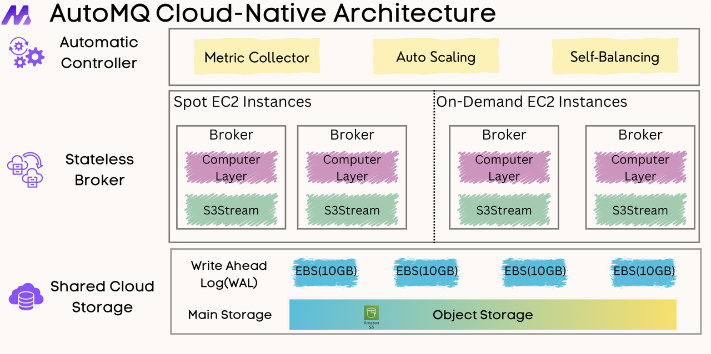
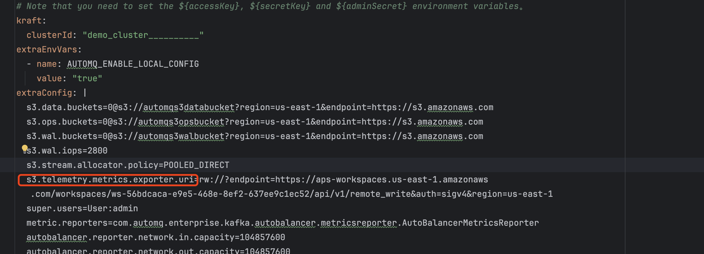
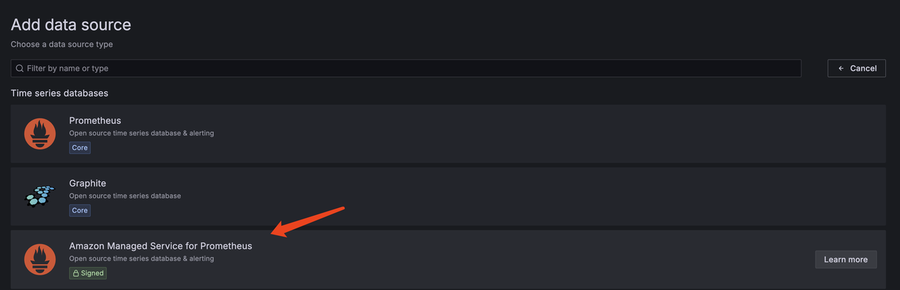

[AutoMQ](https://github.com/AutoMQ/automq) is a Kafka alternative product designed with a cloud-first concept. AutoMQ innovatively redesigns the storage layer of Apache Kafka based on the cloud, and on the basis of 100% compatibility with Kafka, separating persistence to EBS and S3 brings 10x cost reduction and 100x elasticity enhancement, and has better performance than Apache Kafka.



This tutorial will introduce how to fully deploy an AutoMQ cluster on EKS in a few minutes.

## Prepare cloud resources for AutoMQ to use

### Precondition

- Terraform v1.3+
- AWS CLI v2.7.0/v1.24.0 +, reference [installed](https://docs.aws.amazon.com/cli/latest/userguide/getting-started-install.html) and [configured](https://docs.aws.amazon.com/cli/latest/userguide/cli-chap-configure.html)
- [kubectl](https://kubernetes.io/docs/tasks/tools/) v1.24.0+
- AutoMQ Enterprise Edition Helm Chart
- Only [regions](https://docs.aws.amazon.com/prometheus/latest/userguide/what-is-Amazon-Managed-Service-Prometheus.html) with Amazon Managed Service for Prometheus on AWS are supported.
- An AWS key pair with required permissions. AutoMQ needs to create resources such as EKS, VPC, S3 Bucket, Amazon Managed Prometheus, and security groups. Please refer to the Terraform file for the specific resources created.

### Deployment instructions

- An AutoMQ cluster with 3 Controllers (hybrid nodes) and 1 Broker node will be deployed. The configuration of each broker is 2c16g.
- Cluster SASL_PLAIN authentication enabled by default
- The default WAL engine used by the cluster is S3WAL. You can refer to the [official documentation](https://docs.automq.com/automq/architecture/s3stream-shared-streaming-storage/wal-storage) for different WAL Storage implementations of AutoMQ.

### Download the Terraform configuration file and execute

We have prepared a Terraform configuration file that can be used directly by default for you. Clone the project and execute the command in it to start deployment

```bash
git clone https://github.com/awslabs/data-on-eks.git
cd streaming/automq
terraform init
terraform apply
```

After terraform apply is executed, it can automatically create resources such as EKS clusters, VPC networks, and object storage buckets.


### Generate kubeconfig

Make sure that the AWS authentication information has been configured correctly. In the execution directory of Terraform, execute the following command to synchronize kubeconfig. After synchronization is complete, you can use the kubectl command to access the EKS cluster.

```bash
aws eks --region $(terraform output -raw region) update-kubeconfig \
--name $(terraform output -raw cluster_name)
```

## Install AutoMQ Helm Charts

### Install storage class

First, install the [Storage Class](storageclass.yaml) that AutoMQ depends on. Execute the following command:

```
kubectl apply -f storageclass.yaml
```

### Config Value Yaml

This project includes a value yaml [aws.yaml](aws.yaml). Terraform will create an AWS Prometheus Workspace by default. Replace the value of s3.telemetry.metrics.exporter.uri in aws.yaml with the value of automq_prometheus_metrics_uri from the output information after executing terraform apply.



### Install AutoMQ Helm Chart

Then use the project's [aws.yaml](aws.yaml) file as the Value Yaml for Helm Chart. We will use the configuration of this yaml file to install AutoMQ Helm Chart. You can download the AutoMQ chart from [here](https://serverless-100005712758-helm.pkg.coding.net/hellocorp/helm/automq-enterprise/automq-enterprise-1.2.0-rc0.tgz) first.

helm install automq automq-1.2.0-chart-rc0.tgz -f aws.yaml
After installing the Chart, the information of the access point will be printed.
Each Kafka broker can be accessed by producers via port 9092 on the following DNS name(s) from within your cluster:

    automq-automq-controller-0.automq-automq-controller-headless.default.svc.cluster.local:9092
    automq-automq-controller-1.automq-automq-controller-headless.default.svc.cluster.local:9092
    automq-automq-controller-2.automq-automq-controller-headless.default.svc.cluster.local:9092
    automq-automq-broker-0.automq-automq-broker-headless.default.svc.cluster.local:9092

### Use Grafana to Monitor

Terraform has already created AWS Prometheus by default. Refer to the Readme under grafana-demo in the automq-eks-example  project and use the install.sh script to start a Grafana locally. Open the Grafana console at <http://127.0.0.1:3000> (default username and password are both admin):
Add the AWS Prometheus data source plugin.
  

#### Add Amazon Managed Service for Prometheus data source

  

#### Add data source information

The Prometheus server URL required for the data source can be obtained from the `automq_prometheus_server_url` in the terraform output. Long-term credential information is required for authentication. We can access the AWS console to create a new IAM user in the IAM service, create an access key, and assign the following minimal permissions:

```yaml
{
  "Version": "2012-10-17",
  "Statement": [
    {
      "Sid": "VisualEditor0",
      "Effect": "Allow",
      "Action": [
        "aps:RemoteWrite",
        "aps:QueryMetrics",
        "aps:GetMetricMetadata",
        "aps:GetLabels",
        "aps:GetSeries"
      ],
      "Resource": "${YOUR_AMP_ARN}"
    }
  ]
}
```

Fill in the Access & Secret Key credential information for the newly created user on AWS by selecting Access & Secret Key.


#### Verify monitoring data

After the configuration is complete, you can view the monitoring information of AutoMQ through the built-in Grafana template of AutoMQ.


## Send and consume messages

Since SASL is enabled by default, you need to prepare client.properties locally in advance for authentication (admin/admin is the default account and password).

```properties
security.protocol=SASL_PLAINTEXT
sasl.mechanism=SCRAM-SHA-256
sasl.jaas.config=org.apache.kafka.common.security.scram.ScramLoginModule required \
username="admin" \
password="admin";
```

Start a Pod as a Client using AutoMQ's mirroring and copy client.properties files to the /tmp directory of the client pod.

```bash
kubectl run automq-automq-client --restart='Never' --image registry.cn-shanghai.aliyuncs.com/automq/automq:1.1.0 --namespace default --command -- sleep infinity
kubectl cp --namespace default client.properties automq-automq-client:/tmp/client.properties
kubectl exec --tty -i automq-automq-client --namespace default -- bash
```

After entering the client pod, execute the following command in the /opt/automq/kafka directory to complete the message sending and receiving:

```bash

cd /opt/automq/kafka

bin/kafka-console-producer.sh \
--producer.config /tmp/client.properties \
--bootstrap-server automq-automq.default.svc.cluster.local:9092 \
--topic test

bin/kafka-console-consumer.sh \
--consumer.config /tmp/client.properties \
--bootstrap-server automq-automq.default.svc.cluster.local:9092 \
--topic test \
--from-beginning
```
