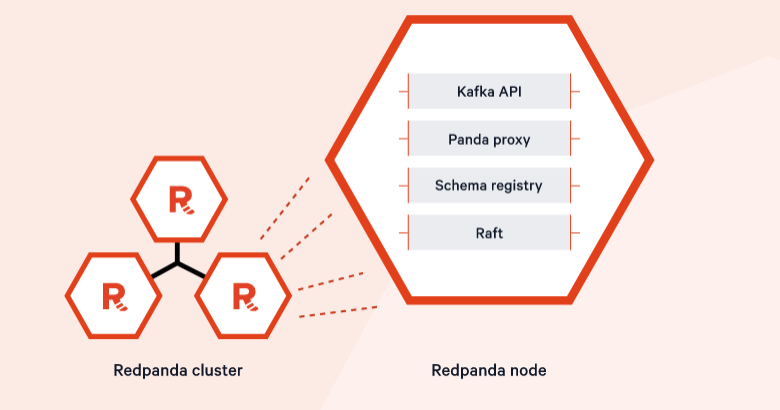

# Redpanda on Amazon EKS
****
Redpanda is a simple, powerful, and cost-efficient streaming data platform that is compatible with Kafka APIs but much less complex, faster and more affordable. Lets take a look at how we can deploy this on Amazon EKS!
****

## Prerequisites

This guide also has the following prerequisites for setting up and deploying Redpanda in EKS.

* Terraform
* AWS-CLI
* Kubectl
* Helm
* jq

****

## Terraform
****
Terraform is an infrastructure as code tool that enables you to safely and predictably provision and manage infrastructure in any cloud. Install the latest.

https://developer.hashicorp.com/terraform/tutorials/aws-get-started/install-cli

****

## AWS-CLI
****
AWS-CLI is a command line tool for managing AWS resources, install the latest version.

https://docs.aws.amazon.com/cli/latest/userguide/getting-started-install.html
****

## Kubectl

Kubectl is a command line tool that is used to communicate with the Kubernetes API server. Install the latest kubectl for your platform from here:

https://docs.aws.amazon.com/eks/latest/userguide/install-kubectl.html

****

## Helm

Helm is used as the Kubernetes package manager for deploying Redpanda. Install the latest version of Helm for your platform from here:

https://helm.sh/docs/intro/install/

****

Provider Versions Tested
| Provider     | Version |
| ----------- | ----------- |
| Terraform      | v1.7.2      |
| Helm      |    v3.14.0   |
| Redpanda   | v5.7.22       |

## Setting up the Cluster

The Redpanda deployment documentation was used extensively in the creation of this guide.  You can view the Redpanda guide at the following location:

https://docs.redpanda.com/current/deploy/deployment-option/self-hosted/kubernetes/eks-guide/

In setting up and configuring our Redpanda cluster in AWS, we are using an Amazon EKS cluster as described in the guide linked above.

We will use Terraform to deploy our AWS Resources (VPC, EKS, EKS add-ons) and our Redpanda Cluster, clone the files from Git.


To stand up the Amazon EKS Cluster and Infrastrucuture, run Terraform init, plan and apply.
```
terraform init
terraform plan
terraform apply --autor-approve
```

After some time, you should see output that includes the message “Congratulations on installing redpanda!”, along with information on your cluster as well as a number of sample commands that you can use.

Create Access to your Amazon EKS Cluster
```
aws eks --region us-west-2 update-kubeconfig --name doeks-redpanda
```
Verify Cluster
```
kubectl get nodes
```
You should see 6 worked nodes, 3 deployed for EKS Add-ons (Cert-Manager, AWS Load Balancer Controller, Monitoring Tools, etc).

## Configuring Environment

In order to utilize our Redpanda Cluster we will need to create some items:

* Export the external certificate that was generated during the prior steps from the Redpanda cluster, and store it in AWS Secrets Manager
* Get our superuser password from AWS Secrets Manager and Setup Environment Variables


We will dive deeper on these steps in the following sections.

## 1/ Export the Certificate and Store into AWS Secrets Manager

Export ourt Cert from Kubernetes, this will be used to access the Redpanda Nodes.

```
kubectl get secret -n redpanda redpanda-external-cert -o go-template='{{ index .data "ca.crt" | base64decode }}' > ca.crt
```

Now we will import this certificate into AWS Secrets Manager so we can use it later

```
aws secretsmanager create-secret --name redpandarootcert --secret-string file://ca.crt

Verify

aws secretsmanager get-secret-value  --secret-id redpandarootcert --output json | jq .SecretString
```

Alternatively this can be done with ACM, please check out this document on how:

## 2/ Setup Environment Variables for Redpanda Cluster

Create Environment Variables, we will pull aws secretsmanager secret we created with Terraform for superuser of cluster, then configure our topic username of "redpanda-twitch-account" and password "changethispassword" which will be used later for testing topics. This is for lab purposes only and you should secure this password.
```
SUPUSER="superuser"
SUPPASS=`aws secretsmanager get-secret-value --secret-id redpanda_password-1234 --query "SecretString" --output text`
REGUSER="redpanda-twitch-account"
REGPASS="changethispassword"

```

## Creating a User

Now that we have set up and deployed the Redpanda cluster, we will need to create a user.  To create the user, determine a username and password you would like to use, and use the following command to create the user:

```
kubectl --namespace redpanda exec -ti redpanda-0 -c redpanda -- \
rpk acl user create $REGUSER \
-p $REGPASS
```

You should see the following output confirming successful creation of the user:

```
Created user "<username>".
```

Save the user name and password in a separate text file for later when SAM is used to deploy the remaining architecture.

## Creating a Topic

Next, we will use the superuser to grant the newly created user permission to execute all operations for a topic called twitch-chat. Feel free to use the topic name of your choice:

```
kubectl exec --namespace redpanda -c redpanda redpanda-0 -- \
  rpk acl create --allow-principal User:$REGUSER \
  --operation all \
  --topic twitch-chat \
  -X user=$SUPUSER -X pass=$SUPPASS -X sasl.mechanism=SCRAM-SHA-512
```

You should then see output similar to the following:

```
PRINCIPAL                     HOST  RESOURCE-TYPE  RESOURCE-NAME  RESOURCE-PATTERN-TYPE  OPERATION  PERMISSION  ERROR
User:redpanda-twitch-account  *     TOPIC          twitch-chat    LITERAL                ALL        ALLOW
```

In the following steps, we are going to use the newly created user account to create the topic, produce messages to the topic, and consumer messages to the topic.

First, we will create an alias to simplify the usage of the rpk commands that will be used to work with the Redpanda deployment.  Use the following command to configure the alias:

```
alias internal-rpk="kubectl --namespace redpanda exec -i -t redpanda-0 -c redpanda -- rpk -X user=$REGUSER -X pass=$REGPASS -X sasl.mechanism=SCRAM-SHA-256"
```

Next, create the topic “twitch-chat” with the following command:

```
internal-rpk topic create twitch-chat
```

You should see the following output after executing the above command:

```
TOPIC        STATUS
twitch-chat  OK
```

View the details of the topic just created by executing the following command:

```
internal-rpk topic describe twitch-chat
```

## Produce and Consume Messages

Now use the following command to interactively produce messages to the topic:

```
internal-rpk topic produce twitch-chat
```

Type in some text and press enter to publish the message.  After publishing several messages, use ctrl+C to end the publishing command.

The output should look something like the following:

```
hello world
Produced to partition 0 at offset 0 with timestamp 1702851801374.
hello world 2
Produced to partition 0 at offset 1 with timestamp 1702851806788.
hello world 3
Produced to partition 0 at offset 2 with timestamp 1702851810335.
hello world 4
Produced to partition 0 at offset 3 with timestamp 1702851813904.
^Ccommand terminated with exit code 130
```

Next, use the following command to consume one message from the topic:

```
internal-rpk topic consume twitch-chat --num 1
```

The output should look similar to the following:

```
{
  "topic": "twitch-chat",
  "value": "hello world",
  "timestamp": 1702851801374,
  "partition": 0,
  "offset": 0
}
```
## Accessing the Redpanda Console

Having verified that you can produce and consume messages, next we will access the Redpanda Console by port forwarding to our localhost.  This can be done using the following command:

```
kubectl --namespace redpanda port-forward svc/redpanda-console 8080:8080
```

**Note:** If you are using Cloud9, you will need to use the following alternate command to do the port forwarding:

```
kubectl --namespace redpanda port-forward --address 0.0.0.0 svc/redpanda-console 8080:8080
```

You will also need to allow traffic on port 8080 coming from your IP address to your localhost.  If you are using Cloud9 as described in this guide, you will need to edit the security group of your Cloud9 instance to allow port 8080 inbound with a source of “My IP”.

Do not allow full public access to port 8080, as the Redpanda Community Edition license does not enable authentication on the Redpanda Console.

Once you are able to access the Redpanda Console, you can view information about your brokers, IP addresses and IDs, as well as information on your topics.  You can view the messages produced to your topics, and produce additional messages to topics using the web interface.


## Conclusion

With the Redpanda cluster now configured in EKS, you can now dive deeper by integrating with other AWS services, Creating Consumer and Producers.


* * *
* * *
