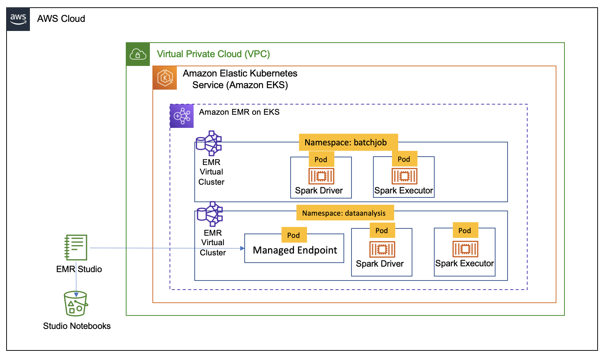

## Introduction

In this blog we will show you how you can use AWS CDK and the [Analytics Reference Architecture](https://aws.amazon.com/blogs/opensource/adding-cdk-constructs-to-the-aws-analytics-reference-architecture/) (ARA) library to deploy an end to end data analytics platform. This platform will allow you to run Spark interactive Session in Jupyter notebook with EMR Studio supported by EMR on EKS and run Spark jobs with EMR on EKS. The architecture below shows the infrasturcture you will deploy using the CDK and ARA library.



## [Analytics Reference Architecture](https://aws.amazon.com/blogs/opensource/adding-cdk-constructs-to-the-aws-analytics-reference-architecture/)

AWS Analytics Reference Architecture (ARA) exposes set fo reusable core components in an AWS CDK library, currently available in Typescript and Python. This library contains AWS CDK constructs (L3) that can be used to quickly provision analytics solutions in demos, prototypes, proofs of concept, and end-to-end reference architectures. The API of ARA Library is defined [here](https://constructs.dev/packages/aws-analytics-reference-architecture/v/2.4.11?lang=typescript).

In our case the library help you deploy an infrastructure optimised for Apache Spark running on EKS leveraging EMR on EKS. The infrastructure will out of the box provide you with pod collocation to reduce network traffic, deploy nodegroup in a single AZ to reduce cross AZ traffic during shuffle, use dedicated instances for EMR on EKS, use optimized instances for memory intensive jobs, use spot and on-demand instances for non-critical job and for critical jobs.

## Prerequisites

Ensure that you have installed the following tools on your machine.

1. [aws cli](https://docs.aws.amazon.com/cli/latest/userguide/install-cliv2.html)
2. [kubectl](https://Kubernetes.io/docs/tasks/tools/)
3. [CDK](https://docs.aws.amazon.com/cdk/v2/guide/getting_started.html#getting_started_install)

## Solution

To deploy the data platform we will use an example in the `Analytics Reference Architecture`. The example is in the directory `examples/emr-eks-app` that you will find in the repository you will clone below.

Clone the repository

```bash
git clone https://github.com/aws-samples/aws-analytics-reference-architecture.git
```

This solution will deploy the following:

- EKS cluster and a set of Nodegroups:

    - Managed Nodegroup called tooling for running system critical pods. e.g., Cluster Autoscaler, CoreDNS, EBS CSI Driver..
    - Three Managed Nodegroup called critical for critical jobs, each in one AZ, this nodegroup use on-demand instances
    - Three Managed Nodegroup called non-critical for non-critical jobs, each in one AZ, this nodegroup use spot instances
    - Three Managed Nodegroup called notebook-driver for non-critical jobs, each in one AZ, this nodegroup use on-demand instances to have a stable driver.
    - Three Managed Nodegroup called notebook-executor for non-critical jobs, each in one AZ, this nodegroup use spot instances instances for executors.

- Enable EKS Cluster to be with with EMR on EKS service
- EMR Virtual Cluster called `batchjob`, used to submitted jobs
- EMR Virtual Cluster called `emrvcplatform`, used to submitted jobs
- EMR Studio called `platform`
- A `managed endpoint`, called `platform-myendpoint` , to use with Jupyter notebooks you will create in the EMR Studio
- [Execution role](https://docs.aws.amazon.com/emr/latest/EMR-on-EKS-DevelopmentGuide/iam-execution-role.html) to use when submiting jobs with EMR on EKS `start-job-run`
- Execution role to use with managed endpoint.  
- pod templates stored in an S3 bucket called "EKS-CLUSTER-NAME-emr-eks-assets-ACCOUNT-ID-REGION"

### Customize

The infrastructure described above is defined in `emr-eks-app/lib/emr-eks-app-stack.ts`. If you want to customize it you can change the values in it. For example, you can chose not to create the default nodegroup to use for `jobs`, in this case you can set the `defaultNodeGroups` parameter to `false` in the `EmrEksCluster`. You can also call the `addEmrEksNodegroup` method to define your own nodegroups with specific labels, instances or taints. The `addEmrEksNodegroup` method is defined [here](https://constructs.dev/packages/aws-analytics-reference-architecture/v/2.4.11/api/EmrEksCluster?lang=typescript#addEmrEksNodegroup).

You can also create your own execution role through the `createExecutionRole` [method](https://constructs.dev/packages/aws-analytics-reference-architecture/v/2.4.11/api/EmrEksCluster?lang=typescript#createExecutionRole) or create a managed endpoint to attach it to an EMR Studio you deployed outside of the ARA library.

In order to simplify this example we use IAM authentication with IAM user for `EMR Studio`. If you would like to use a user in the `AWS IAM Identity Center` you can change `studioAuthMode` in the `NotebookPlatform` construct. Below you will can see the code snipet that you need to change.

```ts
const notebookPlatform = new ara.NotebookPlatform(this, 'platform-notebook', {
      emrEks: emrEks,
      eksNamespace: 'dataanalysis',
      studioName: 'platform',
      studioAuthMode: ara.StudioAuthMode.IAM,
      });
```

### Deploy

Before you run the solution, you **MUST** change the `eksAdminRoleArn` of the `props` object of `EmrEksCluster` in `lib/emr-eks-app-stack.ts`. This role allows you to interact manage EKS cluster and should have be allowed at least the IAM action `eks:AccessKubernetesApi`. You need to also change the `identityName` in the `addUser` method of the `NotebookPlatform` construct. The identityName **MUST BE** a valid IAM username that you use. Below you will can see the code snipet that you need to change.

```ts
notebookPlatform.addUser([{
        identityName:'',
        notebookManagedEndpoints: [{
        emrOnEksVersion: 'emr-6.8.0-latest',
        executionPolicy: emrEksPolicy,
        managedEndpointName: 'myendpoint'
              }],
      }]);
```

Last you shold also update the IAM policies passed to the `createExecutionRole`, if you want to process data that is in S3 buckets that you own.

Navigate into one of the example directories and run `cdk synth --profile YOUR-AWS-PROFILE`

```bash
cd examples/emr-eks-app
npm install
cdk synth --profile YOUR-AWS-PROFILE
```

Once the synth is completed you can deploy the infrastructrue with the following command:

```bash
cdk deploy
```

At the end of the deployment you will see output like follow:


In the output you will find job sample configurations with the best practices for Spark on Kubernetes like `dynamicAllocation` and `pod collocation`.

### Job submission

In this example we will use the `crittical-job` job configuration to submit a job using that will compute `pi` using that is part of Spark distribution.
To submit a job we will use Below you use `start-job-run` command with AWS CLI.

Before you run the command below, make sure to change update the following parameters with the on created by your own deployment.
    - <CLUSTER-ID> – The EMR virtual cluster ID, which you get from the AWS CDK output
    - <SPARK-JOB-NAME> – The name of your Spark job
    - <ROLE-ARN> – The execution role you created, which you get from the AWS CDK output
    - <S3URI-CRITICAL-DRIVER> – The Amazon S3 URI of the driver pod template, which you get from the AWS CDK output
    - <S3URI-CRITICAL-EXECUTOR> – The Amazon S3 URI of the executor pod template, which you get from the AWS CDK output
    - <Log_Group_Name> – Your CloudWatch log group name
    - <Log_Stream_Prefix> – Your CloudWatch log stream prefix


<details>
<summary>AWS CLI for start-job-run command</summary>

```bash

aws emr-containers start-job-run \
    --virtual-cluster-id CLUSTER-ID\
    --name=SPARK-JOB-NAME\
    --execution-role-arn ROLE-ARN \
    --release-label emr-6.8.0-latest \
    --job-driver '{
        "sparkSubmitJobDriver":{
        "entryPoint": "local:///usr/lib/spark/examples/src/main/python/pi.py"
        }
    }' \
    --configuration-overrides '{
        "applicationConfiguration": [
            {
                "classification": "spark-defaults",
                "properties": {
                    "spark.hadoop.hive.metastore.client.factory.class": "com.amazonaws.glue.catalog.metastore.AWSGlueDataCatalogHiveClientFactory",
                    "spark.sql.catalogImplementation": "hive",
                    "spark.dynamicAllocation.enabled":"true",
                    "spark.dynamicAllocation.minExecutors": "8",
                    "spark.dynamicAllocation.maxExecutors": "40",
                    "spark.kubernetes.allocation.batch.size": "8",
                    "spark.executor.cores": "8",
                    "spark.kubernetes.executor.request.cores": "7",
                    "spark.executor.memory": "28G",
                    "spark.driver.cores": "2",
                    "spark.kubernetes.driver.request.cores": "2",
                    "spark.driver.memory": "6G",
                    "spark.dynamicAllocation.executorAllocationRatio": "1",
                    "spark.dynamicAllocation.shuffleTracking.enabled": "true",
                    "spark.dynamicAllocation.shuffleTracking.timeout": "300s",
                    "spark.kubernetes.driver.podTemplateFile": "s3://EKS-CLUSTER-NAME-emr-eks-assets-ACCOUNT-ID-REGION/EKS-CLUSTER-NAME/pod-template/critical-driver.yaml",
                    "spark.kubernetes.executor.podTemplateFile": "s3://EKS-CLUSTER-NAME-emr-eks-assets-ACCOUNT-ID-REGION/EKS-CLUSTER-NAME/pod-template/critical-executor.yaml"
                }
            }
        ],
        "monitoringConfiguration": {
            "cloudWatchMonitoringConfiguration": {
                "logGroupName": "Log_Group_Name",
                "logStreamNamePrefix": "Log_Stream_Prefix"
            }
        }
    }'
```
</details>

Verify the job execution

```bash
kubectl get pods --namespace=batchjob -w
```

### Interactive session

To use an interactive session, you should log in to the EMR Studio instance with the URL provided to you at the end of `cdk deploy`.
This link will be in the form of `https://es-xxxxx/emrstudio-prod-REGION.amazonaws.com`.
Once you click on the link you will be see a log in page where you **MUST** sign-in with the username provided to the `addUser` method. When you sign in you should follow these steps.

1. Create workspace, this will start for a Jupyter notebook
2. Connect to the Jupter notebook
3. Attach to a Virtual cluster, this would be have the following name "emrvcplatform" and chose an endpoint called "platform-myendpoint"
4. Open a notebook and select the PySpark kernel
5. You are now ready to perform analyse your data with Spark running on EMR on EKS.

## Cleanup

To clean up your environment, you call the command below. This will destroy the EKS cluster with Node groups and VPC

```bash
cdk destroy
```

:::caution

To avoid unwanted charges to your AWS account, delete all the AWS resources created during this deployment
:::
