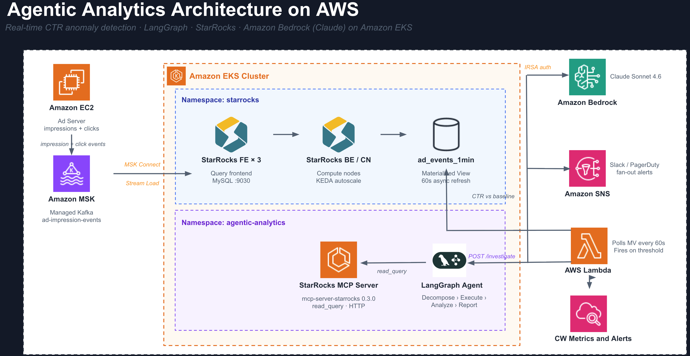
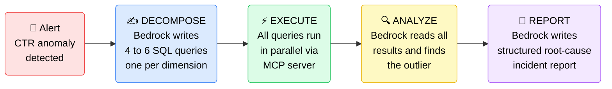

import '@site/src/css/datastack-tiles.css';

# Agentic Ad Intelligence: Real-Time Issue Detection

<div className="showcase-tags" style={{marginBottom: '2rem'}}>
<span className="tag infrastructure">LangGraph</span>
<span className="tag guide">Amazon Bedrock</span>
<span className="tag infrastructure">StarRocks</span>
<span className="tag guide">MCP Server</span>
<span className="tag infrastructure">Claude Sonnet 4.6</span>
<span className="tag guide">Real-time Analytics</span>
</div>

# Agentic Ad Intelligence: Real-Time Issue Detection

An autonomous AI agent that investigates ad performance anomalies and delivers a root-cause report without any human intervention. Built on LangGraph, Amazon Bedrock (Claude), StarRocks, and the official StarRocks MCP server, all running as Kubernetes workloads on Amazon EKS.


## Production Architecture

The diagram below shows the full production data flow. The demo in this guide uses the same agent, schema, and MCP server, but substitutes a batch seed job for Kafka and manual triggering for the CTR Monitor. Those differences are covered in the [Demo vs Production](#demo-vs-production) section at the end.



---

## What This Agent Does

You run **Amazon Ads**. Advertisers (Nike, Netflix, Spotify) submit creatives and budgets through your portal. Your ad server decides when and where to show each creative, and generates every impression and click event. You own the entire pipeline.

When a broken click-tracking URL ships in a live campaign, impressions keep running and budget keeps burning while clicks register as zero. The problem is real but invisible until someone looks at the right query at the right time.

This agent watches your ad metrics continuously. When CTR drops beyond a threshold for any advertiser, it runs its own investigation across all dimensions simultaneously, identifies the exact root cause, and delivers a written incident report with a recommended action. No engineer needs to be involved.

---

## How the Agent Works

The agent is a 4-step LangGraph state machine. Each step is a discrete reasoning task executed by Amazon Bedrock (Claude).



<details>
<summary><strong>Step 1: DECOMPOSE</strong></summary>

Amazon Bedrock (Claude) receives the alert and the database schema. It produces 4 to 6 complete SQL queries covering every relevant dimension, without any guidance on which queries to run.

Typical queries generated:

- CTR by `creative_id`: current 15-min window vs. prior 60-min baseline
- CTR by `placement_id`: is the drop isolated to one ad slot?
- CTR by `device_type`: is mobile click tracking broken?
- CTR by `country_code`: is this a geo-specific issue?
- CTR over time: when did the drop begin?

Each query uses `UNION ALL` to compare current and baseline windows in a single round-trip.

</details>

<details>
<summary><strong>Step 2: EXECUTE</strong></summary>

All queries fire simultaneously against StarRocks via the MCP server's `read_query` tool over Streamable-HTTP. StarRocks scans across all dimensions in parallel. There is no sequential waiting between queries.

The MCP protocol gives the AI a structured, read-only interface to the database. The agent never constructs direct database connections or handles credentials.

</details>

<details>
<summary><strong>Step 3: ANALYZE</strong></summary>

Amazon Bedrock (Claude) reads all query results and identifies the dimension value that is statistically anomalous versus the baseline. It rules out healthy dimensions explicitly.

Example output from this step:

```
creative_id=8821  0.00% CTR  (48,000 impressions, 0 clicks)
All other creatives  ~1.72% CTR  (normal baseline)
device_type   all normal
country_code  all normal
placement_id  all normal

Root cause: isolated to creative_id=8821, not a systemic failure
```

</details>

<details>
<summary><strong>Step 4: REPORT</strong></summary>

Amazon Bedrock (Claude) writes a markdown incident report with four sections:

- **Root Cause**: exact dimension, value, and magnitude of the drop
- **Evidence**: the actual query numbers
- **Impact**: impressions wasted, budget burned, scope of the issue
- **Recommended Action**: pause the creative, audit the click URL, notify the advertiser

The report is returned as structured JSON and can be routed directly to Slack, PagerDuty, or an auto-remediation API.

</details>

---

## Understanding the Data

Each row in `ad_events` is a batch of activity recorded by your ad server when it serves a creative to a user:

| Column | Meaning | Example |
|---|---|---|
| `advertiser_id` | The company whose ad was shown (Nike = 42, Netflix = 99) | `42` |
| `creative_id` | The specific artwork or video asset | `8821` |
| `placement_id` | Where on your platform the ad appeared (Amazon.com, Fire TV, Twitch) | `103` |
| `device_type` | The user's device | `mobile` |
| `country_code` | Where the user is | `US` |
| `impressions` | How many times this creative was displayed | `500` |
| `clicks` | How many users clicked it | `0` |

CTR is the health signal:

```
CTR % = (clicks / impressions) x 100

Healthy : 500 impressions, 10 clicks  =  2.0% CTR
Broken  : 500 impressions,  0 clicks  =  0.0% CTR
```

The `ad_events_1min` materialized view pre-computes CTR rollups per minute. The CTR Monitor and the agent both query this view for fast anomaly detection without hitting the raw table on every poll.

---

## Prerequisites

**Step 1: StarRocks on EKS** must be deployed before running this example. See [StarRocks on EKS](/docs/datastacks/databases/starrocks-on-eks/infra) for the full infrastructure guide.

The following must be ready before proceeding:

- StarRocks Shared-Data cluster running in the `starrocks` namespace on your EKS cluster
- Pod `starrocks-shared-data-fe-0` in `Running` state
- `kubectl` configured with the correct context
- AWS CLI authenticated with permissions to create IAM roles
- Amazon Bedrock model access enabled for `us.anthropic.claude-sonnet-4-6`

:::note Enable Bedrock Model Access
In the AWS Console, go to **Amazon Bedrock > Model Access** and request access to **Claude Sonnet 4.6**. The agent cannot call the model until access is granted.
:::

---

## Deploy

### Part 1: Deploy the StarRocks Data Stack

Clone the repository and navigate to the StarRocks stack:

```bash
git clone https://github.com/awslabs/data-on-eks.git
cd data-on-eks/data-stacks/starrocks-on-eks
```

Review and edit `terraform/data-stack.tfvars` if needed. The defaults deploy a StarRocks-only stack:

```hcl
# terraform/data-stack.tfvars
name   = "starrocks-on-eks"
region = "us-east-1"

enable_starrocks = true

# Enable additional components only if needed for your use case
enable_kafka                = false
enable_amazon_prometheus    = false
enable_spark_operator       = false
```

Run the deploy script:

```bash
export AWS_REGION=us-east-1
./deploy.sh
```

This provisions the EKS cluster, installs the StarRocks operator via ArgoCD, and deploys the StarRocks Shared-Data cluster. When it completes, verify the FE pod is running:

```bash
kubectl get pods -n starrocks
```

The pod `starrocks-shared-data-fe-0` must be `Running` before continuing.

### Part 2: Deploy the Agentic Analytics Demo

Set your environment variables:

```bash
export ACCOUNT_ID=$(aws sts get-caller-identity --query Account --output text)
export CLUSTER=starrocks-on-eks
export REGION=us-east-1
export CONTEXT=starrocks-on-eks
```

Navigate to the example directory and run the deploy script:

```bash
cd examples/agentic-analytics
./kubectl-deploy.sh
```

:::warning Demo only — not for production
`kubectl-deploy.sh` is a fast-path demo script. It stores agent source code in a Kubernetes ConfigMap and installs Python dependencies via a uv init container at pod start. This approach has no startup caching, no image scanning, and no GitOps audit trail.

**For production**, build purpose-built container images and deploy them through ArgoCD, Helm, or your standard GitOps pipeline:

1. Build `agent/Dockerfile` → push to ECR (or your registry):
   ```bash
   docker build -t $ECR_REGISTRY/agentic-analytics-agent:latest agent/
   docker push $ECR_REGISTRY/agentic-analytics-agent:latest
   ```
2. Build `mcp-server/Dockerfile` → push to ECR:
   ```bash
   docker build -t $ECR_REGISTRY/starrocks-mcp-server:latest mcp-server/
   docker push $ECR_REGISTRY/starrocks-mcp-server:latest
   ```
3. Reference those image URIs in standard Kubernetes Deployments (no ConfigMap, no uv init container).
4. For the IAM role, use `iam-policy.json` with Terraform (`aws_iam_policy` + `aws_iam_role`) or `eksctl` instead of the inline `aws iam` CLI calls in `kubectl-deploy.sh`.
5. Apply via ArgoCD `Application` manifest or `helm install` — the same Deployments, Service, and IRSA annotations, delivered through your GitOps pipeline.

The agent logic (`agent/app.py`), StarRocks schema, and LangGraph state machine are identical in both approaches. Only the delivery mechanism changes.
:::

The script runs these steps in order:

| Step | What it does |
|---|---|
| IRSA | Creates IAM role `agentic-analytics-agent-role` with `bedrock:InvokeModel` scoped to the agent service account |
| Namespace | Creates the `agentic-analytics` namespace and service accounts |
| Schema | Applies `starrocks-schema.sql` to create the `ad_events` table and `ad_events_1min` materialized view |
| ConfigMaps | Stores the agent and seed-job Python source as Kubernetes ConfigMaps |
| MCP Server | Deploys `mcp-server-starrocks==0.3.0` with Streamable-HTTP transport on port 8000 |
| Agent | Deploys the LangGraph agent as a FastAPI app on port 8080, using Bedrock via IRSA |
| Seed Job | Inserts synthetic ad events with a pre-injected CTR anomaly on `creative_id=8821` |

:::note
The MCP server uv init container takes about 60 seconds on first run. The seed job runs to completion before the script exits.
:::

Verify all pods are healthy:

```bash
kubectl --context $CONTEXT get pods -n agentic-analytics
```

```
NAME                          READY   STATUS      RESTARTS   AGE
agent-xxxxxxxxx-xxxxx        1/1     Running     0          2m
mcp-server-xxxxxxxxx-xxxxx   1/1     Running     0          2m
seed-data-xxxxx              0/1     Completed   0          3m
```

Confirm the data is in StarRocks:

```bash
kubectl --context $CONTEXT exec -n starrocks starrocks-shared-data-fe-0 -- \
  mysql -h 127.0.0.1 -P 9030 -u root \
  -e "USE ad_analytics; SHOW TABLES; SELECT COUNT(*) FROM ad_events;"
```

Expected: two tables (`ad_events`, `ad_events_1min`) and a row count of 1,000,000.

---

## Running the Demo

Run the interactive demo script from the example directory:

```bash
cd data-stacks/starrocks-on-eks/examples/agentic-analytics
CONTEXT=$CONTEXT ./demo.sh
```

The script runs through five phases automatically:

**Phase 1: Pre-flight check**
Queries the StarRocks cluster to show current pod status, total row count, latest event timestamp, and a preview of the injected anomaly so you know what the agent is about to find.

**Phase 2: Timestamp refresh**
If the seed data is older than 15 minutes (the query window), the script runs an `INSERT OVERWRITE` to shift all timestamps forward to `NOW()`. This keeps the time-window queries returning active rows without re-seeding.

**Phase 3: Live agent progress**
Streams pod logs from the agent container as the investigation runs. You see each step labelled in real time: DECOMPOSE, EXECUTE (with per-query timings), ANALYZE, and REPORT.

**Phase 4: Full trace render**
Prints the complete investigation trace with color formatting: the SQL queries Amazon Bedrock (Claude) wrote, the raw results from each MCP tool call, the outlier analysis, and the final incident report.

**Phase 5: Report saved**
Writes the investigation output to `./reports/investigation_<timestamp>.md` and `./reports/investigation_<timestamp>.json` for reference.

### Monitor the agent during a run

To watch the agent logs directly in a second terminal:

```bash
kubectl --context $CONTEXT logs -f deploy/agent -n agentic-analytics
```

Key log lines to watch for:

```
=== DECOMPOSE ===       # Bedrock is writing SQL queries
Decompose 14.2s         # N queries planned
=== EXECUTE ===         # MCP tool calls firing in parallel
read_query [creative_id] 312ms
read_query [placement_id] 287ms
=== ANALYZE ===         # Bedrock reading all results
=== REPORT ===          # Bedrock writing the incident report
```

### Re-seeding for repeated demos

The seed data uses timestamps relative to the time it was inserted. Re-seed before each demo session so the data stays within the 15-minute query window:

```bash
CONTEXT=$CONTEXT ./reseed.sh
```

Run the demo within 15 minutes of re-seeding.

### Cleanup

To tear down all resources created by the deploy script (IAM role, Kubernetes namespace, and StarRocks database):

```bash
export ACCOUNT_ID=$(aws sts get-caller-identity --query Account --output text)
export CLUSTER=starrocks-on-eks
export REGION=us-east-1
CONTEXT=$CONTEXT ./cleanup.sh
```

The script is idempotent — safe to run multiple times. It handles already-deleted resources gracefully.

---

## Sample Agent Output

A successful investigation returns a JSON response with three top-level fields:

**`report`**: the written incident report

```markdown
## Root Cause
creative_id 8821 recorded 0 clicks across 48,000 impressions in the last 15 minutes.

## Evidence
Baseline CTR (prior 60 min): 1.72%
Current CTR (last 15 min):   0.00%
Drop magnitude:              100%
All other creatives, placements, devices, and countries are within normal range.

## Impact
48,000 impressions delivered with zero return. Budget burn rate continues until the creative is paused.

## Recommended Action
Pause creative_id 8821 immediately. Audit the click tracking URL submitted by advertiser_42.
Check for expired pixels, broken redirect chains, or malformed UTM parameters.
```

**`analysis`**: the one-paragraph outlier finding from the Analyze step

**`trace`**: full transparency into the investigation

```json
{
  "plan": [
    { "dimension": "creative_id",   "description": "Compare CTR by creative vs 60-min baseline" },
    { "dimension": "placement_id",  "description": "Detect ad-slot-specific failures" },
    { "dimension": "device_type",   "description": "Identify mobile tracking breakage" },
    { "dimension": "country_code",  "description": "Check for geo-specific outages" }
  ],
  "tool_calls": [
    {
      "dimension": "creative_id",
      "sql": "SELECT creative_id, ROUND(SUM(clicks)/NULLIF(SUM(impressions),0)*100,4) AS ctr_pct ...",
      "elapsed_ms": 312,
      "preview": "creative_id,ctr_pct\n8821,0.0000\n1005,1.8200\n1012,1.7400"
    }
  ],
  "timing": {
    "decompose_s": 14.2,
    "execute_s": 0.4,
    "analyze_s": 8.1,
    "report_s": 9.7,
    "total_s": 33.1
  }
}
```

The `tool_calls` array shows exactly what SQL Amazon Bedrock (Claude) wrote and what data it received back. Every step of the reasoning chain is auditable.

---

## Production Enhancements

The demo proves the agent pattern end-to-end. Promoting this to production involves replacing the demo shortcuts with production-grade components. The agent code itself (`app.py`), the StarRocks schema, and the LangGraph state machine do not change.

### Real-time ingestion with Kafka

In the demo, a Python seed job inserts rows once. In production, your ad server publishes to a Kafka topic and StarRocks ingests continuously:

```yaml
# StarRocks Kafka Connector
connector.class: com.starrocks.connector.kafka.StarRocksSinkConnector
topics: ad-impression-events
starrocks.http.url: http://starrocks-fe-service:8030
starrocks.database.name: ad_analytics
starrocks.table.name: ad_events
starrocks.format: JSON
```

New events are visible in StarRocks within seconds of being produced. The `ad_events_1min` materialized view refreshes automatically every minute, so the CTR Monitor is always working against current data.

### Autonomous CTR Monitor

Replace manual `./demo.sh` invocation with a long-running Deployment that polls `ad_events_1min` and calls the agent automatically:

```python
while True:
    anomalies = starrocks.query("""
        SELECT
            cur.advertiser_id,
            cur.ctr_pct     AS ctr_now,
            base.ctr_pct    AS ctr_baseline
        FROM (
            SELECT advertiser_id,
                   ROUND(SUM(clicks)/NULLIF(SUM(impressions),0)*100, 4) AS ctr_pct
            FROM ad_events_1min
            WHERE ts_minute >= NOW() - INTERVAL 5 MINUTE
            GROUP BY advertiser_id
        ) cur
        JOIN (
            SELECT advertiser_id,
                   ROUND(SUM(clicks)/NULLIF(SUM(impressions),0)*100, 4) AS ctr_pct
            FROM ad_events_1min
            WHERE ts_minute BETWEEN NOW() - INTERVAL 65 MINUTE AND NOW() - INTERVAL 5 MINUTE
            GROUP BY advertiser_id
        ) base USING (advertiser_id)
        WHERE cur.ctr_pct < base.ctr_pct * 0.80
    """)
    for row in anomalies:
        requests.post("http://agent.agentic-analytics/investigate", json={
            "question": f"CTR dropped for advertiser_{row.advertiser_id}. Find the root cause.",
            "advertiser_id": row.advertiser_id,
        })
    time.sleep(60)
```

### Alert routing

The agent returns a structured JSON report. Wire it to your existing alert channels after the LangGraph graph completes:

```python
result = await graph.ainvoke(state)

slack_client.chat_postMessage(
    channel="#ads-oncall",
    text=f":rotating_light: *Ad Anomaly*\n{result['report']}"
)

if result["analysis"].startswith("creative_id"):
    pagerduty.create_incident(severity="P2", body=result["report"])
    ads_api.pause_creative(advertiser_id=state["advertiser_id"], creative_id=detected_id)
```

### Multi-node StarRocks for production scale

The demo uses a single-node StarRocks. For production traffic with billions of events, configure HA FE nodes and KEDA-managed CN autoscaling:

```yaml
spec:
  starRocksFeSpec:
    replicas: 3
  starRocksCnSpec:
    replicas: 5
    autoScalingPolicy:
      minReplicas: 0
      maxReplicas: 20
```

See [StarRocks on EKS](/docs/datastacks/databases/starrocks-on-eks/infra) for the full KEDA autoscaling configuration.

### Agent observability

Add Prometheus instrumentation to track investigation latency, throughput, and cost:

```python
from prometheus_client import Histogram, Counter

investigation_seconds = Histogram(
    "agent_investigation_duration_seconds",
    "Time per investigation",
    labelnames=["step"]
)
investigations_total = Counter(
    "agent_investigations_total",
    "Investigations completed",
    labelnames=["outcome"]
)
```

Useful metrics to expose:

- Duration per step (decompose, execute, analyze, report)
- Investigations per advertiser per hour
- Root cause dimension distribution (which dimension triggers most alerts)
- Amazon Bedrock token usage per investigation

### Production readiness checklist

| Item | Priority | Notes |
|---|---|---|
| Kafka Connector for real-time ingestion | High | Replaces seed job |
| CTR Anomaly Monitor deployment | High | Replaces manual demo.sh trigger |
| Slack and PagerDuty routing | High | Replaces local report file |
| Multi-FE StarRocks (3 replicas) | High | Config-only change |
| KEDA autoscaling for CN nodes | Medium | Already supported by the stack |
| Prometheus metrics on agent | Medium | Instrument app.py |
| Auto-remediation via Ads API | Medium | Add post-report hook |

---

## Demo vs Production {#demo-vs-production}

| Component | Demo | Production |
|---|---|---|
| Deployment tooling | `kubectl-deploy.sh` (demo script, no Docker required) | Docker images in ECR, deployed via ArgoCD or Helm |
| Agent packaging | Python source in a Kubernetes ConfigMap, uv at pod start | Purpose-built image from `agent/Dockerfile` |
| MCP server packaging | `mcp-server-starrocks` installed via uv init container | Purpose-built image from `mcp-server/Dockerfile` |
| IAM role creation | Inline `aws iam` CLI calls in `kubectl-deploy.sh` | Terraform `aws_iam_policy` using `iam-policy.json` |
| Data ingestion | Batch Python seed job, inserted once | Kafka Connector, continuous Stream Load |
| Data freshness | `INSERT OVERWRITE` shifts timestamps to `NOW()` | Kafka keeps data live automatically |
| Alert trigger | `./demo.sh` run manually | CTR Anomaly Monitor fires automatically |
| StarRocks cluster | Single-node shared-data | Multi-FE, KEDA-scaled CN nodes |
| Report delivery | Saved to `./reports/` as markdown | Slack, PagerDuty, auto-remediation |
| Anomaly source | Pre-seeded `creative_id=8821` with near-zero CTR | Emerges from real advertiser traffic |
| IRSA auth | Same | Same |
| Agent code | Same | Same |
| StarRocks schema | Same | Same |
| LangGraph state machine | Same | Same |

---

## Source Code

All files are in [`data-stacks/starrocks-on-eks/examples/agentic-analytics/`](https://github.com/awslabs/data-on-eks/tree/main/data-stacks/starrocks-on-eks/examples/agentic-analytics):

| File | Purpose |
|---|---|
| `kubectl-deploy.sh` | Demo deploy: IRSA, schema, ConfigMaps, MCP server, agent, and seed job — no Docker required |
| `cleanup.sh` | Tears down all resources created by `kubectl-deploy.sh` — IAM role, K8s namespace, and StarRocks database |
| `demo.sh` | Interactive demo with pre-flight checks, live log streaming, and colored trace output |
| `reseed.sh` | Truncates and re-inserts data with current timestamps before each demo session |
| `base.yaml` | Namespace, StarRocks credentials Secret, and service accounts — applied as one manifest |
| `iam-policy.json` | IAM policy granting `bedrock:InvokeModel` — reference document for production IaC (Terraform `aws_iam_policy` or `eksctl`). `kubectl-deploy.sh` inlines this policy directly via the AWS CLI and does not read this file. |
| `starrocks-schema.sql` | DDL for the `ad_events` table and `ad_events_1min` materialized view |
| `agent/app.py` | LangGraph agent: the 4-step Decompose, Execute, Analyze, Report state machine |
| `agent/pyproject.toml` | Python project definition with pinned dependencies (uv-managed) |
| `agent/Dockerfile` | Container image for production deployment of the agent |
| `mcp-server/pyproject.toml` | Python project definition for the MCP server wrapper (uv-managed) |
| `mcp-server/Dockerfile` | Container image for production deployment of the StarRocks MCP server |
| `seed-job/seed_data.py` | Synthetic data generator with the injected CTR anomaly on `creative_id=8821` |
| `seed-job/pyproject.toml` | Python project definition for the seed job (uv-managed) |
