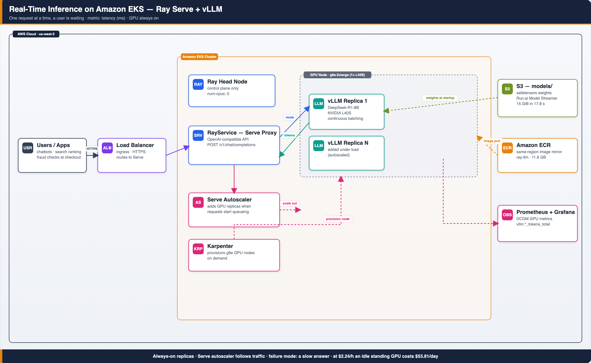
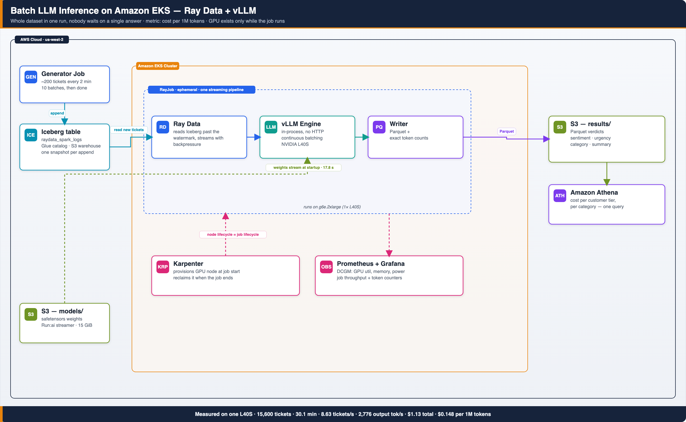
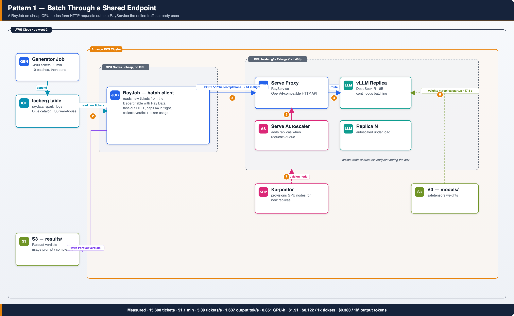
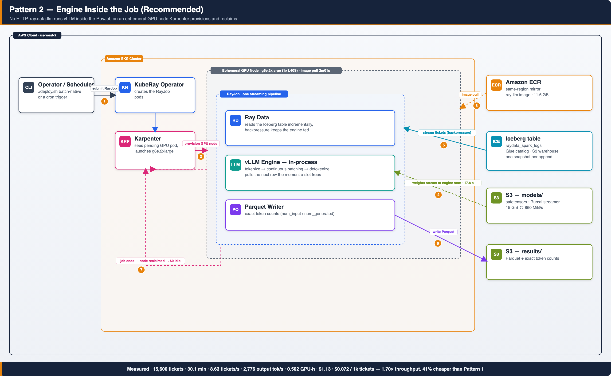
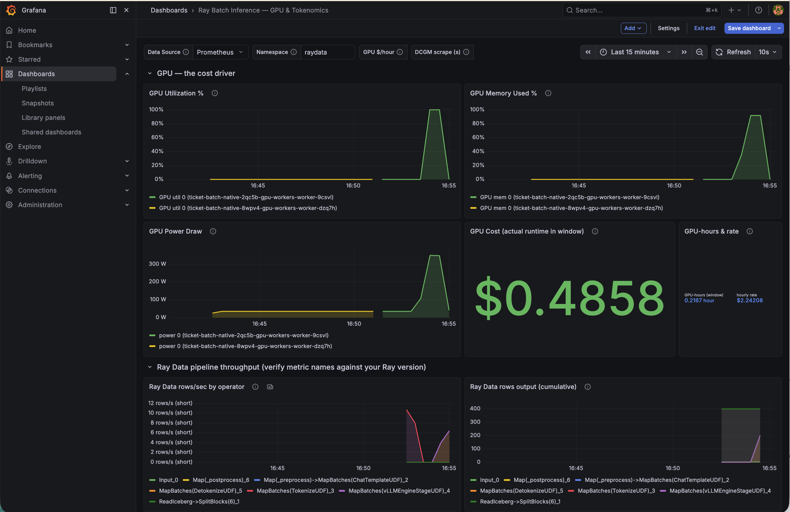

import '@site/src/css/datastack-tiles.css';
import Tabs from '@theme/Tabs';
import TabItem from '@theme/TabItem';

# Batch Inference on Amazon EKS with Ray and vLLM

<div className="showcase-tags" style={{marginBottom: '2rem'}}>
<span className="tag infrastructure">Ray 2.56</span>
<span className="tag guide">vLLM 0.22</span>
<span className="tag infrastructure">KubeRay v1.6</span>
<span className="tag guide">DeepSeek-R1-Distill-8B</span>
<span className="tag infrastructure">Karpenter</span>
<span className="tag guide">Run:ai Model Streamer</span>
</div>

It is 6 PM, and 15,600 support tickets have arrived during the day. Before tomorrow morning, each ticket needs a sentiment score, an urgency label, and a one-line summary. This is not work a human team should process manually. An LLM can handle it, but the obvious deployment choices are inefficient. Keep a GPU endpoint running continuously and you pay for idle capacity between jobs. Send every ticket to a managed API and the cost grows with every token, every day.

Batch inference gives us a better operating model. Provision GPU capacity only when the backlog is ready, keep the GPUs fully utilized while the job runs, write the results to Amazon S3, and then release the infrastructure. In our test, the entire workload completed in about 30 minutes and cost $1.13. The dataset, runtime, throughput, and cost figures used throughout this guide come from actual runs on Amazon EKS, not estimates.

## Batch inference vs real-time inference

A model can serve predictions in two ways.

**Real-time inference** answers one request at a time, as fast as possible.
A user is waiting. Think chatbots, search ranking, fraud checks at checkout.
The metric that matters is latency. On EKS, a load balancer routes requests
to a Ray Serve proxy, vLLM replicas answer them, and the Serve autoscaler
adds replicas when requests start queueing. The GPU stays on because a user
could arrive at any moment.



**Batch inference** processes a large dataset in one run. Nobody is waiting
on a single answer. Think classifying every support ticket from today,
generating embeddings for a million product images, or summarizing a backlog
of call transcripts. The metric that matters is cost per unit of work. The
architecture inverts. There is no load balancer and no always-on replica.
A job reads the backlog from S3, streams it through an in-process engine,
writes results back to S3, and the GPU node exists only for the life of
the job.



Look at the two footers. The real-time diagram ends with what an idle GPU
costs per day. The batch diagram ends with cost per million tokens. That is
the whole difference in one glance. Real-time buys readiness. Batch buys
work.

| | Real-time | Batch |
|---|---|---|
| Trigger | A user request | A schedule or a data drop |
| Metric | Latency (ms) | Cost per 1M tokens |
| GPU lifetime | Always on | Only while the job runs |
| Failure mode | A slow answer | A missed processing window |
| Example | "Is this transaction fraud?" | "Triage all 15,600 tickets from today" |

Most teams need both. That is the trap. The default path is to build a
serving stack for real-time and a separate data pipeline stack for batch.
Two codebases, two scaling models, two on-call rotations. This
blueprint shows how Ray collapses them into one platform on EKS, and it
includes a measured cost comparison so you can decide which pattern fits
each workload.

## Who runs this in production

This architecture is not experimental. The largest consumer platforms
converged on it independently.

**Pinterest** runs Ray batch inference across
[13 teams with over 60 jobs launched daily](https://medium.com/pinterest-engineering/ray-batch-inference-at-pinterest-part-3-4faeb652e385).
Before Ray, their Spark-based inference could not pipeline data loading with
GPU compute and could not mix CPU and GPU nodes in one job. After migrating,
their Related Pins team got 4.5x throughput and cut GPU count from 8 to 4.
Their Search Quality team reduced annual costs 30x by consolidating models
onto GPUs with Ray Data. Their
[last-mile data processing platform](https://medium.com/pinterest-engineering/last-mile-data-processing-with-ray-629affbf34ff)
sustains over 90% GPU utilization by streaming data into accelerators
instead of loading it up front.

**ByteDance** runs
[offline multimodal inference over 200 TB of data per run](https://www.anyscale.com/blog/how-bytedance-scales-offline-inference-with-multi-modal-llms-to-200TB-data),
generating embeddings with models over 10B parameters split across GPUs.
They chose Ray Data over Spark for the same two reasons Pinterest did.
They wanted streaming execution and mixed CPU/GPU scheduling. They run it on Kubernetes
with the KubeRay operator, the same operator this blueprint deploys.

**Uber** rebuilt its batch LLM inference platform on
[Kubernetes, Ray, PyTorch, and vLLM](https://www.anyscale.com/blog/ai-compute-open-source-stack-kubernetes-ray-pytorch-vllm),
the exact stack in this guide.

The pattern behind all three stories is the same. GPU time is the dominant
cost in inference. Whoever keeps the GPU fed wins. Ray Data keeps the GPU
fed by streaming data through CPU preprocessing stages into the engine, so
the expensive hardware never waits for the cheap hardware.

## What you will build

The example mocks a workload every business recognizes. Customer support
tickets arrive all day, and a pipeline turns each one into structured data.
Sentiment, urgency, category, and a one-line summary. A small generator
job appends about 200 realistic tickets to an Apache Iceberg table every
2 minutes for 20 minutes, using the Glue catalog and S3 warehouse this
stack already ships. Batch
jobs then process the backlog incrementally with
**DeepSeek-R1-Distill-Llama-8B** running on a single NVIDIA L40S GPU
(a g6e.2xlarge instance).

The batch architecture diagram above is exactly what you will deploy. It
shows the ticket generator, the S3 buckets, the RayJob pipeline, and the
Karpenter node lifecycle. Its footer numbers come from the measured runs
later in this guide.

The example implements the same job twice on purpose. The two patterns are
the two ways every team ends up doing batch inference, and seeing both
against the same dataset makes the tradeoff concrete.

### Pattern 1 sends batch traffic through a shared endpoint

A RayService hosts vLLM behind an OpenAI-compatible HTTP API. Online traffic
uses it during the day. The batch job is a separate RayJob that runs on
cheap CPU nodes, reads new tickets from the Iceberg table with Ray Data, and
fans out concurrent HTTP requests to the endpoint. The Serve autoscaler adds
GPU replicas when request pressure rises.



Follow the numbered flow. Tickets land in the Iceberg table (1), Ray Data
reads the new backlog on cheap CPU nodes (2), the job fans out capped HTTP
requests to the Serve proxy (3), vLLM answers with verdicts and token usage
(4), and the autoscaler scales replicas out if requests queue (5). Weights
stream from S3 at replica startup (6) on nodes Karpenter provisions (7).

Use this pattern when the endpoint already exists for online traffic and the
batch is small. The backfill reuses capacity you are already paying for.

### Pattern 2 runs the engine inside the job

No HTTP at all. The RayJob builds a Ray Data pipeline with
`ray.data.llm.build_processor`, which runs the vLLM engine inside the job.
Karpenter provisions a GPU node when the job starts and reclaims it when the
job ends. Rows flow from S3 through tokenization into the engine and out to
Parquet in one streaming pipeline.



The numbered flow tells the lifecycle story. A scheduler or operator
submits the RayJob (1), Karpenter sees the pending GPU pod and launches a
g6e node (2), the node pulls the image from same-region ECR (3), the
engine streams weights from S3 (4), Ray Data streams the ticket backlog
through the in-process engine with backpressure (5), Parquet lands in S3
with exact token counts (6), and the node is reclaimed the moment the job
ends (7). Zero idle GPU cost.

Use this pattern when the job is large. The engine stays saturated because
Ray Data backpressure feeds it directly, and the GPU exists only while it is
working.

:::tip Our recommendation is pattern 2

The production record points one way. Pinterest lists "inefficient RPC calls
between online GPU clusters and offline batch jobs" among the problems its
Ray migration eliminated. That is pattern 1, and they moved off it. Their
batch inference now loads models inside Ray Data jobs. ByteDance runs its
200 TB jobs the same way, with the model inside the pipeline. And
[Anyscale measured this pattern at 2x throughput](https://www.anyscale.com/blog/ray-data-llm-2x-throughput-vs-vllm)
over a synchronous engine. Our own measurement below lands at 1.70x on a
single GPU, which agrees.

**Pattern 2 is the default for any scheduled or large batch job.** Reach
for pattern 1 only when an online endpoint already exists and the batch is
small enough to ride on its spare capacity.

:::

## The cold start problem, and how this blueprint kills it

Batch on ephemeral GPUs only works if a fresh GPU node becomes useful fast.
Two downloads normally ruin it. The Ray + vLLM container image is 11.6 GB
and the model weights are another 15 GiB. Pull both from public internet
sources on every scale-up and your GPU sits idle for 10 or more minutes
before the first token.

The blueprint moves both artifacts next to the cluster, one time.

1. **Model weights live in S3 as safetensors.** vLLM streams them straight
   from S3 into memory with the
   [Run:ai Model Streamer](https://docs.vllm.ai/en/stable/models/extensions/runai_model_streamer/)
   (`load_format: runai_streamer`). We measured 15 GiB in 17.8 seconds at
   860 MiB/s. There is no HuggingFace download on the GPU node and no
   weights baked into images. EKS Pod Identity handles the S3 auth with no
   keys anywhere.
2. **The image is mirrored to same-region ECR** by an in-cluster skopeo job.
   The mirror itself took 82 seconds and runs once.

Here is the full anatomy of a cold start, measured from Kubernetes event
timestamps and engine logs on a single run in us-west-2 on an on-demand
g6e.2xlarge with the NVIDIA GPU operator.

| Phase | Duration |
|---|---|
| GPU pod pending, Karpenter creates a NodeClaim | 13 s |
| EC2 launch to node Ready | 40 s |
| Node Ready to pod scheduled (GPU operator registers the GPU) | 36 s |
| Image pull from ECR (11.6 GB) | 2 m 01 s |
| Container start (init container waits for the Ray head) | 53 s |
| Ray worker up to Serve replica init (pip runtime env ~12 s) | 16 s |
| Replica init to vLLM engine start | 36 s |
| Weights stream from S3 (15 GiB, Run:ai streamer) | 17.8 s |
| vLLM engine init (torch.compile 19.4 s + CUDA graphs + warmup) | 33.8 s |
| **Total from pod created to serving traffic on a fresh node** | **6 m 33 s** |
| **Total on a warm node with a cached image** | **~2 m 30 s** |

The image pull and the container start dominate that table. Weight
delivery, which most teams assume is the problem, is 18 seconds. Storage
placement solved it. One-time setup costs are also small. Staging the model
from HuggingFace to S3 took 48 seconds total, and the image mirror took 82
seconds.

:::note We tested SOCI parallel pull so you do not have to

This stack enables
[SOCI parallel pull](/docs/bestpractices/analytics/soci-spark-image-pulls)
(`FastImagePull: true`) with RAID0 instance store on the GPU node class. We
verified the snapshotter was active and unpacking to local NVMe. The pull
still took 2m01s with SOCI against 2m04s to 2m11s without it. The reason is
the image itself. `rayproject/ray-llm` packs 41% of its bytes into one
4.74 GB layer. SOCI parallelizes the download with concurrent HTTP range
requests, which makes fetching bytes bandwidth bound, but each layer still
decompresses as one sequential gzip stream on one CPU core, so the largest
layer sets the floor on pull time and no pull optimizer can split it.
The snapshotter journal shows every other layer done
in 27 seconds, then a 2m20s wait on that one layer. SOCI stays enabled
because it is free and it helps images with flatter layers. If you need this
pull faster, split the fat layer in a custom image build or use pre-baked
EBS snapshots with Fast Snapshot Restore.

:::

## Step 1. Deploy the Ray on EKS stack

The example runs on the standard Ray on EKS data stack, which deploys EKS,
Karpenter, the KubeRay operator v1.6, Prometheus, and ArgoCD with one
script. Follow the
[Ray Data on EKS infrastructure guide](/docs/datastacks/processing/raydata-on-eks/infra)
for the full walkthrough. Here is the short version.

```bash
git clone https://github.com/awslabs/data-on-eks.git
cd data-on-eks/data-stacks/ray-on-eks
```

Enable GPU support in `terraform/data-stack.tfvars` before deploying. The
NVIDIA GPU operator provides the device plugin plus DCGM metrics, so GPU
utilization, memory, and power show up in the stack's Grafana.

```hcl
enable_raydata             = true
enable_nvidia_gpu_operator = true
```

```bash
./deploy.sh
export KUBECONFIG=$(pwd)/kubeconfig.yaml
```

## Step 2. Run the example

Everything lives in
[`data-stacks/ray-on-eks/examples/ray-batch-inference`](https://github.com/awslabs/data-on-eks/tree/main/data-stacks/ray-on-eks/examples/ray-batch-inference)
behind one helper script. Set up the data and artifacts once.

```bash
cd examples/ray-batch-inference
export S3_BUCKET=$(cd ../../terraform/_local && terraform output -raw s3_bucket_id_spark_history_server)
export AWS_REGION=us-west-2

# One time, about 3 minutes: stage weights in S3, mirror image to ECR
./deploy.sh prepare
```

The prepare step launches two Kubernetes Jobs in the `raydata` namespace,
so you will see two pods. If the cluster has no spare CPU capacity,
Karpenter provisions one EC2 node for them (a spot memory-optimized
instance in our run) and the pods start about 40 seconds later. Watch with
`kubectl get pods -n raydata -w` and compare your logs against ours below.
Both jobs print `TIMING` lines so the comparison is exact.

<details>
<summary>Expected output from the image mirror job (11.6 GB, about 82 seconds on the first run)</summary>

```
=== Mirroring docker://docker.io/rayproject/ray-llm:2.56.0-py312-cu130 -> docker://<account-id>.dkr.ecr.us-west-2.amazonaws.com/ray-llm:2.56.0-py312-cu130 ===
Getting image source signatures
Copying blob sha256:a6edaf499c88cd101a07f69b072ca226c25dfbc592b0cb11207cf82d3ec19b99
Copying blob sha256:9b61b0826a9a6a74c08cb3e9bb9e11decd348911287eccec42e031e164379095
Copying blob sha256:597ef3925b92b1feffd4490c22ff3a54522bfd145cb4bc8efc7dcea6ea587936
... (25 layers total)
Copying config sha256:a462e495fff25d43d0f8d9226e850ac6567ca44dc8c7b5d472fbade8c09680d6
Writing manifest to image destination
TIMING image_mirror_seconds=82
Image mirror complete.
```

Reruns finish in about a second. skopeo checks the ECR manifest, sees every
layer already present, and skips the copy.

</details>

<details>
<summary>Expected output from the model staging job (15 GiB, under a minute)</summary>

```
=== Installing tooling ===
=== Downloading deepseek-ai/DeepSeek-R1-Distill-Llama-8B from HuggingFace ===
✓ Downloaded
  path: /scratch/model
TIMING hf_download_seconds=16
15G    /scratch/model
Patched tokenizer_class -> PreTrainedTokenizerFast
=== Syncing to s3://<bucket>/models/deepseek-r1-distill-llama-8b ===
upload: scratch/model/generation_config.json to s3://<bucket>/models/deepseek-r1-distill-llama-8b/generation_config.json
upload: scratch/model/model.safetensors.index.json to s3://<bucket>/models/deepseek-r1-distill-llama-8b/model.safetensors.index.json
upload: scratch/model/tokenizer_config.json to s3://<bucket>/models/deepseek-r1-distill-llama-8b/tokenizer_config.json
upload: scratch/model/config.json to s3://<bucket>/models/deepseek-r1-distill-llama-8b/config.json
upload: scratch/model/tokenizer.json to s3://<bucket>/models/deepseek-r1-distill-llama-8b/tokenizer.json
upload: scratch/model/model-00002-of-000002.safetensors to s3://<bucket>/models/deepseek-r1-distill-llama-8b/model-00002-of-000002.safetensors
upload: scratch/model/model-00001-of-000002.safetensors to s3://<bucket>/models/deepseek-r1-distill-llama-8b/model-00001-of-000002.safetensors
TIMING s3_upload_seconds=29
=== Verifying S3 contents ===
2026-07-12 23:53:27  826 Bytes models/deepseek-r1-distill-llama-8b/config.json
2026-07-12 23:53:27  181 Bytes models/deepseek-r1-distill-llama-8b/generation_config.json
2026-07-12 23:53:27    8.1 GiB models/deepseek-r1-distill-llama-8b/model-00001-of-000002.safetensors
2026-07-12 23:53:27    6.9 GiB models/deepseek-r1-distill-llama-8b/model-00002-of-000002.safetensors
2026-07-12 23:53:27   23.7 KiB models/deepseek-r1-distill-llama-8b/model.safetensors.index.json
2026-07-12 23:53:27    8.7 MiB models/deepseek-r1-distill-llama-8b/tokenizer.json
2026-07-12 23:53:27    3.2 KiB models/deepseek-r1-distill-llama-8b/tokenizer_config.json
Model staging complete.
```

Note the download from HuggingFace took 16 seconds and the upload to S3
took 29 seconds. The `Patched tokenizer_class` line is the fix for the
transformers v5 tokenizer bug described later in this guide.

</details>

Start the ticket generator next. One pod appends about 200 tickets to
the Iceberg table `raydata_spark_logs.support_tickets` every 2 minutes,
10 times, then completes. That is a bounded run of about 20 minutes and
2,000 tickets, and every append commits exactly one Iceberg snapshot.
Tune `MAX_BATCHES`, `INTERVAL_SECONDS`, and `TICKETS_PER_BATCH` in
`04-ticket-generator.yaml`, or re-run the command for another round.

```bash
./deploy.sh generator
```

### Verify the tickets are landing

The generator pod starts within a minute, installs its dependencies once,
and appends its first batch right away. That first append also creates
the Iceberg table in the Glue catalog. Follow the pod log.

```bash
kubectl logs -n raydata -l app=ticket-generator -f
```

```
Generator started: 10 batches of 200 tickets, 120s apart -> raydata_spark_logs.support_tickets
[1/10] Appended 200 tickets to raydata_spark_logs.support_tickets (snapshot 9008569494128083620, total snapshots so far: 1)
[2/10] Appended 200 tickets to raydata_spark_logs.support_tickets (snapshot 4131569621703439747, total snapshots so far: 2)
...
Generator finished: 2000 tickets in 10 batches.
```

Confirm the table registered in Glue as an Iceberg table.

```bash
aws glue get-table --database-name raydata_spark_logs --name support_tickets \
  --query 'Table.Parameters.table_type' --output text
```

```
ICEBERG
```

Now query it with Athena. Open the
[Athena console](https://console.aws.amazon.com/athena), pick the
`raydata_spark_logs` database, and run standard SQL against the table.

```sql
SELECT count(*) FROM raydata_spark_logs.support_tickets;
```

Expect a multiple of 200, growing by 200 every 2 minutes. Iceberg also
exposes its commit log as a queryable metadata table, so you can watch
the snapshots stack up.

```sql
SELECT snapshot_id, committed_at, operation
FROM "raydata_spark_logs"."support_tickets$snapshots"
ORDER BY committed_at DESC;
```

Expect one `append` row per generator loop. You do not need to wait for
the generator to finish. Three or four appends (600 to 800 tickets) are
enough backlog to make the batch run meaningful, and the GPU cold start
takes about 6 minutes anyway, so move on to the next step while the
generator keeps appending.

### How the batch jobs know what is new

Continuous ingestion raises the question every batch pipeline eventually
hits. Data keeps arriving in the same place, so how does a job avoid
reprocessing what an earlier run already handled? Raw files in a bucket
have no answer built in. An Iceberg table does, and that is why the
tickets land in one.

Each pattern keeps its own watermark in an Iceberg table property
(`watermark.native` and `watermark.endpoint`), like two independent
consumer groups reading one stream. A run pins the table's current
snapshot, reads only rows whose `ingested_ms` is past its watermark, and
advances the watermark only after its results are safely written to S3.
A run that crashes reprocesses the same increment next time
(at-least-once), but every run writes to its own timestamped output path,
so a retry never corrupts earlier results. Kick off the same job twice in
a row and the second run prints `new tickets : 0` and exits without
touching the GPU. The job logs show the whole protocol under the
`==== INCREMENTAL STATE ====` header. This is the verbatim block from a
first run against a table with 2,200 unprocessed tickets.

```
==== INCREMENTAL STATE ====
table             : raydata_spark_logs.support_tickets
snapshot pinned   : 5568529212639831728
watermark (prev)  : 0
new tickets       : 2200
```

At the end of the run the job prints `watermark (new)` right after the
results land in S3, and the next run picks up from there.

Then run either pattern, or run both and compare.

<Tabs groupId="batch-pattern">
<TabItem value="native" label="Pattern 2, engine in job (recommended)" default>

No endpoint needed. The job provisions its own GPU node, processes the
backlog, and releases the node when it finishes.

```bash
./deploy.sh batch-native
kubectl logs -n raydata -l job-name=ticket-batch-native -f
```

</TabItem>
<TabItem value="endpoint" label="Pattern 1, shared endpoint">

Deploy the endpoint first. Karpenter provisions the GPU node and vLLM
streams the weights from S3.

```bash
./deploy.sh service
kubectl get rayservice deepseek-r1-8b -n raydata -w    # wait for Running

./deploy.sh batch-endpoint
kubectl logs -n raydata -l job-name=ticket-batch-endpoint -f
```

</TabItem>
</Tabs>

You can also talk to the endpoint directly, since it speaks the OpenAI API.

```bash
kubectl port-forward svc/deepseek-r1-8b-serve-svc 8000 -n raydata &
curl http://localhost:8000/v1/chat/completions -H 'Content-Type: application/json' -d '{
  "model": "deepseek-r1-distill-llama-8b",
  "messages": [{"role": "user", "content": "Classify: my invoice was charged twice"}],
  "max_tokens": 256
}'
```

## Step 3. Read the results

Every batch job ends with a summary and a token cost report. This is the
verbatim output of pattern 2 over a 15,600 ticket backlog.

```
==== BATCH SUMMARY (native ray.data.llm) ====
tickets processed : 15600
wall time         : 1808.2s
throughput        : 8.63 tickets/s
results           : s3://<bucket>/ray-batch-inference/results/native/run-...
urgency   breakdown: {'critical': 2905, 'high': 9125, 'medium': 495, 'low': 3062, ...}
sentiment breakdown: {'positive': 2981, 'neutral': 466, 'negative': 12140, ...}
==== TOKENOMICS ====
prompt tokens     : 2,611,810 (167/ticket)
output tokens     : 5,019,499 (322/ticket)
output token rate : 2,776 tok/s
GPU cost          : $1.1261 (0.5023 GPU-h @ $2.24208/h)
cost per 1k tickets       : $0.0722
cost per 1M output tokens : $0.224
cost per 1M total tokens  : $0.148
```

### Verify the results yourself

The results land in S3 as Parquet, one folder per run.

```bash
aws s3 ls s3://$S3_BUCKET/ray-batch-inference/results/native/
aws s3 ls s3://$S3_BUCKET/ray-batch-inference/results/native/run-<stamp>/
```

Peek at the verdicts with PyArrow (`pip install pyarrow pandas`). Read one
run folder at a time. Each run is its own dataset, and reading the whole
`results/native/` prefix mixes runs whose schemas may differ.

```bash
export RUN=$(aws s3 ls s3://$S3_BUCKET/ray-batch-inference/results/native/ | awk '/PRE run-/{print $2}' | tail -1)
python3 - <<'EOF'
import os
import pyarrow.dataset as ds
path = f"s3://{os.environ['S3_BUCKET']}/ray-batch-inference/results/native/{os.environ['RUN']}"
df = ds.dataset(path, format="parquet").to_table().to_pandas()
print(df[["ticket_id", "sentiment", "urgency", "category", "summary", "completion_tokens"]].head(10))
print(len(df), "verdicts in", os.environ["RUN"])
EOF
```

```
        ticket_id sentiment   urgency        category                                            summary  completion_tokens
0  TCK-6037BDEFFA  negative      high  authentication  Webhook deliveries are failing with 401 errors...                337
1  TCK-DB740A0AA8  negative      high     performance  Larger CSV exports fail, returning only header...                314
2  TCK-C07730AA39  negative      high  authentication  CloudVault SSO integration with Okta is broken...                391
3  TCK-D9CFC70950  negative  critical     performance  API latency spiked to 30s, causing SLA breache...                364
4  TCK-2DA6D803C0  negative      high     performance  The user is experiencing missing data on dashb...                364
5  TCK-904A592201  negative      high  authentication  User locked out after multiple password resets...                304
6  TCK-B6D13CA776  positive       low     performance  The customer praises the new dashboard update,...                244
7  TCK-ED3A8EA375  negative  critical     performance  API latency spiked to 30s, impacting our pipel...                427
8  TCK-60E79991F8  negative      high     performance  Data missing after migration affects audit pre...                218
9  TCK-874E1DC6E7  negative      high     performance  SSO integration with Okta is broken, causing S...                382
2200 verdicts in run-20260713T010352Z/
```

Then confirm the watermark advanced, which is the proof the incremental
bookkeeping worked.

```bash
python3 -c "
from pyiceberg.catalog import load_catalog
tbl = load_catalog('glue', **{'type':'glue','glue.region':'us-west-2','s3.region':'us-west-2'}).load_table('raydata_spark_logs.support_tickets')
print({k: v for k, v in tbl.properties.items() if 'watermark' in k})"
```

Expect `watermark.native` set to the epoch milliseconds of the newest
processed ticket. Run `./deploy.sh batch-native` again and the
`INCREMENTAL STATE` block reports only tickets appended since this run,
or `new tickets : 0` if there are none.

The per-ticket token counts in the Parquet also mean you can attribute
cost to any business dimension with one Athena query. Which customer tier
consumes the most tokens. Which category costs the most to triage. That
is the kind of question finance asks, and this pipeline can answer it.

## What a million tokens costs you

### Where the numbers come from

Self-hosted inference cost is one equation.

```
cost per token = (GPU hours x hourly rate) / tokens produced
```

Each job measures all three terms itself, and none of them is estimated.
GPU hours are the measured wall time of the processing loop times the
number of GPUs the job holds (one here). The hourly rate comes from the
`GPU_COST_PER_HOUR` environment variable. The default is $2.24208, the
exact g6e.2xlarge on-demand rate in us-west-2 from the AWS Pricing API.
Set it to your Spot or negotiated rate and the report matches your bill.
Token counts come from the engine itself. Pattern 1 records
`usage.prompt_tokens` and `usage.completion_tokens` from each API
response. Pattern 2 reads the engine's own per-request counters
(`num_input_tokens`, `num_generated_tokens`), which `ray.data.llm`
carries through the pipeline attached to every row. Every ticket lands
in the results Parquet with its own token counts, so the `TOKENOMICS`
block at the end of a run is a sum over the full output, not a sample
or an extrapolation.

Both patterns processed the **same 15,600 tickets** on the same hardware.
One L40S GPU. Prompt tokens are identical across the two runs, and output
tokens differ by less than 0.1%. This is as close to a controlled experiment
as production infrastructure gets.

| Metric | Pattern 1 (endpoint) | Pattern 2 (engine in job) |
|---|---|---|
| Tickets processed | 15,600 (0 failed requests) | 15,600 |
| Wall time | 51.1 min | 30.1 min |
| Throughput | 5.09 tickets/s | **8.63 tickets/s (1.70x)** |
| Output token rate | 1,637 tok/s | **2,776 tok/s (1.70x)** |
| GPU-hours consumed | 0.851 | 0.502 |
| GPU cost for the run | $1.91 | $1.13 |
| **Cost per 1,000 tickets** | **$0.122** | **$0.072 (41% cheaper)** |
| Cost per 1M output tokens | $0.380 | $0.224 |
| Cost per 1M total tokens | $0.250 | $0.148 |

### Why is the same work 41% cheaper in pattern 2?

Cost here has exactly one variable, and that is how full the engine's
batching queue stays. vLLM processes many requests at once through
continuous batching.
Every idle slot in that batch is wasted GPU time you still pay for.

Pattern 1 feeds the engine over HTTP. When a request finishes, its slot sits
empty until the next request crosses the network. The client caps
concurrency at 64 in-flight requests, and they arrive in bursts. The engine
averaged 1,637 output tokens per second.

Pattern 2 inverts control. The engine pulls the next row from the Ray Data
queue the moment a slot frees. No network gap, no client-side cap. Same GPU,
same model, same tokens, 2,776 tokens per second. Throughput 1.70x higher
means GPU-time per token 1.70x lower. That is the entire cost difference.

The table also understates the gap in steady state. Pattern 1's GPU was
billed here only for the 51-minute window, but a standing endpoint runs all
day. At $2.24 per hour that is $53.81 per day whether traffic arrives or
not. Pattern 2's GPU existed for 30 minutes and Karpenter reclaimed it.

That does not make pattern 1 wrong. If the endpoint already serves online
traffic, backfills ride on capacity you are paying for anyway. The rule of
thumb this data supports is simple. **Batches worth minutes of GPU time go
to the endpoint you already run. Batches worth tens of minutes or more
deserve their own job-scoped engine.**

### Taking tokenomics to production

The in-job report is a deliberate design choice, not a shortcut. A batch
pod is ephemeral, so the most durable record of what it consumed is the
one it writes into its own results. Parquet rows with per-ticket token
counts survive the pod, join with business dimensions in Athena, and need
zero extra infrastructure. For batch workloads this is the source of
truth.

Prometheus metrics complement it for fleet-level views. vLLM exposes
`vllm:prompt_tokens_total` and `vllm:generation_tokens_total` counters
plus request-level token histograms on its `/metrics` endpoint, and this
stack's Prometheus and Grafana can chart them next to the DCGM GPU
utilization and power metrics the GPU operator ships. The
[vLLM Prometheus and Grafana example](https://docs.vllm.ai/en/stable/examples/observability/prometheus_grafana/)
is a ready starting point, and dividing a token-rate query by your node's
hourly cost reproduces the cost per million tokens as a live chart. One
caveat for batch. Scrape-based metrics fit the long-lived endpoint in
pattern 1. A pattern 2 job can start, saturate a GPU for 20 minutes, and
vanish between scrape intervals, which is exactly why the durable per-row
counters in the results matter more here.

#### Watch a run live in Grafana

The example ships a Grafana dashboard, **Ray Batch Inference — GPU &
Tokenomics**, and a PodMonitor that scrapes Ray's own metrics. Apply the
PodMonitor once, then open the dashboard while a job runs.

```bash
./deploy.sh monitoring    # PodMonitor: scrape Ray metrics into Prometheus
```

Everything on it is open source. The GPU panels read from the NVIDIA GPU
operator's DCGM exporter, the pipeline panels read Ray Data's built-in
metrics, and both land in the stack's kube-prometheus-stack. No partner or
enterprise components.



The screenshot above is a real run. Read it top to bottom.

**GPU, the cost driver.** These four DCGM panels answer one question: was
the expensive hardware working the whole time you paid for it?

- **GPU Utilization %** climbs from flat zero to 100% the moment the engine
  starts and drops back when the job ends. The flat stretch is the
  ephemeral node model in one picture. You pay only for the spike.
- **GPU Memory Used %** is the weights plus the KV cache. It sits high
  because the engine config sets `gpu_memory_utilization` to 0.92 to give
  vLLM the most room for batching.
- **GPU Power Draw** rises to roughly 320 W at saturation, near the L40S
  board limit. Power tracking utilization is the sign the GPU is doing real
  matrix math, not stalling.
- **GPU Cost (actual runtime in window)** is the headline number,
  $0.4858 here. It counts real DCGM samples times the scrape interval to
  get true GPU-seconds, so it reflects only the time instances actually
  ran and stays flat when the cluster is idle. Widen the time range and it
  does not inflate.
- **GPU-hours & rate** shows the two inputs behind that dollar figure. GPU
  hours actually consumed in the window on the left, and the configured
  hourly rate on the right. Multiply them to get the cost stat. This is the
  numerator of the cost equation. The denominator, tokens produced, lives
  in the results Parquet.

**Ray Data pipeline throughput.** These two panels read Ray Data's metrics
and break the job into its operators. Each colored line is one stage of the
pipeline in `process_tickets_native.py`, in order: `ReadIceberg` (the
incremental read), the preprocess and chat-template step, `TokenizeUDF`,
`vLLMEngineStageUDF` (the GPU stage), `DetokenizeUDF`, and the postprocess
step.

- **Ray Data rows/sec by operator** is the streaming pipeline in motion.
  The whole design goal is visible here. The cheap CPU stages run ahead so
  the `vLLMEngineStageUDF` stage, the GPU, never waits for data. That stage
  is your real bottleneck, and keeping its line high is what keeps cost per
  token low.
- **Ray Data rows output (cumulative)** is the running total each stage has
  emitted. Every line converges on the processed ticket count, which is a
  free sanity check that no rows were dropped between stages.

One reading tip. If you open the dashboard after a job finishes, the GPU
panels show zero because the node is gone, while the Ray Data cumulative
counters hold their final values because Prometheus retains the samples
inside the time window. To watch utilization climb in real time, keep the
dashboard open during the run with a short refresh interval.

The OpenTelemetry ecosystem is the third layer, and the one the industry
is converging on for LLM platforms that span many services.
[OpenLLMetry](https://github.com/traceloop/openllmetry) instruments LLM
calls as OpenTelemetry traces and metrics using the
[GenAI semantic conventions](https://opentelemetry.io/blog/2024/llm-observability/),
including a `gen_ai.client.token.usage` histogram split by input and
output token type, and ships them to any OTLP-compatible backend. On
Kubernetes the
[OpenLIT operator](https://grafana.com/blog/ai-observability-zero-code/)
goes one step further and injects that instrumentation into labeled pods
with no code changes or image rebuilds. Reach for this layer when
requests fan out across multiple services and model providers and you
need per-request cost attribution in one place. For a single self-hosted
engine like this blueprint, the engine counters already tell the whole
story, so grow into the OpenTelemetry layer when your platform does
rather than adopting it on day one.

## Cleanup

```bash
./cleanup.sh      # removes the RayService, RayJobs, generator, and ConfigMaps
```

Karpenter reclaims the GPU nodes within about 15 minutes once the Ray pods
are gone. The model weights in S3, the Iceberg ticket table in Glue, and
the mirrored image in ECR stay in place, so the next deployment skips the
prepare step and the batch jobs resume from their watermarks. To remove the
whole stack, use the data stack's own cleanup per the
[infrastructure guide](/docs/datastacks/processing/raydata-on-eks/infra).

## Where to go from here

Swap the mock ticket generator for your real data source. Point the S3 path
at your bucket, change the prompt, and the pipeline is yours. The same two
patterns carry to embeddings, document extraction, image captioning with a
vision model, and evaluation runs. If your dataset grows past one GPU, raise
`concurrency` in the processor config and Ray Data shards the work across
engine replicas. That is the same knob ByteDance turns to reach 200 TB.
