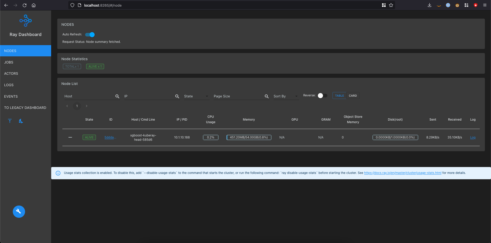

import CollapsibleContent from '../../src/components/CollapsibleContent';

# Ray on EKS

:::caution
This blueprint should be considered as experimental and should only be used for proof of concept.
:::

:::info
As part of our ongoing efforts to make this blueprint more enterprise-ready, we are actively working on adding several key functionalities. This includes cost management with Kubecost, advanced observability with OTEL, Amazon Managed Prometheus, and Grafana, as well as improved security and data governance using tools such as OPA/Gatekeeper and IRSA. If you have specific requirements or suggestions for this blueprint, please feel free to open an issue on our GitHub repository.
:::

## Introduction

[Ray](https://www.ray.io/) is an open-source framework for building scalable and distributed applications. It is designed to make it easy to write parallel and distributed Python applications by providing a simple and intuitive API for distributed computing. It has a growing community of users and contributors, and is actively maintained and developed by the Ray team at Anyscale, Inc.

To deploy Ray in production across multiple machines users must first deploy [**Ray Cluster**](https://docs.ray.io/en/latest/cluster/getting-started.html). A Ray Cluster consists of head nodes and worker nodes which can be autoscaled using the built-in **Ray Autoscaler**.


*Source: https://docs.ray.io/en/latest/cluster/key-concepts.html*

## Ray on Kubernetes

Deploying Ray Cluster on Kubernetes including on Amazon EKS is supported via the [**KubeRay Operator**](https://ray-project.github.io/kuberay/). The operator provides a Kubernetes-native way to manage Ray clusters. The installation of KubeRay Operator involves deploying the operator and the CRDs for `RayCluster`, `RayJob` and `RayService` as documented [here](https://ray-project.github.io/kuberay/deploy/helm/).

Deploying Ray on Kubernetes can provide several benefits:

1. Scalability: Kubernetes allows you to scale your Ray cluster up or down based on your workload requirements, making it easy to manage large-scale distributed applications.

1. Fault tolerance: Kubernetes provides built-in mechanisms for handling node failures and ensuring high availability of your Ray cluster.

1. Resource allocation: With Kubernetes, you can easily allocate and manage resources for your Ray workloads, ensuring that they have access to the necessary resources for optimal performance.

1. Portability: By deploying Ray on Kubernetes, you can run your workloads across multiple clouds and on-premises data centers, making it easy to move your applications as needed.

1. Monitoring: Kubernetes provides rich monitoring capabilities, including metrics and logging, making it easy to troubleshoot issues and optimize performance.

Overall, deploying Ray on Kubernetes can simplify the deployment and management of distributed applications, making it a popular choice for many organizations that need to run large-scale machine learning workloads.

Before moving forward with the deployment please make sure you have read the pertinent sections of the official [documentation](https://docs.ray.io/en/latest/cluster/kubernetes/index.html).


*Source: https://docs.ray.io/en/latest/cluster/kubernetes/index.html*

## Deploying the Examples

In this [example](https://github.com/awslabs/data-on-eks/tree/main/ai-ml/ray/terraform), you will provision Ray Cluster on Amazon EKS using the KubeRay Operator. The examples also demonstrates the use of Karpenter of autoscaling of worker nodes for job specific Ray Clusters.


<CollapsibleContent header={<h3><span>Pre-requisites</span></h3>}>

Ensure that you have installed the following tools on your machine. You will use the helper script `cloud9-init.sh` from the git repo you will clone in the next steps

1. [aws cli](https://docs.aws.amazon.com/cli/latest/userguide/install-cliv2.html)
2. [kubectl](https://Kubernetes.io/docs/tasks/tools/)
3. [terraform](https://learn.hashicorp.com/tutorials/terraform/install-cli)
4. [python3](https://www.python.org/)
6. [ray](https://docs.ray.io/en/master/ray-overview/installation.html#from-wheels)

</CollapsibleContent>

<CollapsibleContent header={<h3><span>Deploy the EKS Cluster with KubeRay Operator</span></h3>}>

#### Clone the repository

```bash
git clone https://github.com/awslabs/data-on-eks.git
git switch -c feat/ray-serve origin/feat/ray-serve
```

#### Initialize Terraform

Navigate into the example directory

```bash
cd data-on-eks/ai-ml/ray/terraform
```

#### Setup your Cloud9 IDE
Use the helper script to setup your **Cloud9 IDE**.

```bash
./cloud9-init.sh
```

#### Run the install script


Use the provided helper script `install.sh` to run the terraform init and apply commands. By default the script deploys EKS cluster to `us-west-2` region. Update `variables.tf` to change the region. This is also the time to update any other input variables or make any other changes to the terraform template.


```bash
./install.sh
```

</CollapsibleContent>

<CollapsibleContent header={<h3><span>Verify Deployment</span></h3>}>

Update local kubeconfig so we can access kubernetes cluster

```bash
aws eks update-kubeconfig --name ray-cluster #or whatever you used for EKS cluster name
```

First, lets verify that we have worker nodes running in the cluster.

```bash
kubectl get nodes
```
:::info
```bash
NAME                          STATUS   ROLES    AGE   VERSION
ip-10-1-26-241.ec2.internal   Ready    <none>   10h   v1.24.9-eks-49d8fe8
ip-10-1-4-21.ec2.internal     Ready    <none>   10h   v1.24.9-eks-49d8fe8
ip-10-1-40-196.ec2.internal   Ready    <none>   10h   v1.24.9-eks-49d8fe8
```
:::

Next, lets verify all the pods are running.

```bash
kubectl get pods -n kuberay-operator
```
:::info
```
NAME                                READY   STATUS    RESTARTS   AGE
kuberay-operator-86957f45c4-l488x   1/1     Running   0          74m
```
:::


At this point we are ready to deploy Ray Clusters.
</CollapsibleContent>

<CollapsibleContent header={<h3><span>Deploy Ray Cluster Jobs</span></h3>}>

For convenience, we have packaged the helm chart deployent of Ray Cluster as a repeatable terraform [module](https://github.com/awslabs/data-on-eks/tree/main/ai-ml/ray/terraform/modules/ray-cluster/). This allows us to codify organizational best practices and requirements for deploying Ray Clusters for multiple Data Science teams. The module also creates configuration needed for karpenter to be able to provision EC2 instances for Ray applications as and when they are needed for the duration of the job. This model can be replicated via GitOps tooling such as ArgoCD or Flux but is done here via terraform for demonstration purpose.

##### XGBoost

First, we will deploy a Ray Cluster for our [XGBoost benchmark](https://docs.ray.io/en/latest/cluster/kubernetes/examples/ml-example.html#kuberay-ml-example) sample job.

Go to the xgboost directory followed by terraform init, and plan.

```bash
cd train/examples/xgboost
terraform init
terraform plan
```

If the changes look good, lets apply them.

```bash
terraform apply -auto-approve
```

As the RayCluster pod goes into the pending state, Karpenter will provision an EC2 instance based on the `Provisioner` and `AWSNodeTemplate` configuration we have provided. We can check that a new node has been created.

```bash
kubectl get nodes
```

:::info
```bash
NAME                          STATUS   ROLES    AGE     VERSION
# New node appears
ip-10-1-13-204.ec2.internal   Ready    <none>   2m22s   v1.24.9-eks-49d8fe8
ip-10-1-26-241.ec2.internal   Ready    <none>   12h     v1.24.9-eks-49d8fe8
ip-10-1-4-21.ec2.internal     Ready    <none>   12h     v1.24.9-eks-49d8fe8
ip-10-1-40-196.ec2.internal   Ready    <none>   12h     v1.24.9-eks-49d8fe8
```
:::

Wait until the RayCluster head node pods are provisioned.

```bash
kubectl get pods -n xgboost
```
:::info
```
NAME                         READY   STATUS    RESTARTS   AGE
xgboost-kuberay-head-585d6   2/2     Running   0          5m42s
```
:::

Now we are ready to run our sample training benchmark using for XGBoost. First, open another terminal and forward the Ray server to our localhost.

```sh
kubectl port-forward service/xgboost-kuberay-head-svc -n xgboost 8265:8265
```
:::info
```bash
Forwarding from 127.0.0.1:8265 -> 8265
Forwarding from [::1]:8265 -> 8265
```
:::

Submit the ray job for XGBoost benchmark.

```bash
python job/xgboost_submit.py
```

You can open http://localhost:8265 in your browser to monitor job progress. If there are any failures during execution those can be viewed in the logs under the Jobs section.



As the job progresses, you will notice new Ray autoscaler will provision additional ray worker pods based on the autoscaling configuration defined in the RayCluster configuration. Those worker pods will initially remain in pending state. That will trigger karpenter to spin up new EC2 instances so the pending pods can be scheduled. After worker pods go to running state, the job will progress to completion.

```bash
kubectl get nodes
```
:::info
```bash
NAME                          STATUS    ROLES    AGE   VERSION
ip-10-1-1-241.ec2.internal    Unknown   <none>   1s  
ip-10-1-10-211.ec2.internal   Unknown   <none>   1s  
ip-10-1-13-204.ec2.internal   Ready     <none>   24m   v1.24.9-eks-49d8fe8
ip-10-1-26-241.ec2.internal   Ready     <none>   12h   v1.24.9-eks-49d8fe8
ip-10-1-3-64.ec2.internal     Unknown   <none>   7s  
ip-10-1-4-21.ec2.internal     Ready     <none>   12h   v1.24.9-eks-49d8fe8
ip-10-1-40-196.ec2.internal   Ready     <none>   12h   v1.24.9-eks-49d8fe8
ip-10-1-7-167.ec2.internal    Unknown   <none>   1s  
ip-10-1-9-112.ec2.internal    Unknown   <none>   1s  
ip-10-1-9-172.ec2.internal    Unknown   <none>   1s  
```
:::

Optionally, you can also use [eks-node-viewer](https://github.com/awslabs/eks-node-viewer) for visualizing dynamic node usage within the cluster.


Once the benchmark is complete, the job log will display the results. You might see different results based on your configurations.

:::info
```bash
Results: {'training_time': 1338.488839321999, 'prediction_time': 403.36653568099973}
```
:::
##### PyTorch

We can simultaneously deploy the PyTorch benchmark as well. We deploy a separate Ray Cluster with its own configuration for Karpenter workers. Different jobs can have different requirements for Ray Cluster such as a different version of Ray libraries or EC2 instance configuration such as making use of Spot market or GPU instances. We take advantage of node taints and tolerations in Ray Cluster pod specs to match the Ray Cluster configuration to Karpenter configuration thus taking advantage of the flexibility that Karpenter provides.

Go to the PyTorch directory and run the terraform init and plan as before.

```bash
cd ../pytorch
terraform init
terraform plan
```

Apply the changes.


```bash
terraform apply -auto-approve
```

Wait for the pytorch Ray Cluster head node pods to be ready.

```bash
kubectl get pods -n pytorch -w
```

:::info
```bash
NAME                         READY   STATUS    RESTARTS   AGE
pytorch-kuberay-head-9tx56   0/2     Pending   0          43s
```
:::

Once running, we can forward the port for server, taking care that we foward it to another local port as 8265 may be occupied by the xgboost connection.

```bash
kubectl port-forward service/pytorch-kuberay-head-svc -n pytorch 8266:8265
```

We can then submit the job for PyTorch benchmark workload.

```bash
python job/pytorch_submit.py
```

You can open http://localhost:8266 to monitor the progress of the pytorch benchmark.
</CollapsibleContent>

<CollapsibleContent header={<h3><span>Deploy RayService</span></h3>}>

In this example, we will demonstrate how to run a fault-tolerant [RayService](https://ray-project.github.io/kuberay/guidance/rayservice/). Ray documentation recommends using an [external redis](https://ray-project.github.io/kuberay/guidance/gcs-ft/#use-external-redis-cluster) cluster as the backend storage. We use [Amazon MemoryDB for Redis](https://aws.amazon.com/memorydb/) for this purpose (alternatively Amazon Elasticache for Redis can also be used). We also use the [AWS Load Balancer Controller](https://kubernetes-sigs.github.io/aws-load-balancer-controller/v2.5/) and [Ingress Nginx](https://kubernetes.github.io/ingress-nginx/) to provide Ingress for the RayService. We use [Karpenter](https://karpenter.sh) for provisioning just-in-time compute for the Ray Cluster. And, finally we use [Kube Prometheus Stack](https://github.com/prometheus-community/helm-charts/tree/main/charts/kube-prometheus-stack) and [AWS for FluentBit](https://github.com/aws/eks-charts/tree/master/stable/aws-for-fluent-bit) to provide us with a basic observability stack.

By running `./install.sh` in the prior steps you have already provisioned the infrastructure described above. But if you haven't run it yet, please do so now.

```bash
cd ai-ml/ray/terraform
./install.sh
```
Time for a :coffee: break as this will take anywhere between 20-30 minutes.

Next, we will deploy our sample RayService. This example is borrowed from Ray documentation as described [here](https://docs.ray.io/en/latest/serve/production-guide/fault-tolerance.html#serve-e2e-ft). Tl;dr it simply returns the pid of the process its running in using python's `os.getpid()`. In the future, we will add more interesting examples and patterns.

For now, lets go and deploy our simple example.

```bash
cd examples/serve/sleepy-pid
terraform init
```

:::info
```bash
Initializing the backend...
Initializing modules...
- sleepy_pid_service in ../../../modules/ray-service
Downloading registry.terraform.io/terraform-aws-modules/iam/aws 5.20.0 for sleepy_pid_service.external_secrets_irsa...
- sleepy_pid_service.external_secrets_irsa in .terraform/modules/sleepy_pid_service.external_secrets_irsa/modules/iam-role-for-service-accounts-eks

Initializing provider plugins...
- Reusing previous version of hashicorp/helm from the dependency lock file
- Reusing previous version of gavinbunney/kubectl from the dependency lock file
- Reusing previous version of hashicorp/aws from the dependency lock file
- Reusing previous version of hashicorp/kubernetes from the dependency lock file
- Using previously-installed hashicorp/helm v2.10.0
- Using previously-installed gavinbunney/kubectl v1.14.0
- Using previously-installed hashicorp/aws v5.0.1
- Using previously-installed hashicorp/kubernetes v2.20.0

Terraform has been successfully initialized!

You may now begin working with Terraform. Try running "terraform plan" to see
any changes that are required for your infrastructure. All Terraform commands
should now work.

If you ever set or change modules or backend configuration for Terraform,
rerun this command to reinitialize your working directory. If you forget, other
commands will detect it and remind you to do so if necessary.
```
:::

```bash
terraform apply -auto-approve
```

:::info
```bash
...
...
Apply complete! Resources: 14 added, 0 changed, 0 destroyed.
```
:::

With `eks-node-viewer` you can verify that karpenter has provisioned 3 EC2 instances to accomodate our RayServe cluster. After a few minutes, verify that the RayService cluster is up and running.

```sh
kubectl get pods -n sleepy-pid
```

:::info
```bash
NAME                                                   READY   STATUS     RESTARTS   AGE
sleepy-pid-raycluster-6wm7n-head-sxzkj                 2/2     Running    0          4m
sleepy-pid-raycluster-6wm7n-worker-small-group-6bkpd   1/1     Running    0          4m
sleepy-pid-raycluster-6wm7n-worker-small-group-86ndp   1/1     Running    0          4m
sleepy-pid-raycluster-6wm7n-worker-small-group-w6rsz   1/1     Running    0          4m
```
:::

Our Ingress should now be available to serve the requests as well.

```sh
kubectl get ingress -n sleepy-pid 
```
:::info
```sh
NAME         CLASS   HOSTS   ADDRESS                                                                         PORTS   AGE
sleepy-pid   nginx   *       k8s-ingressn-ingressn-b2adc0a198-22872ac42151f510.elb.us-west-2.amazonaws.com   80      5m16s
```
:::

We can use `curl` to verify that requests are being served.

```sh
curl http://k8s-ingressn-ingressn-b2adc0a198-22872ac42151f510.elb.us-west-2.amazonaws.com/sleepy-pid/serve/
```
:::info
```sh
482
```
:::

Next, we recommend you run through the different failure modes described in Ray [documentation]](https://docs.ray.io/en/latest/serve/production-guide/fault-tolerance.html#worker-node-failure) to validate that the RayService recovers from failure as expected.

</CollapsibleContent>


<CollapsibleContent header={<h3><span>Observability</span></h3>}>

#### Logs

we have already enabled FluentBit as part of previous steps. You can confirm it under `kubernetes_addons` section in your `main.tf` file:

```bash
enable_aws_for_fluentbit             = true
```

Above will enable EKS Data plane logs to be senr to AWS CloudWatch logs.

Fluent bit runs as a DaemonSet on each worker node. You can see its pods under `kube-system` namespace. Run this command:

```bash
kubectl get daemonsets.apps -n kube-system aws-for-fluent-bit
```

Fluentbit is set to send the logs to Cloudwatch already and it will appear in the loggroup `/${local.name}/worker-fluentbit-logs`. View the logs in Cloudwatch AWS Console

```bash
....
cloudWatch = {
          enabled         = "true"
          match           = "*"
          region          = local.region
          logGroupName    = "/${local.name}/worker-fluentbit-logs"
          logStreamPrefix = "fluentbit-"
          autoCreateGroup = "true"
        }
.....
```


#### Metrics with Kube Prometheus Stack

Another `add-on` that is available on EKS Blueprints for Terraform is Kube Prometheus Stack. This particular `add-on` when enabled installs Prometheus instance, Prometheus operator, kube-state-metrics, node-exporter, alertmanager as well as Grafana instance with preconfigured dashboards. This stack is meant for cluster monitoring, so it is pre-configured to collect metrics from all Kubernetes components. In addition to that it delivers a default set of dashboards and alerting rules.
More on [kube-prometheus-stack](https://github.com/prometheus-community/helm-charts/tree/main/charts/kube-prometheus-stack).

we have already enabled kube_prometheus_stack as part of previous steps. You can confirm it under `kubernetes_addons` section in your `main.tf` file:

```bash
  enable_kube_prometheus_stack         = true 
```

You can verify all Kube Prometheus Stack pods created and running under `kube-prometheus-stack` namespace:

```bash
$ kubectl -n kube-prometheus-stack get pods
NAME                                                        READY   STATUS    RESTARTS   AGE
alertmanager-kube-prometheus-stack-alertmanager-0           2/2     Running   0          32d
kube-prometheus-stack-grafana-78457d9fc8-p48d9              3/3     Running   0          32d
kube-prometheus-stack-kube-state-metrics-5f6d6c64d5-xvcpw   1/1     Running   0          32d
kube-prometheus-stack-operator-6f4f8975fb-slt5c             1/1     Running   0          32d
kube-prometheus-stack-prometheus-node-exporter-jsfz6        1/1     Running   0          32d
kube-prometheus-stack-prometheus-node-exporter-qgxqp        1/1     Running   0          32d
kube-prometheus-stack-prometheus-node-exporter-xh2z7        1/1     Running   0          32d
prometheus-kube-prometheus-stack-prometheus-0               2/2     Running   0          32d
```

1.	Get Grafana admin password: 

```bash
kubectl get secret --namespace kube-prometheus-stack kube-prometheus-stack-grafana  -o jsonpath="{.data.admin-password}" | base64 --decode ; echo
```

2.	To access Grafana dashboard you should forward your local port 8080 to the Grafana port 3030 with next command:

```bash
kubectl port-forward kube-prometheus-stack-grafana-78457d9fc8-p48d9 -n kube-prometheus-stack --address 0.0.0.0 8080:3000
```
3. Open your browser and go to http://localhost:8080/. Then, login with username `admin` and above received password (default password: `prom-operator`).

4. Inside Grafana, under Dashboards you can browse different preconfigured dashboards available for you out of the box. 

</CollapsibleContent>

<CollapsibleContent header={<h3><span>Teardown</span></h3>}>

:::caution
To avoid unwanted charges to your AWS account, delete all the AWS resources created during this deployment.
:::

Destroy the Ray Clusters for pytorch followed by xgboost.

From the pytorch directory.

```bash
cd ../pytorch
terraform destroy -auto-approve
```

From the xgboost directory.

```bash
cd ../xgboost
terraform destroy -auto-approve
```

From the xgboost directory.

```bash
cd ../xgboost
terraform destroy -auto-approve
```

Use the provided helper script `cleanup.sh` to tear down EKS cluster and other AWS resources.

```bash
cd ../../
./cleanup.sh
```

</CollapsibleContent>
