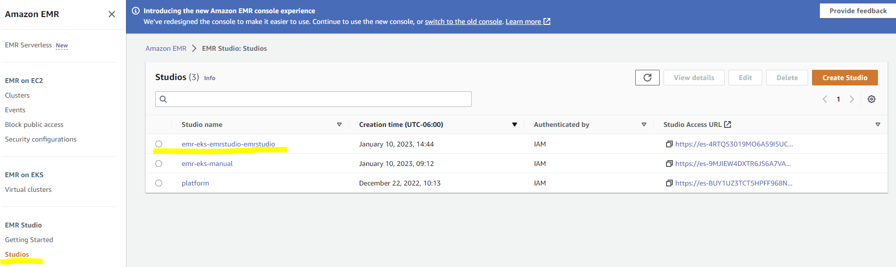
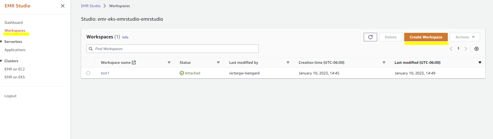
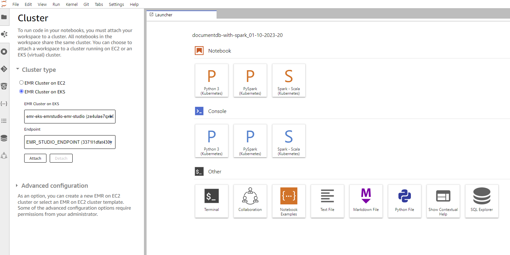
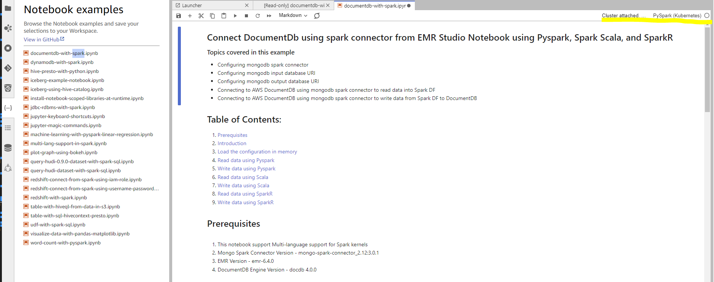
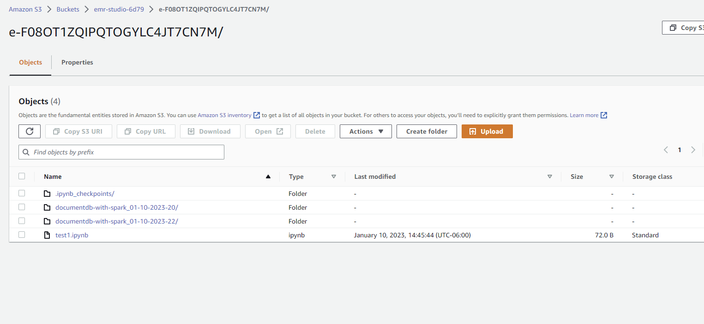

# EMR on EKS with EMR Studio

## Introduction
In this blog post, we will demonstrate how to build and deploy a data processing platform on [Amazon EMR on EKS](https://docs.aws.amazon.com/emr/latest/EMR-on-EKS-DevelopmentGuide/emr-eks.html) to run batch workloads as well interactive iterative experiments. The platform links EMR Studio with EKS cluster which allows reusing the same EKS cluster to run interactive [Jupyter notebooks](https://jupyter.org/). The platform also includes [AWS Controllers for EMR on EKS](https://github.com/aws-controllers-k8s/emrcontainers-controller) which allows you to manage EMR on EKS resources directly using Kubernetes-native tools such as kubectl.


## Deploying the Solution

In this [example](https://github.com/awslabs/data-on-eks/tree/main/analytics/terraform/emr-eks-emrstudio), you will provision the following resources required to run Spark Jobs using EMR on EKS, as well as monitor spark job metrics using **Amazon Managed Prometheus** and **Amazon Managed Grafana**.

- Creates EKS Cluster Control plane with public endpoint (for demo purpose only)
- Two managed node groups
  - Core Node group with 3 AZs for running system critical pods. e.g., Cluster Autoscaler, CoreDNS, Observability, Logging etc.
  - Spark Node group with single AZ for running Spark jobs
- Enable EMR on EKS and creates two Data teams (`emr-data-team-a`, `emr-data-team-b`)
  - Creates two new namespace for the data team a, `emr-data-team-a` for batch job and `emr-studio` for running notebooks in EMR studio
  - Creates Kubernetes role and role binding(`emr-containers` user) for the above namespace
  - New IAM role for the team execution role
  - Update AWS_AUTH config map with  emr-containers user and AWSServiceRoleForAmazonEMRContainers role
  - Create a trust relationship between the job execution role and the identity of the EMR managed service account
- EMR Virtual Cluster for `emr-data-team-a` and `emr-studio`
- IAM policy for `emr-data-team-a` and `emr-studio`
- [Managed endpoints](https://docs.aws.amazon.com/emr/latest/EMR-on-EKS-DevelopmentGuide/connect-emr-studio.html) for EMR studio running notebooks in EKS
- EMR Studio with its service role
- An S3 bucket for saving all the notebooks created in EMR studio
- Amazon Managed Prometheus workspace to remote write metrics from Prometheus server
- Deploys the following Kubernetes Add-ons
    - Managed Add-ons
        - VPC CNI, CoreDNS, KubeProxy, AWS EBS CSi Driver
    - Self Managed Add-ons
        - Metrics server with HA, CoreDNS Cluster proportional Autoscaler, Cluster Autoscaler, Prometheus Server and Node Exporter, VPA for Prometheus, AWS for FluentBit, CloudWatchMetrics for EKS
 -  ACK EMR containers controller which allows you deploy sparks jobs to EMR on EKS by using yaml files. The controller is installed by using [AWS EKS ACK Addons Terraform module](https://github.com/aws-ia/terraform-aws-eks-ack-addons)

### Prerequisites:

Ensure that you have installed the following tools on your machine.

1. [aws cli](https://docs.aws.amazon.com/cli/latest/userguide/install-cliv2.html)
2. [kubectl](https://Kubernetes.io/docs/tasks/tools/)
3. [terraform](https://learn.hashicorp.com/tutorials/terraform/install-cli)

_Note: Currently Amazon Managed Prometheus supported only in selected regions. Please see this [userguide](https://docs.aws.amazon.com/prometheus/latest/userguide/what-is-Amazon-Managed-Service-Prometheus.html) for supported regions._

### Deploy

Clone the repository

```bash
git clone https://github.com/awslabs/data-on-eks.git
```

Navigate into one of the example directories and run `terraform init`

```bash
cd data-on-eks/analytics/terraform/emr-eks-emrstudio
terraform init
```

Set `AWS_REGION` and Run Terraform plan to verify the resources created by this execution.

```bash
export AWS_REGION="us-west-2" # Change region according to your needs
terraform plan
```

Deploy the pattern

```bash
terraform apply
```

Enter `yes` to apply.

## Verify the resources

Let’s verify the resources created by `terraform apply`.

Verify the Amazon EKS Cluster and Amazon Managed service for Prometheus.

```bash
aws eks describe-cluster --name emr-eks-emrstudio

aws amp list-workspaces --alias amp-ws-emr-eks-emrstudio
```

Verify EMR on EKS Namespaces `emr-data-team-a` and `emr-studio` and Pod status for `Prometheus`, `Vertical Pod Autoscaler`, `Metrics Server` and `Cluster Autoscaler`.

```bash
aws eks --region us-west-2 update-kubeconfig --name emr-eks-emrstudio # Creates k8s config file to authenticate with EKS Cluster

kubectl get nodes # Output shows the EKS Managed Node group nodes

kubectl get pods -A  # Output shows all the pods for add-ons and EMR one EKS

```

### Setup Amazon Managed Grafana with SSO
Currently, this step is manual. Please follow the steps in this [blog](https://aws.amazon.com/blogs/mt/monitoring-amazon-emr-on-eks-with-amazon-managed-prometheus-and-amazon-managed-grafana/) to create Amazon Managed Grafana with SSO enabled in your account.
You can visualize the Spark jobs runs and metrics using Amazon Managed Prometheus and Amazon Managed Grafana.


## Execute interactive experiments using notebooks in EMR Studio
In this section, we show how you can create a workspace in Amazon EMR Studio and connect to the Amazon EKS managed endpoint from the workspace. From the output, use the link to Amazon EMR Studio to navigate to the EMR Studio deployment.

### Create a Workspace
To create a Workspace, complete the following steps:

- Go to AWS console and search EMR
- In Amazon EMR panel, click Studios button at the bottom of the left panel
- Click emr-eks-emrstudio-emrstudio studio which was created by terraform
 
- In EMR Studio, click Workspaces in the left panel and then Choose Create Workspace.
 
- Enter a workspace name and an optional description.
- Select Allow Workspace Collaboration if you want to work with other Studio users in this Workspace in real time.
- Choose Create Workspace.

### Connect to an EMR on EKS managed endpoint
- click the workspace you just created (you may need to unblock the pop up block from the browser for the first time)
- for the first time, you need to attach your workspace with EKS through Managed endpoint. Like the screenshot below, choose EMR on EKS virtual cluster and managed point created by terraform above.
  
- work with your notebook. You can now open a notebook and connect to a preferred kernel to do your tasks. 
 
- Grant user access permission to the workspace following the [link](https://docs.aws.amazon.com/emr/latest/ManagementGuide/emr-studio-user-permissions.html)

Now, let's go back to the EKS cluster to see what is happening under the hood. Run the command below to see what's been created under `emr-studio` namespace.
```bash
kubectl get pod -n emr-studio 

results:
NAME                                                            READY   STATUS    RESTARTS   AGE
jeg-3371l1dfat430-c48cff664-s9tz7                               1/1     Running   0          23m  # for managed endpoint
k823c8ef9-002c-4780-8d42-663a053c2d6c-a30666859de2b022-driver   2/2     Running   0          69s  # driver for your notebook
k823c8ef9-002c-4780-8d42-663a053c2d6c-e7ff92859de2d5f0-exec-1   1/1     Running   0          59s  # executor for your notebook
k823c8ef9-002c-4780-8d42-663a053c2d6c-e7ff92859de2d5f0-exec-2   1/1     Running   0          59s  # executor for your notebook
```

Go to the S3 bucket and you can see all the notebooks created in EMR studio. 
 


## Execute Sample batch job on EMR Virtual Cluster
For batch workloads, We can now create a EMR Virtual Cluster on namespace `emr-data-team-a`. 

Create a Virtual cluster my-ack-vc for emr-data-team-a
```bash
kubectl apply -f examples/ack/virtualcluster.yaml

kubectl describe virtualclusters
```
You will get the output like below <br/>
 


Before running a sample job, let’s create CloudWatch Logs and an S3 bucket to store EMR on EKS logs.
```bash
aws logs create-log-group --log-group-name=/emr-on-eks-logs/emr-eks-ack
aws s3 mb s3://emr-eks-ack-rapthg5f  
```

update {emr_on_eks_role_arn} in jobrun.yaml with the output from terraform
then run

```bash
kubectl apply -f examples/ack/jobrun.yaml

kubectl describe jobruns
```
You will get the output like below <br/>
 


## Cleanup

To clean up your environment, destroy the Terraform modules in reverse order with `--target` option to avoid destroy failures.

Destroy the Kubernetes Add-ons, EKS cluster with Node groups and VPC

```bash
terraform destroy -target="module.eks_blueprints_kubernetes_addons" -target="module.eks_ack_addons" -auto-approve
terraform destroy -target="module.eks_blueprints" -auto-approve
terraform destroy -target="module.vpc" -auto-approve
```

Finally, destroy any additional resources that are not in the above modules

```bash
terraform destroy -auto-approve
```
:::caution

To avoid unwanted charges to your AWS account, delete all the AWS resources created during this deployment
:::

## Known issues 
https://docs.aws.amazon.com/emr/latest/ManagementGuide/emr-studio-considerations.html#emr-studio-known-issues