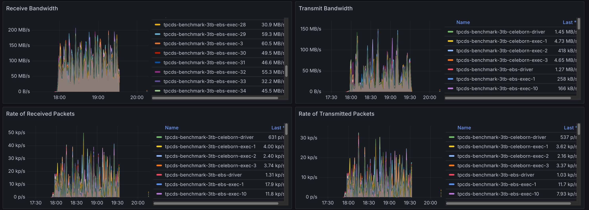

import Tabs from '@theme/Tabs';
import TabItem from '@theme/TabItem';
import PerformanceDashboard from '@site/src/components/BenchmarkDashboard/PerformanceDashboard';
import BarChart from '@site/src/components/Charts/BarChart';
import PieChart from '@site/src/components/Charts/PieChart';

# Apache Spark with Apache Celeborn Benchmarks

## Introduction

Apache Celeborn is an open-source intermediate data service designed to optimize big data compute engines like Apache Spark and Flink. It primarily manages shuffle and spilled data to enhance performance, stability, and flexibility in big data processing. By acting as a Remote Shuffle Service (RSS), it addresses issues like low I/O efficiency in traditional shuffle mechanisms. Celeborn offers high performance through asynchronous processing and a highly available architecture, contributing to more robust big data analytics.

This document presents the performance characteristics of using Apache Celeborn with Apache Spark on a 3TB TPC-DS benchmark.

## Executive Summary (TL;DR)

While Celeborn provides significant operational benefits for specific use cases, it does not serve as a universal performance accelerator. For the standardized TPC-DS 3TB benchmark, **overall execution time increased by 11%** compared to the native Spark shuffle service.

Key observations include:
- **Query-Dependent Performance:** Results were highly query-dependent. The best-performing query (`q11-v2.4`) improved by **17.5%**, whereas the worst-performing query (`q91-v2.4`) regressed by over **100%**. The performance gains appear correlated with queries that have large shuffle operations, while the overhead of the remote service penalizes queries with small shuffles.
- **Operational Stability:** Celeborn's primary advantage is providing a centralized and fault-tolerant shuffle service. This architecture prevents job failures caused by executor loss and can improve reliability for long-running, complex queries.
- **Infrastructure Overhead:** Using Celeborn introduces higher costs, requiring dedicated master and worker nodes, high-throughput storage (e.g., EBS), and high-bandwidth networking. Careful capacity planning is essential to handle peak shuffle traffic.

**In summary,** Celeborn is a strategic choice for improving the stability of Spark jobs with large shuffle data, but for general workloads, the performance and cost overhead should be carefully evaluated.

## TPC-DS 3TB Benchmark: Native Spark vs. Spark with Celeborn

## Benchmark Configuration

We benchmarked [TPC-DS](https://www.tpc.org/tpcds/) **3TB** workloads on a dedicated Amazon EKS cluster to compare native Spark SQL execution with Spark enhanced by Apache Celeborn. To ensure an apples-to-apples comparison, both native Spark and Celeborn jobs ran on identical hardware, storage, and data.

### Test Environment

| Component | Configuration |
|-----------|---------------|
| **EKS Cluster** | [Amazon EKS](https://aws.amazon.com/eks/) 1.33 |
| **Dataset** | [TPC-DS](https://www.tpc.org/tpcds/) 3TB (Parquet format) |
| **Spark Node Instance** | r6g.8xlarge |
| **Spark Node Group** | 8 nodes dedicated for benchmark workloads |
| **Spark Storage** | EBS GP3, 1000 Throughput, 16000 IOPS |
| **Celeborn Node Instance** | r6g.8xlarge |
| **Celeborn Node Group** | 8 nodes (3 for Master, 5 for Worker pods) |
| **Celeborn Storage** | 2 x EBS GP3 Volumes per Worker, 1000 Throughput, 16000 IOPS each |


### Application & Engine Configurations

#### Spark Executor and Driver

| Component | Configuration |
|-----------|---------------|
| **Executor Configuration** | 32 executors × 14 cores × 100GB RAM each |
| **Driver Configuration** | 5 cores × 20GB RAM |

#### Spark Settings for Celeborn

The following properties were set to enable the Celeborn shuffle manager.

```yaml
spark.shuffle.manager: org.apache.spark.shuffle.celeborn.SparkShuffleManager
spark.shuffle.service.enabled: false
spark.celeborn.master.endpoints: celeborn-master-0.celeborn-master-svc.celeborn.svc.cluster.local,celeborn-master-1.celeborn-master-svc.celeborn.svc.cluster.local,celeborn-master-2.celeborn-master-svc.celeborn.svc.cluster.local
```

#### Celeborn Worker Configuration

Celeborn workers were configured to use two mounted EBS volumes for shuffle storage.

```yaml
# EBS volumes are mounted at /mnt/disk1 and /mnt/disk2
celeborn.worker.storage.dirs: /mnt/disk1:disktype=SSD:capacity=100Gi,/mnt/disk2:disktype=SSD:capacity=100Gi
```

## Performance Results and Analysis

### Overall Benchmark Performance

<BarChart
  title="TPC-DS 3TB Overall Runtime Comparison"
  data={{
    labels: ['Native Spark Shuffle', 'Celeborn'],
    datasets: [
      {
        label: 'Total Runtime (seconds)',
        data: [1817.5, 2037.7],
        backgroundColor: ['#27ae60', '#e74c3c'], // Green for native, Red for Celeborn (regression)
        borderColor: ['#229954', '#c0392b'],
        borderWidth: 1,
      },
    ],
  }}
  options={{
    scales: {
      y: {
        title: {
          display: true,
          text: 'Runtime (seconds)',
        },
      },
      x: {
        title: {
          display: true,
          text: 'Shuffle Mechanism',
        },
      },
    },
  }}
/>

The total execution time for the 3TB TPC-DS benchmark increased from **1817.5 seconds** (native Spark shuffle) to **2037.7 seconds** (Celeborn), representing an **11% performance regression** overall.

This result demonstrates that for a broad, mixed workload like TPC-DS, the overhead of sending shuffle data over the network can outweigh the benefits for many queries.

<PieChart
  title="Query Performance Distribution vs. Baseline"
  type="doughnut"
  data={{
    labels: [
      '10+% Improvement (Celeborn Faster)',
      '+/- 9% (Similar Performance)',
      '10-20% Regression (Celeborn Slower)',
      '20+% Regression (Celeborn Slower)',
    ],
    datasets: [
      {
        label: 'Number of Queries',
        data: [3, 52, 19, 27],
        backgroundColor: [
          '#27ae60', // Green for improvement
          '#f39c12', // Yellow for similar
          '#e67e22', // Orange for moderate regression
          '#e74c3c', // Red for significant regression
        ],
        borderColor: '#ffffff',
        borderWidth: 2,
      },
    ],
  }}
/>

### Per-Query Performance Analysis

While the overall time increased, performance at the individual query level was highly variable. This variance is strongly correlated with each query's shuffle behavior. Queries with large, intensive shuffle phases tend to benefit from Celeborn's stability and offloading capabilities, while queries with smaller shuffles are penalized by the added network and serialization overhead.

<BarChart
  title="Per-Query Performance: Top 10 Gains and Regressions"
  height="600px"
  data={{
    labels: [
      'q11-v2.4', 'q7-v2.4', 'q58-v2.4', 'q45-v2.4', 'q15-v2.4', 'q27-v2.4', 'q52-v2.4', 'q3-v2.4', 'q79-v2.4', 'q62-v2.4',
      'q31-v2.4', 'q73-v2.4', 'q32-v2.4', 'q65-v2.4', 'q84-v2.4', 'q68-v2.4', 'q8-v2.4', 'q39b-v2.4', 'q92-v2.4', 'q91-v2.4'
    ],
    datasets: [
      {
        label: '% Improvement vs. Baseline',
        data: [
          17.5, 10.1, 9.2, 7.0, 6.5, 6.4, 5.9, 5.4, 5.2, 4.2,
          -37.4, -38.4, -41.5, -59.1, -61.0, -61.3, -64.1, -99.4, -100.7, -137.4
        ],
        backgroundColor: [
          '#27ae60', '#27ae60', '#27ae60', '#27ae60', '#27ae60', '#27ae60', '#27ae60', '#27ae60', '#27ae60', '#27ae60',
          '#e74c3c', '#e74c3c', '#e74c3c', '#e74c3c', '#e74c3c', '#e74c3c', '#e74c3c', '#e74c3c', '#e74c3c', '#e74c3c'
        ],
        borderColor: [
            '#229954', '#229954', '#229954', '#229954', '#229954', '#229954', '#229954', '#229954', '#229954', '#229954',
            '#c0392b', '#c0392b', '#c0392b', '#c0392b', '#c0392b', '#c0392b', '#c0392b', '#c0392b', '#c0392b', '#c0392b'
        ],
        borderWidth: 1,
      },
    ],
  }}
  options={{
    indexAxis: 'y', // This makes the bar chart horizontal
    responsive: true,
    maintainAspectRatio: false, // Important for custom height
    scales: {
      x: {
        title: {
          display: true,
          text: '% Improvement (Positive is better)',
        },
      },
      y: {
        title: {
          display: true,
          text: 'TPC-DS Query',
        },
      },
    },
  }}
/>

The tables below highlight the queries that saw the biggest improvements and the worst regressions.

#### Queries with Performance Gains

Celeborn improved performance for 20 out of the 99 queries. The most significant gains were seen in queries known to have substantial shuffle phases.

| Rank | TPC-DS Query | % Improvement |
|------|-------------|-----------------|
| 1 | q11-v2.4 | 17.5 |
| 2 | q7-v2.4 | 10.1 |
| 3 | q58-v2.4 | 9.2 |
| 4 | q45-v2.4 | 7.0 |
| 5 | q15-v2.4 | 6.5 |
| 6 | q27-v2.4 | 6.4 |
| 7 | q52-v2.4 | 5.9 |
| 8 | q3-v2.4 | 5.4 |
| 9 | q79-v2.4 | 5.2 |
| 10 | q62-v2.4 | 4.2 |
| 11 | q22-v2.4 | 3.7 |
| 12 | q60-v2.4 | 3.2 |
| 13 | q99-v2.4 | 1.8 |
| 14 | q43-v2.4 | 1.3 |
| 15 | q71-v2.4 | 1.1 |
| 16 | q33-v2.4 | 1.0 |
| 17 | q67-v2.4 | 1.0 |
| 18 | q21-v2.4 | 0.8 |
| 19 | q44-v2.4 | 0.7 |
| 20 | q56-v2.4 | 0.6 |

#### Queries with Performance Regressions

Conversely, a large number of queries performed significantly worse, with some showing over 100% degradation. These are typically queries with smaller shuffle data volumes where the cost of involving a remote service is higher than the benefit.

| Rank | TPC-DS Query | % Improvement |
|------|-------------|-----------------|
| 1 | q91-v2.4| -137.4|
| 2 | q92-v2.4 | -100.7 |
| 3 | q39b-v2.4 | -99.4 |
| 4 | q8-v2.4 | -64.1 |
| 5 | q68-v2.4 | -61.3 |
| 6 | q84-v2.4 | -61.0 |
| 7 | q65-v2.4 | -59.1 |
| 8 | q32-v2.4 | -41.5 |
| 9 | q73-v2.4 | -38.4 |
| 10 | q31-v2.4 | -37.4 |
| 11 | q50-v2.4 | -36.1 |
| 12 | q10-v2.4 | -35.5 |
| 13 | q85-v2.4 | -35.3 |
| 14 | q12-v2.4 | -31.7 |
| 15 | q34-v2.4 | -31.2 |
| 16 | q82-v2.4 | -27.5 |
| 17 | q64-v2.4 | -27.2 |
| 18 | q75-v2.4 | -26.2 |
| 19 | q93-v2.4 | -26.0 |
| 20 | q74-v2.4 | -24.7 |


## Resource Utilization Analysis

Using a remote shuffle service fundamentally changes how a Spark application utilizes resources. We observed a clear shift from local disk I/O on executor pods to network I/O between executors and Celeborn workers.

### Network I/O Analysis

With the native shuffler, network traffic is typically limited to reading data from the source and inter-node communication for tasks. With Celeborn, all shuffle data is transmitted over the network, leading to a significant increase in network utilization on Spark pods and high ingress on Celeborn worker pods.

#### Spark Pods with Default Shuffler
The graph below shows minimal network traffic on Spark pods, corresponding to reading the TPC-DS data.



#### Spark Pods with Celeborn
Here, network egress is significantly higher as executors are now sending shuffle data to the remote Celeborn workers.


#### Celeborn Worker Pods
The Celeborn worker pods show high network ingress, corresponding to the shuffle data being received from all the Spark executors.


### Storage I/O Analysis

The inverse effect was observed for storage. The native shuffler writes intermediate data to local disks on each executor's node, generating significant disk I/O. Celeborn centralizes these writes on the remote workers' dedicated high-performance volumes.

#### Spark Pods with Default Shuffler
High disk I/O is visible on Spark pods as they perform local shuffle read/write operations.


#### Spark Pods with Celeborn
With shuffle operations offloaded, the local disk I/O on Spark pods becomes negligible.


#### Celeborn Worker Pods
The storage I/O load is now concentrated on the Celeborn workers, which are writing the aggregated shuffle data to their attached EBS volumes.


