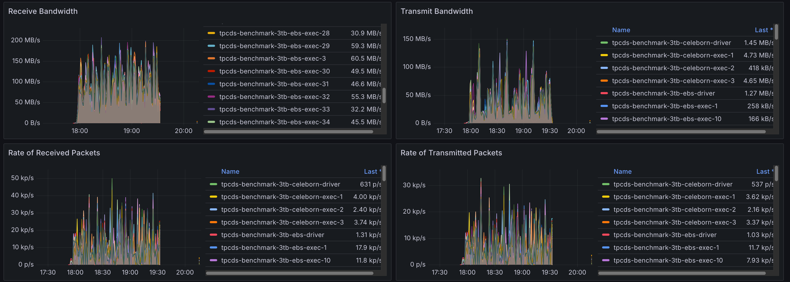
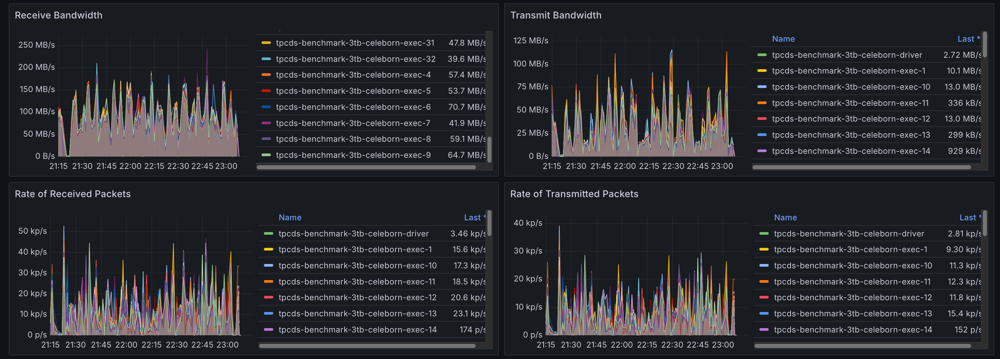
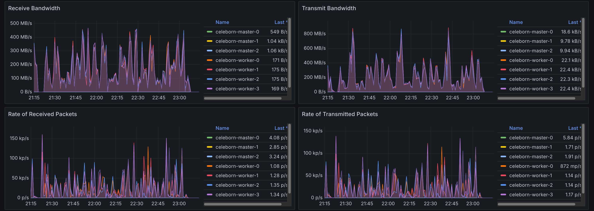
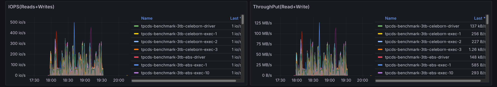
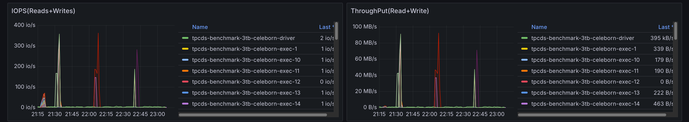
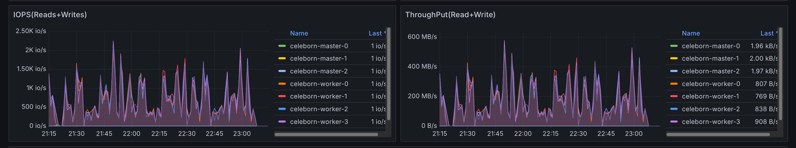
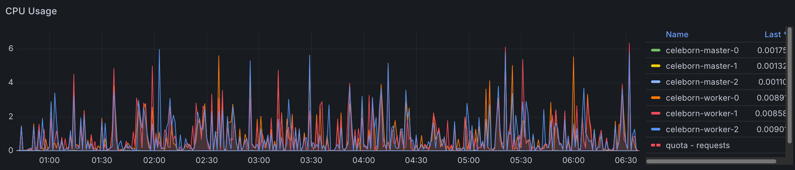
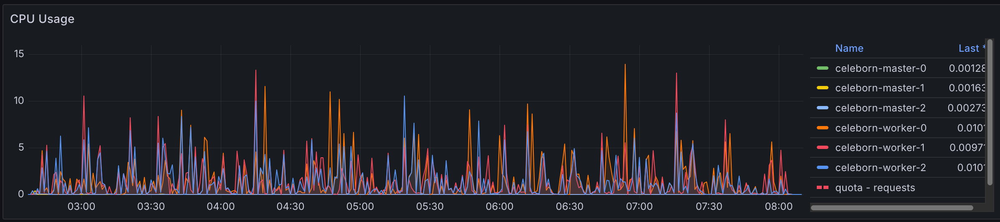
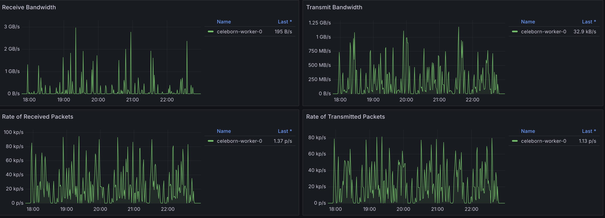
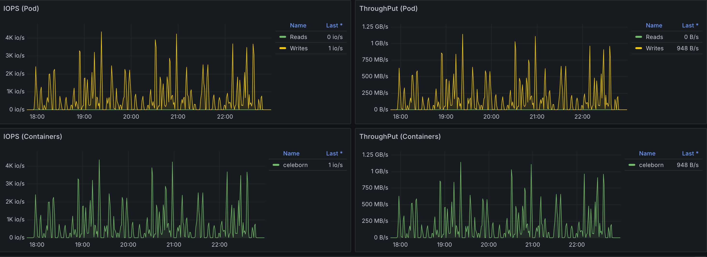

import Tabs from '@theme/Tabs';
import TabItem from '@theme/TabItem';
import PerformanceDashboard from '@site/src/components/BenchmarkDashboard/PerformanceDashboard';
import BarChart from '@site/src/components/Charts/BarChart';
import PieChart from '@site/src/components/Charts/PieChart';

# Apache Spark with Apache Celeborn Benchmarks

## Introduction

Apache Celeborn is an open-source intermediate data service designed to optimize big data compute engines like Apache Spark and Flink. It primarily manages shuffle and spilled data to enhance performance, stability, and flexibility in big data processing. By acting as a Remote Shuffle Service (RSS), it addresses issues like low I/O efficiency in traditional shuffle mechanisms. Celeborn offers high performance through asynchronous processing and a highly available architecture, contributing to more robust big data analytics.

This document presents the performance characteristics of using Apache Celeborn with Apache Spark on 3TB and 10TB TPC-DS benchmarks.

## Executive Summary (TL;DR)

This document evaluates Apache Celeborn as a Remote Shuffle Service for Apache Spark across two independent TPC-DS benchmarks: 3TB and 10TB. Due to differences in hardware and configuration between the two benchmarks, their results should be evaluated independently rather than as a direct comparison.

**TPC-DS 3TB:** Overall execution time **increased by 16%** with Celeborn. The overhead of the remote shuffle service outweighed its benefits for the majority of queries at this scale.

**TPC-DS 10TB:** With optimized Spark settings (notably `localShuffleReader.enabled=false`) and upgraded hardware, Celeborn achieved a **14.5% overall performance improvement**, with shuffle-heavy queries seeing gains of up to 49%.

Key observations include:
- **Query-Dependent Performance:** Results were highly query-dependent at both scales. Performance gains correlate with queries that have large shuffle operations, while the overhead of the remote service penalizes queries with small shuffles.
- **Operational Stability:** Celeborn's primary advantage is providing a centralized and fault-tolerant shuffle service. This architecture prevents job failures caused by executor loss and can improve reliability for long-running, complex queries.
- **Infrastructure Overhead:** Using Celeborn introduces higher costs, requiring dedicated master and worker nodes, high-throughput storage (e.g., EBS), and high-bandwidth networking. Careful capacity planning is essential to handle peak shuffle traffic.
- **Tuning Matters:** The `spark.sql.adaptive.localShuffleReader.enabled=false` setting dramatically reduced worst-case query regressions, highlighting the importance of Spark-side configuration when using Celeborn.

## Benchmark Configuration

We benchmarked [TPC-DS](https://www.tpc.org/tpcds/) **3TB** workloads on a dedicated Amazon EKS cluster to compare native Spark SQL execution with Spark enhanced by Apache Celeborn. To ensure an apples-to-apples comparison, both native Spark and Celeborn jobs ran on identical hardware, storage, and data. Each test was run 10 times and the average was taken.

### Test Environment

| Component | Configuration |
|-----------|---------------|
| **EKS Cluster** | [Amazon EKS](https://aws.amazon.com/eks/) 1.33 |
| **Dataset** | [TPC-DS](https://www.tpc.org/tpcds/) 3TB (Parquet format) |
| **Spark Node Instance** | r6g.8xlarge |
| **Spark Node Group** | 8 nodes dedicated for benchmark workloads |
| **Spark Storage** | EBS GP3, 1000 Throughput, 16000 IOPS |
| **Celeborn Node Instance** | r6g.8xlarge |
| **Celeborn Node Group** | 8 nodes (3 for Master, 5 for Worker pods) |
| **Celeborn Storage** | 2 x EBS GP3 Volumes per Worker, 1000 Throughput, 16000 IOPS each |


### Application & Engine Configurations

#### Spark Executor and Driver

| Component | Configuration |
|-----------|---------------|
| **Executor Configuration** | 32 executors × 14 cores × 100GB RAM each |
| **Driver Configuration** | 5 cores × 20GB RAM |

#### Spark Settings for Celeborn

The following properties were set to enable the Celeborn shuffle manager.

```yaml
spark.shuffle.manager: org.apache.spark.shuffle.celeborn.SparkShuffleManager
spark.shuffle.service.enabled: false
spark.celeborn.master.endpoints: celeborn-master-0.celeborn-master-svc.celeborn.svc.cluster.local,celeborn-master-1.celeborn-master-svc.celeborn.svc.cluster.local,celeborn-master-2.celeborn-master-svc.celeborn.svc.cluster.local
```

#### Celeborn Worker Configuration

Celeborn workers were configured to use two mounted EBS volumes for shuffle storage.

```yaml
# EBS volumes are mounted at /mnt/disk1 and /mnt/disk2
celeborn.worker.storage.dirs: /mnt/disk1:disktype=SSD:capacity=100Gi,/mnt/disk2:disktype=SSD:capacity=100Gi
```

## Performance Results and Analysis

### Overall Benchmark Performance

<BarChart
  title="TPC-DS 3TB Overall Runtime Comparison"
  data={{
    labels: ['Native Spark Shuffle', 'Celeborn'],
    datasets: [
      {
        label: 'Total Runtime (seconds)',
        data: [1792.8, 2079.6],
        backgroundColor: ['#27ae60', '#e74c3c'], // Green for native, Red for Celeborn (regression)
        borderColor: ['#229954', '#c0392b'],
        borderWidth: 1,
      },
    ],
  }}
  options={{
    scales: {
      y: {
        title: {
          display: true,
          text: 'Runtime (seconds)',
        },
      },
      x: {
        title: {
          display: true,
          text: 'Shuffle Mechanism',
        },
      },
    },
  }}
/>

The total execution time for the 3TB TPC-DS benchmark increased from **1792.8 seconds** (native Spark shuffle) to **2079.6 seconds** (Celeborn), representing an **16% performance regression** overall.

This result demonstrates that for a broad, mixed workload like TPC-DS, the overhead of sending shuffle data over the network can outweigh the benefits for many queries.

<PieChart
  title="Query Performance Distribution vs. Baseline"
  type="doughnut"
  data={{
    labels: [
      '10+% Improvement (Celeborn Faster)',
      '+/- 9% (Similar Performance)',
      '10-20% Regression (Celeborn Slower)',
      '20+% Regression (Celeborn Slower)',
    ],
    datasets: [
      {
        label: 'Number of Queries',
        data: [2, 55, 16, 31],
        backgroundColor: [
          '#27ae60', // Green for improvement
          '#bdc3c7', // Light grey for similar (neutral)
          '#e67e22', // Orange for moderate regression
          '#e74c3c', // Red for significant regression
        ],
        borderColor: '#ffffff',
        borderWidth: 2,
      },
    ],
  }}
/>

### Per-Query Performance Analysis

While the overall time increased, performance at the individual query level was highly variable.

<BarChart
  title="Per-Query Performance: Top 10 Gains and Regressions"
  height="600px"
  data={{
    labels: [
      'q99-v2.4', 'q21-v2.4', 'q22-v2.4', 'q15-v2.4', 'q45-v2.4', 'q62-v2.4', 'q39av2.4', 'q79-v2.4', 'q66-v2.4', 'q26-v2.4',
      'q31-v2.4', 'q32-v2.4', 'q84-v2.4', 'q8-v2.4', 'q50-v2.4', 'q68-v2.4', 'q65-v2.4', 'q39b-v2.4', 'q92-v2.4', 'q91-v2.4'
    ],
    datasets: [
      {
        label: '% Improvement vs. Baseline',
        data: [
          10.1, 9.2, 6.8, 6.5, 5.8, 4.8, 4.7, 1.5, 1.2,
          -57.9, -61.2, -63.2, -66.9, -68.0, -73.3, -78.9, -100.9, -121.3, -135.8
        ],
        backgroundColor: [
          '#27ae60', '#27ae60', '#27ae60', '#27ae60', '#27ae60', '#27ae60', '#27ae60', '#27ae60', '#27ae60', '#27ae60',
          '#e74c3c', '#e74c3c', '#e74c3c', '#e74c3c', '#e74c3c', '#e74c3c', '#e74c3c', '#e74c3c', '#e74c3c', '#e74c3c'
        ],
        borderColor: [
            '#229954', '#229954', '#229954', '#229954', '#229954', '#229954', '#229954', '#229954', '#229954', '#229954',
            '#c0392b', '#c0392b', '#c0392b', '#c0392b', '#c0392b', '#c0392b', '#c0392b', '#c0392b', '#c0392b', '#c0392b'
        ],
        borderWidth: 1,
      },
    ],
  }}
  options={{
    indexAxis: 'y', // This makes the bar chart horizontal
    responsive: true,
    maintainAspectRatio: false, // Important for custom height
    scales: {
      x: {
        title: {
          display: true,
          text: '% Improvement (Positive is better)',
        },
      },
      y: {
        title: {
          display: true,
          text: 'TPC-DS Query',
        },
      },
    },
  }}
/>

The tables below highlight the queries that saw the biggest improvements and the worst regressions.

#### Queries with Performance Gains

Celeborn improved performance for 20 out of the 99 queries. The most significant gains were seen in queries known to have substantial shuffle phases.

| Rank | TPC-DS Query | Performance Change (%) |
|------|-------------|-----------------|
| 1 | q99-v2.4 | 10.1 |
| 2 | q21-v2.4 | 9.2 |
| 3 | q22-v2.4 | 6.8 |
| 4 | q15-v2.4 | 6.5 |
| 5 | q45-v2.4 | 5.8 |
| 6 | q62-v2.4 | 4.8 |
| 7 | q39a-v2.4 | 4.8 |
| 8 | q79-v2.4 | 4.7 |
| 9 | q66-v2.4 | 1.5 |
| 10 | q26-v2.4 | 1.2 |


#### Queries with Performance Regressions

Conversely, a large number of queries performed significantly worse, with some showing over 100% degradation. These are typically queries with smaller shuffle data volumes where the cost of involving a remote service is higher than the benefit.

| Rank | TPC-DS Query | Performance Change (%) |
|------|-------------|-----------------|
| 1 | q91-v2.4| -135.8|
| 2 | q92-v2.4 | -121.3 |
| 3 | q39b-v2.4 | -100.9 |
| 4 | q65-v2.4 | -78.9 |
| 5 | q68-v2.4 | -73.3 |
| 6 | q50-v2.4 | -68.0 |
| 7 | q8-v2.4 | -66.9 |
| 8 | q84-v2.4 | -63.2 |
| 9 | q32-v2.4 | -61.2 |
| 10 | q31-v2.4 | -57.9 |


## Resource Utilization Analysis

Using a remote shuffle service fundamentally changes how a Spark application utilizes resources. We observed a clear shift from local disk I/O on executor pods to network I/O between executors and Celeborn workers.

### Network I/O Analysis

With the native shuffler, network traffic is typically limited to reading data from the source and inter-node communication for tasks. With Celeborn, all shuffle data is transmitted over the network, leading to a significant increase in network utilization on Spark pods and high ingress on Celeborn worker pods.

#### Spark Pods with Default Shuffler
The graph below shows minimal network traffic on Spark pods, corresponding to reading the TPC-DS data.



#### Spark Pods with Celeborn
Here, network egress is significantly higher as executors are now sending shuffle data to the remote Celeborn workers.



#### Celeborn Worker Pods
The Celeborn worker pods show high network ingress, corresponding to the shuffle data being received from all the Spark executors.



### Storage I/O Analysis

The inverse effect was observed for storage. The native shuffler writes intermediate data to local disks on each executor's node, generating significant disk I/O. Celeborn centralizes these writes on the remote workers' dedicated high-performance volumes.

#### Spark Pods with Default Shuffler
High disk I/O is visible on Spark pods as they perform local shuffle read/write operations.



#### Spark Pods with Celeborn
With shuffle operations offloaded, the local disk I/O on Spark pods becomes negligible.



#### Celeborn Worker Pods
The storage I/O load is now concentrated on the Celeborn workers, which are writing the aggregated shuffle data to their attached EBS volumes.




## Celeborn Performance Configuration Comparison

This section details a performance comparison after adjusting specific Celeborn configuration values, contrasting them with default settings typically found in Helm charts. The goal was to investigate potential performance improvements by optimizing memory and buffer sizes.

### Configuration Adjustments

Based on the Celeborn documentation (https://celeborn.apache.org/docs/latest/configuration/), the following parameters were modified to explore their impact on performance:

| Configuration Parameter           | Value Used |
|-----------------------------------|------------|
| `CELEBORN_WORKER_MEMORY`          | 12g        |
| `CELEBORN_WORKER_OFFHEAP_MEMORY`  | 100g       |
| `celeborn.worker.flusher.buffer.size` | 10m        |

### Performance Impact Overview

The adjustments resulted in a varied performance impact across queries. While some queries showed improvements, a majority remained largely unchanged, and several experienced significant regressions.

### Detailed Query Performance Comparison

The following table compares the performance between the default settings and the adjusted memory and buffer configurations. A positive percentage indicates performance improvement, while a negative percentage indicates regression.

<PieChart
  title="Query Performance Distribution (Config Adjustments vs. Baseline)"
  type="doughnut"
  data={{
    labels: [
      '9%+ Improvement',
      '+/- 9% (Similar Performance)',
      '9+% Regression',
    ],
    datasets: [
      {
        label: 'Number of Queries',
        data: [2, 88, 14],
        backgroundColor: [
          '#27ae60', // Green for improvement
          '#bdc3c7', // Light grey for similar (neutral)
          '#e74c3c', // Red for regression
        ],
        borderColor: '#ffffff',
        borderWidth: 2,
      },
    ],
  }}
/>

While a small number of queries saw performance improvements, a larger portion experienced regressions, indicating that these configuration adjustments did not yield a net positive performance gain across the TPC-DS workload.

### Queries with Performance Gains

The following queries showed the most significant performance improvements after the configuration adjustments:

| Rank | TPC-DS Query | Performance Change (%) |
|------|--------------|---------------|
| 1    | q31-v2.4     | 10.9        |
| 2    | q34-v2.4     | 9.4         |
| 3    | q12-v2.4     | 5.8         |
| 4    | q23a-v2.4    | 5.1         |
| 5    | q98-v2.4     | 4.9         |
| 6    | q77-v2.4     | 4.7         |
| 7    | q41-v2.4     | 2.4         |
| 8    | q35-v2.4     | 2.3         |
| 9    | q69-v2.4     | 2.1         |
| 10   | q86-v2.4     | 1.9         |

### Queries with Performance Regressions

Conversely, a substantial number of queries experienced performance degradation with these configuration changes:

| Rank | TPC-DS Query | Performance Change (%) |
|------|--------------|---------------|
| 1    | q13-v2.4     | -59.5       |
| 2    | q3-v2.4      | -56.7       |
| 3    | q9-v2.4      | -36.2       |
| 4    | q91-v2.4     | -22.7       |
| 5    | q11-v2.4     | -22.3       |
| 6    | q55-v2.4     | -20.0       |
| 7    | q42-v2.4     | -19.0       |
| 8    | q7-v2.4      | -17.7       |
| 9    | q28-v2.4     | -14.1       |
| 10   | q2-v2.4      | -11.1       |


#### Storage Configuration Impact

Our analysis of storage configurations revealed meaningful performance differences between EBS volumes and ephemeral local storage. When comparing EBS volumes against ephemeral local storage for Celeborn workers, we observed approximately **5.7% overall performance improvement** with ephemeral storage.

<BarChart
  title="Storage Type Performance Comparison - Top Performing Queries"
  data={{
    labels: ['q50-v2.4', 'q93-v2.4', 'q29-v2.4', 'q17-v2.4', 'q75-v2.4'],
    datasets: [
      {
        label: '% Performance Improvement (Ephemeral vs EBS)',
        data: [26.4, 25.12, 21.23, 19.8, 18.9],
        backgroundColor: '#27ae60',
        borderColor: '#229954',
        borderWidth: 1,
      },
    ],
  }}
  options={{
    scales: {
      y: {
        title: {
          display: true,
          text: '% Performance Improvement',
        },
      },
      x: {
        title: {
          display: true,
          text: 'TPC-DS Query',
        },
      },
    },
  }}
/>

**However, ephemeral storage comes with significant operational trade-offs:**
- **Data Loss on Node Replacement:** All shuffle data is permanently lost when nodes are terminated or replaced, requiring job restarts and potential data reprocessing. While Celeborn can replicate shuffle data to other workers for fault tolerance, this replication is also lost when using ephemeral storage on the replica nodes
- **No Portability:** Unlike EBS volumes, ephemeral storage cannot be detached and reattached to other instances, limiting flexibility during maintenance or scaling operations
- **Capacity Constraints:** Ephemeral storage capacity is fixed per instance type and cannot be independently scaled based on workload requirements
- **No Backup/Recovery:** Ephemeral data cannot be backed up or recovered, increasing risk for long-running or critical workloads

For production environments, the performance gains must be weighed against these reliability and operational considerations.

We also evaluated different disk configurations to understand the impact of storage layout on performance. Specifically, we compared 4 ephemeral disks configured in a RAID 0 stripe to maximize I/O and throughput versus 4 ephemeral disks presented as individual storage devices. The results showed **no discernible overall performance difference**, with only a 0.0008% variance between configurations.

<BarChart
  title="RAID 0 vs Individual Disks - Query Performance Differences"
  data={{
    labels: ['q2-v2.4', 'q58-v2.4', 'q68-v2.4', 'q59-v2.4', 'q23a-v2.4'],
    datasets: [
      {
        label: '% Performance Improvement (RAID 0 vs Individual)',
        data: [16.3, 13.2, 8.1, 5.3, 4.6],
        backgroundColor: '#3498db',
        borderColor: '#2980b9',
        borderWidth: 1,
      },
    ],
  }}
  options={{
    scales: {
      y: {
        title: {
          display: true,
          text: '% Performance Improvement',
        },
      },
      x: {
        title: {
          display: true,
          text: 'TPC-DS Query',
        },
      },
    },
  }}
/>

#### Spark Parameter Optimization

Testing tuning parameters recommended in the Celeborn documentation yielded mixed but important results. The most significant finding involved the `spark.sql.adaptive.localShuffleReader.enabled` parameter. Setting this parameter to **false** had a dramatic impact on query performance stability, reducing the worst-performing query's regression from ~240% to ~40%.

<BarChart
  title="Impact of Disabling spark.sql.adaptive.localShuffleReader.enabled"
  height="600px"
  data={{
    labels: [
      'q91-v2.4', 'q84-v2.4', 'q39b-v2.4', 'q92-v2.4', 'q31-v2.4',
      'q73-v2.4', 'q34-v2.4', 'q68-v2.4', 'q85-v2.4', 'q8-v2.4',
      'q32-v2.4', 'q10-v2.4', 'q65-v2.4', 'q94-v2.4'
    ],
    datasets: [
      {
        label: '% Performance Improvement',
        data: [62.9, 59.5, 58.7, 53.2, 47.9, 46.6, 44.6, 43.0, 36.7, 32.8, 32.7, 29.5, 24.0, 15.1],
        backgroundColor: '#e67e22',
        borderColor: '#d35400',
        borderWidth: 1,
      },
    ],
  }}
  options={{
    indexAxis: 'y',
    responsive: true,
    maintainAspectRatio: false,
    scales: {
      x: {
        title: {
          display: true,
          text: '% Performance Improvement',
        },
      },
      y: {
        title: {
          display: true,
          text: 'TPC-DS Query',
        },
      },
    },
  }}
/>

Thread configuration adjustments did not produce major performance impacts overall. However, these changes did allow Celeborn to utilize more compute resources effectively, enabling usage of up to **15 cores** out of the available 64 cores on worker nodes. While this increased resource utilization didn't translate to significant performance gains, it demonstrates Celeborn's ability to scale resource consumption when configured appropriately.

#### Celeborn Default CPU usage




#### Celeborn with 4x thread configured




#### Overall Performance Assessment

Despite extensive tuning efforts across storage, Spark parameters, and Celeborn-specific configurations, all Celeborn configurations resulted in longer overall completion times compared to the default Spark shuffler. This consistent finding reinforces that while Celeborn provides operational benefits, achieving performance parity or improvement with native Spark shuffle requires careful workload-specific optimization and may not be achievable for all use cases.


## TPC-DS 10TB

We ran the 10TB benchmark using the same EKS cluster, application configurations, and methodology as the 3TB benchmark described above, with the following differences:

| Component | Configuration |
|-----------|---------------|
| **Dataset** | [TPC-DS](https://www.tpc.org/tpcds/) 10TB (Parquet format) |
| **Instance Type** | r8g.16xlarge (upgraded from r6g.8xlarge to eliminate potential hardware bottlenecks) |
| **Executor Pods** | 32 pods × 14 cores × 120GB RAM each (4 pods per node) |
| **Celeborn Worker Pods** | 6 pods × 60 cores × 500GB RAM each (1 pod per node) |
| **Celeborn Worker Storage** | 4 × 1TB EBS GP3 per pod (80,000 IOPS, 2,000 MiB/s throughput per volume) |
| **Test Iterations** | 3 runs averaged (reduced from 10 due to runtime and cost) |

Based on findings from the 3TB tuning analysis, `spark.sql.adaptive.localShuffleReader.enabled` was set to **false** for the 10TB benchmark. As demonstrated in the [Spark Parameter Optimization](#spark-parameter-optimization) section, this setting significantly reduces performance regressions on outlier queries.

:::note
Due to the different hardware (r8g.16xlarge vs. r6g.8xlarge) and the `localShuffleReader` configuration change, the 3TB and 10TB results should not be directly compared. Each benchmark independently evaluates Celeborn against the native Spark shuffler under its own test conditions.
:::

With the 10TB dataset, Celeborn achieved a **14.5% overall performance improvement** over the native Spark shuffler. Most queries showed similar performance between the two approaches, while shuffle-heavy queries saw significant gains.

### Overall Benchmark Performance

<BarChart
  title="TPC-DS 10TB Overall Runtime Comparison"
  data={{
    labels: ['Native Spark Shuffle', 'Celeborn Default Settings'],
    datasets: [
      {
        label: 'Total Runtime (seconds)',
        data: [6533.0, 5583.0],
        backgroundColor: ['#e74c3c', '#27ae60'],
        borderColor: ['#c0392b', '#229954'],
        borderWidth: 1,
      },
    ],
  }}
  options={{
    scales: {
      y: {
        title: {
          display: true,
          text: 'Runtime (seconds)',
        },
      },
      x: {
        title: {
          display: true,
          text: 'Shuffle Mechanism',
        },
      },
    },
  }}
/>

### Query Performance Distribution

<PieChart
  title="Query Performance Distribution vs. Baseline"
  type="doughnut"
  data={{
    labels: [
      '10%+ Improvement (Celeborn Faster)',
      '+/- 9% (Similar Performance)',
      '10-20% Regression (Celeborn Slower)',
      '20%+ Regression (Celeborn Slower)',
    ],
    datasets: [
      {
        label: 'Number of Queries',
        data: [9, 75, 14, 6],
        backgroundColor: [
          '#27ae60',
          '#bdc3c7',
          '#e67e22',
          '#e74c3c',
        ],
        borderColor: '#ffffff',
        borderWidth: 2,
      },
    ],
  }}
/>

### Per-Query Performance Analysis

<BarChart
  title="Per-Query Performance: Top 10 Gains and Regressions"
  height="600px"
  data={{
    labels: [
      'q24b-v2.4', 'q23b-v2.4', 'q23a-v2.4', 'q50-v2.4', 'q26-v2.4',
      'q93-v2.4', 'q78-v2.4', 'q27-v2.4', 'q74-v2.4', 'q19-v2.4',
      'q1-v2.4', 'q44-v2.4', 'q68-v2.4', 'q81-v2.4', 'q32-v2.4',
      'q92-v2.4', 'q41-v2.4', 'q12-v2.4', 'q8-v2.4', 'q77-v2.4'
    ],
    datasets: [
      {
        label: '% Improvement vs. Baseline',
        data: [
          49, 33, 27, 27, 24, 23, 14, 13, 10, 10,
          -16, -18, -18, -19, -22, -35, -36, -36, -53, -66
        ],
        backgroundColor: [
          '#27ae60', '#27ae60', '#27ae60', '#27ae60', '#27ae60',
          '#27ae60', '#27ae60', '#27ae60', '#27ae60', '#27ae60',
          '#e74c3c', '#e74c3c', '#e74c3c', '#e74c3c', '#e74c3c',
          '#e74c3c', '#e74c3c', '#e74c3c', '#e74c3c', '#e74c3c'
        ],
        borderColor: [
          '#229954', '#229954', '#229954', '#229954', '#229954',
          '#229954', '#229954', '#229954', '#229954', '#229954',
          '#c0392b', '#c0392b', '#c0392b', '#c0392b', '#c0392b',
          '#c0392b', '#c0392b', '#c0392b', '#c0392b', '#c0392b'
        ],
        borderWidth: 1,
      },
    ],
  }}
  options={{
    indexAxis: 'y',
    responsive: true,
    maintainAspectRatio: false,
    scales: {
      x: {
        title: {
          display: true,
          text: '% Improvement (Positive is better)',
        },
      },
      y: {
        title: {
          display: true,
          text: 'TPC-DS Query',
        },
      },
    },
  }}
/>

#### Top Performing Queries

| Rank | TPC-DS Query | Performance Change (%) |
|------|--------------|------------------------|
| 1 | q24b-v2.4 | 49 |
| 2 | q23b-v2.4 | 33 |
| 3 | q23a-v2.4 | 27 |
| 4 | q50-v2.4 | 27 |
| 5 | q26-v2.4 | 24 |
| 6 | q93-v2.4 | 23 |
| 7 | q78-v2.4 | 14 |
| 8 | q27-v2.4 | 13 |
| 9 | q74-v2.4 | 10 |
| 10 | q19-v2.4 | 10 |

#### Bottom Performing Queries

| Rank | TPC-DS Query | Performance Change (%) |
|------|--------------|------------------------|
| 1 | q77-v2.4 | -66 |
| 2 | q8-v2.4 | -53 |
| 3 | q12-v2.4 | -36 |
| 4 | q41-v2.4 | -36 |
| 5 | q92-v2.4 | -35 |
| 6 | q32-v2.4 | -22 |
| 7 | q81-v2.4 | -19 |
| 8 | q68-v2.4 | -18 |
| 9 | q44-v2.4 | -18 |
| 10 | q1-v2.4 | -16 |


### Analysis

Query q50 demonstrates a clear example of where Celeborn's architecture provides significant benefit. This query had 27% improvement and is representative of shuffle-heavy queries.

<div style={{display: 'flex'}}>
  <div style={{textAlign: 'center', marginRight: '10px'}}>
    <p><strong>Celeborn</strong></p>
    
  </div>
  <div style={{textAlign: 'center'}}>
    <p><strong>Default</strong></p>
    
  </div>
</div>

#### Shuffle Write

| Metric | Celeborn | Default |
|---|---|---|
| Write time total | 1.12 h | 3.60 h |
| Write time med/max | 416 ms / 1.0 s | 1.4 s / 4.8 s |
| Bytes written | 521.5 GiB | 532.5 GiB |

Celeborn achieved approximately **3.2x faster shuffle writes** compared to the default shuffler. Total write time dropped from 3.60 hours to 1.12 hours, with median write latency improving from 1.4 seconds to 416 milliseconds. The slight difference in bytes written (521.5 GiB vs. 532.5 GiB) is likely attributable to minor compression variations between the two shuffle implementations.

#### Shuffle Read

| Metric | Celeborn | Default |
|---|---|---|
| Fetch wait time total | 5.4 min | 2.29 h |
| Fetch wait med/max | 583 ms / 13.3 s | 42.5 s / 56.1 s |
| Remote bytes read | 521.5 GiB | 515.9 GiB |
| Remote blocks read | 22,196,458 | 1,915,416 |
| Local bytes read | — | 16.6 GiB |
| Local blocks read | — | 61,784 |
| Remote reqs duration | — | 17.39 h |

The shuffle read phase revealed the most significant performance difference between the two approaches:

- **~25x reduction in fetch wait time:** Total fetch wait time dropped from 2.29 hours to 5.4 minutes. With the default shuffler, tasks spend considerable time waiting to pull data from other executors that are simultaneously serving shuffle blocks and performing computation. Celeborn's dedicated workers eliminate this contention.
- **Centralized data serving:** Celeborn consolidates all shuffle data on its workers, removing the local/remote read split seen in the default shuffler (16.6 GiB local + 515.9 GiB remote). This centralization simplifies data access patterns and reduces scheduling dependencies.
- **Higher block granularity with lower latency:** Celeborn served 22 million blocks compared to 1.9 million in the default configuration. Despite the significantly higher block count, the dedicated shuffle workers served these smaller blocks with substantially lower latency per request.
- **Elimination of remote request overhead:** The default shuffler accumulated 17.39 hours of total remote request duration — time spent by executors making and waiting on shuffle fetch requests from other executors. This metric is absent in Celeborn, reflecting its more efficient data serving architecture.

### Resource Utilization

#### Celeborn Worker Disk Usage

<div style={{display: 'flex'}}>
  <div style={{textAlign: 'center', marginRight: '10px'}}>
    <p><strong>Disk Usage Percent</strong></p>
    
  </div>
  <div style={{textAlign: 'center'}}>
    <p><strong>Disk Usage Amount</strong></p>
    
  </div>
</div>

Peak disk usage across all 6 Celeborn workers reached approximately **1TB** — well within the available **24TB** total capacity (4 × 1TB × 6 nodes). This indicates significant headroom for larger datasets or more concurrent workloads without risking storage pressure.

#### Celeborn Worker Network and Storage I/O




As expected, IOPS and throughput increased compared to the 3TB benchmark. However, observed values remained significantly below the configured maximums per EBS volume (80,000 IOPS and 2,000 MiB/s throughput), suggesting that storage was not a bottleneck for this workload and the current provisioning provides ample capacity.


## Overall Conclusion

This benchmark evaluated Apache Celeborn with Apache Spark across two independent TPC-DS workloads.

At the **3TB scale**, Celeborn introduced an overall **16% performance regression** compared to native Spark shuffle. Performance was highly query-dependent, with some queries improving modestly and others regressing severely. Investigation into Celeborn configuration adjustments (`CELEBORN_WORKER_MEMORY`, `CELEBORN_WORKER_OFFHEAP_MEMORY`, `celeborn.worker.flusher.buffer.size`) did not yield a net positive performance gain. However, disabling `spark.sql.adaptive.localShuffleReader.enabled` dramatically reduced worst-case query regressions, proving to be the single most impactful tuning parameter.

At the **10TB scale**, with the `localShuffleReader` optimization applied and upgraded hardware (r8g.16xlarge), Celeborn achieved an overall **14.5% performance improvement**. The deep-dive analysis on shuffle-heavy queries revealed the underlying mechanism: Celeborn reduced shuffle write time by approximately 70% and shuffle read wait time by approximately 96%. The default shuffler's bottleneck stems from the dual role of executors — they must both perform computation and serve shuffle data. At large data volumes, this contention becomes severe, as evidenced by 17.39 hours of cumulative remote request duration in the default configuration. Celeborn addresses this by offloading shuffle storage to dedicated workers, allowing executors to focus exclusively on computation.

Due to differences in hardware and Spark configuration between the two benchmarks, their results should not be directly compared. Each independently demonstrates that Celeborn's effectiveness depends on workload characteristics, proper tuning, and shuffle data volume. Deployment decisions should be guided by these factors, with careful evaluation of the associated infrastructure costs.
