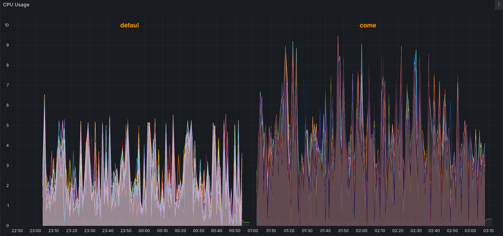
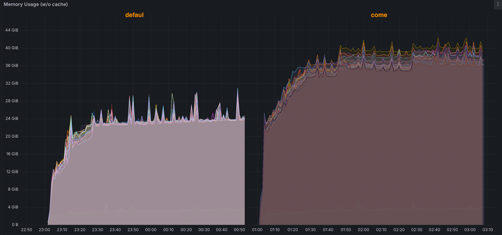
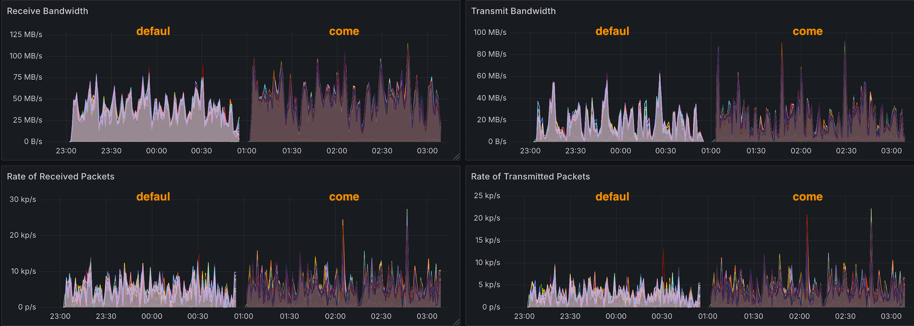
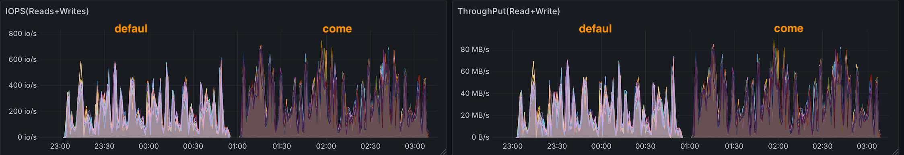

import Tabs from '@theme/Tabs';
import TabItem from '@theme/TabItem';
import BarChart from '@site/src/components/Charts/BarChart';
import PieChart from '@site/src/components/Charts/PieChart';

## Apache Spark with Apache DataFusion Comet Benchmarks

[Apache Spark](https://spark.apache.org/) powers large-scale analytics, but its JVM-based execution faces performance limitations. [Apache DataFusion Comet](https://github.com/apache/datafusion-comet) attempts to address this by offloading compute operations to a native Rust execution engine built on [Apache Arrow DataFusion](https://arrow.apache.org/datafusion/).

This benchmark evaluates Comet's performance on [Amazon EKS](https://aws.amazon.com/eks/) using the [TPC-DS](https://www.tpc.org/tpcds/) 1TB workload.


:::warning **TL;DR**
Our TPC-DS 1TB benchmark shows that **Apache DataFusion Comet (v0.13.0) delivered 18% slower overall performance** compared to native Spark SQL, with highly variable query-level results.
Some queries saw ~50% improvements, while others saw ~1500% degradation. The degradation is primarily due to Comet's lack of support for Dynamic Partition Pruning (DPP)
Performance is expected to improve significantly in future releases as DPP support is added.
:::

## TPC-DS 1TB Benchmark Results

### Summary

Our comprehensive TPC-DS 1TB benchmark on Amazon EKS demonstrates that **Apache DataFusion Comet does not provide overall speedup** (**18% slower**) compared to native Spark SQL, with individual queries showing mixed results.
Comet also required significantly more memory (~16GB more per executor) than Spark's default execution engine to successfully complete all queries.

#### Overall Performance

<BarChart
  title="Total Runtime Comparison"
  data={{
    labels: ['Native Spark', 'Comet'],
    datasets: [{
      label: 'Runtime (seconds)',
      data: [2090.46, 2470.43],
      backgroundColor: ['#27ae60', '#e74c3c'],
      borderColor: ['#229954', '#c0392b'],
      borderWidth: 2
    }]
  }}
  options={{
    scales: {
      y: { title: { display: true, text: 'Runtime (seconds)' } }
    }
  }}
  height="300px"
/>

#### Performance Distribution

<PieChart
  title="Query Performance Distribution"
  type="doughnut"
  data={{
    labels: ['20%+ improvement', '10-20% improvement', '±10%', '10-20% degradation', '20%+ degradation'],
    datasets: [{
      data: [25, 15, 38, 4, 22],
      backgroundColor: ['#27ae60', '#3498db', '#f39c12', '#e67e22', '#e74c3c'],
      borderWidth: 2,
      borderColor: '#ffffff'
    }]
  }}
/>


### Benchmark Infrastructure

:::info Benchmark Methodology
Benchmarks ran sequentially on the same cluster to ensure identical hardware and eliminate resource contention. Native Spark executed first, followed by Comet.
:::


#### Test Environment

| Component | Configuration |
|-----------|--------------|
| **EKS Cluster** | [Amazon EKS](https://aws.amazon.com/eks/) 1.34 |
| **Node Instance Type** | c5d.12xlarge (48 vCPUs, 96GB RAM, 1.8TB NVMe SSD) |
| **Node Group** | 8 nodes used for benchmark workloads (out of 24 total) |
| **Executor Configuration** | 23 executors × 5 cores × 58GB RAM each |
| **Driver Configuration** | 5 cores × 20GB RAM |
| **Dataset** | [TPC-DS](https://www.tpc.org/tpcds/) 1TB (Parquet format) |
| **Storage** | [Amazon S3](https://aws.amazon.com/s3/) with optimized S3A connector |

#### Spark Configuration Comparison

| Configuration | Native Spark | Comet |
|---------------|-------------|-------|
| **Spark Version** | 3.5.7 | 3.5.7 |
| **Comet Version** | N/A | 0.13.0 |
| **Java Runtime** | [OpenJDK](https://openjdk.org/) 17 | [OpenJDK](https://openjdk.org/) 17 |
| **Execution Engine** | JVM-based [Tungsten](https://spark.apache.org/docs/latest/sql-performance-tuning.html#project-tungsten) | Rust + JVM hybrid |
| **Key Plugins** | Standard Spark | `CometPlugin`, `CometShuffleManager` |
| **Off-heap Memory** | 32GB enabled | 32GB enabled |
| **Memory Management** | JVM GC | Unified native + JVM |

#### Critical Comet-Specific Configurations

```yaml
# Essential Comet Configuration
"spark.plugins": "org.apache.spark.CometPlugin"
"spark.shuffle.manager": "org.apache.spark.sql.comet.execution.shuffle.CometShuffleManager"

# Memory Configuration - Critical for Comet
"spark.memory.offHeap.enabled": "true"
"spark.memory.offHeap.size": "32g"  # Required: 16GB minimum, 32GB recommended

# Comet Execution Settings
"spark.comet.exec.enabled": "true"
"spark.comet.exec.shuffle.enabled": "true"
"spark.comet.exec.shuffle.mode": "auto"
"spark.comet.explainFallback.enabled": "true"
"spark.comet.cast.allowIncompatible": "true"

# AWS-Specific: Required for S3 region detection
"spark.hadoop.fs.s3a.endpoint.region": "us-west-2"
```

### Performance Results

#### Overall Performance

| Name | Completion Time (seconds) | Performance |
|------|---------------------------|-------------|
| Native Spark | 2,090.46 | Baseline |
| Comet | 2,470.43 | **-18%** |

#### Performance Distribution

| Performance Range | Query Count | Percentage |
|-------------------|-------------|------------|
| 20%+ improvement | 25 | 24% |
| 10-20% improvement | 15 | 14% |
| ±10% (neutral) | 38 | 37% |
| 10-20% degradation | 4 | 4% |
| 20%+ degradation | 22 | 21% |

#### Top 10 Query Improvements

<BarChart
  title="Top 10 Query Improvements (% faster with Comet)"
  data={{
    labels: ['q8', 'q5', 'q41', 'q93', 'q9', 'q76', 'q90', 'q73', 'q97', 'q44'],
    datasets: [
      {
        label: 'Improvement %',
        data: [54, 47, 40, 40, 34, 34, 33, 32, 31, 30],
        backgroundColor: '#27ae60',
        borderColor: '#229954',
        borderWidth: 1
      }
    ]
  }}
  options={{
    scales: {
      y: {
        beginAtZero: true,
        title: { display: true, text: 'Improvement (%)' }
      },
      x: {
        title: { display: true, text: 'TPC-DS Queries' }
      }
    }
  }}
  height="400px"
/>

| Query | Native Spark (s) | Comet (s) | Improvement |
|-------|------------------|-----------|-------------|
| q8-v2.4 | 5.9 | 2.7 | **54%** faster |
| q5-v2.4 | 20.4 | 10.8 | **47%** faster |
| q41-v2.4 | 1.2 | 0.7 | **40%** faster |
| q93-v2.4 | 77.9 | 47.1 | **40%** faster |
| q9-v2.4 | 56.4 | 37.2 | **34%** faster |
| q76-v2.4 | 33.5 | 22.1 | **34%** faster |
| q90-v2.4 | 14.6 | 9.7 | **33%** faster |
| q73-v2.4 | 3.8 | 2.6 | **32%** faster |
| q97-v2.4 | 19.5 | 13.5 | **31%** faster |
| q44-v2.4 | 25.2 | 17.6 | **30%** faster |

#### Top 10 Query Regressions

<BarChart
  title="Top 10 Query Regressions (% slower with Comet)"
  data={{
    labels: ['q25', 'q17', 'q54', 'q29', 'q45', 'q6', 'q18', 'q68', 'q11', 'q74'],
    datasets: [
      {
        label: 'Degradation %',
        data: [1308, 1020, 586, 330, 316, 210, 199, 168, 162, 137],
        backgroundColor: '#e74c3c',
        borderColor: '#c0392b',
        borderWidth: 1
      }
    ]
  }}
  options={{
    scales: {
      y: {
        beginAtZero: true,
        title: { display: true, text: 'Degradation (%)' }
      },
      x: {
        title: { display: true, text: 'TPC-DS Queries' }
      }
    }
  }}
  height="400px"
/>

| Query | Native Spark (s) | Comet (s) | Degradation |
|-------|------------------|-----------|-------------|
| q25-v2.4 | 5.7 | 79.9 | **1,308%** slower |
| q17-v2.4 | 6.8 | 76.5 | **1,020%** slower |
| q54-v2.4 | 6.2 | 42.3 | **586%** slower |
| q29-v2.4 | 17.7 | 76.0 | **330%** slower |
| q45-v2.4 | 6.6 | 27.6 | **316%** slower |
| q6-v2.4 | 10.2 | 31.6 | **210%** slower |
| q18-v2.4 | 10.5 | 31.3 | **199%** slower |
| q68-v2.4 | 6.6 | 17.6 | **168%** slower |
| q11-v2.4 | 25.7 | 67.4 | **162%** slower |
| q74-v2.4 | 22.1 | 52.3 | **137%** slower |

:::note
Extreme regressions (>100%) may indicate queries falling back to JVM execution while still incurring Comet's coordination overhead.
:::

#### Notes on Performance Differences

**Why Comet Underperforms on Some Queries:**

As of Comet v0.13.0, **Dynamic Partition Pruning (DPP) is not fully supported**. This limitation significantly impacts queries with partitioned fact tables joined to filtered dimension tables. Without DPP, Comet scans entire datasets instead of pruning irrelevant partitions at runtime.

**Example - Query 25 (1,308% slower):**
- **Comet**: Scanned all 1,823 parquet files, spending ~34 minutes total CPU time
- **Native Spark**: Applied DPP to read only 30 files, spending ~3 minutes total CPU time
- **Impact**: 60x more files read, resulting in 14x slower execution

This pattern appears across the worst-performing queries (q25, q17, q54, q29), where Comet reads 10-60x more data than necessary.

**Why Comet Outperforms on Other Queries:**

Comet's native Rust execution engine excels at CPU-intensive operations

**Example - Query 8 (54% faster):**
- **Parquet Scanning**: Both engines read the same files, but Comet's native reader processed 12M rows in 4.0s vs Spark's 6.0s (50% faster)
- **Sort-Merge Join**: Comet completed the join in 1.4s vs Spark's 2.7s (93% faster)
- **Aggregations**: Comet's vectorized execution significantly outperformed Spark's JVM-based aggregation


### Updated Results: Comet 0.14.0 on r8gd.12xlarge (March 2025)

We ran an updated benchmark with Comet 0.14.0 on memory-optimized r8gd.12xlarge instances (ARM64 Graviton) to evaluate the latest improvements.

#### Configuration Comparison

| Component | Original (v0.13.0) | Updated (v0.14.0) | Change |
|-----------|-------------------|-------------------|---------|
| **Comet Version** | 0.13.0 | 0.14.0 | ⬆️ Performance improvements |
| **Spark Version** | 3.5.7 | 3.5.8 | ⬆️ Minor upgrade |
| **Instance Type** | c5d.12xlarge | r8gd.12xlarge | 🔄 Compute → Memory optimized |
| **Architecture** | x86_64 (Intel) | ARM64 (Graviton) | 🔄 Different ISA |
| **RAM per Node** | 96GB | 384GB | ⬆️ 4x more |
| **Nodes** | 8 (out of 24 total) | 4 | ⬇️ 50% fewer |
| **Executors per Node** | ~3 (23÷8) | ~6 (23÷4) | ⬆️ 2x density |
| **TPC-DS Version** | v2.x | v4.0 | ⬆️ Updated queries |

#### Performance Results

| Configuration | Runtime (per iteration) | Total (3 iterations) | vs Native Spark |
|---------------|------------------------|---------------------|-----------------|
| **Comet 0.13.0** (c5d.12xlarge) | 41.2 min | 123.5 min | -18% |
| **Comet 0.14.0** (r8gd.12xlarge) | 42.8 min | 128.5 min | TBD* |

#### Cost Comparison

<table>
<thead>
<tr>
<th>Configuration</th>
<th>Nodes</th>
<th>Instance Price</th>
<th>Runtime</th>
<th>Total Cost</th>
<th>Cost/min</th>
</tr>
</thead>
<tbody>
<tr>
<td><strong>Comet 0.13.0</strong> (c5d.12xlarge)</td>
<td>8</td>
<td>$2.304/hr</td>
<td>2.06 hrs</td>
<td><strong>$37.93</strong></td>
<td>$0.307</td>
</tr>
<tr>
<td><strong>Comet 0.14.0</strong> (r8gd.12xlarge)</td>
<td>4</td>
<td>$4.848/hr</td>
<td>2.14 hrs</td>
<td><strong>$41.48</strong></td>
<td>$0.323</td>
</tr>
<tr style={{backgroundColor: '#ffe6e6'}}>
<td><strong>Difference</strong></td>
<td><strong>50% fewer</strong></td>
<td>2.1x higher</td>
<td>4% slower</td>
<td><strong>9% more expensive</strong></td>
<td><strong>5% worse</strong></td>
</tr>
</tbody>
</table>

Despite using 50% fewer nodes, the r8gd.12xlarge configuration was **9% more expensive** overall due to the 2.1x higher instance price and 4% longer runtime.

#### Key Findings

**Performance:** Comet 0.14.0 on r8gd.12xlarge was **4% slower** than 0.13.0 on c5d.12xlarge, despite:
- ✅ Comet 0.14.0 improvements (6% faster native scan, better shuffle)
- ✅ 4x more RAM per node (better memory bandwidth)
- ❌ 2x higher executor density (6 per node vs 3) causing resource contention

**Memory Usage:** Actual memory consumption remained consistent:
- Configured: 58GB per executor (20GB + 6GB overhead + 32GB off-heap)
- Observed: 38-45GB actual usage
- Off-heap utilization: Only 37-56% of allocated 32GB

**Recommendation:** For production workloads, consider:
1. Reducing off-heap from 32GB to 24GB (still provides 33% headroom)
2. Using lower executor density (fewer executors per node) to reduce contention
3. Waiting for native Spark baseline on r8gd.12xlarge for accurate comparison

#### Detailed Query-by-Query Comparison

<details>
<summary><strong>Click to expand: All 103 TPC-DS queries comparison (Native Spark vs Comet 0.13.0 vs Comet 0.14.0)</strong></summary>

<div style={{fontSize: '0.85em'}}>

| Query | Native Spark (s) | Comet 0.13.0 (s) | Comet 0.14.0 (s) | 0.13.0 vs Native | 0.14.0 vs 0.13.0 |
|-------|------------------|------------------|------------------|------------------|------------------|
| q1 | 6.44 | 5.69 | 4.72 | +12% faster | +17% faster |
| q10 | 6.73 | 6.14 | 5.64 | +9% faster | +8% faster |
| q11 | 25.70 | 67.35 | 72.71 | -162% slower | -8% slower |
| q12 | 2.07 | 2.22 | 2.01 | -7% slower | +9% faster |
| q13 | 11.88 | 10.55 | 10.01 | +11% faster | +5% faster |
| q14a | 101.63 | 102.75 | 105.33 | -1% slower | -3% slower |
| q14b | 77.79 | 78.20 | 80.98 | -1% slower | -4% slower |
| q15 | 6.14 | 5.88 | 5.03 | +4% faster | +14% faster |
| q16 | 27.22 | 26.65 | 28.92 | +2% faster | -9% slower |
| q17 | 6.83 | 76.49 | 87.23 | -1020% slower | -14% slower |
| q18 | 10.47 | 31.30 | 32.41 | -199% slower | -4% slower |
| q19 | 4.21 | 4.32 | 4.04 | -3% slower | +6% faster |
| q2 | 24.68 | 26.33 | 23.04 | -7% slower | +12% faster |
| q20 | 2.15 | 2.11 | 2.03 | +2% faster | +4% faster |
| q21 | 1.82 | 1.90 | 1.73 | -4% slower | +9% faster |
| q22 | 8.28 | 8.18 | 7.50 | +1% faster | +8% faster |
| q23a | 128.29 | 126.93 | 152.15 | +1% faster | -20% slower |
| q23b | 150.15 | 151.36 | 176.78 | -1% slower | -17% slower |
| q24a | 68.84 | 67.26 | 45.54 | +2% faster | +32% faster |
| q24b | 76.21 | 74.92 | 55.64 | +2% faster | +26% faster |
| q25 | 5.67 | 79.90 | 92.16 | -1308% slower | -15% slower |
| q26 | 5.02 | 4.92 | 4.52 | +2% faster | +8% faster |
| q27 | 7.33 | 7.85 | 6.69 | -7% slower | +15% faster |
| q28 | 46.74 | 47.67 | 46.22 | -2% slower | +3% faster |
| q29 | 17.66 | 76.00 | 86.79 | -330% slower | -14% slower |
| q3 | 4.64 | 4.23 | 4.13 | +9% faster | +2% faster |
| q30 | 12.62 | 13.59 | 11.80 | -8% slower | +13% faster |
| q31 | 13.17 | 13.61 | 11.03 | -3% slower | +19% faster |
| q32 | 2.03 | 1.99 | 1.76 | +2% faster | +12% faster |
| q33 | 3.72 | 3.58 | 3.43 | +4% faster | +4% faster |
| q34 | 5.65 | 5.76 | 5.54 | -2% slower | +4% faster |
| q35 | 15.21 | 14.27 | 12.17 | +6% faster | +15% faster |
| q36 | 6.17 | 6.09 | 5.83 | +1% faster | +4% faster |
| q37 | 6.96 | 7.07 | 7.37 | -2% slower | -4% slower |
| q38 | 12.22 | 11.86 | 12.78 | +3% faster | -8% slower |
| q39a | 10.02 | 9.48 | 8.45 | +5% faster | +11% faster |
| q39b | 7.84 | 7.29 | 6.58 | +7% faster | +10% faster |
| q4 | 127.05 | 124.42 | 131.41 | +2% faster | -6% slower |
| q40 | 22.05 | 20.76 | 24.92 | +6% faster | -20% slower |
| q41 | 1.21 | 0.73 | 0.66 | +40% faster | +10% faster |
| q42 | 1.88 | 1.68 | 1.66 | +11% faster | +1% faster |
| q43 | 4.74 | 4.42 | 4.57 | +7% faster | -3% slower |
| q44 | 25.17 | 17.58 | 17.14 | +30% faster | +2% faster |
| q45 | 6.64 | 27.62 | 27.61 | -316% slower | 0% |
| q46 | 11.02 | 10.83 | 10.30 | +2% faster | +5% faster |
| q47 | 9.21 | 8.62 | 8.94 | +6% faster | -4% slower |
| q48 | 11.51 | 10.99 | 11.06 | +5% faster | -1% slower |
| q49 | 58.63 | 57.15 | 66.02 | +3% faster | -16% slower |
| q5 | 20.42 | 10.81 | 9.34 | +47% faster | +14% faster |
| q50 | 44.90 | 42.49 | 53.99 | +5% faster | -27% slower |
| q51 | 10.76 | 10.82 | 11.42 | -1% slower | -6% slower |
| q52 | 1.62 | 1.62 | 1.99 | 0% | -23% slower |
| q53 | 4.62 | 4.57 | 4.73 | +1% faster | -4% slower |
| q54 | 6.17 | 42.28 | 42.88 | -586% slower | -1% slower |
| q55 | 1.64 | 1.63 | 1.53 | +1% faster | +6% faster |
| q56 | 3.09 | 3.49 | 2.27 | -13% slower | +35% faster |
| q57 | 8.32 | 7.72 | 9.77 | +7% faster | -27% slower |
| q58 | 3.10 | 3.47 | 2.34 | -12% slower | +33% faster |
| q59 | 17.79 | 17.71 | 17.49 | 0% | +1% faster |
| q6 | 10.18 | 31.61 | 37.72 | -210% slower | -19% slower |
| q60 | 7.12 | 3.63 | 3.51 | +49% faster | +3% faster |
| q61 | 6.14 | 5.92 | 3.34 | +4% faster | +44% faster |
| q62 | 8.21 | 7.90 | 8.25 | +4% faster | -4% slower |
| q63 | 5.39 | 4.86 | 4.58 | +10% faster | +6% faster |
| q64 | 89.16 | 86.64 | 106.62 | +3% faster | -23% slower |
| q65 | 17.31 | 16.88 | 17.05 | +2% faster | -1% slower |
| q66 | 8.30 | 7.84 | 7.94 | +6% faster | -1% slower |
| q67 | 74.12 | 73.54 | 71.00 | +1% faster | +3% faster |
| q68 | 6.56 | 17.65 | 18.72 | -168% slower | -6% slower |
| q69 | 6.31 | 6.26 | 5.01 | +1% faster | +20% faster |
| q7 | 7.76 | 7.51 | 8.28 | +3% faster | -10% slower |
| q70 | 8.77 | 8.86 | 8.64 | -1% slower | +2% faster |
| q71 | 2.95 | 2.92 | 2.79 | +1% faster | +4% faster |
| q72 | 17.61 | 17.44 | 17.79 | +1% faster | -2% slower |
| q73 | 3.82 | 2.60 | 2.31 | +32% faster | +11% faster |
| q74 | 22.11 | 52.35 | 53.99 | -137% slower | -3% slower |
| q75 | 40.51 | 38.41 | 42.99 | +5% faster | -12% slower |
| q76 | 33.48 | 22.06 | 22.45 | +34% faster | -2% slower |
| q77 | 2.26 | 2.33 | 2.16 | -3% slower | +7% faster |
| q78 | 52.49 | 53.47 | 50.85 | -2% slower | +5% faster |
| q79 | 6.24 | 5.52 | 5.40 | +12% faster | +2% faster |
| q8 | 5.89 | 2.71 | 3.03 | +54% faster | -12% slower |
| q80 | 53.99 | 51.00 | 67.66 | +6% faster | -33% slower |
| q81 | 16.46 | 17.66 | 11.71 | -7% slower | +34% faster |
| q82 | 9.15 | 9.27 | 8.98 | -1% slower | +3% faster |
| q83 | 1.84 | 1.77 | 1.49 | +4% faster | +16% faster |
| q84 | 8.44 | 7.96 | 7.99 | +6% faster | 0% |
| q85 | 14.37 | 13.13 | 13.75 | +9% faster | -5% slower |
| q86 | 3.96 | 3.52 | 4.27 | +11% faster | -21% slower |
| q87 | 13.41 | 12.52 | 13.18 | +7% faster | -5% slower |
| q88 | 50.21 | 47.20 | 45.73 | +6% faster | +3% faster |
| q89 | 6.02 | 5.40 | 4.80 | +10% faster | +11% faster |
| q9 | 56.37 | 37.17 | 38.54 | +34% faster | -4% slower |
| q90 | 14.55 | 9.75 | 10.25 | +33% faster | -5% slower |
| q91 | 2.45 | 2.54 | 2.13 | -4% slower | +16% faster |
| q92 | 1.46 | 1.52 | 1.49 | -4% slower | +2% faster |
| q93 | 77.85 | 47.08 | 52.74 | +40% faster | -12% slower |
| q94 | 19.36 | 18.82 | 19.12 | +3% faster | -2% slower |
| q95 | 38.31 | 37.42 | 37.56 | +2% faster | 0% |
| q96 | 9.22 | 8.39 | 8.08 | +9% faster | +4% faster |
| q97 | 19.46 | 13.53 | 11.98 | +31% faster | +11% faster |
| q98 | 3.22 | 2.83 | 2.86 | +12% faster | -1% slower |
| q99 | 8.87 | 8.52 | 8.68 | +4% faster | -2% slower |

</div>

**Key Observations:**
- **Comet 0.14.0 improvements:** 56 queries faster than 0.13.0, 47 queries slower
- **Biggest 0.14.0 improvements:** q61 (+44%), q56 (+35%), q81 (+34%), q58 (+33%), q24a (+32%)
- **Biggest 0.14.0 regressions:** q80 (-33%), q50 (-27%), q57 (-27%), q64 (-23%), q52 (-23%)
- **Persistent issues:** Queries with DPP problems (q11, q17, q18, q25, q29, q54, q6, q68, q74) remain slow in both versions

</details>

### Resource Usage Analysis

Both benchmarks ran sequentially on identical hardware to enable direct comparison. Native Spark executed first, followed by Comet. The metrics below show two distinct time periods—the first representing Native Spark, the second representing Comet.

#### CPU Utilization

Comet demonstrated **significantly higher and more sustained CPU utilization** compared to Native Spark:
- **Native Spark**: 3-6 cores per executor (typical), with occasional spikes to ~6.5 cores
- **Comet**: 5-9 cores per executor (sustained), with frequent peaks reaching 9+ cores

The higher CPU utilization reflects Comet's native Rust execution engine performing more intensive computation.



#### Memory Consumption

Comet required **significantly more memory** than Native Spark:
- **Native Spark**: ~24 GB per executor (observed steady state)
- **Comet**: ~40 GB per executor (observed steady state)

This represents a **67% increase in actual memory consumption** and aligns with Comet's off-heap memory requirements and dual runtime architecture (Rust + JVM).



#### Network Bandwidth

Network utilization patterns were comparable between Native Spark and Comet, with both showing similar bandwidth consumption for transmit and receive operations.



#### Storage I/O

Storage utilization (IOPS and throughput) showed similar patterns between Native Spark and Comet, indicating comparable disk I/O characteristics.



**Key Takeaway**: Comet's native execution engine consumes significantly more CPU and memory resources compared to Native Spark, while network and storage utilization remain comparable. Despite the increased CPU and memory consumption, the 18% overall slowdown indicates these additional resources do not translate to net performance improvements for TPC-DS workloads.


## When to Consider Comet

Despite the overall performance regression, Comet may be beneficial for:

- **Workloads dominated by specific query patterns** - If your workload consists primarily of queries similar to q8, q5, q41, q93 (30-54% faster), Comet could provide net benefits
- **Targeted query optimization** - Scenarios where you can isolate and route specific query patterns that align with Comet's strengths
- **Future versions** - As the project matures, performance characteristics may improve significantly

**Not recommended for:**

- General-purpose TPC-DS-like analytical workloads
- Memory-constrained environments (requires 2.2x memory overhead)
- Workloads requiring consistent, predictable performance across diverse query patterns

## Issues

### AWS S3 Region Detection

:::warning Required Configuration
Comet cannot reliably determine AWS region automatically. You must explicitly set the S3 endpoint region to avoid failures.
:::

**Solution:**
```yaml
"spark.hadoop.fs.s3a.endpoint.region": "us-west-2"
```

**Without this configuration, you may encounter:**

```
org.apache.comet.CometNativeException: General execution error with reason: Generic S3 error: Failed to resolve region: error sending request for url
at org.apache.comet.parquet.Native.initRecordBatchReader(Native Method)
	at org.apache.comet.parquet.NativeBatchReader.init(NativeBatchReader.java:568)
	at org.apache.comet.parquet.CometParquetFileFormat.$anonfun$buildReaderWithPartitionValues$1(CometParquetFileFormat.scala:175)

```


### Excessive DNS Query Volume

:::caution Critical Issue
Comet generates significantly higher DNS query volume compared to native Spark, potentially hitting Route53 Resolver limits.
:::

**Observed behavior:**

| Metric | Native Spark | Comet | Impact |
|--------|--------------|-------|--------|
| DNS queries/sec | 5-10 | Up to 5,000 | **500x increase** |
| Route53 limit | Well below 1,024/sec/ENI | Approaching/exceeding 1,024/sec/ENI | Limit reached |

**Symptoms:**
- `UnknownHostException` errors during job execution
- Intermittent S3 connectivity failures
- Job failures under high concurrency

**Root cause:**
Comet's native Rust layer may not leverage JVM DNS caching mechanisms, resulting in excessive DNS lookups.

**Solution:**
Deploy NodeLocal DNS Cache to cache DNS results on each node:
```bash
kubectl apply -f node-local-cache.yaml
```

Reference: [Kubernetes NodeLocal DNSCache](https://kubernetes.io/docs/tasks/administer-cluster/nodelocaldns/)

### Memory Requirements

:::caution Increased Memory Footprint
Comet requires significantly more off-heap memory compared to native Spark.
:::

**Memory comparison:**

Both benchmarks used identical pod configurations (58GB RAM per executor) to ensure fair comparison. The key differences:

| Metric | Native Spark | Comet | Difference |
|--------|--------------|-------|------------|
| Configured executor memory | 58 GB | 58 GB | Same |
| Off-heap memory configuration | Default (minimal) | 32 GB | Required for Comet |
| **Observed memory usage** | **~24 GB** | **~40 GB** | **+67%** |


**Key takeaways:**
- Native Spark only utilized ~24GB of the 58GB allocation, leaving significant headroom
- Comet required ~40GB and needs the 32GB off-heap configuration to avoid OOM
- While Native Spark can run efficiently with 26-30GB total memory, Comet requires 58GB+ to operate reliably
- This means Comet needs **2.2x more memory** than Native Spark for the same workload

## Running Benchmarks

### Prerequisites

- EKS cluster with Spark Operator installed
- S3 bucket with TPC-DS benchmark data
- Docker registry access (ECR or other)

### Step 1: Build Docker Image

Build the Comet-enabled Spark image:

```bash
cd data-stacks/spark-on-eks/benchmarks/datafusion-comet

# Build and push to your registry
docker build -t <your-registry>/spark-comet:3.5.7 -f Dockerfile-comet .
docker push <your-registry>/spark-comet:3.5.7
```

### Step 2: Install NodeLocal DNS Cache

To mitigate the DNS query volume issue, install NodeLocal DNS Cache:

```bash
kubectl apply -f node-local-cache.yaml
```

This caches DNS results locally on each node, preventing the excessive DNS queries to Route53 Resolver.

### Step 3: Update Bucket Names

Update the S3 bucket references in the benchmark manifests:

```bash
# For Comet benchmark
export S3_BUCKET=your-bucket-name
envsubst < tpcds-benchmark-comet-template.yaml | kubectl apply -f -

# For native Spark baseline
envsubst < tpcds-benchmark-357-template.yaml | kubectl apply -f -
```

Or manually edit the YAML files and replace `${S3_BUCKET}` with your bucket name.

### Step 4: Monitor Benchmark Progress

```bash
# Check job status
kubectl get sparkapplications -n spark-team-a

# View logs
kubectl logs -f -n spark-team-a -l spark-app-name=tpcds-benchmark-comet
```
