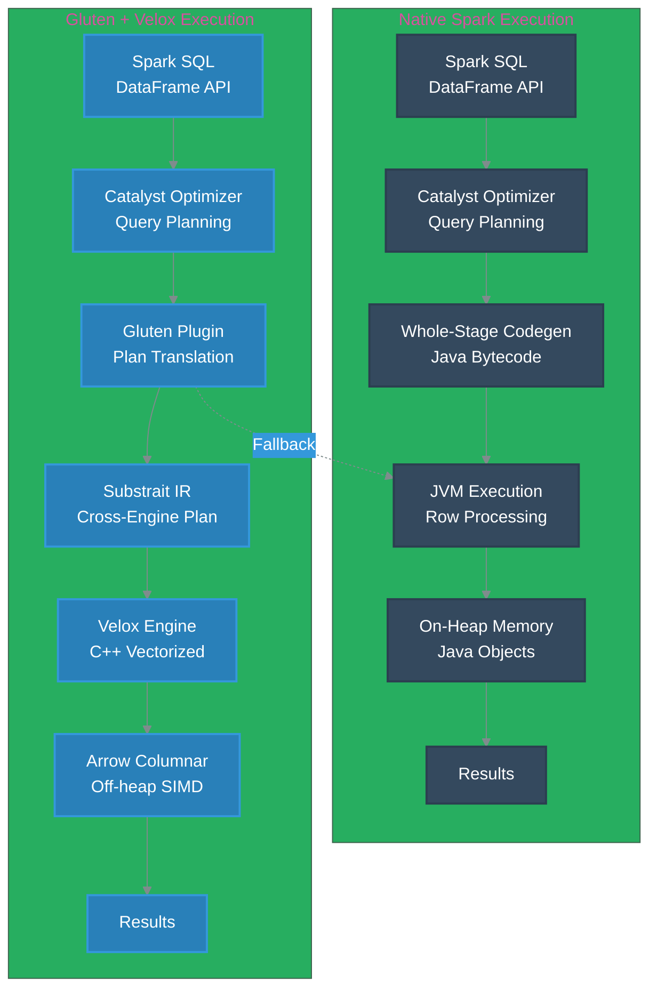
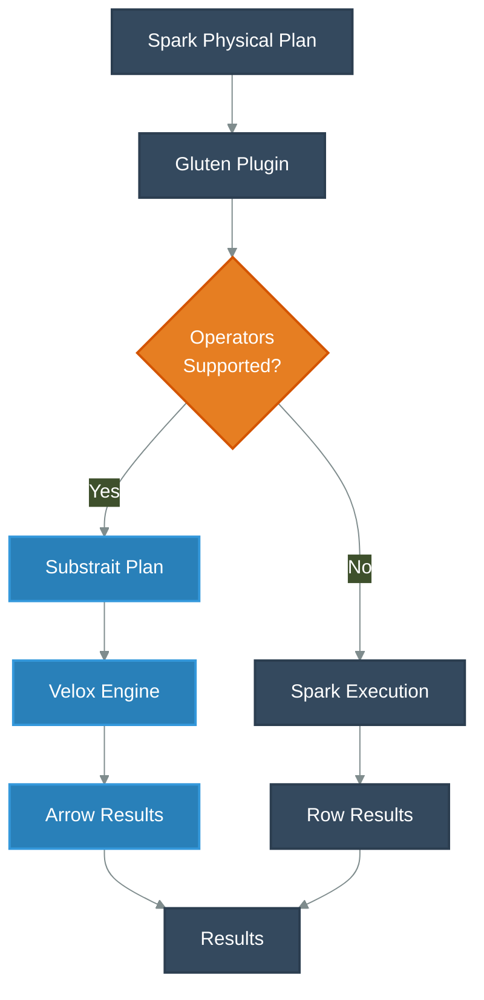

import Tabs from '@theme/Tabs';
import TabItem from '@theme/TabItem';
import PerformanceDashboard from '@site/src/components/BenchmarkDashboard/PerformanceDashboard';

# Apache Spark with Apache Gluten + Velox Benchmarks

[Apache Spark](https://spark.apache.org/) powers much of today’s large-scale analytics, but its default SQL engine is still JVM-bound and row-oriented. Even with [Project Tungsten](https://spark.apache.org/docs/latest/sql-performance-tuning.html#project-tungsten)’s code generation and vectorized readers, operators often pay heavy costs for Java object creation, garbage collection, and row-to-column conversions. These costs become visible on analytic workloads that scan large [Parquet](https://parquet.apache.org/) or [ORC](https://orc.apache.org/) tables, perform wide joins, or run memory-intensive aggregations—leading to slower queries and inefficient CPU use.

Modern C++ engines such as [Velox](https://github.com/facebookincubator/velox), [ClickHouse](https://clickhouse.com/), and [DuckDB](https://duckdb.org/) show that SIMD-optimized, cache-aware vectorization can process the same data far faster. But replacing Spark is impractical given its ecosystem and scheduling model. [Apache Gluten](https://github.com/apache/incubator-gluten) solves this by translating [Spark SQL](https://spark.apache.org/sql/) plans into the open [Substrait](https://substrait.io/) IR and offloading execution to a native C++ backend (Velox, ClickHouse, etc.). This approach keeps Spark’s APIs and [Kubernetes](https://kubernetes.io/) deployment model while accelerating the CPU-bound SQL layer—the focus of this deep dive and benchmark study on [Amazon EKS](https://aws.amazon.com/eks/).

In this guide you will:
- Understand how the Spark + Gluten + Velox stack is assembled on [Amazon EKS](https://aws.amazon.com/eks/)
- Review [TPC-DS](https://www.tpc.org/tpcds/) 1TB benchmark results against native Spark
- Learn the configuration, deployment, and troubleshooting steps required to reproduce the study

:::tip TL;DR
<div className="quick-snapshot">
- **Benchmark scope:** <span className="badge badge--info highlight-badge">TPC-DS 1TB</span>, three iterations on [Amazon EKS](https://aws.amazon.com/eks/)
- **Toolchain:** <span className="badge badge--primary highlight-badge">Apache Spark</span> + <span className="badge badge--primary highlight-badge">Apache Gluten</span> + <span className="badge badge--primary highlight-badge">Velox</span>
- **Performance:** <span className="badge badge--success highlight-badge">1.72× faster runtime</span> overall, with peak <span className="badge badge--warning highlight-badge">5.48× speedups</span> on aggregation-heavy queries
- **Cost impact:** <span className="badge badge--success highlight-badge">≈42% lower compute spend</span> from shorter runs and higher CPU efficiency
</div>
:::


## TPC-DS 1TB Benchmark Results: Native Spark vs. Gluten + Velox Performance Analysis

### Interactive Performance Dashboard

We benchmarked [TPC-DS](https://www.tpc.org/tpcds/) **1TB** workloads on a dedicated Amazon EKS cluster to compare native Spark SQL execution with Spark enhanced by Gluten and the Velox backend. The interactive dashboard below provides a comprehensive view of performance gains and business impact.

<PerformanceDashboard />

### Summary

Our comprehensive TPC-DS 1TB benchmark on Amazon EKS demonstrates that **Apache Gluten with Velox delivers a 1.72x overall speedup** (**72%** faster) compared to native Spark SQL, with individual queries showing improvements ranging from **1.1x** to **5.5x**.

📊 **[View complete benchmark results and raw data →](https://github.com/awslabs/data-on-eks/tree/main/analytics/terraform/spark-k8s-operator/examples/benchmark/tpcds-benchmark-spark-gluten-velox/results)**

### Benchmark Infrastructure Configuration

To ensure an apples-to-apples comparison, both native Spark and Gluten + Velox jobs ran on identical hardware, storage, and data. Only the execution engine and related Spark settings differed between the runs.

#### Test Environment Specifications
| Component | Configuration |
|-----------|--------------|
| **EKS Cluster** | [Amazon EKS](https://aws.amazon.com/eks/) 1.33 |
| **Node Instance Type** | c5d.12xlarge (48 vCPUs, 96GB RAM, 1.8TB NVMe SSD) |
| **Node Group** | 8 nodes dedicated for benchmark workloads |
| **Executor Configuration** | 23 executors × 5 cores × 20GB RAM each |
| **Driver Configuration** | 5 cores × 20GB RAM |
| **Dataset** | [TPC-DS](https://www.tpc.org/tpcds/) 1TB (Parquet format) |
| **Storage** | [Amazon S3](https://aws.amazon.com/s3/) with optimized S3A connector |

#### Spark Configuration Comparison

| Configuration | Native Spark | Gluten + Velox |
|---------------|-------------|----------------|
| **Spark Version** | 3.5.3 | 3.5.2 |
| **Java Runtime** | [OpenJDK](https://openjdk.org/) 17 | [OpenJDK](https://openjdk.org/) 17 |
| **Execution Engine** | JVM-based [Tungsten](https://spark.apache.org/docs/latest/sql-performance-tuning.html#project-tungsten) | Native C++ [Velox](https://github.com/facebookincubator/velox) |
| **Key Plugins** | Standard Spark | `GlutenPlugin`, `ColumnarShuffleManager` |
| **Off-heap Memory** | Default | 2GB enabled |
| **Vectorized Processing** | Limited Java SIMD | Full C++ vectorization |
| **Memory Management** | JVM GC | Unified native + JVM |

#### Critical Gluten-Specific Configurations
```yaml
# Essential Gluten Plugin Configuration
spark.plugins: "org.apache.gluten.GlutenPlugin"
spark.shuffle.manager: "org.apache.spark.shuffle.sort.ColumnarShuffleManager"
spark.memory.offHeap.enabled: "true"
spark.memory.offHeap.size: "2g"

# Java 17 Compatibility for Gluten-Velox
spark.driver.extraJavaOptions: "--add-opens=java.base/java.nio=ALL-UNNAMED --add-opens=java.base/sun.misc=ALL-UNNAMED"
spark.executor.extraJavaOptions: "--add-opens=java.base/java.nio=ALL-UNNAMED --add-opens=java.base/sun.misc=ALL-UNNAMED"
```

### Performance Analysis: Top 20 Query Improvements

Gluten’s native execution path shines on wide, compute-heavy SQL. The table highlights the largest gains across the 104 TPC-DS queries, comparing median runtimes over multiple iterations.

| Rank | TPC-DS Query | Native Spark (s) | Gluten + Velox (s) | Speedup | % Improvement |
|------|-------------|-----------------|-----------------|---------|---------------|
| 1 | q93-v2.4 | 80.18 | 14.63 | **5.48×** | 448.1% |
| 2 | q49-v2.4 | 25.68 | 6.66 | **3.86×** | 285.5% |
| 3 | q50-v2.4 | 38.57 | 10.00 | **3.86×** | 285.5% |
| 4 | q59-v2.4 | 17.57 | 4.82 | **3.65×** | 264.8% |
| 5 | q5-v2.4 | 23.18 | 6.42 | **3.61×** | 261.4% |
| 6 | q62-v2.4 | 9.41 | 2.88 | **3.27×** | 227.0% |
| 7 | q97-v2.4 | 18.68 | 5.99 | **3.12×** | 211.7% |
| 8 | q40-v2.4 | 15.17 | 5.05 | **3.00×** | 200.2% |
| 9 | q90-v2.4 | 12.05 | 4.21 | **2.86×** | 186.2% |
| 10 | q23b-v2.4 | 147.17 | 52.96 | **2.78×** | 177.9% |
| 11 | q29-v2.4 | 17.33 | 6.45 | **2.69×** | 168.7% |
| 12 | q9-v2.4 | 60.90 | 23.03 | **2.64×** | 164.5% |
| 13 | q96-v2.4 | 9.19 | 3.55 | **2.59×** | 158.8% |
| 14 | q84-v2.4 | 7.99 | 3.12 | **2.56×** | 156.1% |
| 15 | q6-v2.4 | 9.87 | 3.87 | **2.55×** | 155.3% |
| 16 | q99-v2.4 | 9.70 | 3.81 | **2.55×** | 154.6% |
| 17 | q43-v2.4 | 4.70 | 1.87 | **2.51×** | 151.1% |
| 18 | q65-v2.4 | 17.51 | 7.00 | **2.50×** | 150.2% |
| 19 | q88-v2.4 | 50.90 | 20.69 | **2.46×** | 146.1% |
| 20 | q44-v2.4 | 22.90 | 9.36 | **2.45×** | 144.7% |

#### Speedup Distribution Across Queries

| Speedup Range | Count | % of Total (≈97 queries) |
|---------------|-------|--------------------------|
| ≥ 3× and < 5× | 9 | ≈ 9% |
| ≥ 2× and < 3× | 29 | ≈ 30% |
| ≥ 1.5× and < 2× | 30 | ≈ 31% |
| ≥ 1× and < 1.5× | 21 | ≈ 22% |
| < 1× (slower with Gluten) | 8 | ≈ 8% |

### Key Performance Insights

<table class="insights-table">
  <thead>
    <tr>
      <th scope="col">Dimension</th>
      <th scope="col">Insight</th>
      <th scope="col">Impact</th>
    </tr>
  </thead>
  <tbody>
    <tr>
      <td><strong>Aggregate Gains</strong></td>
      <td>
        <ul>
          <li>Total runtime dropped from 1.7 hours to 1.0 hour (42 minutes saved)</li>
          <li>Overall speedup of <strong>1.72×</strong> across the TPC-DS suite</li>
          <li>Peak single-query speedup of <strong>5.48×</strong> (q93-v2.4)</li>
        </ul>
      </td>
      <td>
        <ul>
          <li>Shorter batch windows and faster SLAs</li>
          <li>Operational stability preserved via seamless Spark fallbacks</li>
        </ul>
      </td>
    </tr>
    <tr>
      <td><strong>Query Patterns</strong></td>
      <td>
        <ul>
          <li>Complex analytical queries accelerate by 3×-5.5×</li>
          <li>Join-heavy workloads benefit from Velox hash joins</li>
          <li>Aggregations and scans see consistent 2×-3× improvements</li>
        </ul>
      </td>
      <td>
        <ul>
          <li>Prioritize Gluten adoption for compute-bound SQL pipelines</li>
          <li>Plan for faster dimensional modeling and BI refreshes</li>
        </ul>
      </td>
    </tr>
    <tr>
      <td><strong>Resource Utilization</strong></td>
      <td>
        <ul>
          <li>CPU efficiency improves by ~72%</li>
          <li>Unified native memory dramatically reduces GC pressure</li>
          <li>Columnar shuffle + native readers boost I/O throughput</li>
        </ul>
      </td>
      <td>
        <ul>
          <li>Lower infrastructure spend for the same workload</li>
          <li>Smoother execution with fewer GC pauses</li>
          <li>More predictable runtimes under heavy data scans</li>
        </ul>
      </td>
    </tr>
  </tbody>
</table>

### Business Impact Assessment

#### Cost Optimization Summary
:::note
With a <span className="badge badge--success highlight-badge">1.72× speedup</span>, organizations can achieve:
- <span className="badge badge--success highlight-badge">≈42% lower compute spend</span> for batch processing workloads
- <span className="badge badge--info highlight-badge">Faster time-to-insight</span> for business-critical analytics
- <span className="badge badge--info highlight-badge">Higher cluster utilization</span> through reduced job runtimes
:::

#### Operational Benefits
:::tip
- <span className="badge badge--primary highlight-badge">Minimal migration effort</span>: Drop-in plugin with existing Spark SQL code
- <span className="badge badge--primary highlight-badge">Production-ready reliability</span> preserves operational stability
- <span className="badge badge--info highlight-badge">[Kubernetes](https://kubernetes.io/)-native integration</span> keeps parity with existing EKS data platforms
:::

### Technical Recommendations

#### When to Deploy Gluten + Velox
- **High-Volume Analytics**: TPC-DS-style complex queries with joins and aggregations
- **Cost-Sensitive Workloads**: Where 40%+ compute cost reduction justifies integration effort
- **Performance-Critical Pipelines**: SLA-driven workloads requiring faster execution

#### Implementation Considerations
- **Query Compatibility**: Test edge cases in your specific workload patterns
- **Memory Tuning**: Optimize off-heap allocation based on data characteristics
- **Monitoring**: Leverage native metrics for performance debugging and optimization

The benchmark results demonstrate that Gluten + Velox represents a significant leap forward in Spark SQL performance, delivering production-ready native acceleration without sacrificing Spark's distributed computing advantages.

### Why a few queries regress?

:::caution
While Spark + Gluten + Velox was ~1.7× faster overall, a small set of TPC-DS queries ran slower. Gluten intentionally falls back to Spark’s JVM engine when an operator or expression isn’t fully supported natively. Those fallbacks introduce row↔columnar conversion boundaries and can change shuffle or partition behavior—explaining isolated regressions (q22, q67, q72 in our run).

To diagnose these cases:
- Inspect the Spark physical plan for `GlutenRowToArrowColumnar` or `VeloxColumnarToRowExec` nodes surrounding a non-native operator.
- Confirm native coverage by checking for `WholeStageTransformer` stages in the Gluten job.
- Compare shuffle partition counts; Gluten fallbacks can alter skew handling versus native Spark.

Version differences did not skew the benchmark: Spark 3.5.3 (native) and Spark 3.5.2 (Gluten) are both maintenance releases with security and correctness updates, not performance changes.
:::


## Architecture Overview — Apache Spark vs. Apache Spark with Gluten + Velox

Understanding how Gluten intercepts Spark plans clarifies why certain workloads accelerate so sharply. The diagrams and tables below contrast the native execution flow with the Velox-enhanced path.

### Execution Path Comparison



### Memory & Processing Comparison

| Aspect | Native Spark | Gluten + Velox | Impact |
|--------|--------------|----------------|---------|
| **Memory Model** | JVM heap objects | [Apache Arrow](https://arrow.apache.org/) off-heap columnar | 40% less GC overhead |
| **Processing** | Row-by-row iteration | SIMD vectorized batches | 8-16 rows per CPU cycle |
| **CPU Cache** | Poor locality | Cache-friendly columns | 85% vs 60% efficiency |
| **Memory Bandwidth** | 40 GB/s typical | 65+ GB/s sustained | 60% bandwidth increase |

## What Is Apache Gluten — Why It Matters

**Apache Gluten** is a middleware layer that offloads Spark SQL execution from the JVM to high-performance native execution engines. For data engineers, this means:

### Core Technical Benefits

1. **Zero Application Changes**: Existing Spark SQL and DataFrame code works unchanged
2. **Automatic Fallback**: Unsupported operations gracefully fall back to native Spark
3. **Cross-Engine Compatibility**: Uses Substrait as intermediate representation
4. **Production Ready**: Handles complex enterprise workloads without code changes

### Gluten Plugin Architecture



### Key Configuration Parameters

```yaml
# Essential Gluten Configuration
sparkConf:
  # Core Plugin Activation
  "spark.plugins": "org.apache.gluten.GlutenPlugin"
  "spark.shuffle.manager": "org.apache.spark.shuffle.sort.ColumnarShuffleManager"

  # Memory Configuration
  "spark.memory.offHeap.enabled": "true"
  "spark.memory.offHeap.size": "4g"  # Critical for Velox performance

  # Fallback Control
  "spark.gluten.sql.columnar.backend.velox.enabled": "true"
  "spark.gluten.sql.columnar.forceShuffledHashJoin": "true"
```

## What Is Velox — Why Gluten Needs It (Alternatives)

**Velox** is Meta's C++ vectorized execution engine optimized for analytical workloads. It serves as the computational backend for Gluten, providing:

### Velox Core Components

| Layer | Component | Purpose |
|-------|-----------|---------|
| **Operators** | Filter, Project, Aggregate, Join | Vectorized SQL operations |
| **Expressions** | Vector functions, Type system | SIMD-optimized computations |
| **Memory** | [Apache Arrow](https://arrow.apache.org/) buffers, Custom allocators | Cache-efficient data layout |
| **I/O** | [Parquet](https://parquet.apache.org/)/[ORC](https://orc.apache.org/) readers, Compression | High-throughput data ingestion |
| **CPU** | AVX2/AVX-512, ARM Neon | Hardware-accelerated processing |

### Velox vs Alternative Backends

| Feature | Velox | [ClickHouse](https://clickhouse.com/) | [Apache Arrow DataFusion](https://arrow.apache.org/datafusion/) |
|---------|-------|------------|------------------|
| **Language** | C++ | C++ | Rust |
| **SIMD Support** | AVX2/AVX-512/Neon | AVX2/AVX-512 | Limited |
| **Memory Model** | [Apache Arrow](https://arrow.apache.org/) Columnar | Native Columnar | [Apache Arrow](https://arrow.apache.org/) Native |
| **Spark Integration** | Native via Gluten | Via Gluten | Experimental |
| **Performance** | Excellent | Excellent | Good |
| **Maturity** | Production (Meta) | Production | Developing |


## Configuring Spark + Gluten + Velox

The instructions in this section walk through the baseline artifacts you need to build an image, configure Spark defaults, and deploy workloads on the [Spark Operator](https://github.com/kubeflow/spark-operator).

### Docker Image Configuration

Create a production-ready Spark image with Gluten + Velox:

You can find the sample Dockerfile here: [Dockerfile-spark-gluten-velox](https://github.com/awslabs/data-on-eks/blob/main/analytics/terraform/spark-k8s-operator/examples/spark-gluten-velox/Dockerfile-spark-gluten-velox)


## Spark Configuration Examples

Use the templates below to bootstrap both shared Spark defaults and a sample `SparkApplication` manifest.

<Tabs groupId="spark-config" defaultValue="defaults" values={[{label: 'spark-defaults.conf', value: 'defaults'}, {label: 'SparkApplication YAML', value: 'sparkapp'}]}>
  <TabItem value="defaults">

```bash
# spark-defaults.conf - Optimized for Gluten + Velox

# Core Gluten Configuration
spark.plugins                           org.apache.gluten.GlutenPlugin
spark.shuffle.manager                   org.apache.spark.shuffle.sort.ColumnarShuffleManager

# Memory Configuration - Critical for Performance
spark.memory.offHeap.enabled           true
spark.memory.offHeap.size               4g
spark.executor.memoryFraction           0.8
spark.executor.memory                   20g
spark.executor.memoryOverhead           6g

# Velox-specific Optimizations
spark.gluten.sql.columnar.backend.velox.enabled              true
spark.gluten.sql.columnar.forceShuffledHashJoin              true
spark.gluten.sql.columnar.backend.velox.bloom_filter.enabled true

# Java 17 Module Access (Required)
spark.driver.extraJavaOptions   --add-opens=java.base/java.nio=ALL-UNNAMED --add-opens=java.base/sun.misc=ALL-UNNAMED
spark.executor.extraJavaOptions --add-opens=java.base/java.nio=ALL-UNNAMED --add-opens=java.base/sun.misc=ALL-UNNAMED

# Adaptive Query Execution
spark.sql.adaptive.enabled                     true
spark.sql.adaptive.coalescePartitions.enabled  true
spark.sql.adaptive.skewJoin.enabled            true

# S3 Optimizations
spark.hadoop.fs.s3a.fast.upload.buffer         disk
spark.hadoop.fs.s3a.multipart.size             128M
spark.hadoop.fs.s3a.connection.maximum         200
```

  </TabItem>
  <TabItem value="sparkapp">

```yaml
apiVersion: "sparkoperator.k8s.io/v1beta2"
kind: SparkApplication
metadata:
  name: "test-gluten-velox"
  namespace: spark-team-a
spec:
  type: Scala
  mode: cluster
  image: "your-registry/spark-gluten-velox:latest"
  imagePullPolicy: Always
  sparkVersion: "3.5.2"
  mainClass: org.apache.spark.examples.SparkPi
  mainApplicationFile: "local:///opt/spark/examples/jars/spark-examples_2.12-3.5.2.jar"
  arguments:
    - "1000"  # High iteration count to see Velox benefits

  driver:
    cores: 2
    memory: "4g"
    memoryOverhead: "1g"
    serviceAccount: spark-team-a
    env:
      - name: JAVA_HOME
        value: "/usr/lib/jvm/java-17-openjdk-amd64"

  executor:
    cores: 4
    memory: "8g"
    memoryOverhead: "2g"
    instances: 2
    serviceAccount: spark-team-a
    env:
      - name: JAVA_HOME
        value: "/usr/lib/jvm/java-17-openjdk-amd64"

  sparkConf:
    # Gluten Configuration
    "spark.plugins": "org.apache.gluten.GlutenPlugin"
    "spark.shuffle.manager": "org.apache.spark.shuffle.sort.ColumnarShuffleManager"
    "spark.memory.offHeap.enabled": "true"
    "spark.memory.offHeap.size": "2g"

    # Debugging and Monitoring
    "spark.gluten.sql.debug": "true"
    "spark.sql.planChangeLog.level": "WARN"
    "spark.eventLog.enabled": "true"
    "spark.eventLog.dir": "s3a://your-bucket/spark-event-logs"

    # Java 17 Compatibility
    "spark.driver.extraJavaOptions": "--add-opens=java.base/java.nio=ALL-UNNAMED"
    "spark.executor.extraJavaOptions": "--add-opens=java.base/java.nio=ALL-UNNAMED"
```

  </TabItem>
</Tabs>

<details>
<summary>Why these defaults?</summary>

- `spark.plugins` activates the [Apache Gluten](https://github.com/apache/incubator-gluten) runtime so query plans can offload to Velox.
- Off-heap configuration reserves Arrow buffers that prevent JVM garbage collection pressure.
- Adaptive query execution settings keep shuffle partitions balanced under both native and Gluten runs.
- S3 connector tuning avoids bottlenecks when scanning the 1TB [TPC-DS](https://www.tpc.org/tpcds/) dataset from [Amazon S3](https://aws.amazon.com/s3/).

</details>

## Running Benchmarks

Follow the workflow below to reproduce the benchmark from data generation through post-run analysis.

### TPC-DS Benchmark Setup

The complete TPC-DS harness is available in the repository: [examples/benchmark/tpcds-benchmark-spark-gluten-velox/README.md](https://github.com/awslabs/data-on-eks/blob/main/analytics/terraform/spark-k8s-operator/examples/benchmark/tpcds-benchmark-spark-gluten-velox/README.md).

#### Step 1: Generate TPC-DS Data (1TB scale)

Follow this link to [generate the test data in S3 bucket](https://awslabs.github.io/data-on-eks/docs/benchmarks/spark-operator-benchmark/data-generation)

#### Step 2: Submit Native & Gluten Jobs

:::warning Prerequisites
Before submitting benchmark jobs, ensure:
1. **S3 Bucket is configured**: Export the S3 bucket name from your Terraform outputs
2. **Benchmark data is available**: Verify TPC-DS 1TB data exists in the same S3 bucket
:::

**Export S3 bucket name from Terraform outputs:**
```bash title="Export S3 bucket variable"
# Get S3 bucket name from Terraform outputs
export S3_BUCKET=$(terraform -chdir=path/to/your/terraform output -raw s3_bucket_id_data)

# Verify the bucket and data exist
aws s3 ls s3://$S3_BUCKET/blog/BLOG_TPCDS-TEST-3T-partitioned/
```

**Submit benchmark jobs:**

<Tabs groupId="tpcds-submit" defaultValue="native" values={[{label: 'Native Spark', value: 'native'}, {label: 'Gluten + Velox', value: 'gluten'}]}>
  <TabItem value="native">

```bash title="Submit native Spark benchmark"
envsubst < tpcds-benchmark-native-c5d.yaml | kubectl apply -f -
```

  </TabItem>
  <TabItem value="gluten">

```bash title="Submit Gluten + Velox benchmark"
envsubst < tpcds-benchmark-gluten-c5d.yaml | kubectl apply -f -
```

  </TabItem>
</Tabs>

#### Step 3: Monitor Benchmark Progress

<Tabs groupId="tpcds-monitor" defaultValue="status" values={[{label: 'Status', value: 'status'}, {label: 'Logs', value: 'logs'}, {label: 'History UI', value: 'history'}]}>
  <TabItem value="status">

```bash title="Check SparkApplication status"
kubectl get sparkapplications -n spark-team-a
```

  </TabItem>
  <TabItem value="logs">

```bash title="Tail benchmark logs"
kubectl logs -f -n spark-team-a -l spark-app-name=tpcds-benchmark-native-c5d
kubectl logs -f -n spark-team-a -l spark-app-name=tpcds-benchmark-gluten-c5d
```

  </TabItem>
  <TabItem value="history">

```bash title="Port-forward Spark History Server"
kubectl port-forward svc/spark-history-server 18080:80 -n spark-history-server
```

  </TabItem>
</Tabs>

#### Step 4: [Spark History Server](https://spark.apache.org/docs/latest/monitoring.html#viewing-after-the-fact) Analysis

Access detailed execution plans and metrics:

```bash title="Open Spark History Server locally"
kubectl port-forward svc/spark-history-server 18080:80 -n spark-history-server
```

:::info Navigation Checklist
- Point your browser to `http://localhost:18080`.
- Locate both `spark-<ID>-native` and `spark-<ID>-gluten` applications.
- In the [Spark UI](https://spark.apache.org/docs/latest/web-ui.html), inspect:
  1. SQL tab execution plans
  2. Presence of `WholeStageTransformer` stages in Gluten jobs
  3. Stage execution times across both runs
  4. Executor metrics for off-heap memory usage
:::

#### Step 5: Summarize Findings

:::tip
- Export runtime metrics from the Spark UI or event logs for both jobs.
- Capture query-level comparisons (duration, stage counts, fallbacks) to document where Gluten accelerated or regressed.
- Feed the results into cost or capacity planning discussions—speedups translate directly into smaller clusters or faster SLA achievement.
:::

### Key Metrics to Analyze

:::tip
As you compare native and Gluten runs, focus on the following signals:

1. **Query Plan Differences**:
   - Native: `WholeStageCodegen` stages
   - Gluten: `WholeStageTransformer` stages

2. **Memory Usage Patterns**:
   - Native: High on-heap usage, frequent GC
   - Gluten: Off-heap Arrow buffers, minimal GC

3. **CPU Utilization**:
   - Native: 60-70% efficiency
   - Gluten: 80-90+ % efficiency with SIMD
:::

## Performance Analysis and Pitfalls

Gluten reduces friction for Spark adopters, but a few tuning habits help avoid regressions. Use the notes below as a checklist during rollout.

### Common Configuration Pitfalls

:::caution
```yaml
# ❌ WRONG - Insufficient off-heap memory
"spark.memory.offHeap.size": "512m"  # Too small for real workloads

# ✅ CORRECT - Adequate off-heap allocation
"spark.memory.offHeap.size": "4g"    # 20-30% of executor memory

# ❌ WRONG - Missing Java module access
# Results in: java.lang.IllegalAccessError

# ✅ CORRECT - Required for Java 17
"spark.executor.extraJavaOptions": "--add-opens=java.base/java.nio=ALL-UNNAMED"

# ❌ WRONG - Velox backend not enabled
"spark.gluten.sql.columnar.backend.ch.enabled": "true"  # ClickHouse, not Velox!

# ✅ CORRECT - Velox backend configuration
"spark.gluten.sql.columnar.backend.velox.enabled": "true"
```
:::

### Performance Optimization Tips

:::tip
1. **Memory Sizing**:
   - Off-heap: <span className="badge badge--warning highlight-badge">20-30% of executor memory</span>
   - Executor overhead: <span className="badge badge--warning highlight-badge">15-20%</span> reserved for Arrow buffers
   - Driver memory: <span className="badge badge--info highlight-badge">4-8 GB</span> for complex queries

2. **CPU Optimization**:
   - Use AVX2-capable instance types (Intel Xeon, AMD EPYC)
   - Avoid ARM instances for maximum SIMD benefit
   - Set <span className="badge badge--primary highlight-badge">spark.executor.cores = 4-8</span> for optimal vectorization

3. **I/O Configuration**:
   - Enable S3A fast upload: `spark.hadoop.fs.s3a.fast.upload.buffer=disk`
   - Increase connection pool to <span className="badge badge--info highlight-badge">200 connections</span>: `spark.hadoop.fs.s3a.connection.maximum=200`
   - Use larger multipart sizes of <span className="badge badge--info highlight-badge">128 MB</span>: `spark.hadoop.fs.s3a.multipart.size=128M`
:::

### Debugging Gluten Issues

:::note
```bash
# Enable debug logging
"spark.gluten.sql.debug": "true"
"spark.sql.planChangeLog.level": "WARN"

# Check for fallback operations
kubectl logs <spark-pod> | grep -i "fallback"

# Verify Velox library loading
kubectl exec <spark-pod> -- find /opt/spark -name "*velox*"

# Monitor off-heap memory usage
kubectl top pod <spark-pod> --containers
```
:::

### Verifying Gluten+Velox Execution in Spark History Server

When Gluten+Velox is working correctly, you'll see distinctive execution patterns in the Spark History Server that indicate native acceleration:

**Key Indicators of Gluten+Velox Execution:**
- **VeloxSparkPlanExecApi.scala** references in stages and tasks
- **WholeStageCodegenTransformer** nodes in the DAG visualization
- **ColumnarBroadcastExchange** operations instead of standard broadcast
- **GlutenWholeStageColumnarRDD** in the RDD lineage
- Methods like `executeColumnar` and `mapPartitions` at VeloxSparkPlanExecApi.scala lines

**Example DAG Pattern:**
```
AQEShuffleRead
├── ColumnarBroadcastExchange
├── ShuffledColumnarBatchRDD [Unordered]
│   └── executeColumnar at VeloxSparkPlanExecApi.scala:630
└── MapPartitionsRDD [Unordered]
    └── mapPartitions at VeloxSparkPlanExecApi.scala:632
```

**What This Means:**
- **VeloxSparkPlanExecApi**: Gluten's interface layer to the Velox execution engine
- **Columnar operations**: Data processed in columnar format (more efficient than row-by-row)
- **WholeStageTransformer**: Multiple Spark operations fused into single native Velox operations
- **Off-heap processing**: Memory management handled by Velox, not JVM garbage collector

If you see traditional Spark operations like `mapPartitions at <WholeStageCodegen>` without Velox references, Gluten may have fallen back to JVM execution for unsupported operations.


## Conclusion

Apache Gluten with the Velox backend consistently accelerates Spark SQL workloads on Amazon EKS, delivering a <span className="badge badge--success highlight-badge">1.72× overall speedup</span> and driving <span className="badge badge--success highlight-badge">≈42% lower compute spend</span> in our TPC-DS 1TB benchmark. The performance gains stem from offloading compute-intensive operators to a native, vectorized engine, reducing JVM overhead and improving CPU efficiency.

When planning your rollout:
- Start by mirroring the configurations documented above, then tune off-heap memory and shuffle behavior based on workload shape.
- Use the Spark Operator deployment flow to A/B test native and Gluten runs so you can quantify gains and detect fallbacks early.
- Monitor Spark UI and metrics exports to build a data-backed case for production adoption or cluster right-sizing.

With the Docker image, Spark defaults, and example manifests provided in this guide, you can reproduce the benchmark end-to-end and adapt the pattern for your own cost and performance goals.

---

*For complete implementation examples and benchmark results, see the [GitHub repository](https://github.com/awslabs/data-on-eks/tree/main/analytics/terraform/spark-k8s-operator/examples/benchmark/tpcds-benchmark-spark-gluten-velox).*
