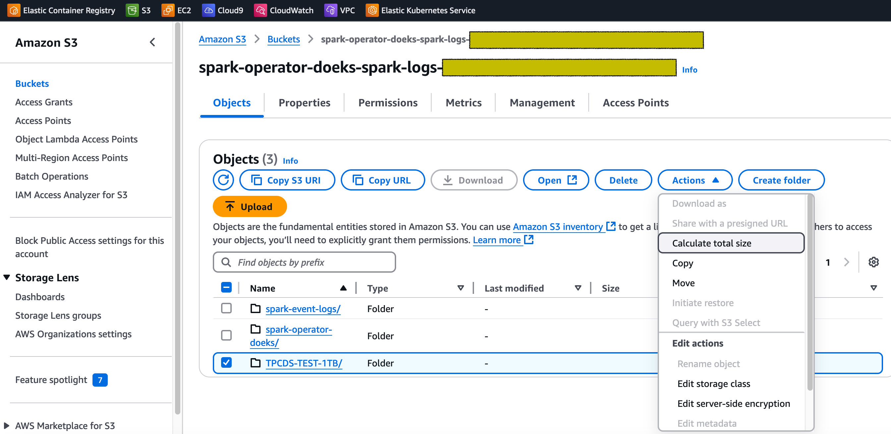
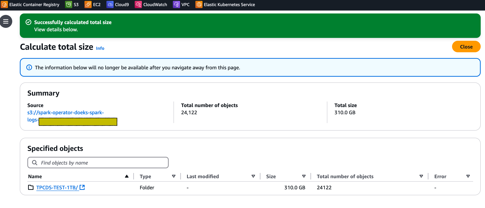
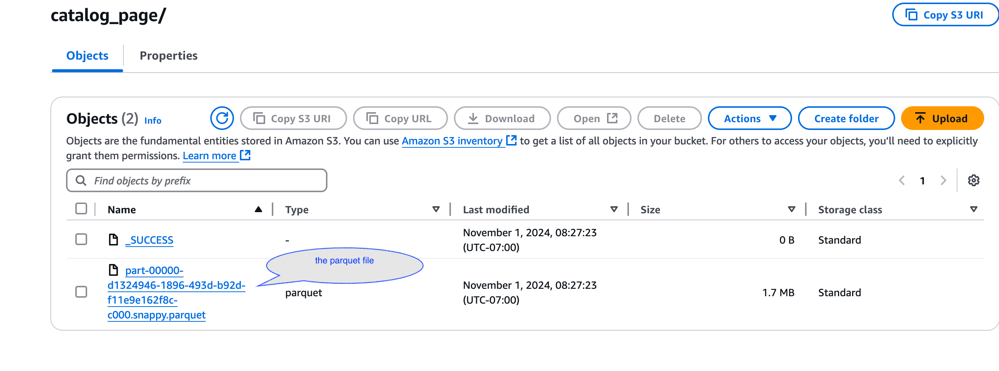
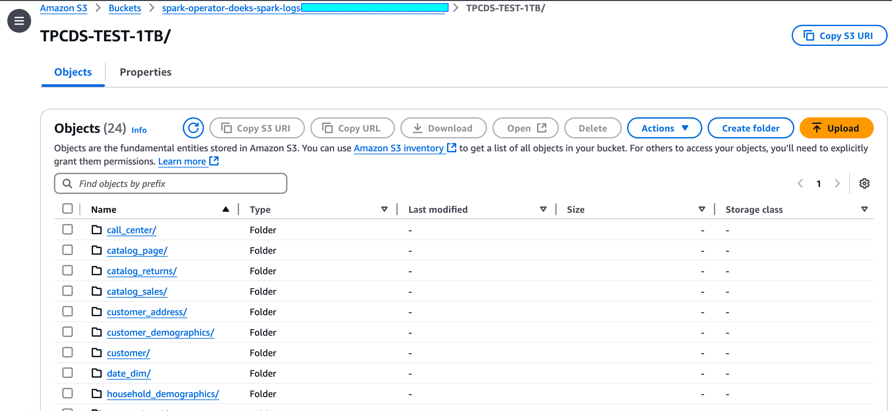

import Tabs from '@theme/Tabs';
import TabItem from '@theme/TabItem';
import CollapsibleContent from '../../../src/components/CollapsibleContent';
import ReplaceS3BucketPlaceholders from './_replace_s3_bucket_placeholders.mdx';

# Data Generation for Running Spark Benchmark Tests on Amazon EKS

The following guide provides instructions on how to generate the data set for running the TPCDS benchmark tests for Spark.

## Deploying the data generation toolkit

In this [example](https://github.com/awslabs/data-on-eks/tree/main/analytics/terraform/spark-k8s-operator), you will provision the following resources required to run Spark Jobs with open source Spark Operator.

This example deploys an EKS Cluster running the Spark K8s Operator into a new VPC.

- Creates a new sample VPC, 2 Private Subnets, 2 Public Subnets, and 2 subnets in the RFC6598 space (100.64.0.0/10) for EKS Pods.
- Creates Internet gateway for Public Subnets and NAT Gateway for Private Subnets
- Creates EKS Cluster Control plane with public endpoint (for demo reasons only) with Managed Node Groups for benchmarking and core services, and Karpenter NodePools for Spark workloads.
- Deploys Metrics server, Spark-operator, Apache Yunikorn, Karpenter, Cluster Autoscaler, Grafana, AMP and Prometheus server.

### Prerequisites

Ensure that you have installed the following tools on your machine.

1. [aws cli](https://docs.aws.amazon.com/cli/latest/userguide/install-cliv2.html)
2. [kubectl](https://Kubernetes.io/docs/tasks/tools/)
3. [terraform](https://learn.hashicorp.com/tutorials/terraform/install-cli)

### Deploy

Clone the repository.

```bash
git clone https://github.com/awslabs/data-on-eks.git
cd data-on-eks
export DOEKS_HOME=$(pwd)
```

If DOEKS_HOME is ever unset, you can always set it manually using `export
DATA_ON_EKS=$(pwd)` from your data-on-eks directory.

Export the following environment variables to set the minimum and desired number of ssd enabled `c5d12xlarge` instances. In our tests, we've set both of these to `6` based on the size of the dataset. Please adjust the number of instances as per your requirement and the size of the dataset you plan to run.

```bash
export TF_VAR_spark_benchmark_ssd_min_size=6
export TF_VAR_spark_benchmark_ssd_desired_size=6
```

**Note :** If you don't have access to `c5d` instances, feel free to use other EC2 instances that are equipped with local NVMe-based SSD block level storage. NVMe-based SSD instance storage enabled EC2 instances are a great fit for running the Spark benchmark data generation toolkit.

Navigate into the following directory and run `install.sh` script.

```bash
cd ${DOEKS_HOME}/analytics/terraform/spark-k8s-operator
chmod +x install.sh
./install.sh
```

Now create an S3_BUCKET variable that holds the name of the bucket created
during the install. This bucket will be used in later examples to store output
data. If S3_BUCKET is ever unset, you can run the following commands again.

```bash
export S3_BUCKET=$(terraform output -raw s3_bucket_id_spark_history_server)
echo $S3_BUCKET
```

## Generating Test Dataset for Running the TPCDS Benchmark

In order to generate the dataset for TPCDS benchmark tests, you will need to configure the S3 bucket name in the data generation manifest.

<!-- Docusaurus will not render the {props.filename} inside of a ```codeblock``` -->
<ReplaceS3BucketPlaceholders filename="./tpcds-benchmark-data-generation-1t.yaml" />
```bash
cd ${DOEKS_HOME}/analytics/terraform/spark-k8s-operator/examples/benchmark
sed -i.old s/\<S3_BUCKET\>/${S3_BUCKET}/g ./tpcds-benchmark-data-generation-1t.yaml
```

Then to begin the data generation execute the command below

```bash

kubectl apply -f tpcds-benchmark-data-generation-1t.yaml
```

Once you apply the `tpcds-benchmark-data-generation-1t.yaml` manifest, you should see the the driver and executor Pods coming up. It takes about an hour to finish the execution of the test data generation script. Once the execution is completed, you can see go into the AWS S3 console and validate the bucket size.

Navigate to the S3 bucket that got created as part of running the blueprint. Tick the checkbox besides the folder named `TPCDS-TEST-1TB` and click on `Actions` dropdown and then click on `Calculate total size` option as shown below.



For our dataset, the total size is 310 GB.



Once you go inside the `TPCDS-TEST-1TB` folder, you should see lot of subfolders that got generated (as shown below).



Each subfolder should have a .parquet file inside it that contains the generated data.



Also, check the Spark driver Pod execution status and logs to see if there are any errors.

```bash
kubectl get pod -n spark-team-a
```

Output:

```text
NAME                               READY   STATUS      RESTARTS   AGE
tpcds-data-generation-1tb-driver   0/1     Completed   0          59m
```

The log snippet of the `tpcds-data-generation-1tb-driver` pod should look like below

<CollapsibleContent header={<h2><span>Driver Pod Log Snippet</span></h2>}>

```text
24/11/01 15:29:42 INFO FileFormatWriter: Start to commit write Job xxxx.
24/11/01 15:29:42 INFO FileFormatWriter: Write Job xxxx committed. Elapsed time: 158 ms.
24/11/01 15:29:42 INFO FileFormatWriter: Finished processing stats for write job xxxx.
Data generated at s3a://spark-operator-doeks-spark-logs-xxx/TPCDS-TEST-1TB
24/11/01 15:29:42 INFO SparkContext: SparkContext is stopping with exitCode 0.
24/11/01 15:29:42 INFO SparkUI: Stopped Spark web UI at http://tpcds-data-generation-1tb-yyyyy-driver-svc.spark-team-a.svc:4040
24/11/01 15:29:42 INFO KubernetesClusterSchedulerBackend: Shutting down all executors
24/11/01 15:29:42 INFO KubernetesClusterSchedulerBackend$KubernetesDriverEndpoint: Asking each executor to shut down
24/11/01 15:29:42 WARN ExecutorPodsWatchSnapshotSource: Kubernetes client has been closed.
24/11/01 15:29:42 INFO MapOutputTrackerMasterEndpoint: MapOutputTrackerMasterEndpoint stopped!
24/11/01 15:29:42 INFO MemoryStore: MemoryStore cleared
24/11/01 15:29:42 INFO BlockManager: BlockManager stopped
24/11/01 15:29:42 INFO BlockManagerMaster: BlockManagerMaster stopped
24/11/01 15:29:42 INFO OutputCommitCoordinator$OutputCommitCoordinatorEndpoint: OutputCommitCoordinator stopped!
24/11/01 15:29:42 INFO SparkContext: Successfully stopped SparkContext
```
</CollapsibleContent>

## Cost Considerations

When utilizing c5d instances for data generation, it's important to keep cost implications in mind. These compute-optimized instances with local NVMe storage offer high performance but can be more expensive than standard c5 instances. To optimize costs, it's crucial to carefully monitor usage and scale resources appropriately. The local NVMe storage provides fast I/O, but data persistence is not guaranteed, so you should factor in the cost of data transfer and backup solutions. Spot instances can offer significant savings for interruptible workloads. Additionally, reserving instances for long-term, predictable usage can lead to substantial discounts. Also, it's essential to terminate these instances when they're no longer needed by adjusting the nodegroup's minimum and desired size to 0. This practice helps avoid unnecessary costs from idle resources.

:::caution
To avoid unwanted charges to your AWS account, delete all the AWS resources created during this deployment
:::

This script will cleanup the environment using `-target` option to ensure all the resources are deleted in correct order.

```bash
cd ${DOEKS_HOME}/analytics/terraform/spark-k8s-operator && chmod +x cleanup.sh
./cleanup.sh
```
