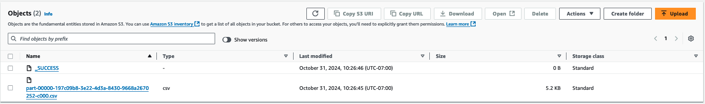

import ReplaceS3BucketPlaceholders from './_replace_s3_bucket_placeholders.mdx';

# Running Spark Benchmark Tests on Amazon EKS

The following guide provides instructions on how to execute the TPCDS benchmark tests for Spark.

## Deploying the Benchmark toolkit

In this [example](https://github.com/awslabs/data-on-eks/tree/main/analytics/terraform/spark-k8s-operator), you will provision the following resources required to run Spark Jobs with open source Spark Operator.

This example deploys an EKS Cluster running the Spark K8s Operator into a new VPC.

- Creates a new sample VPC, 2 Private Subnets, 2 Public Subnets, and 2 subnets in the RFC6598 space (100.64.0.0/10) for EKS Pods.
- Creates Internet gateway for Public Subnets and NAT Gateway for Private Subnets
- Creates EKS Cluster Control plane with public endpoint (for demo reasons only) with Managed Node Groups for benchmarking and core services, and Karpenter NodePools for Spark workloads.
- Deploys Metrics server, Spark-operator, Apache Yunikorn, Karpenter, Cluster Autoscaler, Grafana, AMP and Prometheus server.

### Prerequisites

Ensure that you have installed the following tools on your machine.

1. [aws cli](https://docs.aws.amazon.com/cli/latest/userguide/install-cliv2.html)
2. [kubectl](https://Kubernetes.io/docs/tasks/tools/)
3. [terraform](https://learn.hashicorp.com/tutorials/terraform/install-cli)


### Deploy

Clone the repository.

```bash
git clone https://github.com/awslabs/data-on-eks.git
cd data-on-eks
export DOEKS_HOME=$(pwd)
```

If DOEKS_HOME is ever unset, you can always set it manually using `export
DATA_ON_EKS=$(pwd)` from your data-on-eks directory.

Navigate into the following directory and run `install.sh` script.

```bash
cd ${DOEKS_HOME}/analytics/terraform/spark-k8s-operator
chmod +x install.sh
./install.sh
```

Now create an S3_BUCKET variable that holds the name of the bucket created
during the install. This bucket will be used in later examples to store output
data. If S3_BUCKET is ever unset, you can run the following commands again.

```bash
export S3_BUCKET=$(terraform output -raw s3_bucket_id_spark_history_server)
echo $S3_BUCKET
```


### Create the Test Dataset for Running the TPCDS Benchmark
The Benchmark requires an S3 bucket with input data to query and save the results back to.
If you don't have a data set in S3 you can use this same cluster to [run the Data Generation job](./data-generation.md) to create one.

Once you have an S3 bucket with the example data set, you can run the benchmark Job


## Running the TPCDS Benchmark

### Scale up the worker nodes
For these benchmarks we are not measuring the scaling speed but are focusing on the performance of the Spark SQL queries and the job runtime. To ensure the job is not interrupted by scaling activities or Spot interruptions we recommend using a Managed Node Group for the benchmarks, and scaling the capacity up before submitting the jobs

The blueprint [creates two Managed Node Groups](https://github.com/awslabs/data-on-eks/blob/main/analytics/terraform/spark-k8s-operator/eks.tf#L120-L207) that we use for these benchmarks:
- `spark_benchmark_ebs` - This nodegroup is configured for instances without NVMe storage such as r6g or c5
- `spark_benchmark_ssd` - This nodegroup will setup a RAID over NVMe devices available on the instances. This is perfect for instances with NVMe storage like r6gd, and c5d.
These nodegroups are scaled to 0 by default to save on costs, but you can configure the instance type you would like to benchmark on and then set the `min_size` and `desired_size` for the node group.

:::tip
The number of nodes required varies based on the size of the instance and the resource requests of the executot Pods used in the benchmark. Currently the benchmark requests 36 executors, each requesting 5vCPU and 26Gi memory, for a total of 180vCPU and 936Gi memory. This will fit on six r6g.12xlarge instances. You can compare the benchmark manifest against the instance types you'd like to use to find the required number of EC2 instances.
:::


### Set the S3 Bucket for input/output

<!-- Docusaurus will not render the {props.filename} inside of a ```codeblock``` -->
<ReplaceS3BucketPlaceholders filename="./tpcds-benchmark-1t-ebs.yaml" />
```bash
cd ${DOEKS_HOME}/analytics/terraform/spark-k8s-operator/examples/benchmark
sed -i.old s/\<S3_BUCKET\>/${S3_BUCKET}/g ./tpcds-benchmark-1t-ebs.yaml
```

### Submit the Benchmark Job

Then to begin the data generation execute the command below

```bash

kubectl apply -f tpcds-benchmark-1t-ebs.yaml
```

Once you apply the `tpcds-benchmark-1t-ebs.yaml` manifest, you should see the the driver and executor Pods coming up. It takes about an hour to finish the execution of a single iteration of the benchmark queries.

You can monitor the status of the job by checking the Spark driver Pod execution status and logs

```bash
kubectl get pod -n spark-team-a
```

Output:
```bash
NAME                             READY   STATUS    RESTARTS   AGE     IP               NODE                             NOMINATED NODE   READINESS GATES
benchmark-exec-ebs-exec-1        1/1     Running   0          75s     100.64.251.188   ip-100-64-219-156.ec2.internal   <none>           <none>
benchmark-exec-ebs-exec-10       1/1     Running   0          73s     100.64.213.1     ip-100-64-146-124.ec2.internal   <none>           <none>
...
benchmark-exec-ebs-exec-8        1/1     Running   0          74s     100.64.202.23    ip-100-64-219-156.ec2.internal   <none>           <none>
benchmark-exec-ebs-exec-9        1/1     Running   0          73s     100.64.238.20    ip-100-64-175-12.ec2.internal    <none>           <none>
tpcds-benchmark-1tb-ebs-driver   1/1     Running   0          2m33s   100.64.228.162   ip-100-64-213-174.ec2.internal   <none>           <none>
```

The benchmark is also configured to export metrics and logs so you can review the benchmark using the [Spark Observability tools explained here](https://awslabs.github.io/data-on-eks/docs/blueprints/data-analytics/observability-spark-on-eks#spark-history-server).

To get an idea how far along the benchmark is, you can use the Spark Web UI to review which query is currently being executed.
Port forward to the Benchmark Driver to see the UI:
```bash
kubectl port-forward -n spark-team-a service/tpcds-benchmark-1tb-ebs-ui-svc 4040:4040
```
Then open browser and enter localhost:4040. You can review the jobs that are running and that have completed. The benchmark will run the SQL queries sequentially so you can estimate how far along the job is by checking the query number.


Once the benchmark has completed you can scale the Nodgroup back to zero to save costs, and you can delete the remaining SparkApplication with the commands below:
```bash
cd ${DOEKS_HOME}/analytics/terraform/spark-k8s-operator/examples/benchmark
kubectl delete -f tpcds-benchmark-1t-ebs.yaml
```

## Reviewing the Results

When the benchmark completes it will place the results from the benchmark in the S3 bucket specified in the manifest file (default: `s3a://<S3_BUCKET>/TPCDS-TEST-1T-RESULT`). You can navigate to the S3 console for the corresponding S3 bucket and enter the directory:


When you enter the results directory you will see a list of folders which correspond to the timestamps the job was run:


You can find the latest result by selecting the timestamp that's largest, or find the folder that corresponds to the time of your test.
Inside this folder you will see a file with a name like `part-00000-000000000-0000-0000-0000-000000000-0000.json`, this file includes the full spark configuration used for the job.


Inside the subfolder named `summary.csv`, the `part-00000-000000000-0000-0000-0000-000000000-0000.csv` file includes the results of the benchmark.


If you open this csv file you will see 4 columns of data which show the time taken to process each query. The file does not include column headers, the columns from left to right are:
- the TPCDS Query number
- the median time that it took to process that query
- the minimum time that it took to process that query
- the maximum time that it took to process that query

:::tip
If the benchmark ran for a single iiteration (as is the default) then all three columns will display the same times.
:::

This image shows the output for 3 iterations with column headers added for clarity:


## Cost Considerations

When utilizing c5d instances for data generation, it's important to keep cost implications in mind. These compute-optimized instances with local NVMe storage offer high performance but can be more expensive than standard c5 instances. To optimize costs, it's crucial to carefully monitor usage and scale resources appropriately. The local NVMe storage provides fast I/O, but data persistence is not guaranteed, so you should factor in the cost of data transfer and backup solutions. Spot instances can offer significant savings for interruptible workloads. Additionally, reserving instances for long-term, predictable usage can lead to substantial discounts. Also, it's essential to terminate these instances when they're no longer needed by adjusting the nodegroup's minimum and desired size to 0. This practice helps avoid unnecessary costs from idle resources.

:::caution
To avoid unwanted charges to your AWS account, delete all the AWS resources created during this deployment
:::

This script will cleanup the environment using `-target` option to ensure all the resources are deleted in correct order.

```bash
cd ${DOEKS_HOME}/analytics/terraform/spark-k8s-operator && chmod +x cleanup.sh
./cleanup.sh
```
