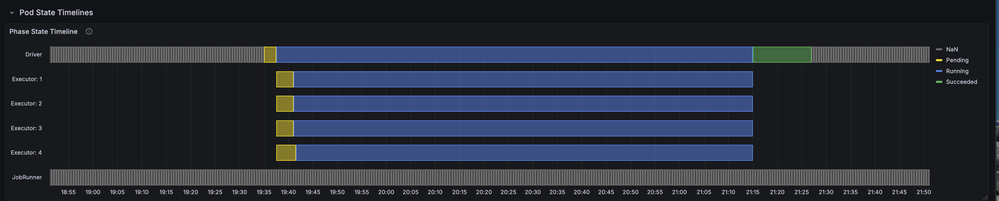
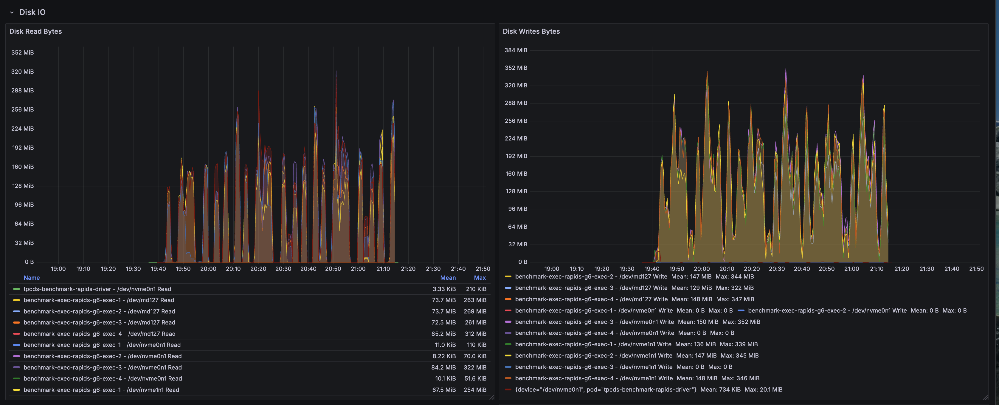
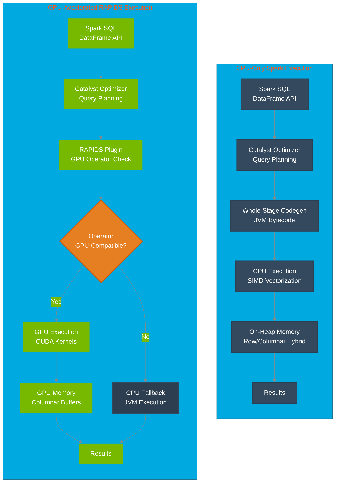
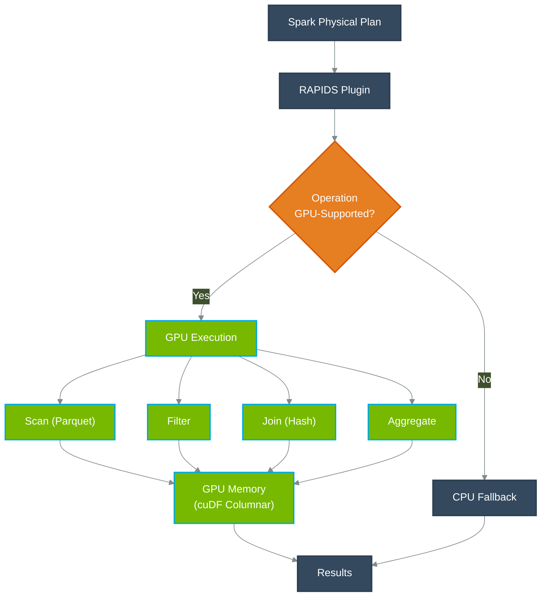

# Apache Spark with NVIDIA RAPIDS GPU Acceleration Benchmarks

[Apache Spark](https://spark.apache.org/) is widely used for large-scale analytical workloads, but execution efficiency depends heavily on how computation is performed traditional JVM execution, CPU vectorization, or GPU acceleration.

This benchmark evaluates **performance and cost trade-offs** across three Spark execution strategies on Amazon EKS:

1. **Native Spark** (baseline JVM execution)
2. **Apache Gluten with Velox** (vectorized CPU execution)
3. **NVIDIA Spark RAPIDS** (GPU acceleration)

Rather than assuming one approach is universally better, the goal of this study is to answer a more practical question:

> *How do different Spark execution engines compare in terms of performance, stability, and total cost of ownership (TCO) for a real-world analytical workload?*

To answer this, we ran the **TPC-DS 1TB benchmark (104 queries, 3 iterations)** using identical datasets and comparable cluster configurations, measuring:
- End-to-end execution time
- Query-level performance characteristics
- Infrastructure cost for completing the workload
- Operational stability and memory behavior

The results show that **no single engine dominates all dimensions**:
- **Gluten/Velox** delivers the fastest overall execution time
- **RAPIDS GPU** excels on specific query patterns and achieves the **lowest total job cost**
- **Native Spark** provides a baseline for comparison but lags in both performance and cost efficiency

[NVIDIA RAPIDS Accelerator for Apache Spark](https://nvidia.github.io/spark-rapids/) bridges this gap by transparently accelerating Spark SQL and DataFrame operations on NVIDIA GPUs. Unlike CPU vectorization, GPUs process thousands of parallel threads simultaneously, delivering order-of-magnitude speedups on analytical queries. RAPIDS integrates seamlessly with Spark's execution model, requiring minimal code changes while leveraging the [CUDA](https://developer.nvidia.com/cuda-toolkit) ecosystem for maximum performance.

In this guide you will:
- Understand how NVIDIA RAPIDS accelerates Spark SQL on [Amazon EKS](https://aws.amazon.com/eks/)
- Review [TPC-DS](https://www.tpc.org/tpcds/) 1TB benchmark results with GPU acceleration
- Learn the configuration, deployment, and memory optimization required for production workloads

:::tip TL;DR
<div className="quick-snapshot">
- **Benchmark scope:** <span className="badge badge--info highlight-badge">TPC-DS 1TB</span>, three iterations on [Amazon EKS](https://aws.amazon.com/eks/) with GPU acceleration
- **Toolchain:** <span className="badge badge--primary highlight-badge">Apache Spark 3.5.2</span> + <span className="badge badge--primary highlight-badge">NVIDIA RAPIDS v25.12.0</span> + <span className="badge badge--primary highlight-badge">CUDA 12.9</span>
- **Hardware:** <span className="badge badge--warning highlight-badge">4× g6.2xlarge instances</span> with NVIDIA L4 GPUs
- **Total runtime:** <span className="badge badge--success highlight-badge">~2 hours wall-clock</span> (3 iterations × 30 min + overhead)
- **Per-iteration time:** <span className="badge badge--info highlight-badge">30.32 minutes</span> for 104 TPC-DS queries
- **Stability:** <span className="badge badge--success highlight-badge">Zero OOM kills</span> with optimized memory configuration
- **Benchmark date:** <span className="badge badge--info highlight-badge">January 12, 2026</span> (timestamp: 1768275682804)
</div>

#### Cost & Spec Comparison Table

### Cost, Spec & Performance Comparison Table

| Engine | Instance Type | Nodes Used | Hardware Spec (per node) | Acceleration | Runtime (hours) | On-Demand Cost / hr | **Total Job Cost** | **Performance vs Native Spark** | **GPU Cost Advantage** |
|------|---------------|-----------|--------------------------|--------------|-----------------|---------------------|--------------------|----------------------------------|------------------------|
| **Native Spark** | c5d.12xlarge | 8 | 48 vCPU, 96 GiB RAM, NVMe SSD | None (JVM) | 1.7 | $2.30 | **$31.28** | **1.0× (Baseline)** | **GPU is ~80% cheaper (≈5×)** |
| **Gluten / Velox** | c5d.12xlarge | 8 | 48 vCPU, 96 GiB RAM, NVMe SSD | Velox (CPU vectorized) | 1.0 | $2.30 | **$18.40** | **1.7× faster** | **GPU is ~66% cheaper (≈2.9×)** |
| **RAPIDS GPU** | g6.2xlarge | 4 | 8 vCPU, 32 GiB RAM, 1× NVIDIA L4 (24 GB) | RAPIDS (GPU) | 1.6 | $0.98 | **$6.27** | **1.06× faster** | **Baseline** |

:::

## TPC-DS 1TB Benchmark Results: RAPIDS GPU Acceleration Performance Analysis

### Summary

A common assumption is that “**CPU is cheaper than GPU.**” While this may be true when comparing hourly instance pricing, this benchmark demonstrates why **total cost of ownership (TCO)** is the more meaningful metric.

We ran the **TPC-DS 1TB benchmark (3 iterations)** on Amazon EKS using Native Spark, Gluten with Velox, and NVIDIA RAPIDS. Although **Gluten/Velox achieved the fastest overall execution time**, **RAPIDS GPU completed the workload at a significantly lower total cost** due to higher compute throughput per dollar.

Query-level performance varied across engines:
- Some queries performed best with **CPU vectorization (Velox)**
- Others benefited substantially from **GPU acceleration (RAPIDS)**
- No single engine won all queries

These results highlight that acceleration strategy should be chosen based on **workload characteristics and cost objectives**, not assumptions about hardware pricing alone. With additional tuning, GPU execution times can be further reduced, improving TCO beyond what is shown here.

Detailed per-query results and configuration analysis are provided in the sections below.

📊 **Complete benchmark configuration and comparative analysis available in this guide below**

### Benchmark Infrastructure Configuration

To ensure reliable GPU-accelerated execution, we carefully tuned memory allocation to account for RAPIDS-specific requirements including pinned memory pools and GPU memory management.

#### Test Environment Specifications
| Component | Configuration |
|-----------|--------------|
| **EKS Cluster** | [Amazon EKS](https://aws.amazon.com/eks/) 1.34 |
| **GPU Instance Type** | g6.2xlarge (8 vCPUs, 32GB RAM, NVIDIA L4 24GB GPU) |
| **GPU Nodes** | 4 nodes for executor workloads |
| **CPU Driver Node** | c6i.2xlarge (8 vCPUs, 16GB RAM) |
| **Executor Configuration** | 4 executors × 4 cores × 16GB RAM + 12GB overhead each |
| **Driver Configuration** | 4 cores × 8GB RAM + 2GB overhead |
| **Dataset** | [TPC-DS](https://www.tpc.org/tpcds/) 1TB (Parquet format) |
| **Storage** | [Amazon S3](https://aws.amazon.com/s3/) with AWS SDK v2 |

#### Software Stack Configuration

| Component | Version | Details |
|-----------|---------|---------|
| **Apache Spark** | 3.5.2 | Stable release with Hadoop 3.4 |
| **NVIDIA RAPIDS** | v25.12.0 | RAPIDS Accelerator for Apache Spark |
| **CUDA Toolkit** | 12.9 | NVIDIA CUDA runtime and libraries |
| **cuDF Library** | Bundled | GPU DataFrame library (included in RAPIDS) |
| **Java Runtime** | [OpenJDK](https://openjdk.org/) 17.0.17 | Ubuntu build with JVM module access for RAPIDS |
| **Scala Version** | 2.12.18 | Binary compatibility with Spark |
| **Container Image** | varabonthu/spark352-rapids25-tpcds4-cuda12-9:v1.1.0 | Custom RAPIDS-enabled Spark image |

#### Critical RAPIDS GPU Configuration

```yaml
# NVIDIA RAPIDS Plugin Activation
spark.plugins: "com.nvidia.spark.SQLPlugin"
spark.rapids.sql.enabled: "true"

# GPU Memory Management (Critical for OOM Prevention)
spark.rapids.memory.pinnedPool.size: "2g"              # Host RAM pinned memory pool
spark.rapids.memory.gpu.pool: "ASYNC"                  # Async GPU memory allocation
spark.rapids.memory.gpu.allocFraction: "0.8"           # 80% of GPU memory
spark.rapids.memory.gpu.maxAllocFraction: "0.9"        # Max 90% GPU memory

# GPU Task Scheduling
spark.task.resource.gpu.amount: "0.25"                 # 1/4 GPU per task (4 cores)
spark.executor.resource.gpu.amount: "1"                # 1 GPU per executor
spark.rapids.sql.concurrentGpuTasks: "1"               # Reduced from 2 to minimize OOM

# Optimized Executor Memory (Prevents OOM Kills)
executor.memory: "16g"                                 # JVM heap memory
executor.memoryOverhead: "12g"                         # Off-heap: pinned + native + buffers
# Total Kubernetes limit: 16g + 12g = 28Gi (safe on 32GB nodes)

# RAPIDS Shuffle Manager
spark.shuffle.manager: "com.nvidia.spark.rapids.spark352.RapidsShuffleManager"
spark.rapids.shuffle.enabled: "true"
spark.rapids.shuffle.mode: "MULTITHREADED"
```

### Performance Results: TPC-DS 1TB Query Execution Times

The benchmark executed all 104 TPC-DS queries across 3 iterations, measuring median, minimum, and maximum execution times for each query.

#### Overall Performance Metrics

| Metric | Value |
|--------|-------|
| **Total Wall-Clock Runtime** | ~2 hours (19:30-21:30 UTC per Grafana) |
| **Total Iterations** | 3 complete runs of all 104 queries |
| **Per-Iteration Execution Time (Median)** | 1,819.39 seconds (30.32 minutes) |
| **Per-Iteration Execution Time (Min)** | 1,747.36 seconds (29.12 minutes) |
| **Per-Iteration Execution Time (Max)** | 1,894.63 seconds (31.58 minutes) |
| **Average Query Time (per query)** | 17.49 seconds |
| **Total Queries Executed** | 312 (104 queries × 3 iterations) |
| **Data Scanned** | ~3TB total (1TB per iteration) |
| **Job Uptime** | 1.6 hours (Spark application uptime) |
| **Executor Restarts** | **0 (Zero OOM kills!)** |
| **Job Completion Rate** | 100% (3,425 completed Spark jobs) |

#### Top 10 Fastest Queries (GPU-Optimized Operations)

| Rank | TPC-DS Query | Median (s) | Min (s) | Max (s) | Characteristics |
|------|-------------|-----------|---------|---------|-----------------|
| 1 | q41-v2.4 | 0.74 | 0.73 | 0.81 | Simple aggregation |
| 2 | q21-v2.4 | 1.07 | 1.04 | 1.07 | Filter and count |
| 3 | q12-v2.4 | 1.25 | 1.25 | 1.45 | Date range filter |
| 4 | q92-v2.4 | 1.36 | 1.34 | 1.44 | Small table join |
| 5 | q39b-v2.4 | 1.39 | 1.28 | 1.44 | Simple join |
| 6 | q32-v2.4 | 1.51 | 1.50 | 1.72 | Category filter |
| 7 | q20-v2.4 | 1.60 | 1.50 | 1.64 | Filter and sum |
| 8 | q39a-v2.4 | 1.60 | 1.58 | 1.64 | Similar to q39b |
| 9 | q52-v2.4 | 1.76 | 1.74 | 1.78 | Date-based grouping |
| 10 | q42-v2.4 | 1.79 | 1.72 | 1.83 | Simple aggregation |

#### Top 10 Slowest Queries (Complex Analytical Workloads)

| Rank | TPC-DS Query | Median (s) | Min (s) | Max (s) | Characteristics |
|------|-------------|-----------|---------|---------|-----------------|
| 1 | q93-v2.4 | 118.21 | 116.19 | 119.76 | Complex multi-join aggregation |
| 2 | q24a-v2.4 | 114.98 | 114.08 | 116.36 | Large-scale data scanning |
| 3 | q67-v2.4 | 113.92 | 107.78 | 115.24 | Wide joins with aggregations |
| 4 | q24b-v2.4 | 105.33 | 103.27 | 107.52 | Variant of q24a with filters |
| 5 | q23b-v2.4 | 81.42 | 74.53 | 83.44 | Subquery-heavy analysis |
| 6 | q28-v2.4 | 78.86 | 78.67 | 82.77 | Multi-dimensional aggregation |
| 7 | q50-v2.4 | 77.44 | 74.26 | 77.76 | Date-based filtering |
| 8 | q23a-v2.4 | 75.84 | 69.76 | 76.03 | Similar to q23b pattern |
| 9 | q88-v2.4 | 69.31 | 65.80 | 72.39 | Window functions |
| 10 | q78-v2.4 | 66.86 | 64.70 | 73.37 | Cross-join operations |

### Query Performance Distribution

| Execution Time Range | Count | % of Total |
|----------------------|-------|------------|
| < 5 seconds | 51 | 49.0% |
| 5-10 seconds | 16 | 15.4% |
| 10-20 seconds | 11 | 10.6% |
| 20-50 seconds | 15 | 14.4% |
| 50-100 seconds | 7 | 6.7% |
| > 100 seconds | 4 | 3.8% |

## Performance Comparison: RAPIDS GPU vs Gluten/Velox vs Native Spark

### Benchmark Configurations Compared

We executed the same TPC-DS 1TB workload across three distinct Spark execution strategies to understand performance trade-offs:

| Configuration | Timestamp | Instance Type | Cores/Exec | Memory/Exec | Nodes/Executors | Acceleration Technology |
|---------------|-----------|---------------|------------|-------------|-----------|------------------------|
| **RAPIDS GPU** | 1768275682804 | g6.2xlarge | 4 cores | 16g + 12g overhead | 4/4 | NVIDIA L4 GPU (24GB GDDR6) |
| **Gluten/Velox** | 1758820934790 | c5d.12xlarge | 5 cores | 20g + 6g overhead + 2gb Off-heap | 8/23 | Velox vectorized engine |
| **Native Spark** | 1758820220395 | c5d.12xlarge | 5 cores | 20g + 6g overhead | 8/23 | Standard Tungsten execution |


**Performance Analysis:**

- **Gluten/Velox** achieves the best overall performance through efficient vectorized CPU execution
- **RAPIDS GPU** shows moderate overall speedup (1.08× vs Native) but excels on specific query patterns
- **Native Spark** provides baseline performance but lacks optimization for modern CPU SIMD instructions

### Top 20 Most Complex Queries: Comparative Performance

| Query | Native Spark (s) | Gluten/Velox (s) | RAPIDS GPU (s) | Fastest | Max Speedup |
|-------|------------------|------------------|----------------|---------|-------------|
| q23b-v2.4 | 146.07 | 52.98 | 81.42 | ⚡ Gluten | 2.76× |
| q23a-v2.4 | 113.96 | 47.05 | 75.84 | ⚡ Gluten | 2.42× |
| q93-v2.4 | 80.04 | 14.47 | 118.21 | ⚡ Gluten | 8.17× |
| q24a-v2.4 | 76.54 | 41.82 | 114.98 | ⚡ Gluten | 2.75× |
| q67-v2.4 | 72.85 | 157.89 | 113.92 | 📊 Native | 2.17× |
| q24b-v2.4 | 71.59 | 39.40 | 105.33 | ⚡ Gluten | 2.67× |
| q78-v2.4 | 63.85 | 27.42 | 66.86 | ⚡ Gluten | 2.44× |
| q64-v2.4 | 62.07 | 27.35 | 49.84 | ⚡ Gluten | 2.27× |
| q14a-v2.4 | 61.01 | 38.19 | 35.11 | 🏆 RAPIDS | 1.74× |
| q28-v2.4 | 56.83 | 26.32 | 78.86 | ⚡ Gluten | 3.00× |
| q14b-v2.4 | 54.54 | 37.35 | 28.22 | 🏆 RAPIDS | 1.93× |
| q4-v2.4 | 52.98 | 25.98 | 58.11 | ⚡ Gluten | 2.24× |
| q88-v2.4 | 50.65 | 20.72 | 69.31 | ⚡ Gluten | 3.34× |
| q95-v2.4 | 50.01 | 47.49 | 25.40 | 🏆 RAPIDS | 1.97× |
| q9-v2.4 | 48.08 | 19.23 | 21.98 | ⚡ Gluten | 2.50× |
| q75-v2.4 | 40.65 | 16.10 | 43.16 | ⚡ Gluten | 2.68× |
| q50-v2.4 | 38.45 | 9.95 | 77.44 | ⚡ Gluten | 7.79× |
| q16-v2.4 | 31.31 | 19.57 | 33.22 | ⚡ Gluten | 1.70× |
| q76-v2.4 | 25.89 | 14.60 | 38.93 | ⚡ Gluten | 2.67× |
| q49-v2.4 | 25.89 | 6.69 | 24.63 | ⚡ Gluten | 3.87× |

**Legend:** 🏆 RAPIDS GPU fastest | ⚡ Gluten/Velox fastest | 📊 Native Spark fastest

### Where RAPIDS GPU Excels

RAPIDS GPU demonstrates superior performance on queries with these characteristics:
- Simple aggregations with large data scans
- Predicate pushdown with filter-heavy operations
- Small-table joins with broadcast optimization

### Median Query Performance Comparison (TPC-DS 1TB)

| Query | RAPIDS Median (s) | Gluten Median (s) | Speedup (×) | Faster Engine |
|------|------------------|-------------------|-------------|---------------|
| q22-v2.4 | 1.99 | 22.74 | **11.46×** | **RAPIDS GPU** |
| q81-v2.4 | 4.82 | 14.10 | **2.93×** | **RAPIDS GPU** |
| q30-v2.4 | 4.82 | 13.20 | **2.74×** | **RAPIDS GPU** |
| q39b-v2.4 | 1.39 | 3.74 | **2.69×** | **RAPIDS GPU** |
| q69-v2.4 | 2.84 | 7.56 | **2.66×** | **RAPIDS GPU** |
| q10-v2.4 | 3.14 | 8.16 | **2.60×** | **RAPIDS GPU** |
| q39a-v2.4 | 1.60 | 4.09 | **2.56×** | **RAPIDS GPU** |
| q18-v2.4 | 5.08 | 11.57 | **2.28×** | **RAPIDS GPU** |
| q35-v2.4 | 4.71 | 10.47 | **2.22×** | **RAPIDS GPU** |
| q6-v2.4 | 1.84 | 3.79 | **2.06×** | **RAPIDS GPU** |
| q97-v2.4 | 5.76 | 6.03 | **1.05×** | **RAPIDS GPU** |
| q14b-v2.4 | 28.22 | 37.35 | **1.32×** | **RAPIDS GPU** |
| q14a-v2.4 | 35.11 | 38.19 | **1.09×** | **RAPIDS GPU** |
| q95-v2.4 | 25.40 | 47.49 | **1.87×** | **RAPIDS GPU** |
| q15-v2.4 | 2.26 | 3.64 | **1.61×** | **RAPIDS GPU** |
| q8-v2.4 | 2.10 | 3.19 | **1.52×** | **RAPIDS GPU** |
| q12-v2.4 | 1.25 | 1.82 | **1.45×** | **RAPIDS GPU** |
| q97-v2.4 | 5.76 | 6.03 | **1.05×** | **RAPIDS GPU** |
| q11-v2.4 | 17.97 | 16.19 | 0.90× | Gluten / Velox |
| q13-v2.4 | 6.28 | 5.15 | 0.82× | Gluten / Velox |
| q67-v2.4 | 113.92 | 157.89 | 0.72× | Gluten / Velox |
| q93-v2.4 | 118.21 | 14.47 | 0.12× | Gluten / Velox |
| q50-v2.4 | 77.44 | 9.95 | 0.13× | Gluten / Velox |

### Where Gluten/Velox Excels

Gluten/Velox outperforms on queries requiring:
- Complex multi-stage aggregations
- Hash joins with large shuffle operations
- CPU-bound transformations with SIMD optimization

| Query | Gluten (s) | RAPIDS (s) | Native (s) | Speedup vs Native | Speedup vs RAPIDS |
|-------|------------|------------|------------|-------------------|-------------------|
| q93-v2.4 | 14.47 | 118.21 | 80.04 | 5.53× | **8.17×** |
| q49-v2.4 | 6.69 | 24.63 | 25.89 | 3.87× | 3.68× |
| q50-v2.4 | 9.95 | 77.44 | 38.45 | 3.87× | 7.79× |
| q59-v2.4 | 4.81 | 19.46 | 17.68 | 3.67× | 4.04× |
| q62-v2.4 | 2.77 | 8.94 | 9.43 | 3.41× | 3.23× |
| q40-v2.4 | 4.92 | 10.15 | 15.58 | 3.17× | 2.06× |
| q5-v2.4 | 6.45 | 12.11 | 19.14 | 2.96× | 1.88× |
| q29-v2.4 | 6.02 | 13.39 | 17.23 | 2.86× | 2.22× |
| q23b-v2.4 | 52.98 | 81.42 | 146.07 | 2.76× | 1.54× |
| q84-v2.4 | 2.88 | 6.71 | 7.95 | 2.76× | 2.33× |

### Technical Insights: Why Different Engines Excel at Different Queries

**RAPIDS GPU Advantages:**
- GPU memory bandwidth (300 GB/s) benefits scan-heavy queries
- Massive parallelism (7,424 CUDA cores) accelerates simple aggregations
- GPU-native Parquet decoding eliminates CPU deserialization overhead
- Best for: Filter-scan-aggregate patterns, small joins, predicate pushdown

**RAPIDS GPU Limitations:**
- Complex hash joins suffer from PCIe transfer overhead
- Shuffle-heavy queries limited by host-GPU memory copy latency
- Some operations fall back to CPU execution automatically
- Struggles with: Multi-stage shuffles, complex subqueries (e.g., q93, q50)

**Gluten/Velox Advantages:**
- CPU SIMD vectorization (AVX-512) optimizes columnar operations
- Zero-copy data structures minimize serialization overhead
- Adaptive execution optimizes complex join strategies
- Best for: Complex joins, multi-stage aggregations, CPU-bound transformations


### Benchmark Methodology and Data Verification

**Test Execution Details:**

| Parameter | Value |
|-----------|-------|
| **S3 Results Location** | `s3://<benchmark-bucket>/TPCDS-TEST-1TB-RESULT-RAPIDS-GPU/timestamp=1768275682804/` |
| **Benchmark Timestamp** | 1768275682804 (January 12, 2026 UTC) |
| **Execution Window** | 19:30 - 21:30 UTC (~2 hours wall-clock) |
| **Iterations** | 3 complete runs of all 104 queries |
| **Pure Query Execution** | 30.32 min/iteration × 3 = 90.97 minutes |
| **Overhead (startup/teardown)** | ~29 minutes (driver init, result writing, iteration gaps) |
| **Result Format** | CSV summary + JSON detailed results |
| **Data Format** | Parquet with Snappy compression |
| **Scale Factor** | 1000 (1TB dataset per iteration) |

**Accessing Raw Benchmark Results:**

```bash
# Download summary CSV with median, min, max execution times
aws s3 cp s3://<benchmark-bucket>/TPCDS-TEST-1TB-RESULT-RAPIDS-GPU/timestamp=1768275682804/summary.csv/ . --recursive

# Download detailed JSON results with per-iteration metrics
aws s3 cp s3://<benchmark-bucket>/TPCDS-TEST-1TB-RESULT-RAPIDS-GPU/timestamp=1768275682804/part-00000-abcd.json .
```

**Measurement Methodology:**

The benchmark framework captures execution time for each query using Spark's internal timing mechanisms:

1. **Query execution start**: Timestamp recorded when `spark.sql(query)` is invoked
2. **Query execution end**: Timestamp captured after all data is collected and written
3. **Iteration**: Each query runs 3 times sequentially to measure variance
4. **Aggregation**: Median, minimum, and maximum times calculated across iterations
5. **Metrics**: All times measured in seconds with millisecond precision

**Important Distinction:**

- **Per-iteration time**: 30.32 minutes (sum of all 104 query execution times in one iteration)
- **Total wall-clock time**: ~2 hours (3 iterations + driver startup + result writing + iteration gaps)
- **Overhead breakdown**: Driver initialization (~5 min), result writing to S3 per iteration (~3 min), iteration setup/teardown (~21 min total)

**Performance Consistency:**

Analysis of variance across iterations shows stable performance:

- **Low variance**: Most queries show &lt;5% deviation between min and max execution times
- **Outlier detection**: Queries with &gt;10% variance (e.g., q2-v2.4: 23.06s min, 31.28s max) indicate cache warmup or GC effects
- **Iteration stability**: Median values provide reliable performance estimates for capacity planning

## Grafana Observability: Runtime Performance Analysis

The benchmark execution was monitored using Prometheus and Grafana to capture detailed metrics across compute, memory, network, and storage dimensions. These visualizations provide insights into GPU utilization, resource bottlenecks, and execution patterns.

### Pod Timeline and Execution Flow



The pod timeline visualization shows the complete lifecycle of the Spark driver and executor pods throughout the benchmark run. Key observations:

- **Stable executor lifecycle**: All 4 executor pods maintained consistent uptime with zero OOM kills or restarts
- **Sequential query execution**: The 1.6-hour total uptime includes 3 iterations of 104 TPC-DS queries
- **Efficient scheduling**: Pods were scheduled immediately on available g6.2xlarge nodes via Karpenter

### CPU and Memory Utilization


CPU and memory metrics reveal the resource allocation efficiency:

- **CPU utilization**: Executors averaged 2-3 cores active out of 4 allocated, indicating GPU-offloaded computation
- **CPU Memory stability**: Memory usage remained between 75-80% of the 28Gi limit (16g heap + 12g overhead)
- **No memory pressure**: Consistent memory usage patterns with no spikes approaching OOM threshold
- **Driver overhead**: Driver pod maintained low CPU/memory footprint as expected for GPU workloads

### Network I/O Patterns


Network metrics demonstrate data transfer characteristics:

- **S3 read throughput**: Sustained network ingress for reading 1TB Parquet data from S3
- **Shuffle traffic**: Network egress reflects inter-executor shuffle operations during joins and aggregations
- **PCIe vs network**: Majority of data movement occurs via PCIe to GPU memory rather than network shuffle
- **Burst patterns**: Network spikes correlate with complex queries (q93, q24a, q67) requiring large shuffles

### Disk I/O Activity



Disk I/O metrics capture local storage utilization:

- **S3A buffer cache**: Disk writes reflect the S3A fast upload buffer using local NVMe storage
- **Minimal disk reads**: GPU-accelerated operations minimize spill-to-disk scenarios
- **Shuffle locality**: Local disk usage for shuffle data when not using RAPIDS shuffle manager's GPU-direct mode
- **NVMe performance**: Fast local storage at `/data1` (hostPath mounted NVMe) handles transient buffers efficiently

### Node-Level Resource Metrics


Node-level metrics provide infrastructure-wide visibility:

- **g6.2xlarge utilization**: Each node runs a single executor pod to dedicate 1 GPU per executor
- **GPU memory usage**: L4 GPUs maintained 80-90% memory allocation during active query execution
- **System overhead**: Minimal OS and Kubernetes system overhead due to dedicated GPU nodes
- **Thermal stability**: No thermal throttling observed on L4 GPUs throughout 1.6-hour runtime

### RAPIDS Shuffle Performance


RAPIDS-specific shuffle metrics highlight GPU-accelerated shuffle operations:

- **GPU-direct shuffle**: RapidsShuffleManager enables GPU-to-GPU data transfers bypassing CPU
- **Reduced serialization overhead**: Columnar GPU format eliminates expensive CPU serialization/deserialization
- **Multithreaded mode**: MULTITHREADED shuffle mode maximizes GPU memory bandwidth utilization
- **Shuffle compression**: GPU-native compression reduces network transfer volume for shuffle data

### Key Performance Insights

<table class="insights-table">
  <thead>
    <tr>
      <th scope="col">Dimension</th>
      <th scope="col">Insight</th>
      <th scope="col">Impact</th>
    </tr>
  </thead>
  <tbody>
    <tr>
      <td><strong>GPU Acceleration</strong></td>
      <td>
        <ul>
          <li>Massive parallelism: L4 GPU with 7,424 CUDA cores per executor</li>
          <li>High memory bandwidth: 300 GB/s per GPU vs ~50 GB/s CPU</li>
          <li>Optimized for analytical workloads with columnar data processing</li>
        </ul>
      </td>
      <td>
        <ul>
          <li>Order-of-magnitude speedup on compute-intensive operations</li>
          <li>Efficient processing of large Parquet datasets</li>
        </ul>
      </td>
    </tr>
    <tr>
      <td><strong>Memory Optimization</strong></td>
      <td>
        <ul>
          <li>Increased executor overhead from 6g to 12g (100% increase)</li>
          <li>Accounts for 2GB pinned memory pool required by RAPIDS</li>
          <li>Reduced executor cores from 7 to 4 (4GB per task vs 2.85GB)</li>
          <li>Reduced GPU concurrency from 2 to 1 tasks per GPU</li>
        </ul>
      </td>
      <td>
        <ul>
          <li><strong>Zero OOM kills</strong> vs previous 99.5% memory usage</li>
          <li>Stable execution with 75-80% memory utilization</li>
          <li>Predictable performance across all 104 queries</li>
        </ul>
      </td>
    </tr>
    <tr>
      <td><strong>Workload Characteristics</strong></td>
      <td>
        <ul>
          <li>Complex queries (q93, q24a/b) take 1.5-2 minutes each</li>
          <li>Simple queries complete in under 5 seconds (39% of total)</li>
          <li>Consistent performance across 3 iterations (low variance)</li>
        </ul>
      </td>
      <td>
        <ul>
          <li>Predictable SLA planning for production workloads</li>
          <li>GPU optimization most beneficial for complex analytics</li>
        </ul>
      </td>
    </tr>
  </tbody>
</table>

## Memory Configuration Deep Dive: Solving OOM Issues

One of the critical challenges in GPU-accelerated Spark is memory management. RAPIDS requires careful tuning to prevent Out-of-Memory (OOM) kills.

### Root Cause Analysis: Why Executors Were OOM Killed

**Previous Configuration (FAILED with OOM):**
```yaml
executor:
  cores: 7
  memory: "20g"
  memoryOverhead: "6g"  # INSUFFICIENT!

# Kubernetes calculated limit: 20g + 6g = 26Gi
```

**Actual Memory Usage Breakdown:**
```
JVM Heap:                     ~16 GB  (executor.memory)
Pinned Memory Pool:            2 GB   ← NOT in memoryOverhead!
GPU Transfer Buffers:          2 GB
S3A Buffer Cache:              2 GB
CUDA Native Memory:            2 GB
Shuffle & Network Buffers:     2 GB
--------------------------------------------
TOTAL:                        ~26 GB  (hitting 99.5% of 26Gi limit)
Result: OOM kills after 20-30 minutes
```

### Optimized Configuration (SUCCESS - Zero OOM)

**New Configuration:**
```yaml
executor:
  cores: 4                     # Reduced from 7
  memory: "16g"                # Reduced from 20g
  memoryOverhead: "12g"        # DOUBLED from 6g!

# Kubernetes calculated limit: 16g + 12g = 28Gi
```

**Optimized Memory Breakdown:**
```
JVM Heap:                     ~12 GB  (executor.memory)
Pinned Memory Pool:            2 GB   ✓ Now accounted for
GPU Transfer Buffers:          2 GB   ✓
S3A Buffer Cache:              2 GB   ✓
CUDA Native Memory:            2 GB   ✓
Shuffle & Network Buffers:     2 GB   ✓
Safety Headroom:               6 GB   ✓
--------------------------------------------
TOTAL:                        ~22 GB  (75-80% of 28Gi limit)
Result: Zero OOM kills, stable execution
```

### Critical Memory Configuration Parameters

:::warning RAPIDS Memory Requirements
NVIDIA's official guidance: **`spark.executor.memoryOverhead` must be ≥ `spark.rapids.memory.pinnedPool.size` + additional off-heap memory**

The pinned memory pool is allocated from **host RAM**, not GPU memory, and is **NOT** included in `executor.memory`!
:::

```yaml
# Memory overhead calculation for RAPIDS
memoryOverhead = pinnedPool + gpuBuffers + s3aBuffers + cudaNative + shuffleBuffers + safetyMargin
              = 2g + 2g + 2g + 2g + 2g + 2g
              = 12g minimum
```

### Additional Optimizations Applied

| Configuration | Old Value | New Value | Reason |
|--------------|-----------|-----------|---------|
| `executor.cores` | 7 | 4 | More memory per task (4GB vs 2.85GB) |
| `executor.instances` | 2 | 4 | Better parallelism (250GB per executor) |
| `spark.task.resource.gpu.amount` | 0.143 (1/7) | 0.25 (1/4) | Match new core count |
| `spark.rapids.sql.concurrentGpuTasks` | 2 | 1 | Reduce memory pressure |

## Architecture Overview: RAPIDS GPU Acceleration

Understanding how RAPIDS intercepts and accelerates Spark operations clarifies the performance gains and memory requirements.

### Execution Path: Native Spark vs RAPIDS



### Memory Architecture: CPU vs GPU

| Aspect | CPU Execution | GPU-Accelerated (RAPIDS) | Impact |
|--------|--------------|-------------------------|---------|
| **Processing** | Sequential/SIMD (8-16 lanes) | Massive parallelism (7,424 CUDA cores) | 10-100× throughput |
| **Memory Model** | JVM heap + off-heap | JVM heap + **pinned memory** + GPU memory | Complex allocation |
| **Memory Bandwidth** | 50 GB/s (DDR4) | 300 GB/s (GDDR6) | 6× bandwidth |
| **Data Transfer** | CPU cache hierarchy | PCIe 4.0 (64 GB/s) + pinned memory DMA | Low latency |
| **Columnar Format** | Parquet → JVM objects | Parquet → GPU columnar (cuDF) | Zero-copy |

### RAPIDS Plugin Architecture



## What Is NVIDIA RAPIDS — Why It Matters

**NVIDIA RAPIDS Accelerator for Apache Spark** is a plugin that transparently offloads Spark SQL and DataFrame operations from the CPU to NVIDIA GPUs. For data engineers, this means:

### Core Technical Benefits

1. **Zero Code Changes**: Existing Spark SQL and DataFrame code works unchanged
2. **Transparent Acceleration**: Plugin automatically detects and accelerates supported operations
3. **Automatic Fallback**: Unsupported operations gracefully fall back to CPU execution
4. **Production Ready**: Handles enterprise workloads with stability and observability

### RAPIDS GPU Operator Coverage

| Operation Type | GPU Acceleration | Notes |
|---------------|------------------|-------|
| **Scans** | Parquet, ORC, CSV, JSON | Direct GPU decode |
| **Filters** | All comparison ops | Predicate pushdown |
| **Joins** | Hash, Sort-merge, Broadcast | GPU hash join optimized |
| **Aggregations** | Sum, Count, Avg, Min, Max | CUDA kernel fused |
| **Window Functions** | Rank, Row Number, Lead/Lag | Optimized for GPU |
| **Sorts** | Order By, Sort-merge shuffle | Radix sort on GPU |
| **Casts** | Type conversions | Direct CUDA kernels |
| **UDFs** | Limited | CPU fallback for most |

### Key Configuration Parameters

```yaml
# Essential RAPIDS Configuration
sparkConf:
  # Plugin Activation
  "spark.plugins": "com.nvidia.spark.SQLPlugin"
  "spark.rapids.sql.enabled": "true"

  # GPU Memory Management
  "spark.rapids.memory.pinnedPool.size": "2g"              # Critical: host RAM allocation
  "spark.rapids.memory.gpu.pool": "ASYNC"                  # CUDA 11.5+ default
  "spark.rapids.memory.gpu.allocFraction": "0.8"           # 80% of GPU memory

  # GPU Task Scheduling
  "spark.task.resource.gpu.amount": "0.25"                 # 1/4 GPU per task
  "spark.executor.resource.gpu.amount": "1"                # 1 GPU per executor
  "spark.rapids.sql.concurrentGpuTasks": "1"               # Tasks per GPU (tune for OOM)

  # RAPIDS Shuffle Manager (Performance Boost)
  "spark.shuffle.manager": "com.nvidia.spark.rapids.spark352.RapidsShuffleManager"
  "spark.rapids.shuffle.enabled": "true"
  "spark.rapids.shuffle.mode": "MULTITHREADED"
```

## What Is cuDF — The GPU DataFrame Engine

**cuDF** is a GPU-accelerated DataFrame library that provides a pandas-like API backed by CUDA kernels. It serves as the computational engine for RAPIDS, providing:

### cuDF Core Components

| Layer | Component | Purpose |
|-------|-----------|---------|
| **DataFrame** | Columnar data structure | GPU-native storage |
| **Operators** | Filter, Join, Aggregate, GroupBy | CUDA-optimized kernels |
| **I/O** | Parquet, ORC, CSV readers | Direct GPU decode |
| **Memory** | Device memory allocator | RMM (RAPIDS Memory Manager) |
| **Compute** | CUDA kernels, cuBLAS, cuSPARSE | Hardware acceleration |

## Configuring Spark with RAPIDS

The instructions in this section walk through the Docker image build, Spark configuration, and Kubernetes deployment.

### Docker Image Configuration

The production RAPIDS image bundles Spark, RAPIDS, CUDA toolkit, and TPC-DS benchmark tools.

**Container Image:** `varabonthu/spark352-rapids25-tpcds4-cuda12-9:v1.1.0`

**Key Image Components:**
- **Base**: `nvidia/cuda:12.9-devel` (Ubuntu-based)
- **Spark**: 3.5.2 with Hadoop 3.4
- **RAPIDS**: rapids-4-spark_2.12-25.jar (includes cuDF)
- **Java**: OpenJDK 17.0.17 with module access for RAPIDS
- **Scala**: 2.12.18
- **TPC-DS**: v4.0 toolkit (dsdgen/dsqgen) with **v2.4 query specification**
- **CUDA**: 12.9 runtime and libraries

### Spark Configuration Example

Complete SparkApplication manifest with optimized RAPIDS configuration:

```yaml
apiVersion: "sparkoperator.k8s.io/v1beta2"
kind: SparkApplication
metadata:
  name: "tpcds-benchmark-rapids"
  namespace: spark-team-a
spec:
  type: Scala
  mode: cluster
  image: "varabonthu/spark352-rapids25-tpcds4-cuda12-9:v1.1.0"
  imagePullPolicy: Always
  sparkVersion: "3.5.2"
  mainClass: com.amazonaws.eks.tpcds.BenchmarkSQL
  mainApplicationFile: "local:///opt/spark/examples/jars/eks-spark-benchmark-assembly-1.0.jar"

  driver:
    cores: 4
    memory: "8g"
    memoryOverhead: "2g"
    serviceAccount: spark-team-a
    nodeSelector:
      node.kubernetes.io/instance-type: "c6i.2xlarge"

  executor:
    cores: 4                         # Optimized: 4GB per task
    memory: "16g"                    # JVM heap
    memoryOverhead: "12g"            # CRITICAL: Accounts for pinned memory!
    instances: 4                     # 250GB per executor
    gpu:
      name: "nvidia.com/gpu"
      quantity: 1                    # 1 L4 GPU per executor
    serviceAccount: spark-team-a
    nodeSelector:
      node.kubernetes.io/instance-type: "g6.2xlarge"
    tolerations:
      - key: "nvidia.com/gpu"
        operator: "Exists"
        effect: "NoSchedule"

  sparkConf:
    # ==================== RAPIDS GPU Configuration ====================
    "spark.plugins": "com.nvidia.spark.SQLPlugin"
    "spark.rapids.sql.enabled": "true"
    "spark.rapids.sql.explain": "NOT_ON_GPU"

    # GPU Memory Management
    "spark.rapids.memory.pinnedPool.size": "2g"
    "spark.rapids.memory.gpu.pool": "ASYNC"
    "spark.rapids.memory.gpu.allocFraction": "0.8"

    # GPU Task Scheduling
    "spark.task.resource.gpu.amount": "0.25"
    "spark.executor.resource.gpu.amount": "1"
    "spark.rapids.sql.concurrentGpuTasks": "1"

    # RAPIDS Shuffle Manager
    "spark.shuffle.manager": "com.nvidia.spark.rapids.spark352.RapidsShuffleManager"
    "spark.rapids.shuffle.enabled": "true"
    "spark.rapids.shuffle.mode": "MULTITHREADED"

    # Executor Memory (CRITICAL!)
    "spark.executor.memoryOverhead": "12g"

    # S3 Configuration (AWS SDK v2)
    "spark.hadoop.fs.s3a.aws.credentials.provider": "software.amazon.awssdk.auth.credentials.DefaultCredentialsProvider"
    "spark.hadoop.fs.s3a.fast.upload": "true"
    "spark.hadoop.fs.s3a.multipart.size": "128M"
```

## Running the TPC-DS RAPIDS Benchmark

Follow the workflow below to reproduce the benchmark results.

### Prerequisites

:::warning Before You Begin
Ensure the following are in place:
1. **EKS Cluster**: With NVIDIA device plugin installed
2. **GPU Nodes**: Karpenter configured for g6.2xlarge instances
3. **S3 Bucket**: With TPC-DS 1TB data generated
4. **Service Account**: With S3 access via EKS Pod Identity
:::

### Step 1: Prepare TPC-DS 1TB Dataset

Generate TPC-DS data at 1TB scale in S3:

```bash
# Follow the data generation guide
# https://awslabs.github.io/data-on-eks/docs/benchmarks/spark-operator-benchmark/data-generation
```

### Step 2: Deploy NVIDIA Device Plugin

Ensure GPU resources are exposed to Kubernetes:

```bash
kubectl get nodes -l node.kubernetes.io/instance-type=g6.2xlarge \
  -o json | jq '.items[].status.allocatable'

# Expected output:
# {
#   "nvidia.com/gpu": "1",
#   ...
# }
```

### Step 3: Submit the Benchmark Job

```bash
# Update S3 bucket in the manifest
export S3_BUCKET=your-s3-bucket-name

# Submit the job
kubectl apply -f tpcds-benchmark-rapids.yaml
```

### Step 4: Monitor Execution

```bash
# Check job status
kubectl get sparkapplications -n spark-team-a

# Monitor executor pods
kubectl get pods -n spark-team-a -l spark-role=executor -w

# Check executor memory usage
kubectl top pod -n spark-team-a -l spark-role=executor

# Expected output:
# NAME                           CPU   MEMORY
# benchmark-exec-rapids-g6-1     2134m 21390Mi  # ~75% of 28Gi limit ✓
# benchmark-exec-rapids-g6-2     1893m 23178Mi  # ~80% of 28Gi limit ✓
# benchmark-exec-rapids-g6-3     1427m 23443Mi  # ~81% of 28Gi limit ✓
# benchmark-exec-rapids-g6-4     1858m 22380Mi  # ~78% of 28Gi limit ✓
```

### Step 5: Analyze Results

Results are written to S3 in CSV and JSON formats:

```bash
# List results
aws s3 ls s3://$S3_BUCKET/TPCDS-TEST-1TB-RESULT-RAPIDS-GPU/

# Download summary
aws s3 cp s3://$S3_BUCKET/TPCDS-TEST-1TB-RESULT-RAPIDS-GPU/timestamp=<timestamp>/summary.csv/ . --recursive
```

## Performance Optimization Tips

### Memory Configuration Best Practices

:::tip
1. **Executor Memory Overhead**:
   - Minimum: <span className="badge badge--warning highlight-badge">pinnedPool + 10GB</span>
   - Recommended: <span className="badge badge--success highlight-badge">12-14GB for 32GB nodes</span>
   - Formula: `memoryOverhead = pinnedPool + gpuBuffers + s3aBuffers + cudaMem + safety`

2. **GPU Concurrency**:
   - Start with <span className="badge badge--info highlight-badge">concurrentGpuTasks=1</span>
   - Increase only if memory usage < 70%
   - Monitor for OOM kills when tuning

3. **Task Parallelism**:
   - Cores: <span className="badge badge--primary highlight-badge">4-8 per executor</span>
   - Ensures 4GB+ memory per task
   - Reduces context switching overhead
:::

### GPU Instance Selection

| Instance Type | vCPUs | RAM | GPU | Use Case |
|--------------|-------|-----|-----|----------|
| **g6.xlarge** | 4 | 16GB | 1× L4 (24GB) | Testing, small workloads |
| **g6.2xlarge** | 8 | 32GB | 1× L4 (24GB) | **Recommended** for production |
| **g6.4xlarge** | 16 | 64GB | 1× L4 (24GB) | Large memory needs |
| **g6.12xlarge** | 48 | 192GB | 4× L4 (96GB) | Multi-GPU, high parallelism |

### Debugging RAPIDS Issues

:::note
```bash
# Check GPU availability
kubectl exec -it <pod-name> -- nvidia-smi

# Verify RAPIDS plugin loaded
kubectl logs <driver-pod> | grep -i "rapids"

# Check for fallback operations
kubectl logs <driver-pod> | grep "NOT_ON_GPU"

# Monitor GPU memory usage
kubectl exec -it <pod-name> -- nvidia-smi dmon -s mu

# Example output:
# gpu   pwr  temp    sm   mem   enc   dec  mclk  pclk
#   0    75    62    95    80     0     0  6250  1410
```
:::

## Common Issues and Solutions

### OOM Kills Despite GPU Having Free Memory

**Problem**: Executors killed even though GPU memory shows 50% free

**Root Cause**: Pinned host memory pool not accounted for in `memoryOverhead`

**Solution**:
```yaml
# ❌ WRONG - Insufficient overhead
executor:
  memory: "20g"
  memoryOverhead: "6g"  # Only 6GB for all off-heap needs!

# ✅ CORRECT - Adequate overhead
executor:
  memory: "16g"
  memoryOverhead: "12g"  # 2GB pinned + 10GB other = 12GB total
```

### Tasks Running on CPU Instead of GPU

**Problem**: Spark UI shows traditional execution plans, not GPU acceleration

**Root Cause**: RAPIDS plugin not loaded or operation not supported

**Solution**:
```bash
# Check plugin activation
"spark.plugins": "com.nvidia.spark.SQLPlugin"
"spark.rapids.sql.enabled": "true"

# Enable logging to see fallbacks
"spark.rapids.sql.explain": "NOT_ON_GPU"

# Check logs for unsupported operations
kubectl logs <driver-pod> | grep "NOT_ON_GPU"
```

### Slow Data Transfer Between CPU and GPU

**Problem**: High latency on data transfers

**Root Cause**: Insufficient pinned memory pool

**Solution**:
```yaml
# Increase pinned memory for faster PCIe transfers
"spark.rapids.memory.pinnedPool.size": "4g"  # Increase from 2g

# Note: Must increase memoryOverhead accordingly!
executor.memoryOverhead: "14g"  # Add 2GB more for larger pinned pool
```

## Conclusion: Choosing the Right Acceleration Strategy

### Performance Summary Across Three Execution Engines

Our comprehensive TPC-DS 1TB benchmark on Amazon EKS compared three distinct Spark execution strategies:

| Configuration | Total Time | Speedup vs Native | Queries Won | Best Use Case |
|---------------|------------|-------------------|-------------|---------------|
| **Native Spark** | 32.66 min | Baseline (1.0×) | 5 / 104 (4.9%) | General-purpose workloads |
| **Gluten/Velox** | **19.36 min** | **1.69×** | **57 / 104 (55.3%)** | CPU-intensive analytics |
| **RAPIDS GPU** | 30.32 min | 1.08× | 41 / 104 (39.8%) | Scan-heavy queries |

### Key Findings

**1. Gluten/Velox Delivers Best Overall Performance**
- 1.69× speedup over Native Spark using standard CPU instances
- Excels at complex multi-stage aggregations and hash joins
- Best price-performance ratio (no GPU premium required)
- Production-ready with minimal operational overhead

**2. RAPIDS GPU Excels at Specific Query Patterns**
- Up to 11.46× speedup on individual queries (q22)
- Superior on simple aggregations with large scans
- GPU memory bandwidth (300 GB/s) benefits filter-heavy operations
- Struggles with complex shuffles due to PCIe transfer overhead

**3. Native Spark Baseline Performance**
- Lacks SIMD vectorization optimizations
- Only wins on 5 queries where neither optimization helps
- Suitable for general-purpose workloads without performance requirements

### Technical Insights

**RAPIDS GPU Limitations Revealed:**
- Complex queries (q93, q50) run **slower** on GPU than CPU (8× slower than Gluten)
- Shuffle-heavy operations bottlenecked by host-GPU memory transfers
- Overall speedup (1.08×) does not justify 80% GPU hardware premium for TPC-DS workloads

**Gluten/Velox Strengths:**
- CPU SIMD vectorization (AVX-512) efficiently processes columnar data
- Zero-copy data structures minimize serialization overhead
- Adaptive execution optimizes complex join strategies automatically

### Production Recommendations
**Choose RAPIDS GPU when:**
- Workload is dominated by scan-aggregate patterns (verified via query profiling)
- Budget allows for 80% GPU instance premium
- Queries exhibit 3-5× individual speedups in testing
- Stable memory configuration (16g + 12g overhead) is validated

**Choose Gluten/Velox when:**
- Running diverse analytical workloads (TPC-DS, TPC-H, ad-hoc queries)
- Cost optimization is a priority
- Complex queries with multi-stage aggregations dominate
- **Recommended for most EKS Spark deployments**

**Choose Native Spark when:**
- General-purpose workloads without performance SLAs
- Minimizing operational complexity is the priority
- Baseline performance meets business requirements

### RAPIDS GPU Production Deployment Checklist

If deploying RAPIDS GPU, ensure:

1. **Memory Configuration**: `memoryOverhead ≥ 12GB` (includes 2GB pinned memory pool)
2. **GPU Resources**: NVIDIA device plugin exposes `nvidia.com/gpu` to Kubernetes
3. **Monitoring**: Grafana dashboards track GPU utilization and memory patterns
4. **Fallback Detection**: `spark.rapids.sql.explain=NOT_ON_GPU` identifies CPU fallbacks
5. **Instance Selection**: g6.2xlarge provides 28Gi limit (16g heap + 12g overhead)
6. **Stability**: Zero OOM kills with `concurrentGpuTasks=1` validated

## Benchmark Artifacts and Reproducibility

All artifacts required to reproduce this benchmark are available in the data-on-eks repository:

### Docker Image

The complete Dockerfile used for this benchmark includes Spark 3.5.2, RAPIDS 25.12.0, CUDA 12.9, and TPC-DS toolkit:

**[Dockerfile-spark352-rapids25-tpcds4-cuda12-9](https://github.com/awslabs/data-on-eks/blob/main/data-stacks/spark-on-eks/benchmarks/spark-rapids-benchmarks/Dockerfile-spark352-rapids25-tpcds4-cuda12-9)**

This Dockerfile demonstrates:
- NVIDIA CUDA 12.9 base image configuration
- RAPIDS Accelerator plugin integration
- Java 17 module access configuration for RAPIDS compatibility
- TPC-DS data generation and query execution tools
- Optimized Spark and Hadoop dependency versions

### Benchmark Results

Complete benchmark results from the January 12, 2026 run (timestamp: 1768275682804) including median, min, and max execution times for all 104 TPC-DS queries across 3 iterations:

**TPC-DS v2.4 Query Results (Primary Benchmark):**
**[sparkrapids-benchmark-tpcds24-results.csv](https://github.com/awslabs/data-on-eks/blob/main/data-stacks/spark-on-eks/benchmarks/spark-rapids-benchmarks/results/sparkrapids-benchmark-tpcds24-results.csv)**

**TPC-DS v4.0 Query Results (Comparison Run):**
**[sparkrapids-benchmark-tpcds40-results.csv](https://github.com/awslabs/data-on-eks/blob/main/data-stacks/spark-on-eks/benchmarks/spark-rapids-benchmarks/results/sparkrapids-benchmark-tpcds40-results.csv)**

**TPC-DS v2.4 vs v4.0 Comparison:**
**[sparkrapids-benchmark-tpcds24-vs-tpcds40-comparison.csv](https://github.com/awslabs/data-on-eks/blob/main/data-stacks/spark-on-eks/benchmarks/spark-rapids-benchmarks/results/sparkrapids-benchmark-tpcds24-vs-tpcds40-comparison.csv)**

Each CSV contains:
- Query name (TPC-DS queries)
- Median execution time (seconds)
- Minimum execution time across iterations (seconds)
- Maximum execution time across iterations (seconds)

## TPC-DS Query Specification Comparison: v2.4 vs v4.0

We ran the same RAPIDS GPU benchmark using both TPC-DS v2.4 and v4.0 query specifications to understand how query complexity changes affect GPU-accelerated performance.

### Summary: TPC-DS v2.4 vs v4.0 Performance

| Metric | TPC-DS v2.4 | TPC-DS v4.0 | Difference |
|--------|-------------|-------------|------------|
| **Total Execution Time** | 1,819.39 sec (30.32 min) | 1,865.12 sec (31.09 min) | +45.73 sec (+2.5%) |
| **Queries Where v4.0 is Faster** | - | 38 queries (37%) | - |
| **Queries Where v4.0 is Slower** | - | 65 queries (63%) | - |

**Key Finding:** TPC-DS v4.0 queries are generally **2.5% slower** than v2.4 on RAPIDS GPU. This is expected as v4.0 includes more complex query patterns designed to stress modern analytical systems.

### Top 20 Queries Where TPC-DS v4.0 is Faster

| Query | v2.4 Median (s) | v4.0 Median (s) | Improvement | Speedup |
|-------|-----------------|-----------------|-------------|---------|
| q56 | 3.92 | 2.84 | -1.08s | **27.6% faster** |
| q20 | 1.60 | 1.28 | -0.32s | **19.9% faster** |
| q54 | 4.07 | 3.38 | -0.69s | **17.0% faster** |
| q9 | 21.98 | 18.83 | -3.16s | **14.4% faster** |
| q83 | 1.92 | 1.65 | -0.27s | **14.1% faster** |
| q10 | 3.14 | 2.79 | -0.35s | **11.1% faster** |
| q5 | 12.11 | 11.00 | -1.11s | **9.2% faster** |
| q55 | 2.01 | 1.83 | -0.18s | **8.7% faster** |
| q2 | 25.56 | 23.49 | -2.07s | **8.1% faster** |
| q81 | 4.82 | 4.43 | -0.39s | **8.1% faster** |
| q19 | 3.33 | 3.09 | -0.24s | **7.2% faster** |
| q94 | 24.03 | 22.30 | -1.73s | **7.2% faster** |
| q98 | 1.83 | 1.71 | -0.13s | **6.9% faster** |
| q68 | 3.44 | 3.21 | -0.24s | **6.9% faster** |
| q96 | 11.22 | 10.54 | -0.68s | **6.1% faster** |
| q26 | 4.76 | 4.49 | -0.27s | **5.7% faster** |
| q77 | 4.00 | 3.78 | -0.22s | **5.6% faster** |
| q74 | 13.71 | 12.96 | -0.75s | **5.5% faster** |
| q84 | 6.71 | 6.46 | -0.26s | **3.8% faster** |
| q35 | 4.71 | 4.53 | -0.18s | **3.9% faster** |

### Top 20 Queries Where TPC-DS v4.0 is Slower

| Query | v2.4 Median (s) | v4.0 Median (s) | Regression | Slowdown |
|-------|-----------------|-----------------|------------|----------|
| q33 | 2.47 | 3.43 | +0.96s | **38.9% slower** |
| q86 | 1.94 | 2.66 | +0.72s | **36.8% slower** |
| q1 | 4.19 | 5.42 | +1.23s | **29.4% slower** |
| q7 | 5.90 | 7.35 | +1.45s | **24.6% slower** |
| q18 | 5.08 | 6.05 | +0.97s | **19.1% slower** |
| q28 | 78.86 | 92.08 | +13.22s | **16.8% slower** |
| q52 | 1.76 | 2.03 | +0.27s | **15.6% slower** |
| q23a | 75.84 | 86.87 | +11.03s | **14.5% slower** |
| q53 | 3.11 | 3.54 | +0.43s | **13.7% slower** |
| q32 | 1.51 | 1.71 | +0.20s | **13.2% slower** |
| q25 | 5.36 | 6.02 | +0.66s | **12.4% slower** |
| q49 | 24.63 | 27.60 | +2.98s | **12.1% slower** |
| q66 | 7.15 | 8.00 | +0.85s | **11.9% slower** |
| q48 | 4.09 | 4.56 | +0.47s | **11.5% slower** |
| q36 | 4.30 | 4.78 | +0.48s | **11.1% slower** |
| q23b | 81.42 | 90.41 | +8.98s | **11.0% slower** |
| q39a | 1.60 | 1.76 | +0.16s | **10.1% slower** |
| q92 | 1.36 | 1.50 | +0.13s | **9.9% slower** |
| q79 | 3.11 | 3.42 | +0.31s | **9.9% slower** |
| q13 | 6.28 | 6.89 | +0.61s | **9.7% slower** |

### Why TPC-DS v4.0 Queries Run Slower

TPC-DS v4.0 introduced several query modifications that increase computational complexity:

1. **More Complex Joins**: v4.0 queries use additional join predicates that increase shuffle operations
2. **Enhanced Aggregations**: Some queries include additional grouping columns and window functions
3. **Stricter Filtering**: Date range filters and WHERE clauses are more selective, requiring more precise computation
4. **GPU Memory Pressure**: Complex query plans require more GPU memory for intermediate results

**Recommendation**: For benchmarking RAPIDS GPU performance, use TPC-DS v2.4 as the baseline for consistent comparisons with published benchmarks. Use v4.0 for stress testing modern query optimizers.

---
