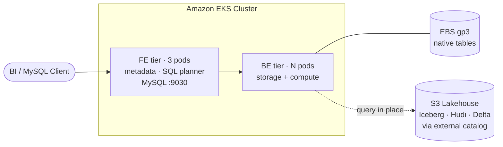
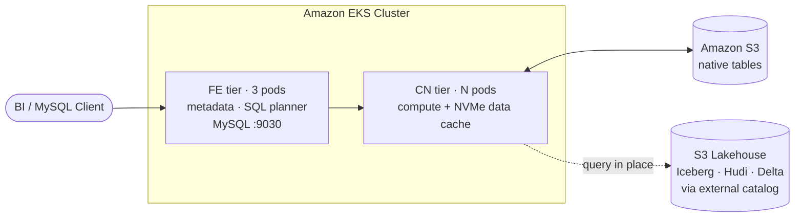

import BarChart from '@site/src/components/Charts/BarChart';
import PieChart from '@site/src/components/Charts/PieChart';

# StarRocks on EKS: Shared-Data vs Shared-Nothing

## Introduction

[StarRocks](https://starrocks.io/) is a high-performance analytical database that supports two deployment architectures on Kubernetes. Which architecture you choose has major implications for cost, elasticity, and performance — so this benchmark gives you hard numbers to make an informed decision.

### What is StarRocks and Where Does It Fit?

If you are coming from Spark, Trino/Presto, ClickHouse, or a traditional data warehouse, StarRocks will feel familiar but different. It is a **massively parallel processing (MPP) analytical database** with its own vectorized execution engine, cost-based optimizer, and columnar storage format. A cluster has two roles: **Frontend (FE)** nodes parse SQL, plan queries, and hold metadata, and **Backend (BE)** or **Compute Node (CN)** workers execute those plans in parallel. Unlike Spark — which spins up an application per workload — a StarRocks cluster is a long-lived service that users connect to with standard MySQL clients, returning results in milliseconds to seconds. Three patterns drive most production adoption on EKS:

- **OLAP directly on the data lake (external catalogs)** — Teams with terabytes to petabytes already in S3 as **Iceberg**, Hudi, Delta Lake, or Hive tables point StarRocks at the Glue or Hive metastore and query those tables **in place, with zero ETL**. The vectorized engine plus the local NVMe **data cache** delivers interactive performance on top of the existing lakehouse, while Spark, EMR, and Athena keep full interop.
- **Real-time analytics with streaming ingestion** — Data lands continuously from Kafka (Routine Load), Flink, or CDC sources into **native StarRocks tables**. Writes are visible within seconds, making StarRocks a good fit for live dashboards, fraud detection, IoT telemetry, and user-facing product metrics.
- **High-concurrency customer-facing analytics** — Embedded dashboards, SaaS reporting, and internal BI tools that must serve thousands of concurrent users with sub-second latency — usually a mix of native tables, materialized views, and selective external-catalog queries.

### Native Tables vs. External Catalogs, and Scaling to Thousands of Users

The most important mental model in StarRocks is the distinction between **native (internal) tables** and **external catalogs**. Native tables use StarRocks' own columnar format — sorted, bucketed, indexed, supporting UPDATE and DELETE through the primary-key model, and accelerated by **synchronous and asynchronous materialized views** that transparently rewrite queries to pre-aggregated results. They live on BE local disk in shared-nothing or on S3 with NVMe caching on CNs in shared-data. External catalogs leave the data untouched in open formats (Iceberg / Hudi / Delta / Hive / Paimon / JDBC) and query it in place via the underlying metastore — you get lakehouse interoperability at the cost of slightly higher first-query latency until the data cache warms up. Most production deployments use both: **external catalogs for cold lakehouse data, native tables for hot and high-concurrency workloads, and materialized views to bridge the two**.

Serving **thousands of concurrent OLAP users** is where the **shared-data architecture** is designed to shine. Because CNs are stateless, you can scale compute horizontally in seconds without re-sharding data, run **multiple isolated warehouses** against the same S3 storage to separate ad-hoc BI from batch ETL, and drive it all with Kubernetes-native autoscaling through HPA and Karpenter. Combined with the **data cache** on NVMe, the **query cache**, and **materialized views**, a StarRocks cluster on EKS can sustain very high QPS cost-effectively. Shared-nothing, by contrast, couples compute and storage and trades elasticity for predictable single-query latency on smaller, steadier workloads. This benchmark quantifies exactly that trade-off on identical hardware.

### Workload Isolation Within a Single Cluster

A common question is whether you can keep **dimension tables on BE and fact tables on CN** inside one cluster. You cannot. StarRocks' storage mode is **cluster-wide** — a cluster is either shared-nothing (BE) or shared-data (CN); FEs only speak one mode, and you cannot colocate BE and CN under the same FE quorum. What you *can* do to get similar effects:

- **Multi-warehouse (shared-data only)** — run multiple isolated **CN warehouses** backed by the same S3 storage so an ad-hoc BI warehouse and a batch-ETL warehouse never steal CPU from each other. Scale each warehouse independently.
- **Resource groups (shared-nothing and shared-data)** — available since v2.2, with hard CPU limits via `exclusive_cpu_cores` in v3.3.5+. Partition CPU, memory, and concurrency across users / roles / query types inside a single BE or CN pool. Use this when a separate warehouse is overkill.
- **Colocated joins + materialized views** — the idiomatic way to accelerate dimension × fact joins. Put dims and facts in the same colocation group (same bucket key / count) and joins execute locally with no shuffle; layer **async MVs** on top to pre-compute the expensive joins and let the optimizer rewrite queries to them transparently.
- **Two-cluster federation** — for teams that genuinely want both profiles, run a small shared-nothing cluster for hot dims and a large shared-data cluster for facts, and join across them using an **external catalog**.

### Capabilities That Shape Benchmark Results

A few StarRocks features directly influence the numbers you see in the sections below. Understanding them helps you read the results in context and reproduce them on your own data:

- **Table models (4 types)** — **Duplicate** (append-only), **Aggregate** (pre-aggregated on load), **Unique** (latest-wins by key), and **Primary Key** (real-time updates/deletes, partial updates, fast point lookups). TPC-DS uses Duplicate tables, which is why this benchmark stresses scan + join + aggregation rather than upsert paths.
- **Asynchronous materialized views with query rewrite** (v2.5+) — the optimizer transparently rewrites SPJG queries (Scan / Filter / Project / Aggregate) to matching MVs, including MVs built over **Hive / Hudi / Iceberg** external catalogs. A raw-TPC-DS run (like this one) intentionally disables MVs so the engine / storage comparison stays apples-to-apples; in production you'd typically add MVs for your hot query shapes.
- **Data cache (two-tier)** — in-memory **page cache** for decoded pages + on-disk **block cache** on BE/CN local disk (NVMe strongly recommended). This is what closes the gap between S3-backed shared-data and EBS-backed shared-nothing once the working set is warm, and is why we report cold vs. warm iterations separately.
- **Query cache** — caches partial aggregation results across queries with overlapping predicates. Helpful for dashboard fan-out, not a factor in single-pass TPC-DS runs.
- **Colocated joins** — when dim and fact share bucketing, join is purely local; network shuffle disappears. Heavily relevant to TPC-DS `store_sales × date_dim / item / customer` patterns.
- **Streaming / batch ingestion** — **Routine Load** (Kafka), **Stream Load** (HTTP), **Broker Load** (S3/HDFS bulk), and the **Flink connector** land data in seconds into native tables; **Iceberg/Hudi/Delta external catalogs** let you skip loading entirely for data already in the lake.

### Architecture at a Glance

Both clusters share the same **Frontend (FE)** tier — metadata, SQL parsing, query planning, and the MySQL-protocol endpoint. They diverge at the worker tier (BE vs. CN) and at the storage substrate (local EBS vs. S3 with NVMe data cache). Both can query **external catalogs** (Iceberg / Hudi / Delta Lake / Hive) in S3 without copying data.

**Shared-Nothing — BE with local EBS**



**Shared-Data — CN with S3 and NVMe data cache**



**How to read these diagrams**

- **FE tier** is identical in both — only the worker tier and storage substrate change.
- In **shared-nothing**, native tables live on each BE's local **EBS** volume; losing a BE means replicating tablets.
- In **shared-data**, native tables are authoritative on **S3**; CNs are stateless and only hold a **hot-data cache** on NVMe, so they scale in and out in seconds.
- The **external catalog** path is the same in both: read Iceberg / Hudi / Delta / Hive tables directly from S3 via the Glue or Hive Metastore — no ingest, no copy.


### Why This Benchmark Matters

When you're building an analytics platform on EKS, you face a fundamental storage architecture choice:

- **Shared-Data (cloud-native)**: Stateless Compute Nodes (CN) read from S3 with local NVMe SSD cache. Storage and compute scale independently. Lower storage cost, higher elasticity.
- **Shared-Nothing (traditional)**: Backend Nodes (BE) store data on local EBS volumes and perform both storage and compute. Data locality, but tighter coupling.

Both claim to deliver excellent OLAP performance, but the trade-offs aren't obvious from documentation alone. Common questions we answer here:

- Does S3 with NVMe cache match the speed of local EBS?
- Is the shared-data model worth the S3 latency for interactive analytics?
- What's the CPU/memory footprint difference under identical workloads?
- Which architecture gives better price-performance on AWS?

This benchmark answers these questions by running the **TPC-DS 1TB decision support benchmark** against both architectures on **identical compute hardware**, isolating storage as the only variable.

### Executive Summary (TL;DR)

<div style={{ display: 'grid', gridTemplateColumns: '1fr 1fr', gap: '1rem', marginBottom: '2rem' }}>
  <div style={{ background: '#e8f5e9', padding: '1.25rem', borderRadius: '8px', borderLeft: '4px solid #27ae60' }}>
    <h4 style={{ marginTop: 0, color: '#27ae60' }}>Shared-Nothing Wins Decisively on Speed</h4>
    <p style={{ marginBottom: 0 }}>EBS-backed BE delivers <strong>128.4s total, 1,309ms mean</strong> across 98 queries — <strong>33.7% faster</strong> than shared-data. Local EBS (6000 IOPS) has lower and more predictable latency than S3+NVMe cache at 1 TB scale, and BE shows almost no cold-vs-warm penalty across iterations.</p>
  </div>
  <div style={{ background: '#e3f2fd', padding: '1.25rem', borderRadius: '8px', borderLeft: '4px solid #2196f3' }}>
    <h4 style={{ marginTop: 0, color: '#2196f3' }}>Shared-Data Wins on Flexibility</h4>
    <p style={{ marginBottom: 0 }}>S3 + NVMe cache delivers <strong>193.8s total, 1,977ms mean</strong>. The ~34% speed gap is the price paid for unlimited storage, second-scale elasticity (CN can scale 0→N), ~4× lower storage cost at scale, and durable multi-AZ persistence. On warm-cache iterations alone the gap narrows to ~12%.</p>
  </div>
</div>

**Key findings:**

- **Compute is identical**: Both clusters use 3× r8g.8xlarge / r8gd.8xlarge nodes (96 vCPU / 768 GiB total). The ONLY variable is storage architecture.
- **Performance gap is meaningful at 1 TB (~34%)**: Shared-nothing finishes 98 queries in 128.4 s vs. 193.8 s for shared-data. EBS gp3 latency is both lower and more predictable than S3+NVMe-cache hydration.
- **Cold start is the main penalty for shared-data**: iteration 1 total is **289.9s** (S3 GETs hydrating the cache) but iterations 2–3 drop to **~145s** — roughly **2× overall**, and **10–25×** on individual cold queries (e.g. q03 18.0 s cold → 0.74 s warm).
- **Shared-nothing has almost no warm-up effect**: all three iterations finish in 122.5–131.5 s. EBS page cache plus tablet metadata is effectively always warm.
- **Warm-only comparison narrows the gap to ~12%**: if you discard iteration 1 and average iterations 2–3, shared-data is ~146 s vs. shared-nothing ~128 s. For long-lived dashboards that sit on a warm cache, the architectures are much closer than the raw totals suggest.
- **q23 is the slowest query on both** (36.1 s SN / 35.9 s SD — shared-data is actually 169 ms *faster* here). q23 is a 3-way cross-join on fact tables where compute dominates, not I/O.
- **q95 times out on both**: Same 600 s timeout, same query failure pattern — query-planner / optimizer issue, not storage.
- **Small, repeatable queries punish shared-data**: q03, q13, q20, q62, q64, q66 all run 3–17× slower on shared-data purely because the cold-iteration S3 round-trip dominates the runtime.
- **BE memory baseline is high**: Shared-nothing BE uses ~85 GiB baseline even idle (page cache, tablet metadata). Size accordingly.

**Use shared-data when**: unpredictable workloads, need elasticity, large datasets (&gt;10TB), multi-tenant, cost-sensitive storage.

**Use shared-nothing when**: predictable workloads, consistent low latency required, smaller datasets (&lt;10TB), dedicated clusters.

## Benchmark Configuration

### Test Environment

| Component | Configuration |
|-----------|---------------|
| **EKS Cluster** | Amazon EKS v1.34.6 |
| **Region** | us-east-1 |
| **StarRocks Version** | 3.5-latest |
| **Operator Version** | v1.11.3 (deployed via ArgoCD) |
| **Dataset** | [TPC-DS](https://www.tpc.org/tpcds/) Scale Factor 1000 (~1TB raw) |
| **Queries** | All 99 standard TPC-DS queries |
| **Iterations** | 3 per query — reports min / avg / max |
| **Query Timeout** | 600 seconds |

### Cluster Specifications

Both clusters have **identical compute resources** — the only variable is storage. This isolates the impact of storage architecture.

<div style={{ display: 'grid', gridTemplateColumns: '1fr 1fr', gap: '1rem', marginBottom: '1.5rem' }}>

<div style={{ background: '#f8f9fa', padding: '1.25rem', borderRadius: '8px', border: '2px solid #3498db' }}>

#### Shared-Data (CN + S3)

| | |
|---|---|
| **FE** | 3× m6g.2xlarge (8 vCPU, 32 GiB) |
| **CN** | 3× **r8gd.8xlarge** (32 vCPU, 256 GiB) |
| **CN requests** | 28 vCPU, 220 GiB |
| **CN limits** | 31 vCPU, 240 GiB |
| **Data storage** | **S3** (unlimited) |
| **Cache** | **1.9 TB NVMe SSD** per CN (RAID0) |
| **FE metadata** | 100Gi gp3 EBS |

</div>

<div style={{ background: '#f8f9fa', padding: '1.25rem', borderRadius: '8px', border: '2px solid #e67e22' }}>

#### Shared-Nothing (BE + EBS)

| | |
|---|---|
| **FE** | 3× m6g.2xlarge (8 vCPU, 32 GiB) |
| **BE** | 3× **r8g.8xlarge** (32 vCPU, 256 GiB) |
| **BE requests** | 28 vCPU, 220 GiB |
| **BE limits** | 31 vCPU, 240 GiB |
| **Data storage** | **EBS gp3-starrocks** |
| **EBS spec** | 500Gi × 3, **6000 IOPS, 250 MB/s** |
| **FE metadata** | 100Gi gp3 EBS |

</div>

</div>

### Why These Instance Types?

StarRocks recommends a **minimum 1:4 vCPU:GB memory ratio** for compute nodes. The `r` family (memory-optimized Graviton) delivers 1:8 — exceeding the minimum with headroom for:

- **Vectorized hash joins** and aggregation state (lives in RAM)
- **Data cache page cache** on the CN side (NVMe-backed on r8gd)
- **Bloom filters, dictionary caches, tablet metadata** (always in memory)

The `d` suffix (`r8gd`) adds local NVMe SSD — essential for shared-data CN cache. The shared-nothing BE uses `r8g` without local NVMe since data persistence lives on EBS PVCs.

<details>
<summary><strong>Why not compute-optimized (c7g, c8g)?</strong></summary>

Compute-optimized instances have a 1:2 vCPU:GB ratio — below StarRocks' minimum 1:4 recommendation. You'll see OOM kills on big joins long before you run out of CPU. We tested this early and observed CN pods failing to schedule with 128 GiB memory requests on c-family instances.
</details>

<details>
<summary><strong>Why not network-optimized (r6in, m6in)?</strong></summary>

Network-optimized instances (up to 200 Gbps) are a tempting trap for shared-storage architectures. In practice, once the Data Cache hit rate is &gt;80% (typical in production), the bottleneck shifts from network to local NVMe IOPS and memory. The extra network bandwidth costs 15-25% more for throughput you won't use after warmup.
</details>

<details>
<summary><strong>Why not storage-optimized (i4i, im4gn)?</strong></summary>

i4i/im4gn have excellent local NVMe but the vCPU:GB ratio is 1:8 with too much memory — you over-provision for StarRocks' needs. These instances make more sense for ClickHouse-style workloads.
</details>

### Storage Architecture Deep Dive

| Dimension | Shared-Data (CN + S3) | Shared-Nothing (BE + EBS) |
|-----------|----------------------|---------------------------|
| **Primary storage cost** | S3 Standard (~$0.023/GB/mo) | EBS gp3 (~$0.08/GB/mo) |
| **Cache layer** | 1.9 TB NVMe (free with instance) | N/A |
| **Cold read latency** | 10-50ms (S3 GET) | 1-2ms (EBS gp3) |
| **Warm read latency** | ~0.1ms (NVMe cache hit) | 1-2ms (EBS gp3) |
| **Cache hit rate** | ~90% after warmup (TPC-DS) | 100% (all data is local) |
| **Storage IOPS** | NVMe: ~100K+ per node | EBS: 6,000 per volume |
| **Storage throughput** | NVMe: 2+ GB/s per node | EBS: 250 MB/s per volume |
| **Max storage size** | Unlimited (S3) | 500 GiB per BE (1.5TB total) |
| **Stateful** | No (CN is stateless, cache is ephemeral) | Yes (data on EBS PVCs) |
| **Elasticity** | Scale CN 0→N in seconds | Scale BE requires data rebalancing |
| **Data durability** | 99.999999999% (S3 11 nines) | 99.999% (EBS) |
| **Multi-AZ** | S3 cross-AZ by default | Requires explicit replication |

## Benchmark Methodology

### TPC-DS Table Format

Both clusters use **identical StarRocks native table DDL** — no external catalogs, no Iceberg, no Hive. Data is loaded directly into StarRocks managed tables so the benchmark measures pure StarRocks query execution.

All 24 TPC-DS tables use the **Duplicate Key** model — StarRocks' default table type optimized for append-heavy OLAP workloads:

- **Table type**: `duplicate key` (append-only, no primary key uniqueness)
- **Distribution**: `distributed by hash(<key>) buckets N` — data is sharded across buckets by hash of the join key
- **Replication**: `replication_num = 1` — single replica (no data redundancy for the benchmark)
- **Storage engine**: OLAP (columnar, sorted by duplicate key for range scans)

Example from `store_sales`:

```sql
create table store_sales (
    ss_sold_date_sk           integer,
    ss_item_sk                integer   not null,
    ss_ticket_number          bigint    not null,
    -- ... 20+ more columns ...
    ss_net_profit             decimal(7,2)
)
duplicate key (ss_sold_date_sk, ss_item_sk, ss_ticket_number)
distributed by hash(ss_item_sk, ss_ticket_number) buckets 261
properties("replication_num" = "1");
```

**Why Duplicate Key model?**

- **Best for immutable analytical data** (fact tables like store_sales) — TPC-DS loads append-only
- **Lower write amplification** than Primary Key model (no compaction for uniqueness)
- **Full columnar compression** with sort-by-key push-down
- **Matches StarRocks' own recommended TPC-DS schema**

The **key difference between the two clusters is WHERE the data is physically stored**:

- **Shared-Data**: Duplicate Key tables → S3 objects (managed by StarRocks starmgr)
- **Shared-Nothing**: Duplicate Key tables → EBS volumes on BE pods (local storage)

The SQL DDL is byte-for-byte identical. StarRocks abstracts the storage layer from the table definition.

### Data Generation

We used the standard TPC-DS `dsdgen` tool at scale factor 1000 (~1TB raw data):
- **Output**: 10,015 `.dat` files, ~911 GB total
- **Duration**: ~2 hours using 32 parallel `dsdgen` workers on a Graviton r6g.8xlarge
- **Storage**: ReadWriteOnce PVC (1 TiB gp3), shared across both loaders

### Data Loading

Both clusters were loaded from the same PVC using StarRocks `_stream_load` HTTP API:
- **Loading target**: ~12 GiB columnar-compressed in S3 (shared-data) / ~12 GiB on EBS (shared-nothing)
- **Compression ratio**: ~3-5x vs raw text
- **Loading duration**: 5-7 hours per cluster (single-threaded via curl)
- **Data parity**: Row counts verified near-identical between both clusters (store_sales: 2.75B rows, catalog_sales: ~1.4-1.5B, web_sales: 720M)

### Query Execution

Each benchmark run executes all 99 TPC-DS queries for **3 iterations**:
- **Iteration 1**: Cold cache (CN reads from S3, BE reads from EBS for first time)
- **Iteration 2**: Warm cache (NVMe for CN, page cache for BE)
- **Iteration 3**: Fully warm

Results report **min / avg / max** per query across iterations. The avg is used as the representative query time.

## Results

### Overall Runtime Comparison

<BarChart
  title="TPC-DS 1TB Total Runtime (Sum of Avg Query Times, 98 Passed Queries)"
  data={{
    labels: ['Shared-Nothing (EBS)', 'Shared-Data (S3+NVMe)'],
    datasets: [
      {
        label: 'Total Runtime (seconds)',
        data: [128.4, 193.8],
        backgroundColor: ['#27ae60', '#e67e22'],
        borderColor: ['#229954', '#d35400'],
        borderWidth: 1,
      },
    ],
  }}
  options={{
    scales: {
      y: {
        title: { display: true, text: 'Total time (seconds)' },
      },
    },
  }}
/>

<BarChart
  title="Mean Query Time (ms)"
  data={{
    labels: ['Shared-Nothing (EBS)', 'Shared-Data (S3+NVMe)'],
    datasets: [
      {
        label: 'Mean Avg Time (ms)',
        data: [1309, 1977],
        backgroundColor: ['#27ae60', '#e67e22'],
        borderColor: ['#229954', '#d35400'],
        borderWidth: 1,
      },
    ],
  }}
  options={{
    scales: {
      y: {
        title: { display: true, text: 'Milliseconds' },
      },
    },
  }}
/>

**Shared-nothing is 33.7% faster overall** (128.4 s vs 193.8 s, a 65.4 s gap across 98 queries). The gap is driven largely by iteration 1 on shared-data: its cold cache incurs ~290 s of S3 GET latency before NVMe warms up, while BE is consistent across all three iterations (131.5 s → 131.2 s → 122.5 s).

<BarChart
  title="Runtime by Iteration — Cold vs Warm Cache (seconds)"
  data={{
    labels: ['Iter 1 (cold)', 'Iter 2 (warm)', 'Iter 3 (warm)'],
    datasets: [
      {
        label: 'Shared-Nothing (EBS)',
        data: [131.5, 131.2, 122.5],
        backgroundColor: '#27ae60',
        borderColor: '#229954',
        borderWidth: 1,
      },
      {
        label: 'Shared-Data (S3+NVMe)',
        data: [289.9, 144.6, 147.0],
        backgroundColor: '#e67e22',
        borderColor: '#d35400',
        borderWidth: 1,
      },
    ],
  }}
  options={{
    scales: {
      y: {
        title: { display: true, text: 'Total time (seconds)' },
      },
    },
  }}
/>

**Warm-only comparison (iterations 2 + 3 averaged):** shared-data ≈ 145.8 s, shared-nothing ≈ 126.9 s — a much smaller **~13% gap**. Which number you care about depends on your workload: ad-hoc exploration pays the cold tax; dashboards and embedded analytics mostly see the warm number.

### Per-Cluster Headlines

<div style={{ display: 'grid', gridTemplateColumns: '1fr 1fr', gap: '1rem', marginBottom: '2rem' }}>

<div style={{ background: '#f8f9fa', padding: '1.25rem', borderRadius: '8px', border: '1px solid #e67e22' }}>

#### Shared-Nothing Results

<div style={{ display: 'grid', gridTemplateColumns: 'repeat(2, 1fr)', gap: '0.5rem', marginBottom: '1rem' }}>
  <div style={{ background: '#fff', padding: '0.75rem', borderRadius: '6px', textAlign: 'center' }}>
    <div style={{ fontSize: '1.5rem', fontWeight: 'bold', color: '#27ae60' }}>98/99</div>
    <div style={{ color: '#666', fontSize: '0.85rem' }}>Queries Passed</div>
  </div>
  <div style={{ background: '#fff', padding: '0.75rem', borderRadius: '6px', textAlign: 'center' }}>
    <div style={{ fontSize: '1.5rem', fontWeight: 'bold', color: '#2196f3' }}>1,309ms</div>
    <div style={{ color: '#666', fontSize: '0.85rem' }}>Mean Query Time</div>
  </div>
  <div style={{ background: '#fff', padding: '0.75rem', borderRadius: '6px', textAlign: 'center' }}>
    <div style={{ fontSize: '1.5rem', fontWeight: 'bold', color: '#9b59b6' }}>128.4s</div>
    <div style={{ color: '#666', fontSize: '0.85rem' }}>Total Runtime</div>
  </div>
  <div style={{ background: '#fff', padding: '0.75rem', borderRadius: '6px', textAlign: 'center' }}>
    <div style={{ fontSize: '1.5rem', fontWeight: 'bold', color: '#e74c3c' }}>1</div>
    <div style={{ color: '#666', fontSize: '0.85rem' }}>Timeout</div>
  </div>
</div>

</div>

<div style={{ background: '#f8f9fa', padding: '1.25rem', borderRadius: '8px', border: '1px solid #3498db' }}>

#### Shared-Data Results

<div style={{ display: 'grid', gridTemplateColumns: 'repeat(2, 1fr)', gap: '0.5rem', marginBottom: '1rem' }}>
  <div style={{ background: '#fff', padding: '0.75rem', borderRadius: '6px', textAlign: 'center' }}>
    <div style={{ fontSize: '1.5rem', fontWeight: 'bold', color: '#27ae60' }}>98/99</div>
    <div style={{ color: '#666', fontSize: '0.85rem' }}>Queries Passed</div>
  </div>
  <div style={{ background: '#fff', padding: '0.75rem', borderRadius: '6px', textAlign: 'center' }}>
    <div style={{ fontSize: '1.5rem', fontWeight: 'bold', color: '#2196f3' }}>1,977ms</div>
    <div style={{ color: '#666', fontSize: '0.85rem' }}>Mean Query Time</div>
  </div>
  <div style={{ background: '#fff', padding: '0.75rem', borderRadius: '6px', textAlign: 'center' }}>
    <div style={{ fontSize: '1.5rem', fontWeight: 'bold', color: '#9b59b6' }}>193.8s</div>
    <div style={{ color: '#666', fontSize: '0.85rem' }}>Total Runtime</div>
  </div>
  <div style={{ background: '#fff', padding: '0.75rem', borderRadius: '6px', textAlign: 'center' }}>
    <div style={{ fontSize: '1.5rem', fontWeight: 'bold', color: '#e74c3c' }}>1</div>
    <div style={{ color: '#666', fontSize: '0.85rem' }}>Timeout</div>
  </div>
</div>

</div>

</div>

### Latency Distribution

The distributions look broadly similar at the coarse level — **~83%** of shared-nothing queries and **~72%** of shared-data queries complete in under 2 seconds — but the fast bucket (&lt;500 ms) tells the real story: **57 queries for shared-nothing vs only 27 for shared-data**. The S3 round-trip cost shifts most sub-500 ms SN queries into the 500 ms – 2 s bucket on SD.

<div style={{ display: 'grid', gridTemplateColumns: '1fr 1fr', gap: '1rem' }}>

<PieChart
  title="Shared-Nothing: Query Latency Distribution"
  type="doughnut"
  data={{
    labels: [
      '< 500ms',
      '500ms - 2s',
      '2s - 5s',
      '5s - 10s',
      '10s+',
      'Timeout',
    ],
    datasets: [
      {
        label: 'Queries',
        data: [57, 25, 11, 4, 1, 1],
        backgroundColor: [
          '#27ae60',
          '#2ecc71',
          '#f39c12',
          '#e67e22',
          '#e74c3c',
          '#c0392b',
        ],
        borderColor: '#ffffff',
        borderWidth: 2,
      },
    ],
  }}
/>

<PieChart
  title="Shared-Data: Query Latency Distribution"
  type="doughnut"
  data={{
    labels: [
      '< 500ms',
      '500ms - 2s',
      '2s - 5s',
      '5s - 10s',
      '10s+',
      'Timeout',
    ],
    datasets: [
      {
        label: 'Queries',
        data: [27, 44, 17, 9, 1, 1],
        backgroundColor: [
          '#27ae60',
          '#2ecc71',
          '#f39c12',
          '#e67e22',
          '#e74c3c',
          '#c0392b',
        ],
        borderColor: '#ffffff',
        borderWidth: 2,
      },
    ],
  }}
/>

</div>

### Slowest Queries

The top-10 slowest queries per cluster, based on avg time across 3 iterations. The same query IDs dominate both clusters — joins and window functions on the fact tables — but the cold S3 penalty inflates several shared-data runs (notably q03, q04, q09, q28).

#### Shared-Nothing (top 10 by avg)

| Rank | Query | Avg (ms) | Min (ms) | Max (ms) | Notes |
|------|-------|----------|----------|----------|-------|
| 1 | **q23** | 36,071 | 31,567 | 39,498 | 3-way cross-join across fact tables |
| 2 | q67 | 6,197 | 6,172 | 6,246 | Deep window functions over `store_sales` |
| 3 | q14 | 5,398 | 5,389 | 5,405 | 3-way self-join on `item` |
| 4 | q78 | 5,132 | 5,095 | 5,189 | Multi-aggregation on `web_sales` |
| 5 | q04 | 5,107 | 4,561 | 5,869 | Heavy `customer` window functions |
| 6 | q11 | 3,887 | 3,844 | 3,911 | Repeat-customer year-over-year |
| 7 | q74 | 3,719 | 3,677 | 3,756 | Income-band ranking |
| 8 | q09 | 3,189 | 3,131 | 3,273 | Case-when aggregations |
| 9 | q75 | 3,141 | 3,074 | 3,259 | Multi-year comparison |
| 10 | q88 | 2,965 | 2,953 | 2,973 | Hourly store-sales aggregation |
| — | **q95** | timeout | — | — | Complex `web_sales` self-join (hits 600 s limit on both clusters) |

#### Shared-Data (top 10 by avg)

| Rank | Query | Avg (ms) | Min (ms) | Max (ms) | Notes |
|------|-------|----------|----------|----------|-------|
| 1 | **q23** | 35,902 | 34,311 | 38,155 | 3-way cross-join — compute-bound, storage-independent |
| 2 | q04 | 7,878 | 4,880 | 12,859 | Cold iter 1 at 12.9 s pulls the avg up |
| 3 | q14 | 6,938 | 5,639 | 9,454 | 3-way self-join on `item` |
| 4 | q03 | 6,511 | 740 | 18,041 | Huge cold-vs-warm variance (24×) |
| 5 | q67 | 6,412 | 6,392 | 6,432 | Deep window functions — tied with SN |
| 6 | q78 | 6,171 | 5,991 | 6,506 | Multi-aggregation on `web_sales` |
| 7 | q09 | 5,931 | 3,386 | 10,943 | Case-when aggregations, cold-inflated |
| 8 | q28 | 5,224 | 2,603 | 10,465 | Multi-union aggregations |
| 9 | q59 | 5,155 | 3,175 | 6,146 | Week-over-week analysis |
| 10 | q75 | 5,127 | 4,396 | 6,533 | Multi-year comparison |
| — | **q95** | timeout | — | — | Same 600 s timeout as shared-nothing |

### Where Shared-Nothing Wins by the Biggest Margin

Small-to-medium queries where the cold-iteration S3 round-trip dominates runtime. These are the cases where shared-nothing's data-locality pays off most:

| Query | Shared-Nothing (avg ms) | Shared-Data (avg ms) | SD / SN | Notes |
|-------|-------------------------|----------------------|---------|-------|
| q03 | 368 | 6,511 | **17.7×** slower | SD cold iter 1 alone = 18,041 ms |
| q66 | 358 | 2,234 | **6.2×** slower | Cold iter dominates SD avg |
| q62 | 315 | 1,381 | **4.4×** slower | Multi-table union on warehouse |
| q13 | 989 | 3,884 | **3.9×** slower | Cold-heavy SD iter 1 = 9,625 ms |
| q64 | 1,153 | 4,089 | **3.5×** slower | Customer purchase-path join |
| q28 | 2,707 | 5,224 | **1.9×** slower | Multi-union on store/catalog/web sales |

### Where Shared-Data Ties or Wins

On long-running compute-bound queries the storage difference is dwarfed by join cost, and on a handful of small queries the NVMe page cache matches EBS after warm-up. Only q23 is an outright SD win:

| Query | Shared-Nothing (avg ms) | Shared-Data (avg ms) | Delta | Notes |
|-------|-------------------------|----------------------|-------|-------|
| **q23** | 36,071 | 35,902 | SD **169 ms faster** (0.5%) | Compute-bound cross-join |
| q20 | 173 | 159 | SD **14 ms faster** (8.1%) | Tiny aggregation, NVMe caching effect |
| q11 | 3,887 | 3,892 | SN 5 ms faster (0.1%) | Essentially tied |
| q99 | 91 | 93 | SN 2 ms faster (2.2%) | Essentially tied |
| q67 | 6,197 | 6,412 | SN 215 ms faster (3.5%) | Long window query — compute dominates |
| q51 | 2,227 | 2,314 | SN 87 ms faster (3.9%) | Rolling aggregations |

## Resource Utilization

Observed during benchmark execution via `kubectl top pods` and Grafana:

### CPU Utilization

| | Shared-Data CN | Shared-Nothing BE |
|---|----------------|---------------------|
| **Peak CPU during query** | ~3,000m (~9.4% of 32 vCPU) | ~4,000m (~12.5%) |
| **Avg CPU during benchmark** | ~2,200m (~7%) | ~3,000m (~9%) |
| **Idle CPU** | &lt;100m | &lt;50m |

**Observation**: Neither architecture is CPU-bound at 1TB scale. The bottleneck is I/O (S3+NVMe vs EBS) and query planning on the FE. At 10TB scale, CPU saturation would become more relevant — consider that for capacity planning.

### Memory Footprint

| | Shared-Data CN | Shared-Nothing BE |
|---|----------------|---------------------|
| **Baseline memory** | ~94 GiB (37% of 256) | ~85 GiB (33% of 256) |
| **Peak memory during query** | ~105 GiB (41%) | ~95 GiB (37%) |
| **Contents** | Data cache + query buffers + tablet metadata | Page cache + tablet metadata (always resident) |

**Observation**: Both architectures carry a significant baseline memory footprint. The BE doesn't consume less memory just because it's idle — StarRocks pre-loads tablet metadata and keeps page cache hot. Budget for ~85-95 GiB baseline per node regardless of query load.

### Storage I/O

- **Shared-Nothing**: EBS IOPS approached the 6,000 provisioned limit on iteration 1 (cold read) but stayed well below on warm iterations thanks to Linux page cache
- **Shared-Data**: Iteration 1 generates ~600 MB/s of S3 GET traffic per CN (network-bound on cold cache). Iterations 2-3 drop S3 traffic to near-zero as NVMe cache serves reads

## Cost Analysis (Monthly, us-east-1)

:::warning Pricing disclaimer
The prices shown in this section are **illustrative estimates** captured at the time of the benchmark run and will drift over time. AWS pricing changes frequently with discounts, Savings Plans, Spot, regional variation, and instance-family updates. **Always refer to the official AWS pricing pages for current costs** before making architectural or budgeting decisions:

- [Amazon EC2 Pricing](https://aws.amazon.com/ec2/pricing/) — for FE/BE/CN instance costs
- [Amazon EBS Pricing](https://aws.amazon.com/ebs/pricing/) — for gp3 volume costs
- [Amazon S3 Pricing](https://aws.amazon.com/s3/pricing/) — for object storage + request costs
- [AWS Pricing Calculator](https://calculator.aws/) — for region-specific "what-if" modeling

Use the [StarRocks Cost Analyzer](https://starrocks.io/) or `kubecost` on your own EKS cluster for real-world figures once the workload is live.
:::

| Component | Shared-Data | Shared-Nothing |
|-----------|-------------|----------------|
| **3× FE (m6g.2xlarge)** | $560 | $560 |
| **3× CN/BE (r8gd/r8g.8xlarge)** | ~$4,220 | ~$3,580 |
| **Data storage (1TB compressed)** | S3: ~$30 (1TB @ $0.023/GB) | EBS: ~$120 (1.5TB @ $0.08/GB) |
| **EBS for FE + logs** | ~$30 | ~$30 |
| **Total (3-node cluster)** | **~$4,840/month** | **~$4,290/month** |

:::note
r8gd costs ~18% more than r8g due to included NVMe SSD. This covers the storage offload from S3 → local cache.
:::

At **1 TB scale**, shared-nothing is cheaper by ~$550/month (~13%). As data grows:

| Dataset Size | Shared-Data Storage | Shared-Nothing Storage | Storage Delta |
|--------------|---------------------|------------------------|---------------|
| 1 TB | $23/mo | $80/mo | +$57/mo |
| 10 TB | $230/mo | $800/mo (scaling BE) | +$570/mo |
| 100 TB | $2,300/mo | $8,000/mo | +$5,700/mo |
| 1 PB | $23,000/mo | $80,000/mo | +$57,000/mo |

The inflection point for shared-data cost advantage is around **5-8 TB of stored data** (after compression).

### Factor In: Scale-to-Zero (Shared-Data Only)

With KEDA autoscaling (scale CN to 0 during idle), shared-data can save an additional **~$1,400/month per CN** during nights/weekends. For a 3-CN cluster idle 60% of the time, that's an extra **~$2,500/month savings**.

## When To Use Which

<div style={{ display: 'grid', gridTemplateColumns: '1fr 1fr', gap: '1rem', marginBottom: '1.5rem' }}>

<div style={{ background: '#e3f2fd', padding: '1.25rem', borderRadius: '8px', borderLeft: '4px solid #2196f3' }}>

### Choose Shared-Data When

- **Unpredictable workloads** — queries arrive in bursts, need scale-out
- **Large datasets** (&gt;10 TB after compression)
- **Multi-tenant** — different users want different compute sizes
- **Cost-sensitive storage** — pay-as-you-grow with S3
- **Cloud-native ops** — want to treat compute as cattle
- **Need multi-AZ DR** — S3 provides it for free
- **Scale-to-zero needs** — idle weekends/nights are free

**Examples**: Data lakehouse queries, ad-hoc analytics, multi-team data platforms

</div>

<div style={{ background: '#fff3e0', padding: '1.25rem', borderRadius: '8px', borderLeft: '4px solid #e67e22' }}>

### Choose Shared-Nothing When

- **Predictable workloads** — steady traffic, known query patterns
- **Consistent low latency required** — dashboards, real-time analytics
- **Smaller datasets** (&lt; 10 TB)
- **Dedicated cluster** — single team, stable compute
- **Simpler operations** — familiar DBA patterns
- **No S3 latency budget** — every query must be sub-second
- **Every millisecond counts** — 34% faster overall at 1 TB scale, and still ~13% faster on warm-cache iterations alone

**Examples**: BI dashboards, customer-facing analytics, real-time reporting

</div>

</div>

## Reproducing This Benchmark

Full step-by-step guide: **[TPC-DS Benchmark on StarRocks](/docs/datastacks/databases/starrocks-on-eks/tpcds-benchmark)**

Infrastructure setup: **[StarRocks Infrastructure Deployment](/docs/datastacks/databases/starrocks-on-eks/infra)**

Code: [data-stacks/starrocks-on-eks](https://github.com/awslabs/data-on-eks/tree/main/data-stacks/starrocks-on-eks)

## References

- [StarRocks Shared-Data Deployment](https://docs.starrocks.io/docs/deployment/shared_data/shared_data_aws/)
- [StarRocks Cluster Planning](https://docs.starrocks.io/docs/deployment/plan_cluster/)
- [StarRocks Data Cache](https://docs.starrocks.io/docs/data_source/data_cache/)
- [TPC-DS Specification](https://www.tpc.org/tpcds/)
