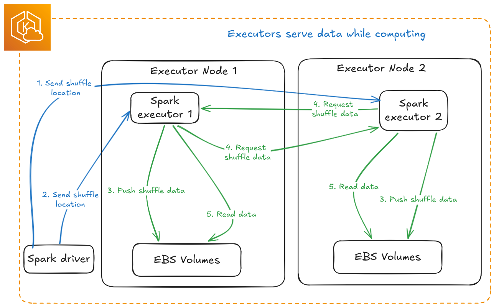
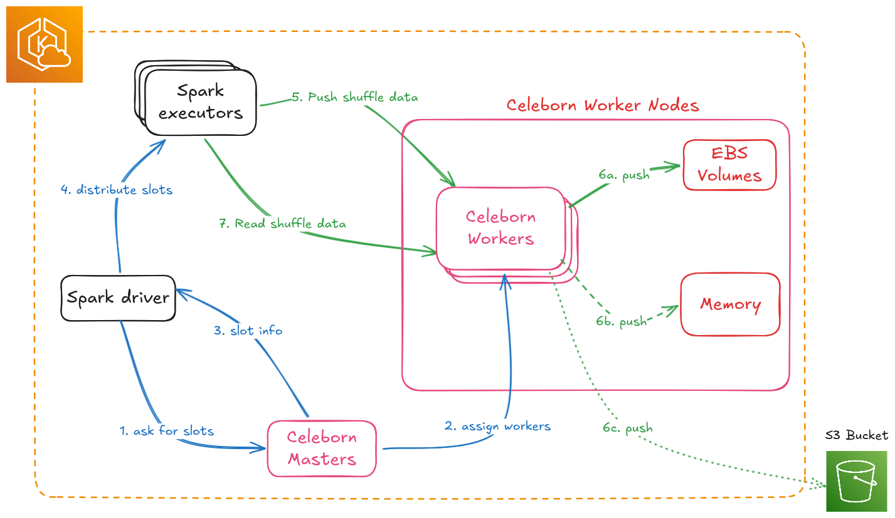

# Apache Celeborn: Best Practices

Apache Celeborn is a Remote Shuffle Service (RSS). It moves Spark shuffle data off executor disks onto dedicated worker nodes, which lets you use true dynamic allocation and removes the local-disk shuffle bottleneck at scale.

:::info
Validated with **Celeborn 0.6.2** on **Amazon EKS 1.30+**. TPC-DS 10 TB benchmark ran for 15+ hours including rolling restarts under active shuffle load. Zero job failures. Zero task failures.
:::

## TL;DR

| # | Area | What to Do | Why |
|---|------|-----------|-----|
| 1 | **Masters** | Deploy 3 masters, one per AZ | Raft needs a majority (2/3). One AZ down, control plane keeps running. |
| 2 | **Workers** | Keep all workers in a single AZ, co-located with executors | Cross-AZ shuffle costs $0.01/GB. When an AZ fails, its executors die too, so spreading workers buys nothing. |
| 3 | **Instance Type Selection** | r8g.8xlarge for small/medium, r8g.12xlarge or r8g.16xlarge for large, r8gd.16xlarge or i4i.16xlarge for I/O-bound | Start with 6 workers and scale out before scaling up. r8g.8xlarge ran 10 TB TPC-DS at under 20% disk and under 1% CPU. More workers distribute both network and disk load better than fewer larger instances. |
| 4 | **Storage** | Use EBS for most teams. NVMe only after profiling confirms I/O bottleneck | EBS volumes follow pods across nodes, resize online, and survive node failures without replication. |
| 5 | **Replication** | `spark.celeborn.client.push.replicate.enabled: "true"` on every job | Without it, any worker restart causes job failure. Non-negotiable. |
| 6 | **Ports** | Set all 4 worker ports to fixed values (9091 to 9094) | Dynamic `port=0` triggers `AssertionError` on every graceful shutdown. |
| 7 | **Graceful shutdown** | `celeborn.worker.graceful.shutdown.enabled: "true"` | Without it, abrupt worker exit causes Spark jobs to hang. |
| 8 | **Local shuffle reader** | `spark.sql.adaptive.localShuffleReader.enabled: "false"` on every job | If true, Spark reads from executor local disks where Celeborn data does not exist. Jobs fail with `FileNotFoundException`. |
| 9 | **terminationGracePeriodSeconds** | Set to at least 600s for EBS workers, 3600s for NVMe | Kubernetes default is 30s. At 30s, SIGKILL fires before graceful shutdown can flush in-flight writes, which corrupts data and causes job failures. |
| 10 | **DNS registration** | `celeborn.network.bind.preferIpAddress: "false"` | Workers register with pod IPs by default. Pod IPs change on restart, so the master ends up with stale mappings and clients can't reconnect. DNS names are stable. |
| 11 | **Rolling restarts** | `kubectl delete pod` with 120s delay between workers | SIGTERM triggers graceful shutdown (requires rows 7 and 9 above). Replication covers the ~70s restart window. Zero job failures validated on TPC-DS 10 TB. |
| 12 | **Decommission API** | Optional. Use for 100+ worker clusters, not required for correctness | It stops new writes to a worker but does not migrate existing shuffle data. Fetch errors still happen (20-30 per worker) and are handled by Spark retries. Simple pod delete with replication achieves the same data safety outcome. |
| 13 | **Shuffle sizing** | Don't provision storage based on dataset size | A 10 TB dataset produced only 4.7 TB of shuffle (19.7% disk utilization). Peak concurrent shuffle is 5 to 15% of total dataset, not 100%. |

## Table of Contents

- [Architecture Fundamentals](#architecture-fundamentals)
- [Decision 1: AZ Topology](#decision-1-az-topology)
- [Decision 2: Instance Type by Scale](#decision-2-instance-type-by-scale)
- [Decision 3: EBS vs NVMe Storage](#decision-3-ebs-vs-nvme-storage)
- [Configuration](#configuration)
- [Day 2 Operations](#day-2-operations)
- [Monitoring](#monitoring)
- [Troubleshooting](#troubleshooting)

---

## Architecture Fundamentals

[](../../benchmarks/img/spark-shuffler-architecture.png)

[](../../benchmarks/img/celeborn-architecture.png)

**Three components:**
- **Masters (3+):** Slot assignment, worker health tracking, and shuffle metadata. Uses Raft consensus for HA, so deploy as odd numbers: 3, 5, or 7.
- **Workers (N):** Shuffle data storage and serving. Scale horizontally. **One pod per node** is enforced by the official Helm chart and is not negotiable for performance.
- **Spark Client:** Embedded in executors. Handles retries, replica selection, and failover.

**Sizing ratio** (from [official Celeborn planning docs](https://celeborn.apache.org/docs/latest/deployment/cluster_planning/)):
```
vCPU : Memory (GB) : Network (Gbps) : Disk IOPS (K) = 2 : 5 : 2 : 1
```
A worker with 32 vCPU ideally pairs with 80 GB RAM, 32 Gbps network, and 16K IOPS. Use these ratios to sanity-check your instance choices.

:::tip When to Use Celeborn
Not all Spark workloads need Celeborn. Use it when you need:
- **Dynamic allocation:** scale executors up and down without losing shuffle data
- **Large shuffle volumes:** more than 100 GB of shuffle data per job
- **High concurrency:** multiple jobs sharing the same shuffle infrastructure
- **Fault tolerance:** survive executor failures without recomputing stages

For small jobs under 10 GB shuffle, streaming workloads, or single-executor jobs, standard Spark shuffle is sufficient.
:::

---

## Decision 1: AZ Topology

### Masters: Spread Across 3 AZs

Deploy one master per AZ, three total. Raft requires a majority, so 2 out of 3. If one AZ goes down, the remaining two masters keep Celeborn's control plane running. Masters hold only metadata, so cross-AZ master traffic is negligible.

Spreading masters across AZs is the main reason multi-AZ matters for Celeborn at all. After an AZ failure you can provision new worker nodes in a surviving AZ right away without touching the master configuration.

### Workers: Single AZ, Co-Located with Executors

**Keep workers in the same AZ as your Spark executor nodes. Do not spread workers across AZs.**

Every shuffle push (executor to worker) and every fetch (worker to executor) that crosses an AZ boundary costs **$0.01/GB** on AWS. With replication that cost doubles. At terabyte-scale shuffle volumes the bill adds up fast. More importantly, if an AZ fails, the Spark executors in that AZ fail with it. The job is lost regardless of where the workers are. Spreading workers across AZs only adds cost and latency with no practical resilience benefit.

One thing to watch: this only works cleanly if your Spark executor node pools are also AZ-pinned. EKS creates multi-AZ node groups by default. If your executors spread across AZ1, AZ2, and AZ3 but workers are only in AZ1, two-thirds of your executors pay cross-AZ costs on every push and fetch. Pin executor node pools to the same AZ as workers using Karpenter NodePool constraints.

```yaml
# Karpenter NodePool: pin Celeborn workers to a single AZ
spec:
  template:
    spec:
      requirements:
        - key: topology.kubernetes.io/zone
          operator: In
          values: ["us-east-1a"]   # same AZ as your Spark executor node pool
        - key: karpenter.sh/capacity-type
          operator: In
          values: ["on-demand"]
```

**AZ failure recovery sequence:**
1. AZ1 fails, workers in AZ1 go down, in-flight jobs fail because executors in AZ1 are also gone
2. Masters in AZ2 and AZ3 remain running (Raft majority intact)
3. Scale up new Celeborn worker nodes in AZ2. The masters register them automatically.
4. New Spark jobs run against workers in AZ2
5. Recovery time is roughly the time to provision nodes plus worker startup, around 2 to 3 minutes with Karpenter

:::tip
The single-AZ worker plus 3-AZ master setup gives you the right tradeoff. Normal operations have zero cross-AZ shuffle costs, and after an AZ failure you can recover quickly without redeploying or reconfiguring the masters.
:::

---

## Decision 2: Instance Type by Scale

### Shuffle Volume is Not Dataset Size

The most common sizing mistake is assuming shuffle data scales linearly with dataset size. It doesn't. For analytical workloads like TPC-DS, peak concurrent shuffle is typically **5 to 15% of total dataset size**, depending on query mix, parallelism, and concurrency.

**Validated with TPC-DS 10 TB benchmark:**

| Metric | Value |
|--------|-------|
| Dataset size | 10 TB |
| Total shuffle written | **4.7 TB** (4,736 GB across 6 workers) |
| Shuffle as % of dataset | **47%** |
| Disk utilization | **19.7%** (4.7 TB / 24 TB capacity) |
| CPU usage | Less than 1% |
| Memory usage | Around 2% |
| Cluster | 6 x r8g.8xlarge, 4 x 1 TB EBS gp3 per worker (24 TB total) |

Per-worker distribution: 937 GB (24%), 878 GB (22%), 993 GB (25%), 817 GB (21%), 637 GB (16%), 474 GB (12%).

The r8g.8xlarge handled 10 TB TPC-DS comfortably with minimal pressure on CPU, memory, disk, and network. When you need more capacity, add workers rather than moving to larger instances. More workers spread both the network and disk load.

### Scale Tiers

| Scale Tier | Typical Dataset | Peak Concurrent Shuffle | Workers | Instance | Storage |
|------------|----------------|------------------------|---------|----------|---------|
| **Small** | Less than 10 TB | Less than 500 GB | 3 to 6 | r8g.8xlarge | EBS gp3 (4 x 1 TB) |
| **Medium** | 10 to 100 TB | 500 GB to 5 TB | 6 to 20 | r8g.8xlarge | EBS gp3 (4 x 1 TB) |
| **Large** | 100 to 500 TB | 5 to 20 TB | 20 to 80 | r8g.12xlarge | EBS gp3 (4 x 2 TB) |
| **Very Large / I/O-bound** | More than 500 TB or confirmed I/O bottleneck | More than 20 TB | 50 to 200+ | r8gd.16xlarge or i4i.16xlarge | NVMe |

:::tip
For Small and Medium scale, **r8g.8xlarge with 4 x 1 TB EBS is the right starting point.** Start with 6 workers and add more as shuffle volume grows. Don't move to larger instances without first checking whether you're actually I/O-bound.
:::

### Large-Scale Instance Comparison

Once you've scaled out and still need more capacity per worker:

| | r8g.12xlarge | r8g.16xlarge | r8gd.16xlarge | i4i.16xlarge |
|--|-------------|-------------|--------------|-------------|
| **vCPU** | 48 | 64 | 64 | 64 |
| **RAM** | 384 GB | 512 GB | 512 GB | 512 GB |
| **Network** | 22.5 Gbps | 30 Gbps | 30 Gbps | 37.5 Gbps |
| **EBS Bandwidth** | 15 Gbps | 20 Gbps | 20 Gbps | 20 Gbps |
| **Local NVMe** | None | None | 2 x 1.9 TB | 4 x 3.75 TB |
| **Architecture** | arm64 | arm64 | arm64 | x86-64 |
| **Best for** | Large-scale EBS, concurrency sweet spot | High-memory EBS | NVMe on Graviton4 | Maximum NVMe density |

**Choose `r8g.12xlarge` or `r8g.16xlarge`** when you've already scaled out to 20 or more r8g.8xlarge workers and still need more capacity per node. If network or memory is your constraint, these instances pair well with EBS and give you persistent storage, online resize, and resilience to node failures.

**Choose `i4i.16xlarge`** when profiling confirms disk I/O is the actual bottleneck. You get 15 TB of local NVMe (4 x 3.75 TB) but the operational bar is higher: replication is mandatory, you rotate one node at a time, and there is no online resize.

:::note
The `r8g` family, including `r8g.16xlarge`, has **no local NVMe** and uses EBS only. For NVMe on Graviton4 use the `r8gd` variant. Do not mix arm64 instances (`r8g`, `r8gd`) and x86-64 instances (`i4i`) in the same StatefulSet.
:::

---

## Decision 3: EBS vs NVMe Storage

### Comparison

| | EBS gp3 | EBS io2 Block Express | NVMe (i4i / r8gd) |
|--|---------|----------------------|-------------------|
| **IOPS** | Up to 80K/volume | Up to 256K/volume | 500K to 1M+ per disk |
| **Throughput** | Up to 2 GB/s/volume | Up to 4 GB/s/volume | 7 to 14 GB/s aggregate |
| **Max volume size** | 64 TiB | 64 TiB | Instance-dependent |
| **Data on node failure** | ✅ Survives (volume reattaches) | ✅ Survives | ❌ Permanently lost |
| **Pod restart data** | ✅ PVC reconnects to same volume | ✅ Same | ⚠️ Only if same node |
| **Online resize** | ✅ Yes | ✅ Yes | ❌ No |
| **Replication required** | Recommended | Recommended | **Mandatory** |
| **StatefulSet PVC policy** | `WhenDeleted: Retain` | `WhenDeleted: Retain` | `WhenDeleted: Delete` |
| **Operational complexity** | Low | Low | **High** |

### EBS: The Right Default for Most Teams

EBS gp3 with StatefulSets is the safest and most operationally simple choice for Celeborn on EKS:

- **Persistent volumes follow pods:** When a pod terminates, the EBS volume detaches and reattaches to the replacement pod, even if it lands on a different node. Shuffle data survives node failures, AMI updates, and EKS upgrades without needing replication.
- **Online resize:** Grow volumes without restarting pods. See [Storage Vertical Scaling](#storage-vertical-scaling).
- **Simple rolling updates:** Workers restart in around 70 seconds. With replication enabled there is no shuffle data loss.

Use **4 gp3 volumes per worker**, configured with provisioned IOPS for medium and large scale:

```yaml
# Helm values: EBS storage configuration
worker:
  storage:
    - mountPath: /mnt/disk1
      storageClass: gp3
      size: 2000Gi
    - mountPath: /mnt/disk2
      storageClass: gp3
      size: 2000Gi
    - mountPath: /mnt/disk3
      storageClass: gp3
      size: 2000Gi
    - mountPath: /mnt/disk4
      storageClass: gp3
      size: 2000Gi
```

### NVMe: For Large-Scale I/O-Bound Workloads

At large scale (more than 5 to 10 TB concurrent shuffle), once you've confirmed disk I/O is the bottleneck, NVMe instance stores provide dramatically higher IOPS at lower latency than EBS. The tradeoff is strict operational discipline.

**NVMe operational requirements:**

**1. Use Kubernetes Local Static Provisioner**

NVMe instance stores are not managed by EBS. Use the [Kubernetes Local Static Provisioner](https://github.com/kubernetes-sigs/sig-storage-local-static-provisioner) to expose NVMe disks as PersistentVolumes.

```yaml
# Local PV has node affinity, so the pod is pinned to the node with this volume
apiVersion: v1
kind: PersistentVolume
spec:
  capacity:
    storage: 3500Gi
  storageClassName: local-nvme
  local:
    path: /mnt/fast-disk
  nodeAffinity:
    required:
      nodeSelectorTerms:
        - matchExpressions:
            - key: kubernetes.io/hostname
              operator: In
              values: ["node-xyz"]
```

**2. Pod restart must return to the same node**

Because local PVs have node affinity, a Celeborn worker pod can only reconnect to its NVMe data if it restarts on the exact same node. If it gets scheduled onto a different node the pod gets stuck in `Pending`.

Set PVC retention to `Delete` rather than `Retain` for NVMe StatefulSets. This lets a new pod on a different node create a fresh local PV. The old NVMe data is permanently lost, which is acceptable because **replication on another worker already has the data**.

```yaml
persistentVolumeClaimRetentionPolicy:
  whenDeleted: Delete   # lets a new pod on a different node create a fresh local PV
  whenScaled: Delete
```

**3. Replication is mandatory**

With NVMe, a node failure means permanent data loss. Enable replication in every Spark job:

```yaml
sparkConf:
  spark.celeborn.client.push.replicate.enabled: "true"
  spark.celeborn.client.reserveSlots.rackAware.enabled: "true"  # puts replicas on different nodes
```

:::danger
Without replication on NVMe, any node termination from Karpenter consolidation, spot interruption, or hardware failure causes immediate job failure. This is not a theoretical risk.
:::

**4. Rotate one node at a time, never two at once**

With replication factor 1, each shuffle partition exists on exactly 2 workers. If you restart 2 workers at the same time there is a window where some partitions have zero live copies. Always rotate sequentially: decommission, drain, wait for re-registration, then move to the next worker.

**5. Set `terminationGracePeriodSeconds: 3600`**

Karpenter's default drain timeout is 30 seconds. NVMe workers can take up to 10 minutes to drain active shuffle slots. Without an extended grace period Kubernetes sends SIGKILL before graceful shutdown finishes:

```yaml
spec:
  template:
    spec:
      terminationGracePeriodSeconds: 3600
      containers:
        - name: celeborn-worker
          lifecycle:
            preStop:
              exec:
                command: ["/bin/sh", "-c", "/opt/celeborn/sbin/decommission-worker.sh"]
```

Schedule NVMe maintenance during off-peak hours. Because each worker can take minutes to drain, rolling restarts on NVMe clusters take significantly longer than on EBS clusters.

---

## Configuration

### Test-Validated Configuration (TPC-DS 10 TB)

This configuration was validated over 15+ hours with rolling restarts running during active shuffle. Zero job failures, zero executor losses, zero task failures.

**Cluster:**
- 6 x r8g.8xlarge workers (32 vCPU, 256 GB RAM, 15 Gbps)
- 4 x 1 TB EBS gp3 per worker (24 TB total)
- 3 x r8g.xlarge masters (8 GB heap each)
- 32 Spark executors with dynamic allocation

### Server-Side (Helm Values)

```yaml
celeborn:
  # Fixed ports are required when graceful shutdown is enabled.
  # Setting port=0 (dynamic) causes AssertionError during graceful shutdown restart.
  celeborn.worker.rpc.port: "9091"
  celeborn.worker.fetch.port: "9092"
  celeborn.worker.push.port: "9093"
  celeborn.worker.replicate.port: "9094"

  # Graceful shutdown persists shuffle metadata to RocksDB before the worker restarts,
  # so the worker can serve existing shuffle files after it comes back up.
  celeborn.worker.graceful.shutdown.enabled: "true"
  celeborn.worker.graceful.shutdown.timeout: "600s"
  celeborn.worker.graceful.shutdown.checkSlotsFinished.interval: "1s"
  celeborn.worker.graceful.shutdown.checkSlotsFinished.timeout: "480s"

  # RocksDB metadata is stored on the node root filesystem (/var), not on the EBS PVC.
  # If the pod lands on a different node after restart, this metadata won't be there.
  # The worker starts cleanly without knowledge of prior shuffle partitions.
  # That's fine because replication covers data availability and Spark retries
  # handle the resulting fetch errors transparently.
  celeborn.worker.graceful.shutdown.recoverPath: "/var/celeborn/rocksdb"

  # DNS-based worker registration is required for stable re-registration after restart.
  # Without this, workers register with pod IPs which are ephemeral. After restart the
  # IP changes, clients can't reconnect, and the master has a stale mapping.
  celeborn.network.bind.preferIpAddress: "false"

  # Give extra time for EBS volume reattachment, which can take 60 to 120 seconds on EKS.
  # Without this the master fires false "worker lost" events during node replacements.
  celeborn.master.heartbeat.worker.timeout: "180s"

  # Tiered storage: MEMORY for hot shuffle data, SSD for overflow.
  # Capacity values are set ~10% below physical disk size to leave headroom.
  celeborn.storage.availableTypes: "MEMORY,SSD"
  celeborn.worker.storage.dirs: "/mnt/disk1:disktype=SSD:capacity=900Gi,/mnt/disk2:disktype=SSD:capacity=900Gi,/mnt/disk3:disktype=SSD:capacity=900Gi,/mnt/disk4:disktype=SSD:capacity=900Gi"
  celeborn.worker.storage.storagePolicy.evictPolicy: "LRU"

  celeborn.master.slot.assign.policy: "ROUNDROBIN"
  celeborn.master.slot.assign.maxWorkers: "10000"
```

### Client-Side (Every Spark Job)

```yaml
sparkConf:
  spark.shuffle.manager: "org.apache.spark.shuffle.celeborn.SparkShuffleManager"
  spark.serializer: "org.apache.spark.serializer.KryoSerializer"
  spark.shuffle.service.enabled: "false"

  # Include all 3 master endpoints so the client can fail over to a healthy master
  spark.celeborn.master.endpoints: "celeborn-master-0.celeborn-master-svc.celeborn.svc.cluster.local:9097,celeborn-master-1.celeborn-master-svc.celeborn.svc.cluster.local:9097,celeborn-master-2.celeborn-master-svc.celeborn.svc.cluster.local:9097"

  # Mandatory for NVMe, strongly recommended for EBS
  spark.celeborn.client.push.replicate.enabled: "true"

  # These retry values are sized for the ~70s EBS restart window.
  # For NVMe clusters where drain takes longer, increase these values.
  spark.celeborn.client.fetch.maxRetriesForEachReplica: "5"
  spark.celeborn.data.io.retryWait: "15s"
  spark.celeborn.client.rpc.maxRetries: "5"

  spark.celeborn.client.spark.shuffle.writer: "sort"
  spark.celeborn.client.shuffle.batchHandleCommitPartition.enabled: "true"

  # This MUST be false. If true, Spark tries to read shuffle data from executor local disks
  # where Celeborn data does not exist, which causes FileNotFoundException and job failure.
  spark.sql.adaptive.enabled: "true"
  spark.sql.adaptive.localShuffleReader.enabled: "false"

  spark.network.timeout: "2000s"
  spark.executor.heartbeatInterval: "300s"
  spark.rpc.askTimeout: "600s"
```

:::danger Three misconfigurations that silently break Celeborn. Check these first on any new deployment:
1. `spark.sql.adaptive.localShuffleReader.enabled: "true"` — Celeborn is bypassed entirely, `FileNotFoundException`
2. `spark.celeborn.client.push.replicate.enabled: "false"` — any worker restart causes job failure
3. Worker ports set to `0` (dynamic) — `AssertionError` on every graceful shutdown
:::

### NVMe at Large Scale: Increase Retries

When workers are draining active NVMe shuffle slots, which can take 2 to 5 minutes, the executors need more time before giving up:

```yaml
sparkConf:
  spark.celeborn.client.fetch.maxRetriesForEachReplica: "10"
  spark.celeborn.data.io.retryWait: "30s"
  spark.celeborn.client.rpc.maxRetries: "10"
```

### Large Cluster Tuning (100+ Workers)

```yaml
celeborn:
  # Worker thread counts below are a reasonable starting baseline for 100+ concurrent apps.
  # Tune based on actual CPU utilization metrics from your cluster.
  celeborn.worker.fetch.io.threads: "64"
  celeborn.worker.push.io.threads: "64"
  celeborn.worker.flusher.threads: "32"   # NVMe: at least 8 per disk; HDD: no more than 2 per disk
  celeborn.worker.flusher.buffer.size: "256k"
  celeborn.worker.commitFiles.threads: "128"
  celeborn.worker.commitFiles.timeout: "120s"

  # Adjust direct memory ratios based on your worker heap size
  celeborn.worker.directMemoryRatioForReadBuffer: "0.3"
  celeborn.worker.directMemoryRatioForShuffleStorage: "0.3"
  celeborn.worker.directMemoryRatioToResume: "0.5"

  celeborn.master.estimatedPartitionSize.update.interval: "10s"
  celeborn.master.estimatedPartitionSize.initialSize: "64mb"

# JVM tuning for masters
master:
  jvmOptions:
    - "-XX:+UseG1GC"
    - "-XX:MaxGCPauseMillis=200"
    - "-XX:G1HeapRegionSize=32m"
    - "-Xms32g"
    - "-Xmx64g"   # match to the master sizing table below
```

---

## Day 2 Operations

### Common Operations Reference

| Operation | Method | Downtime | Notes |
|-----------|--------|----------|-------|
| Config or image update | Rolling restart | Zero | Around 70s per worker for EBS |
| EBS volume expansion | Online PVC resize + config update | Zero | No pod restart needed for the resize itself |
| EKS or AMI upgrade | Decommission then drain per node | Zero | See procedure below |
| Instance type change | Blue-green worker pool | Zero | Old and new pools run simultaneously |
| StatefulSet immutable field | Blue-green worker pool | Zero | Required for any template change |

### Rolling Restarts

**Validated with TPC-DS 10 TB benchmark:** 6 workers, 32 executors, active shuffle running throughout the restart. Zero job failures, zero executor losses.

#### Test Results

| Test | Method | Errors per Worker | Job Impact | Time per Worker | Total Time |
|------|--------|-------------------|------------|-----------------|------------|
| **Test 1** | Simple pod delete | 20 to 30 "file not found" | Zero failures | ~70s | ~13 min |
| **Test 2** | Decommission API first | 62 errors (worker-5), 0 (worker-4) | Zero failures | ~70s | ~13 min |

**What we learned from Test 2:** The decommission API did **not** eliminate errors. Worker-5 had 62 "file not found" errors even though decommission completed in 0 seconds. The API stops the worker from accepting new writes but it does not migrate existing shuffle data. It relies on replication the same way a simple restart does.

Why decommission drained in 0 seconds: the API only waits for in-flight *writes* to finish, not for any kind of data migration. Worker-5 had 66 active slots holding 261.2 GiB of data and still drained instantly.

#### Recommended Approach: Simple Restart with Replication

```bash
# Rolling restart: validated approach
cd data-stacks/spark-on-eks/benchmarks/celeborn-benchmarks
./rolling-restart-celeborn.sh 120  # 120s pause between workers
```

**Why this works:**
- ✅ Graceful shutdown (600s timeout) flushes in-flight data before the pod exits
- ✅ Replication ensures data is available from another worker during the restart
- ✅ Spark retries (5 retries at 15s each) handle all transient fetch errors automatically
- ✅ 120s delay gives the worker time to re-register before the next restart begins
- ✅ Zero job failures, zero executor losses across all tested restarts

**What is normal during a restart:**
- `FileNotFoundException` errors in the range of 20 to 30 per worker. Executors automatically fetch from replicas.
- Connection timeouts during the ~70s restart window
- Revive events redirecting writes to other workers

**These four things must all be in place:**
1. **Replication must be enabled.** Without it any worker restart causes job failure.
2. **Graceful shutdown must be enabled.** Skipping it causes data corruption.
3. **Fixed ports must be configured.** Dynamic ports trigger AssertionError on shutdown.
4. **120s delay between restarts.** Less than this and the next restart can start before the previous worker has re-registered.

Doing a rolling restart without graceful shutdown is not safe. GitHub issue [#3539](https://github.com/apache/celeborn/issues/3539) documents the failure mode: abrupt worker termination causes Spark jobs to hang with `"CommitManager: Worker shutdown, commit all its partition locations"`.

#### When to Use the Decommission API

The decommission API is worth using in a few specific situations:
- Large clusters of 100 or more workers where you want explicit coordination with the master
- Automated operations pipelines that benefit from clear lifecycle hooks
- When you want cleaner shutdown signals in your logs and dashboards

It does **not** migrate shuffle data, eliminate "file not found" errors, speed up restarts, or let you skip replication.

```bash
# Decommission-based restart: optional, for large clusters
cd data-stacks/spark-on-eks/benchmarks/celeborn-benchmarks
./rolling-restart-celeborn-with-decommission.py --namespace celeborn --release celeborn
```

#### Pre-Restart Checklist

**For EBS-backed workers:**
```bash
# 1. Verify replication is enabled in all running jobs
kubectl logs <driver-pod> -n spark-operator | grep "push.replicate.enabled"

# 2. Check disk usage (keep below 70%)
bash benchmarks/celeborn-benchmarks/check-celeborn-disk-usage.sh

# 3. Run rolling restart
bash benchmarks/celeborn-benchmarks/rolling-restart-celeborn.sh 120

# 4. Watch pod re-registration
kubectl get pods -n celeborn -w
```

**For NVMe-backed workers:**
- Use the decommission API since drain takes longer with active slots
- Increase the delay to 180 to 300 seconds between restarts
- Never restart two workers at the same time
- Schedule during off-peak hours


### Storage Vertical Scaling

EBS volumes can be resized **online** with no pod downtime. You only need a rolling restart to apply the updated configuration values.

```bash
# Step 1: confirm the StorageClass allows expansion
kubectl get storageclass <name> -o jsonpath='{.allowVolumeExpansion}'  # must be true

# Step 2: resize all 4 PVCs per worker
NEW_SIZE="2000Gi"
REPLICAS=$(kubectl get statefulset celeborn-worker -n celeborn -o jsonpath='{.spec.replicas}')
for i in $(seq 0 $((REPLICAS - 1))); do
  for disk in 1 2 3 4; do
    kubectl patch pvc "data-disk${disk}-celeborn-worker-${i}" -n celeborn \
      -p "{\"spec\":{\"resources\":{\"requests\":{\"storage\":\"${NEW_SIZE}\"}}}}"
  done
done
kubectl get pvc -n celeborn -w  # wait for Bound status

# Step 3: update the capacity values in your Helm values file, then upgrade
# celeborn.worker.storage.dirs capacity must match the new disk size
helm upgrade celeborn apache-celeborn/celeborn --namespace celeborn -f your-values.yaml
```

:::warning
`volumeClaimTemplates` is immutable in StatefulSets. This procedure patches existing PVCs only and does not change the StatefulSet template. For new PVCs when scaling out workers, use the blue-green approach instead.
:::

### Blue-Green Worker Pool Upgrade

Use this when you need to change the instance type, storage type, or any immutable StatefulSet field.

```bash
# 1. Deploy a new Karpenter NodePool for the target instance type
kubectl apply -f celeborn-nodepool-v2.yaml

# 2. Deploy the new worker StatefulSet pointing to the new NodePool
kubectl apply -f celeborn-worker-v2.yaml

# 3. Confirm both old and new workers are registered with the masters
kubectl port-forward -n celeborn svc/celeborn-master-svc 9098:9098 &
curl -s http://localhost:9098/api/v1/workers | jq '.registeredWorkers | length'

# 4. Send decommission to each old worker (worker HTTP port is 9096)
REPLICAS=$(kubectl get statefulset celeborn-worker -n celeborn -o jsonpath='{.spec.replicas}')
for i in $(seq 0 $((REPLICAS - 1))); do
  kubectl exec -n celeborn "celeborn-worker-$i" -- \
    curl -sf -X POST -H "Content-Type: application/json" \
    -d '{"type":"DECOMMISSION"}' "http://localhost:9096/api/v1/workers/exit"
done

# 5. Wait for all old workers to finish draining
while true; do
  DECOMM=$(curl -s http://localhost:9098/api/v1/workers | jq '.decommissioningWorkers | length')
  [ "$DECOMM" -eq 0 ] && break
  echo "$DECOMM workers still draining..."; sleep 30
done

# 6. Remove the old pool
kubectl delete statefulset celeborn-worker -n celeborn
kubectl delete nodepool celeborn-workers-v1
```

If something goes wrong, keep the old StatefulSet running until the new pool is confirmed healthy. Scale the old pool back up and decommission the new one to roll back.

### EKS and AMI Upgrades

Always use AL2023 for Celeborn nodes. AL2 is end-of-life.

```yaml
apiVersion: karpenter.k8s.aws/v1
kind: EC2NodeClass
metadata:
  name: celeborn-node-class
spec:
  amiFamily: AL2023
  amiSelectorTerms:
    - alias: al2023@latest
  role: KarpenterNodeRole
  subnetSelectorTerms:
    - tags:
        karpenter.sh/discovery: "<cluster-name>"
  securityGroupSelectorTerms:
    - tags:
        karpenter.sh/discovery: "<cluster-name>"
```

**Per-node upgrade procedure:**
```bash
kubectl cordon <node-name>

# Decommission the worker before draining the node
WORKER=$(kubectl get pods -n celeborn --field-selector spec.nodeName=<node-name> -o name | head -1)
kubectl exec -n celeborn $WORKER -- \
  curl -sf -X POST -H "Content-Type: application/json" \
  -d '{"type":"DECOMMISSION"}' "http://localhost:9096/api/v1/workers/exit"

# Poll master until the worker finishes draining, then drain the node
kubectl drain <node-name> --ignore-daemonsets --delete-emptydir-data
```

:::danger
Never drain a Celeborn node without decommissioning the worker first. Abrupt termination with active shuffle slots causes retry storms. On NVMe clusters, draining two nodes at the same time can cause permanent data loss if a partition's primary and replica both happen to be on the two nodes being drained.
:::

### Node Rotation with Karpenter

When Karpenter drains a node for consolidation, expiry, or drift, a `preStop` hook triggers graceful decommission:

```yaml
spec:
  template:
    spec:
      terminationGracePeriodSeconds: 3600  # 600s is enough for EBS; use 3600s for NVMe
      containers:
        - name: celeborn-worker
          lifecycle:
            preStop:
              exec:
                command: ["/bin/sh", "-c", "/opt/celeborn/sbin/decommission-worker.sh"]
```

To prevent Karpenter from consolidating Celeborn nodes while jobs are running, add `karpenter.sh/do-not-disrupt: "true"` to worker pods and set a conservative disruption policy on the NodePool:

```yaml
spec:
  disruption:
    consolidationPolicy: WhenEmpty   # only consolidate nodes that have no pods at all
    expireAfter: 720h                # force rotation every 30 days to pick up AMI updates
```

---

## Monitoring

Celeborn exposes Prometheus metrics at `/metrics` on each component:
- Masters: `http://<master-pod>:9098/metrics`
- Workers: `http://<worker-pod>:9096/metrics`

Start with the [official Grafana dashboards](https://github.com/apache/celeborn/tree/main/assets/grafana). For clusters with 200 or more workers, use aggregated sum and average panels rather than per-worker time series to keep dashboards usable.

**Key metrics to watch:**

| Category | What to Monitor |
|----------|----------------|
| Health | Worker availability, registration status |
| Storage | Disk usage per worker and per mount point |
| Shuffle | Active shuffle count, shuffle file count |
| Throughput | Push and fetch success rates, failure rates |
| Coordination | Master slot allocation latency |
| Network | Per-worker throughput, connection count |

For the complete metric list see the [official Celeborn monitoring documentation](https://celeborn.apache.org/docs/latest/monitoring).

---

## Troubleshooting

### Workers Not Registering After Restart

| Symptom | Root Cause | Fix |
|---------|-----------|-----|
| Pod IP in registration instead of DNS | `preferIpAddress` not set to false | Set `celeborn.network.bind.preferIpAddress: "false"` |
| `port=0` in logs | Dynamic ports in use | Set all 4 fixed ports (9091 to 9094) |
| `AssertionError` on shutdown | Dynamic ports combined with graceful shutdown | Same fix as above |
| Pod stuck in `Pending` (NVMe only) | Local PV node affinity mismatch | Check node affinity; consider `WhenDeleted: Delete` policy |
| `Connection refused` to master | Network policy or DNS resolution issue | Test from the worker: `curl celeborn-master-0.celeborn-master-svc:9097` |

### Disk Space Exhaustion

```bash
# Check usage across all workers
REPLICAS=$(kubectl get statefulset celeborn-worker -n celeborn -o jsonpath='{.spec.replicas}')
for i in $(seq 0 $((REPLICAS - 1))); do
  echo "Worker $i:"; kubectl exec -n celeborn "celeborn-worker-$i" -- df -h | grep mnt
done

# Check for running applications before taking any cleanup action
kubectl port-forward -n celeborn svc/celeborn-master-svc 9098:9098 &
curl -s http://localhost:9098/api/v1/applications | \
  jq '[.applications[] | select(.status=="RUNNING")] | length'
```

Celeborn cleanup is application-driven. The master coordinates worker cleanup automatically when applications complete. There is no manual garbage collection API.

**Steps to resolve, in order:**
1. Wait for in-flight applications to complete. The master triggers cleanup once they do.
2. [Resize EBS volumes online](#storage-vertical-scaling)
3. Enable graceful shutdown (`celeborn.worker.graceful.shutdown.enabled: "true"`) to reduce orphaned data accumulation over time

:::danger Manual shuffle data deletion. Only do this when you have confirmed zero running jobs:
```bash
kubectl exec -n celeborn celeborn-worker-0 -- rm -rf /mnt/disk1/celeborn-worker/shuffle_data/*
```
Data loss is permanent. This is a last resort.
:::

### High Retry Rates (No Restarts in Progress)

| Cause | How to Diagnose | Fix |
|-------|----------------|-----|
| Network saturation | Check per-worker network throughput metrics | Scale out workers or move to higher-bandwidth instances |
| Worker overload | High CPU or thread pool queue depth | Increase `fetch/push io.threads` and scale out |
| Client retry timeout too short | Retries exhausting on slow but healthy responses | Increase `maxRetriesForEachReplica` and `retryWait` |

### Master Failover Not Working

```bash
# Check that all 3 endpoints are configured in the Spark job
kubectl logs <driver-pod> -n <spark-namespace> | grep "master.endpoints"

# Test connectivity to each master from the Spark namespace
for i in {0..2}; do
  kubectl exec -n <spark-namespace> <executor-pod> -- \
    curl -v "celeborn-master-$i.celeborn-master-svc.celeborn.svc.cluster.local:9097"
done
```

---

[Apache Celeborn docs](https://celeborn.apache.org/docs/latest/) · [Cluster planning guide](https://celeborn.apache.org/docs/latest/deployment/cluster_planning/) · [Community](https://celeborn.apache.org/community/)
