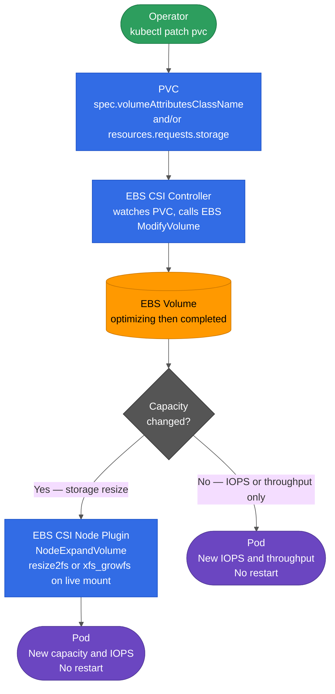

# In-Place EBS Volume Modification for Stateful Workloads

Almost every stateful data workload on EKS sits on EBS. Celeborn shuffle workers, Valkey cluster nodes, Kafka brokers, Trino spill, Pinot servers, ClickHouse, Starrocks. They all run as StatefulSets where each pod owns a PersistentVolumeClaim backed by an EBS volume. The capacity and IOPS that looked right when the cluster was first provisioned rarely stay right for long. This page is about modifying those volumes in place, while the pods keep serving traffic, with zero restarts and zero cluster impact.

:::caution Not on gp2?
This guide is for **gp3** volumes. If your cluster is still on `gp2`, in-place modification is not supported. Migrate to `gp3` first. AWS recommends gp3 for all new EBS workloads: it is ~20% cheaper per GiB, delivers 3,000 IOPS and 125 MiB/s at any size without burst credits, and supports both online resize and `VolumeAttributesClass`. Migrating an existing PVC from gp2 to gp3 requires a StorageClass swap and volume re-provisioning. Do that before applying anything in this guide.
:::

## The Problem

When a StatefulSet creates a pod, it provisions one PVC per replica from `volumeClaimTemplates`. Three things tend to change after that PVC exists:

1. **Capacity**: the disk fills faster than projected.
2. **IOPS**: read and write latency climbs as the workload grows.
3. **Throughput**: compactions, backups, and replication traffic start saturating the volume bandwidth.

On `gp3`, all three can be changed on a running volume without restarting the pod, without snapshotting and recreating the volume, and without moving data across the network. That is what this guide covers.

:::tip The only operator action is a kubectl patch
One `kubectl patch` per PVC. Everything else (the EBS API call, the volume resize, the filesystem expansion) happens in the background automatically. Pods keep serving traffic throughout.
:::

## Why StatefulSets Require Per-PVC Patching

A StatefulSet treats `volumeClaimTemplates` as immutable after creation. Editing the field does nothing to PVCs that already exist. Only new replicas created by scaling out pick up the change. Every existing PVC must be patched individually.

:::caution EBS enforces a 6-hour cooldown per volume
After any modification, the same volume cannot be modified again for 6 hours. If a volume needs both more capacity and more IOPS, patch both in a **single operation**, not two sequential patches. The cooldown is per volume, not per cluster, so patching multiple volumes in the same loop is fine.
:::

:::caution StorageClass changes do not affect existing volumes
Updating a StorageClass after PVCs already exist changes the defaults for **new** PVCs only. It does nothing to volumes that are already provisioned. In-place modification of existing volumes requires explicitly patching each PVC to reference a `VolumeAttributesClass`.
:::

## How It Works: gp3 + VolumeAttributesClass

Two Kubernetes objects enable in-place modification on gp3:

1. **StorageClass with `allowVolumeExpansion: true`**: required to resize an existing PVC's capacity online.
2. **VolumeAttributesClass (VAC)**: a cluster-scoped object that names a performance tier (IOPS + throughput). Patch a PVC to reference a VAC and the EBS CSI driver calls `ModifyVolume` on the live volume. The API went stable in Kubernetes 1.31 and is supported by the AWS EBS CSI driver from v1.35.

With these two in place, all three dimensions (capacity, IOPS, throughput) are changeable on any running volume with a single `kubectl patch`.

:::info No Restarts
Patching `spec.volumeAttributesClassName` or `spec.resources.requests.storage` on a PVC does **not** restart the pod. The EBS CSI controller calls the AWS `ModifyVolume` API while the volume stays mounted. For capacity changes, the CSI node plugin additionally runs `resize2fs` (ext4) or `xfs_growfs` (xfs) on the live mounted filesystem. The pod has no awareness of either change.
:::

## How a Modification Flows Through the Stack



The PVC patch is the only thing the operator does. Everything below it runs in the background while the pod keeps serving traffic.

## Prerequisites Checklist

Verify these on every cluster before patching any PVCs. A missing prerequisite causes silent failures that are hard to diagnose under load.

| Check | Command | Required value |
|---|---|---|
| Kubernetes version | `kubectl version --short` | ≥ 1.31 (VAC API stable) |
| EBS CSI driver version | `kubectl get pods -n kube-system -l app.kubernetes.io/name=aws-ebs-csi-driver -o jsonpath='{.items[0].spec.containers[0].image}'` | ≥ v1.35 |
| StorageClass allows expansion | `kubectl get sc <name> -o jsonpath='{.allowVolumeExpansion}'` | `true` |
| Volume type | `aws ec2 describe-volumes --volume-ids <vol-id> --query 'Volumes[0].VolumeType'` | `gp3` |
| Filesystem type | `kubectl exec <pod> -- stat -f -c %T <mountpath>` | `ext2/ext4` or `xfs` |

:::caution Silent failure with old CSI driver versions
EBS CSI driver versions older than v1.35 silently ignore `volumeAttributesClassName`. The PVC accepts the patch and reports success, but nothing changes at the EBS API. There is no error message. Always check the driver version first.
:::

## VolumeAttributesClass: Deploy Once Per Cluster

A VAC is a cluster-scoped object that names a performance tier. Create it once per cluster before patching any PVCs. Applying the manifest does nothing to existing volumes. It just makes the tier name available to reference.

**Valkey** (`data-stacks/valkey-on-eks/examples/volumeattributesclass-valkey-gp3-perf.yaml`):

```yaml
apiVersion: storage.k8s.io/v1
kind: VolumeAttributesClass
metadata:
  name: valkey-gp3-perf
driverName: ebs.csi.aws.com
parameters:
  iops: "6000"
  throughput: "500"
```

**Celeborn** (`infra/terraform/manifests/celeborn/volumeattributesclass-celeborn-gp3-high.yaml`):

```yaml
apiVersion: storage.k8s.io/v1
kind: VolumeAttributesClass
metadata:
  name: celeborn-gp3-high
driverName: ebs.csi.aws.com
parameters:
  iops: "10000"
  throughput: "1000"
```

```bash
# Valkey cluster
kubectl apply -f data-stacks/valkey-on-eks/examples/volumeattributesclass-valkey-gp3-perf.yaml

# Celeborn cluster
kubectl apply -f infra/terraform/manifests/celeborn/volumeattributesclass-celeborn-gp3-high.yaml
```

## Walkthrough: Valkey Cluster

The [Valkey cluster-mode Helm chart](https://github.com/awslabs/data-on-eks/tree/main/data-stacks/valkey-on-eks/examples/cluster-mode-helm-chart) deploys a sharded Valkey cluster as a StatefulSet (6 replicas: 3 primaries + 3 replicas) where each pod owns one 100 GiB PVC backed by EBS.

**PVC naming:** `data-valkey-cluster-{0..5}`, one per pod, in the `valkey-cluster` namespace.

### Increase IOPS and Throughput Only (no resize)

This is the common case: baseline IOPS is saturating but disk space is fine. A single patch per PVC is all it takes:

```bash
kubectl get pvc -n valkey-cluster --no-headers -o custom-columns="NAME:.metadata.name" | while read pvc; do
  kubectl patch pvc "$pvc" -n valkey-cluster \
    --type='merge' \
    -p '{"spec":{"volumeAttributesClassName":"valkey-gp3-perf"}}'
done
```

This discovers all PVCs dynamically and works for 6-replica clusters, 9-replica clusters, or any other size. EBS applies the change on each volume while Valkey keeps serving. No pod restarts. Typically completes within 5 minutes per volume.

### Increase Capacity and IOPS Together

If you need both more space and more IOPS, always patch both in a single operation. Two separate patches burn two 6-hour cooldown windows on the same volume:

```bash
kubectl get pvc -n valkey-cluster --no-headers -o custom-columns="NAME:.metadata.name" | while read pvc; do
  kubectl patch pvc "$pvc" -n valkey-cluster \
    --type='merge' \
    -p '{"spec":{"resources":{"requests":{"storage":"200Gi"}},"volumeAttributesClassName":"valkey-gp3-perf"}}'
done
```

### Verify

```bash
kubectl get pvc -n valkey-cluster -o wide
```

```
NAME                    STATUS   VOLUME                                     CAPACITY   ACCESS MODES   STORAGECLASS   VOLUMEATTRIBUTESCLASS   AGE   VOLUMEMODE
data-valkey-cluster-0   Bound    pvc-2faff750-f50f-4c15-940c-104272ac23da   110Gi      RWO            gp3            valkey-gp3-perf         11d   Filesystem
data-valkey-cluster-1   Bound    pvc-77d09452-c33c-4735-a69e-0bebd95db47a   110Gi      RWO            gp3            valkey-gp3-perf         11d   Filesystem
data-valkey-cluster-2   Bound    pvc-5e57ff3e-fcae-499b-9598-17c3eb529f36   110Gi      RWO            gp3            valkey-gp3-perf         11d   Filesystem
data-valkey-cluster-3   Bound    pvc-4e572c68-dd4f-4ed3-890e-3f60be2ef0ac   110Gi      RWO            gp3            valkey-gp3-perf         11d   Filesystem
data-valkey-cluster-4   Bound    pvc-017bd772-7cbe-4780-bd75-744cf0cf80e5   110Gi      RWO            gp3            valkey-gp3-perf         11d   Filesystem
data-valkey-cluster-5   Bound    pvc-dfb8e4b6-9f2c-4cb4-90d9-270844316697   110Gi      RWO            gp3            valkey-gp3-perf         11d   Filesystem
```

Confirm via the EBS API. Kubernetes can report the new value before EBS finishes applying it:

```bash
VOL_ID=$(kubectl get pv \
  "$(kubectl get pvc data-valkey-cluster-0 -n valkey-cluster -o jsonpath='{.spec.volumeName}')" \
  -o jsonpath='{.spec.csi.volumeHandle}')

aws ec2 describe-volumes --volume-ids "$VOL_ID" --region us-west-2 \
  --query 'Volumes[0].{Size:Size,Iops:Iops,Throughput:Throughput,State:State}'
```

```json
{
    "Size": 110,
    "Iops": 6000,
    "Throughput": 500,
    "State": "in-use"
}
```

## Walkthrough: Celeborn Shuffle Cluster

Celeborn workers are more disk-intensive than most StatefulSet workloads. Each worker pod owns **4 PVCs** (one per shuffle disk), and a typical deployment runs 6 or more workers, giving 24+ EBS volumes per cluster. At scale, a fleet of Celeborn clusters across hundreds of EKS deployments can represent thousands of volumes.

**PVC naming:** Kubernetes names StatefulSet PVCs as `<template-name>-<pod-name>`. For a Celeborn release named `celeborn` with worker StatefulSet `celeborn-worker` and 6 replicas:

```
disk1-celeborn-worker-0   disk2-celeborn-worker-0   disk3-celeborn-worker-0   disk4-celeborn-worker-0
disk1-celeborn-worker-1   disk2-celeborn-worker-1   disk3-celeborn-worker-1   disk4-celeborn-worker-1
...
disk1-celeborn-worker-5   disk2-celeborn-worker-5   disk3-celeborn-worker-5   disk4-celeborn-worker-5
```

### Increase IOPS and Throughput on All Worker Disks

Patch all PVCs in the Celeborn namespace. No filtering by name is needed since everything in the namespace is a worker disk:

```bash
kubectl get pvc -n celeborn --no-headers -o custom-columns="NAME:.metadata.name" | while read pvc; do
  kubectl patch pvc "$pvc" -n celeborn \
    --type='merge' \
    -p '{"spec":{"volumeAttributesClassName":"celeborn-gp3-high"}}'
  echo "Patched: $pvc"
done
```

This is fully non-disruptive. Celeborn workers continue accepting push and fetch requests from Spark executors while EBS applies the new settings on each volume. No pod restarts. No cluster impact.

### Verify All Celeborn PVCs

```bash
kubectl get pvc -n celeborn -o wide
```

Check EBS state for a specific worker disk to confirm the settings are applied, not just requested:

```bash
VOL_ID=$(kubectl get pv \
  "$(kubectl get pvc disk1-celeborn-worker-0 -n celeborn -o jsonpath='{.spec.volumeName}')" \
  -o jsonpath='{.spec.csi.volumeHandle}')

aws ec2 describe-volumes --volume-ids "$VOL_ID" --region us-west-2 \
  --query 'Volumes[0].{Size:Size,Iops:Iops,Throughput:Throughput,State:State}'
```

```json
{
    "Size": 1000,
    "Iops": 10000,
    "Throughput": 1000,
    "State": "in-use"
}
```

### Lock In the New Tier for Future Scale-Out

Patching existing PVCs updates the volumes that are already running. It does not affect new replicas. Because `volumeClaimTemplates` in a StatefulSet is immutable after creation, any new worker pods added by scaling out will provision PVCs from the original template — with no VAC set and default gp3 IOPS — unless the StatefulSet is recreated with the updated template.

Add `volumeAttributesClassName` to each disk entry in your Helm values:

```yaml
# infra/terraform/helm-values/celeborn.yaml
worker:
  volumeClaimTemplates:
    - metadata:
        name: disk1
      spec:
        storageClassName: gp3-faster
        volumeAttributesClassName: celeborn-gp3-high
        resources:
          requests:
            storage: 1000Gi
    - metadata:
        name: disk2
      spec:
        storageClassName: gp3-faster
        volumeAttributesClassName: celeborn-gp3-high
        resources:
          requests:
            storage: 1000Gi
    - metadata:
        name: disk3
      spec:
        storageClassName: gp3-faster
        volumeAttributesClassName: celeborn-gp3-high
        resources:
          requests:
            storage: 1000Gi
    - metadata:
        name: disk4
      spec:
        storageClassName: gp3-faster
        volumeAttributesClassName: celeborn-gp3-high
        resources:
          requests:
            storage: 1000Gi
```

Delete the StatefulSet object only. Pods and PVCs are not touched:

```bash
kubectl delete statefulset celeborn-worker -n celeborn --cascade=orphan
```

:::caution `--cascade=orphan` does not restart pods or delete PVCs
It removes only the StatefulSet controller object. All worker pods keep serving shuffle traffic. All PVCs and their data are untouched.
:::

Recreate the StatefulSet with the updated template via Helm:

```bash
helm upgrade celeborn <chart> -n celeborn -f infra/terraform/helm-values/celeborn.yaml
```

From this point, any new replicas provisioned by scale-out (Karpenter adding nodes, increasing `worker.replicas`) will automatically get PVCs with `celeborn-gp3-high` (10,000 IOPS / 1,000 MiB/s). No manual patching needed for new nodes.

## Applying Across Hundreds of Clusters

For organizations running Celeborn or Valkey across many EKS clusters, the PVC patch loop is the same. Only the iteration layer changes. EBS modifications are **independent per volume** and fully asynchronous. You can patch volumes across different clusters simultaneously without any coordination. The 6-hour cooldown only applies to the same volume being modified twice.

### Prerequisites Per Cluster (Run Before Patching)

```bash
CLUSTER=$1  # pass cluster name / context as argument
REGION=${2:-us-west-2}

echo "=== Checking $CLUSTER ==="

# 1. EBS CSI driver version
kubectl --context "$CLUSTER" get pods -n kube-system \
  -l app.kubernetes.io/name=aws-ebs-csi-driver \
  -o jsonpath='{.items[0].spec.containers[0].image}' && echo

# 2. StorageClass allows expansion
kubectl --context "$CLUSTER" get sc gp3-faster \
  -o jsonpath='allowVolumeExpansion={.allowVolumeExpansion}' && echo

# 3. VAC exists
kubectl --context "$CLUSTER" get vac celeborn-gp3-high 2>/dev/null \
  && echo "VAC: OK" || echo "VAC: MISSING - apply volumeattributesclass-celeborn-gp3-high.yaml first"
```

### Rollout Script Across All Clusters

```bash
#!/usr/bin/env bash
# Apply celeborn-gp3-high VAC to all Celeborn worker PVCs across all clusters.
# Safe to run multiple times. Patching an already-patched PVC is a no-op.

NAMESPACE=celeborn
VAC=celeborn-gp3-high
REGION=us-west-2

for ctx in $(kubectl config get-contexts -o name | grep celeborn); do
  echo "Cluster: $ctx"

  # Ensure VAC exists on this cluster
  kubectl --context "$ctx" apply \
    -f infra/terraform/manifests/celeborn/volumeattributesclass-celeborn-gp3-high.yaml

  # Patch every PVC in the namespace
  kubectl --context "$ctx" get pvc -n "$NAMESPACE" \
    --no-headers -o custom-columns="NAME:.metadata.name" | while read pvc; do
      kubectl --context "$ctx" patch pvc "$pvc" -n "$NAMESPACE" \
        --type='merge' \
        -p "{\"spec\":{\"volumeAttributesClassName\":\"$VAC\"}}"
      echo "  patched: $pvc"
  done

  echo "  EBS is applying changes asynchronously"
done
```

### Check Rollout Progress Across Clusters

Once patches are applied, use this to check how many volumes have actually completed the EBS modification, not just been requested:

```bash
for ctx in $(kubectl config get-contexts -o name | grep celeborn); do
  echo "$ctx"
  kubectl --context "$ctx" get pvc -n celeborn \
    -o custom-columns="NAME:.metadata.name,VAC:.spec.volumeAttributesClassName,PHASE:.status.phase" \
    --no-headers | grep -v "celeborn-gp3-high" | wc -l | xargs echo "  PVCs still pending:"
done
```

For a definitive check against the EBS API rather than Kubernetes:

```bash
aws ec2 describe-volumes --region us-west-2 \
  --filters "Name=tag:kubernetes.io/cluster/<cluster-name>,Values=owned" \
  --query 'Volumes[*].{Id:VolumeId,Size:Size,Iops:Iops,Throughput:Throughput,State:State}' \
  --output table
```

## What to Know Before Running This at Scale

:::caution Always batch capacity and IOPS into one patch
The 6-hour EBS cooldown is per volume. If a volume needs both more capacity and more IOPS, patch both in a **single operation**. Two sequential patches means the second one blocks for up to 6 hours:

```bash
kubectl patch pvc disk1-celeborn-worker-0 -n celeborn --type='merge' -p \
  '{"spec":{"resources":{"requests":{"storage":"2000Gi"}},"volumeAttributesClassName":"celeborn-gp3-high"}}'
```
:::

:::tip Cooldown is per volume, so patch all replicas in the same loop
Each EBS volume has its own independent 6-hour cooldown window. Patching all PVCs in a namespace in a single loop is safe. The cooldown only blocks the **same volume** being modified twice. Across hundreds of clusters, you can run the rollout script on all clusters simultaneously.
:::

:::note Filesystem type only matters for capacity resize
`ext4` and `xfs` both grow online without unmounting. For IOPS-only changes (VAC patch with no storage resize), filesystem type is irrelevant. The change happens entirely at the EBS API layer, not the filesystem layer.
:::

:::info VAC changes are invisible to the pod
Patching `volumeAttributesClassName` causes no signal, no restart, and no IO pause at the pod layer. From the application's perspective nothing happens. EBS changes the volume's performance envelope while it stays attached and serving IO.
:::
