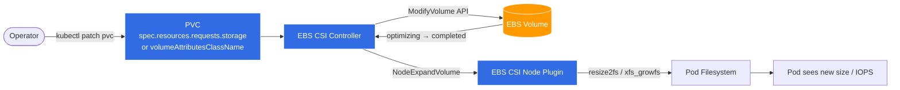

# EBS Volume Modification for Stateful Workloads on EKS

Stateful data workloads on EKS — Kafka brokers, Spark shuffle, Trino spill, Pinot servers, ClickHouse, Valkey, Starrocks — back their pods with EBS-backed PersistentVolumeClaims. Capacity and performance requirements drift over time. This guide covers the right way to grow them in place, without downtime.

## Problem

A StatefulSet provisions an EBS volume per pod through a `volumeClaimTemplates` entry. Once the volume is created, three things commonly need to change:

1. **Size** — the disk fills up faster than projected.
2. **IOPS** — read/write latency climbs as the workload scales out.
3. **Throughput** — large sequential reads (compaction, shuffle, backups) saturate the volume.

If the underlying `StorageClass` is the default `gp2`, or any class without `allowVolumeExpansion: true`, none of the above can be changed in place. The only escape hatches are:

- Snapshot → create a new larger volume → restore → swap PVC → restart pod. Per replica.
- Scale the StatefulSet out and rebalance data to new replicas with bigger disks.

Both cost hours of operator time per cluster and risk data movement bugs. For `gp2` there is an additional trap: **IOPS is a fixed function of size** (3 IOPS/GiB, burstable). Raising IOPS means over-provisioning capacity you don't need.

## Why This Hurts Stateful Workloads Specifically

| Constraint | Impact |
|---|---|
| `StatefulSet.spec.volumeClaimTemplates` is **immutable** after creation | You cannot edit the template and have existing PVCs grow. Each PVC must be patched individually. |
| EBS enforces a **6-hour cooldown** between modifications on the same volume | A bad sizing decision is locked in for 6 hours per volume. |
| `gp2` couples IOPS to size | Performance tuning forces capacity over-provisioning and a higher bill. |
| PVC resize without `allowVolumeExpansion` fails silently at admission | Discovered only when you try to resize under load. |
| Filesystem resize requires the CSI node plugin + a compatible filesystem | Without `ext4` or `xfs` and a current EBS CSI driver, the new capacity is invisible to the pod. |

## Resolution

Three building blocks remove the problem:

1. **Use `gp3`, not `gp2`.** IOPS and throughput are decoupled from size and individually configurable. Baseline is 3,000 IOPS / 125 MiB/s at any size, and `gp3` is ~20% cheaper per GiB.
2. **`allowVolumeExpansion: true` on the StorageClass.** Required for online resize.
3. **`VolumeAttributesClass` (VAC)** to change IOPS/throughput on existing volumes without resizing them. Stable in Kubernetes 1.31 and supported by the AWS EBS CSI driver v1.35+.

With these in place, resize is a `kubectl patch` on the PVC. Performance tuning is a `kubectl patch` on the PVC's `volumeAttributesClassName`. No pod restart, no data movement, no downtime.

## Modification Flow



The PVC patch is the only operator action. Everything below it is automatic, online, and works while the pod keeps serving traffic.

## StorageClass

```yaml
apiVersion: storage.k8s.io/v1
kind: StorageClass
metadata:
  name: gp3
  annotations:
    storageclass.kubernetes.io/is-default-class: "true"
provisioner: ebs.csi.aws.com
volumeBindingMode: WaitForFirstConsumer
allowVolumeExpansion: true
reclaimPolicy: Delete
parameters:
  type: gp3
  iops: "3000"
  throughput: "125"
  encrypted: "true"
  fsType: ext4
```

## VolumeAttributesClass

A VAC carries the performance parameters that you want to be able to change after the volume exists. Define one per performance tier.

```yaml
apiVersion: storage.k8s.io/v1beta1
kind: VolumeAttributesClass
metadata:
  name: gp3-high-perf
driverName: ebs.csi.aws.com
parameters:
  iops: "12000"
  throughput: "500"
```

## StatefulSet Using the Class

```yaml
apiVersion: apps/v1
kind: StatefulSet
metadata:
  name: kafka
spec:
  serviceName: kafka-headless
  replicas: 3
  selector:
    matchLabels: { app: kafka }
  template:
    metadata:
      labels: { app: kafka }
    spec:
      containers:
        - name: kafka
          image: bitnami/kafka:3.7
          volumeMounts:
            - name: data
              mountPath: /bitnami/kafka
  volumeClaimTemplates:
    - metadata:
        name: data
      spec:
        accessModes: ["ReadWriteOnce"]
        storageClassName: gp3
        resources:
          requests:
            storage: 200Gi
```

## Deploy

```bash
kubectl apply -f storageclass-gp3.yaml
kubectl apply -f volumeattributesclass-gp3-high-perf.yaml
kubectl apply -f kafka-statefulset.yaml
```

## Resize Capacity

Patch each PVC. The `volumeClaimTemplates` field cannot be edited after the StatefulSet is created — only newly created PVCs (from scale-out) pick up template changes.

```bash
for i in 0 1 2; do
  kubectl patch pvc data-kafka-$i \
    --type='merge' \
    -p '{"spec":{"resources":{"requests":{"storage":"500Gi"}}}}'
done
```

## Change IOPS / Throughput

```bash
for i in 0 1 2; do
  kubectl patch pvc data-kafka-$i \
    --type='merge' \
    -p '{"spec":{"volumeAttributesClassName":"gp3-high-perf"}}'
done
```

## Verify

```bash
# PVC reports the new requested size, and status.capacity reflects the live size
kubectl get pvc -l app=kafka -o custom-columns=\
NAME:.metadata.name,\
REQUESTED:.spec.resources.requests.storage,\
ACTUAL:.status.capacity.storage,\
VAC:.spec.volumeAttributesClassName,\
PHASE:.status.phase

# Underlying EBS volume size and performance parameters
kubectl get pv -o custom-columns=\
NAME:.metadata.name,\
SIZE:.spec.capacity.storage,\
VOLUME-ID:.spec.csi.volumeHandle

# Pod sees the new filesystem capacity
kubectl exec kafka-0 -- df -h /bitnami/kafka
```

A successful resize reports:

- `status.capacity.storage` equal to the requested size on every PVC.
- `df -h` inside the pod showing the new capacity.
- No pod restart in `kubectl get pods -l app=kafka`.

For a VAC change, confirm with the AWS CLI that the EBS API recorded the new IOPS / throughput:

```bash
VOL_ID=$(kubectl get pv $(kubectl get pvc data-kafka-0 -o jsonpath='{.spec.volumeName}') \
  -o jsonpath='{.spec.csi.volumeHandle}')

aws ec2 describe-volumes --volume-ids "$VOL_ID" \
  --query 'Volumes[0].{Size:Size,Iops:Iops,Throughput:Throughput,State:State}'
```

## Operational Notes

- **6-hour cooldown is per volume.** Plan resize and VAC changes together — combining a capacity bump with an IOPS bump in a single operation avoids burning the window.
- **EBS CSI driver v1.35+** is required for `VolumeAttributesClass`. Earlier drivers ignore the field.
- **Filesystem support.** `ext4` and `xfs` both grow online. Avoid older filesystems on data volumes.
- **Scale-out picks up the new size.** New replicas created after the template is updated (which requires recreating the StatefulSet with `--cascade=orphan` and reapplying) get the new defaults; existing PVCs do not.
