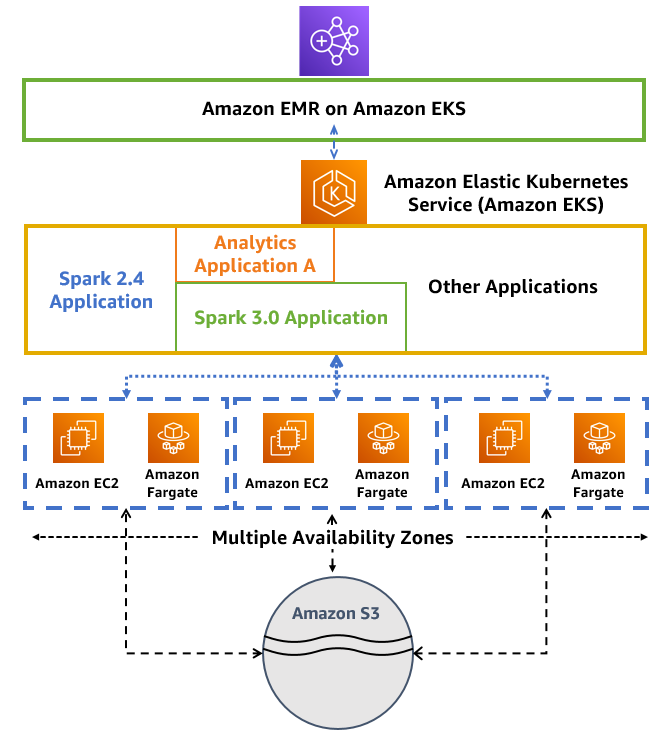

# EMR on EKS Best Practices

## [EMR Containers Best Practices Guides](https://aws.github.io/aws-emr-containers-best-practices/)

Amazon EMR on Amazon EKS enables you to submit Apache Spark jobs on demand on Amazon Elastic Kubernetes Service (EKS) without provisioning clusters. With EMR on EKS, you can consolidate analytical workloads with your other Kubernetes-based applications on the same Amazon EKS cluster to improve resource utilization and simplify infrastructure management.

This link provides the best practices and templates to get started with Amazon EMR on EKS. We publish this guide on GitHub so we could iterate the content quickly, provide timely and effective recommendations for variety of concerns, and easily incorporate suggestions from the broader community.

Checkout the EMR on EKS Best practices GitHub docs [here](https://aws.github.io/aws-emr-containers-best-practices/)

### Architecture
The following diagram illustrates the solution architecture Amazon EMR on EKS.

