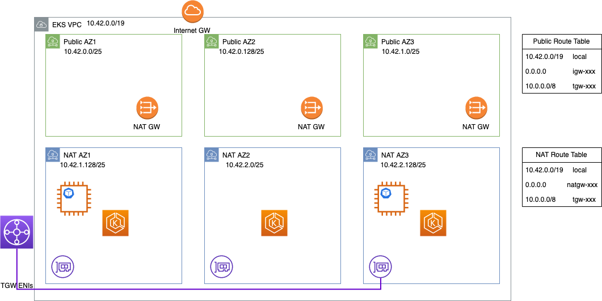

# Networking for Data

## VPC and IP Considerations

### Default VPC CNI Configuration
With the default VPC CNI configuration larger nodes will consume more IP addresses. For example a [`m5.8xlarge` node](https://docs.aws.amazon.com/AWSEC2/latest/UserGuide/using-eni.html#AvailableIpPerENI) that is running 10 pods will hold 60 IPs total (to satisfy `WARM_ENI_TARGET=1`). However a `m5.16xlarge` node would hold 100 IPs.

The AWS VPC CNI maintains this “warm pool” of IP addresses on the EKS worker nodes to assign to Pods. When more IP addresses are needed for your Pods, the CNI must communicate with EC2 APIs to assign the addresses to your nodes.

### Plan for a large amount of IP address usage in your EKS clusters.

During periods of high churn or large scale out, these EC2 API calls can be rate throttled, which will delay the provisioning of Pods and thus delay the execution of workloads. Also, configuring the VPC CNI to minimize this warm pool can increase the EC2 API calls from your nodes and increase the risk of rate throttling.


### Consider using a secondary CIDR if your IP space is constrained.

If you are working with a network that spans multiple connected VPCs or sites the routable address space may be limited.
For example, your VPC may be limited to small subnets like below. In this VPC we wouldn’t be able to run more than one `m5.16xlarge` node without adjusting the CNI configuration.



You can add additional VPC CIDRs from a range that is not routable across VPCs (such as the RFC 6598 range, `100.64.0.0/10`). In this case we added `100.64.0.0/16`, `100.65.0.0/16`, and `100.66.0.0/16` to the VPC (as this is the maximum CIDR size), then created new subnets with those CIDRs.
Finally we recreated the node groups in the new subnets, leaving the existing EKS cluster control plane in place.


With this configuration you can still communicate with the EKS cluster control plane from connected VPCs but your nodes and pods have plenty of IP addresses to accommodate your workloads and the warm pool.


## Tuning the VPC CNI

### VPC CNI and EC2 Rate Throttling

When an EKS worker node is launched it initially has a single ENI with a single IP address attached for the EC2 instance to communicate. As the VPC CNI launches it tries to provision a Warm Pool of IP addresses that can be assigned to Kubernetes Pods ([More details in the EKS Best Practices Guide](https://aws.github.io/aws-eks-best-practices/networking/vpc-cni/#overview)).

The VPC CNI must make AWS EC2 API calls (like `AssignPrivateIpV4Address` and `DescribeNetworkInterfaces`) to assign those additional IPs and ENIs to the worker node. When the EKS cluster scales out the number of Nodes or Pods there could be a spike in the number of these EC2 API calls. This surge of calls could encounter rate throttling from the EC2 API to help the performance of the service, and to ensure fair usage for all Amazon EC2 customers. This rate throttling can cause the pool of IP address to be exhausted while the CNI tries to allocate more IPs.

These failures will cause errors like the one below, indicating that the provisioning of the container network namespace has failed because the VPC CNI could not provision an IP address.


```
Failed to create pod sandbox: rpc error: code = Unknown desc = failed to set up sandbox container "xxxxxxxxxxxxxxxxxxxxxx" network for pod "test-pod": networkPlugin cni failed to set up pod test-pod_default" network: add cmd: failed to assign an IP address to container
```

This failure delays the launch of the Pod and adds pressure to the kubelet and worker node as this action is retried until the IP address is assigned. To avoid this delay you can configure the CNI to reduce the number of EC2 API calls needed.


### Avoid using `WARM_IP_TARGET` in large clusters, or cluster with a lot of churn

`WARM_IP_TARGET` can help limit the “wasted” IPs for small clusters, or clusters that has very low pod churn. However, this environment variable on the VPC CNI needs to be carefully configured in large clusters, as it may increase the number of EC2 API calls for IP attachment and detachment operations by ipamd, increasing the risk and impact of rate throttling.
(`ipamd` stands for IP Address Management Daemon, and [is a core component of VPC CNI](https://docs.aws.amazon.com/eks/latest/best-practices/networking.html#amazon-virtual-private-cloud-vpc-cni). It maintains a warm pool of available IPs for fast Pod startup times.)

For clusters that have a lot of Pod churn, it is recommended to set `MINIMUM_IP_TARGET` to a value slightly higher than the expected number of pods you plan to run on each node. This will allow the CNI to provision all of those IP addresses in a single (or few) calls.

```hcl
  [...]

  # EKS Addons
  cluster_addons = {
    vpc-cni = {
      configuration_values = jsonencode({
        env = {
          MINIMUM_IP_TARGET        = "30"
        }
      })
    }
  }

  [...]
```
For detailed information of tweaking VPC CNI variables, refer to [this documentation on github](https://github.com/aws/amazon-vpc-cni-k8s/blob/master/docs/eni-and-ip-target.md).

### Limit the number of IPs per node on large instance types with `MAX_ENI` and `max-pods`

When using larger instance types such as `16xlarge` or `24xlarge` the [number of IP addresses that can be assigned per ENI](https://docs.aws.amazon.com/AWSEC2/latest/UserGuide/using-eni.html#AvailableIpPerENI) can be fairly large. For example, a `c5.18xlarge` instance type with the default CNI configuration of `WARM_ENI_TARGET=1` would end up holding 100 IP addresses (50 IPs per ENI * 2 ENIs) when running a handful of pods.

For some workloads the CPU, Memory, or other resource will limit the number of Pods on that `c5.18xlarge` before we need more than 50 IPs. In this case you may want to be able to run 30-40 pods maximum on that instance.


```hcl
  [...]

  # EKS Addons
  cluster_addons = {
    vpc-cni = {
      configuration_values = jsonencode({
        env = {
          MAX_ENI           = "1"
        }
      })
    }
  }

  [...]
```


Setting the `MAX_ENI=1` option on the CNI and that this will limit the number of IP addresses each node is able to provision, but it does not limit the number of pod that kubernetes will try to schedule to the nodes. This can lead to a situation where pods are scheduled to nodes that are unable to provision more IP addresses.

To limit the IPs *and* stop k8s from scheduling too many pods you will need to:

1. Update the CNI configuration environment variables to set `MAX_ENI=1`
2. Update the `--max-pods` option for the kubelet on the worker nodes.

To configure the --max-pods option you can update the userdata for your worker nodes to set this option [via the --kubelet -extra-args in the bootstrap.sh script](https://github.com/awslabs/amazon-eks-ami/blob/master/files/bootstrap.sh). By default this script configures the max-pods value for the kubelet, the --use-max-pods false` option disables this behavior when providing your own value:

```hcl
  eks_managed_node_groups = {
    system = {
      instance_types = ["m5.xlarge"]

      min_size     = 0
      max_size     = 5
      desired_size = 3

      pre_bootstrap_user_data = <<-EOT

      EOT

      bootstrap_extra_args = "--use-max-pods false --kubelet-extra-args '--max-pods=<your_value>'"

    }
```

One problem is the number of IPs per ENI is different based on the Instance type ([for example a `m5d.2xlarge` can have 15 IPs per ENI, where a `m5d.4xlarge` can hold 30 IPs per ENI](https://docs.aws.amazon.com/AWSEC2/latest/UserGuide/using-eni.html#AvailableIpPerENI)). This means hard-coding a value for `max-pods` may cause problems if you change instance types or in mixed-instance environments.

In the EKS Optimized AMI releases there is [a script included that can be used to help calculate the AWS Recommended max-pods value](https://github.com/awslabs/amazon-eks-ami/blob/master/files/max-pods-calculator.sh). If you’d like to automate this calculation for mixed instances you will also need to update the userdata for your instances to use the `--instance-type-from-imds` flag to autodiscover the instance type from instance metadata.

```hcl
  eks_managed_node_groups = {
    system = {
      instance_types = ["m5.xlarge"]

      min_size     = 0
      max_size     = 5
      desired_size = 3

      pre_bootstrap_user_data = <<-EOT
        /etc/eks/max-pod-calc.sh --instance-type-from-imds —cni-version 1.13.4 —cni-max-eni 1
      EOT

      bootstrap_extra_args = "--use-max-pods false --kubelet-extra-args '--max-pods=<your_value>'"

    }
```


#### Maxpods with Karpenter

By default, Nodes provisioned by Karpenter will have the max pods on a node [based on the node instance type](https://github.com/awslabs/amazon-eks-ami/blob/master/files/eni-max-pods.txt). To configure the `--max-pods` option as mentioned above by defining at the Provisioner level by specifying `maxPods` within the `.spec.kubeletConfiguration` . This value will be used during Karpenter pod scheduling and passed through to `--max-pods` on kubelet startup.

Below is the example Provisioner spec:

```yaml
apiVersion: karpenter.sh/v1alpha5
kind: Provisioner
metadata:
  name: default
spec:
  providerRef:
    name: default
  requirements:
    - key: "karpenter.k8s.aws/instance-category"
      operator: In
      values: ["c", "m", "r"]
    - key: "karpenter.sh/capacity-type" # If not included, the webhook for the AWS cloud provider will default to on-demand
      operator: In
      values: ["spot", "on-demand"]

  # Karpenter provides the ability to specify a few additional Kubelet args.
  # These are all optional and provide support for additional customization and use cases.
  kubeletConfiguration:
    maxPods: 30
```


## Application

### Scaling CoreDNS
#### Default Behavior
Route 53 Resolver enforces a limit of 1024 packets per second per network interface for each EC2 instance, and this limit is not adjustable. In EKS clusters, CoreDNS runs with two replicas by default, with each replica on a separate EC2 instance. When DNS traffic exceeds 1024 packets per second for a CoreDNS replica, DNS requests will be throttled, resulting in `unknownHostException` errors.

#### Remediation
To address the scalability of default coreDNS, consider implementing one of the following two options:
  * [Enable coreDNS auto-scaling](https://docs.aws.amazon.com/eks/latest/userguide/coredns-autoscaling.html).
  * [Implement Node local cache](https://kubernetes.io/docs/tasks/administer-cluster/nodelocaldns/).


While scaling out `CoreDNS` it is also crucial to distribute replicas across different nodes. Co-locating CoreDNS on same nodes, will again end up throttling the ENI, rendering additional replicas ineffective. In order to distribute `CoreDNS` across nodes, apply node anti-affinity policy to the pods:

```
affinity:
  podAntiAffinity:
    requiredDuringSchedulingIgnoredDuringExecution:
    - labelSelector:
        matchExpressions:
        - key: k8s-app
          operator: In
          values:
          - kube-dns
      topologyKey: kubernetes.io/hostname
```

#### CoreDNS Monitoring
It is recommended to continuously monitor CoreDNS metrics. Refer to [EKS Networking Best Practices](https://docs.aws.amazon.com/eks/latest/best-practices/monitoring_eks_workloads_for_network_performance_issues.html#_monitoring_coredns_traffic_for_dns_throttling_issues) for detailed information.

### DNS Lookups and ndots

In [Kubernetes Pods with the default DNS configuration](https://kubernetes.io/docs/concepts/services-networking/dns-pod-service/) have a `resolv.conf` file like so:

```
nameserver 10.100.0.10
search namespace.svc.cluster.local svc.cluster.local cluster.local ec2.internal
options ndots:5
```

The domain names listed in the `search` line are appended to DNS names that are not fully qualified domain names (FQDN). For example, if a pod tries to connect to a Kubernetes service using `servicename.namespace` the domains would be appended in order until the DNS name matched the full kubernetes service name:

```
servicename.namespace.namespace.svc.cluster.local   <--- Fails with NXDOMAIN
servicename.namespace.svc.cluster.local        <-- Succeed
```

Whether or not a domain is fully qualified is determined by the `ndots` option in the resolv.conf. This option defines the number of dots that must be in a domain name before the `search` domains are skipped. These additional searches can add latency to connections to external resources like S3 and RDS endpoints.

The default `ndots` setting in Kubernetes is five, if your application isn’t talking to other pods in the cluster, we can set the `ndots` to a low value like “2”. This is a good starting point, because it still allows your application to do service discovery within the same namespace and in other namespaces within the cluster, but allows a domain like `s3.us-east-2.amazonaws.com` to be recognized as a FQDN (skipping the `search` domains).

Here’s an example pod manifest from the Kubernetes documentation with `ndots` set to “2”:

```yaml
apiVersion: v1
kind: Pod
metadata:
  namespace: default
  name: dns-example
spec:
  containers:
    - name: test
      image: nginx
  dnsConfig:
    options:
      - name: ndots
        value: "2"
```

:::info

While setting `ndots` to “2” in your pod deployment is a reasonable place to start, this will not universally work in all situations and shouldn’t be applied across the entire cluster. The `ndots` configuration needs to be configured at the Pod or Deployment level. Reducing this setting at the Cluster level CoreDNS configuration is not recommended.

:::


### Inter AZ Network Optimization

Some workloads may need to exchange data between Pods in the cluster, like Spark executors during the shuffle stage.
If the Pods are spread across multiple Availability Zones (AZs), this shuffle operation can turn out to be very expensive, especially on Network I/O front. Hence, for these workloads, it is recommended to colocate executors or worker pods in the same AZ. Colocating workloads in the same AZ serves two main purposes:

* Reduce inter-AZ traffic costs
* Reduce network latency between executors/Pods

To have pods co-located on the same AZ, we can use `podAffinity` based scheduling constraints. The scheduling constraint `preferredDuringSchedulingIgnoredDuringExecution` can be enforced in the Pod spec. For example, ins Spark we can use a custom template for our driver and executor pods:

```yaml
spec:
  executor:
    affinity:
      podAffinity:
        preferredDuringSchedulingIgnoredDuringExecution:
        - labelSelector:
              matchExpressions:
              - key: sparkoperator.k8s.io/app-name
                operator: In
                values:
                - <<spark-app-name>>
          topologyKey: topology.kubernetes.io/zone
          ...
```

You can also leverage Kubernetes Topology Aware Routing to have Kubernetes services route traffic in more efficient means once pods have been created: https://aws.amazon.com/blogs/containers/exploring-the-effect-of-topology-aware-hints-on-network-traffic-in-amazon-elastic-kubernetes-service/

:::info

Having all executors located in a single AZ, means that AZ will be a *single point of failure*. This is a trade off you should consider between lowering network cost and latency, and the event of an AZ failure interrupting workloads.
If your workload is running on instances with constrained capacity you may consider using multiple AZs to avoid Insufficient Capacity errors.

:::
