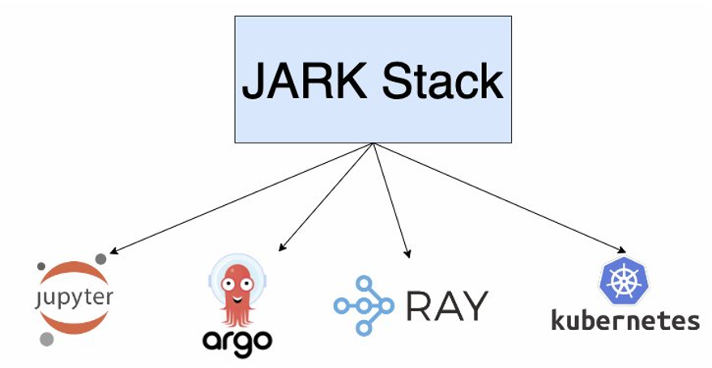
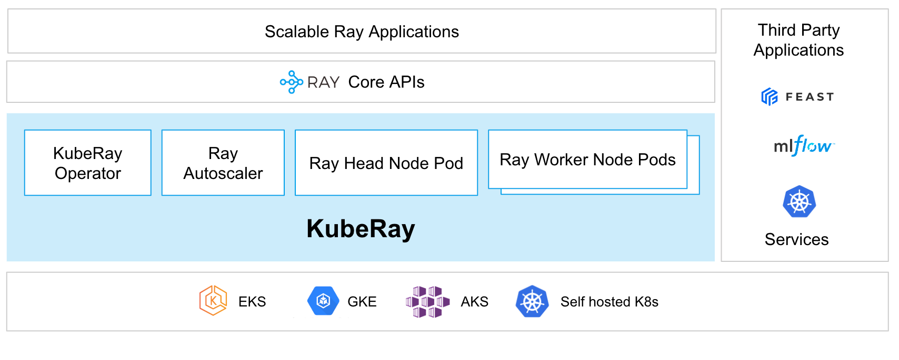
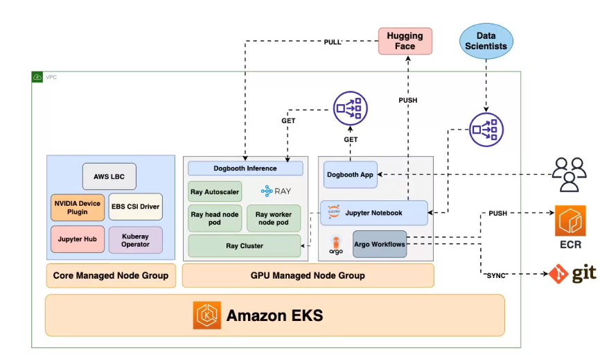

import CollapsibleContent from '../../../src/components/CollapsibleContent';

# JARK on EKS

:::caution

The **AI on EKS** content **is being migrated** to a new repository.
🔗 👉 [Read the full migration announcement »](https://awslabs.github.io/data-on-eks/docs/migration/migration-announcement)

:::

:::warning
Deployment of ML models on EKS requires access to GPUs or Neuron instances. If your deployment isn't working, it’s often due to missing access to these resources. Also, some deployment patterns rely on Karpenter autoscaling and static node groups; if nodes aren't initializing, check the logs for Karpenter or Node groups to resolve the issue.
:::

:::info
These instructions only deploy the JARK cluster as a base. If you are looking to deploy specific models for inference or training, please refer to this [Gen AI](https://awslabs.github.io/data-on-eks/docs/gen-ai) page for end-to-end instructions.
:::

### What is JARK?
JARK is a powerful stack composed of [JupyterHub](https://jupyter.org/hub), [Argo Workflows](https://github.com/argoproj/argo-workflows), [Ray](https://github.com/ray-project/ray), and [Kubernetes](https://kubernetes.io/), designed to streamline the deployment and management of Generative AI models on Amazon EKS. This stack brings together some of the most effective tools in the AI and Kubernetes ecosystem, offering a robust solution for training, fine-tuning, and inference large Gen AI models.

### Key Features and Benefits
[JupyterHub](https://jupyter.org/hub): Provides a collaborative environment for running notebooks, crucial for model development and prompt engineering.

[Argo Workflows](https://github.com/argoproj/argo-workflows): Automates the entire AI model pipeline—from data preparation to model deployment—ensuring a consistent and efficient process.

[Ray](https://github.com/ray-project/ray): Scales AI model training and inference across multiple nodes, making it easier to handle large datasets and reduce training time.

[Kubernetes](https://kubernetes.io/): Powers the stack by providing the necessary orchestration to run, scale, and manage containerized AI models with high availability and resource efficiency.

### Why Use JARK?
The JARK stack is ideal for teams and organizations looking to simplify the complex process of deploying and managing AI models. Whether you're working on cutting-edge generative models or scaling existing AI workloads, JARK on Amazon EKS offers the flexibility, scalability, and control you need to succeed.





### Ray on Kubernetes

[Ray](https://www.ray.io/) is an open-source framework for building scalable and distributed applications. It is designed to make it easy to write parallel and distributed Python applications by providing a simple and intuitive API for distributed computing. It has a growing community of users and contributors, and is actively maintained and developed by the Ray team at Anyscale, Inc.


*Source: https://docs.ray.io/en/latest/cluster/key-concepts.html*

To deploy Ray in production across multiple machines users must first deploy [**Ray Cluster**](https://docs.ray.io/en/latest/cluster/getting-started.html). A Ray Cluster consists of head nodes and worker nodes which can be autoscaled using the built-in **Ray Autoscaler**.

Deploying Ray Cluster on Kubernetes including on Amazon EKS is supported via the [**KubeRay Operator**](https://ray-project.github.io/kuberay/). The operator provides a Kubernetes-native way to manage Ray clusters. The installation of KubeRay Operator involves deploying the operator and the CRDs for `RayCluster`, `RayJob` and `RayService` as documented [here](https://ray-project.github.io/kuberay/deploy/helm/).

Deploying Ray on Kubernetes can provide several benefits:

1. **Scalability**: Kubernetes allows you to scale your Ray cluster up or down based on your workload requirements, making it easy to manage large-scale distributed applications.

1. **Fault tolerance**: Kubernetes provides built-in mechanisms for handling node failures and ensuring high availability of your Ray cluster.

1. **Resource allocation**: With Kubernetes, you can easily allocate and manage resources for your Ray workloads, ensuring that they have access to the necessary resources for optimal performance.

1. **Portability**: By deploying Ray on Kubernetes, you can run your workloads across multiple clouds and on-premises data centers, making it easy to move your applications as needed.

1. **Monitoring**: Kubernetes provides rich monitoring capabilities, including metrics and logging, making it easy to troubleshoot issues and optimize performance.

Overall, deploying Ray on Kubernetes can simplify the deployment and management of distributed applications, making it a popular choice for many organizations that need to run large-scale machine learning workloads.

Before moving forward with the deployment please make sure you have read the pertinent sections of the official [documentation](https://docs.ray.io/en/latest/cluster/kubernetes/index.html).



*Source: https://docs.ray.io/en/latest/cluster/kubernetes/index.html*

<CollapsibleContent header={<h2><span>Deploying the Solution</span></h2>}>

In this [example](https://github.com/awslabs/data-on-eks/tree/main/ai-ml/jark-stack/terraform), you will provision JARK Cluster on Amazon EKS.




### Prerequisites

Ensure that you have installed the following tools on your machine.

1. [aws cli](https://docs.aws.amazon.com/cli/latest/userguide/install-cliv2.html)
2. [kubectl](https://Kubernetes.io/docs/tasks/tools/)
3. [terraform](https://learn.hashicorp.com/tutorials/terraform/install-cli)

### Deploy

Clone the repository

```bash
git clone https://github.com/awslabs/data-on-eks.git
```
:::info
If you are using profile for authentication
set your `export AWS_PROFILE="<PROFILE_name>"` to the desired profile name
:::

Navigate into one of the example directories and run `install.sh` script

:::info
Ensure that you update the region in the `variables.tf` file before deploying the blueprint.
Additionally, confirm that your local region setting matches the specified region to prevent any discrepancies.
For example, set your `export AWS_DEFAULT_REGION="<REGION>"` to the desired region:
:::


```bash
cd data-on-eks/ai-ml/jark-stack/terraform && chmod +x install.sh
./install.sh
```

</CollapsibleContent>

<CollapsibleContent header={<h3><span>Verify Deployment</span></h3>}>

Update local kubeconfig so we can access kubernetes cluster

```bash
aws eks update-kubeconfig --name jark-stack #or whatever you used for EKS cluster name
```

First, lets verify that we have worker nodes running in the cluster.

```bash
kubectl get nodes
```

```bash
NAME                          STATUS   ROLES    AGE   VERSION
ip-10-1-26-241.ec2.internal   Ready    <none>   10h   v1.24.9-eks-49d8fe8
ip-10-1-4-21.ec2.internal     Ready    <none>   10h   v1.24.9-eks-49d8fe8
ip-10-1-40-196.ec2.internal   Ready    <none>   10h   v1.24.9-eks-49d8fe8
```

Next, lets verify all the pods are running.

```bash
kubectl get pods -n kuberay-operator
```

```bash
NAME                               READY   STATUS    RESTARTS        AGE
kuberay-operator-7b5c85998-vfsjr   1/1     Running   1 (1h37m ago)   1h
```

```bash
kubectl get deployments -A

NAMESPACE              NAME                                                 READY   UP-TO-DATE   AVAILABLE   AGE
ingress-nginx          ingress-nginx-controller                             1/1     1            1           36h
jupyterhub             hub                                                  1/1     1            1           36h
jupyterhub             proxy                                                1/1     1            1           36h
kube-system            aws-load-balancer-controller                         2/2     2            2           36h
kube-system            coredns                                              2/2     2            2           2d5h
kube-system            ebs-csi-controller                                   2/2     2            2           2d5h
kuberay-operator       kuberay-operator                                     1/1     1            1           36h
nvidia-device-plugin   nvidia-device-plugin-node-feature-discovery-master   1/1     1
```

:::info

Please refer to [Gen AI](https://awslabs.github.io/data-on-eks/docs/gen-ai) page for deploying Gen AI mmodels on EKS.

:::

</CollapsibleContent>

<CollapsibleContent header={<h3><span>Clean Up</span></h3>}>

:::caution
To avoid unwanted charges to your AWS account, delete all the AWS resources created during this deployment.
:::

This script will cleanup the environment using `-target` option to ensure all the resources are deleted in correct order.

```bash
cd data-on-eks/ai-ml/jark-stack/terraform && chmod +x cleanup.sh
```

</CollapsibleContent>
