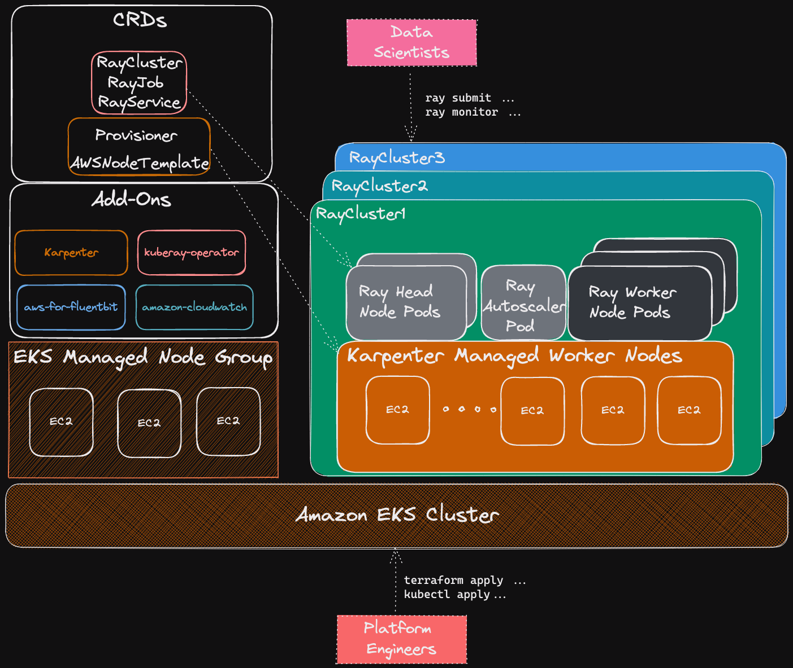

import CollapsibleContent from '../../../src/components/CollapsibleContent';

# JARK on EKS

:::caution
This blueprint should be considered as experimental and should only be used for proof of concept.
:::

:::info
As part of our ongoing efforts to make this blueprint more enterprise-ready, we are actively working on adding several key functionalities. This includes cost management with Kubecost, advanced observability with OTEL, Amazon Managed Prometheus, and Grafana, as well as improved security and data governance using tools such as OPA/Gatekeeper and IRSA. If you have specific requirements or suggestions for this blueprint, please feel free to open an issue on our GitHub repository.
:::

## Introduction

[Ray](https://www.ray.io/) is an open-source framework for building scalable and distributed applications. It is designed to make it easy to write parallel and distributed Python applications by providing a simple and intuitive API for distributed computing. It has a growing community of users and contributors, and is actively maintained and developed by the Ray team at Anyscale, Inc.

To deploy Ray in production across multiple machines users must first deploy [**Ray Cluster**](https://docs.ray.io/en/latest/cluster/getting-started.html). A Ray Cluster consists of head nodes and worker nodes which can be autoscaled using the built-in **Ray Autoscaler**.


*Source: https://docs.ray.io/en/latest/cluster/key-concepts.html*

## Ray on Kubernetes

Deploying Ray Cluster on Kubernetes including on Amazon EKS is supported via the [**KubeRay Operator**](https://ray-project.github.io/kuberay/). The operator provides a Kubernetes-native way to manage Ray clusters. The installation of KubeRay Operator involves deploying the operator and the CRDs for `RayCluster`, `RayJob` and `RayService` as documented [here](https://ray-project.github.io/kuberay/deploy/helm/).

Deploying Ray on Kubernetes can provide several benefits:

1. Scalability: Kubernetes allows you to scale your Ray cluster up or down based on your workload requirements, making it easy to manage large-scale distributed applications.

1. Fault tolerance: Kubernetes provides built-in mechanisms for handling node failures and ensuring high availability of your Ray cluster.

1. Resource allocation: With Kubernetes, you can easily allocate and manage resources for your Ray workloads, ensuring that they have access to the necessary resources for optimal performance.

1. Portability: By deploying Ray on Kubernetes, you can run your workloads across multiple clouds and on-premises data centers, making it easy to move your applications as needed.

1. Monitoring: Kubernetes provides rich monitoring capabilities, including metrics and logging, making it easy to troubleshoot issues and optimize performance.

Overall, deploying Ray on Kubernetes can simplify the deployment and management of distributed applications, making it a popular choice for many organizations that need to run large-scale machine learning workloads.

Before moving forward with the deployment please make sure you have read the pertinent sections of the official [documentation](https://docs.ray.io/en/latest/cluster/kubernetes/index.html).


*Source: https://docs.ray.io/en/latest/cluster/kubernetes/index.html*

## Deploying the Example

In this [example](https://github.com/awslabs/data-on-eks/tree/main/ai-ml/ray/terraform), you will provision Ray Cluster on Amazon EKS using the KubeRay Operator. The example also demonstrates the use of Karpenter of autoscaling of worker nodes for job specific Ray Clusters.




<CollapsibleContent header={<h3><span>Pre-requisites</span></h3>}>

Ensure that you have installed the following tools on your machine.

1. [aws cli](https://docs.aws.amazon.com/cli/latest/userguide/install-cliv2.html)
2. [kubectl](https://Kubernetes.io/docs/tasks/tools/)
3. [terraform](https://learn.hashicorp.com/tutorials/terraform/install-cli)
4. [python3](https://www.python.org/)
6. [ray](https://docs.ray.io/en/master/ray-overview/installation.html#from-wheels)

</CollapsibleContent>

<CollapsibleContent header={<h3><span>Deploy the EKS Cluster with KubeRay Operator</span></h3>}>

#### Clone the repository

```bash
git clone https://github.com/awslabs/data-on-eks.git
```

Navigate into one of the example directories and run `install.sh` script

**Important Note:** Ensure that you update the region in the `variables.tf` file before deploying the blueprint.
Additionally, confirm that your local region setting matches the specified region to prevent any discrepancies.
For example, set your `export AWS_DEFAULT_REGION="<REGION>"` to the desired region:

```bash
cd data-on-eks/ai-ml/jark-stack/ && chmod +x install.sh
./install.sh
```

</CollapsibleContent>

<CollapsibleContent header={<h3><span>Verify Deployment</span></h3>}>

Update local kubeconfig so we can access kubernetes cluster

```bash
aws eks update-kubeconfig --name jark-stack #or whatever you used for EKS cluster name
```

First, lets verify that we have worker nodes running in the cluster.

```bash
kubectl get nodes
```

```bash
NAME                          STATUS   ROLES    AGE   VERSION
ip-10-1-26-241.ec2.internal   Ready    <none>   10h   v1.24.9-eks-49d8fe8
ip-10-1-4-21.ec2.internal     Ready    <none>   10h   v1.24.9-eks-49d8fe8
ip-10-1-40-196.ec2.internal   Ready    <none>   10h   v1.24.9-eks-49d8fe8
```


Next, lets verify all the pods are running.

```bash
kubectl get pods -n kuberay-operator
```

```bash
NAME                               READY   STATUS    RESTARTS        AGE
kuberay-operator-7b5c85998-vfsjr   1/1     Running   1 (1h37m ago)   1h
```


:::info

Please check out deploying the LLM Inference or Training using the JARK stack under the [Gen AI](https://awslabs.github.io/data-on-eks/docs/gen-ai) page.

:::

</CollapsibleContent>

<CollapsibleContent header={<h3><span>Clean Up</span></h3>}>

:::caution
To avoid unwanted charges to your AWS account, delete all the AWS resources created during this deployment.
:::

This script will cleanup the environment using `-target` option to ensure all the resources are deleted in correct order.

```bash
cd ../../../ai-ml/jark-stack/
./cleanup.sh
```

</CollapsibleContent>
