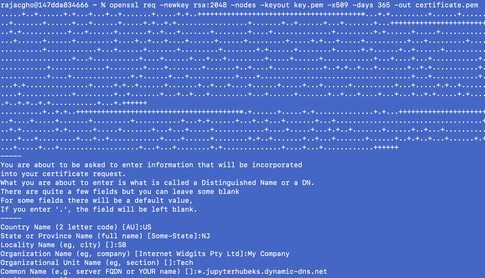
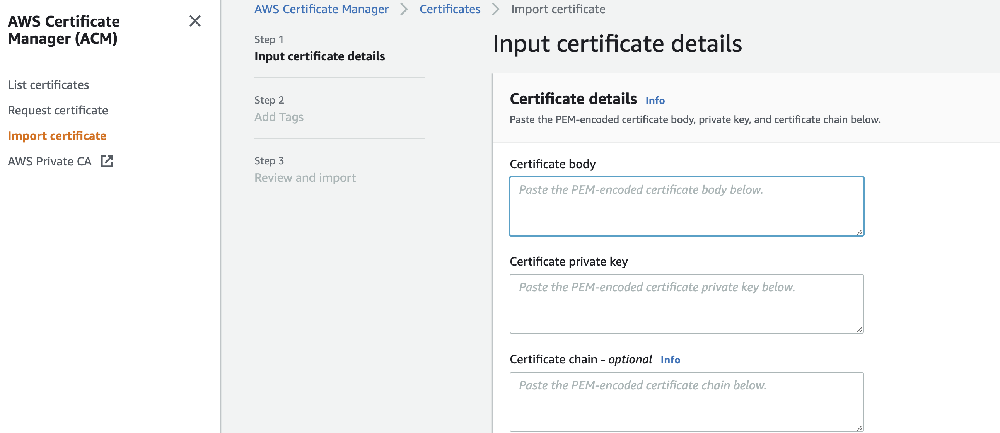
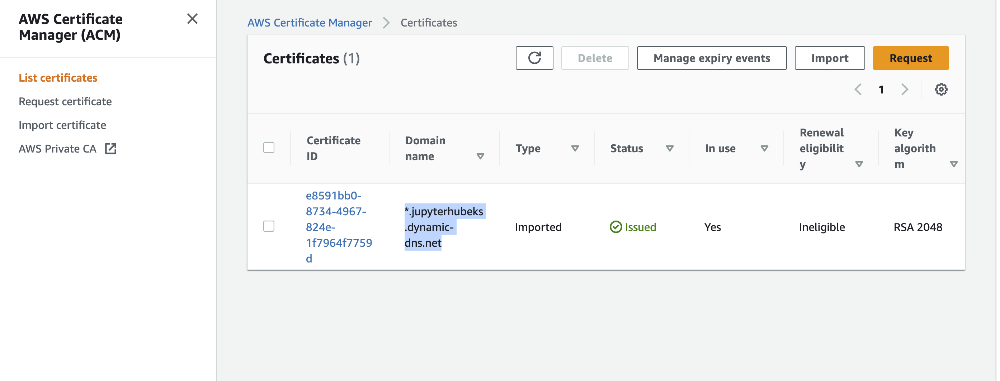
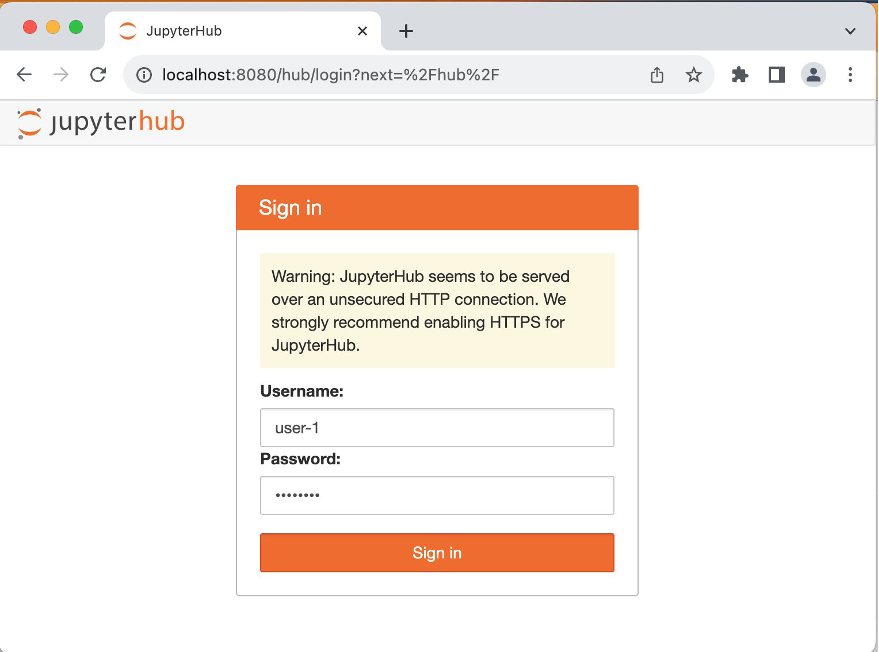
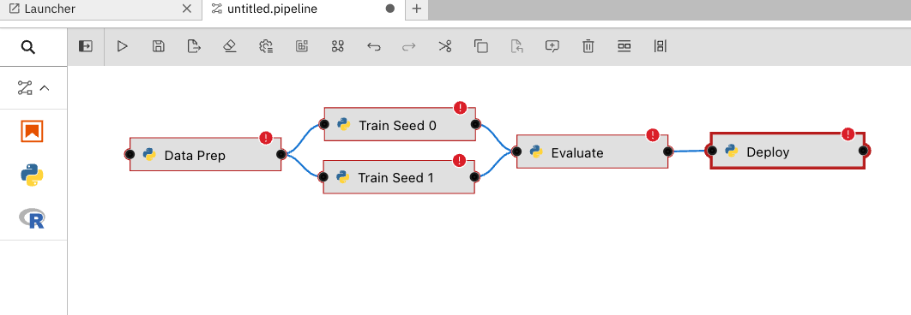
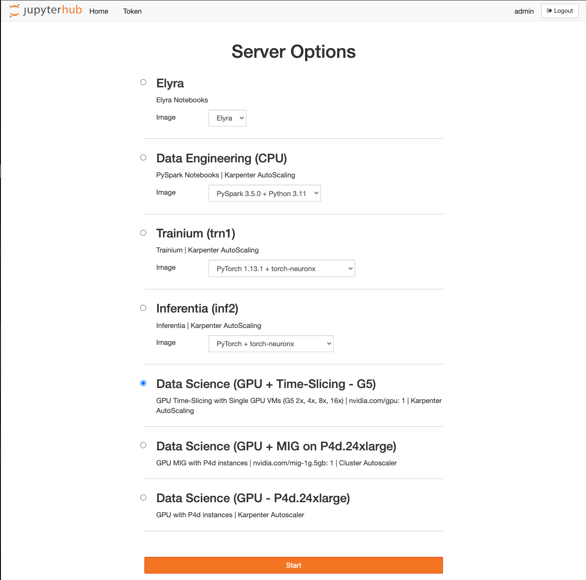
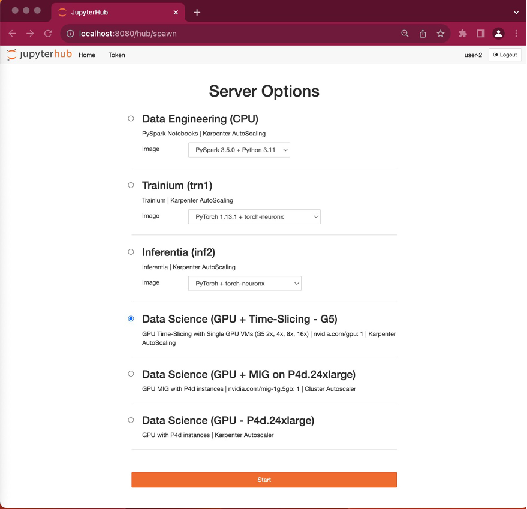
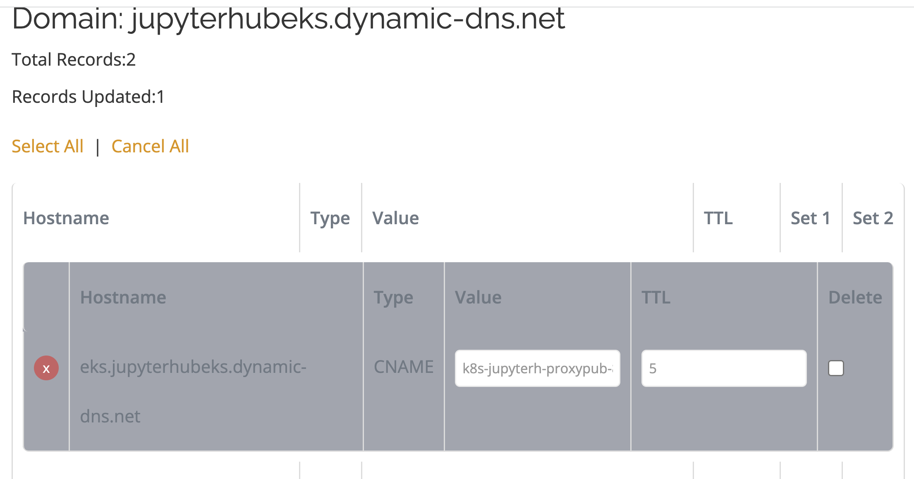
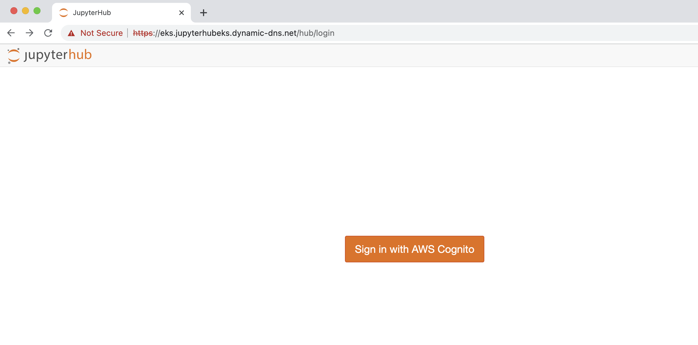
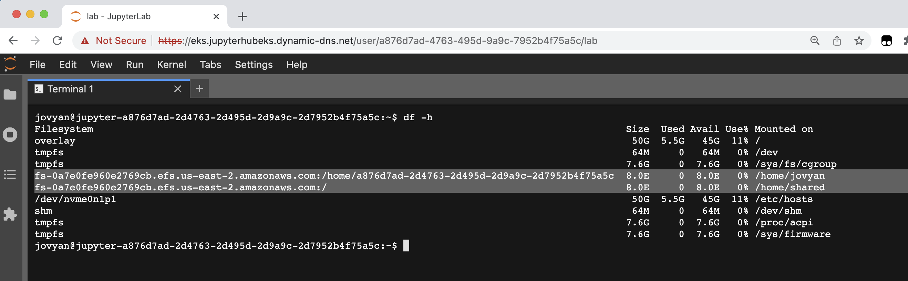

import CollapsibleContent from '../../../src/components/CollapsibleContent';

:::caution

The **AI on EKS** content **is being migrated** to a new repository.
🔗 👉 [Read the full migration announcement »](https://awslabs.github.io/data-on-eks/docs/migration/migration-announcement)

:::

:::warning
Deployment of ML models on EKS requires access to GPUs or Neuron instances. If your deployment isn't working, it’s often due to missing access to these resources. Also, some deployment patterns rely on Karpenter autoscaling and static node groups; if nodes aren't initializing, check the logs for Karpenter or Node groups to resolve the issue.
:::

# JupyterHub on EKS

[JupyterHub](https://jupyter.org/hub) s a powerful multi-user server that enables users to access and interact with Jupyter notebooks and other Jupyter-compatible environments. It provides a collaborative platform where multiple users can simultaneously access and utilize notebooks, fostering collaboration and sharing among users. JupyterHub allows users to create their own isolated computing environments (known as "spawners") and launch Jupyter notebooks or other interactive computing environments within those environments. This provides each user with their own workspace, including files, code, and computational resources.

## JupyterHub on EKS
Deploying JupyterHub on Amazon Elastic Kubernetes Service (EKS) combines the versatility of JupyterHub with the scalability and flexibility of Kubernetes. This blueprint enables users to build a multi-tenant JupyterHub platform on EKS with the help of JupyterHub profiles. By leveraging EFS shared filesystems for each user, it facilitates easy sharing of notebooks and provides individual EFS storage so that user pods can securely store data, even if the user pod is deleted or expired. When users log in, they can access all their scripts and data under the existing EFS volume.

By leveraging the capabilities of EKS, you can seamlessly scale your JupyterHub environment to meet the needs of your users, ensuring efficient resource utilization and optimal performance. With EKS, you can take advantage of Kubernetes features such as automated scaling, high availability, and easy deployment of updates and upgrades. This enables you to provide a reliable and robust JupyterHub experience for your users, empowering them to collaborate, explore, and analyze data effectively.

To get started with JupyterHub on EKS, follow the instructions in this guide to set up and configure your JupyterHub environment.

<CollapsibleContent header={<h3><span>Deploying the Solution</span></h3>}>

This [blueprint](https://github.com/awslabs/data-on-eks/tree/main/ai-ml/jupyterhub)  deploys the following components:

- Creates a new sample VPC, 2 Private Subnets, and 2 Public Subnets. Link to VPC documentation
- Sets up an Internet gateway for Public Subnets and NAT Gateway for Private Subnets.
- Creates an EKS Cluster Control plane with a public endpoint (for demo purposes only) and a core managed node group.
- Deploys the [JupyterHub Helm chart](https://hub.jupyter.org/helm-chart/) to set up JupyterHub.
- Sets up two EFS storage mounts: one for personal storage and one for shared storage.
- Optional: Authenticates users using [Amazon Cognito](https://aws.amazon.com/cognito/) user pools. Link to Cognito documentation

By following this blueprint, you can easily deploy and configure a JupyterHub environment on EKS, leveraging various AWS services to provide a collaborative and scalable platform for your users.

<CollapsibleContent header={<h3><span>Pre-requisites</span></h3>}>

**Type 1: Deploying JupyterHub Without Domain Name and Load Balancer**:

This approach uses port-forwarding (`kubectl port-forward svc/proxy-public 8080:80 -n jupyterhub`) on JupyterHub. It is helpful for testing in development and test environments. For production deployment, you need a custom domain name to host JupyterHub with proper authentication mechanisms like Cognito. Use Approach 2 for authentication in production.

**Type 2: Deploying JupyterHub With Custom Domain Name, ACM, and NLB**:

This approach requires creating a domain name and obtaining an ACM certificate. You will need to coordinate with your organization or platform teams for the domain name and certificate. You can use either your own authentication mechanism or AWS Cognito.

Ensure that you have installed the following tools on your machine.

1. [aws cli](https://docs.aws.amazon.com/cli/latest/userguide/install-cliv2.html)
2. [kubectl](https://Kubernetes.io/docs/tasks/tools/)
3. [terraform](https://learn.hashicorp.com/tutorials/terraform/install-cli)

:::info

The below is required only for the Type2 deployment and it requires a custom domain name and ACM certificate

:::

4. **Domain Name**: You need to bring your own domain name to host the JupyterHub WebUI with a custom domain. For testing purposes, you can use a free domain service provider such as [ChangeIP](https://www.changeip.com/accounts/index.php) to create a test domain. However, please note that using ChangeIP or similar services for hosting your production or development clusters with JupyterHub is not recommended. Ensure that you review the terms and conditions of using such services.
5. **SSL Certificate**: You will also need to obtain an SSL certificate from a trusted Certificate Authority (CA) or through your web hosting provider to attach to the domain. For testing environments, you can generate a self-signed certificate using the OpenSSL service.

```bash
openssl req -newkey rsa:2048 -nodes -keyout key.pem -x509 -days 365 -out certificate.pem
```

When creating the certificate use a wildcard, so that it can secure a domain and all its subdomains with a single certificate
The service generates the private key and self-signed certificate.
Sample prompts to generate a certificate :




6. Import the certificate into AWS Certificate Manager

Open the private key(`key.pem`) in a text editor and copy the contents into the private key section of ACM. Similarly, copy the contents of the `certificate.pem` file into the certificate body section and submit.

   

   Verify certificate is installed correctly in the console in ACM.

   

</CollapsibleContent>

**JupyterHub authentication options**

This blueprint provides support for three authentication mechanisms: `dummy` and `cognito`, and `oauth`. In this post, we’ll use the dummy mechanism for easy demonstration and it’s not a recommended authentication mechanism for production. We strongly advise utilizing the cognito method or other supported authentication mechanisms found on the Authenticators page for production-ready setups.

### Deploy

**Type1 Deployment config changes:**

Only update the `region` variable in the `variables.tf` file.

**Type2 Deployment config changes:**

Update the `variables.tf` file with the following variables:
 - `acm_certificate_domain`
 - `jupyterhub_domain`
 - `jupyter_hub_auth_mechanism=cognito`

**Type3 Deployment config changes:**
- `acm_certificate_domain`
- `jupyterhub_domain`
- `jupyter_hub_auth_mechanism=oauth`
- `oauth_domain`
- `oauth_jupyter_client_id`
- `oauth_jupyter_client_secret`
- `oauth_username_key`

Clone the repository

```bash
git clone https://github.com/awslabs/data-on-eks.git
```

Navigate into one of the blueprint directory

```bash
cd data-on-eks/ai-ml/jupyterhub && chmod +x install.sh
```

:::info

If the deployment is not complete, rerun install.sh

:::


</CollapsibleContent>


<CollapsibleContent header={<h3><span>Verify the resources</span></h3>}>

First, you’ll need to configure your kubeconfig to connect to the newly created Amazon EKS cluster. Use the following command, replacing `us-west-2` with your specific AWS Region if necessary:

```bash
aws eks --region us-west-2 update-kubeconfig --name jupyterhub-on-eks
```
Now, you can check the status of the pods across various namespaces by running. Keep an eye out for the key deployments:

```bash
kubectl get pods -A
```

This verification step is essential to guarantee that all the necessary components are functioning correctly. If everything is in order, then you can proceed with confidence, knowing that your JupyterHub environment on Amazon EKS is ready to empower your data and machine learning teams.

To validate that the JupyterHub add-on is running ensure that the add-on deployments for the controller and the webhook are in RUNNING state.

Run the following command

```bash
kubectl get pods -n jupyterhub
```

Verify the Karpenter Provisioners deployed by this blueprint. We’ll discuss how these provisioners are used by the JupyterHub profiles to spin-up specific node.

```bash
kubectl get provisioners
```

Verify the Persistent Volume Claims (PVCs) created by this blueprint, each serving a unique purpose. The Amazon EFS volume named efs-persist is mounted as the individual home directory for each JupyterHub single-user pod, which ensures a dedicated space for each user. In contrast, efs-persist-shared is a special PVC that is mounted across all JupyterHub single-user pods, facilitating collaborative notebook sharing among users. Alongside these, additional Amazon EBS Volumes have been provisioned to robustly support JupyterHub, Kube Prometheus Stack, and KubeCost deployments.

```bash
kubectl get pvc -A
```

</CollapsibleContent>

### Type1 deployment: Login to JupyterHub

**Exposing JupyterHub with port-forward**:

Execute the command below to make the JupyterHub service accessible for viewing the Web User Interface locally. It’s important to note that our current dummy deployment only establishes a Web UI service with a `ClusterIP`. Should you wish to customize this to an internal or internet-facing load balancer, you can make the necessary adjustments in the JupyterHub Helm chart values file.

```bash
kubectl port-forward svc/proxy-public 8080:80 -n jupyterhub
```

**Sign-in:** Navigate to [http://localhost:8080/](http://localhost:8080/) in your web browser. Input `user-1` as the username and choose any password.


Select server options: Upon sign-in, you’ll be presented with a variety of Notebook instance profiles to choose from. The `Data Engineering (CPU)` server is for traditional, CPU based notebook work. The `Elyra` server provides [Elyra](https://github.com/elyra-ai/elyra) functionality, allowing you to quickly develop pipelines: . `Trainium` and `Inferentia` servers will deploy the notebook server onto Trainium and Inferentia nodes, allowing accelerated workloads. `Time Slicing` and `MIG` are two different strategies for GPU sharing. Finally, the `Data Science (GPU)` server is a traditional server running on an NVIDIA GPU.

For this time-slicing feature demonstration, we’ll be using the **Data Science (GPU + Time-Slicing – G5)** profile. Go ahead and select this option and choose the Start button.



The new node created by Karpenter with the `g5.2xlarge` instance type has been configured to leverage the timeslicing feature provided by the [NVIDIA device plugin](https://github.com/NVIDIA/k8s-device-plugin). This feature allows for efficient GPU utilization by dividing a single GPU into multiple allocatable units. In this case, we have defined `4` allocatable GPUs in the NVIDIA device plugin Helm chart config map. Below is the status of the node:

GPUs: The node is configured with 4 GPUs through the NVIDIA device plugin's timeslicing feature. This allows the node to allocate GPU resources more flexibly to different workloads.

```yaml
status:
  capacity:
    cpu: '8'                           # The node has 8 CPUs available
    ephemeral-storage: 439107072Ki     # The node has a total ephemeral storage capacity of 439107072 KiB
    hugepages-1Gi: '0'                 # The node has 0 1Gi hugepages
    hugepages-2Mi: '0'                 # The node has 0 2Mi hugepages
    memory: 32499160Ki                 # The node has a total memory capacity of 32499160 KiB
    nvidia.com/gpu: '4'                # The node has a total of 4 GPUs, configured through timeslicing
    pods: '58'                         # The node can accommodate up to 58 pods
  allocatable:
    cpu: 7910m                         # 7910 millicores of CPU are allocatable
    ephemeral-storage: '403607335062'  # 403607335062 KiB of ephemeral storage is allocatable
    hugepages-1Gi: '0'                 # 0 1Gi hugepages are allocatable
    hugepages-2Mi: '0'                 # 0 2Mi hugepages are allocatable
    memory: 31482328Ki                 # 31482328 KiB of memory is allocatable
    nvidia.com/gpu: '4'                # 4 GPUs are allocatable
    pods: '58'                         # 58 pods are allocatable

```

**Setting up second user (`user-2`) environment**:

To demonstrate GPU time-slicing in action, we’ll provision another Jupyter Notebook instance. This time, we’ll validate that the second user’s pod is scheduled on the same node as the first user’s, taking advantage of the GPU time-slicing configuration we set up earlier. Follow the steps below to achieve this:

Open JupyterHub in an Incognito browser window: Navigate to http://localhost:8080/ in the new **incognito window** in web browser. Input `user-2` as the username and choose any password.

Choose server options: After logging in, you’ll see the server options page. Ensure that you select the **Data Science (GPU + Time-Slicing – G5)** radio button and select Start.



Verify pod placement: Notice that this pod placement takes only few seconds unlike the `user-1`. It’s because the Kubernetes scheduler is able to place the pod on the existing `g5.2xlarge` node created by the `user-1` pod. `user-2` is also using the same docker image so there is no delay in pulling the docker image and it leveraged local cache.

Open a terminal and execute the following command to check where the new Jupyter Notebook pod has been scheduled:

```bash
kubectl get pods -n jupyterhub -owide | grep -i user
```

Observe that both the `user-1` and `user-2` pods are running on the same node. This confirms that our **GPU time-slicing** configuration is functioning as expected.

:::info

Checkout the [AWS blog: Building multi-tenant JupyterHub Platforms on Amazon EKS
](https://aws.amazon.com/blogs/containers/building-multi-tenant-jupyterhub-platforms-on-amazon-eks/) for more details

:::

### Type2 deployment(Optional): Login into JupyterHub via Amazon Cognito

Add the `CNAME` DNS record in ChangeIP for the JupyterHub domain with the load balancer DNS name.



:::info
When adding the load balancer DNS name in the value field of CNAME in ChangeIP make sure to add a dot(`.`) at the end of the load-balancer DNS name.
:::

Now typing the domain url in the browser should redirect to the Jupyterhub login page.




Follow the Cognito sign-up and sign-in process to login.


Successful sign-in will open up the JupyterHub environment for the logged in user.


To test the setup of the shared and personal directories in JupyterHub, you can follow these steps:
1. Open a terminal window from the launcher dashboard.



2.  execute the command

```bash
df -h
```
Verify EFS mounts created. Each user's private home directory is available at `/home/jovyan`. The shared directory is available at `/home/shared`

### Type3 deployment(Optional): Login into JupyterHub via OAuth (Keycloak)

Note: This will look a little different depending on your OAuth provider.

Add the `CNAME` DNS record in ChangeIP for the JupyterHub domain with the load balancer DNS name.


:::info
When adding the load balancer DNS name in the value field of CNAME in ChangeIP make sure to add a dot(`.`) at the end of the load-balancer DNS name.
:::

Now typing the domain url in the browser should redirect to the Jupyterhub login page.


Follow the Keycloak sign-up and sign-in process to login.


Successful sign-in will open up the JupyterHub environment for the logged in user.


<CollapsibleContent header={<h3><span>Cleanup</span></h3>}>

:::caution
To avoid unwanted charges to your AWS account, delete all the AWS resources created during this deployment.
:::

This script will cleanup the environment using -target option to ensure all the resources are deleted in correct order.

```bash
cd data-on-eks/ai-ml/jupyterhub/ && chmod +x cleanup.sh
./cleanup.sh
```

</CollapsibleContent>
