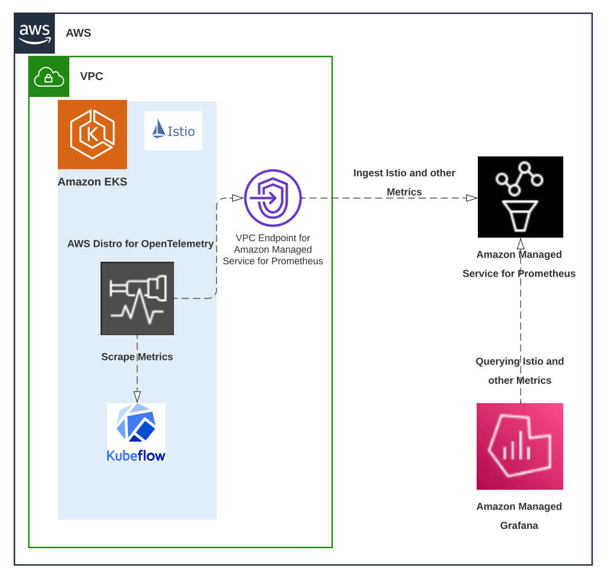
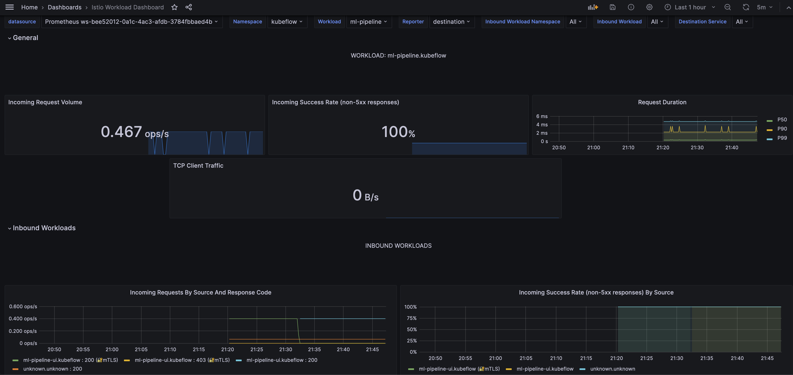
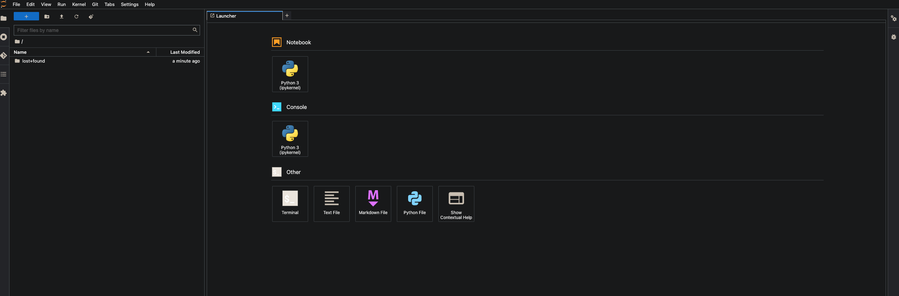
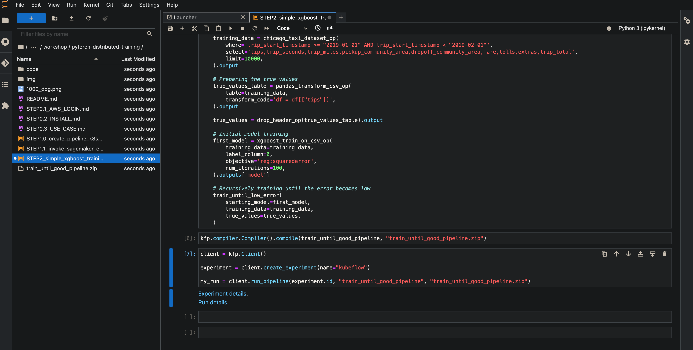
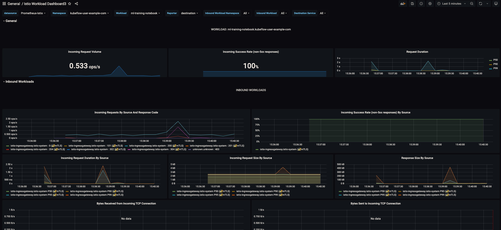

import CollapsibleContent from '../../../src/components/CollapsibleContent';

# Monitor Machine Learning workflows with Kubeflow on Amazon EKS

As part of day 2 operations, customers want to monitor their Infrastructure, Amazon EKS clusters and application components. AWS customers use Amazon EKS to run machine learning workloads. Containerization allows machine learning engineers to package and distribute models easily, while Kubernetes helps in deploying, scaling, and improving. In addition to monitoring the behavior of the Amazon EKS clusters, it’s essential to monitor the behavior of machine learning workflows as well to ensure the operational resilience of workloads and platforms run by an organization.

[Kubeflow](https://www.kubeflow.org/) is the open-source machine learning (ML) platform dedicated to making deployments of machine learning (ML) workflows on Kubernetes simple, portable and scalable. Kubeflow provides many components, including a central dashboard, multi-user Jupyter notebooks, Kubeflow Pipelines, KFServing, and Katib, as well as distributed training operators for [TensorFlow](https://www.tensorflow.org/), [PyTorch](https://pytorch.org/), [MXNet](https://mxnet.apache.org/versions/1.9.1/), and [XGBoost](https://xgboost.readthedocs.io/en/stable/). Kubeflow components export metrics which provides insights into the health and function of Kubeflow on [Amazon Elastic Kubernetes Service (EKS)](https://aws.amazon.com/eks/).

[OpenTelemetry](https://opentelemetry.io/docs/concepts/what-is-opentelemetry/) is a set of APIs, SDKs, and tools that are designed for the creation and management of telemetry data such as traces, metrics, and logs. [AWS Distro for OpenTelemetry Collector (ADOT Collector)](https://github.com/aws-observability/aws-otel-collector) is an AWS-supported version of the upstream OpenTelemetry Collector that is fully compatible with AWS computing platforms, including EKS. It enables users to send telemetry data to AWS managed services such as Amazon CloudWatch, Amazon Managed Service for Prometheus, and AWS X-Ray. In this post, We’ll show how you can configure an [Amazon Elastic Kubernetes Service (Amazon EKS)](https://aws.amazon.com/eks/) cluster with Kubeflow, [Amazon Managed Service for Prometheus](https://aws.amazon.com/prometheus/), and[Amazon Managed Grafana](https://aws.amazon.com/grafana/) using [AWS Distro for OpenTelemetry (ADOT)](https://aws-otel.github.io/docs/introduction) for monitoring your Kubeflow machine learning workflows.

## **Architecture**

The following diagram shows the complete setup that we will walk through in this walk through:



## Solution Walkthrough

### Prerequisites

You will need the following to complete the steps in this post:

* An [Ubuntu development environment](https://awslabs.github.io/kubeflow-manifests/docs/deployment/prerequisites/) with access to an AWS environment
* Install [awscurl](https://github.com/okigan/awscurl) which is a curl-like tool with AWS Signature Version 4 request signing on your environment

First, Let’s start by setting a few environment variables:

```bash
export KFL_EKS_CLUSTER=KFL-EKS-CLUSTER
export KFL_EKS_CLUSTER_V=1.25
export KFL_ACCOUNT_ID=$(aws sts get-caller-identity --query 'Account' --output text)
export KFL_AWS_REGION=us-west-2 # Your AWS Region
export AWS_REGION=us-west-2 # Your AWS Region
export KFL_AMP_WORKSPACE_NAME=kubeflow-amp-workshop
export CLUSTER_NAME=KFL-EKS-CLUSTER
export CLUSTER_REGION=us-west-2
export KUBEFLOW_RELEASE_VERSION=v1.7.0
export AWS_RELEASE_VERSION=v1.7.0-aws-b1.0.1
```

Next, let's start with installing prerequisites such as [AWS CLI version 2](https://docs.aws.amazon.com/cli/latest/userguide/install-cliv2.html), [eksctl](https://eksctl.io/introduction/#installation), [kubectl](https://docs.aws.amazon.com/eks/latest/userguide/install-kubectl.html), [python3.8](https://www.python.org/downloads/release/python-389/), [yq](https://mikefarah.gitbook.io/yq/), [jq](https://stedolan.github.io/jq/download/), [awscurl,](https://github.com/okigan/awscurl)[kustomize version 5+](https://kubectl.docs.kubernetes.io/installation/kustomize/) required to run the demonstration. Clone the `awslabs/kubeflow-manifests` [repo](https://github.com/awslabs/kubeflow-manifests) and checkout a release. Substitute the value for `AWS_RELEASE_VERSION` with `v1.7.0-aws-b1.0.1` and run the following command. Read more about [releases and versioning](https://github.com/awslabs/kubeflow-manifests/blob/v1.3-branch/distributions/aws/examples/README.md#releases-and-versioning) policy to determine the right version for you for installing Kubeflow.

```bash
git clone https://github.com/awslabs/kubeflow-manifests.git && cd kubeflow-manifests
git checkout ${AWS_RELEASE_VERSION}
git clone --branch ${KUBEFLOW_RELEASE_VERSION} https://github.com/kubeflow/manifests.git upstream
`make install``-``tools`
```

### Create an EKS Cluster

Let’s create an Amazon EKS cluster using `eksctl`:

```bash
## eksctl Cluster creation command for EKS cluster.
eksctl create cluster \
  --name $KFL_EKS_CLUSTER \
  --version $KFL_EKS_CLUSTER_V \
  --region $KFL_AWS_REGION \
  --nodegroup-name linux-nodes \
  --node-type m5.xlarge \
  --nodes 5 \
  --nodes-min 1 \
  --nodes-max 10 \
  --managed \
  --with-oidc
```

### Installing **Amazon Elastic Block Store (EBS) Container Storage Interface Driver**

A [Container Storage Interface (CSI) driver](https://kubernetes.io/blog/2019/01/15/container-storage-interface-ga/) is needed in order to get your `PersisentVolumeClaims` served by a `PersistentVolume`. Please run the following commands to create Amazon EBS CSI driver IAM role and add EBS CSI add-on :

```bash
eksctl create iamserviceaccount \
  --name ebs-csi-controller-sa \
  --namespace kube-system \
  --cluster $KFL_EKS_CLUSTER \
  --attach-policy-arn arn:aws:iam::aws:policy/service-role/AmazonEBSCSIDriverPolicy \
  --approve \
  --role-only \
  --role-name AmazonEKS_EBS_CSI_DriverRole

eksctl create addon \
    --name aws-ebs-csi-driver \
    --cluster $KFL_EKS_CLUSTER \
    --service-account-role-arn arn:aws:iam::$(aws sts get-caller-identity --query Account --output text):role/AmazonEKS_EBS_CSI_DriverRole \
    --force
```

### Installing Kubeflow

You can install all Kubeflow official components (residing under `apps`) and all common services (residing under `common`) using the following command:

```bash
make deploy-kubeflow INSTALLATION_OPTION=kustomize DEPLOYMENT_OPTION=vanilla
```

It takes around 5 minutes for all components to get installed. Once everything is installed successfully, you can access the Kubeflow Central Dashboard. [Kubeflow on AWS](https://awslabs.github.io/kubeflow-manifests/) page has more information for learning open source distribution of [Kubeflow](https://www.kubeflow.org/)  on AWS.

After installation, it will take some time for all Pods to become ready. Make sure all Pods are ready before trying to connect, otherwise you might get unexpected errors. To check that all Kubeflow-related Pods are ready, use the following command:

```bash
kubectl get pods -A -o json | jq -r '.items[] | select(.metadata.namespace=="cert-manager" or "istio-system" or "auth" or "knative-eventing" or "knative-serving" or "kubeflow" or "kubeflow-user-example-com") | .metadata.namespace + "|" + .metadata.name + "|" + .status.phase'
```

### Accessing Kubeflow Central Dashboard

Kubeflow can be accessed via port-forward and this enables you to get started quickly without imposing any requirements on your environment. Run the following to port-forward Istio's Ingress-Gateway to local port `8080`:

```bash
kubectl port-forward svc/istio-ingressgateway -n istio-system 8080:80
```

After running the command, you can access the Kubeflow Central Dashboard by doing the following:

1. Dex is an OpenID Connect Identity (OIDC) with multiple authentication backends. Open your browser and visit `http://localhost:8080` and You should get the Dex login screen.
2. Login with the default user's credential. The default email address is `user@example.com` and the default password is `12341234`.


### Setup Amazon Managed Service for Prometheus

A workspace in [Amazon Managed Service for Prometheus](https://aws.amazon.com/prometheus/) is a logical and isolated Prometheus server dedicated to Prometheus resources such as metrics. A workspace supports fine-grained access control for authorizing its management such as update, list, describe, delete, and the ingestion and querying of metrics.

Please open a new terminal window and setup all environment variables as you did in start of the demonstration. Please use the below command to create an Amazon Managed Service for Prometheus workspace.

```bash
aws amp create-workspace \
  --alias $KFL_AMP_WORKSPACE_NAME \
  --region $KFL_AWS_REGION
```

The Amazon Managed Service for Prometheus  workspace should be created in just a few seconds.

As a best practice, create a [VPC endpoint](https://docs.aws.amazon.com/vpc/latest/privatelink/create-interface-endpoint.html)for Amazon Managed Service for Prometheus in VPC running your Amazon EKS cluster. Please visit [Using Amazon Managed Service for Prometheus with interface VPC endpoints](https://docs.aws.amazon.com/prometheus/latest/userguide/AMP-and-interface-VPC.html) for more information.

### Setting up the AWS Distro for OpenTelemetry (ADOT) Collector to Ingest Metrics

Amazon Managed Service for Prometheus does not directly scrape operational metrics from containerized workloads in a Kubernetes or ECS cluster. It requires users to deploy a collection agent such as Prometheus server or an OpenTelemetry agent such as the AWS Distro for OpenTelemetry Collector in their cluster to perform this task.

One of the easiest ways to collect Prometheus metrics from Amazon EKS workloads is by using the [AWS Distro for OpenTelemetry (ADOT) collector](https://aws-otel.github.io/docs/getting-started/collector). Customers can deploy the ADOT Collector in a variety of deployment models and easily manage configuration using the ADOT Operator. The [ADOT Operator is also available as an EKS Add-On](https://docs.aws.amazon.com/eks/latest/userguide/opentelemetry.html)for easier deployment and management. Read our [launch blog](https://aws.amazon.com/blogs/containers/metrics-and-traces-collection-using-amazon-eks-add-ons-for-aws-distro-for-opentelemetry/)to learn about this feature.

The best way to provision permissions for resources running on EKS clusters is through [IRSA](https://docs.aws.amazon.com/eks/latest/userguide/iam-roles-for-service-accounts.html). The command below will use AWS CloudFormation to create a K8s namespace called `prometheus`, create a K8s Service Account called `amp-iamproxy-ingest-role`, create a new IAM Role with the `AmazonPrometheusRemoteWriteAccess` policy attached to it. It will also create a trust policy between the EKS cluster's IAM OpenID Connect Provider (OIDC) and the created Service Account. See [this link](https://eksctl.io/usage/iamserviceaccounts/) to learn more about this command.

```bash
kubectl create namespace prometheus
eksctl create iamserviceaccount \
  --name amp-iamproxy-ingest-role \
  --namespace prometheus \
  --cluster $KFL_EKS_CLUSTER \
  --attach-policy-arn arn:aws:iam::aws:policy/AmazonPrometheusRemoteWriteAccess \
  --approve \--override-existing-serviceaccounts
```

Next, we will grant permissions to Amazon EKS add-ons to install ADOT and then we will installing the ADOT Add-on :

```bash
kubectl apply -f https://amazon-eks.s3.amazonaws.com/docs/addons-otel-permissions.yaml
aws eks create-addon \
  --addon-name adot \
  --cluster-name $KFL_EKS_CLUSTER
```

Now, wait for 30 seconds and execute the following command. You should see `"ACTIVE"` as result indicating that the add-on is installed successfully.

```bash
aws eks describe-addon \
  --addon-name adot \
  --cluster-name $KFL_EKS_CLUSTER  | jq .addon.status
```

Next, we will Install the OTel Collector Custom Resource Definition(CRD) and then we will configure the ADOT collector to push metrics to Amazon Managed Service for Prometheus endpoint.

```bash
KFL_WORKSPACE_ID=$(aws amp list-workspaces \
  --alias $KFL_AMP_WORKSPACE_NAME \
  --region=${KFL_AWS_REGION} \
  --query 'workspaces[0].[workspaceId]' \
  --output text)
KFL_AMP_ENDPOINT_URL=$(aws amp describe-workspace \
  --workspace-id $KFL_WORKSPACE_ID | jq .workspace.prometheusEndpoint -r)
KFL_AMP_REMOTE_WRITE_URL=${KFL_AMP_ENDPOINT_URL}api/v1/remote_write
curl -O https://raw.githubusercontent.com/aws-samples/one-observability-demo/main/PetAdoptions/cdk/pet_stack/resources/otel-collector-prometheus.yaml
sed -i -e s/AWS_REGION/$KFL_AWS_REGION/g otel-collector-prometheus.yaml
sed -i -e s^AMP_WORKSPACE_URL^$KFL_AMP_REMOTE_WRITE_URL^g otel-collector-prometheus.yaml
kubectl apply -f ./otel-collector-prometheus.yaml
```

Now, lets verify that the ADOT collector is running and you should see a result like the one below showing that the collector has been successfully installed and being ready.

```bash
kubectl get all -n prometheus
```

```
NAME                                           READY   STATUS    RESTARTS   AGEpod/observability-collector-5774bbc68d-7nj54   1/1     Running   0          59s

NAME                                         TYPE        CLUSTER-IP     EXTERNAL-IP   PORT(S)    AGE
service/observability-collector-monitoring   ClusterIP   10.100.114.1   <none>        8888/TCP   59s

NAME                                      READY   UP-TO-DATE   AVAILABLE   AGE
deployment.apps/observability-collector   1/1     1            1           59s

NAME                                                 DESIRED   CURRENT   READY   AGE
replicaset.apps/observability-collector-5774bbc68d   1         1         1       59s
```

Now you have successfully deployed the ADOT Collector to collect metrics from the EKS cluster and send it to the Amazon Managed Service for Prometheus workspace you created. To test whether Amazon Managed Service for Prometheus received the metrics, use `awscurl`. This tool enables you to send HTTP requests through the command line with AWS Sigv4 authentication, so you must have AWS credentials set up locally with the correct permissions to query from Amazon Managed Service for Prometheus. For instructions on installing awscurl, see [awscurl](https://github.com/okigan/awscurl).

```bash
awscurl --service="aps" \
 --region="$KFL_AWS_REGION" "https://aps-workspaces.$KFL_AWS_REGION.amazonaws.com/workspaces/$KFL_WORKSPACE_ID/api/v1/query?query=istio_requests_total"
```

Your results should look similar to shown below:

```
{
    "status": "success",
    "data": {
        "resultType": "vector",
        "result": [
            {
                "metric": {
                    "__name__": "istio_requests_total",
                    "app": "istio-ingressgateway",
                    "chart": "gateways",
                    ....................................
                    ....................................
                    "version": "v1"
                },
                "value": [
                    1647974689.212,
                    "1"
                ]
            }
        ]
    }
}
```

### Amazon Managed Grafana Setup

Two steps are necessary for setting up AWS IAM Identity Center, setting up and logging in to Amazon Managed Grafana, and querying metrics from Amazon Managed Service for Prometheus workspace from the post. To set up Authentication and Authorization, follow the instructions in the [Amazon Managed Grafana User Guide](https://docs.aws.amazon.com/grafana/latest/userguide/AMG-manage-users-and-groups-AMG.html) for enabling AWS IAM Identity Center. Second, setup the data source for [Amazon Managed Service for Prometheus](https://docs.aws.amazon.com/grafana/latest/userguide/AMP-adding-AWS-config.html). You may also reference [Monitor Istio on EKS using Amazon Managed Prometheus and Amazon Managed Grafana](https://aws.amazon.com/blogs/mt/monitor-istio-on-eks-using-amazon-managed-prometheus-and-amazon-managed-grafana/#:~:text=AWS%20Single%20Sign%2DOn%20(SSO)) blog, starting from the AWS Single Sign-On (SSO) section for Amazon Managed Grafana setup.

### Query Kubeflow Metrics

Next lets navigate to Amazon Managed Grafana console and import Grafana dashboards which allows us to visualize metrics from Istio environment. Go to the `plus` sign on the left navigation bar and select `Import` as shown below:


In the Import screen, type `7630 (Istio Workload Dashboard)` in `Import via grafana.com` textbox and click `Load. `Select the Prometheus data source in the drop down at the bottom and click on `Import`. Once complete, you will be able to see the Grafana dashboard showing metrics from the `Istio Workload Dashboard` through Prometheus data source as shown below:



### Creating a sample Machine Learning pipeline in Kubeflow

Now that we have configured Amazon Managed Grafana with the Prometheus data source within our cluster, we can initiate a Machine Learning pipeline in Kubeflow, and be able to display metrics on the Grafana dashboards.

Before we create the notebook to use Kubeflow Pipelines SDK, we have to supply a token so that the notebook can authenticate with the Kubeflow Pipelines API. To do so, run the following command to create a Pod to mount a token volume:

```yaml
cat <<EOF | kubectl apply -f -
apiVersion: kubeflow.org/v1alpha1
kind: PodDefault
metadata:
  name: access-ml-pipeline
  namespace: kubeflow-user-example-com
spec:
  desc: Allow access to Kubeflow Pipelines
  selector:
    matchLabels:
      access-ml-pipeline: "true"
  volumes:
    - name: volume-kf-pipeline-token
      projected:
        sources:
          - serviceAccountToken:
              path: token
              expirationSeconds: 7200
              audience: pipelines.kubeflow.org
  volumeMounts:
    - mountPath: /var/run/secrets/kubeflow/pipelines
      name: volume-kf-pipeline-token
      readOnly: true
  env:
    - name: KF_PIPELINES_SA_TOKEN_PATH
      value: /var/run/secrets/kubeflow/pipelines/token
EOF
```

Now, access Kubeflow dashboard as described in the previous sections, via port-forwarding. Select `Notebooks`, and create a new CPU-based notebook, using the following configurations:

* name: `ml-training-notebook`
* docker image: `kubeflow-on-aws/notebook-servers/jupyter-pytorch:2.0.0-cpu-py310-ubuntu20.04-ec2-v1.0`
* Requested CPUs: `1`
* Requested memory in Gi: `5`
* Advanced Options → Configurations: `Allow access to Kubeflow Pipelines`  (This configuration is the token we have generated above)

With all other configurations as defaults, you should be able to see the notebook generate successfully and show up on the Kubeflow dashboard.


You can also verify that the notebook is created by verifying the Kubernetes resources being created:

```bash
kubectl get pods -n kubeflow-user-example-com --field-selector=status.phase==Running
```

```
NAME                                               READY   STATUS     RESTARTS   AGE
ml-pipeline-ui-artifact-5b7794c7b5-5hkqf           2/2     Running   0          100m
ml-pipeline-visualizationserver-85c6d6cc9f-vs24x   2/2     Running   0          100m
ml-training-notebook-0                             2/2     Running   0          11m
```

You will be able to access the JupyterLab notebook by clicking CONNECT. This will open up a new JupyterLab window:




We will run a simple pipeline training notebook that uses Kubeflow Pipelines, from an existing [AWS Deep Learning sample repository](https://github.com/aws-samples/aws-deeplearning-labs). This is a simple model training to predict the taxi fare of Chicago cabs, and demonstrates continuous training using a recursive loop. It triggers a Kubeflow pipeline to train the initial model and then gradually trains the model until evaluation metrics are good enough. Lets run the Kubeflow pipeline using the following steps on the console :

* Clone the following repo by selecting `Git -> Clone a Repository` from the top navigation bar and paste `https://github.com/aws-samples/aws-deeplearning-labs` and press enter.
* Open the following notebook from the directory view in the left pane: `aws-deeplearning-labs/workshop/pytorch-distributed-training/STEP2_simple_xgboost_training_pipeline.ipynb`.
* Run all the cells of the model by selecting `Kernel -> Restart Kernel and Run All Cells` from the top menu



### Visualizing Machine Learning pipeline metrics on Amazon Managed Grafana

Using the Amazon Managed Grafana, we can show the resource utilization from our Machine Learning Pipelines with the same method we used to look above: using the `Istio Workload Dashboard` (7630). Select the following to monitor your resources for this particular ML pipeline:

* Datasource: `your prometheus workspace name`
* Namespace: `kubeflow-user-example-com`
* Workload: `ml-training-notebook`



### Alerting Kubeflow workflows with Amazon Managed Grafana

As we configure workflows with Kubeflow, alerting is a mechanism we can employ to alert on specific situations. By quickly identifying unintended changes in your workflow and notifying the same using alerts, you can take actions to minimize disruptions to your services. Amazon Managed Grafana supports multiple notification channels such as SNS, Slack, PagerDuty etc to which you can send alerts notifications. [Alerts](https://docs.aws.amazon.com/grafana/latest/userguide/alerts-overview.html) page will show you more information on how to setup alerts in Amazon Managed Grafana. You learn about setting up alerts from Amazon Managed Grafana to [Slack](https://slack.com/) from  our [Monitoring hybrid environments using Amazon Managed Grafana](https://aws.amazon.com/blogs/mt/monitoring-hybrid-environments-using-amazon-managed-service-for-grafana/) blog. Also check our Blog on [Monitor Istio on EKS using Amazon Managed Prometheus and Amazon Managed Grafana](https://aws.amazon.com/blogs/mt/monitor-istio-on-eks-using-amazon-managed-prometheus-and-amazon-managed-grafana/) which will show you on triggering Amazon Managed Grafana alerts to [PagerDuty](https://www.pagerduty.com/).

## Clean-up

Use the following commands to clean up the created AWS resources for this demonstration:

```bash
# Clean up ADOT Collector and Prometheus.
kubectl delete -f https://amazon-eks.s3.amazonaws.com/docs/addons-otel-permissions.yaml
kubectl delete -f ./otel-collector-prometheus.yaml
rm -rf ./otel-collector-prometheus.yaml

aws eks delete-addon \
    --addon-name adot \
    --cluster-name $KFL_EKS_CLUSTER

aws amp delete-workspace \
  --workspace-id $KFL_WORKSPACE_ID \
  --region $KFL_AWS_REGION

eksctl delete iamserviceaccount \
  --name amp-iamproxy-ingest-role \
  --namespace prometheus \
  --cluster $KFL_EKS_CLUSTER

kubectl delete namespace prometheus

# Cleaning up kubeflow installation components
make delete-kubeflow INSTALLATION_OPTION=kustomize DEPLOYMENT_OPTION=vanilla
cd ..
rm -rf kubeflow-manifests

eksctl delete iamserviceaccount \
  --name ebs-csi-controller-sa \
  --namespace kube-system \
  --cluster $KFL_EKS_CLUSTER

aws eks delete-addon \
    --addon-name aws-ebs-csi-driver \
    --cluster-name $KFL_EKS_CLUSTER

# Cleaning up Amazon EKS Cluster.
eksctl delete cluster --region $AWS_REGION --name $KFL_EKS_CLUSTER
```

Finally navigate to Amazon Managed Grafana console to delete the created Grafana workspace.

## Conclusion

This post demonstrated the detailed steps on how you can setup Amazon EKS cluster with Kubeflow, Amazon Managed Service for Prometheus and Amazon Managed Grafana to monitor your Kubeflow machine learning workflows.  

It is also important to have a centralized incident management process to keep systems running smoothly. You can view more details on alerting in and various supported providers at [alert notifications](https://docs.aws.amazon.com/grafana/latest/userguide/alert-notifications.html) for Amazon Managed Grafana. You can also check out previous blogs posts [Amazon Managed Service for Prometheus Alert Manager to receive alerts with PagerDuty](https://aws.amazon.com/blogs/mt/using-amazon-managed-service-for-prometheus-alert-manager-to-receive-alerts-with-pagerduty/) and [how to integrate Amazon Managed Service for Prometheus with Slack](https://aws.amazon.com/blogs/mt/how-to-integrate-amazon-managed-service-for-prometheus-with-slack/) to see how you can setup alerting with Amazon Managed Service for Prometheus.

For further reading on Kubeflow deployment and monitoring on Amazon EKS, check out [Build and deploy a scalable machine learning system on Kubernetes with Kubeflow on AWS](https://aws.amazon.com/blogs/machine-learning/build-and-deploy-a-scalable-machine-learning-system-on-kubernetes-with-kubeflow-on-aws/) and [CloudWatch add-on for Kubeflow.](https://awslabs.github.io/kubeflow-manifests/docs/deployment/add-ons/cloudwatch/guide/).
