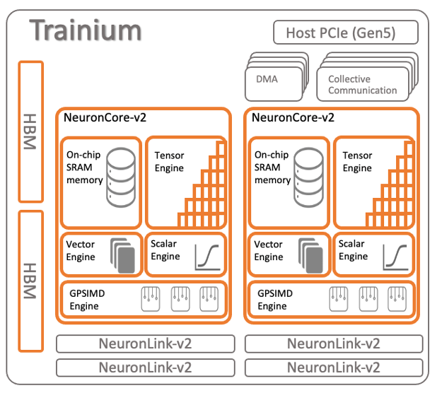
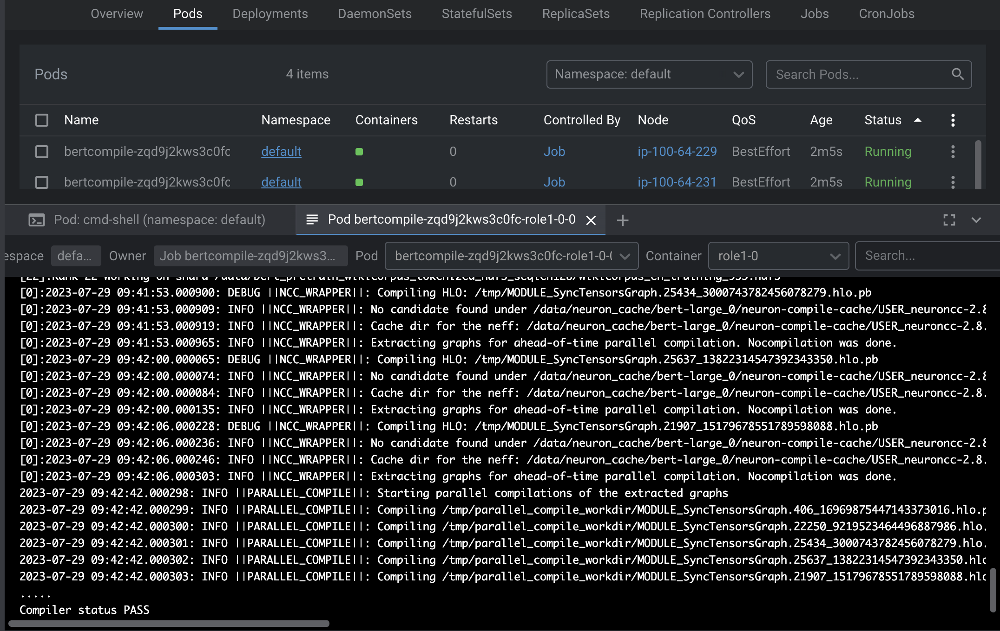
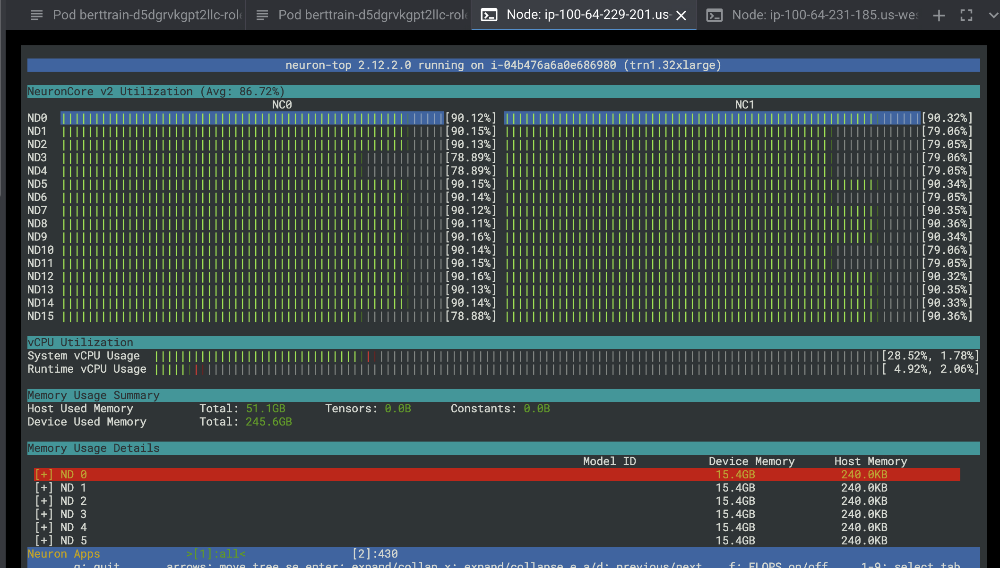

import CollapsibleContent from '../../../src/components/CollapsibleContent';

:::caution

The **AI on EKS** content **is being migrated** to a new repository.
🔗 👉 [Read the full migration announcement »](https://awslabs.github.io/data-on-eks/docs/migration/migration-announcement)

:::

:::warning
Deployment of ML models on EKS requires access to GPUs or Neuron instances. If your deployment isn't working, it’s often due to missing access to these resources. Also, some deployment patterns rely on Karpenter autoscaling and static node groups; if nodes aren't initializing, check the logs for Karpenter or Node groups to resolve the issue.
:::


# AWS Trainium on EKS
[AWS Trainium](https://aws.amazon.com/machine-learning/trainium/) is an advanced ML accelerator that transforms high-performance deep learning(DL) training. `Trn1` instances, powered by AWS Trainium chips, are purpose-built for high-performance DL training of **100B+ parameter** models. Meticulously designed for exceptional performance, Trn1 instances cater specifically to training popular Natual Language Processing(NLP) models on AWS, offering up to  **50% cost savings ** compared to GPU-based EC2 instances. This cost efficiency makes them an attractive option for data scientists and ML practitioners seeking optimized training costs without compromising performance.

At the core of Trn1 instance's capabilities lies the [AWS Neuron SDK](https://awsdocs-neuron.readthedocs-hosted.com/en/latest/), a software development kit seamlessly integrated with leading ML frameworks and libraries, such as [PyTorch](https://pytorch.org/), [TensorFlow](https://tensorflow.org/), [Megatron-LM](https://huggingface.co/docs/accelerate/usage_guides/megatron_lm), and [Hugging Face](https://huggingface.co/). The Neuron SDK empowers developers to train NLP, computer vision, and recommender models on Trainium with ease, requiring only a few lines of code changes.

In this blueprint, we will learn how to securely deploy an [Amazon EKS Cluster](https://docs.aws.amazon.com/eks/latest/userguide/clusters.html) with Trainium Node groups (`Trn1.32xlarge` and `Trn1n.32xlarge`) and all the required plugins(EFA Package for EC2, Neuron Device K8s Plugin and EFA K8s plugin). Once the deployment is complete, we will learn how to train a BERT-large(Bidirectional Encoder Representations from Transformers) model  with Distributed PyTorch pre-training using the WikiCorpus dataset. For scheduling the distributed training job, we will utilize [TorchX](https://pytorch.org/torchx/latest/) with the [Volcano Scheduler](https://volcano.sh/en/). Additionally, we can monitor the neuron activity during training using `neuron-top`.

#### Trianium Device Architecture
Each Trainium device (chip) comprises two neuron cores. In the case of `Trn1.32xlarge` instances, `16 Trainium devices` are combined, resulting in a total of `32 Neuron cores`. The diagram below provides a visual representation of the Neuron device's architecture:



#### AWS Neuron Drivers
Neuron Drivers are a set of essential software components installed on the host operating system of AWS Inferentia-based accelerators, such as Trainium/Inferentia instances. Their primary function is to optimize the interaction between the accelerator hardware and the underlying operating system, ensuring seamless communication and efficient utilization of the accelerator's computational capabilities.

#### AWS Neuron Runtime
Neuron runtime consists of kernel driver and C/C++ libraries which provides APIs to access Inferentia and Trainium Neuron devices. The Neuron ML frameworks plugins for TensorFlow, PyTorch and Apache MXNet use the Neuron runtime to load and run models on the NeuronCores.

#### AWS Neuron Device Plugin for Kubernetes
The AWS Neuron Device Plugin for Kubernetes is a component that promotes Trainium/Inferentia devices as system hardware resources within the EKS cluster. It is deployed as a [DaemonSet](https://kubernetes.io/docs/concepts/workloads/controllers/daemonset/), ensuring proper permissions for the device plugin to update the Node and Pod annotations, thereby seamlessly integrating Inferentia devices with Kubernetes pods.

#### FSx for Lustre
In this blueprint, we utilize TorchX to initiate a DataParallel BERT phase1 pretraining task, employing 64 workers distributed across 2 trn1.32xlarge (or trn1n.32xlarge) instances, with 32 workers per instance. The BERT phase1 pretraining process involves a substantial 50+ GB WikiCorpus dataset as the training data. To handle large datasets efficiently, including the dataset inside the training container image or downloading it at the start of each job is not practical. Instead, we leverage shared file system storage to ensure multiple compute instances can process the training datasets concurrently.

For this purpose, FSx for Lustre emerges as an ideal solution for machine learning workloads. It provides shared file system storage that can process massive data sets at up to hundreds of gigabytes per second of throughput, millions of IOPS, and sub-millisecond latencies. We can dynamically create FSx for Lustre and attach the file system to the Pods using the FSx CSI controller through Persistent Volume Claims(PVC), enabling seamless integration of shared file storage with the distributed training process.

#### TorchX
[TorchX](https://pytorch.org/torchx/main/quickstart.html) SDK or CLI provides the functionality to effortlessly submit PyTorch jobs to Kubernetes. It offers the capability to connect predefined components like hyperparameter optimization, model serving, and distributed data-parallel into sophisticated pipelines, while leveraging popular job schedulers like Slurm, Ray, AWS Batch, Kubeflow Pipelines, and Airflow.

The TorchX Kubernetes scheduler relies on the [Volcano Scheduler](https://volcano.sh/en/docs/), which must be installed on the Kubernetes cluster. Gang scheduling is essential for multi-replica/multi-role execution, and currently, Volcano is the only supported scheduler within Kubernetes that meets this requirement.

TorchX can seamlessly integrate with Airflow and Kubeflow Pipelines. In this blueprint, we will install the TorchX CLI on a local machine/cloud9 ide and use it to trigger job submission on the EKS cluster, which, in turn, submits jobs to the Volcano scheduler queue running on the EKS Cluster.

#### Volcano Scheduler
[Volcano Scheduler](https://volcano.sh/en/docs/) is a custom Kubernetes batch scheduler designed to efficiently manage diverse workloads, making it particularly well-suited for resource-intensive tasks like machine learning. Volcano Queue serves as a collection of PodGroups, adopting a FIFO (First-In-First-Out) approach and forming the basis for resource allocation. VolcanoJob, also known as `vcjob`, is a Custom Resource Definition (CRD) object specifically tailored for Volcano. It stands out from a regular Kubernetes job by offering advanced features, including a specified scheduler, minimum member requirements, task definitions, lifecycle management, specific queue assignment, and priority settings. VolcanoJob is ideally suited for high-performance computing scenarios, such as machine learning, big data applications, and scientific computing.

### Solution Architecture


<CollapsibleContent header={<h2><span>Deploying the Solution</span></h2>}>

:::warning
Before deploying this blueprint, it is important to be cognizant of the costs associated with the utilization of AWS Trainium Instances. The blueprint sets up two `Trn1.32xlarge` instances for pre-training the dataset. Be sure to assess and plan for these costs accordingly.
:::

In this [example](https://github.com/awslabs/data-on-eks/tree/main/ai-ml/trainium), you will provision the following resources.

 - Create a new sample VPC, including 2 Private Subnets and 2 Public Subnets.
 - Set up an Internet gateway for the Public Subnets and a NAT Gateway for the Private Subnets.
 - Deploy the EKS Cluster Control plane with a public endpoint (for demo purposes only) and a core managed node group. Also, set up two additional node groups: `trn1-32xl-ng1` with 2 instances and `trn1n-32xl-ng` with 0 instances.
 - Install the EFA package during the bootstrap setup for the trn1-32xl-ng1 node group, and configure 8 Elastic Network Interfaces (ENIs) with EFA on each instance.
 - Use the EKS GPU AMI for the Trainium node groups, which includes Neuron drivers and runtime.
 - Deploy essential add-ons such as Metrics server, Cluster Autoscaler, Karpenter, Grafana, AMP, and Prometheus server.
 - Enable FSx for Lustre CSI driver to allow for Dynamic Persistent Volume Claim (PVC) creation for shared filesystems.
 - Set up the Volcano Scheduler for PyTorch job submission, allowing for efficient task scheduling on Kubernetes.
 - Prepare the necessary etcd setup as a prerequisite for TorchX.
 - Create a test queue within Volcano to enable TorchX job submission to this specific queue.

:::info
**Important**: In this setup, Karpenter is utilized exclusively for `inferentia-inf2` instances, due to its current limitations in custom networking interfaces configuration. For Trainium instances, managed node groups and the Cluster Autoscaler are employed for scaling purposes. For users working with an older version of Karpenter (specifically, the `v1alpha5` APIs), please note that the configuration for Trainium with `LaunchTemplates` is still accessible. It can be found in the `data-on-eks/ai-ml/trainium-inferentia/addons.tf` file, although it is commented out at the file's end.
:::

### Prerequisites

Ensure that you have installed the following tools on your machine.

1. [aws cli](https://docs.aws.amazon.com/cli/latest/userguide/install-cliv2.html)
2. [kubectl](https://Kubernetes.io/docs/tasks/tools/)
3. [terraform](https://learn.hashicorp.com/tutorials/terraform/install-cli)

### Deploy

Clone the repository

```bash
git clone https://github.com/awslabs/data-on-eks.git
```

Navigate into one of the example directories and run `install.sh` script

```bash
export TF_VAR_enable_fsx_for_lustre=true
export TF_VAR_enable_torchx_etcd=true
export TF_VAR_enable_volcano=true

cd data-on-eks/ai-ml/trainium-inferentia/ && chmod +x install.sh
./install.sh
```

### Verify the resources

Verify the Amazon EKS Cluster

```bash
aws eks describe-cluster --name trainium-inferentia
```

```bash
# Creates k8s config file to authenticate with EKS
aws eks --region us-west-2 update-kubeconfig --name trainium-inferentia

kubectl get nodes # Output shows the EKS Managed Node group nodes

```

</CollapsibleContent>

### Observability with AWS CloudWatch and Neuron Monitor

This blueprint deploys the CloudWatch Observability Agent as a managed add-on, providing comprehensive monitoring for containerized workloads. It includes container insights for tracking key performance metrics such as CPU and memory utilization. Additionally, the blueprint integrates GPU metrics using NVIDIA's DCGM plugin, which is essential for monitoring high-performance GPU workloads. For machine learning models running on AWS Inferentia or Trainium, the [Neuron Monitor plugin](https://awsdocs-neuron.readthedocs-hosted.com/en/latest/tools/neuron-sys-tools/neuron-monitor-user-guide.html#neuron-monitor-user-guide) is added to capture and report Neuron-specific metrics.

All metrics, including container insights, GPU performance, and Neuron metrics, are sent to Amazon CloudWatch, where you can monitor and analyze them in real-time. After the deployment is complete, you should be able to access these metrics directly from the CloudWatch console, allowing you to manage and optimize your workloads effectively.

### Distributed PyTorch Training on Trainium with TorchX and EKS

In this example, we will perform DataParallel-based phase1 pretraining on the BERT-large model using the WikiCorpus dataset. To execute the task, we will use TorchX to initiate the job on two `trn1.32xlarge` instances, with 32 workers per instance. You can also run the same job on `trn1n.32xlarge` node group.

We have created three Shell scripts to automate the job execution as much as possible.

#### Step1: Create a Docker image  for PyTorch Neuron container for BERT-large model pre-training

This step creates a new Docker image and push this image to ECR repo. The Dockerfile handles the installation of necessary software packages, such as AWS Neuron repos, Python dependencies, and other essential tools for PyTorch and BERT pre-training. It configures various environment variables to ensure smooth execution and optimal performance. The image contains crucial components like a BERT pretraining script and requirements.txt file sourced from GitHub, both vital for the BERT pretraining process. Furthermore, it includes a basic environment test script for validation purposes. Together, this Docker image provides a comprehensive environment for efficient BERT pre-training with PyTorch while incorporating AWS Neuron optimizations.

:::caution
This step generates an AMD64 (x86-64) Docker image with a size of 7GB or more. Therefore, it is strongly advised to utilize an AWS Cloud9/EC2 AMD64 (x86-64) instance with Docker client installed, ensuring sufficient storage capacity for this process.
:::

:::caution
If you are executing this script on a Cloud9 IDE/EC2 instance different from the one where the EKS Cluster is deployed, it is essential to ensure that the same IAM role is used or attached to the Cloud9 IDE/EC2 instance. Should you prefer a distinct IAM role for Cloud9 IDE/EC2, it must be added to the EKS Cluster's aws-auth config map to grant the role authorization for authenticating with the EKS Cluster. Taking these precautions will enable smooth communication between the instances and the EKS Cluster, ensuring the script functions as intended.
:::

```bash
cd ai-ml/trainium-inferentia/examples/dp-bert-large-pretrain
chmod +x 1-bert-pretrain-build-image.sh
./1-bert-pretrain-build-image.sh
```

```
Admin:~/environment/data-on-eks/ai-ml/trainium-inferentia/examples/dp-bert-large-pretrain (trainium-part2) $ ./1-bert-pretrain-build-image.sh
Did you install docker on AMD64(x86-64) machine (y/n): y
Enter the ECR region: us-west-2
ECR repository 'eks_torchx_test' already exists.
Repository URL: <YOUR_ACCOUNT_ID>.dkr.ecr.us-west-2.amazonaws.com/eks_torchx_test
Building and Tagging Docker image... <YOUR_ACCOUNT_ID>.dkr.ecr.us-west-2.amazonaws.com/eks_torchx_test:bert_pretrain
[+] Building 2.4s (26/26) FINISHED
 => [internal] load build definition from Dockerfile.bert_pretrain                                                                                                                   0.0s
 => => transferring dockerfile: 5.15kB                                                                                                                                               0.0s
 => [internal] load .dockerignore                                                                                                                                                    0.0s
 => => transferring context: 2B                                                                                                                                                      0.0s
 => [internal] load metadata for docker.io/library/ubuntu:20.04                                                                                                                      0.7s
 => [ 1/22] FROM docker.io/library/ubuntu:20.04@sha256:c9820a44b950956a790c354700c1166a7ec648bc0d215fa438d3a339812f1d01                                                              0.0s
 ...
bert_pretrain: digest: sha256:1bacd5233d1a87ca1d88273c5a7cb131073c6f390f03198a91dc563158485941 size: 4729
```

Login to AWS Console and verify the ECR repo(`<YOUR_ACCOUNT_ID>.dkr.ecr.<REGION>.amazonaws.com/eks_torchx_test`) and the image tag(`bert_pretrain`) in ECR.

#### Step2: Copy WikiCorpus pre-training dataset for BERT model to FSx for Lustre filesystem

In this step, we make it easy to transfer the WikiCorpus pre-training dataset, which is crucial for training the BERT model in distributed mode by multiple Trainium instances, to the FSx for Lustre filesystem. To achieve this, we will login to `cmd-shell` pod which includes an AWS CLI container, providing access to the filesystem.

Once you're inside the container, Copy the WikiCorpus dataset from S3 bucket (`s3://neuron-s3/training_datasets/bert_pretrain_wikicorpus_tokenized_hdf5/bert_pretrain_wikicorpus_tokenized_hdf5_seqlen128.tar`). The dataset is then unpacked, giving you access to its contents, ready for use in the subsequent BERT model pre-training process.


```bash
kubectl exec -i -t -n default cmd-shell -c app -- sh -c "clear; (bash || ash || sh)"

# Once logged into the container
yum install tar
cd /data
aws s3 cp s3://neuron-s3/training_datasets/bert_pretrain_wikicorpus_tokenized_hdf5/bert_pretrain_wikicorpus_tokenized_hdf5_seqlen128.tar . --no-sign-request
chmod 744 bert_pretrain_wikicorpus_tokenized_hdf5_seqlen128.tar
tar xvf bert_pretrain_wikicorpus_tokenized_hdf5_seqlen128.tar
```

#### Step3: Precompile the BERT graphs using neuron_parallel_compile

PyTorch Neuron introduces a valuable tool known as [neuron_parallel_compile](https://awsdocs-neuron.readthedocs-hosted.com/en/latest/frameworks/torch/torch-neuronx/api-reference-guide/training/pytorch-neuron-parallel-compile.html), which significantly reduces graph compilation time by extracting model graphs and compiling them in parallel. This optimization technique expedites the process and results in faster model compilation. The compiled graphs are then stored on the Fsx for Lustre shared storage volume, accessible by worker nodes during model training. This efficient approach streamlines the training process and improves overall performance, making the most of PyTorch Neuron's capabilities.

Execute the following commands.This script prompts the user to configure their kubeconfig and verifies the presence of the `lib` folder with `trn1_dist_ddp.py`. It sets up Docker credentials, installs the **TorchX** client for Kubernetes. Using TorchX, the script runs a Kubernetes job to compile BERT graphs with optimized performance. Additionally, TorchX creates another Docker image and pushes it to the ECR repository within the same repo. This image is utilized in the subsequent pre-compiling pods, optimizing the overall BERT model training process.

```bash
cd ai-ml/trainium-inferentia/examples/dp-bert-large-pretrain
chmod +x 2-bert-pretrain-precompile.sh
./2-bert-pretrain-precompile.sh
```

You can verify the pods status by running `kubectl get pods` or `kubectl get vcjob`. Successful output looks like below.



You can also verify the logs for the Pod once they are `Succeeded`. The precompilation job will run for `~15 minutes`. Once complete, you will see the following in the output:

```
2023-07-29 09:42:42.000310: INFO ||PARALLEL_COMPILE||: Starting parallel compilations of the extracted graphs2023-07-29 09:42:42.000312: INFO ||PARALLEL_COMPILE||: Compiling /tmp/parallel_compile_workdir/MODULE_SyncTensorsGraph.406_16969875447143373016.hlo.pb using following command: neuronx-cc compile —target=trn1 —framework XLA /tmp/parallel_compile_workdir/MODULE_SyncTensorsGraph.406_16969875447143373016.hlo.pb —model-type=transformer —verbose=35 —output /tmp/parallel_compile_workdir/MODULE_SyncTensorsGraph.406_16969875447143373016.neff
2023-07-29 09:42:42.000313: INFO ||PARALLEL_COMPILE||: Compiling /tmp/parallel_compile_workdir/MODULE_SyncTensorsGraph.22250_9219523464496887986.hlo.pb using following command: neuronx-cc compile —target=trn1 —framework XLA /tmp/parallel_compile_workdir/MODULE_SyncTensorsGraph.22250_9219523464496887986.hlo.pb —model-type=transformer —verbose=35 —output /tmp/parallel_compile_workdir/MODULE_SyncTensorsGraph.22250_9219523464496887986.neff
2023-07-29 09:42:42.000314: INFO ||PARALLEL_COMPILE||: Compiling /tmp/parallel_compile_workdir/MODULE_SyncTensorsGraph.25434_3000743782456078279.hlo.pb using following command: neuronx-cc compile —target=trn1 —framework XLA /tmp/parallel_compile_workdir/MODULE_SyncTensorsGraph.25434_3000743782456078279.hlo.pb —model-type=transformer —verbose=35 —output /tmp/parallel_compile_workdir/MODULE_SyncTensorsGraph.25434_3000743782456078279.neff
2023-07-29 09:42:42.000315: INFO ||PARALLEL_COMPILE||: Compiling /tmp/parallel_compile_workdir/MODULE_SyncTensorsGraph.25637_13822314547392343350.hlo.pb using following command: neuronx-cc compile —target=trn1 —framework XLA /tmp/parallel_compile_workdir/MODULE_SyncTensorsGraph.25637_13822314547392343350.hlo.pb —model-type=transformer —verbose=35 —output /tmp/parallel_compile_workdir/MODULE_SyncTensorsGraph.25637_13822314547392343350.neff
2023-07-29 09:42:42.000316: INFO ||PARALLEL_COMPILE||: Compiling /tmp/parallel_compile_workdir/MODULE_SyncTensorsGraph.21907_15179678551789598088.hlo.pb using following command: neuronx-cc compile —target=trn1 —framework XLA /tmp/parallel_compile_workdir/MODULE_SyncTensorsGraph.21907_15179678551789598088.hlo.pb —model-type=transformer —verbose=35 —output /tmp/parallel_compile_workdir/MODULE_SyncTensorsGraph.21907_15179678551789598088.neff
.....
Compiler status PASS
```

New pre-training cache files are stored under FSx for Lustre.


#### Step4: Launch BERT pretraining job using 64 Neuron cores with two trn1.32xlarge instances

We are now in the final step of training the BERT-large model with WikiCorpus data.

```bash
cd ai-ml/trainium-inferentia/examples/dp-bert-large-pretrain
chmod +x 3-bert-pretrain.sh
./3-bert-pretrain.sh
```

Monitor the job with the following commands. This job may take several hours as its training 30GB+ worth of the data.

```bash
kubectl get vcjob
kubectl get pods # Two pods will be running in default namespace
```

To monitor Neuron usage, you can log in to one of the Trainium EC2 instances using SSM (Systems Manager) from the EC2 console. Once logged in, run the command neuron-ls, and you will receive an output similar to the following.


```bash
[root@ip-100-64-229-201 aws-efa-installer]# neuron-ls
instance-type: trn1.32xlarge
instance-id: i-04b476a6a0e686980
+--------+--------+--------+---------------+---------+--------+------------------------------------------+---------+
| NEURON | NEURON | NEURON | CONNECTED | PCI | PID | COMMAND | RUNTIME |
| DEVICE | CORES | MEMORY | DEVICES | BDF | | | VERSION |
+--------+--------+--------+---------------+---------+--------+------------------------------------------+---------+
| 0 | 2 | 32 GB | 12, 3, 4, 1 | 10:1c.0 | 109459 | python3 -m torch_neuronx.distributed.... | 2.15.11 |
| 1 | 2 | 32 GB | 13, 0, 5, 2 | 10:1d.0 | 109459 | python3 -m torch_neuronx.distributed.... | 2.15.11 |
| 2 | 2 | 32 GB | 14, 1, 6, 3 | a0:1c.0 | 109459 | python3 -m torch_neuronx.distributed.... | 2.15.11 |
| 3 | 2 | 32 GB | 15, 2, 7, 0 | a0:1d.0 | 109459 | python3 -m torch_neuronx.distributed.... | 2.15.11 |
| 4 | 2 | 32 GB | 0, 7, 8, 5 | 20:1b.0 | 109459 | python3 -m torch_neuronx.distributed.... | 2.15.11 |
| 5 | 2 | 32 GB | 1, 4, 9, 6 | 20:1c.0 | 109459 | python3 -m torch_neuronx.distributed.... | 2.15.11 |
| 6 | 2 | 32 GB | 2, 5, 10, 7 | 90:1b.0 | 109459 | python3 -m torch_neuronx.distributed.... | 2.15.11 |
| 7 | 2 | 32 GB | 3, 6, 11, 4 | 90:1c.0 | 109459 | python3 -m torch_neuronx.distributed.... | 2.15.11 |
| 8 | 2 | 32 GB | 4, 11, 12, 9 | 20:1d.0 | 109459 | python3 -m torch_neuronx.distributed.... | 2.15.11 |
| 9 | 2 | 32 GB | 5, 8, 13, 10 | 20:1e.0 | 109459 | python3 -m torch_neuronx.distributed.... | 2.15.11 |
| 10 | 2 | 32 GB | 6, 9, 14, 11 | 90:1d.0 | 109459 | python3 -m torch_neuronx.distributed.... | 2.15.11 |
| 11 | 2 | 32 GB | 7, 10, 15, 8 | 90:1e.0 | 109459 | python3 -m torch_neuronx.distributed.... | 2.15.11 |
| 12 | 2 | 32 GB | 8, 15, 0, 13 | 10:1e.0 | 109459 | python3 -m torch_neuronx.distributed.... | 2.15.11 |
| 13 | 2 | 32 GB | 9, 12, 1, 14 | 10:1b.0 | 109459 | python3 -m torch_neuronx.distributed.... | 2.15.11 |
| 14 | 2 | 32 GB | 10, 13, 2, 15 | a0:1e.0 | 109459 | python3 -m torch_neuronx.distributed.... | 2.15.11 |
| 15 | 2 | 32 GB | 11, 14, 3, 12 | a0:1b.0 | 109459 | python3 -m torch_neuronx.distributed.... | 2.15.11 |
+--------+--------+--------+---------------+---------+--------+------------------------------------------+---------+

```

You can also run `neuron-top` which provides the live usage of neuron cores. The below shows the usage of all 32 neuron cores.




If you wish to terminate the job, you can execute the following commands:

```bash
kubectl get vcjob # Get a job name
kubectl delete <ENTER_JOB_NAME>
```

<CollapsibleContent header={<h2><span>Cleanup</span></h2>}>

This script will cleanup the environment using `-target` option to ensure all the resources are deleted in correct order.

```bash
cd data-on-eks/ai-ml/trainium/ && chmod +x cleanup.sh
./cleanup.sh
```

</CollapsibleContent>

:::caution
To avoid unwanted charges to your AWS account, delete all the AWS resources created during this deployment
:::
