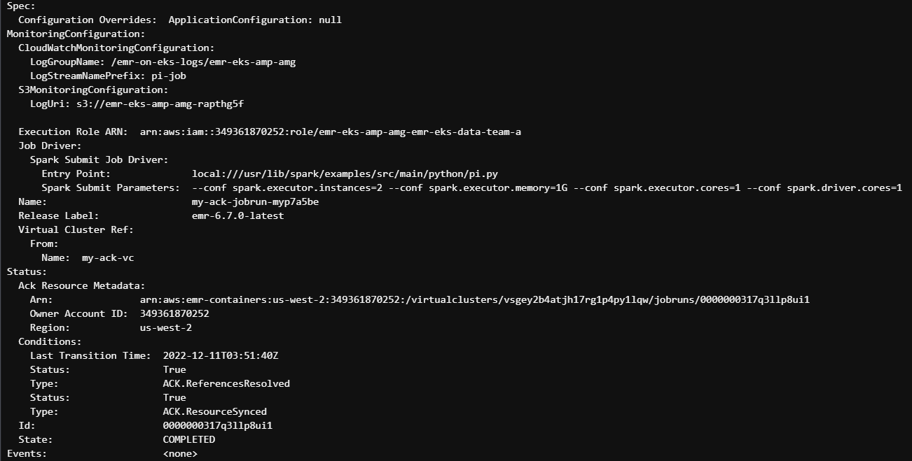

import CollapsibleContent from '../../../src/components/CollapsibleContent';

:::danger
**DEPRECATION NOTICE**

This blueprint will be deprecated and eventually removed from this GitHub repository on **October 27, 2024**. No bugs will be fixed, and no new features will be added. The decision to deprecate is based on the lack of demand and interest in this blueprint, as well as the difficulty in allocating resources to maintain a blueprint that is not actively used by any users or customers.

If you are using this blueprint in production, please add yourself to the [adopters.md](https://github.com/awslabs/data-on-eks/blob/main/ADOPTERS.md) page and raise an issue in the repository. This will help us reconsider and possibly retain and continue to maintain the blueprint. Otherwise, you can make a local copy or use existing tags to access it.
:::


# ACK Controller for EMR on EKS

## Introduction
In this post, we will learn to build EMR on EKS Spark workloads by using [AWS Controllers for Kubernetes (ACK)](https://aws-controllers-k8s.github.io/community/docs/tutorials/emr-on-eks-example/).
We will also build a end-to-end observability for Spark workloads by leveraging Amazon Managed Service for Prometheus to collect and store the metrics generated by Spark Applications and then use Amazon Managed Grafana to build dashboards for monitoring use cases.

<CollapsibleContent header={<h2><span>Deploying the Solution</span></h2>}>

In this [example](https://github.com/awslabs/data-on-eks/tree/main/analytics/terraform/emr-eks-ack), you will provision the following resources required to run Spark Jobs using EMR on EKS, as well as monitor spark job metrics using **Amazon Managed Prometheus** and **Amazon Managed Grafana**.

- Creates EKS Cluster Control plane with public endpoint (for demo purpose only)
- Two managed node groups
  - Core Node group with 3 AZs for running system critical pods. e.g., Cluster Autoscaler, CoreDNS, Observability, Logging etc.
  - Spark Node group with single AZ for running Spark jobs
- Enable EMR on EKS and creates two Data teams (`emr-data-team-a`, `emr-data-team-b`)
  - Creates new namespace for each team
  - Creates Kubernetes role and role binding(`emr-containers` user) for the above namespace
  - New IAM role for the team execution role
  - Update AWS_AUTH config map with  emr-containers user and AWSServiceRoleForAmazonEMRContainers role
  - Create a trust relationship between the job execution role and the identity of the EMR managed service account
- EMR Virtual Cluster for `emr-data-team-a`
- IAM policy for `emr-data-team-a`
- Amazon Managed Prometheus workspace to remote write metrics from Prometheus server
- Deploys the following Kubernetes Add-ons
    - Managed Add-ons
        - VPC CNI, CoreDNS, KubeProxy, AWS EBS CSi Driver
    - Self Managed Add-ons
        - Metrics server with HA, CoreDNS Cluster proportional Autoscaler, Cluster Autoscaler, Prometheus Server and Node Exporter, VPA for Prometheus, AWS for FluentBit, CloudWatchMetrics for EKS
 -  ACK EMR containers controller which allows you deploy sparks jobs to EMR on EKS by using yaml files. The controller is installed by using [AWS EKS ACK Addons Terraform module](https://github.com/aws-ia/terraform-aws-eks-ack-addons)

### Prerequisites:

Ensure that you have installed the following tools on your machine.

1. [aws cli](https://docs.aws.amazon.com/cli/latest/userguide/install-cliv2.html)
2. [kubectl](https://Kubernetes.io/docs/tasks/tools/)
3. [terraform](https://learn.hashicorp.com/tutorials/terraform/install-cli)

_Note: Currently Amazon Managed Prometheus supported only in selected regions. Please see this [userguide](https://docs.aws.amazon.com/prometheus/latest/userguide/what-is-Amazon-Managed-Service-Prometheus.html) for supported regions._

### Deploy

Clone the repository

```bash
git clone https://github.com/awslabs/data-on-eks.git
```

Navigate into one of the example directories and run `terraform init`

```bash
cd data-on-eks/analytics/terraform/emr-eks-ack
terraform init
```

Set `AWS_REGION` and Run Terraform plan to verify the resources created by this execution.

```bash
export AWS_REGION="us-west-2" # Change region according to your needs
terraform plan
```

Deploy the pattern

```bash
terraform apply
```

Enter `yes` to apply.

## Verify the resources

Let’s verify the resources created by `terraform apply`.

Verify the Amazon EKS Cluster and Amazon Managed service for Prometheus.

```bash
aws eks describe-cluster --name emr-eks-ack

aws amp list-workspaces --alias amp-ws-emr-eks-ack
```

Verify EMR on EKS Namespaces `emr-data-team-a` and `emr-data-team-b` and Pod status for `Prometheus`, `Vertical Pod Autoscaler`, `Metrics Server` and `Cluster Autoscaler`.

```bash
aws eks --region us-west-2 update-kubeconfig --name emr-eks-ack # Creates k8s config file to authenticate with EKS Cluster

kubectl get nodes # Output shows the EKS Managed Node group nodes

kubectl get ns | grep emr-data-team # Output shows emr-data-team-a and emr-data-team-b namespaces for data teams

kubectl get pods --namespace=prometheus # Output shows Prometheus server and Node exporter pods

kubectl get pods --namespace=vpa  # Output shows Vertical Pod Autoscaler pods

kubectl get pods --namespace=kube-system | grep  metrics-server # Output shows Metric Server pod

kubectl get pods --namespace=kube-system | grep  cluster-autoscaler # Output shows Cluster Autoscaler pod
```

</CollapsibleContent>

### Setup Amazon Managed Grafana with SSO
Currently, this step is manual. Please follow the steps in this [blog](https://aws.amazon.com/blogs/mt/monitoring-amazon-emr-on-eks-with-amazon-managed-prometheus-and-amazon-managed-grafana/) to create Amazon Managed Grafana with SSO enabled in your account.
You can visualize the Spark jobs runs and metrics using Amazon Managed Prometheus and Amazon Managed Grafana.

<CollapsibleContent header={<h2><span>Execute Sample Spark job - EMR Virtual Cluster</span></h2>}>

We can now create EMR Virtual Cluster. An EMR Virtual Cluster is mapped to a Kubernetes namespace. EMR uses virtual clusters to run jobs and host endpoints.
Create a Virtual cluster my-ack-vc for emr-data-team-a

```bash
kubectl apply -f analytics/terraform/emr-eks-ack/examples/emr-virtualcluster.yaml

kubectl describe virtualclusters
```
You will get the output like below <br/>
 


Execute the following shell script to run the Spark Job. This will ask for two inputs which can be extrcated from terraform outputs.

```bash
./analytics/terraform/emr-eks-ack/examples/sample-pyspark-job.sh

kubectl describe jobruns
```
You will get the output like below <br/>
 

</CollapsibleContent>

<CollapsibleContent header={<h2><span>Cleanup</span></h2>}>

This script will cleanup the environment using `-target` option to ensure all the resources are deleted in correct order.

```bash
cd analytics/terraform/emr-eks-ack && chmod +x cleanup.sh
./cleanup.sh
```
</CollapsibleContent>

:::caution

To avoid unwanted charges to your AWS account, delete all the AWS resources created during this deployment

:::
