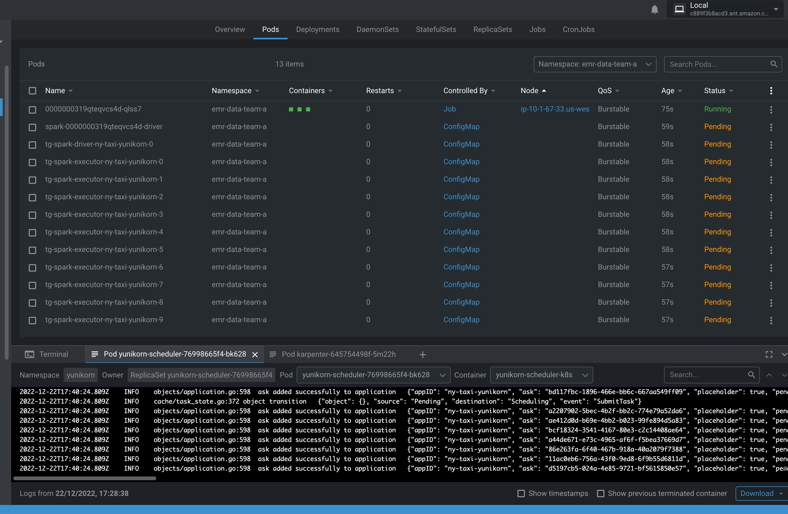
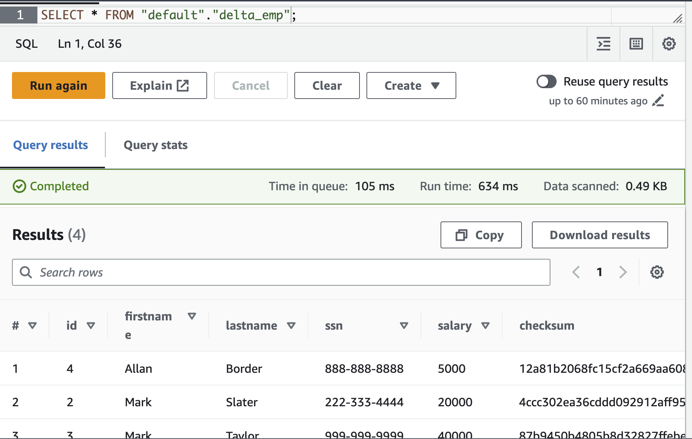

import Tabs from '@theme/Tabs';
import TabItem from '@theme/TabItem';
import CollapsibleContent from '../../../src/components/CollapsibleContent';

# EMR on EKS with [Karpenter](https://karpenter.sh/)

## Introduction

In this [pattern](https://github.com/awslabs/data-on-eks/tree/main/analytics/terraform/emr-eks-karpenter), you will deploy an EMR on EKS cluster and use [Karpenter](https://karpenter.sh/) Nodepools for scaling Spark jobs.

**Architecture**


This pattern uses opinionated defaults to keep the deployment experience simple but also keeps it flexible so that you can pick and choose necessary add-ons during deployment. We recommend keeping the defaults if you are new to EMR on EKS and only customize if you have viable alternative option available for replacement.

In terms of infrastructure, here are the resources that are created by this pattern

- Creates an EKS Cluster Control plane with public endpoint (recommended for demo/poc environment)
- One managed node group
  - Core Node group with 3 instances spanning multi-AZs for running system critical pods. e.g., Cluster Autoscaler, CoreDNS, Observability, Logging etc.
- Enables EMR on EKS
  - Creates two namespaces (`emr-data-team-a`, `emr-data-team-b`) for data teams
  - Creates Kubernetes role and role binding(`emr-containers` user) for both namespaces
  - IAM roles for both teams needed for job execution
  - Update `AWS_AUTH` config map with `emr-containers` user and `AWSServiceRoleForAmazonEMRContainers` role
  - Create a trust relationship between the job execution role and the identity of the EMR managed service account
  - Create EMR Virtual Cluster for `emr-data-team-a` & `emr-data-team-b` and IAM policies for both

You can see the list of add-ons available below.
:::tip
We recommend running all the default system add-ons on a dedicated EKS managed nodegroup such as `core-node-group` as provided by this pattern.
:::
:::danger
We don't recommend removing critical add-ons (`Amazon VPC CNI`, `CoreDNS`, `Kube-proxy`).
:::
| Add-on | Enabled by default? | Benefits | Link |
| :---  | :----: | :---- | :---- |
| Amazon VPC CNI | Yes | VPC CNI is available as an [EKS add-on](https://docs.aws.amazon.com/eks/latest/userguide/eks-networking-add-ons.html) and is responsible for creating ENI's and IPv4 or IPv6 addresses for your spark application pods | [VPC CNI Documentation](https://docs.aws.amazon.com/eks/latest/userguide/managing-vpc-cni.html) |
| CoreDNS | Yes | CoreDNS is available as an [EKS add-on](https://docs.aws.amazon.com/eks/latest/userguide/eks-networking-add-ons.html) and is responsible for resolving DNS queries for spark application and for Kubernetes cluster | [EKS CoreDNS Documentation](https://docs.aws.amazon.com/eks/latest/userguide/managing-coredns.html) |
| Kube-proxy | Yes | Kube-proxy is available as an [EKS add-on](https://docs.aws.amazon.com/eks/latest/userguide/eks-networking-add-ons.html) and it maintains network rules on your nodes and enables network communication to your spark application pods | [EKS kube-proxy Documentation](https://docs.aws.amazon.com/eks/latest/userguide/managing-kube-proxy.html) |
| Amazon EBS CSI driver | Yes | EBS CSI driver is available as an [EKS add-on](https://docs.aws.amazon.com/eks/latest/userguide/eks-networking-add-ons.html) and it allows EKS clusters to manage the lifecycle of EBS volumes | [EBS CSI Driver Documentation](https://docs.aws.amazon.com/eks/latest/userguide/ebs-csi.html)
| Karpenter | Yes | Karpenter is nodegroup-less autoscaler that provides just-in-time compute capacity for spark applications on Kubernetes clusters | [Karpenter Documentation](https://karpenter.sh/) |
| Cluster Autoscaler | Yes | Kubernetes Cluster Autoscaler automatically adjusts the size of Kubernetes cluster and is available for scaling nodegroups (such as `core-node-group`) in the cluster | [Cluster Autoscaler Documentation](https://github.com/kubernetes/autoscaler/blob/master/cluster-autoscaler/cloudprovider/aws/README.md) |
| Cluster proportional autoscaler | Yes | This is responsible for scaling CoreDNS pods in your Kubernetes cluster | [Cluster Proportional Autoscaler Documentation](https://github.com/kubernetes-sigs/cluster-proportional-autoscaler) |
| Metrics server | Yes | Kubernetes metrics server is responsible for aggregating cpu, memory and other container resource usage within your cluster | [EKS Metrics Server Documentation](https://docs.aws.amazon.com/eks/latest/userguide/metrics-server.html) |
| Prometheus | Yes | Prometheus is responsible for monitoring EKS cluster including spark applications in your EKS cluster. We use Prometheus deployment for scraping and ingesting metrics into Amazon Managed Prometheus and Kubecost | [Prometheus Documentation](https://prometheus.io/docs/introduction/overview/) |
| Amazon Managed Prometheus | Yes | This is responsible for storing and scaling of EKS cluster and spark application metrics | [Amazon Managed Prometheus Documentation](https://docs.aws.amazon.com/prometheus/latest/userguide/what-is-Amazon-Managed-Service-Prometheus.html) |
| Kubecost | Yes | Kubecost is responsible for providing cost break down by Spark application. You can monitor costs based on per job, namespace or labels | [EKS Kubecost Documentation](https://docs.aws.amazon.com/eks/latest/userguide/cost-monitoring.html) |
| CloudWatch metrics | No | CloudWatch container insights metrics shows simple and standardized way to monitor not only AWS resources but also EKS resources on CloudWatch dashboard | [CloudWatch Container Insights Documentation](https://docs.aws.amazon.com/AmazonCloudWatch/latest/monitoring/Container-Insights-metrics-EKS.html) |
|AWS for Fluent-bit | No | This can be used to publish EKS cluster and worker node logs to CloudWatch Logs or 3rd party logging system | [AWS For Fluent-bit Documentation](https://github.com/aws/aws-for-fluent-bit) |
| FSx for Lustre CSI driver | No | This can be used for running Spark application using FSx for Lustre | [FSx for Lustre CSI Driver Documentation](https://docs.aws.amazon.com/eks/latest/userguide/fsx-csi.html) |


<CollapsibleContent header={<h3><span>Customizing Add-ons</span></h3>}>

### Customizing Add-ons

You can customize your deployment anytime either by changing recommended system add-ons in `addons.tf` or by changing optional add-ons in `variables.tf`.

For example, let's say you want to remove Amazon Managed Prometheus because you have another application that captures Prometheus metrics, you can edit `addons.tf` using your favorite editor, find Amazon Managed Prometheus and change to `false`
```yaml
  enable_prometheus = false
  prometheus_helm_config = {
    name       = "prometheus"
    repository = "https://prometheus-community.github.io/helm-charts"
    chart      = "prometheus"
    version    = "15.10.1"
    namespace  = "prometheus"
    timeout    = "300"
    values     = [templatefile("${path.module}/helm-values/prometheus-values.yaml", {})]
  }
```

If you want to use FSx for Lustre storage while running Spark application for storing shuffle files or accessing data from S3, you can install FSx CSI driver by searching for FSx in `variables.tf` and edit the file
```yaml
variable "enable_fsx_for_lustre" {
  default     = false
  description = "Deploys fsx for lustre addon, storage class and static FSx for Lustre filesystem for EMR"
  type        = bool
}
```
Once the changes are saved, follow the [deployment guide](#deploying-the-solution) if this is a new installation or apply these changes using Terraform for existing installation
```
terraform apply
```

</CollapsibleContent>

<CollapsibleContent header={<h2><span>Deploying the Solution</span></h2>}>

Let's go through the deployment steps

### Prerequisites:

Ensure that you have installed the following tools on your machine.

1. [aws cli](https://docs.aws.amazon.com/cli/latest/userguide/install-cliv2.html)
2. [kubectl](https://Kubernetes.io/docs/tasks/tools/)
3. [terraform](https://learn.hashicorp.com/tutorials/terraform/install-cli)

_Note: Currently Amazon Managed Prometheus supported only in selected regions. Please see this [userguide](https://docs.aws.amazon.com/prometheus/latest/userguide/what-is-Amazon-Managed-Service-Prometheus.html) for supported regions._

First, clone the repository

```bash
git clone https://github.com/awslabs/data-on-eks.git
```

Navigate into one of the example directories and run `install.sh` script

```bash
cd data-on-eks/analytics/terraform/emr-eks-karpenter

chmod +x install.sh

./install.sh

```

### Verify the resources

Verify the Amazon EKS Cluster and Amazon Managed service for Prometheus

```bash
aws eks describe-cluster --name emr-eks-karpenter

aws amp list-workspaces --alias amp-ws-emr-eks-karpenter
```


Creates k8s config file to authenticate with EKS Cluster

```bash
aws eks --region us-west-2 update-kubeconfig --name emr-eks-karpenter
```

Output shows the EKS Managed Node group nodes

```bash
kubectl get nodes
```

Verify EMR on EKS Namespaces `emr-data-team-a` and `emr-data-team-b`.

```bash
kubectl get ns | grep emr-data-team
```

</CollapsibleContent>

## Run Sample Spark job

The pattern shows how to run spark jobs in a multi-tenant EKS cluster. The examples showcases two data teams using namespaces `emr-data-team-a` and `emr-data-team-b` mapped to their EMR virtual clusters. You can use different Karpenter Nodepools for each team so that they can submit jobs that are unique to their workload. Teams can also use different storage requirements to run their Spark jobs. For example, you can use compute optimized Nodepool that has `taints` and specify `tolerations` using pod templates so that you can run spark on compute optimized EC2 instances. In terms of storage, you can decide whether to use [EC2 instance-store](https://docs.aws.amazon.com/AWSEC2/latest/UserGuide/InstanceStorage.html) or [EBS](https://docs.aws.amazon.com/AWSEC2/latest/UserGuide/AmazonEBS.html) or [FSx for lustre](https://docs.aws.amazon.com/fsx/latest/LustreGuide/what-is.html) volumes for data processing. The default storage that is used in these examples is EC2 instance store because of performance benefit

- `spark-compute-optimized` Nodepool to run spark jobs on `c5d` instances.
- `spark-memory-optimized` Nodepool to run spark jobs on `r5d` instances.
- `spark-graviton-memory-optimized` Nodepool to run spark jobs on `r6gd` Graviton instances(`ARM64`).

<Tabs>
<TabItem value="spark-compute-optimized" lebal="spark-compute-optimized"default>

In this tutorial, you will use Karpenter Nodepool that uses compute optimized instances. This template leverages the Karpenter AWSNodeTemplates.

<details>
<summary> To view Karpenter Nodepool for compute optimized instances, Click to toggle content!</summary>

Verify the Karpenter NodeClass and Nodepool code [here](https://github.com/awslabs/data-on-eks/blob/35e09a8fbe64266778e0d86fe2eb805b8373e590/analytics/terraform/emr-eks-karpenter/addons.tf#L204)

</details>

To run Spark Jobs that can use this Nodepool, you need to submit your jobs by adding `tolerations` to your pod templates

For example,

```yaml
spec:
  tolerations:
    - key: "spark-compute-optimized"
      operator: "Exists"
      effect: "NoSchedule"
```

**Execute the sample PySpark Job to trigger compute optimized Karpenter Nodepool**

The following script requires four input parameters `virtual_cluster_id`, `job_execution_role_arn`, `cloudwatch_log_group_name` & `S3_Bucket` to store PySpark scripts, Pod templates and Input data. These values are auto populated by `execute_emr_eks_job.sh`.


:::caution

This shell script downloads the test data to your local machine and uploads to S3 bucket. Verify the shell script before running the job.

:::


```bash
cd data-on-eks/analytics/terraform/emr-eks-karpenter/examples/nvme-ssd/karpenter-compute-provisioner/

./execute_emr_eks_job.sh

```

```
Enter the EMR Virtual Cluster ID: 4ucrncg6z4nd19vh1lidna2b3
Enter the EMR Execution Role ARN: arn:aws:iam::123456789102:role/emr-eks-karpenter-emr-eks-data-team-a
Enter the CloudWatch Log Group name: /emr-on-eks-logs/emr-eks-karpenter/emr-data-team-a
Enter the S3 Bucket for storing PySpark Scripts, Pod Templates and Input data. For e.g., s3://<bucket-name>: s3://example-bucket
```

Karpenter may take between 1 and 2 minutes to spin up a new compute node as specified in the Nodepool templates before running the Spark Jobs.
Nodes will be drained with once the job is completed


**Verify the job execution**

```bash
kubectl get pods --namespace=emr-data-team-a -w
```


</TabItem>

<TabItem value="spark-memory-optimized" label="spark-memory-optimized">

In this tutorial, you will use Karpenter Nodepool that uses memory optimized instances. This template uses the AWS Node template with Userdata.

<details>
<summary> To view Karpenter Nodepool for memory optimized instances, Click to toggle content!</summary>

Verify the Karpenter NodeClass and Nodepool code [here](https://github.com/awslabs/data-on-eks/blob/35e09a8fbe64266778e0d86fe2eb805b8373e590/analytics/terraform/emr-eks-karpenter/addons.tf#L204)

</details>

To run Spark Jobs that can use this Nodepool, you need to submit your jobs by adding `tolerations` to your pod templates

For example,

```yaml
spec:
  tolerations:
    - key: "spark-memory-optimized"
      operator: "Exists"
      effect: "NoSchedule"
```
**Execute the sample PySpark Job to trigger memory optimized Karpenter Nodepool**

The following script requires four input parameters `virtual_cluster_id`, `job_execution_role_arn`, `cloudwatch_log_group_name` & `S3_Bucket` to store PySpark scripts, Pod templates and Input data. You can get these values `terraform apply` output values or by running `terraform output`. For `S3_BUCKET`, Either create a new S3 bucket or use an existing S3 bucket.

:::caution

This shell script downloads the test data to your local machine and uploads to S3 bucket. Verify the shell script before running the job.

:::

```bash
cd data-on-eks/analytics/terraform/emr-eks-karpenter/examples/nvme-ssd/karpenter-memory-provisioner/
./execute_emr_eks_job.sh
```
```
Enter the EMR Virtual Cluster ID: 4ucrncg6z4nd19vh1lidna2b3
Enter the EMR Execution Role ARN: arn:aws:iam::123456789102:role/emr-eks-karpenter-emr-eks-data-team-a
Enter the CloudWatch Log Group name: /emr-on-eks-logs/emr-eks-karpenter/emr-data-team-a
Enter the S3 Bucket for storing PySpark Scripts, Pod Templates and Input data. For e.g., s3://<bucket-name>: s3://example-bucket
```

Karpenter may take between 1 and 2 minutes to spin up a new compute node as specified in the Nodepool templates before running the Spark Jobs.
Nodes will be drained with once the job is completed

**Verify the job execution**

```bash
kubectl get pods --namespace=emr-data-team-a -w
```
</TabItem>

<TabItem value="spark-graviton-memory-optimized" label="spark-graviton-memory-optimized">

In this tutorial, you will use Karpenter Nodepool that uses Graviton memory optimized instances. This template uses the AWS Node template with Userdata.

<details>
<summary> To view Karpenter Nodepool for Graviton memory optimized instances, Click to toggle content!</summary>

Verify the Karpenter NodeClass and Nodepool code [here](https://github.com/awslabs/data-on-eks/blob/35e09a8fbe64266778e0d86fe2eb805b8373e590/analytics/terraform/emr-eks-karpenter/addons.tf#L204)

</details>

To run Spark Jobs that can use this Nodepool, you need to submit your jobs by adding `tolerations` to your pod templates

For example,

```yaml
spec:
  tolerations:
    - key: "spark-graviton-memory-optimized"
      operator: "Exists"
      effect: "NoSchedule"
```
**Execute the sample PySpark Job to trigger Graviton memory optimized Karpenter Nodepool**

The following script requires four input parameters `virtual_cluster_id`, `job_execution_role_arn`, `cloudwatch_log_group_name` & `S3_Bucket` to store PySpark scripts, Pod templates and Input data. You can get these values `terraform apply` output values or by running `terraform output`. For `S3_BUCKET`, Either create a new S3 bucket or use an existing S3 bucket.

:::caution

This shell script downloads the test data to your local machine and uploads to S3 bucket. Verify the shell script before running the job.

:::

```bash
cd data-on-eks/analytics/terraform/emr-eks-karpenter/examples/nvme-ssd/karpenter-graviton-memory-provisioner/
./execute_emr_eks_job.sh
```
```
Enter the EMR Virtual Cluster ID: 4ucrncg6z4nd19vh1lidna2b3
Enter the EMR Execution Role ARN: arn:aws:iam::123456789102:role/emr-eks-karpenter-emr-eks-data-team-a
Enter the CloudWatch Log Group name: /emr-on-eks-logs/emr-eks-karpenter/emr-data-team-a
Enter the S3 Bucket for storing PySpark Scripts, Pod Templates and Input data. For e.g., s3://<bucket-name>: s3://example-bucket
```

Karpenter may take between 1 and 2 minutes to spin up a new compute node as specified in the Nodepool templates before running the Spark Jobs.
Nodes will be drained with once the job is completed

**Verify the job execution**

```bash
kubectl get pods --namespace=emr-data-team-a -w
```
</TabItem>

</Tabs>

### Execute the sample PySpark job that uses EBS volumes and compute optimized Karpenter Nodepool

This pattern uses EBS volumes for data processing and compute optimized Nodepool. You can modify the Nodepool by changing nodeselector in driver and executor pod templates. In order to change Nodepools, simply update your pod templates to desired Nodepool
```yaml
  nodeSelector:
    NodeGroupType: "SparkComputeOptimized"
```
You can also update [EC2 instances](https://aws.amazon.com/ec2/instance-types/#Compute_Optimized) that doesn't include instance store volumes (for example c5.xlarge) and remove c5d's if needed for this exercise

We will create Storageclass that will be used by drivers and executors. We'll create static Persistent Volume Claim (PVC) for the driver pod but we'll use dynamically created ebs volumes for executors.

Create StorageClass and PVC using example provided
```bash
cd data-on-eks/analytics/terraform/emr-eks-karpenter/examples/ebs-pvc/karpenter-compute-provisioner-ebs/
kubectl apply -f ebs-storageclass-pvc.yaml
```
Let's run the job

```bash
cd data-on-eks/analytics/terraform/emr-eks-karpenter/examples/ebs-pvc/karpenter-compute-provisioner-ebs/
./execute_emr_eks_job.sh
Enter the EMR Virtual Cluster ID: 4ucrncg6z4nd19vh1lidna2b3
Enter the EMR Execution Role ARN: arn:aws:iam::123456789102:role/emr-eks-karpenter-emr-eks-data-team-a
Enter the CloudWatch Log Group name: /emr-on-eks-logs/emr-eks-karpenter/emr-data-team-a
Enter the S3 Bucket for storing PySpark Scripts, Pod Templates and Input data. For e.g., s3://<bucket-name>: s3://example-bucket
```

You'll notice the PVC `spark-driver-pvc` will be used by driver pod but Spark will create multiple ebs volumes for executors mapped to Storageclass `emr-eks-karpenter-ebs-sc`. All dynamically created ebs volumes will be deleted once the job completes

### Running Sample Spark job using FSx for Lustre

Amazon FSx for Lustre is a fully managed shared storage option built on the world’s most popular high-performance file system. You can use FSx to store shuffle files and also to store intermediate data processing tasks in a data pipeline. You can read more about FSX for Lustre in [documentation](https://docs.aws.amazon.com/fsx/latest/LustreGuide/what-is.html) and learn how to use this storage with EMR on EKS in our [best practices guide](https://aws.github.io/aws-emr-containers-best-practices/storage/docs/spark/fsx-lustre/)

In this example, you will learn how to deploy, configure and use FSx for Lustre as a shuffle storage. There are two ways to use FSx for Lustre
- using static FSx for Lustre volumes
- using dynamically created FSx for Lustre volumes

<Tabs>
<TabItem value="fsx-static" lebal="fsx-static"default>

**Execute Spark Job by using `FSx for Lustre` with statically provisioned volume and compute optimized Karpenter Nodepool.**

Fsx for Lustre Terraform module is disabled by default. Follow the [customizing add-ons](#customizing-add-ons) steps before running Spark jobs.

Execute the Spark job using the below shell script.

This script requires input parameters which can be extracted from `terraform apply` output values.

:::caution

This shell script downloads the test data to your local machine and uploads to S3 bucket. Verify the shell script before running the job.

:::

```bash
cd analytics/terraform/emr-eks-karpenter/examples/fsx-for-lustre/fsx-static-pvc-shuffle-storage

./fsx-static-spark.sh
```
Karpetner may take between 1 and 2 minutes to spin up a new compute node as specified in the Nodepool templates before running the Spark Jobs.
Nodes will be drained with once the job is completed

**Verify the job execution events**

```bash
kubectl get pods --namespace=emr-data-team-a -w
```
This will show the mounted `/data` directory with FSx DNS name

```bash
kubectl exec -ti taxidata-exec-1 -c spark-kubernetes-executor -n emr-data-team-a -- df -h

kubectl exec -ti taxidata-exec-1 -c spark-kubernetes-executor -n emr-data-team-a -- ls -lah /static
```
</TabItem>

<TabItem value="fsx-dynamic" lebal="fsx-dynamic"default>

**Execute Spark Job by using `FSx for Lustre` with dynamically provisioned volume and compute optimized Karpenter Nodepool.**

Fsx for Lustre Terraform module is disabled by default. Follow the [customizing add-ons](#customizing-add-ons) steps before running Spark jobs.

Execute Spark Job by using `FSx for Lustre` as a Shuffle storage for Driver and Executor pods with dynamically provisioned FSx filesystem and Persistent volume.
Execute the Spark job using the below shell script.

This script requires input parameters which can be extracted from `terraform apply` output values.

:::caution

This shell script downloads the test data to your local machine and uploads to S3 bucket. Verify the shell script before running the job.

:::

```bash
cd analytics/terraform/emr-eks-karpenter/examples/fsx-for-lustre/fsx-dynamic-pvc-shuffle-storage

./fsx-dynamic-spark.sh
```
Karpetner may take between 1 and 2 minutes to spin up a new compute node as specified in the Nodepool templates before running the Spark Jobs.
Nodes will be drained with once the job is completed

**Verify the job execution events**

```bash
kubectl get pods --namespace=emr-data-team-a -w
```

```bash
kubectl exec -ti taxidata-exec-1 -c spark-kubernetes-executor -n emr-data-team-a -- df -h

kubectl exec -ti taxidata-exec-1 -c spark-kubernetes-executor -n emr-data-team-a -- ls -lah /dynamic
```
</TabItem>
</Tabs>

### Running Sample Spark job using Apache YuniKorn Batch Scheduler

Apache YuniKorn is an open-source, universal resource scheduler for managing distributed big data processing workloads such as Spark, Flink, and Storm. It is designed to efficiently manage resources across multiple tenants in a shared, multi-tenant cluster environment.
Some of the key features of Apache YuniKorn include:
 - **Flexibility**: YuniKorn provides a flexible and scalable architecture that can handle a wide variety of workloads, from long-running services to batch jobs.
 - **Dynamic Resource Allocation**: YuniKorn uses a dynamic resource allocation mechanism to allocate resources to workloads on an as-needed basis, which helps to minimize resource wastage and improve overall cluster utilization.
 - **Priority-based Scheduling**: YuniKorn supports priority-based scheduling, which allows users to assign different levels of priority to their workloads based on business requirements.
 - **Multi-tenancy**: YuniKorn supports multi-tenancy, which enables multiple users to share the same cluster while ensuring resource isolation and fairness.
 - **Pluggable Architecture**: YuniKorn has a pluggable architecture that allows users to extend its functionality with custom scheduling policies and pluggable components.

Apache YuniKorn is a powerful and versatile resource scheduler that can help organizations efficiently manage their big data workloads while ensuring high resource utilization and workload performance.

**Apache YuniKorn Architecture**


**Apache YuniKorn Gang Scheduling with Karpenter**

Apache YuniKorn Scheduler add-on is disabled by default. Follow the steps to deploy the Apache YuniKorn add-on and execute the Spark job.

1. Update the `analytics/terraform/emr-eks-karpenter/variables.tf` file with the following

```terraform
variable "enable_yunikorn" {
  default     = true
  description = "Enable Apache YuniKorn Scheduler"
  type        = bool
}
```

2. Execute `terrafrom apply` again. This will deploy FSx for Lustre add-on and all the necessary resources.

```terraform
terraform apply -auto-approve
```

This example demonstrates the [Apache YuniKorn Gang Scheduling](https://yunikorn.apache.org/docs/user_guide/gang_scheduling/) with Karpenter Autoscaler.

```bash
cd analytics/terraform/emr-eks-karpenter/examples/nvme-ssd/karpenter-yunikorn-gangscheduling

./execute_emr_eks_job.sh
```

**Verify the job execution**
Apache YuniKorn Gang Scheduling will create pause pods for total number of executors requested.

```bash
kubectl get pods --namespace=emr-data-team-a -w
```
Verify the driver and executor pods prefix with `tg-` indicates the pause pods.
These pods will be replaced with the actual Spark Driver and Executor pods once the Nodes are scaled and ready by the Karpenter.




<CollapsibleContent header={<h2><span>Delta Lake Table Format</span></h2>}>

Delta Lake is a leading table format which is used to organize and store data.
The table format allows us to abstract different data files stored as objects as a singular dataset, a table.

The source format provides a transactional and scalable layer, enabling efficient and easy-to-manage data processing.
It offer features such as

  - ACID (Atomicity, Consistency, Isolation, and Durability) transactions
  - data merge operations
  - data versioning
  - processing performance

Below quickstart examples showcases the features and usage of the delta lake table formats.

<Tabs>
  <TabItem value="deltalake" label="insert & merge operations" default>
In this example we will load a csv file into a delta lake table format by running Spark jobs on an EMR on EKS cluster.

### Prerequisites:

The necessary EMR on EKS cluster has been provisioned as per instructions in the beginning of this page.
This script requires input parameters which can be extracted from `terraform apply` output values.
Execute the Spark job using the below shell script.


```bash
Navigate to folder and execute script:

cd analytics/terraform/emr-eks-karpenter/examples/nvme-ssd/deltalake
./execute-deltacreate.sh
```

:::tip
    This shell script uploads test data and pyspark scripts to S3 bucket.
    Specify the S3 bucket where you want to upload the artifacts and create the delta table.

    Verify successful job completion by navigating to the EMR on EKS virtual cluster and view the job status.
    For job failures, you can navigate to the S3 bucket emr-on-eks-logs and drill-down to the jobs folder and investigate the spark driver stdout and stderr logs.
:::

**Following artifacts are created in S3 once the script is executed and the EMR on EKS job is successfully completed.**


  - The data folder contains two csv files.(initial_emp.csv and update_emp.csv)
  - The scripts folder contains two pyspark scripts.(delta-create.py and delta-merge.py) for initial load and subsequent merge.
  - The delta lake table is created in the delta\delta_emp folder.
  - There is also a symlink manifest file created in the delta\delta_emp\_symlink_format_manifest and registered to glue catalog for athena to query the initial table.


** Using Athena to query the created delta table. **

Athena, is a serverless query service offered by AWS.
It requires a symlink file for Delta tables registered to the Glue catalog.
This is required because Delta Lake uses a specific directory structure to store data and metadata.
The symlink file serves as a pointer to the latest version of the Delta log file. Without this symlink,
Athena would not be able to determine the correct version of the metadata file to use for a given query

  - Navigate to Athena query editor.
  - The delta table should appear under the default database in AWSDataCatalog as shown below.
  - Select the table and preview the data and verify if all records from the initial_emp.csv is shown.


**Query output as table**



In the second example we will load an updated csv file into into the previously created delta lake table by running the merge Spark job.

```bash
Navigate to folder and execute script:

cd analytics/terraform/emr-eks-karpenter/examples/nvme-ssd/deltalake
./execute-deltamerge.sh
```

** Verify successful job completion. Re-run the query in Athena and verify data is merged (insert and updates) and shown correctly in delta lake table.**

  </TabItem>
</Tabs>

</CollapsibleContent>

## Run Interactive Workload with Managed Endpoint

Managed endpoint is a gateway that provides connectivity from EMR Studio to EMR on EKS so that you can run interactive workloads. You can find out more information about it [here](https://docs.aws.amazon.com/emr/latest/EMR-on-EKS-DevelopmentGuide/how-it-works.html).

### Creating a managed endpoint

In this example, we will create a managed endpoint under one of the data teams.

```bash
Navigate to folder and execute script:

cd analytics/terraform/emr-eks-karpenter/examples/managed-endpoints
./create-managed-endpoint.sh
```
```
Enter the EMR Virtual Cluster Id: 4ucrncg6z4nd19vh1lidna2b3
Provide your EMR on EKS team (emr-data-team-a or emr-data-team-b): emr-eks-data-team-a
Enter your AWS Region: us-west-2
Enter a name for your endpoint: emr-eks-team-a-endpoint
Provide an S3 bucket location for logging (i.e. s3://my-bucket/logging/): s3://<bucket-name>/logs
Enter the EMR Execution Role ARN (i.e. arn:aws:00000000000000000:role/EMR-Execution-Role): arn:aws:iam::181460066119:role/emr-eks-karpenter-emr-data-team-a
```

The script will provide the following:
- JSON configuration file for the Managed Endpoint
- Configuration settings:
  - Default 8G Spark Driver
  - CloudWatch monitoring, with logs stored in the S3 bucket provided
- Proper endpoint creation with appropriate security group to allow using Karpenter
- Outputs: Managed Endpoint ID and Load Balancer ARN.

Once you have created a managed endpoint, you can follow the instructions [here](https://docs.aws.amazon.com/emr/latest/ManagementGuide/emr-studio-configure.html) to configure EMR Studio and associate the Managed endpoint to a workspace.

### Cleanup of Endpoint resources

To delete the managed endpoint, simply run the following command:

```bash
aws emr-containers delete-managed-endpoint --id <Managed Endpoint ID> --virtual-cluster-id <Virtual Cluster ID>
```

## Cleanup
<CollapsibleContent header={<h2><span>Cleanup</span></h2>}>
This script will cleanup the environment using `-target` option to ensure all the resources are deleted in correct order.

```bash
cd analytics/terraform/emr-eks-karpenter && chmod +x cleanup.sh
./cleanup.sh
```
</CollapsibleContent>

:::caution
To avoid unwanted charges to your AWS account, delete all the AWS resources created during this deployment
:::
