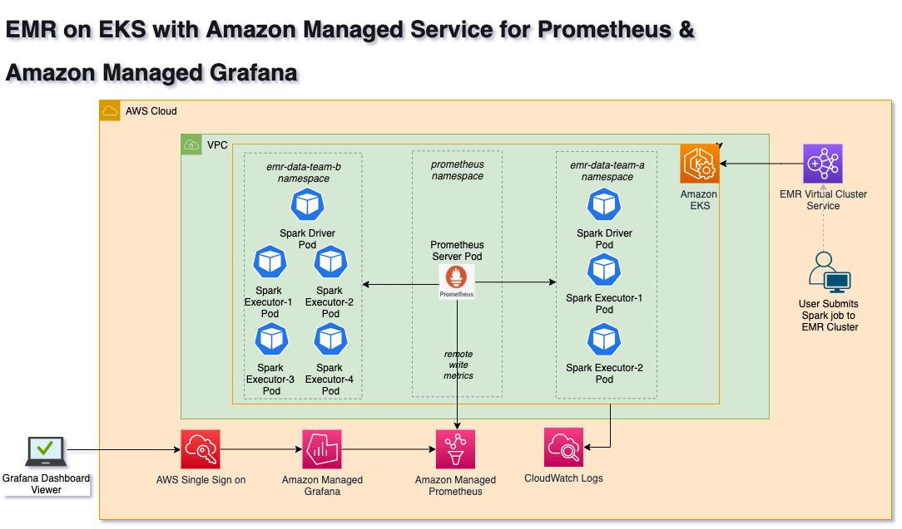

# EMR on EKS Observability

## [Monitoring Amazon EMR on EKS with Amazon Managed Prometheus and Amazon Managed Grafana](https://aws.amazon.com/blogs/mt/monitoring-amazon-emr-on-eks-with-amazon-managed-prometheus-and-amazon-managed-grafana/)

In this post, we will learn to build end-to-end observability for EMR on EKS Spark workloads by leveraging Amazon Managed Service for Prometheus to collect and store the metrics generated by Spark Applications. We will then use Amazon Managed Grafana to build dashboards for monitoring use cases

Checkout the full blog [here](https://aws.amazon.com/blogs/mt/monitoring-amazon-emr-on-eks-with-amazon-managed-prometheus-and-amazon-managed-grafana/)

### Architecture
The following diagram illustrates the solution architecture for scraping Spark Driver and Executors’ metrics, as well as writing to Amazon Managed Service for Prometheus.

### Grafana Dashboard for Spark
The following Grafana dashboard displays the EMR on EKS Spark job metrics with Driver and Executor details.

