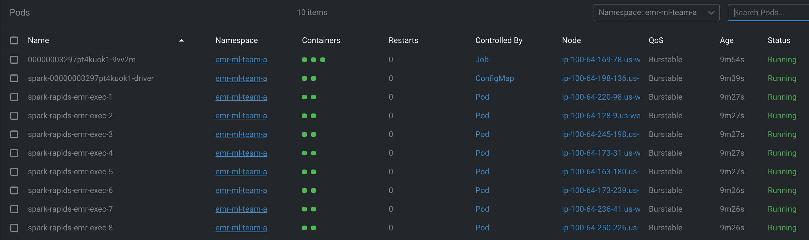

import CollapsibleContent from '../../../src/components/CollapsibleContent';

# EMR on EKS NVIDIA RAPIDS Accelerator for Apache Spark

The NVIDIA RAPIDS Accelerator for Apache Spark is a powerful tool that builds on the capabilities of NVIDIA CUDA® - a transformative parallel computing platform designed for enhancing computational processes on NVIDIA's GPU architecture. RAPIDS, a project developed by NVIDIA, comprises a suite of open-source libraries that are hinged upon CUDA, thereby enabling GPU-accelerated data science workflows.

With the invention of the RAPIDS Accelerator for Spark 3, NVIDIA has successfully revolutionized extract, transform, and load pipelines by significantly enhancing the efficiency of Spark SQL and DataFrame operations. By merging the capabilities of the RAPIDS cuDF library and the extensive reach of the Spark distributed computing ecosystem, the RAPIDS Accelerator for Apache Spark provides a robust solution to handle large-scale computations.
Moreover, the RAPIDS Accelerator library incorporates an advanced shuffle optimized by UCX, which can be configured to support GPU-to-GPU communication and RDMA capabilities, hence further boosting its performance.


### EMR support for NVIDIA RAPIDS Accelerator for Apache Spark
Integration of Amazon EMR with NVIDIA RAPIDS Accelerator for Apache Spark​ Amazon EMR on EKS now extends its support to include the use of GPU instance types with the NVIDIA RAPIDS Accelerator for Apache Spark. As the use of artificial intelligence (AI) and machine learning (ML) continues to expand in the realm of data analytics, there's an increasing demand for rapid and cost-efficient data processing, which GPUs can provide. The NVIDIA RAPIDS Accelerator for Apache Spark enables users to harness the superior performance of GPUs, leading to substantial infrastructure cost savings.

### Features
- Highlighted Features​ Experience a performance boost in data preparation tasks, allowing you to transition quickly to the subsequent stages of your pipeline. This not only accelerates model training but also liberates data scientists and engineers to concentrate on priority tasks.

- Spark 3 ensures seamless coordination of end-to-end pipelines - from data ingestion, through model training, to visualization. The same GPU-accelerated setup can serve both Spark and machine learning or deep learning frameworks. This obviates the need for discrete clusters and provides GPU acceleration to the entire pipeline.

- Spark 3 extends support for columnar processing in the Catalyst query optimizer. The RAPIDS Accelerator can plug into this system to speed up SQL and DataFrame operators. When the query plan is actioned, these operators can then utilize the GPUs within the Spark cluster for improved performance.

- NVIDIA has introduced an innovative Spark shuffle implementation designed to optimize data exchange between Spark tasks. This shuffle system is built on GPU-boosted communication libraries, including UCX, RDMA, and NCCL, which significantly enhance data transfer rates and overall performance.-


<CollapsibleContent header={<h2><span>Deploying the Solution</span></h2>}>

:::warning
Before deploying this blueprint, it is important to be cognizant of the costs associated with the utilization of GPU Instances. The blueprint sets up eight g5.2xlarge GPU instances for training the dataset, employing the NVIDIA Spark-RAPIDS accelerator. Be sure to assess and plan for these costs accordingly.
:::

In this [example](https://github.com/awslabs/data-on-eks/tree/main/ai-ml/emr-spark-rapids), you will provision the following resources required to run XGBoost Spark RAPIDS Accelerator job with [Fannie Mae’s Single-Family Loan Performance Data](https://capitalmarkets.fanniemae.com/credit-risk-transfer/single-family-credit-risk-transfer/fannie-mae-single-family-loan-performance-data).

This example deploys the following resources

- Creates a new sample VPC, 2 Private Subnets and 2 Public Subnets
- Creates Internet gateway for Public Subnets and NAT Gateway for Private Subnets
- Creates EKS Cluster Control plane with public endpoint (for demo reasons only) with core managed node group, Spark driver node group and GPU Spot node group for ML workloads.
- Ubuntu EKS AMI used for Spark Driver and Spark executor GPU Node groups
- NVIDIA GPU Operator helm add-on deployed
- Deploys Metrics server, Cluster Autoscaler, Karpenter, Grafana, AMP and Prometheus server.
- Enables EMR on EKS
  - Creates two namespaces (`emr-ml-team-a`, `emr-ml-team-b`) for data teams
  - Creates Kubernetes role and role binding(`emr-containers` user) for both namespaces
  - IAM roles for both teams needed for job execution
  - Update `AWS_AUTH` config map with `emr-containers` user and `AWSServiceRoleForAmazonEMRContainers` role
  - Create a trust relationship between the job execution role and the identity of the EMR managed service account
  - Create EMR Virtual Cluster for `emr-ml-team-a` & `emr-ml-team-b` and IAM policies for both

### Prerequisites

Ensure that you have installed the following tools on your machine.

1. [aws cli](https://docs.aws.amazon.com/cli/latest/userguide/install-cliv2.html)
2. [kubectl](https://Kubernetes.io/docs/tasks/tools/)
3. [terraform](https://learn.hashicorp.com/tutorials/terraform/install-cli)

### Deploy

Clone the repository

```bash
git clone https://github.com/awslabs/data-on-eks.git
```

Navigate into one of the example directories and run `install.sh` script

```bash
cd data-on-eks/ai-ml/emr-spark-rapids/ && chmod +x install.sh
./install.sh
```

### Verify the resources

Verify the Amazon EKS Cluster and Amazon Managed service for Prometheus

```bash
aws eks describe-cluster --name emr-spark-rapids
```

```bash
# Creates k8s config file to authenticate with EKS
aws eks --region us-west-2 update-kubeconfig --name emr-spark-rapids Cluster

kubectl get nodes # Output shows the EKS Managed Node group nodes

# Verify EMR on EKS Namespaces `emr-ml-team-a` and `emr-ml-team-b`
kubectl get ns | grep emr-ml-team
```

```bash
kubectl get pods --namespace=gpu-operator

# Output example for GPU node group with one node running

    NAME                                                              READY   STATUS
    gpu-feature-discovery-7gccd                                       1/1     Running
    gpu-operator-784b7c5578-pfxgx                                     1/1     Running
    nvidia-container-toolkit-daemonset-xds6r                          1/1     Running
    nvidia-cuda-validator-j2b42                                       0/1     Completed
    nvidia-dcgm-exporter-vlttv                                        1/1     Running
    nvidia-device-plugin-daemonset-r5m7z                              1/1     Running
    nvidia-device-plugin-validator-hg78p                              0/1     Completed
    nvidia-driver-daemonset-6s9qv                                     1/1     Running
    nvidia-gpu-operator-node-feature-discovery-master-6f78fb7cbx79z   1/1     Running
    nvidia-gpu-operator-node-feature-discovery-worker-b2f6b           1/1     Running
    nvidia-gpu-operator-node-feature-discovery-worker-dc2pq           1/1     Running
    nvidia-gpu-operator-node-feature-discovery-worker-h7tpq           1/1     Running
    nvidia-gpu-operator-node-feature-discovery-worker-hkj6x           1/1     Running
    nvidia-gpu-operator-node-feature-discovery-worker-zjznr           1/1     Running
    nvidia-operator-validator-j7lzh                                   1/1     Running
```

</CollapsibleContent>


### Launching XGBoost Spark Job

#### Training Dataset
Fannie Mae’s Single-Family Loan Performance Data has a comprehensive dataset starting from 2013. It provides valuable insights into the credit performance of a portion of Fannie Mae’s single-family book of business. This dataset is designed to assist investors in better understanding the credit performance of single-family loans owned or guaranteed by Fannie Mae.

#### Step 1: Building a Custom Docker Image

- To pull the Spark Rapids base image from the EMR on EKS ECR repository located in `us-west-2`, log in:

```bash
aws ecr get-login-password --region us-west-2 | docker login --username AWS --password-stdin 895885662937.dkr.ecr.us-west-2.amazonaws.com
```

If you're located in a different region, please refer to: this [guide](https://docs.aws.amazon.com/emr/latest/EMR-on-EKS-DevelopmentGuide/docker-custom-images-tag.html.).

- To build your Docker image locally, use the following command:

Build the custom Docker image using the provided `Dockerfile`. Choose a tag for the image, such as 0.10.

:::info
Please note that the build process may take some time, depending on your network speed. Keep in mind that the resulting image size will be approximately `23.5GB`.
:::


```bash
cd ~/data-on-eks/ai-ml/emr-spark-rapids/examples/xgboost
docker build -t emr-6.10.0-spark-rapids-custom:0.10 -f Dockerfile .
```

- Replace `<ACCOUNTID>` with your AWS account ID. Log in to your ECR repository with the following command:

```bash
aws ecr get-login-password --region us-west-2 | docker login --username AWS --password-stdin <ACCOUNTID>.dkr.ecr.us-west-2.amazonaws.com
```

- To push your Docker image to your ECR, use:

```bash
$ docker tag emr-6.10.0-spark-rapids-custom:0.10 <ACCOUNT_ID>.dkr.ecr.us-west-2.amazonaws.com/emr-6.10.0-spark-rapids-custom:0.10
$ docker push <ACCOUNT_ID>.dkr.ecr.us-west-2.amazonaws.com/emr-6.10.0-spark-rapids-custom:0.10
```

You can use this image during the job execution in `Step3` .

### Step2: Acquire the Input Data (Fannie Mae’s Single-Family Loan Performance Data)

This dataset is sourced from [Fannie Mae’s Single-Family Loan Performance Data](http://www.fanniemae.com/portal/funding-the-market/data/loan-performance-data.html). All rights are held by Fannie Mae.


1. Go to the [Fannie Mae](https://capitalmarkets.fanniemae.com/credit-risk-transfer/single-family-credit-risk-transfer/fannie-mae-single-family-loan-performance-data) website
2. Click on [Single-Family Loan Performance Data](https://datadynamics.fanniemae.com/data-dynamics/?&_ga=2.181456292.2043790680.1657122341-289272350.1655822609#/reportMenu;category=HP)
    - Register as a new user if you are using the website for the first time
    - Use the credentials to login
3. Select [HP](https://datadynamics.fanniemae.com/data-dynamics/#/reportMenu;category=HP)
4. Click on  `Download Data` and choose `Single-Family Loan Performance Data`
5. You will find a tabular list of Acquisition and Performance` files sorted based on year and quarter. Click on the file to download. You can download three years(2020, 2021 and 2022 - 4 files for each year and one for each quarter) worth of data that will be used in our example job.  e.g.,: 2017Q1.zip
6. Unzip the download file to extract the csv file to your local machine. e.g.,: 2017Q1.csv
7. Copy only the CSV files to an S3 bucket under `${S3_BUCKET}/${EMR_VIRTUAL_CLUSTER_ID}/spark-rapids-emr/input/fannie-mae-single-family-loan-performance/`. The example below uses three years of data (one file for each quarter, 12 files in total). Note: `${S3_BUCKET}` and `${EMR_VIRTUAL_CLUSTER_ID}` values can be extracted from Terraform outputs.

```
 aws s3 ls s3://emr-spark-rapids-<aws-account-id>-us-west-2/949wt7zuphox1beiv0i30v65i/spark-rapids-emr/input/fannie-mae-single-family-loan-performance/
    2023-06-24 21:38:25 2301641519 2000Q1.csv
    2023-06-24 21:38:25 9739847213 2020Q2.csv
    2023-06-24 21:38:25 10985541111 2020Q3.csv
    2023-06-24 21:38:25 11372073671 2020Q4.csv
    2023-06-23 16:38:36 9603950656 2021Q1.csv
    2023-06-23 16:38:36 7955614945 2021Q2.csv
    2023-06-23 16:38:36 5365827884 2021Q3.csv
    2023-06-23 16:38:36 4390166275 2021Q4.csv
    2023-06-22 19:20:08 2723499898 2022Q1.csv
    2023-06-22 19:20:08 1426204690 2022Q2.csv
    2023-06-22 19:20:08  595639825 2022Q3.csv
    2023-06-22 19:20:08  180159771 2022Q4.csv
```

### Step3: Run the EMR Spark XGBoost Job

Here, we will utilize a helper shell script to execute the job. This script requires user input.

This script will ask for certain inputs that you can obtain from Terraform outputs. See the example below.

```bash
cd ai-ml/emr-spark-rapids/examples/xgboost/ && chmod +x execute_spark_rapids_xgboost.sh
./execute_spark_rapids_xgboost.sh

# Example inputs shown below
    Did you copy the fannie-mae-single-family-loan-performance data to S3 bucket(y/n): y
    Enter the customized Docker image URI: public.ecr.aws/o7d8v7g9/emr-6.10.0-spark-rapids:0.11
    Enter EMR Virtual Cluster AWS Region: us-west-2
    Enter the EMR Virtual Cluster ID: 949wt7zuphox1beiv0i30v65i
    Enter the EMR Execution Role ARN: arn:aws:iam::<ACCOUNTID>:role/emr-spark-rapids-emr-eks-data-team-a
    Enter the CloudWatch Log Group name: /emr-on-eks-logs/emr-spark-rapids/emr-ml-team-a
    Enter the S3 Bucket for storing PySpark Scripts, Pod Templates, Input data and Output data.<bucket-name>: emr-spark-rapids-<ACCOUNTID>-us-west-2
    Enter the number of executor instances (4 to 8): 8
```

Verify the pod status




:::info
Note that the first execution might take longer as it needs to download the image for the EMR Job Pod, Driver, and Executor pods. Each pod may take up to 8 minutes to download the Docker image. Subsequent runs should be faster (usually under 30 seconds), thanks to image caching
:::

### Step4: Verify the Job results

- Log in to check the Spark driver pod logs from either CloudWatch logs or your S3 bucket.

Here's a sample output from the log file:

```
/emr-on-eks-logs/emr-spark-rapids/emr-ml-team-a
spark-rapids-emr/949wt7zuphox1beiv0i30v65i/jobs/0000000327fe50tosa4/containers/spark-0000000327fe50tosa4/spark-0000000327fe50tosa4-driver/stdout
```

The following is a sample output from the above log file:

    Raw Dataframe CSV Rows count : 215386024
    Raw Dataframe Parquet Rows count : 215386024
    ETL takes 222.34674382209778

    Training takes 95.90932035446167 seconds
    If features_cols param set, then features_col param is ignored.

    Transformation takes 63.999391317367554 seconds
    +--------------+--------------------+--------------------+----------+
    |delinquency_12|       rawPrediction|         probability|prediction|
    +--------------+--------------------+--------------------+----------+
    |             0|[10.4500541687011...|[0.99997103214263...|       0.0|
    |             0|[10.3076572418212...|[0.99996662139892...|       0.0|
    |             0|[9.81707763671875...|[0.99994546175003...|       0.0|
    |             0|[9.10498714447021...|[0.99988889694213...|       0.0|
    |             0|[8.81903457641601...|[0.99985212087631...|       0.0|
    +--------------+--------------------+--------------------+----------+
    only showing top 5 rows

    Evaluation takes 3.8372223377227783 seconds
    Accuracy is 0.996563056111921

### ML Pipeline for Fannie Mae Single Loan Performance Dataset

**Step1**: Preprocess and clean the dataset to handle missing values, categorical variables, and other data inconsistencies.This may involve techniques like data imputation,one-hot encoding, and data normalization.

**Step2**: Create additional features from the existing ones that might provide more useful information for predicting loan performance. For example, you could extract features like loan-to-value ratio, borrower's credit score range, or loan origination year.

**Step3**: Divide the dataset into two parts: one for training the XGBoost model and one for evaluating its performance. This allows you to assess how well the model generalizes to unseen data.

**Step4**: Feed the training dataset into XGBoost to train the model. XGBoost will analyze the loan attributes and their corresponding loan performance labels to learn the patterns and relationships between them. The objective is to predict whether a loan is likely to default or perform well based on the given features.

**Step5**: Once the model is trained, use the evaluation dataset to assess its performance. This involves analyzing metrics such as accuracy, precision, recall, or area under the receiver operating characteristic curve (AUC-ROC) to measure how well the model predicts loan performance

**Step6**: If the performance is not satisfactory, you can tune the XGBoost hyperparameters, such as the learning rate, tree depth, or regularization parameters, to improve the model's accuracy or address issues like overfitting.

**Step7**: Finally, with a trained and validated XGBoost model, you can use it to make predictions on new, unseen loan data. These predictions can help in identifying potential risks associated with loan default or evaluating loan performance.


###  GPU Monitoring with DCGM Exporter, Prometheus and Grafana

Observability plays a crucial role in managing and optimizing hardware resources such as GPUs, particularly in machine learning workloads where the GPU utilization is high. The ability to monitor GPU usage in real-time, identify trends, and detect anomalies can significantly impact performance tuning, troubleshooting, and efficient resource utilization.

[NVIDIA GPU Operator](https://github.com/NVIDIA/gpu-operator) plays a key role in GPU observability. It automates the deployment of the necessary components to run GPU workloads on Kubernetes. One of its components, the [DCGM (Data Center GPU Manager) Exporter](https://docs.nvidia.com/datacenter/cloud-native/gpu-telemetry/latest/index.html), is an open-source project that exports GPU metrics in a format that can be ingested by Prometheus, a leading open-source monitoring solution. These metrics include GPU temperature, memory usage, GPU utilization, and more. The DCGM Exporter allows you to monitor these metrics on a per-GPU basis, providing granular visibility into your GPU resources.

The NVIDIA GPU Operator, in combination with the DCGM Exporter, exports GPU metrics to a Prometheus server. With its flexible query language, Prometheus allows you to slice and dice data to generate insights into resource usage patterns.

However, Prometheus is not designed for long-term data storage. This is where the [Amazon Managed Service for Prometheus (AMP)](https://aws.amazon.com/prometheus/) comes into play. It provides a fully-managed, secure, and scalable service for Prometheus that makes it easy to analyze operational data at scale without having to manage the underlying infrastructure.

Visualizing these metrics and creating informative dashboards is where Grafana excels. Grafana is an open-source platform for monitoring and observability, offering rich visualizations to represent collected metrics intuitively. When combined with Prometheus, Grafana can display the GPU metrics collected by the DCGM Exporter in a user-friendly manner.

The NVIDIA GPU Operator is configured to export metrics to the Prometheus server, which then remote-writes these metrics to Amazon Managed Prometheus (AMP). As a user, you can log into the Grafana WebUI, deployed as part of the blueprint, and add AMP as a data source. Following this, you can import the open-source [GPU monitoring dashboard](https://grafana.com/grafana/dashboards/12239-nvidia-dcgm-exporter-dashboard/) that presents GPU metrics in an easily digestible format, facilitating real-time performance monitoring and resource optimization.

1. **NVIDIA GPU Operator**: Installed on your Kubernetes cluster, the NVIDIA GPU Operator is responsible for managing the lifecycle of GPU resources. It deploys NVIDIA drivers and the DCGM Exporter on each GPU-equipped node.
2. **DCGM Exporter**: The DCGM Exporter runs on each node, collecting GPU metrics and exposing them to Prometheus.
3. **Prometheus**: Prometheus is a time-series database that collects metrics from various sources, including the DCGM Exporter. It pulls metrics from the exporter at regular intervals and stores them. In this setup, you would configure Prometheus to remote-write the collected metrics to AMP.
4. **Amazon Managed Service for Prometheus (AMP)**: AMP is a fully-managed Prometheus service provided by AWS. It takes care of long-term storage, scalability, and security of your Prometheus data.
5. **Grafana**: Grafana is a visualization tool that can query AMP for the collected metrics, and display them on informative dashboards.

In this blueprint, we leverage DCGM to write GPU metrics to both Prometheus and Amazon Managed Prometheus (AMP). To verify the GPU metrics, you can use Grafana by running the following command:

```bash
kubectl port-forward svc/grafana 3000:80 -n grafana
``

Login to Grafana using `admin` as the username, and retrieve the password from Secrets Manager using the following AWS CLI command:

```bash
aws secretsmanager get-secret-value --secret-id emr-spark-rapids-grafana --region us-west-2
```

Once logged in, add the AMP datasource to Grafana and import the Open Source GPU monitoring dashboard. You can then explore the metrics and visualize them using the Grafana dashboard, as shown in the screenshot below.


<CollapsibleContent header={<h2><span>Cleanup</span></h2>}>

This script will cleanup the environment using `-target` option to ensure all the resources are deleted in correct order.

```bash
cd data-on-eks/ai-ml/emr-spark-rapids/ && chmod +x cleanup.sh
./cleanup.sh
```

</CollapsibleContent>

:::caution
To avoid unwanted charges to your AWS account, delete all the AWS resources created during this deployment
:::
