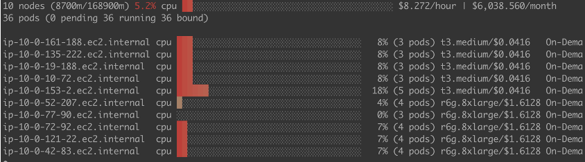
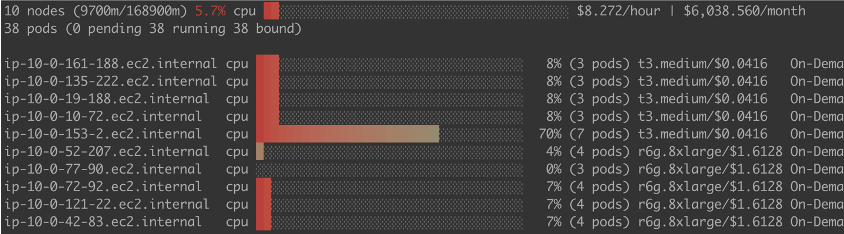

# Binpacking for Amazon EKS

## Introduction
By default, the [scheduling-plugin](https://kubernetes.io/docs/reference/scheduling/config/#scheduling-plugins) NodeResourcesFit use the ```LeastAllocated``` for score strategies. For the long running workloads, that is good because of high availability. But for batch jobs, like Spark workloads, this would have high cost. By changing the from ```LeastAllocated``` to ```MostAllocated```, it avoids spreading pods across all running nodes, leading to higher resource utilization and better cost efficiency. In this post, we will show you how to enable binpacking with Amazon EKS.


## Deploying the Solution
Please follow [this link](https://github.com/aws-samples/custom-scheduler-eks) to deploy the custom scheduler.


## Set up pod template to use the custom scheduler for Spark
We should add custom scheduler name to the pod template as follows
```bash
kind: Pod
spec:
  schedulerName: my-scheduler
  volumes:
    - name: spark-local-dir-1
      hostPath:
        path: /local1  
  initContainers:  
  - name: volume-permission
    image: public.ecr.aws/docker/library/busybox
    # grant volume access to hadoop user
    command: ['sh', '-c', 'if [ ! -d /data1 ]; then mkdir /data1;fi; chown -R 999:1000 /data1']  
    volumeMounts:
      - name: spark-local-dir-1
        mountPath: /data1
  containers:
  - name: spark-kubernetes-executor
    volumeMounts:
      - name: spark-local-dir-1
        mountPath: /data1
```


## Monitor via [eks-node-viewer](https://github.com/awslabs/eks-node-viewer)

Before apply the change in the pod template



After the change:  Higher CPU usage at pod schedule time


## Considerations

1.Monitoring and operation for the custom scheduler

We recommend setup the the monitoring for the custom scheduler and configure alerts for unhealthy status of custom scheduler. Please set the appropriate resources for the custom scheduler based on your workload size.