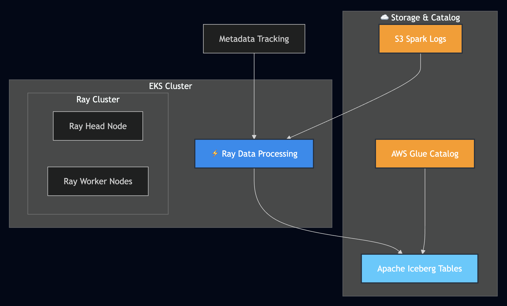

import Tabs from '@theme/Tabs';
import TabItem from '@theme/TabItem';
import CollapsibleContent from '../../../src/components/CollapsibleContent';

# 🚀 Ray Data Processing with Apache Iceberg

## Introduction

[Ray Data](https://docs.ray.io/en/latest/data/data.html) is a scalable, framework-agnostic data processing library built on top of Ray, designed for distributed data analytics and machine learning workloads. When integrated with [Apache Iceberg](https://iceberg.apache.org/), it provides a powerful solution for processing large-scale data with ACID transactions, schema evolution, and time travel capabilities.

This blueprint demonstrates how to deploy a **Ray Data** processing pipeline on Amazon EKS to process Spark application logs stored in S3 and write them to Apache Iceberg tables. The solution showcases intelligent metadata-driven processing with built-in idempotency and automatic folder discovery.

:::tip Why Ray Data with Iceberg?
- **Distributed Processing**: Ray Data enables parallel processing across multiple workers
- **ACID Guarantees**: Apache Iceberg provides transactional consistency for your data lake
- **Schema Evolution**: Easily evolve your data schema without rewriting entire datasets
- **Time Travel**: Query historical versions of your data
- **AWS Native**: Seamless integration with S3, Glue Catalog, and IAM
:::

## 📋 Architecture Overview




## 🎯 Key Features

<div className="feature-grid">
  <div className="feature-card">
    <h3>🔄 Distributed Processing</h3>
    <p>Ray Data enables scalable, parallel log processing across multiple workers with automatic load balancing</p>
  </div>
  <div className="feature-card">
    <h3>🧊 Apache Iceberg Integration</h3>
    <p>ACID transactions, schema evolution, and partitioning for reliable data lake storage</p>
  </div>
  <div className="feature-card">
    <h3>🎯 Intelligent Discovery</h3>
    <p>Automatically discovers and processes new Spark log folders with metadata tracking</p>
  </div>
  <div className="feature-card">
    <h3>♻️ Idempotent Execution</h3>
    <p>Tracks processing status to avoid reprocessing and enable failure recovery</p>
  </div>
</div>

## 🚀 Getting Started

### Prerequisites

Before deploying this blueprint, ensure you have:

- ✅ **EKS Cluster with Spark Operator**: Deploy the [Spark Operator with YuniKorn](./spark-operator-yunikorn) blueprint first
- ✅ **S3 bucket with Spark application logs**: Follow the [Put sample data in S3](./spark-operator-yunikorn#put-sample-data-in-s3) section to generate Spark logs
- ✅ **AWS CLI configured** with appropriate permissions
- ✅ **Terraform installed** (>= 1.0)

:::tip Generate Spark Logs First
The Ray Data pipeline processes Spark application logs. Make sure you've run the taxi-trip example from the [Spark Operator blueprint](./spark-operator-yunikorn#put-sample-data-in-s3) to populate your S3 bucket with logs at:
```
s3://${S3_BUCKET}/spark-application-logs/spark-team-a/spark-*/
```
:::

### Step 1: Enable Ray Data Processing

Enable the Ray Data processing module by setting the feature flag:

<Tabs>
<TabItem value="terraform" label="Using Terraform">

```bash
cd analytics/terraform/spark-k8s-operator

# Deploy with Ray Data support enabled
terraform plan -var="enable_raydata_processing=true"
terraform apply -var="enable_raydata_processing=true"
```

</TabItem>
<TabItem value="install-script" label="Using Install Script">

```bash
cd analytics/terraform/spark-k8s-operator

# Set environment variable and run install script
export TF_VAR_enable_raydata_processing=true
./install.sh
```

</TabItem>
</Tabs>

This deployment creates:
- 🎯 **KubeRay Operator** for Ray job orchestration
- 🔐 **Ray Service Account** with IRSA (IAM Roles for Service Accounts)
- 📝 **IAM Roles** with S3 and Glue permissions
- 📊 **AWS Glue Database** for Iceberg catalog
- 🌐 **Kubernetes Namespace** (`raydata`)

### Step 2: Configure the Example

Navigate to the example directory and update the S3 configuration:

```bash
cd examples/raydata-sparklogs-processing-job

# Edit execute-rayjob.sh and update:
S3_BUCKET="your-spark-logs-bucket"      # Your S3 bucket name
S3_PREFIX="spark-logs/spark-team-a"     # Path to Spark logs
```

### Step 3: Deploy the Ray Job

```bash
# Make script executable
chmod +x execute-rayjob.sh

# Deploy the processing job
./execute-rayjob.sh deploy
```

## 📁 Expected S3 Structure

Your Spark logs should be organized in S3 as follows:

```
s3://your-bucket/spark-logs/spark-team-a/
├── spark-1fce815b2d804b2caa6547718e20496c/
│   ├── driver.log
│   ├── executor-1.log
│   └── executor-2.log
├── spark-2abc123def456ghi789012345678901j/
│   ├── driver.log
│   └── executor-1.log
└── spark-3xyz789abc123def456789012345678/
    └── driver.log
```

## 📊 Monitoring and Verification

### Check Job Status

Monitor your Ray job with these commands:

```bash
# Monitor job progress in real-time
./execute-rayjob.sh monitor

# Check current status
./execute-rayjob.sh status

# View processing logs
./execute-rayjob.sh logs

# Verify processed data
./execute-rayjob.sh verify
```

### Access Ray Dashboard

<CollapsibleContent header={<h3>🎨 Ray Dashboard Access</h3>}>

```bash
# Get dashboard access info
./execute-rayjob.sh dashboard

# Port forward to local machine
kubectl port-forward svc/spark-log-processor-head-svc 8265:8265 -n raydata
```

Open http://localhost:8265 to view:
- 📈 Job execution progress
- 💻 Resource utilization
- ⚡ Task-level metrics
- 🌐 Cluster topology

</CollapsibleContent>

## ✅ Data Verification

### Option 1: Built-in Verification Tool

The easiest way to verify your processed data:

```bash
# Install PyIceberg dependencies (first time only)
pip install 'pyiceberg[glue,s3fs]==0.7.0' numpy pandas pyarrow

# Run verification
./execute-rayjob.sh verify
```

Expected output:
```
🔍 Verifying Ray Data processed logs in Iceberg...
✅ SUCCESS! Found 1287 records in Iceberg table

📋 Data Summary:
   📊 Total Records: 1287
   📅 Date Range: 2025-07-08 19:52:43 to 2025-07-08 20:00:29
   🏷️ Unique Apps: 1
   📱 Unique Pods: 5

📈 Log Level Distribution:
   INFO: 1269
   WARN: 14
   ERROR: 4
```

### Option 2: AWS CLI

Check table metadata without querying data:

```bash
# View Iceberg table in Glue catalog
aws glue get-table \
  --database-name raydata_spark_logs \
  --name spark_logs \
  --query 'Table.StorageDescriptor.Location'
```

## 🏗️ Processing Pipeline Features

<CollapsibleContent header={<h3>🔍 Intelligent Folder Discovery</h3>}>

The pipeline automatically:
- Scans S3 for folders matching `spark-*` pattern
- Discovers new log folders without manual intervention
- Tracks processing history in metadata table

</CollapsibleContent>

<CollapsibleContent header={<h3>📊 Metadata-Driven Processing</h3>}>

Built-in intelligence for reliable processing:
- Maintains processing status in Iceberg metadata table
- Skips already processed folders (idempotent execution)
- Enables reprocessing of failed folders
- Tracks record counts and processing times

</CollapsibleContent>

<CollapsibleContent header={<h3>🛡️ Schema Validation</h3>}>

Ensures data quality:
- Validates JSON log entries for required fields
- Filters out invalid or incomplete records
- Maintains consistent schema in output tables
- Handles timestamp precision for compatibility

</CollapsibleContent>

<CollapsibleContent header={<h3>⚡ Distributed Writing</h3>}>

Leverages Ray Data's capabilities:
- Native Iceberg integration for parallel writes
- Distributed processing across Ray workers
- ACID guarantees via Iceberg transactions
- Optimized for large-scale data processing

</CollapsibleContent>

## 📐 Data Schema

### Input Log Format (JSON Lines)

```json
{
  "timestamp": "2024-01-15T10:30:00.000Z",
  "log_level": "INFO",
  "message": "Application started",
  "kubernetes": {
    "pod_name": "spark-driver-xyz",
    "namespace_name": "spark-team-a",
    "labels": {
      "app": "spark-pi",
      "spark-app-selector": "spark-1fce815b2d804b2caa6547718e20496c"
    }
  }
}
```

### Output Iceberg Tables

<Tabs>
<TabItem value="data-table" label="Data Table">

```sql
-- Table: raydata_spark_logs.spark_logs
CREATE TABLE spark_logs (
  timestamp TIMESTAMP,
  log_level STRING,
  message STRING,
  pod_name STRING,
  namespace_name STRING,
  app STRING,
  spark_app_selector STRING,
  spark_role STRING,
  spark_version STRING,
  submission_id STRING
);
```

</TabItem>
<TabItem value="metadata-table" label="Metadata Table">

```sql
-- Table: raydata_spark_logs.spark_logs_processing_metadata
CREATE TABLE spark_logs_processing_metadata (
  spark_app_selector STRING,
  s3_path STRING,
  status STRING,  -- PROCESSING, SUCCESS, FAILED
  records_processed INT,
  processing_start_time TIMESTAMP,
  processing_end_time TIMESTAMP,
  error_message STRING,
  job_id STRING
);
```

</TabItem>
</Tabs>

## 🧹 Cleanup

To clean up resources:

```bash
# Remove Ray job only (preserve infrastructure)
./execute-rayjob.sh cleanup

# Remove all infrastructure
cd analytics/terraform/spark-k8s-operator
terraform destroy -var="enable_raydata_processing=true"
```

## 🔧 Troubleshooting

<CollapsibleContent header={<h3>❗ Common Issues and Solutions</h3>}>

**Issue**: `Namespace 'raydata' not found`
```bash
# Solution: Ensure Terraform deployment completed with Ray Data enabled
export TF_VAR_enable_raydata_processing=true
terraform apply
kubectl get namespace raydata
```

**Issue**: `no matches for kind 'RayJob'`
```bash
# Solution: KubeRay operator not installed
# Check that enable_raydata_processing=true and kuberay_operator is enabled
kubectl get pods -n kube-system | grep kuberay
```

**Issue**: `AccessDenied` errors
```bash
# Solution: Verify IAM permissions
kubectl get serviceaccount ray-service-account -n raydata -o yaml
# Check eks.amazonaws.com/role-arn annotation
```

**Issue**: `No module named 'pyiceberg'` during verification
```bash
# Solution: Install PyIceberg locally
pip install 'pyiceberg[glue,s3fs]==0.7.0' numpy pandas pyarrow
```

**Issue**: Schema compatibility errors
```bash
# Solution: Iceberg schema uses optional fields for PyArrow compatibility
# All fields are set to required=False in the schema definition
```

</CollapsibleContent>

## 🌟 Scale Your Data Pipeline

- **Scale Processing**: Adjust Ray worker counts in `rayjob.yaml` for larger workloads
- **Add Analytics**: Create dashboards using Amazon QuickSight or Grafana
- **Automate**: Schedule regular processing with Kubernetes CronJobs
- **Extend**: Process other data types like metrics, events, or application data

:::info Learn More
- 📚 [Ray Data Documentation](https://docs.ray.io/en/latest/data/data.html)
- 🧊 [Apache Iceberg Documentation](https://iceberg.apache.org/)
- 🎯 [KubeRay Documentation](https://ray-project.github.io/kuberay/)
- ☁️ [AWS Glue Catalog](https://docs.aws.amazon.com/glue/latest/dg/catalog-and-crawler.html)
:::

This blueprint demonstrates how Ray Data and Apache Iceberg can work together to build scalable, reliable data processing pipelines on Amazon EKS. The combination provides a modern data lake architecture with distributed processing capabilities, ACID transactions, and intelligent metadata management.

<style>{`
.feature-grid {
  display: grid;
  grid-template-columns: repeat(auto-fit, minmax(250px, 1fr));
  gap: 1.5rem;
  margin: 2rem 0;
}

.feature-card {
  padding: 1.5rem;
  border: 1px solid var(--ifm-color-emphasis-300);
  border-radius: 8px;
  background: var(--ifm-background-surface-color);
  transition: transform 0.2s, box-shadow 0.2s;
}

.feature-card:hover {
  transform: translateY(-2px);
  box-shadow: 0 4px 12px rgba(0, 0, 0, 0.1);
}

.feature-card h3 {
  margin-top: 0;
  margin-bottom: 0.5rem;
  font-size: 1.2rem;
}

.feature-card p {
  margin: 0;
  color: var(--ifm-color-content-secondary);
}
`}</style>
