import Tabs from '@theme/Tabs';
import TabItem from '@theme/TabItem';
import CollapsibleContent from '../../../src/components/CollapsibleContent';

# Distributed Data Processing with Ray Data

## What is Ray Data?

[Ray Data](https://docs.ray.io/en/latest/data/data.html) is a scalable, framework-agnostic data processing library built on top of Ray, designed for distributed data analytics and machine learning workloads. It provides:

- **Distributed Processing**: Parallel data processing across multiple Ray worker nodes
- **Lazy Evaluation**: Operations are optimized and executed only when results are needed
- **Rich Data Connectors**: Native support for various data sources including S3, databases, and file systems
- **Memory Management**: Efficient handling of large datasets that don't fit in memory
- **Integration with ML Libraries**: Seamless integration with pandas, NumPy, and PyArrow

## Why Ray Data? Is this an Alternative Tool to Spark?

Ray Data is **complementary to Spark**, not a direct replacement. While both are distributed data processing frameworks, they serve different use cases:


**Ray Data excels when you need:**
- Python-native data processing with familiar pandas/NumPy APIs
- Tight integration with machine learning pipelines
- Real-time or streaming data processing
- Complex iterative algorithms

**Spark remains ideal for:**
- Large-scale ETL operations
- Complex SQL-based analytics
- Enterprise data warehouse workloads
- Cross-language support (Scala, Java, Python, R)

### Problem Statement

When Apache Spark applications run on Kubernetes, they generate extensive logs that are captured by Fluent Bit and written to S3. However, these logs present several challenges for data engineers:

1. **Unstructured Format**: Spark logs are written as raw text files without a consistent schema
2. **No Query Capability**: Engineers cannot easily query logs using SQL-based tools like Amazon Athena
3. **Metadata Enrichment**: Fluent Bit adds Kubernetes metadata as JSON, creating mixed formats
4. **Performance Issues**: Scanning raw log files for troubleshooting is time-consuming and expensive

```mermaid
graph TB
    subgraph UL["<b>Unstructured Logs</b>"]
        Spark[Spark Applications] -->|Raw Logs| FB[Fluent Bit]
        FB -->|Enriched JSON| S3Raw[S3 Raw Logs]
        S3Raw -->|❌ No Schema| Query[Cannot Query Efficiently]
    end

    style Spark fill:#ff9800,color:#fff
    style FB fill:#2196F3,color:#fff
    style S3Raw fill:#f44336,color:#fff
    style Query fill:#9e9e9e,color:#fff
```



**Solution**: Use Ray Data to periodically process these unstructured logs, apply a consistent schema, and write them to Apache Iceberg tables. This enables:
- ✅ SQL queries via Amazon Athena
- ✅ Structured data with defined schema
- ✅ Efficient columnar storage format
- ✅ Time-travel and versioning capabilities

### Log Snippet in S3 Before Processing

Here's what Spark logs look like when written to S3 by Fluent Bit:

```json
{
  "log": "2024-01-15 14:23:45 INFO SparkContext: Running Spark version 3.5.0\n",
  "stream": "stdout",
  "time": "2024-01-15T14:23:45.123456Z",
  "kubernetes": {
    "pod_name": "spark-driver-abc123",
    "namespace_name": "spark-team-a",
    "pod_id": "12345678-1234-1234-1234-123456789012",
    "labels": {
      "spark-role": "driver",
      "spark-app-id": "spark-application-12345"
    },
    "container_name": "spark-driver",
    "container_image": "spark:3.5.0"
  }
}
{
  "log": "2024-01-15 14:23:46 INFO ResourceUtils: Using Spark's default log4j profile\n",
  "stream": "stdout",
  "time": "2024-01-15T14:23:46.234567Z",
  "kubernetes": {
    "pod_name": "spark-driver-abc123",
    "namespace_name": "spark-team-a",
    "pod_id": "12345678-1234-1234-1234-123456789012",
    "labels": {
      "spark-role": "driver",
      "spark-app-id": "spark-application-12345"
    },
    "container_name": "spark-driver",
    "container_image": "spark:3.5.0"
  }
}
```

**Key Challenges:**

- Each log line is wrapped in JSON with Kubernetes metadata
- The actual log message is embedded in the `log` field
- No structured schema for querying specific log levels or components
- Redundant metadata repeated for each log line

:::info Fluent Bit Enrichment
Fluent Bit automatically enriches each log line with Kubernetes metadata including pod name, namespace, labels, and container information. This enrichment is configured in the [aws-for-fluentbit-values.yaml](https://github.com/awslabs/data-on-eks/blob/main/analytics/terraform/spark-k8s-operator/helm-values/aws-for-fluentbit-values.yaml) file. While this metadata is valuable for debugging, it creates a mixed format that's difficult to query efficiently.
:::

## 📋 Architecture Overview

### How Ray Data Transforms Log Processing

Ray Data periodically fetches new logs from S3, processes them in parallel, and writes structured data to Apache Iceberg tables. The solution includes:


### Key Features of Ray Data Processing

#### 📊 **Schema Extraction and Parsing**

Ray Data intelligently extracts structured fields from unstructured logs:

- 🕐 **`timestamp`** - Parsed from the log message
- 🏷️ **`log_level`** - Extracted levels (INFO, WARN, ERROR, DEBUG)
- 🔧 **`component`** - Spark component (SparkContext, ResourceUtils, etc.)
- 📝 **`message`** - The actual log content
- 🏠 **`pod_name`** & **`namespace`** - From Kubernetes metadata
- 👷 **`spark_role`** - Driver or Executor identification
- 🆔 **`application_id`** - Unique Spark application identifier

#### 🔍 **Intelligent Filtering and Querying**

Once processed, you can easily query logs using SQL:

```sql
-- Find all ERROR logs for a specific application
SELECT timestamp, component, message
FROM spark_logs
WHERE log_level = 'ERROR'
  AND application_id = 'spark-application-12345'
  AND timestamp > '2024-01-15 00:00:00'
ORDER BY timestamp DESC;

-- Analyze log patterns by component
SELECT component, log_level, COUNT(*) as count
FROM spark_logs
WHERE namespace = 'spark-team-a'
GROUP BY component, log_level
ORDER BY count DESC;

-- Track application lifecycle events
SELECT timestamp, message
FROM spark_logs
WHERE component = 'SparkContext'
  AND (message LIKE '%Starting%' OR message LIKE '%Stopping%')
ORDER BY timestamp;
```

#### 🎯 **Metadata Management**

- ✅ **Idempotent Processing** - Tracks processed folders to avoid reprocessing
- 📋 **Metadata Table** - Maintains processing history and state
- 🔄 **Auto-Discovery** - Automatically finds new log folders in S3
- ⚡ **Incremental Updates** - Processes only new data for efficiency


## 🚀 Getting Started

### Prerequisites

Before deploying this blueprint, ensure you have:

- ✅ **S3 bucket with Spark application logs**: Follow the [Spark Operator blueprint](https://awslabs.github.io/data-on-eks/docs/blueprints/data-analytics/spark-operator-yunikorn) to generate Spark logs.
  **Note:** Execute the steps in **Put sample data in S3** section of the **Execute Sample Spark job with Karpenter** step to populate the S3 bucket with Spark Application Logs.
- ✅ **AWS CLI configured** with appropriate permissions
- ✅ kubectl
- ✅ **Terraform installed** (>= 1.0)

:::tip Generate Spark Logs First
The Ray Data pipeline processes Spark application logs. Make sure you've run the taxi-trip example from the [Spark Operator blueprint](https://awslabs.github.io/data-on-eks/docs/blueprints/data-analytics/spark-operator-yunikorn#put-sample-data-in-s3) to populate your S3 bucket with logs.

📁 **Spark Logfile Structure in S3:**
```
s3://${S3_BUCKET}/
└── spark-application-logs/
    └── spark-team-a/
        ├── spark-application-1234567890-driver/
        │   └── stdout
        ├── spark-application-1234567890-exec-1/
        │   └── stdout
        └── spark-application-1234567890-exec-2/
            └── stdout
```

Each `stdout` file contains JSON-formatted logs with Kubernetes metadata enrichment from Fluent Bit.
:::

### Step 1: Enable Ray Data Processing

Deploy the EKS cluster with Ray Data components by enabling the `enable_raydata` variable. This will install:
- **KubeRay Operator** - Manages Ray clusters on Kubernetes
- **Ray Custom Resources** - RayJob and RayCluster CRDs
- **AWS Resources** - IAM roles, S3 access policies, and Glue database
- **Ray Data Pipeline** - Namespace, service accounts, and RBAC

<Tabs>
<TabItem value="terraform" label="Using Terraform">

```bash
cd analytics/terraform/spark-k8s-operator

# Deploy EKS cluster with Ray Data support enabled
export TF_VAR_enable_raydata=true

terraform init
terraform plan
terraform apply -auto-approve
```

</TabItem>
<TabItem value="install-script" label="Using Install Script">

```bash
cd analytics/terraform/spark-k8s-operator

# Set environment variables and run install script
export TF_VAR_enable_raydata=true

./install.sh
```

</TabItem>
</Tabs>

:::info Deployment Time
The full deployment takes approximately 20-25 minutes to create the EKS cluster, install operators, and configure all Ray Data components.
:::

This deployment creates:
- 🎯 **KubeRay Operator** for Ray job orchestration
- 🔐 **Ray Service Account** with IRSA (IAM Roles for Service Accounts)
- 📝 **IAM Roles** with S3 and Glue permissions
- 📊 **AWS Glue Database** for Iceberg catalog
- 🌐 **Kubernetes Namespace** (`raydata`)

### Step 2: Verify KubeRay Operator Installation

Confirm that the KubeRay Operator is running successfully:

```bash
kubectl get po -n kuberay-operator
```

Expected output:
```
NAME                                READY   STATUS    RESTARTS   AGE
kuberay-operator-74fcdcc6bf-gpl5p   1/1     Running   0          10h
```

### Step 3: Configure Ray Job

Navigate to the example directory and update the S3 configuration in the deployment script.

```bash
cd examples/raydata-sparklogs-processing-job
```

Replace  **S3_BUCKET**, **CLUSTER_NAME** and **AWS_REGION** variables in the `execute-rayjob.sh` shell script before running.

### Step 4: Deploy the Ray Cluster & Execute Ray Job

```bash
# Make script executable
chmod +x execute-rayjob.sh

# Deploy the processing job
./execute-rayjob.sh deploy
```

## 📊 Monitoring the RayJob Deployment

### Check Job Status

Monitor your Ray job with these commands:

```bash
# Monitor job progress in real-time
./execute-rayjob.sh monitor

# Check current status
./execute-rayjob.sh status

# View processing logs
./execute-rayjob.sh logs

```

#### Check RayJob Logs

```text
2025-07-27 22:04:46,324 - spark-log-processor - INFO - ✅ Successfully processed 1287 records from spark-fb094270bf654473b372d0f773e86687
2025-07-27 22:04:46,324 - spark-log-processor - INFO - 🎯 Processing Summary:
2025-07-27 22:04:46,324 - spark-log-processor - INFO -   📊 Total records processed: 1287
2025-07-27 22:04:46,324 - spark-log-processor - INFO -   ✅ Successful folders: 1
2025-07-27 22:04:46,324 - spark-log-processor - INFO -   ❌ Failed folders: 0
2025-07-27 22:04:46,324 - spark-log-processor - INFO -   ✅ Successfully processed: ['spark-fb094270bf654473b372d0f773e86687']
2025-07-27 22:04:46,324 - spark-log-processor - INFO - ✅ Metadata-driven incremental processing completed
```

:::tip What's Happening Behind the Scenes?

When you deploy the RayJob, the following automated process occurs:

1. **🚀 Ray Cluster Initialization** - KubeRay Operator creates a Ray cluster with head and worker nodes
2. **🔍 S3 Discovery** - Ray Data scans the configured S3 bucket path for folders matching `spark-*` pattern
3. **📊 Metadata Check** - Queries the Iceberg metadata table to identify unprocessed folders
4. **📥 Parallel Processing** - Ray workers read JSON log files from S3 in parallel
5. **🔄 Data Transformation** - Extracts structured fields from JSON logs (timestamp, log level, component, etc.)
6. **✍️ Iceberg Writing** - Writes transformed data to Apache Iceberg tables with ACID guarantees
7. **📝 Metadata Update** - Records processing status in metadata table for idempotency
8. **🎯 Completion** - Shuts down Ray cluster after successful processing

The entire process is **idempotent** - you can safely re-run it without duplicating data, as it only processes new log folders.
:::

### Access Ray Dashboard

<CollapsibleContent header={<h3>🎨 Ray Dashboard Access</h3>}>

```bash
# Get dashboard access info
./execute-rayjob.sh dashboard

# Port forward to local machine
kubectl port-forward svc/spark-log-processor-head-svc 8265:8265 -n raydata
```

Open http://localhost:8265 to view:
- 📈 Job execution progress
- 💻 Resource utilization
- ⚡ Task-level metrics
- 🌐 Cluster topology

</CollapsibleContent>

## ✅ Data Verification

### S3 Bucket Structure

Ray Data uses the **same S3 bucket** for both input Spark logs and output Iceberg data, organized in separate paths:

```
s3://your-spark-logs-bucket/
├── spark-application-logs/           # 📥 Input: Raw Spark logs from Fluent Bit
│   └── spark-team-a/
│       ├── spark-application-1234567890-driver/
│       │   └── stdout                # JSON logs with Kubernetes metadata
│       ├── spark-application-1234567890-exec-1/
│       │   └── stdout
│       └── spark-application-1234567890-exec-2/
│           └── stdout
│
└── iceberg-warehouse/                # 📤 Output: Processed Iceberg data
    └── raydata_spark_logs.db/
        └── spark_logs/
            ├── metadata/             # Iceberg metadata files
            │   ├── 00000-xxx.metadata.json
            │   ├── snap-xxx.avro     # Snapshots for time travel
            │   └── version-hint.text
            └── data/                 # Actual data in Parquet format
                ├── 00000-0-xxx.parquet
                ├── 00001-0-xxx.parquet
                └── ...
```

:::tip Same Bucket, Different Paths
- **Input Path**: `s3://bucket/spark-application-logs/` - Contains raw JSON logs
- **Output Path**: `s3://bucket/iceberg-warehouse/` - Contains structured Parquet files
- **Storage Format**: Iceberg uses efficient columnar Parquet format with metadata for ACID transactions
:::

In AWS S3 Console, it should looks like below:


### Log Snippet After RayData Processing

Here's how the data transformation looks before and after Ray Data processing:

<Tabs>
<TabItem value="before" label="Before Processing (Raw S3 JSON)">

**Raw Fluent Bit logs in S3** - Each log line wrapped in JSON with redundant metadata:

```json
{
  "log": "2024-01-15 14:23:45 INFO SparkContext: Running Spark version 3.5.0\n",
  "stream": "stdout",
  "time": "2024-01-15T14:23:45.123456Z",
  "kubernetes": {
    "pod_name": "spark-driver-abc123",
    "namespace_name": "spark-team-a",
    "pod_id": "12345678-1234-1234-1234-123456789012",
    "labels": {
      "spark-role": "driver",
      "spark-app-id": "spark-application-12345"
    },
    "container_name": "spark-driver",
    "container_image": "spark:3.5.0"
  }
}
{
  "log": "2024-01-15 14:23:46 ERROR TaskSchedulerImpl: Lost executor 1: Container killed\n",
  "stream": "stderr",
  "time": "2024-01-15T14:23:46.234567Z",
  "kubernetes": {
    "pod_name": "spark-executor-def456",
    "namespace_name": "spark-team-a",
    "labels": {
      "spark-role": "executor",
      "spark-app-id": "spark-application-12345"
    }
  }
}
```

</TabItem>
<TabItem value="after" label="After Processing (Structured Iceberg)">

**Processed data in Apache Iceberg** - Clean, structured schema optimized for querying:

```sql
-- Query the processed data
SELECT * FROM raydata_spark_logs.spark_logs LIMIT 2;
```

| timestamp | log_level | component | message | pod_name | namespace | spark_role | application_id |
|-----------|-----------|-----------|---------|----------|-----------|------------|----------------|
| 2024-01-15 14:23:45 | INFO | SparkContext | Running Spark version 3.5.0 | spark-driver-abc123 | spark-team-a | driver | spark-application-12345 |
| 2024-01-15 14:23:46 | ERROR | TaskSchedulerImpl | Lost executor 1: Container killed | spark-executor-def456 | spark-team-a | executor | spark-application-12345 |

**✅ Key Improvements:**
- **Structured Fields** - Easy to query specific log levels, components, and time ranges
- **Deduplicated Metadata** - No redundant Kubernetes metadata per log line
- **Columnar Storage** - Efficient storage and query performance with Parquet format
- **Schema Evolution** - Add new fields without breaking existing queries
- **ACID Transactions** - Consistent reads even during concurrent processing

</TabItem>
</Tabs>

### Option 1: Query Iceberg Tables

Use the built-in data verification script provided in the blueprint that automatically sets up a Python virtual environment and all required dependencies:

 from your environment.

```bash
# Make script executable
chmod +x verify-iceberg-data.sh
```
Replace  **S3_BUCKET** and **AWS_REGION** variables in the `verify-iceberg-data.sh` shell script before running.

```bash
./verify-iceberg-data.sh
```

The script automatically...
- ✅ Creates an isolated Python virtual environment
- ✅ Installs PyIceberg and all dependencies (`pyiceberg[glue,s3fs]==0.7.0`)
- ✅ Connects to AWS Glue catalog and Iceberg tables
- ✅ Performs comprehensive data validation
- ✅ Cleans up temporary files and environment after completion

<CollapsibleContent header={<h4>📋 Sample Script Output</h4>}>

```text
🔍 Connecting to Iceberg catalog...
✅ Connected to Iceberg catalog in region: us-west-2
📊 Loading table: raydata_spark_logs.spark_logs
✅ Table loaded successfully

📋 Table Schema:
  - timestamp: timestamp (optional)
  - log_level: string (optional)
  - message: string (optional)
  - pod_name: string (optional)
  - namespace_name: string (optional)
  - app: string (optional)
  - spark_app_selector: string (optional)
  - queue: string (optional)
  - spark_app_name: string (optional)
  - spark_role: string (optional)
  - spark_version: string (optional)
  - submission_id: string (optional)
  - container_name: string (optional)
  - container_image: string (optional)

🔍 Scanning table data...
✅ SUCCESS! Found 1287 records in Iceberg table

📋 Data Summary:
   📊 Total Records: 1287
   📅 Date Range: 2025-07-08 19:52:43.079161 to 2025-07-08 20:00:29.393901
   📱 Unique Pods: 5

📈 Log Level Distribution:
   INFO: 1269
   WARN: 14
   ERROR: 4

📝 Sample Records:

  Record 1:
    timestamp: 2025-07-08 19:52:43.079161
    log_level: WARN
    message: Unable to load native-hadoop library for your platform... using builtin-java classes where applicabl...

  Record 2:
    timestamp: 2025-07-08 19:52:43.460063
    log_level: WARN
    message: Cannot locate configuration: tried hadoop-metrics2-s3a-file-system.properties,hadoop-metrics2.proper...

  Record 3:
    timestamp: 2025-07-08 19:52:46.170113
    log_level: INFO
    message: Running Spark version 3.5.3

🎉 VERIFICATION SUCCESSFUL!
✅ Ray Data successfully processed and stored Spark logs in Iceberg format
✅ Data is accessible and queryable via PyIceberg
✅ You can now query this data using Amazon Athena or other SQL tools
[SUCCESS] Verification completed successfully!
==== Cleaning Up ====
[INFO] Removed verification script
[INFO] Removed virtual environment
[SUCCESS] Cleanup completed
```

</CollapsibleContent>


### Option 2: Use AWS CLI

Check table metadata without querying data:

```bash
# View Iceberg table in Glue catalog
aws glue get-table \
  --database-name raydata_spark_logs \
  --name spark_logs \
  --query 'Table.StorageDescriptor.Location'
```

## 🧹 Cleanup

To clean up resources:

```bash
# Remove Ray job only (preserve infrastructure)
./execute-rayjob.sh cleanup

# Remove all infrastructure
cd analytics/terraform/spark-k8s-operator
terraform destroy -var="enable_raydata_processing=true"
```

## 🌟 Scale Your Data Pipeline

- **Scale Processing**: Adjust Ray worker counts in `rayjob.yaml` for larger workloads
- **Add Analytics**: Create dashboards using Amazon QuickSight or Grafana
- **Automate**: Schedule regular processing with Kubernetes CronJobs
- **Extend**: Process other data types like metrics, events, or application data

:::info Learn More
- 📚 [Ray Data Documentation](https://docs.ray.io/en/latest/data/data.html)
- 🧊 [Apache Iceberg Documentation](https://iceberg.apache.org/)
- 🎯 [KubeRay Documentation](https://ray-project.github.io/kuberay/)
- ☁️ [AWS Glue Catalog](https://docs.aws.amazon.com/glue/latest/dg/catalog-and-crawler.html)
:::

This blueprint demonstrates how Ray Data and Apache Iceberg can work together to build scalable, reliable data processing pipelines on Amazon EKS. The combination provides a modern data lake architecture with distributed processing capabilities, ACID transactions, and intelligent metadata management.

<style>{`
.feature-grid {
  display: grid;
  grid-template-columns: repeat(auto-fit, minmax(250px, 1fr));
  gap: 1.5rem;
  margin: 2rem 0;
}

.feature-card {
  padding: 1.5rem;
  border: 1px solid var(--ifm-color-emphasis-300);
  border-radius: 8px;
  background: var(--ifm-background-surface-color);
  transition: transform 0.2s, box-shadow 0.2s;
}

.feature-card:hover {
  transform: translateY(-2px);
  box-shadow: 0 4px 12px rgba(0, 0, 0, 0.1);
}

.feature-card h3 {
  margin-top: 0;
  margin-bottom: 0.5rem;
  font-size: 1.2rem;
}

.feature-card p {
  margin: 0;
  color: var(--ifm-color-content-secondary);
}
`}</style>
