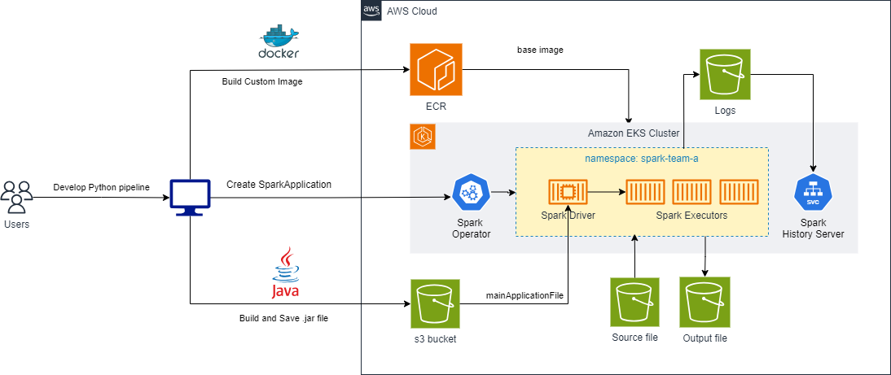

import Tabs from '@theme/Tabs';
import TabItem from '@theme/TabItem';
import CollapsibleContent from '../../../src/components/CollapsibleContent';

import CodeBlock from '@theme/CodeBlock';

# Run Apache Beam pipelines with Spark on EKS

[Apache Beam (Beam)](https://beam.apache.org/get-started/beam-overview/) is a flexible programming model for building batch and streaming data processing pipelines.  With Beam, developers can write code once and run it on various execution engines, such as *Apache Spark* and *Apache Flink*. This flexibility allows organizations to leverage the strengths of different execution engines while maintaining a consistent codebase, reducing the complexity of managing multiple codebases and minimizing the risk of vendor lock-in.

## Beam on Amazon EKS

The Spark Operator for Kubernetes simplifies the deployment and management of Apache Spark on Kubernetes. By using the Spark Operator, we can directly submit Apache Beam pipelines as Spark Applications and deploy and manage them on EKS cluster, taking advantage of features such as automatic scaling and self-healing capabilities on the robust and managed infrastructure of EKS.

## Solution overview

In this solution, we will show how to deploy your Beam pipeline, written in Python, on an EKS cluster with Spark Operator.  It uses the example pipeline from Apache Beam [github repo](https://github.com/apache/beam/tree/master/sdks/python).



## Deploy Beam pipeline

<CollapsibleContent header={<h2><span>Deploying the Spark-Operator-on-EKS solution</span></h2>}>

In this [example](https://github.com/awslabs/data-on-eks/tree/main/analytics/terraform/spark-k8s-operator), you will provision the following resources required to run Spark Jobs with open source Spark Operator.

It deploys an EKS Cluster running the Spark K8s Operator into a new VPC.

- Creates a new sample VPC, 2 Private Subnets, 2 Public Subnets, and 2 subnets in the RFC6598 space (100.64.0.0/10) for EKS Pods.
- Creates Internet gateway for Public Subnets and NAT Gateway for Private Subnets
- Creates EKS Cluster Control plane with public endpoint (for demo reasons only) with Managed Node Groups for benchmarking and core services, and Karpenter NodePools for Spark workloads.
- Deploys Metrics server, Spark-operator, Apache Yunikorn, Karpenter, Grafana and Prometheus server.

### Prerequisites

Ensure that you have installed the following tools on your machine.

1. [aws cli](https://docs.aws.amazon.com/cli/latest/userguide/install-cliv2.html)
2. [kubectl](https://Kubernetes.io/docs/tasks/tools/)
3. [terraform](https://learn.hashicorp.com/tutorials/terraform/install-cli)

### Deploy

Clone the repository.

```bash
git clone https://github.com/awslabs/data-on-eks.git
cd data-on-eks
export DOEKS_HOME=$(pwd)
```

If DOEKS_HOME is ever unset, you can always set it manually using `export
DATA_ON_EKS=$(pwd)` from your data-on-eks directory.

Navigate into one of the example directories and run `install.sh` script.

```bash
cd ${DOEKS_HOME}/analytics/terraform/spark-k8s-operator
chmod +x install.sh
./install.sh
```

Now create an `S3_BUCKET` variable that holds the name of the bucket created
during the install. This bucket will be used in later examples to store output
data. If S3_BUCKET is ever unset, you can run the following commands again.

```bash
export S3_BUCKET=$(terraform output -raw s3_bucket_id_spark_history_server)
echo $S3_BUCKET
```

</CollapsibleContent>

### Step 1: Build custom Docker Image with Spark and Beam SDK

Create a custom spark runtime image from the office spark base image, with a Python virtual environment and Apache Beam SDK pre-installed.

- Review the sample [Dockerfile](https://github.com/awslabs/data-on-eks/blob/main/analytics/terraform/spark-k8s-operator/examples/beam/Dockerfile)
- Customize the Dockerfile as needed for your environment
- Build the Docker image and push the image to ECR

```sh
cd examples/beam
aws ecr create-repository --repository-name beam-spark-repo --region us-east-1
docker build . --tag ${ACCOUNT_ID}.dkr.ecr.us-east-1.amazonaws.com/beam-spark-repo:eks-beam-image --platform linux/amd64,linux/arm64
aws ecr get-login-password --region us-east-1 | docker login --username AWS --password-stdin ${ACCOUNT_ID}.dkr.ecr.us-east-1.amazonaws.com
docker push ${ACCOUNT_ID}.dkr.ecr.us-east-1.amazonaws.com/beam-spark-repo:eks-beam-image
```

We have created a docker image and published in ECR.

### Step 2: Build and package the Beam pipeline with dependencies

With python 3.11 installed, create a Python virtual environment and install dependencies required for building the Beam pipeline:

```sh
python3 -m venv build-environment && \
source build-environment/bin/activate && \
python3 -m pip install --upgrade pip && \
python3 -m pip install apache_beam==2.58.0 \
    s3fs \
    boto3

```

Download the [wordcount.py](https://raw.githubusercontent.com/apache/beam/master/sdks/python/apache_beam/examples/wordcount.py) example pipeline and the sample input file. The wordcount Python example demonstrates an Apache Beam pipeline with the following stages: read files, split words, map, group, and sum word counts, and write output to files.

```sh
curl -O https://raw.githubusercontent.com/apache/beam/master/sdks/python/apache_beam/examples/wordcount.py

curl -O https://raw.githubusercontent.com/cs109/2015/master/Lectures/Lecture15b/sparklect/shakes/kinglear.txt
```

Upload the input text file to the S3 bucket.

```sh
aws s3 cp kinglear.txt s3://${S3_BUCKET}/
```

To run an Apache Beam Python pipeline on Spark, you may package the pipeline and all its dependencies into a single jar file.  Use the below command to create the "fat" jar for the wordcount pipeline with all parameters, without actually executing the pipeline:

```sh
python3 wordcount.py --output_executable_path=./wordcountApp.jar \ --runner=SparkRunner \ --environment_type=PROCESS \ --environment_config='{"command":"/opt/apache/beam/boot"}' \ --input=s3://${S3_BUCKET}/kinglear.txt \ --output=s3://${S3_BUCKET}/output.txt
```

Upload the jar file to the S3 bucket to be used by the spark application.

```sh
aws s3 cp wordcountApp.jar s3://${S3_BUCKET}/app/
```
### Step 3: Create and run the pipeline as SparkApplication

In this step, we create the manifest file for the SparkApplication object to submit the Apache Beam pipeline as a Spark application. Run the below commands to create a BeamApp.yaml file substituting the ACCOUNT_ID and S3_BUCKET values from the build environment.

```sh
envsubst < beamapp.yaml > beamapp.yaml
```

This command will replace the env variables in file beamapp.yaml.

### Step 4: Execute Spark Job

Apply the YAML configuration file to create the SparkApplication on your EKS cluster to execute the Beam pipeline:

```sh
kubectl apply -f beamapp.yaml
```


### Step 5: Monitor and review the pipeline job

Monitor and review the pipeline job
The word count Beam pipeline may take a couple of minutes to execute.  There are a few ways to monitor its status and review job details.

1. We can use the Spark history server to check the running job

We used the spark-k8s-operator pattern to create the EKS cluster, which had already installed and configured a spark-history-server.  Run the command below to start port-forwarding, then click the Preview menu and select Preview Running Application:

```sh
kubectl port-forward svc/spark-history-server 8080:80 -n spark-history-server
```

Open a new browser window and go to this address: http://127.0.0.1:8080/.

2.	Once the job completes successfully, in about 2 minutes, the output files (output.txt-*) containing words found in the input text and the count of each occurrence can be downloaded from the S3 bucket by running the below commands to copy the outputs to your build environment.

```sh
mkdir job_output &&  cd job_output
aws s3 sync s3://$S3_BUCKET/ . --include "output.txt-*" --exclude "kinglear*" --exclude app/*
```

Output looks like below:

```
...
particular: 3
wish: 2
Either: 3
benison: 2
Duke: 30
Contending: 1
say'st: 4
attendance: 1
...
```

<CollapsibleContent header={<h2><span>Cleanup</span></h2>}>

:::caution
To avoid unwanted charges to your AWS account, delete all the AWS resources created during this deployment
:::

## Delete the ECR Repository

```bash
aws ecr delete-repository --repository-name beam-spark-repo --region us-east-1 --force
```

## Delete the EKS cluster

This script will cleanup the environment using `-target` option to ensure all the resources are deleted in correct order.

```bash
cd ${DOEKS_HOME}/analytics/terraform/spark-k8s-operator && chmod +x cleanup.sh
./cleanup.sh
```

</CollapsibleContent>
