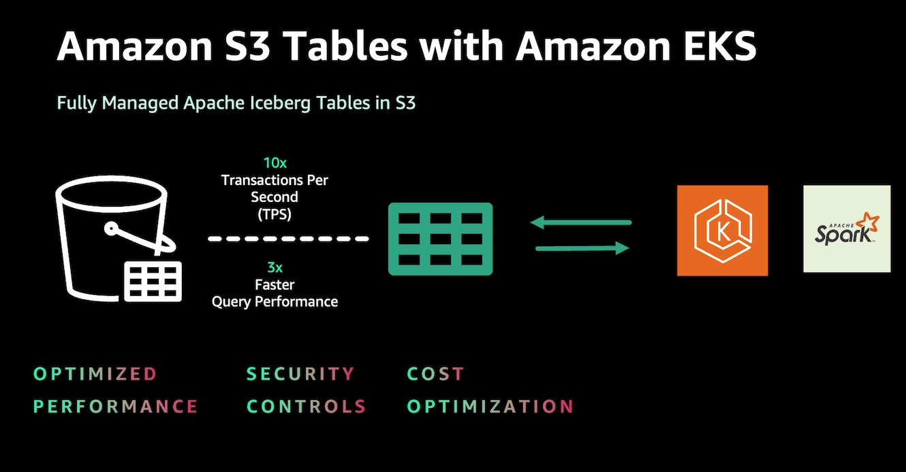
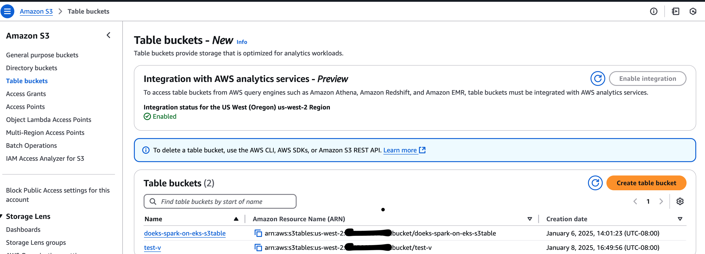
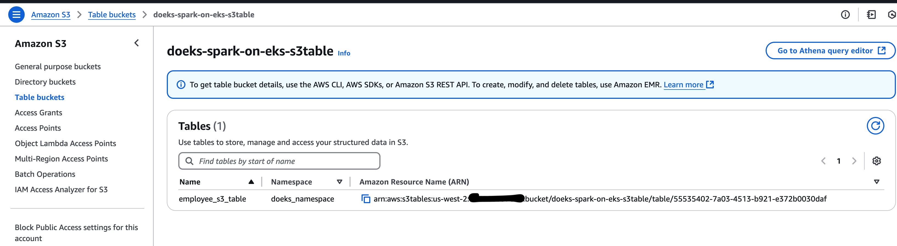
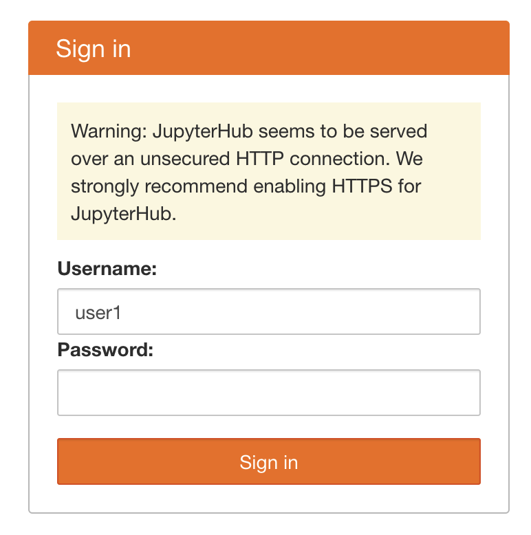
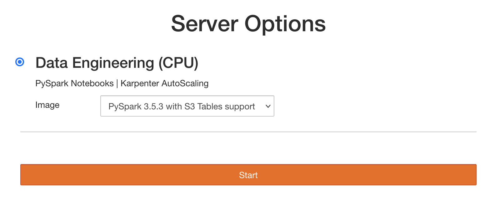
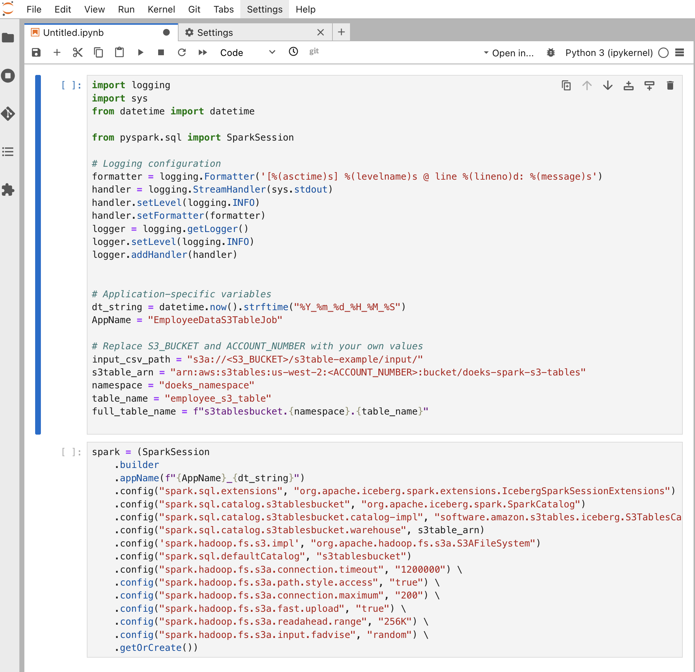

import Tabs from '@theme/Tabs';
import TabItem from '@theme/TabItem';
import CollapsibleContent from '../../../src/components/CollapsibleContent';

import TaxiTripExecute from './_taxi_trip_exec.md'
import ReplaceS3BucketPlaceholders from './_replace_s3_bucket_placeholders.mdx';

import CodeBlock from '@theme/CodeBlock';

# S3 Tables with Amazon EKS




## What is S3 Tables?

Amazon S3 Tables is a fully managed tabular data store purpose-built to optimize performance, simplify security, and provide cost-efficient storage for large-scale analytics workloads. It integrates directly with services like Amazon EMR, Amazon Athena, Amazon Redshift, AWS Glue, and AWS Lake Formation, offering a seamless experience for running analytics and machine learning workloads.

## Why Run S3 Tables on Amazon EKS?

For users who have adopted Amazon EKS for Spark workloads and are using table formats like Iceberg, leveraging S3 Tables offers advantages in performance, cost-efficiency, and security controls. This integration allows organizations to combine Kubernetes-native features with the capabilities of S3 Tables, potentially improving query performance and resource scaling within their existing environment. By following the steps detailed in this document, users can seamlessly integrate S3 Tables into their EKS setup, providing a flexible and complementary solution for analytics workloads.

## How S3 Tables Differ from Iceberg Table Format

While S3 Tables use Apache Iceberg as an underlying implementation, they offer enhanced capabilities specifically designed for AWS customers:

- **🛠️ Automatic Compaction**: S3 Tables implements automatic compaction, which intelligently optimizes data storage in the background by combining smaller files into larger, more efficient ones. This process reduces storage costs, improves query speed, and operates continuously without manual intervention.

- 🔄 **Table Maintenance**: It offers critical maintenance tasks like snapshot management and unreferenced file removal. This continuous optimization ensures that tables remain performant and cost-effective without manual intervention, reducing operational overhead and allowing teams to focus on data insights.

- ❄️ **Apache Iceberg Support**: Offers built-in support for Apache Iceberg, which simplifies managing data lakes at scale while improving query performance and reducing costs. Consider using S3 Tables for your data lake if you want to experience the following results.

- 🔒 **Simplified Security**: S3 Tables treat your tables as AWS resources, enabling fine-grained AWS Identity and Access Management (IAM) permissions at the table level. This simplifies data governance, enhances security, and makes access control more intuitive and manageable with your familiar AWS services.

- ⚡ **Enhanced Performance**: Amazon S3 Tables introduce a new type of bucket, purpose-built for storing Apache Iceberg tables. Table buckets deliver up to 3x faster query performance and up to 10x higher transactions per second compared to storing Iceberg tables in general-purpose S3 buckets. This performance enhancement supports high-frequency updates, real-time ingestion, and more demanding workloads, ensuring scalability and responsiveness as data volumes grow.

- 🛠️ **Integration with AWS Services**: S3 Tables are tightly integrated with AWS analytics services such as Athena, Redshift, EMR, and Glue, providing native support for analytics workloads.


<CollapsibleContent header={<h2><span>Deploying the Solution</span></h2>}>

In this [example](https://github.com/awslabs/data-on-eks/tree/main/analytics/terraform/spark-k8s-operator), you will provision the following resources required to run Spark Jobs with open source Spark Operator and Apache YuniKorn.

This example deploys an EKS Cluster running the Spark K8s Operator into a new VPC.

- Creates a new sample VPC, 2 Private Subnets, 2 Public Subnets, and 2 subnets in the RFC6598 space (100.64.0.0/10) for EKS Pods.
- Creates Internet gateway for Public Subnets and NAT Gateway for Private Subnets
- Creates EKS Cluster Control plane with public endpoint (for demo reasons only) with Managed Node Groups for benchmarking and core services, and Karpenter NodePools for Spark workloads.
- Deploys Metrics server, Spark-operator, Apache Yunikorn, Karpenter, Grafana and Prometheus server.

### Prerequisites

Ensure that you have installed the following tools on your machine.

1. [aws cli](https://docs.aws.amazon.com/cli/latest/userguide/install-cliv2.html)
2. [kubectl](https://Kubernetes.io/docs/tasks/tools/)
3. [terraform](https://learn.hashicorp.com/tutorials/terraform/install-cli)

### Deploy

Clone the repository.

```bash
git clone https://github.com/awslabs/data-on-eks.git
cd data-on-eks
export DOEKS_HOME=$(pwd)
```

If DOEKS_HOME is ever unset, you can always set it manually using `export
DATA_ON_EKS=$(pwd)` from your data-on-eks directory.

Navigate into one of the example directories and run `install.sh` script.

```bash
cd ${DOEKS_HOME}/analytics/terraform/spark-k8s-operator
chmod +x install.sh
./install.sh
```

Now create an `S3_BUCKET` variable that holds the name of the bucket created
during the install. This bucket will be used in later examples to store output
data. If S3_BUCKET is ever unset, you can run the following commands again.

```bash
export S3_BUCKET=$(terraform output -raw s3_bucket_id_spark_history_server)
echo $S3_BUCKET
```

</CollapsibleContent>

## Execute Sample Spark job

### Step 1: Create the S3 Tables compatible Apache Spark Docker Image

Create a Docker image with necessary jars for S3 tables communication.

- Review the sample [Dockerfile](https://github.com/awslabs/data-on-eks/blob/main/analytics/terraform/spark-k8s-operator/examples/s3-tables/Dockerfile-S3Table)
- Note the [key jar files](https://github.com/awslabs/data-on-eks/blob/e3f1a6b08d719fc69f61d18b57cd5ad09cb01bd5/analytics/terraform/spark-k8s-operator/examples/s3-tables/Dockerfile-S3Table#L43C1-L48C1) for S3 Tables interaction, including Iceberg, AWS SDK bundle, and S3 Tables Catalog for Iceberg runtime
- Customize the Dockerfile as needed for your environment
- Build the Docker image and push the image to your preferred container registry

We have created a docker image and published in ECR for the demo purpose only.

### Step 2: Create Test Data for the job

Navigate to the example directory and generate sample employee data for Spark job input using this [shell](https://github.com/awslabs/data-on-eks/blob/main/analytics/terraform/spark-k8s-operator/examples/s3-tables/input-data-gen.sh) script.

```sh
cd analytics/terraform/spark-k8s-operator/examples/s3-tables
./input-data-gen.sh
```

This script will create a file named `employee_data.csv` in your current directory. By default, it generates 100 records.

Note: If you need to adjust the number of records, you can modify the input-data-gen.sh script. Look for the loop that generates the data and change the iteration count as needed.

### Step 3: Upload Test Input data to Amazon S3 Bucket

Replace `<YOUR_S3_BUCKET>` with the name of the S3 bucket created by your blueprint and run the below command.

```bash
aws s3 cp employee_data.csv s3://<S3_BUCKET>/s3table-example/input/
```

This command will upload the CSV file to your S3 bucket. The Spark job will later reference this path to read the input data. Ensure you have the necessary permissions to write to this bucket before executing the command.

### Step 4: Upload PySpark Script to S3 Bucket

The following script is the snippet of the [Spark job](https://github.com/awslabs/data-on-eks/blob/main/analytics/terraform/spark-k8s-operator/examples/s3-tables/s3table-iceberg-pyspark.py) where you can see the Spark config required to work with S3 Tables.

```python
def main(args):
    if len(args) != 3:
        logger.error("Usage: spark-etl [input-csv-path] [s3table-arn]")
        sys.exit(1)

    # Input parameters
    input_csv_path = args[1]    # Path to the input CSV file
    s3table_arn = args[2]       # s3table arn

    # Initialize Spark session
    logger.info("Initializing Spark Session")
    spark = (SparkSession
             .builder
             .appName(f"{AppName}_{dt_string}")
             .config("spark.sql.extensions", "org.apache.iceberg.spark.extensions.IcebergSparkSessionExtensions")
             .config("spark.sql.catalog.s3tablesbucket", "org.apache.iceberg.spark.SparkCatalog")
             .config("spark.sql.catalog.s3tablesbucket.catalog-impl", "software.amazon.s3tables.iceberg.S3TablesCatalog")
             .config("spark.sql.catalog.s3tablesbucket.warehouse", s3table_arn)
             .config('spark.hadoop.fs.s3.impl', "org.apache.hadoop.fs.s3a.S3AFileSystem")
             .config("spark.sql.defaultCatalog", "s3tablesbucket")
             .getOrCreate())

    spark.sparkContext.setLogLevel("INFO")
    logger.info("Spark session initialized successfully")

    namespace = "doeks_namespace"
    table_name = "employee_s3_table"
    full_table_name = f"s3tablesbucket.{namespace}.{table_name}"

...

```

Replace `S3_BUCKET` with the name of the S3 bucket created by your blueprint and run the below command to upload sample [Spark job](https://github.com/awslabs/data-on-eks/blob/main/analytics/terraform/spark-k8s-operator/examples/s3-tables/s3table-iceberg-pyspark.py) to S3 buckets.

```bash
aws s3 cp s3table-iceberg-pyspark.py s3://<S3_BUCKET>/s3table-example/scripts/
```

Navigate to example directory and submit the Spark job.

### Step 5: Create Amazon S3 table bucket

This is the main step where you will create an S3 table bucket that will be used for S3 Tables, which your PySpark job will access later.

Replace `<S3TABLE_BUCKET_NAME>` with your desired bucket name. Replace `<REGION>` with your AWS region.


```bash
aws s3tables create-table-bucket \
    --region "<REGION>" \
    --name "<S3TABLE_BUCKET_NAME>"
```

 Make note of the S3TABLE BUCKET ARN generated by this command. Verify the S3 table bucket ARN from AWS Console.



### Step 6: Update Spark Operator YAML File

Update the Spark Operator YAML file as below:

- Open [s3table-spark-operator.yaml](https://github.com/awslabs/data-on-eks/blob/main/analytics/terraform/spark-k8s-operator/examples/s3-tables/s3table-spark-operator.yaml) file in your preferred text editor.
- Replace `<S3_BUCKET>` with your S3 bucket created by this blueprint(Check Terraform outputs). S3 bucket is the place where you copied the test data and sample spark job in the above steps.
- REPLACE `<S3TABLE_BUCKET_ARN>` with your S3 table bucket ARN captured in the previous step.

You can see the snippet of Spark Operator Job config below.


```yaml
---
apiVersion: "sparkoperator.k8s.io/v1beta2"
kind: SparkApplication
metadata:
  name: "s3table-example"
  namespace: spark-team-a
  labels:
    app: "s3table-example"
    applicationId: "s3table-example-nvme"
spec:
  type: Python
  sparkVersion: "3.5.3"
  mode: cluster
  # CAUTION: Unsupported test image
  # This image is created solely for testing and reference purposes.
  # Before use, please:
  # 1. Review the Dockerfile used to create this image
  # 2. Create your own image that meets your organization's security requirements
  image: "public.ecr.aws/data-on-eks/spark:3.5.3-scala2.12-java17-python3-ubuntu-s3table0.1.3-iceberg1.6.1"
  imagePullPolicy: IfNotPresent
  mainApplicationFile: "s3a://<S3_BUCKET>/s3table-example/scripts/s3table-iceberg-pyspark.py"
  arguments:
    - "s3a://<S3_BUCKET>/s3table-example/input/"
    - "<S3TABLE_BUCKET_ARN>"
  sparkConf:
    "spark.app.name": "s3table-example"
    "spark.kubernetes.driver.pod.name": "s3table-example"
    "spark.kubernetes.executor.podNamePrefix": "s3table-example"
    "spark.local.dir": "/data"
    "spark.speculation": "false"
    "spark.network.timeout": "2400"
    "spark.hadoop.fs.s3a.connection.timeout": "1200000"
    "spark.hadoop.fs.s3a.path.style.access": "true"
    "spark.hadoop.fs.s3a.connection.maximum": "200"
    "spark.hadoop.fs.s3a.fast.upload": "true"
    "spark.hadoop.fs.s3a.readahead.range": "256K"
    "spark.hadoop.fs.s3a.input.fadvise": "random"
    "spark.hadoop.fs.s3a.aws.credentials.provider.mapping": "com.amazonaws.auth.WebIdentityTokenCredentialsProvider=software.amazon.awssdk.auth.credentials.WebIdentityTokenFileCredentialsProvider"
    "spark.hadoop.fs.s3a.aws.credentials.provider": "software.amazon.awssdk.auth.credentials.WebIdentityTokenFileCredentialsProvider"  # AWS SDK V2 https://hadoop.apache.org/docs/stable/hadoop-aws/tools/hadoop-aws/aws_sdk_upgrade.html
...

```

### Step 7: Execute Spark Job

Apply the updated YAML configuration file to your Kubernetes cluster to submit and execute the Spark job:

```bash
cd ${DOEKS_HOME}/analytics/terraform/spark-k8s-operator/examples/s3-tables
kubectl apply -f s3table-spark-operator.yaml
```

This will schedule the Spark job on the EKS cluster. Spark Operator handles submitting the job to the Kubernetes API Server.

Kubernetes will schedule the Spark driver and executor pods to run on separate worker nodes. Karpenter will automatically provision new nodes if required, based on the nodepool configuration in the Terraform scripts.

Monitor the logs of the Spark driver pod to track job progress. The pods default to `c5d` instances, but you can modify the YAML and Karpenter nodepool to use different EC2 instance types if needed.

### Step 8: Verify the Spark Driver log for the output

List the pods running under the spark-team-a namespace:

```bash
kubectl get pods -n spark-team-a
```

Verify the driver logs to see the full output of the Spark job. The job reads the CSV data from the S3 bucket and writes it back to the S3 Tables bucket using the Iceberg format. It also counts the number of records processed and displays the first 10 records:

```bash
kubectl logs <spark-driver-pod-name> -n spark-team-a
```

You should see the Spark driver pod transition to a `Succeeded` state when the job completes successfully and the log should show output like below.

```text
...
[2025-01-07 22:07:44,185] INFO @ line 59: Previewing employee data schema
root
 |-- id: integer (nullable = true)
 |-- name: string (nullable = true)
 |-- level: string (nullable = true)
 |-- salary: double (nullable = true)

....

25/01/07 22:07:44 INFO CodeGenerator: Code generated in 10.594982 ms
+---+-----------+------+--------+
|id |name       |level |salary  |
+---+-----------+------+--------+
|1  |Employee_1 |Mid   |134000.0|
|2  |Employee_2 |Senior|162500.0|
|3  |Employee_3 |Senior|174500.0|
|4  |Employee_4 |Exec  |69500.0 |
|5  |Employee_5 |Senior|54500.0 |
|6  |Employee_6 |Mid   |164000.0|
|7  |Employee_7 |Junior|119000.0|
|8  |Employee_8 |Senior|54500.0 |
|9  |Employee_9 |Senior|57500.0 |
|10 |Employee_10|Mid   |152000.0|
+---+-----------+------+--------+
only showing top 10 rows

....
```

You should see a new Table and Namespace once the job is successful as shown in the image below.




The following commands will show the additional information on the S3 Tables.

### Verify the S3Table using S3Table API

Use the S3Table API to confirm the table was created successfully. Just replace the `<ACCOUNT_ID>` and run the command.

```bash
aws s3tables get-table --table-bucket-arn arn:aws:s3tables:<REGION>:<ACCOUNT_ID>:bucket/doeks-spark-on-eks-s3table \
--namespace doeks_namespace \
--name employee_s3_table
```

Output looks like below:

```text
Output looks like below.

{
    "name": "employee_s3_table",
    "type": "customer",
    "tableARN": "arn:aws:s3tables:us-west-2:<ACCOUNT_ID>:bucket/doeks-spark-on-eks-s3table/table/55511111-7a03-4513-b921-e372b0030daf",
    "namespace": [
        "doeks_namespace"
    ],
    "versionToken": "aafc39ddd462690d2a0c",
    "metadataLocation": "s3://55511111-7a03-4513-asdfsafdsfdsf--table-s3/metadata/00004-62cc4be3-59b5-4647-a78d-1cdf69ec5ed8.metadata.json",
    "warehouseLocation": "s3://55511111-7a03-4513-asdfsafdsfdsf--table-s3",
    "createdAt": "2025-01-07T22:14:48.689581+00:00",
    "createdBy": "<ACCOUNT_ID>",
    "modifiedAt": "2025-01-09T00:06:09.222917+00:00",
    "ownerAccountId": "<ACCOUNT_ID>",
    "format": "ICEBERG"
}
```

### Monitor the table maintenance job status:

```bash
aws s3tables get-table-maintenance-job-status --table-bucket-arn arn:aws:s3tables:us-west-2:"\<ACCOUNT_ID>:bucket/doeks-spark-on-eks-s3table --namespace doeks_namespace --name employee_s3_table
```

This command provides information about Iceberg compaction, snapshot management, and unreferenced file removal processes.

```json
{
    "tableARN": "arn:aws:s3tables:us-west-2:<ACCOUNT_ID>:bucket/doeks-spark-on-eks-s3table/table/55511111-7a03-4513-b921-e372b0030daf",
    "status": {
        "icebergCompaction": {
            "status": "Successful",
            "lastRunTimestamp": "2025-01-08T01:18:08.857000+00:00"
        },
        "icebergSnapshotManagement": {
            "status": "Successful",
            "lastRunTimestamp": "2025-01-08T22:17:08.811000+00:00"
        },
        "icebergUnreferencedFileRemoval": {
            "status": "Successful",
            "lastRunTimestamp": "2025-01-08T22:17:10.377000+00:00"
        }
    }
}

```


:::info

To work with S3 Tables on EKS, both Node-level policies and Pod-level policies are required.

	1.	**Node-level policies**: These are added to the Karpenter Node IAM role. For reference, you can view the permissions configuration in the [addons.tf](https://github.com/awslabs/data-on-eks/blob/e3f1a6b08d719fc69f61d18b57cd5ad09cb01bd5/analytics/terraform/spark-k8s-operator/addons.tf#L649C1-L687C5) file.

	2.	**Pod-level policies**: These are necessary for creating namespaces, managing tables, and reading/writing data to the tables. https://github.com/awslabs/data-on-eks/blob/e3f1a6b08d719fc69f61d18b57cd5ad09cb01bd5/analytics/terraform/spark-k8s-operator/main.tf#L98C1-L156C2 are granted through IAM Roles for Service Accounts (IRSA) for the `spark-team-a` namespace. This ensures that the Spark job pods have the required access to perform operations on S3 Tables.

By configuring these permissions appropriately, you can ensure seamless execution of Spark jobs and secure access to resources.

Please note that these policies can further be adjusted and make it more granular based on your security requirements.

:::


<CollapsibleContent header={<h2><span>Using S3 Tables with JupyterLab </span></h2>}>

If you'd like to use JupyterLab to work with S3 Tables interactively, this blueprint allows you to deploy JupyterLab single user instances to your cluster.

> :warning: JupyterHub configurations available here are for testing purposes only.
>
> :warning: Review the configuration and make necessary changes to meet your security standards.

### Update Terraform variable and apply

```bash
cd ${DOEKS_HOME}/analytics/terraform/spark-k8s-operator

echo 'enable_jupyterhub = true' >> spark-operator.tfvars
terraform apply -var-file spark-operator.tfvars
```

### Ensure you have test data available in your S3 bucket

```bash
cd analytics/terraform/spark-k8s-operator/examples/s3-tables
./input-data-gen.sh
aws s3 cp employee_data.csv s3://${S3_BUCKET}/s3table-example/input/
```

### Access JupyterHub UI and provision a JupyterLab server

1. Port forward proxy service to your local machine.

    ```bash
    kubectl port-forward svc/proxy-public 8888:80 -n jupyterhub
    ```

1. Go to [`http://localhost:8888`](http://localhost:8888). Enter any username, leave the password field empty, then click "Sign in".

   

1. Click start. You can also select the upstream PySpark NoteBook image from the drop down list, if you'd like to customize it yourself.

    

1. Copy examples from the [example Jupyter Notebook](https://github.com/awslabs/data-on-eks/blob/main/analytics/terraform/spark-k8s-operator/examples/s3-tables/s3table-iceberg-pyspark.ipynb) as a starting point to test S3 Tables features interactively.

    **Be sure to update `S3_BUCKET` and `s3table_arn` values in the notebook**

    

</CollapsibleContent>

<CollapsibleContent header={<h2><span>Cleanup</span></h2>}>

:::caution
To avoid unwanted charges to your AWS account, delete all the AWS resources created during this deployment
:::

## Delete the S3 Table

```bash
aws s3tables delete-table \
  --namespace doeks_namespace \
  --table-bucket-arn ${S3TABLE_ARN} \
  --name employee_s3_table
```

## Delete the namespace

```bash
aws s3tables delete-namespace \
  --namespace doeks_namespace \
  --table-bucket-arn ${S3TABLE_ARN}
```

## Delete the bucket table

```bash
aws s3tables delete-table-bucket \
  --region "<REGION>" \
  --table-bucket-arn ${S3TABLE_ARN}
```

## Delete the Jupyter Notebook server

If you created a Jupyter notebook server

```bash
kubectl delete pods -n jupyterhub -l component=singleuser-server
```


## Delete the EKS cluster

This script will cleanup the environment using `-target` option to ensure all the resources are deleted in correct order.

```bash
cd ${DOEKS_HOME}/analytics/terraform/spark-k8s-operator && chmod +x cleanup.sh
./cleanup.sh
```

</CollapsibleContent>
