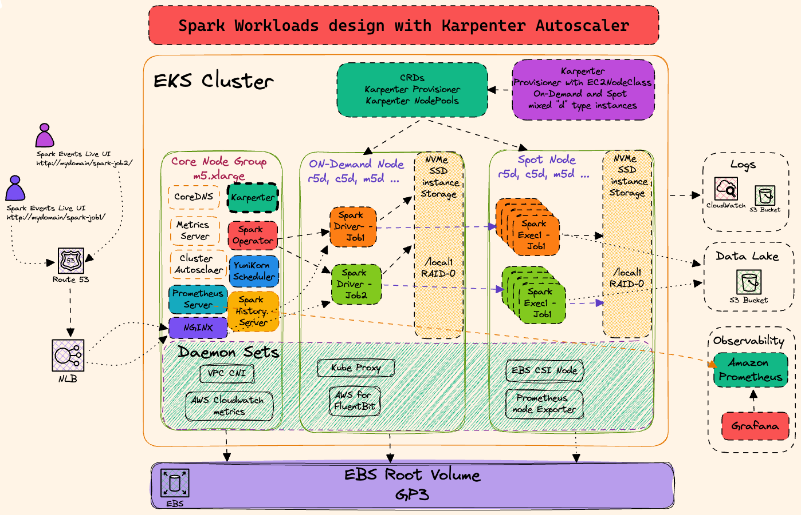
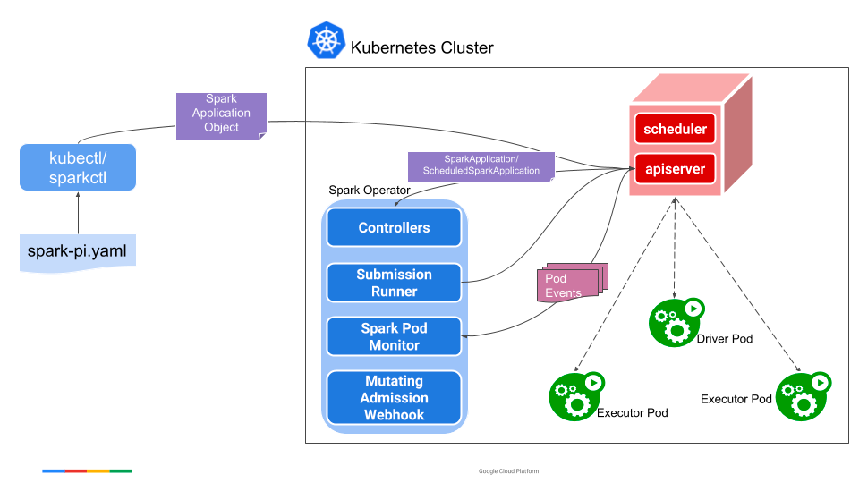

import Tabs from '@theme/Tabs';
import TabItem from '@theme/TabItem';
import CollapsibleContent from '../../../src/components/CollapsibleContent';

import TaxiTripExecute from './_taxi_trip_exec.md'
import ReplaceS3BucketPlaceholders from './_replace_s3_bucket_placeholders.mdx';

import CodeBlock from '@theme/CodeBlock';

# Spark Operator with YuniKorn

## Introduction

The EKS Cluster design for the Data on EKS blueprint is optimized for running Spark applications with Spark Operator and Apache YuniKorn as the batch scheduler. This blueprint leverage Karpenter to scale the worker nodes, AWS for FluentBit is employed for logging, and a combination of Prometheus, Amazon Managed Prometheus, and open source Grafana are used for observability. Additionally, the Spark History Server Live UI is configured for monitoring running Spark jobs through an NLB and NGINX ingress controller.

<CollapsibleContent header={<h2><span>Spark workloads with Karpenter</span></h2>}>

Using Karpenter as the autoscaler, eliminates the need for Managed Node Groups and Cluster Autoscaler for the Spark workloads. In this design, Karpenter and its Nodepools are responsible for creating both On-Demand and Spot instances, dynamically selecting instance types based on user demands. Karpenter offers improved performance compared to Cluster Autoscaler, with more efficient node scaling and faster response times. Karpenter's key features include its ability to scale from zero, optimizing resource utilization and reducing costs when there is no demand for resources. Additionally, Karpenter supports multiple Nodepools, allowing for greater flexibility in defining the required infrastructure for different workload types, such as compute, memory, and GPU-intensive tasks. Furthermore, Karpenter integrates seamlessly with Kubernetes, providing automatic, real-time adjustments to the cluster size based on observed workloads and scaling events. This enables a more efficient and cost-effective EKS cluster design that adapts to the ever-changing demands of Spark applications and other workloads.



The blueprint configures the Karpenter Nodepools and Ec2 classes in the tabs below.

<Tabs>
<TabItem value="spark-memory-optimized" label="spark-memory-optimized">

This NodePool uses the r5d instance type, from xlarge to 8xlarge sizes, which are great for Spark jobs require more memory.

To view the Karpenter configuration [review the `addons.tf` file here](https://github.com/awslabs/data-on-eks/blob/main/analytics/terraform/spark-k8s-operator/addons.tf#L177-L223)
</TabItem>

<TabItem value="spark-graviton-memory-optimized" label="spark-graviton-memory-optimized">

This NodePool uses the r6g, r6gd, r7g, r7gd, and r8g instance type, from 4xlarge to 16xlarge sizes

To view the Karpenter configuration [review the `addons.tf` file here](https://github.com/awslabs/data-on-eks/blob/main/analytics/terraform/spark-k8s-operator/addons.tf#L117-L170)
</TabItem>


<TabItem value="spark-compute-optimized" label="spark-compute-optimized">

This NodePool uses the C5d instance type, from 4xlarge to 24xlarge sizes, which are great for Spark jobs require more CPU time.

To view the Karpenter configuration [review the `addons.tf` file here](https://github.com/awslabs/data-on-eks/blob/main/analytics/terraform/spark-k8s-operator/addons.tf#L63-L110)
</TabItem>

<TabItem value="spark-vertical-ebs-scale" label="spark-vertical-ebs-scale">

This NodePool uses a broad range of EC2 instance types, and in the bootstrapping the instances create and mount a secondary EBS volume. This volume size is scaled based on the number of cores on the Ec2 instance.
This provides a secondary storage location that can be used for Spark workloads, reducing the load on the root volume of the instance and avoiding impact to system daemons or the kubelet. As larger nodes can accept more pods the bootstrapping creates a larger volume for the larger instances.

To view the Karpenter configuration [review the `addons.tf` file here](https://github.com/awslabs/data-on-eks/blob/main/analytics/terraform/spark-k8s-operator/addons.tf#L230-L355)
</TabItem>

</Tabs>
</CollapsibleContent>

<CollapsibleContent header={<h2><span>NVMe SSD Instance Storage for Spark Shuffle data</span></h2>}>

It is important to note that the NodePools in this EKS Cluster design utilize NVMe SSD instance storage for each node to serve as shuffle storage for Spark workloads. These high-performance storage options are available with all "d" type instances.

The use of NVMe SSD instance storage as shuffle storage for Spark brings numerous advantages. First, it provides low-latency and high-throughput data access, significantly improving Spark's shuffle performance. This results in faster job completion times and enhanced overall application performance. Second, the use of local SSD storage reduces the reliance on remote storage systems, such as EBS volumes, which can become a bottleneck during shuffle operations. This also reduces the costs associated with provisioning and managing additional EBS volumes for shuffle data. Finally, by leveraging NVMe SSD storage, the EKS cluster design offers better resource utilization and increased performance, allowing Spark applications to process larger datasets and tackle more complex analytics workloads more efficiently. This optimized storage solution ultimately contributes to a more scalable and cost-effective EKS cluster tailored for running Spark workloads on Kubernetes.

The NVMe SSD instance storage is configured by the bootstrapping scripts when the instance launches ([the Karpenter NodePools are configured with `instanceStorePolicy: RAID0`](https://karpenter.sh/docs/concepts/nodeclasses/#specinstancestorepolicy)). The NVMe devices are combined into a single RAID0 (striped) array then mounted to `/mnt/k8s-disks/0`. This directory is further linked with `/var/lib/kubelet`,` /var/lib/containerd` and `/var/log/pods`, ensuring that all data written to those locations is stored on the NVMe devices. Because data written inside of a pod will be written to one of these directories the Pods benefit from high-performance storage without having to leverage hostPath mounts or PersistentVolumes

</CollapsibleContent>

<CollapsibleContent header={<h2><span>Spark Operator</span></h2>}>

The Kubernetes Operator for Apache Spark aims to make specifying and running Spark applications as easy and idiomatic as running other workloads on Kubernetes.

* a SparkApplication controller that watches events of creation, updates, and deletion of SparkApplication objects and acts on the watch events,
* a submission runner that runs spark-submit for submissions received from the controller,
* a Spark pod monitor that watches for Spark pods and sends pod status updates to the controller,
* a Mutating Admission Webhook that handles customizations for Spark driver and executor pods based on the annotations on the pods added by the controller,
* and also a command-line tool named sparkctl for working with the operator.

The following diagram shows how different components of Spark Operator add-on interact and work together.



</CollapsibleContent>

<CollapsibleContent header={<h2><span>Deploying the Solution</span></h2>}>

In this [example](https://github.com/awslabs/data-on-eks/tree/main/analytics/terraform/spark-k8s-operator), you will provision the following resources required to run Spark Jobs with open source Spark Operator and Apache YuniKorn.

This example deploys an EKS Cluster running the Spark K8s Operator into a new VPC.

- Creates a new sample VPC, 2 Private Subnets, 2 Public Subnets, and 2 subnets in the RFC6598 space (100.64.0.0/10) for EKS Pods.
- Creates Internet gateway for Public Subnets and NAT Gateway for Private Subnets
- Creates EKS Cluster Control plane with public endpoint (for demo reasons only) with Managed Node Groups for benchmarking and core services, and Karpenter NodePools for Spark workloads.
- Deploys Metrics server, Spark-operator, Apache Yunikorn, Karpenter, Cluster Autoscaler, Grafana, AMP and Prometheus server.

### Prerequisites

Ensure that you have installed the following tools on your machine.

1. [aws cli](https://docs.aws.amazon.com/cli/latest/userguide/install-cliv2.html)
2. [kubectl](https://Kubernetes.io/docs/tasks/tools/)
3. [terraform](https://learn.hashicorp.com/tutorials/terraform/install-cli)

### Deploy

Clone the repository.

```bash
git clone https://github.com/awslabs/data-on-eks.git
cd data-on-eks
export DOEKS_HOME=$(pwd)
```

If DOEKS_HOME is ever unset, you can always set it manually using `export
DATA_ON_EKS=$(pwd)` from your data-on-eks directory.

Navigate into one of the example directories and run `install.sh` script.

```bash
cd ${DOEKS_HOME}/analytics/terraform/spark-k8s-operator
chmod +x install.sh
./install.sh
```

Now create an S3_BUCKET variable that holds the name of the bucket created
during the install. This bucket will be used in later examples to store output
data. If S3_BUCKET is ever unset, you can run the following commands again.

```bash
export S3_BUCKET=$(terraform output -raw s3_bucket_id_spark_history_server)
echo $S3_BUCKET
```

</CollapsibleContent>

<CollapsibleContent header={<h2><span>Execute Sample Spark job with Karpenter</span></h2>}>

Navigate to example directory. You will need to replace the <S3_BUCKET> placeholders in this file with the name of the bucket created earlier. You can get that value by running echo $S3_BUCKET.

To do this automatically you can run the following, which will create a .old backup file and do the replacement for you.


```bash
sed -i.old s/\<S3_BUCKET\>/${S3_BUCKET}/g ./pyspark-pi-job.yaml
```

Submit the Spark Job

```bash
cd ${DOEKS_HOME}/analytics/terraform/spark-k8s-operator/examples/karpenter
kubectl apply -f pyspark-pi-job.yaml
```

Monitor the job status using the below command.
You should see the new nodes triggered by the karpenter and the YuniKorn will schedule one driver pod and 2 executor pods on this node.

```bash
kubectl get pods -n spark-team-a -w
```

You can check the status of the SparkApplication if the pods are already completed:
```bash
kubectl describe sparkapplication pyspark-pi-karpenter -n spark-team-a
```

You can try the following examples to leverage multiple Karpenter Nodepools, EBS as Dynamic PVC instead of SSD and YuniKorn Gang Scheduling.

## Put sample data in S3

<TaxiTripExecute />

## NVMe Ephemeral SSD disk for Spark shuffle storage

Example PySpark job that uses NVMe based ephemeral SSD disk for Driver and Executor shuffle storage

```bash
cd ${DOEKS_HOME}/analytics/terraform/spark-k8s-operator/examples/karpenter/
```
<!-- Docusaurus will not render the {props.filename} inside of a ```codeblock``` -->
<ReplaceS3BucketPlaceholders filename="./nvme-ephemeral-storage.yaml" />
```bash
sed -i.old s/\<S3_BUCKET\>/${S3_BUCKET}/g ./nvme-ephemeral-storage.yaml
```

Now that the bucket name is in place you can create the Spark job.

```bash
kubectl apply -f nvme-ephemeral-storage.yaml
```

## EBS Dynamic PVC for shuffle storage
Example PySpark job that uses EBS ON_DEMAND volumes using Dynamic PVCs for Driver and Executor shuffle storage

```bash
cd ${DOEKS_HOME}/analytics/terraform/spark-k8s-operator/examples/karpenter/
```
<!-- Docusaurus will not render the {props.filename} inside of a ```codeblock``` -->
<ReplaceS3BucketPlaceholders filename="./ebs-storage-dynamic-pvc.yaml" />
```bash
sed -i.old s/\<S3_BUCKET\>/${S3_BUCKET}/g ./ebs-storage-dynamic-pvc.yaml
```

Now that the bucket name is in place you can create the Spark job.

```bash
kubectl apply -f ebs-storage-dynamic-pvc.yaml
```

## Apache YuniKorn Gang Scheduling with NVMe based SSD disk for shuffle storage

Gang Scheduling Spark jobs using Apache YuniKorn and Spark Operator

```bash
cd ${DOEKS_HOME}/analytics/terraform/spark-k8s-operator/examples/karpenter/
```
<!-- Docusaurus will not render the {props.filename} inside of a ```codeblock``` -->
<ReplaceS3BucketPlaceholders filename="./nvme-storage-yunikorn-gang-scheduling.yaml" />
```bash
sed -i.old s/\<S3_BUCKET\>/${S3_BUCKET}/g ./nvme-storage-yunikorn-gang-scheduling.yaml
```

Now that the bucket name is in place you can create the Spark job.

```bash
kubectl apply -f nvme-storage-yunikorn-gang-scheduling.yaml
```

</CollapsibleContent>

<CollapsibleContent header={<h2><span>Karpenter Nodepool weights with Graviton and Intel</span></h2>}>

## Using Karpenter Nodepool weights for running Spark Jobs on both AWS Graviton and Intel EC2 Instances

Customers often seek to leverage AWS Graviton instances for running Spark jobs due to their cost savings and performance improvements over traditional Intel instances. However, a common challenge is the availability of Graviton instances in specific regions or availability zones, especially during times of high demand. To address this, a [fallback strategy](https://karpenter.sh/docs/concepts/scheduling/#weighted-nodepools) to equivalent Intel instances is desirable.

#### Solution
**Step 1: Create a Multi-Architecture Spark Docker Image**
First, ensure that your Spark job can run on both AWS Graviton (ARM architecture) and Intel (AMD architecture) instances by creating a multi-architecture Docker image. You can find a sample [Dockerfile](../../../../analytics/terraform/spark-k8s-operator/examples/docker/Dockerfile) and [instructions for building and pushing this image to Amazon Elastic Container Registry (ECR) in the examples directory](https://github.com/awslabs/data-on-eks/tree/main/analytics/terraform/spark-k8s-operator/examples/docker).

**Step 2: Deploy Two Karpenter Nodepools with weights**
Deploy two separate Karpenter Nodepools: one configured for Graviton instances and the other for Intel instances.

Graviton Nodepool (ARM): Set the weight of the Graviton Nodepool to `100`. This prioritizes Graviton instances for your Spark workloads.

Intel Nodepool (AMD): Set the weight of the Intel Nodepool to `50`. This ensures that Karpenter will fall back to the Intel Nodepool when Graviton instances are either unavailable or reach their maximum CPU capacity.

The memory optimized Karpenter NodePools are configured with these weights.

<Tabs>
<TabItem value="spark-memory-optimized" label="spark-memory-optimized">

This NodePool uses the r5d instance type, from xlarge to 8xlarge sizes, which are great for Spark jobs require more memory.

To view the Karpenter configuration [review the `addons.tf` file here](https://github.com/awslabs/data-on-eks/blob/main/analytics/terraform/spark-k8s-operator/addons.tf#L177-L223)
</TabItem>

<TabItem value="spark-graviton-memory-optimized" label="spark-graviton-memory-optimized">

This NodePool uses the r6g, r6gd, r7g, r7gd, and r8g instance type, from 4xlarge to 16xlarge sizes

To view the Karpenter configuration [review the `addons.tf` file here](https://github.com/awslabs/data-on-eks/blob/main/analytics/terraform/spark-k8s-operator/addons.tf#L117-L170)
</TabItem>
</Tabs>

**Step 3: Use a label selector that targets both Nodepools**
Since both nodepools have the label `multiArch: Spark` we can configure our Spark job with a NodeSelector that matches that label. This will allow Karpenter to provision nodes from both of memory-optimized nodepools, and it will start with the Graviton instances due to the weights configured above.

```yaml
    nodeSelector:
      multiArch: Spark
```

</CollapsibleContent>


<CollapsibleContent header={<h2><span>Cleanup</span></h2>}>

:::caution
To avoid unwanted charges to your AWS account, delete all the AWS resources created during this deployment
:::

This script will cleanup the environment using `-target` option to ensure all the resources are deleted in correct order.

```bash
cd ${DOEKS_HOME}/analytics/terraform/spark-k8s-operator && chmod +x cleanup.sh
./cleanup.sh
```

</CollapsibleContent>
