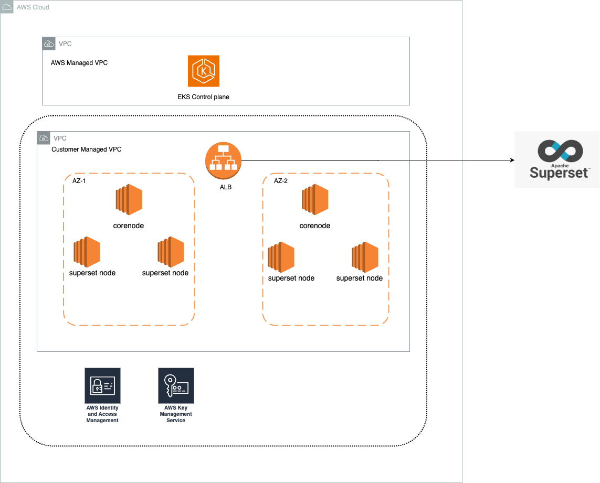
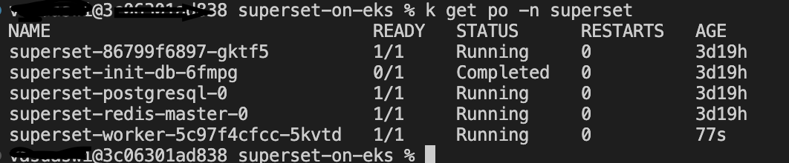
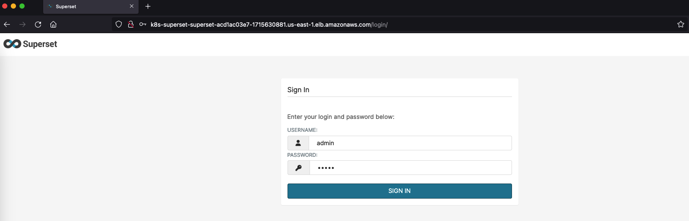
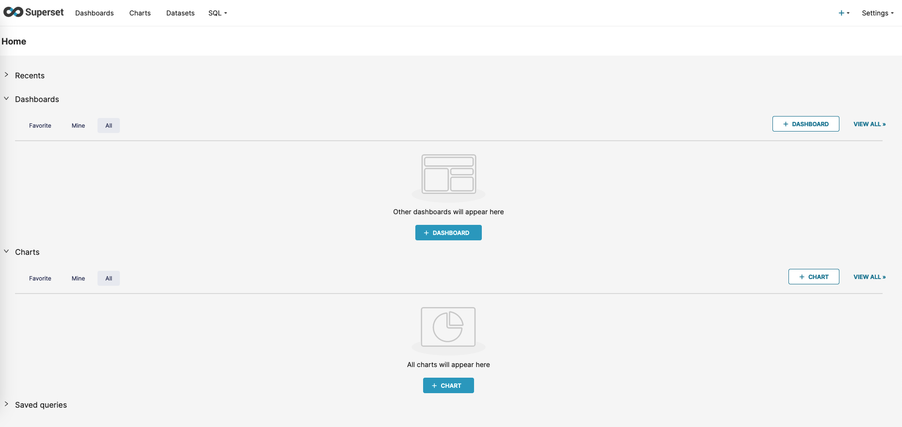
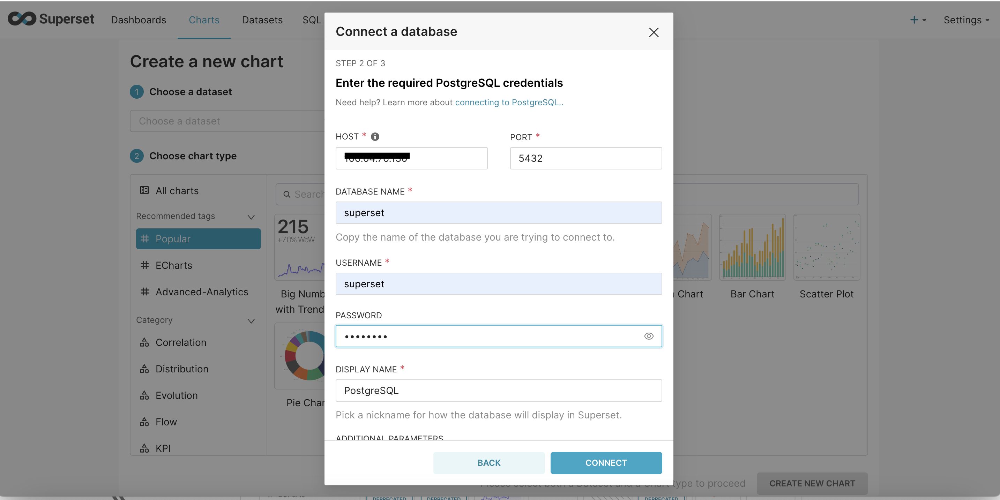
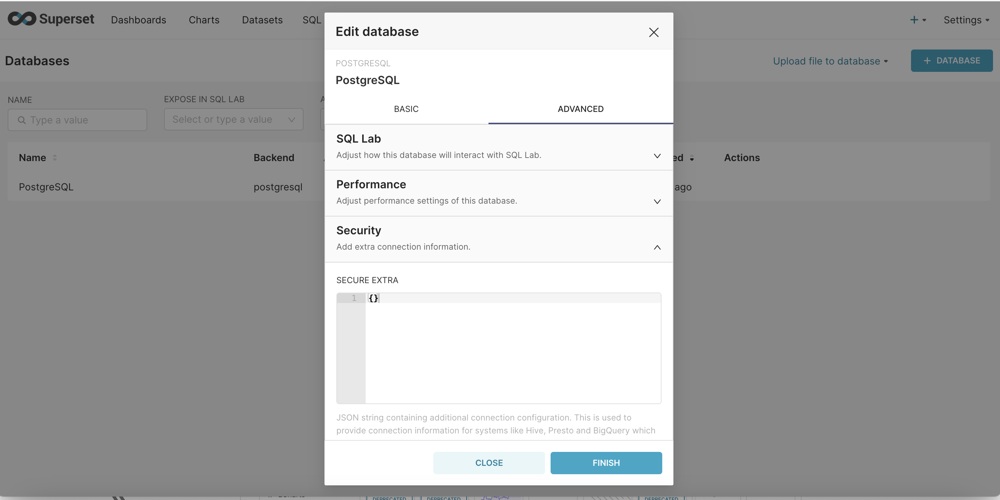
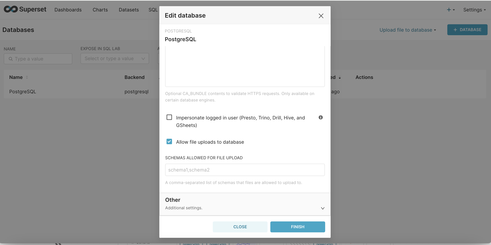
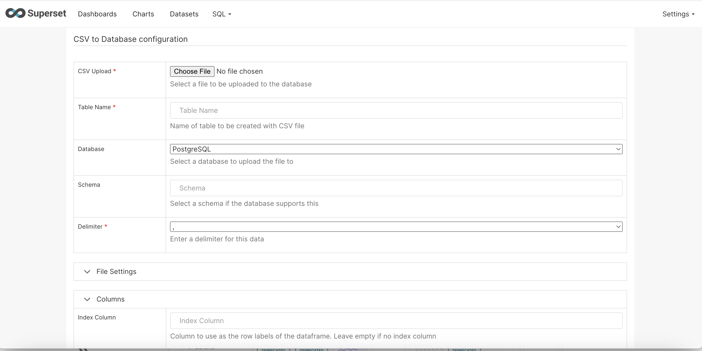
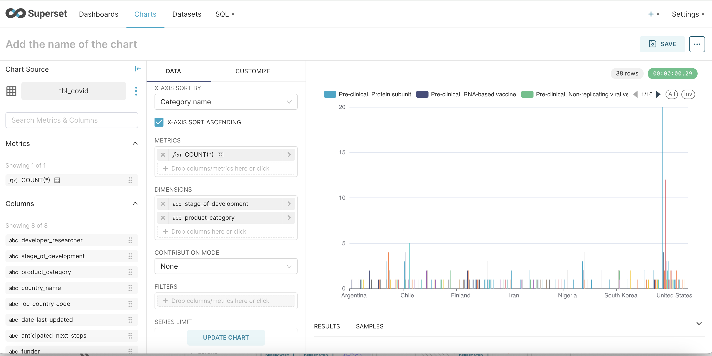
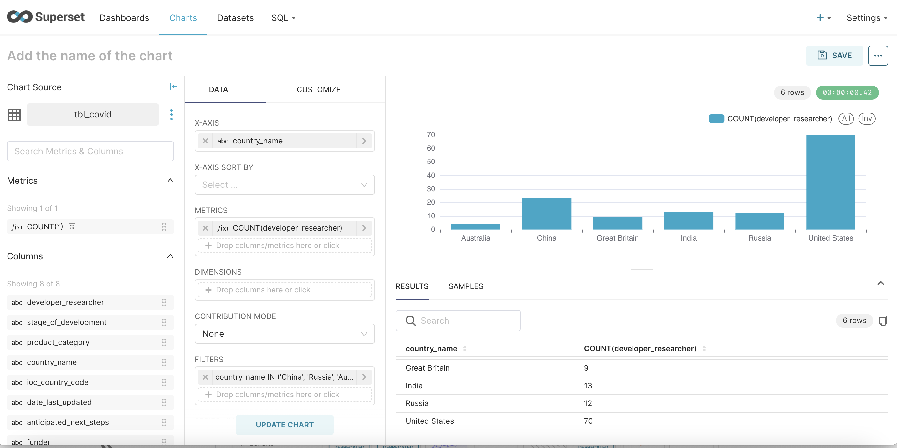

# Superset on EKS

## Introduction
[Apache Superset](https://superset.apache.org/) is a popular open source data exploration and visualization platform. Superset provides a rich set of data visualizations and easy ad-hoc query and analysis functionalities for data scientists, analysts, and business users.

This [blueprint](https://github.com/awslabs/data-on-eks/tree/main/analytics/terraform/superset-on-eks) deploys Superset on an EKS cluster using Postgres as the backend database and Amazon Elastic Block Store (Amazon EBS) for persistent storage.

## Superset on AWS

On AWS, Superset can run on an EKS cluster. By using EKS, you can leverage Kubernetes for deployment, scaling, and management of Superset services. Other AWS services like VPC, IAM, and EBS provide the networking, security, and storage capabilities.

Key AWS services used:

- Amazon EKS as the managed Kubernetes cluster to run Superset pods and services.
- Amazon EBS to provide a scalable block store for Superset persistent storage.
- Amazon ECR to store Docker container images for Superset and dependencies

## Deploying the Solution

The blueprint performs the following to deploy Superset on EKS:

- Create a new VPC with public and private subnets
- Provision an EKS cluster control plane and managed worker nodes
- Create an Amazon EBS file system and access point
- Build Docker images and push to Amazon ECR
- Install Superset and services on EKS via Helm chart
- Expose Superset UI through a load balancer

 Ingress is enabled and AWS LoadBalancer Controller will provision an ALB to expose the Superset frontend UI.

:::info
You may customize the blueprint by changing values in `variables.tf`, to deploy to a different region (default to `us-west-1` ), use different cluster name, number of subnets / AZs, or disable addons like fluentbit
:::


### Prerequisites

Ensure that you have installed the following tools on your machine.

1. [aws cli](https://docs.aws.amazon.com/cli/latest/userguide/install-cliv2.html)
2. [kubectl](https://Kubernetes.io/docs/tasks/tools/)
3. [terraform](https://learn.hashicorp.com/tutorials/terraform/install-cli)
4. [Helm](https://helm.sh)

### Deploy

Clone the repository

```bash
git clone https://github.com/awslabs/data-on-eks.git
```

Navigate into one of the example directories and run `install.sh` script

```bash
cd data-on-eks/analytics/terraform/superset-on-eks
chmod +x install.sh
./install.sh
```
or simply
```bash
terraform init
terraform apply --auto-approve
```

### Architecture Overview



### Verify Deployment

After the deployment completes, we can access the Superset UI .  For demo purpose, this blueprint creates the Ingress object for the Superset FrontEnd UI with public LoadBalancer and also number of pods across 2 AZ's in the corenode and superset node respectively.



You may find the URL to the Superset frontend from the output superset_url, or by running kubectl command below:

```sh
kubectl get ingress  -n superset

# OUTPUT should looks like below
NAME                CLASS     HOSTS   ADDRESS                                                                   PORTS   AGE
superset-ingress   aws-alb   *       k8s-superset-***.***.elb.amazonaws.com                                     80      125m
```


Copy the ADDRESS field from the output, then open browser and enter the URL as `http://<address>/`. Enter `admin` as both user name and password when prompted.  We can view the Superset UI like below.




In order to visualize  data, we need to first connect to  Postgres database. the IP address of the database can be obtained by describing a pod 'superset-postgresql-0'. Basically the database is hosted on the superset-node


```sh
k describe po superset-postgresql-0 -n superset

```


After obtaining the IP address, database connection can be established as per the screenshot below


Once the database is connected, it has to be configured to allow file upload. This features allows, csv and other format files to be uploaded as a new table. Please refer to the screeshots below

Step -1 : Edit database configuration and navigate to 'ADVANCED' settings



Step - 2 : Under Security scroll down to the very end and 'check allow file uploads to the database'



Step -3 : Create a dataset by uploading a file



Step - 4 : To show a sample visualization a sample CSV of COVID research across various countries was uploaded. Here are a few visualizations that shows countries porgess with respect to trial of various vaccines





## Cleanup

To clean up your environment, run the `cleanup.sh` script.

```bash
chmod +x cleanup.sh
./cleanup.sh
```
otherwise
```bash
terraform destroy --auto-approve
```
