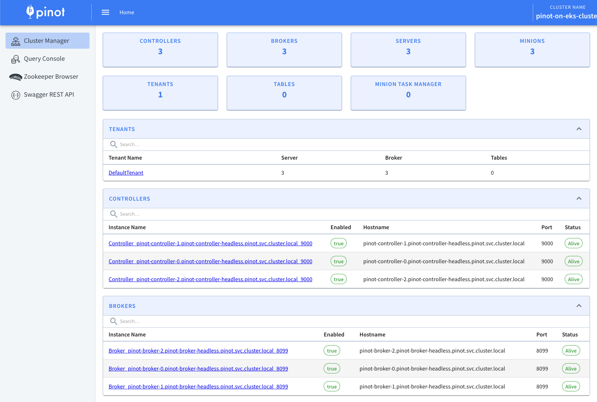

# Deploying Apache Pinot (🍷) on EKS (Experimental)

[Apache Pinot](https://pinot.apache.org/) is real-time distributed OLAP datastore, purpose built for low-latency and high-throughput analytics. You can use pinot to ingest and immediately query data from streaming or batch data sources e.g. Apache Kafka, Amazon Kinesis Data Streams, Amazon S3, etc).

Apache Pinot includes the following characteristics:

- **Ultra low-latency** analytics even at extremely high throughput.
- **Columnar data store** with several smart indexing and pre-aggregation techniques.
- **Scaling up** and **out** with no upper bound.
- **Consistent performance** based on the size of your cluster and an expected query per second (QPS) threshold.

It's a perfect solution for user-facing real-time analytics and other analytical use cases, including internal dashboards, anomaly detection, and ad hoc data exploration. You can learn more about Apache Pinot and its components in its [documentation](https://docs.pinot.apache.org/).

In this blueprint, we will deploy Apache Pinot on Kubernetes cluster managed by Elastic Kubernetes Service (EKS). Some of the benefits of deploying Apache Pinot on EKS cluster are

- Manage Apache Pinot Cluster using Kubernetes
- Scale each layer independently
- No single point of failure
- Auto recovery

> Note: All Apache Pinot components run on `StatefulSet` including **Zookeeper**

> Note: This blueprint doesn't leverage [DeepStore](#link) currently and uses EBS volumes to store table segments.

> Future: Currently all Apache Pinot components run on m5.xlarge nodes that are provisioned as part of node groups. In future, we would leverage separate node groups for each components so that we can provide each Apache Pinot component specialized underlying hardware that improves overall performance of Apache Pinot.

## Prerequisites 📝

Ensure that you have following tools installed on your machine.

1. [aws cli](https://docs.aws.amazon.com/cli/latest/userguide/install-cliv2.html)
2. [kubectl](https://Kubernetes.io/docs/tasks/tools/)
3. [terraform](https://learn.hashicorp.com/tutorials/terraform/install-cli)

## Deployment ⚙️

### Deploy the EKS Cluster with Apache Pinot

First, clone the repository.

```bash
git clone https://github.com/awslabs/data-on-eks.git
```


Navigate to apache pinot folder and create `terraform.tfvars` to provide desired values for all the variables. This is also the time to update any other input variables or make any other changes to the terraform template.

```bash
cd data-on-eks/distributed-databases/pinot
touch terraform.tfvars
```

#### Sample `terraform.tfvars`
```terraform
name                = "pinot-on-eks"
region              = "us-west-2"
eks_cluster_version = "1.25"
...
```

### Verify Deployment

Verify the Amazon EKS Cluster

```bash
aws eks describe-cluster --name pinot-on-eks
```

Update local kubeconfig so we can access kubernetes cluster.

```bash
aws eks update-kubeconfig --name pinot-on-eks --region us-west-2
```

First, lets verify that we have worker nodes running in the cluster.

```bash
kubectl get nodes
```
#### Output
```bash
NAME                                         STATUS   ROLES    AGE   VERSION
ip-10-1-189-200.us-west-2.compute.internal   Ready    <none>   12d   v1.24.17-eks-43840fb
ip-10-1-46-117.us-west-2.compute.internal    Ready    <none>   12d   v1.24.17-eks-43840fb
ip-10-1-84-80.us-west-2.compute.internal     Ready    <none>   12d   v1.24.17-eks-43840fb
```

Next, lets verify all the pods are running.

```bash
kubectl get pods -n pinot
```
#### Output
```bash
NAME                                                   READY   STATUS      RESTARTS   AGE
pinot-broker-0                                         1/1     Running     0          11d
pinot-broker-1                                         1/1     Running     0          11d
pinot-broker-2                                         1/1     Running     0          11d
pinot-controller-0                                     1/1     Running     0          11d
pinot-controller-1                                     1/1     Running     0          11d
pinot-controller-2                                     1/1     Running     0          11d
pinot-minion-stateless-86cf65f89-rlpwn                 1/1     Running     0          12d
pinot-minion-stateless-86cf65f89-tkbjf                 1/1     Running     0          12d
pinot-minion-stateless-86cf65f89-twp8n                 1/1     Running     0          12d
pinot-server-0                                         1/1     Running     0          11d
pinot-server-1                                         1/1     Running     0          11d
pinot-server-2                                         1/1     Running     0          11d
pinot-zookeeper-0                                      1/1     Running     0          12d
pinot-zookeeper-1                                      1/1     Running     0          12d
pinot-zookeeper-2                                      1/1     Running     0          12d
```

We have also deployed `prometheus` and `grafana` under `monitoring` namespace. So also make sure all the pods for `monitoring` are also running.

```bash
kubectl get pods -n monitoring
```
#### Output
```bash
prometheus-grafana-85b4584dbf-4l72l                    3/3     Running   0          12d
prometheus-kube-prometheus-operator-84dcddccfc-pv8nv   1/1     Running   0          12d
prometheus-kube-state-metrics-57f6b6b4fd-txjtb         1/1     Running   0          12d
prometheus-prometheus-kube-prometheus-prometheus-0     2/2     Running   0          4d3h
prometheus-prometheus-node-exporter-4jh8q              1/1     Running   0          12d
prometheus-prometheus-node-exporter-f5znb              1/1     Running   0          12d
prometheus-prometheus-node-exporter-f9xrz              1/1     Running   0          12d
```


Now lets access Apache Pinot Console using the below command. Console consist of **Cluster Manager**, **Query Explorer**, **Zookeeper Browser** and **Swagger REST API Explorer**.

```bash
kubectl port-forward service/pinot-controller 9000:9000 -n pinot
```

This will allow you to access Apache Pinot Console like the one shown below using `http://localhost:9000`




Apache Pinot supports exporting metrics using Prometheus JMX exporter that is packaged within the Apache Pinot docker image. Lets ensure metrics from all Apache Pinot components are getting published to `prometheus`.

```bash
kubectl port-forward service/prometheus-kube-prometheus-prometheus 9090:9090 -n monitoring
```

Navigate to the prometheus UI at `http://localhost:9090`, type `pinot` in the search box and you should be able to see all the metrics.


Next, Let's use Grafana to visualize the Apache Pinot metrics. In order to access Grafana, we need to get the grafana password from AWS Secrets Manager.

```bash
aws secretsmanager get-secret-value --secret-id pinot-on-eks-grafana | jq '.SecretString' --raw-output
```

Now use the port-forwarding to access Grafana at port `8080`

```bash
kubectl port-forward service/prometheus-grafana 8080:80 -n monitoring
```

Login to grafana dashboard using `admin` and password retrieved in the previous step and then navigate to Dashboard and click New and then Import. Use the file `pinot.json` under `data-on-eks/distributed-database/pinot/dashboard` to create a pinot dashboard.


To learn more about the monitoring of Apache Pinot using Prometheus and Grafana use the [official guide](https://docs.pinot.apache.org/operators/tutorials/monitor-pinot-using-prometheus-and-grafana).

## Additional Deployment (Optional) 🏆

### Deploy Apache Kafka for Streaming Data

Apache Pinot can ingest data from streaming data sources (real-time) as well as batch data sources (offline). In this example, we will leverage [Apache Kafka](https://kafka.apache.org/) to push real-time data to a topic.

If you already have Apache Kafka running in your EKS cluster or you are leveraging Amazon Managed Streaming for Apache Kafka (MSK) you can skip this step. Otherwise, follow the steps below to install Kafka in your EKS cluster.

> Note: Following deployment configure Kafka Brokers with PLAINTEXT listeners for simplified deployment. Modify the `kafka-values.yaml` file for production deployment

```bash
helm repo add bitnami https://charts.bitnami.com/bitnami
helm install -n pinot pinot-kafka bitnami/kafka --values ./helm/kafka-values.yaml
```

#### Output
```bash
NAME: pinot-kafka
LAST DEPLOYED: Tue Oct 24 01:10:25 2023
NAMESPACE: pinot
STATUS: deployed
REVISION: 1
TEST SUITE: None
NOTES:
CHART NAME: kafka
CHART VERSION: 26.2.0
APP VERSION: 3.6.0

** Please be patient while the chart is being deployed **

Kafka can be accessed by consumers via port 9092 on the following DNS name from within your cluster:

    pinot-kafka.pinot.svc.cluster.local

Each Kafka broker can be accessed by producers via port 9092 on the following DNS name(s) from within your cluster:

    pinot-kafka-controller-0.pinot-kafka-controller-headless.pinot.svc.cluster.local:9092
    pinot-kafka-controller-1.pinot-kafka-controller-headless.pinot.svc.cluster.local:9092
    pinot-kafka-controller-2.pinot-kafka-controller-headless.pinot.svc.cluster.local:9092

To create a pod that you can use as a Kafka client run the following commands:

    kubectl run pinot-kafka-client --restart='Never' --image docker.io/bitnami/kafka:3.6.0-debian-11-r0 --namespace pinot --command -- sleep infinity
    kubectl exec --tty -i pinot-kafka-client --namespace pinot -- bash

    PRODUCER:
        kafka-console-producer.sh \
            --broker-list pinot-kafka-controller-0.pinot-kafka-controller-headless.pinot.svc.cluster.local:9092,pinot-kafka-controller-1.pinot-kafka-controller-headless.pinot.svc.cluster.local:9092,pinot-kafka-controller-2.pinot-kafka-controller-headless.pinot.svc.cluster.local:9092 \
            --topic test

    CONSUMER:
        kafka-console-consumer.sh \
            --bootstrap-server pinot-kafka.pinot.svc.cluster.local:9092 \
            --topic test \
            --from-beginning
```

Use the command mentioned above to create **Kafka Client** pod within your namespace.

```bash
kubectl run pinot-kafka-client --restart='Never' --image docker.io/bitnami/kafka:3.6.0-debian-11-r0 --namespace pinot --command -- sleep infinity
kubectl exec --tty -i pinot-kafka-client --namespace pinot -- bash
```

Create Kafka topics using the below commands, which will then be used to publish messages.

```bash
kafka-topics.sh --bootstrap-server pinot-kafka-controller-0.pinot-kafka-controller-headless.pinot.svc.cluster.local:9092 --topic flights-realtime --create --partitions 1 --replication-factor 1

kafka-topics.sh --bootstrap-server pinot-kafka-controller-0.pinot-kafka-controller-headless.pinot.svc.cluster.local:9092 --topic flights-realtime-avro --create --partitions 1 --replication-factor 1
```

Use provided `example/pinot-realtime-quickstart.yml` to create tables and publish sample data to the above topics, which will then get ingested into tables.

```bash
kubectl apply -f example/pinot-realtime-quickstart.yml
```

Now, let navigate back to **Query Console** and then click one of the tables. You should be able to see the newly created tables and data coming into tables.
```bash
kubectl port-forward service/pinot-controller 9000:9000 -n pinot
```


## Cleanup 🧹

To delete all the components provisioned as part of this blueprint, using the following command to destroy all the resources.

```bash
./cleanup.sh
```

:::caution

To avoid unwanted charges to your AWS account, delete all the AWS resources created during this deployment

ex. Delete kafka-on-eks EBS volumes
:::
