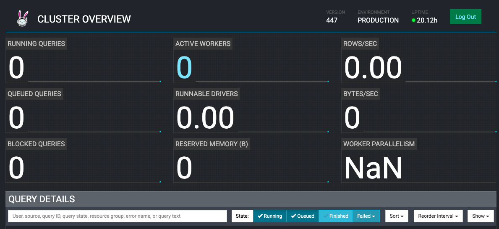
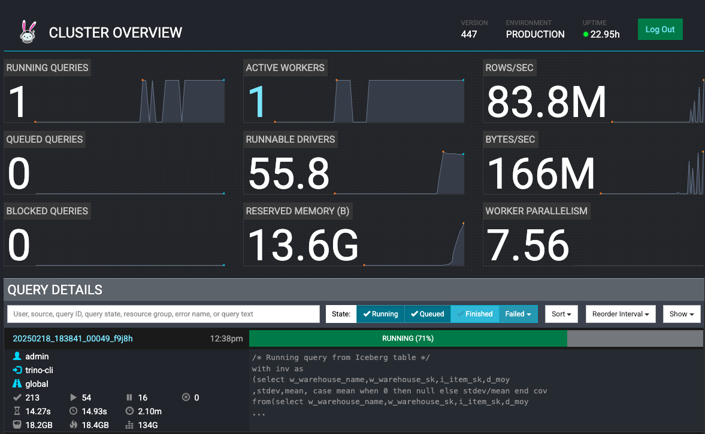

# Deploying Trino on EKS

## Introduction

[Trino](https://trino.io/) is an open-source, fast, distributed query engine designed to run SQL queries for big data analytics, over a multitude of data sources including Amazon S3, relational databases, distributed data stores and data warehouses.

When Trino executes a query, it does so by breaking up the execution into a hierarchy of stages, which are implemented as a series of tasks distributed over a network of Trino workers. A Trino cluster consists of a coordinator and many workers for parallel processing, which can be deployed as Kubernetes pods on an EKS cluster. The coordinator and the workers collaborate to access connected data sources, with schemas and references stored in a catalog. To access the data sources, you can use one of the many [connectors](https://trino.io/docs/current/connector.html) provided by Trino to adapt Trino. Examples include as Hive, Iceberg and Kafka. More details about Trino project can be found on this [link](https://trino.io)

## Blueprint Solution

This blueprint will deploy Trino on an EKS cluster (Kubernetes version 1.29) with nodes provisioned using Karpenter (v0.34.0). To optimize on cost and performance, Karpenter will provision On-demand nodes for the Trino coordinator and EC2 Spot instances for Trino workers. With Trino's multi-architectural container images, Karpenter [NodePool](https://karpenter.sh/v0.34/concepts/nodepools/) will allow provisioning of nodes with EC2 instances from different cpu architectures including AWS Graviton based instances. Trino is deployed using the [official Helm chart](https://trinodb.github.io/charts/charts/trino/), with custom values provided for users to leverage Hive and Iceberg connectors. The examples will use Glue and Iceberg tables on AWS as the backend data source, using S3 as the storage.

## Deploying the Solution

Let's go through the deployment steps.

### Prerequisites

Ensure that you have installed the following tools on your machine.

1. [aws cli](https://docs.aws.amazon.com/cli/latest/userguide/install-cliv2.html)
2. [kubectl](https://Kubernetes.io/docs/tasks/tools/)
3. [terraform](https://learn.hashicorp.com/tutorials/terraform/install-cli)
4. [Trino CLI client](https://trino.io/docs/current/client/cli.html)
<details>
<summary> Toggle to see installation steps of Trino CLI</summary>
```bash
wget https://repo1.maven.org/maven2/io/trino/trino-cli/427/trino-cli-427-executable.jar
mv trino-cli-427-executable.jar trino
chmod +x trino
```
</details>

### Deploy the EKS Cluster with Trino

First, clone the repository

```bash
git clone https://github.com/awslabs/data-on-eks.git
```

Navigate into `distributed-databases/trino` and run `install.sh` script. Enter, when prompted, the AWS region you want to provision the resources to (for example, `us-west-2`).

```bash
cd data-on-eks/distributed-databases/trino

./install.sh
```

### Verify Deployment

Verify the Amazon EKS Cluster

```bash
#Select your own region where you deployed resources
aws eks describe-cluster --name trino-on-eks --region us-west-2
```

Update local kubeconfig so we can access kubernetes cluster (you can also get this command from the terraform output `configure_kubectl` )

```bash
aws eks update-kubeconfig --name trino-on-eks --region us-west-2
```

First, let's verify that we have worker nodes provisioned by Karpenter in the cluster. Let's also see their availability zone and capacity type (on-demand or spot)

```bash
kubectl get nodes --selector=karpenter.sh/nodepool=trino-sql-karpenter -L topology.kubernetes.io/zone -L karpenter.sh/capacity-type -L node.kubernetes.io/instance-type
```
#### Output
```bash
NAME                                        STATUS   ROLES    AGE   VERSION               ZONE         CAPACITY-TYPE   INSTANCE-TYPE
ip-10-1-11-49.us-west-2.compute.internal    Ready    <none>   24m   v1.29.0-eks-5e0fdde   us-west-2b   on-demand       t4g.medium
```
We can see above that Karpenter provisioned on-demand node for running Trino coordinator.
:::info

For a distributed Big Data query engine like Trino which runs on a massively parallel processing cluster, it is recommended to deploy the cluster in same availability zone to avoid incurring high Inter-AZ Data Transfer costs. That's why Karpenter NodePool has been configured to launch EKS nodes in same AZ

:::

Now, let's verify the coordinator and worker pods running in `trino` namespace

```bash
kubectl get pods --namespace=trino
```
#### Output
```bash
NAME                                 READY   STATUS    RESTARTS   AGE
trino-coordinator-5cfd685c8f-mchff   1/1     Running   0          37m
```

Next, we will port-forward the trino service so it can be accessed locally

```bash
kubectl -n trino port-forward service/trino 8080:8080
```

Now, lets access the Trino UI at `http://localhost:8080` through web browser and login with username `admin` in the login window as shown below:


Trino Web UI will show 0 active worker:




## Using Trino for database querying executions

### Example #1: Using the Hive Connector

In this example, we will set up a Hive metastore using AWS Glue, with the source data stored in S3, and crawler that will infer schema from it to build a Glue table.

Using Trino on EKS with the Glue connector, we will use Trino CLI to run sample SQL queries to retrieve data.

#### Setup

Run the hive script from the `examples` directory to set up the blueprint S3 bucket with the 2022 NYC Taxi dataset (in Parquet), and build Glue metastore:

```bash
cd examples/
./hive-setup.sh
```

You will see some outputs to show progress, and if successful, will see the name of the Glue table that will store the metadata as `hive`.

#### Running the queries
You should have the Trino CLI installed as part of the prerequisite. The blueprint has the Hive Connector configured with the bucket we set up in the previous section, so you should be able to query the data source without additional settings.

First, port-forward your trino service to access it locally, if you have closed the session from previous section:
```
kubectl -n trino port-forward service/trino 8080:8080
```

While the port-forward is running, open another terminal tab where you have Trino CLI and run the following command to access the coordinator:
```bash
./trino http://127.0.0.1:8080 --user admin
```

Once successful, you will be able to get a prompt to execute commands. You can use `help` command to see a list of supported commands.  The first command you run will trigger the auto-scaling of trino workers from 0 to 1, and take a couple minutes to complete.

For example:

To show a list of catalogs, run query - `SHOW CATALOGS;` and you can see `hive` and `iceberg` catalogs among others configured by the blueprint
#### Output
```bash
 Catalog
---------
 hive
 iceberg
 system
 tpcds
 tpch
(5 rows)

Query 20240215_200117_00003_6jdxw, FINISHED, 1 node
Splits: 1 total, 1 done (100.00%)
0.49 [0 rows, 0B] [0 rows/s, 0B/s]
```

To see the schemas (databases) in Hive catalog, run query - `SHOW SCHEMAS FROM hive;` :
#### Output
```bash
  Schema
--------------------
 information_schema
 taxi_hive_database
(2 rows)
```

Let's use `taxi_hive_database` and show table in this database -
```
USE hive.taxi_hive_database;
```
```
SHOW TABLES;
```
#### Output
```
Table
-------
hive
(1 row)
```

Finally, to run a simple query to list items - `SELECT * FROM hive LIMIT 5;`
#### Output
```
vendorid |  tpep_pickup_datetime   |  tpep_dropoff_datetime  | passenger_count | trip_distance | ratecodeid | store_and_fwd_flag | pulocationid | dolocation>
----------+-------------------------+-------------------------+-----------------+---------------+------------+--------------------+--------------+----------->
        1 | 2022-09-01 00:28:12.000 | 2022-09-01 00:36:22.000 |             1.0 |           2.1 |        1.0 | N                  |          100 |          2>
        1 | 2022-11-01 00:24:49.000 | 2022-11-01 00:31:04.000 |             2.0 |           1.0 |        1.0 | N                  |          158 |          1>
        1 | 2022-11-01 00:37:32.000 | 2022-11-01 00:42:23.000 |             2.0 |           0.8 |        1.0 | N                  |          249 |          1>
        2 | 2022-09-01 00:02:24.000 | 2022-09-01 00:09:39.000 |             1.0 |          1.32 |        1.0 | N                  |          238 |          1>
        2 | 2022-09-01 00:47:25.000 | 2022-09-01 00:56:09.000 |             1.0 |          2.94 |        1.0 | N                  |
```

#### Cleaning Up Hive Resources

1. Exit from Trino CLI with `exit` command.

2. Run the cleanup script from the `examples` directory to delete all the resources created from the hive script:

```
cd data-on-eks/distributed-databases/trino/examples
./hive-cleanup.sh
```

### Example #2: Using the Iceberg Connector

In this example, we will set up using Apache Iceberg with AWS Glue as the catalog type, and will store the data in Amazon S3 with PARQUET format.

Using Trino on EKS with the Iceberg connector, we will use Trino CLI to create the above resources and run sample SQL queries to insert and retrieve data.

#### Running the queries

- Let's find out the S3 data bucket created by blueprint. We will use this bucket to store data in Iceberg tables in PARQUET format.
```bash
cd data-on-eks/distributed-databases/trino
export BUCKET=$(terraform output --state="./terraform.tfstate" --raw data_bucket)
echo $BUCKET
```
#### Output
```bash
trino-data-bucket-20240215180855515400000001
```

- Let’s now create an Iceberg schema with tables populated with data from sf10000 schema tables of [TPCDS](https://trino.io/docs/current/connector/tpcds.html). We will use CREATE TABLE AS SELECT (CTAS) statements. The SQL file `examples/trino_sf10000_tpcds_to_iceberg.sql` has the below SQL statements:

```bash
use tpcds.sf10000;
select * from tpcds.sf10000.item limit 10;
select * from tpcds.sf10000.warehouse limit 10;

/* Drop tables & schema */

drop schema iceberg.iceberg_schema;
drop table iceberg.iceberg_schema.warehouse;
drop table iceberg.iceberg_schema.item;
drop table iceberg.iceberg_schema.inventory;
drop table iceberg.iceberg_schema.date_dim;

/* Iceberg schema creation */

create schema if not exists iceberg.iceberg_schema
with (LOCATION = 's3://trino-data-bucket-20240215180855515400000001/iceberg/');

/* Iceberg Table Creation with CTAS from tpcds tables */

create table if not exists iceberg.iceberg_schema.inventory
with (FORMAT = 'PARQUET')
as select *
from tpcds.sf10000.inventory;

create table if not exists iceberg.iceberg_schema.date_dim
with (FORMAT = 'PARQUET')
as select d_date_sk,
cast(d_date_id as varchar(16)) as d_date_id,
d_date,
d_month_seq,
d_week_seq,
d_quarter_seq,
d_year,
d_dow,
d_moy,
d_dom,
d_qoy,
d_fy_year,
d_fy_quarter_seq,
d_fy_week_seq,
cast(d_day_name as varchar(9)) as d_day_name,
cast(d_quarter_name as varchar(6)) as d_quarter_name,
cast(d_holiday as varchar(1)) as d_holiday,
cast(d_weekend as varchar(1)) as d_weekend,
cast(d_following_holiday as varchar(1)) as d_following_holiday,
d_first_dom,
d_last_dom,
d_same_day_ly,
d_same_day_lq,
cast(d_current_day as varchar(1)) as d_current_day,
cast(d_current_week as varchar(1)) as d_current_week,
cast(d_current_month as varchar(1)) as d_current_month,
cast(d_current_quarter as varchar(1)) as d_current_quarter
from tpcds.sf10000.date_dim;

create table if not exists iceberg.iceberg_schema.warehouse
with (FORMAT = 'PARQUET')
as select
w_warehouse_sk,
cast(w_warehouse_id as varchar(16)) as w_warehouse_id,
w_warehouse_name,
w_warehouse_sq_ft,
cast(w_street_number as varchar(10)) as w_street_number,
w_street_name,
cast(w_street_type as varchar(15)) as w_street_type,
cast(w_suite_number as varchar(10)) as w_suite_number,
w_city,
w_county,
cast(w_state as varchar(2)) as w_state,
cast(w_zip as varchar(10)) as w_zip,
w_country,
w_gmt_offset
from tpcds.sf10000.warehouse;

create table if not exists iceberg.iceberg_schema.item
with (FORMAT = 'PARQUET')
as select
i_item_sk,
cast(i_item_id as varchar(16)) as i_item_id,
i_rec_start_date,
i_rec_end_date,
i_item_desc,
i_current_price,
i_wholesale_cost,
i_brand_id,
cast(i_brand as varchar(50)) as i_brand,
i_class_id,
cast(i_class as varchar(50)) as i_class,
i_category_id,
cast(i_category as varchar(50)) as i_category,
i_manufact_id,
cast(i_manufact as varchar(50)) as i_manufact,
cast(i_size as varchar(50)) as i_size,
cast(i_formulation as varchar(20)) as i_formulation,
cast(i_color as varchar(20)) as i_color,
cast(i_units as varchar(10)) as i_units,
cast(i_container as varchar(10)) as i_container,
i_manager_id,
cast(i_product_name as varchar(50)) as i_product_name
from tpcds.sf10000.item;


/* Select from Iceberg table */

select * from iceberg.iceberg_schema.date_dim limit 10;
select * from iceberg.iceberg_schema.item limit 10;
select * from iceberg.iceberg_schema.inventory limit 10;

/* Running query from Iceberg table */

with inv as
(select w_warehouse_name,w_warehouse_sk,i_item_sk,d_moy
,stdev,mean, case mean when 0 then null else stdev/mean end cov
from(select w_warehouse_name,w_warehouse_sk,i_item_sk,d_moy
,stddev_samp(inv_quantity_on_hand) stdev,avg(inv_quantity_on_hand) mean
from iceberg.iceberg_schema.inventory
,iceberg.iceberg_schema.item
,iceberg.iceberg_schema.warehouse
,iceberg.iceberg_schema.date_dim
where inv_item_sk = i_item_sk
and inv_warehouse_sk = w_warehouse_sk
and inv_date_sk = d_date_sk
and d_year =1999
group by w_warehouse_name,w_warehouse_sk,i_item_sk,d_moy) foo
where case mean when 0 then 0 else stdev/mean end > 1)
select inv1.w_warehouse_sk,inv1.i_item_sk,inv1.d_moy,inv1.mean, inv1.cov
,inv2.w_warehouse_sk,inv2.i_item_sk,inv2.d_moy,inv2.mean, inv2.cov
from inv inv1,inv inv2
where inv1.i_item_sk = inv2.i_item_sk
and inv1.w_warehouse_sk = inv2.w_warehouse_sk
and inv1.d_moy=4
and inv2.d_moy=4+1
and inv1.cov > 1.5
order by inv1.w_warehouse_sk,inv1.i_item_sk,inv1.d_moy,inv1.mean,inv1.cov,inv2.d_moy,inv2.mean, inv2.cov;
```

- Above SQL commands will execute following actions:
    - Create an Iceberg schema named `iceberg_schema`
    - Create 4 Iceberg tables - `warehouse`, `item`, `inventory` and `date_dim` with data from same tables of tpcds
    - Query data from above Iceberg tables

- Let's now execute above SQL commands using Trino CLI:
```bash
envsubst < examples/trino_sf10000_tpcds_to_iceberg.sql > examples/iceberg.sql
./trino --file 'examples/iceberg.sql' --server http://localhost:8080 --user admin --ignore-errors
```

- You can see completed and running SQL queries in Trino UI web monitor as below:


- Let’s open another terminal and see how KEDA is scaling Trino worker pods, when above SQL commands are running:
```bash
kubectl get hpa -n trino -w
```
#### Output
```bash
NAME                                REFERENCE                 TARGETS                MINPODS   MAXPODS   REPLICAS   AGE
keda-hpa-keda-scaler-trino-worker   Deployment/trino-worker   <unknown>/1, <unknown>/1 + 1 more...   1         15        0          37m
keda-hpa-keda-scaler-trino-worker   Deployment/trino-worker   0/1, 1/1 + 1 more...                   1         15        1          38m
keda-hpa-keda-scaler-trino-worker   Deployment/trino-worker   0/1, 500m/1 + 1 more...                1         15        1          40m
keda-hpa-keda-scaler-trino-worker   Deployment/trino-worker   0/1, 0/1 + 1 more...                   1         15        1          40m
keda-hpa-keda-scaler-trino-worker   Deployment/trino-worker   0/1, 0/1 + 1 more...                   1         15        1          40m
keda-hpa-keda-scaler-trino-worker   Deployment/trino-worker   0/1, 0/1 + 1 more...                   1         15        1          40m
keda-hpa-keda-scaler-trino-worker   Deployment/trino-worker   0/1, 0/1 + 1 more...                   1         15        2          41m
keda-hpa-keda-scaler-trino-worker   Deployment/trino-worker   0/1, 0/1 + 1 more...                   1         15        2          41m
keda-hpa-keda-scaler-trino-worker   Deployment/trino-worker   0/1, 0/1 + 1 more...                   1         15        2          41m
```
You can see HPA scaling from initial 0 workers to 2 workers with increasing query load and average cpu utilization of workerss:



### Example #3 (Optional): Fault-tolerant execution in Trino
[Fault-tolerant execution](https://trino.io/docs/current/admin/fault-tolerant-execution.html) is an opt-in mechanism in Trino that was implemented using [Project Tardigrade](https://trino.io/blog/2022/05/05/tardigrade-launch.html#what-is-project-tardigrade). Without fault-tolerant configuration, Trino query fails whenever any of the component tasks of the query fails due to any reason (for example, a worker node failure or termination). These failed queries have to be restarted from scratch resulting in longer execution time, compute wastage, and spend, especially for long-running queries.

When fault-tolerant execution is configured in Trino with a [retry policy](https://trino.io/docs/current/admin/fault-tolerant-execution.html#retry-policy), intermediate exchange data is spooled in an external storage like Amazon S3 or HDFS using [exchange manager](https://trino.io/docs/current/admin/fault-tolerant-execution.html#exchange-manager). Trino then retries failed query (if retry policy is configured as "QUERY") or failed tasks (if retry policy is configured as "TASK").  Trino's remaining workers reuse exchange manager data to retry and complete query in the event of a worker outage or other fault during query execution.
:::info
A **QUERY retry policy** instructs Trino to retry whole query when an error occurs on a worker node. It is recommended to use this retry policy when the majority of the workload for the Trino cluster comprises many small queries.

A **TASK retry policy** instructs Trino to retry individual tasks in the event of failure. It is recommended to use this policy when Trino executes large batch queries. The cluster can more efficiently retry smaller tasks within the query rather than retry the whole query.
:::
- This blueprint has deployed Trino cluster with fault-tolerant configuration with a `TASK` retry policy in **`config.properties`** file in coordinator and worker pods. Let's verify that by opening a bash command shell inside coordinator pod:
```bash
COORDINATOR_POD=$(kubectl get pods -l "app.kubernetes.io/instance=trino,app.kubernetes.io/component=coordinator" -o name -n trino)
kubectl exec --stdin --tty $COORDINATOR_POD -n trino -- /bin/bash
cat /etc/trino/config.properties
```
#### Output
```bash
coordinator=true
node-scheduler.include-coordinator=false
http-server.http.port=8080
query.max-memory=280GB
query.max-memory-per-node=22GB
discovery.uri=http://localhost:8080
retry-policy=TASK
exchange.compression-enabled=true
query.low-memory-killer.delay=0s
query.remote-task.max-error-duration=1m
query.hash-partition-count=50
```
- Blueprint has also configured exchange manager using an Amazon S3 bucket in **`exchange-manager.properties`** file in coordinator and worker pods. Let's also verify that inside coordinator pod
```bash
cat /etc/trino/exchange-manager.properties
```
#### Output
```bash
exchange-manager.name=filesystem
exchange.base-directories=s3://trino-exchange-bucket-20240215180855570800000004
exchange.s3.region=us-west-2
exchange.s3.iam-role=arn:aws:iam::xxxxxxxxxx:role/trino-sa-role
```
Please note down exchange manager S3 bucket name from above. You can explore contents of above S3 bucket in AWS Console. It will be empty when no query is running.
- Now, let's exit from bash shell of the coordinator pod
```bash
exit
```

With below steps, we will now test fault-tolerant execution by running a `select` query and terminate few Trino workers when query is still running.
- Find the file `trino_select_query_iceberg.sql` file in the `examples` folder, which contains the SQL commands below:
```bash
with inv as
(select w_warehouse_name,w_warehouse_sk,i_item_sk,d_moy
,stdev,mean, case mean when 0 then null else stdev/mean end cov
from(select w_warehouse_name,w_warehouse_sk,i_item_sk,d_moy
,stddev_samp(inv_quantity_on_hand) stdev,avg(inv_quantity_on_hand) mean
from iceberg.iceberg_schema.inventory
,iceberg.iceberg_schema.item
,iceberg.iceberg_schema.warehouse
,iceberg.iceberg_schema.date_dim
where inv_item_sk = i_item_sk
and inv_warehouse_sk = w_warehouse_sk
and inv_date_sk = d_date_sk
and d_year =1999
group by w_warehouse_name,w_warehouse_sk,i_item_sk,d_moy) foo
where case mean when 0 then 0 else stdev/mean end > 1)
select inv1.w_warehouse_sk,inv1.i_item_sk,inv1.d_moy,inv1.mean, inv1.cov
,inv2.w_warehouse_sk,inv2.i_item_sk,inv2.d_moy,inv2.mean, inv2.cov
from inv inv1,inv inv2
where inv1.i_item_sk = inv2.i_item_sk
and inv1.w_warehouse_sk = inv2.w_warehouse_sk
and inv1.d_moy=4
and inv2.d_moy=4+1
and inv1.cov > 1.5
order by inv1.w_warehouse_sk,inv1.i_item_sk,inv1.d_moy,inv1.mean,inv1.cov,inv2.d_moy,inv2.mean, inv2.cov;
```
- Let's now run select query first
```bash
./trino --file 'examples/trino_select_query_iceberg.sql' --server http://localhost:8080 --user admin --ignore-errors
```
- Immediately after above command, when above query is still running, open another terminal and scale down worker pods to just 1 worker, terminating all other workers with command below:
```bash
kubectl scale deployment trino-worker -n trino --replicas=1
```
See Trino Web UI on browser and there is only 1 active worker running now as other workers are terminated:


- Go to Amazon S3 console and verify intermediate exchange data spooling in exchange manager S3 bucket with a name starting with `trino-exchange-bucket`.


- Let's now see Trino Web UI monitor again to verify completion of the query despite of 6 failed tasks due to terminated workers (we have encircled them in RED in the screenshot below).

:::info
Please note, number of failed tasks could be different in your Trino Web UI depending upon how many tasks were running on workers that got terminated.

Also you can see different number of active workers depending upon worker pods scaled by Horizontal Pod Autoscaler(HPA) using cpu utilization metric
:::


#### Cleaning Up Iceberg Resources

1. Let's open Trino CLI
```bash
./trino http://127.0.0.1:8080 --user admin
```

2. Now, let's delete Iceberg tables and schema by running below SQL commands on Trino CLI:
 ```bash
drop table iceberg.iceberg_schema.warehouse;
drop table iceberg.iceberg_schema.item;
drop table iceberg.iceberg_schema.inventory;
drop table iceberg.iceberg_schema.date_dim;
drop schema iceberg.iceberg_schema;
```
3. Exit from Trino CLI with `exit` command.

## Cleanup 🧹

To delete all the components provisioned as part of this blueprint, using the following command to destroy all the resources.

```bash
cd data-on-eks/distributed-databases/trino
./cleanup.sh
```

:::caution

To avoid unwanted charges to your AWS account, delete all the AWS resources created during this deployment

ex. S3 buckets for Trino Exchange manager
:::

## Conclusion

Trino is a tool for fast querying vast amounts of data from your data sources.In this example, we shared a terraform based blueprint that deploys Trino with fault-tolerant configuration on Amazon EKS, with add-ons necessary to build a complete EKS cluster (i.e. Karpenter for node autoscaling, Metrics server and HPA for Trino worker pods autoscaling, monitoring with Prometheus/Grafana stack). Among many features, we highlighted a couple of examples on creating an Iceberg or Hive data store using Amazon S3 as storage, and running simple Trino queries for results. We also deployed and scaled Trino workers on Spot instances for cost optimization. We also demonstrated fault-tolerant feature of Trino, which makes it suitable for Spot instances to save costs for long-running batch queries.
