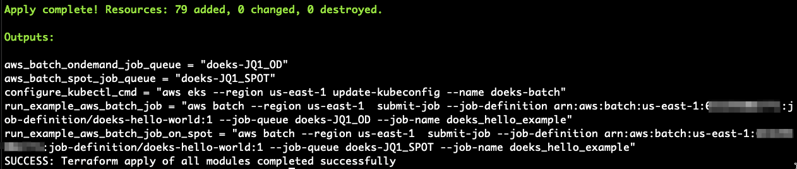
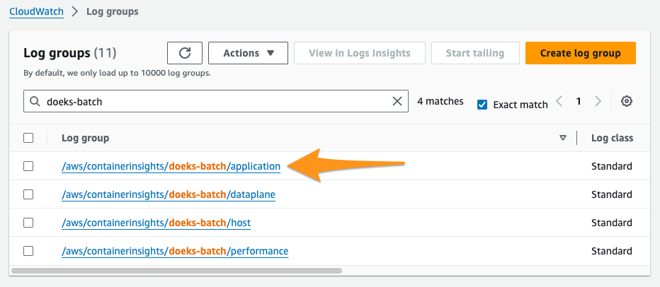
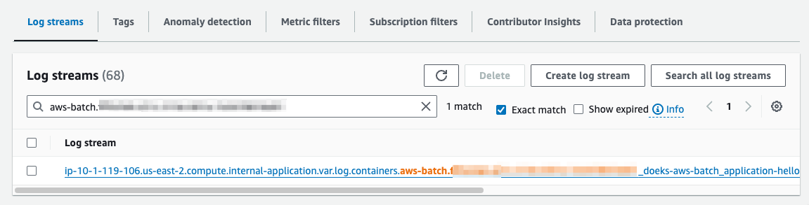

# AWS Batch on EKS
AWS Batch is a fully-managed AWS-native batch computing service that plans, schedules, and runs your containerized batch workloads (machine-learning, simulation, and analytics) on top of AWS managed container orchestrations services like Amazon Elastic Kubernetes Service (EKS).

AWS Batch adds the necessary operational semantics and resources for high performance compute workloads so that they run efficiently and cost-effectively on your existing EKS clusters.

Specifically, Batch provides an always-on job queue to accept work requests. You create a an AWS Batch job definition, which is a template for a job, then submit them to the Batch job queue. Batch then takes care of provisioning nodes for your EKS cluster in a Batch-specific namespace, and places pods on these instances to run your workloads.

This example provides a blueprint for standing up a complete environment for running your workloads on Amazon EKS cluster using AWS Batch, including:
* All necessary supporting infrastructure such as a VPC, IAM roles, security groups, etc.
* An EKS cluster for your workloads
* AWS Batch resources for running jobs on EC2 On-Demand and Spot Instances.

You can find the blueprint [here](https://github.com/awslabs/data-on-eks/tree/main/schedulers/terraform/aws-batch-eks).

## Considerations

AWS Batch is meant for offline analytics and data processing tasks, such as reformatting media, training ML models, batch inference, or other compute and data intensive tasks that are not interactive with a user.

In particular, Batch *is tuned for running jobs that are greater than three minutes*. If your jobs are short (less than a minute), consider packing more work into a single AWS Batch job request to increase the total runtime of the job.

## Prerequisites

Ensure that you have the following tools installed locally:

1. [aws cli](https://docs.aws.amazon.com/cli/latest/userguide/install-cliv2.html)
2. [kubectl](https://Kubernetes.io/docs/tasks/tools/)
3. [terraform](https://learn.hashicorp.com/tutorials/terraform/install-cli)

## Deploy

**To provision this example:**

1. Clone the repository to your local machine.
   ```bash
   git clone https://github.com/awslabs/data-on-eks.git
   cd data-on-eks/schedulers/terraform/aws-batch
   ```
2. Run the install script.
   ```bash
   /bin/sh install.sh
   ```
   Enter region at command prompt to continue.

The script will run Terraform to stand up all of the resources. Once done, you will see terraform output like below.



The following components are provisioned in your environment:

- A sample VPC, with 2 Private Subnets and 2 Public Subnets
- Internet gateway for Public Subnets and NAT Gateway for Private Subnets
- EKS Cluster Control plane with one managed node group.
- EKS Managed Add-ons: VPC_CNI, CoreDNS, EBS_CSI_Driver, CloudWatch
- AWS Batch resources including
  - An On-Demand compute environment and job queue
  - A Spot compute environment and job queue
  - An example Batch job definition to run `echo "hello world!"`

## Validate

## Run an example job on your EKS cluster using AWS Batch

The following command will update the `kubeconfig` on your local machine and allow you to interact with your EKS Cluster using `kubectl` to validate the deployment.

### Run `update-kubeconfig` command

Run the command from the `configure_kubectl_cmd` output value from `terraform apply`. If you do not have this available, you can get the terraform stack output values using the `terraform output` command.

```bash
# DO NOT COPY THIS! This is only an example, see above for what to run.
aws eks --region us-east-1 update-kubeconfig --name doeks-batch
```

### List the nodes

Once `kubectl` is configured, you can use it to inspect the cluster nodes and namespaces. To get the node information, run the following command.

```bash
kubectl get nodes
```

The output should look like the following.

```
NAME                           STATUS   ROLES    AGE    VERSION
ip-10-1-107-168.ec2.internal   Ready    <none>   3m7s   v1.30.2-eks-1552ad0
ip-10-1-141-25.ec2.internal    Ready    <none>   3m7s   v1.30.2-eks-1552ad0
```

To get the created namespaces of the cluster, run the following command.

```bash
kubectl get ns
```

The output should look like the following.

```
NAME                STATUS   AGE
amazon-cloudwatch   Active   2m22s
default             Active   10m
doeks-aws-batch     Active   103s
kube-node-lease     Active   10m
kube-public         Active   10m
kube-system         Active   10m
```

The namespace `doeks-aws-batch` will be used by Batch to add Batch-managed EC2 instances for nodes and run jobs on these nodes.

:::note
The AWS Batch kubernetes namespace is configurable as an input variable to terraform. If you chose to change it in the `variables.tf` file, then you will need to adjust later commands to account for the change.
:::

### Running the "Hello World!" job

The output of `terraform apply` contained the AWS CLI command to run the example **Hello World!** job definition on both the On-Demand and Spot job queues. You can view these commands again using `terraform output`.

**To run the example job definition on the On-Demand resources:**

1. Run the provided command from the terraform output `run_example_aws_batch_job`. It should look something like:
   ```bash
   JOB_ID=$(aws batch --region us-east-1  submit-job --job-definition arn:aws:batch:us-east-1:653295002771:job-definition/doeks-hello-world:2 --job-queue doeks-JQ1_OD --job-name doeks_hello_example --output text --query jobId) && echo $JOB_ID
   ## Output should be the Batch job ID
   be1f781d-753e-4d10-a7d4-1b6de68574fc
   ```
   The response will populate the `JOB_ID` shell variable, which you can use in later steps.

## Checking the status

You can use the AWS CLI to check the status of the job from the AWS Batch API:

```bash
aws batch --no-cli-pager \
describe-jobs --jobs $JOB_ID --query "jobs[].[jobId,status]"
```

This will output something like the following:

```
[
    [
        "a13e1cff-121c-4a0b-a9c5-fab953136e20",
        "RUNNABLE"
    ]
]
```

:::tip
If you see an empty result, it is likely that you are using a different default AWS Region than the one that was deployed to. Adjust the value of your default Region by setting the `AWS_DEFAULT_REGION` shell variable.

```bash
export AWS_DEFAULT_REGION=us-east-1
```
:::

We can monitor the status of Nodes and Pods that Batch manages using `kubectl`. First, let's track the nodes as they launch and join the cluster:

```bash
kubectl get nodes -w
```
This will continuously monitor the state of EKS Nodes, and periodically output their ready state.

```
NAME                           STATUS   ROLES    AGE   VERSION
ip-10-1-107-168.ec2.internal   Ready    <none>   12m   v1.30.2-eks-1552ad0
ip-10-1-141-25.ec2.internal    Ready    <none>   12m   v1.30.2-eks-1552ad0
ip-10-1-60-65.ec2.internal     NotReady   <none>   0s    v1.30.2-eks-1552ad0
ip-10-1-60-65.ec2.internal     NotReady   <none>   0s    v1.30.2-eks-1552ad0
ip-10-1-60-65.ec2.internal     NotReady   <none>   0s    v1.30.2-eks-1552ad0
# ... more lines
```

When the new Batch-managed nodes are launching (new nodes with **NotReady** status), you can press the `Control-c` key combination to exit the watch process. This will allow you to monitor the state of pods launching in the AWS Batch namespace:

```bash
kubectl get pods -n doeks-aws-batch -w
```
:::note
The AWS Batch kubernetes namespace is configurable as an input variable to terraform. If you chose to change it in the `variables.tf` file, then you will need to adjust the previous command to account for the change.
:::

This will continuously monitor the state of the Pods that Batch places on the cluster, and periodically output their state.

```
NAME                                             READY   STATUS    RESTARTS   AGE
aws-batch.32d8f53f-29dc-31b4-9ce4-13504ccf74c1   0/1     Pending   0          0s
aws-batch.32d8f53f-29dc-31b4-9ce4-13504ccf74c1   0/1     ContainerCreating   0          0s
aws-batch.32d8f53f-29dc-31b4-9ce4-13504ccf74c1   1/1     Running             0          17s
aws-batch.32d8f53f-29dc-31b4-9ce4-13504ccf74c1   0/1     Completed           0          52s
aws-batch.32d8f53f-29dc-31b4-9ce4-13504ccf74c1   0/1     Completed           0          53s
aws-batch.32d8f53f-29dc-31b4-9ce4-13504ccf74c1   0/1     Terminating         0          53s
aws-batch.32d8f53f-29dc-31b4-9ce4-13504ccf74c1   0/1     Terminating         0          53s
```

Once the Pods are **Terminating**, you can exit the watch process by hitting the `Control-c` key combination. To view the status of the job from AWS Batch, use to following command:

```bash
aws batch --no-cli-pager \
describe-jobs --jobs $JOB_ID --query "jobs[].[jobId,status]"
```

This will show the job ID and the status, which should be `SUCCEEDED`.

```
[
    [
        "a13e1cff-121c-4a0b-a9c5-fab953136e20",
        "SUCCEEDED"
    ]
]
```

To find the application container logs in the CloudWatch Log Groups management console, we will need the application container's Pod name. The `kubestl get pods` output did not give us a good way to determine which of those Pods was the one with the application container.  Also, once Pods are terminated, the Kubernetes scheduler can no longer provide any information on the job's nodes or Pods. Good thing that AWS Batch keeps a record of the job!

We can use AWS Batch's API to query for the main node's `podName` and other information. To get information on a specific node from an MNP job, you suffix the job ID with the pattern `"#<NODE_INDEX>"`. For the main node, which we defined as index `"0"` in our job definition, that would translate to the following AWS CLI command:

```bash
aws batch describe-jobs --jobs "$JOB_ID" --query "jobs[].eksAttempts[].{nodeName: nodeName, podName: podName}"
```

The output should be similar to the following.

```
[
    {
        "nodeName": "ip-10-1-60-65.ec2.internal",
        "podName": "aws-batch.32d8f53f-29dc-31b4-9ce4-13504ccf74c1"
    }
]
```

**To view the application container logs:**
1. Navigate to the [Amazon CloudWatch management console Log Groups panel](https://console.aws.amazon.com/cloudwatch/home?#logsV2:log-groups$3FlogGroupNameFilter$3Ddoeks-batch).
2. In the **Log groups** listing table, choose the application logs for your cluster. These are identified by your cluster's name, and the suffix `application`.
   
3. In the **Log streams** listing table, enter the value for `podName` from the previous step. This will highlight two logs for the two containers in the Pod. Choose the log stream for the `application` container.
   
4. In the **Log events** section, in the filter bar, choose **Display** then choose **View in plain text". You should see the log messages "Hello World!" in the `"log"` property of the log event.

## Cleaning up

To clean up your environment&mdash;remove all AWS Batch resources and kubernetes constructs from your cluster&mdash;run the `cleanup.sh` script.

```bash
chmod +x cleanup.sh
./cleanup.sh
```

To avoid data charges from CloudWatch logs, you should also delete the log groups from your cluster. You can find these by navigating to the [**Log groups** page of the CloudWatch management console](https://console.aws.amazon.com/cloudwatch/home?#logsV2:log-groups$3FlogGroupNameFilter$3Ddoeks-batch).
