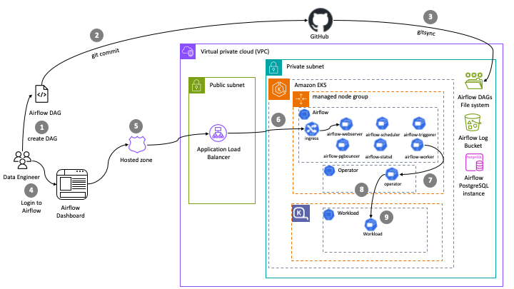

import Tabs from '@theme/Tabs';
import TabItem from '@theme/TabItem';
import CollapsibleContent from '../../../src/components/CollapsibleContent';

import CodeBlock from '@theme/CodeBlock';
import SparkComputeOptimizedProvisioner from '!!raw-loader!../../../../analytics/terraform/spark-k8s-operator/karpenter-provisioners/spark-compute-optimized-provisioner.yaml';

# Self-managed Apache Airflow deployment on Amazon EKS

## Introduction

This pattern deploys self-managed [Apache Airflow](https://airflow.apache.org/docs/apache-airflow/stable/) deployment on EKS. This blueprint deploys Airflow on Amazon EKS managed node groups and leverages Karpenter to run the workloads.

**Architecture**



This pattern uses opinionated defaults to keep the deployment experience simple but also keeps it flexible so that you can pick and choose necessary add-ons during deployment. We recommend keeping the defaults and only customize if you have viable alternative option available for replacement.

In terms of infrastructure, below are the resources that are created by this pattern:

- EKS Cluster Control plane with public endpoint (recommended for demo/poc environment)
- One managed node group
  - Core Node group with 3 instances spanning multi-AZs for running Apache Airflow and other system critical pods. e.g., Cluster Autoscaler, CoreDNS, Observability, Logging etc.

- Apache Airflow core components (with airflow-core.tf):
  - Amazon RDS PostgreSQL instance and security group for Airflow meta database.
  - Airflow namespace
  - Kubernetes service accounts and AWS IAM roles for service account (IRSA) for Airflow Webserver, Airflow Scheduler, and Airflow Worker.
  - Amazon Elastic File System (EFS), EFS mounts, Kubernetes Storage Class for EFS, and Kubernetes Persistent Volume Claim for mounting Airflow DAGs for Airflow pods.
  - Amazon S3 log bucket for Airflow logs

AWS for FluentBit is employed for logging, and a combination of Prometheus, Amazon Managed Prometheus, and open source Grafana are used for observability. You can see the complete list of add-ons available below.
:::tip
We recommend running all the default system add-ons on a dedicated EKS managed nodegroup such as `core-node-group` as provided by this pattern.
:::
:::danger
We don't recommend removing critical add-ons (`Amazon VPC CNI`, `CoreDNS`, `Kube-proxy`).
:::
| Add-on | Enabled by default? | Benefits | Link |
| :---  | :----: | :---- | :---- |
| Amazon VPC CNI | Yes | VPC CNI is available as an [EKS add-on](https://docs.aws.amazon.com/eks/latest/userguide/eks-networking-add-ons.html) and is responsible for creating ENI's and IPv4 or IPv6 addresses for your spark application pods | [VPC CNI Documentation](https://docs.aws.amazon.com/eks/latest/userguide/managing-vpc-cni.html) |
| CoreDNS | Yes | CoreDNS is available as an [EKS add-on](https://docs.aws.amazon.com/eks/latest/userguide/eks-networking-add-ons.html) and is responsible for resolving DNS queries for spark application and for Kubernetes cluster | [EKS CoreDNS Documentation](https://docs.aws.amazon.com/eks/latest/userguide/managing-coredns.html) |
| Kube-proxy | Yes | Kube-proxy is available as an [EKS add-on](https://docs.aws.amazon.com/eks/latest/userguide/eks-networking-add-ons.html) and it maintains network rules on your nodes and enables network communication to your spark application pods | [EKS kube-proxy Documentation](https://docs.aws.amazon.com/eks/latest/userguide/managing-kube-proxy.html) |
| Amazon EBS CSI driver | Yes | EBS CSI driver is available as an [EKS add-on](hhttps://docs.aws.amazon.com/eks/latest/userguide/eks-add-ons.html) and it allows EKS clusters to manage the lifecycle of EBS volumes | [EBS CSI Driver Documentation](https://docs.aws.amazon.com/eks/latest/userguide/ebs-csi.html)
| Amazon EFS CSI driver | Yes | The Amazon EFS Container Storage Interface (CSI) driver provides a CSI interface that allows Kubernetes clusters running on AWS to manage the lifecycle of Amazon EFS file systems. | [EFS CSI Driver Documentation](https://docs.aws.amazon.com/eks/latest/userguide/efs-csi.html)
| Karpenter | Yes | Karpenter is nodegroup-less autoscaler that provides just-in-time compute capacity for spark applications on Kubernetes clusters | [Karpenter Documentation](https://karpenter.sh/) |
| Cluster Autoscaler | Yes | Kubernetes Cluster Autoscaler automatically adjusts the size of Kubernetes cluster and is available for scaling nodegroups (such as `core-node-group`) in the cluster | [Cluster Autoscaler Documentation](https://github.com/kubernetes/autoscaler/blob/master/cluster-autoscaler/cloudprovider/aws/README.md) |
| Cluster proportional autoscaler | Yes | This is responsible for scaling CoreDNS pods in your Kubernetes cluster | [Cluster Proportional Autoscaler Documentation](https://github.com/kubernetes-sigs/cluster-proportional-autoscaler) |
| Metrics server | Yes | Kubernetes metrics server is responsible for aggregating cpu, memory and other container resource usage within your cluster | [EKS Metrics Server Documentation](https://docs.aws.amazon.com/eks/latest/userguide/metrics-server.html) |
| Prometheus | Yes | Prometheus is responsible for monitoring EKS cluster including spark applications in your EKS cluster. We use Prometheus deployment for scraping and ingesting metrics into Amazon Managed Prometheus and Kubecost | [Prometheus Documentation](https://prometheus.io/docs/introduction/overview/) |
| Amazon Managed Prometheus | Yes | This is responsible for storing and scaling of EKS cluster and spark application metrics | [Amazon Managed Prometheus Documentation](https://docs.aws.amazon.com/prometheus/latest/userguide/what-is-Amazon-Managed-Service-Prometheus.html) |
| Kubecost | Yes | Kubecost is responsible for providing cost break down by Spark application. You can monitor costs based on per job, namespace or labels | [EKS Kubecost Documentation](https://docs.aws.amazon.com/eks/latest/userguide/cost-monitoring.html) |
| CloudWatch metrics | Yes | CloudWatch container insights metrics shows simple and standardized way to monitor not only AWS resources but also EKS resources on CloudWatch dashboard | [CloudWatch Container Insights Documentation](https://docs.aws.amazon.com/AmazonCloudWatch/latest/monitoring/Container-Insights-metrics-EKS.html) |
|AWS for Fluent-bit | Yes | This can be used to publish EKS cluster and worker node logs to CloudWatch Logs or 3rd party logging system | [AWS For Fluent-bit Documentation](https://github.com/aws/aws-for-fluent-bit) |
| AWS Load Balancer Controller | Yes | The AWS Load Balancer Controller manages AWS Elastic Load Balancers for a Kubernetes cluster. | [AWS Load Balancer Controller Documentation](https://docs.aws.amazon.com/eks/latest/userguide/aws-load-balancer-controller.html) |

## Prerequisites

Ensure that you have installed the following tools on your machine.

1. [aws cli](https://docs.aws.amazon.com/cli/latest/userguide/install-cliv2.html)
2. [kubectl](https://Kubernetes.io/docs/tasks/tools/)
3. [terraform](https://learn.hashicorp.com/tutorials/terraform/install-cli)

## Deploying the Solution

Clone the repository

```bash
git clone https://github.com/awslabs/data-on-eks.git
```

Navigate into self-managed-airflow directory and run install.sh script

```bash
cd data-on-eks/schedulers/terraform/self-managed-airflow
chmod +x install.sh
./install.sh
```

## Verify the resources

### Create kubectl config

Update the placeholder for AWS region and run the below command.

```bash
mv ~/.kube/config ~/.kube/config.bk
aws eks update-kubeconfig --region <region>  --name self-managed-airflow
```

### Describe the EKS Cluster

```bash
aws eks describe-cluster --name self-managed-airflow
```

### Verify the EFS PV and PVC created by this deployment

```bash
kubectl get pvc -n airflow

NAME           STATUS   VOLUME                                     CAPACITY   ACCESS MODES   STORAGECLASS   AGE
airflow-dags   Bound    pvc-157cc724-06d7-4171-a14d-something   10Gi       RWX            efs-sc         73m

kubectl get pv -n airflow
NAME                                       CAPACITY   ACCESS MODES   RECLAIM POLICY   STATUS   CLAIM                          STORAGECLASS   REASON   AGE
pvc-157cc724-06d7-4171-a14d-something   10Gi       RWX            Delete           Bound    airflow/airflow-dags           efs-sc                  74m

```

### Verify the EFS Filesystem

```bash
aws efs describe-file-systems --query "FileSystems[*].FileSystemId" --output text
```
### Verify S3 bucket created for Airflow logs

```bashell
aws s3 ls | grep airflow-logs-
```

### Verify the Airflow deployment

```bashell
kubectl get deployment -n airflow

NAME                READY   UP-TO-DATE   AVAILABLE   AGE
airflow-pgbouncer   1/1     1            1           77m
airflow-scheduler   2/2     2            2           77m
airflow-statsd      1/1     1            1           77m
airflow-triggerer   1/1     1            1           77m
airflow-webserver   2/2     2            2           77m

```

### Fetch Postgres RDS password

Amazon Postgres RDS database password can be fetched from the Secrets manager

- Login to AWS console and open secrets manager
- Click on `postgres` secret name
- Click on Retrieve secret value button to verify the Postgres DB master password

### Login to Airflow Web UI

This deployment creates an Ingress object with public LoadBalancer(internal # Private Load Balancer can only be accessed within the VPC) for demo purpose
For production workloads, you can modify `airflow-values.yaml` to choose `internal` LB. In addition, it's also recommended to use Route53 for Airflow domain and ACM for generating certificates to access Airflow on HTTPS port.

Execute the following command to get the ALB DNS name

```bash
kubectl get ingress -n airflow

NAME                      CLASS   HOSTS   ADDRESS                                                                PORTS   AGE
airflow-airflow-ingress   alb     *       k8s-dataengineering-c92bfeb177-randomnumber.us-west-2.elb.amazonaws.com   80      88m

```

The above ALB URL will be different for you deployment. So use your URL and open it in a brower

e.g., Open URL `http://k8s-dataengineering-c92bfeb177-randomnumber.us-west-2.elb.amazonaws.com/` in a browser


By default, Airflow creates a default user with `admin` and password as `admin`

Login with Admin user and password and create new users for Admin and Viewer roles and delete the default admin user

### Execute Sample Airflow Job

- Login to Airflow WebUI
- Click on `DAGs` link on the top of the page. This will show dags pre-created by the GitSync feature
- Execute the hello_world_scheduled_dag DAG by clicking on Play button (`>`)
- Verify the DAG execution from `Graph` link
- All the Tasks will go green after few minutes
- Click on one of the green Task which opens a popup with log link where you can verify the logs pointing to S3

<CollapsibleContent header={<h2><span>Airflow to run Spark workloads with Karpenter</span></h2>}>


This option presents leverages Karpenter as the autoscaler, eliminating the need for Managed Node Groups and Cluster Autoscaler. In this design, Karpenter and its provisioner are responsible for creating both On-Demand and Spot instances, dynamically selecting instance types based on user demands. Karpenter offers improved performance compared to Cluster Autoscaler, with more efficient node scaling and faster response times. Karpenter's key features include its ability to scale from zero, optimizing resource utilization and reducing costs when there is no demand for resources. Additionally, Karpenter supports multiple provisioners, allowing for greater flexibility in defining the required infrastructure for different workload types, such as compute, memory, and GPU-intensive tasks. Furthermore, Karpenter integrates seamlessly with Kubernetes, providing automatic, real-time adjustments to the cluster size based on observed workloads and scaling events. This enables a more efficient and cost-effective EKS cluster design that adapts to the ever-changing demands of Spark applications and other workloads.

In this tutorial, you will use Karpenter provisioner that uses memory optimized instances. This template uses the AWS Node template with Userdata.

<details>
<summary> To view Karpenter provisioner for memory optimized instances, Click to toggle content!</summary>

<CodeBlock language="yaml">{SparkComputeOptimizedProvisioner}</CodeBlock>
</details>

To run Spark Jobs that can use this provisioner, you need to submit your jobs by adding `tolerations` to your Spark Application manifest. Additionally, to ensure Spark Driver pods run only on `On-Demand` nodes and Spark Executors run only on `Spot` nodes, add the `karpenter.sh/capacity-type` node selectors.

For example,

```yaml
    # Using Karpenter provisioner nodeSelectors and tolerations
    nodeSelector:
      NodeGroupType: "SparkComputeOptimized"
      karpenter.sh/capacity-type: "on-demand"
    tolerations:
      - key: "spark-compute-optimized"
        operator: "Exists"
        effect: "NoSchedule"
```

### Create Kubernetes Default Connection from Airflow Web UI

This step is critical for writing the Airflow to connect to EKS cluster.

- Login to Airflow WebUI with `admin` and password as `admin` using ALB URL
- Select `Admin` dropdown and Click on `Connections`
- Click on "+" button to add a new record
- Enter Connection Id as `kubernetes_default`, Connection Type as `Kubernetes Cluster Connection` and tick the checkbox **In cluster configuration**
- Click on Save button


Navigate to airflow directory and change the **enable_airflow_spark_example** variable to `true` in **variable.tf**.

```bash
cd schedulers/terraform/self-managed-airflow
```

```yaml
variable "enable_airflow_spark_example" {
  description = "Enable Apache Airflow and Spark Operator example"
  type        = bool
  default     = true
}
```

Change the **enable_spark_operator** variable to `true` in **addons.tf**.

```yaml
variable "enable_airflow_spark_example" {
  description = "Enable Apache Airflow and Spark Operator example"
  type        = bool
  default     = true
}
```

Run install.sh script
```bash
cd data-on-eks/schedulers/terraform/self-managed-airflow
chmod +x install.sh
./install.sh
```

### Execute Sample Spark Job DAG

- Login to Airflow WebUI
- Click on `DAGs` link on the top of the page. This will show dags pre-created by the GitSync feature
- Execute the `example_pyspark_pi_job` DAG by clicking on Play button (`>`)

<details>
<summary> To view example DAG, click to toggle content!</summary>

```python
"""
from __future__ import annotations

import os
from datetime import datetime, timedelta

# [START import_module]
# The DAG object; we'll need this to instantiate a DAG
from airflow import DAG

# Operators; we need this to operate!
from airflow.providers.cncf.kubernetes.operators.spark_kubernetes import SparkKubernetesOperator
from airflow.providers.cncf.kubernetes.sensors.spark_kubernetes import SparkKubernetesSensor

# [END import_module]

# [START instantiate_dag]

DAG_ID = "example_pyspark_pi_job"

with DAG(
    DAG_ID,
    default_args={"max_active_runs": 1},
    description="submit spark-pi as sparkApplication on kubernetes",
    schedule=timedelta(days=1),
    start_date=datetime(2021, 1, 1),
    catchup=False,
) as dag:
    # [START SparkKubernetesOperator_DAG]
    t1 = SparkKubernetesOperator(
        task_id="pyspark_pi_submit",
        namespace="spark-team-a",
        application_file="example_pyspark_pi_job.yaml",
        do_xcom_push=True,
        dag=dag,
    )

    t2 = SparkKubernetesSensor(
        task_id="pyspark_pi_monitor",
        namespace="spark-team-a",
        application_name="{{ task_instance.xcom_pull(task_ids='pyspark_pi_submit')['metadata']['name'] }}",
        dag=dag,
    )
    t1 >> t2
```
</details>

- DAG has two tasks, the first task is `SparkKubernetesOperator` that uses sample SparkApplication `example_pyspark_pi_job.yaml` file. The SparkKubernetesOperator task creates Airflow worker pods in `airflow` namespace. Airflow worker triggers pre-installed Kubernetes Spark Operator in `spark-operator` namespace. Kubernetes Spark Operator then uses `example_pyspark_pi_job.yaml` to launch Spark Driver on `On-Demand` nodes, Spark Executors on `Spot` nodes in `spark-team-a` namespace and submits the PySpark job to calculate the value of Pi.

<details>
<summary> To view sample SparkApplication with tolerations and node selectors, click to toggle content!</summary>

```yaml
# NOTE: This example requires the following prerequisites before executing the jobs
# 1. Ensure spark-team-a name space exists

---
apiVersion: "sparkoperator.k8s.io/v1beta2"
kind: SparkApplication
metadata:
  name: pyspark-pi-karpenter
  namespace: spark-team-a
spec:
  type: Python
  pythonVersion: "3"
  mode: cluster
  image: "public.ecr.aws/r1l5w1y9/spark-operator:3.2.1-hadoop-3.3.1-java-11-scala-2.12-python-3.8-latest"
  imagePullPolicy: Always
  mainApplicationFile: local:///opt/spark/examples/src/main/python/pi.py
  sparkVersion: "3.1.1"
  restartPolicy:
    type: OnFailure
    onFailureRetries: 1
    onFailureRetryInterval: 10
    onSubmissionFailureRetries: 5
    onSubmissionFailureRetryInterval: 20
  driver:
    cores: 1
    coreLimit: "1200m"
    memory: "512m"
    labels:
      version: 3.1.1
    serviceAccount: spark-team-a
    # Using Karpenter provisioner nodeSelectors and tolerations
    nodeSelector:
      NodeGroupType: "SparkComputeOptimized"
      karpenter.sh/capacity-type: "on-demand"
    tolerations:
      - key: "spark-compute-optimized"
        operator: "Exists"
        effect: "NoSchedule"
  executor:
    cores: 1
    instances: 2
    memory: "512m"
    serviceAccount: spark-team-a
    labels:
      version: 3.1.1
    # Using Karpenter provisioner nodeSelectors and tolerations
    nodeSelector:
      NodeGroupType: "SparkComputeOptimized"
      karpenter.sh/capacity-type: "spot"
    tolerations:
      - key: "spark-compute-optimized"
        operator: "Exists"
        effect: "NoSchedule"

```
</details>

- The second task is `SparkKubernetesSensor` that waits for the Kubernetes Spark Operator to complete the execution.
- Verify the DAG execution from `Graph` link
- All the Tasks will go green after few minutes
- Click on one of the green Task which opens a popup with log link where you can verify the logs pointing to S3

</CollapsibleContent>

<CollapsibleContent header={<h2><span>Cleanup</span></h2>}>

This script will cleanup the environment using `-target` option to ensure all the resources are deleted in correct order.

```bash
cd data-on-eks/schedulers/terraform/self-managed-airflow && chmod +x cleanup.sh
./cleanup.sh
```

</CollapsibleContent>

:::caution
To avoid unwanted charges to your AWS account, delete all the AWS resources created during this deployment
:::
