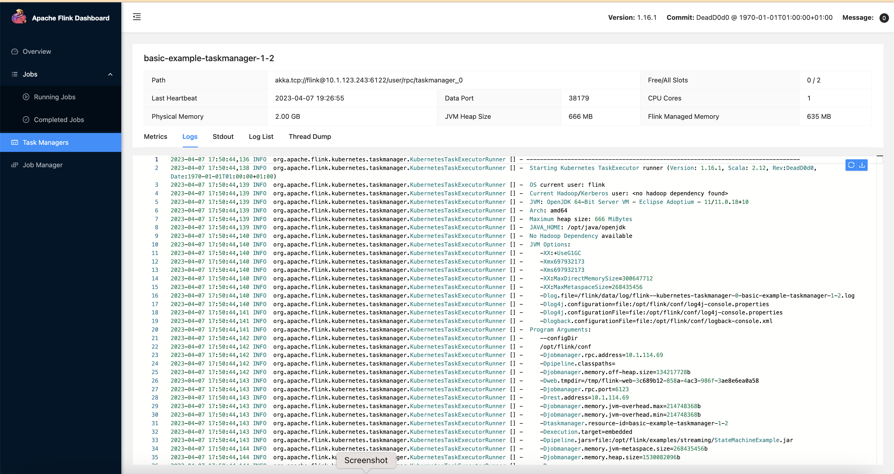

import Tabs from '@theme/Tabs';
import TabItem from '@theme/TabItem';
import CollapsibleContent from '../../../src/components/CollapsibleContent';

:::info
Please note that we are working on adding more features to this blueprint such as Flink examples with multiple connectors, Ingress for WebUI, Grafana dashboards etc.
:::

## Introduction to Apache Flink
[Apache Flink](https://flink.apache.org/) is an open-source, unified stream processing and batch processing framework that was designed to process large amounts of data. It provides fast, reliable, and scalable data processing with fault tolerance and exactly-once semantics.
Some of the key features of Flink are:
- **Distributed Processing**: Flink is designed to process large volumes of data in a distributed fashion, making it horizontally scalable and fault-tolerant.
- **Stream Processing and Batch Processing**: Flink provides APIs for both stream processing and batch processing. This means you can process data in real-time, as it's being generated, or process data in batches.
- **Fault Tolerance**: Flink has built-in mechanisms for handling node failures, network partitions, and other types of failures.
- **Exactly-once Semantics**: Flink supports exactly-once processing, which ensures that each record is processed exactly once, even in the presence of failures.
- **Low Latency**: Flink's streaming engine is optimized for low-latency processing, making it suitable for use cases that require real-time processing of data.
- **Extensibility**: Flink provides a rich set of APIs and libraries, making it easy to extend and customize to fit your specific use case.

## Architecture

Flink Architecture high level design with EKS.


## Flink Kubernetes Operator
[Flink Kubernetes Operator](https://nightlies.apache.org/flink/flink-kubernetes-operator-docs-main/) is a powerful tool for managing Flink clusters on Kubernetes. Flink Kubernetes Operator (Operator) acts as a control plane to manage the complete deployment lifecycle of Apache Flink applications. The Operator can be installed on a Kubernetes cluster using Helm. The core responsibility of the Flink operator is to manage the full production lifecycle of Flink applications.
1. Running, suspending and deleting applications
2. Stateful and stateless application upgrades
3. Triggering and managing savepoints
4. Handling errors, rolling-back broken upgrades

Flink Operator defines two types of Custom Resources(CR) which are the extensions of the Kubernetes API.

<Tabs>
<TabItem value="FlinkDeployment" label="FlinkDeployment">


**FlinkDeployment**
- FlinkDeployment CR defines **Flink Application** and **Session Cluster** deployments.
- Application deployments manage a single job deployment on a dedicated Flink cluster in Application mode.
- Session clusters allows you to run multiple Flink Jobs on an existing Session cluster.

    <details>
    <summary>FlinkDeployment in Application modes, Click to toggle content!</summary>

    ```yaml
    apiVersion: flink.apache.org/v1beta1
    kind: FlinkDeployment
    metadata:
    namespace: default
    name: basic-example
    spec:
    image: flink:1.16
    flinkVersion: v1_16
    flinkConfiguration:
        taskmanager.numberOfTaskSlots: "2"
    serviceAccount: flink
    jobManager:
        resource:
        memory: "2048m"
        cpu: 1
    taskManager:
        resource:
        memory: "2048m"
        cpu: 1
    job:
        jarURI: local:///opt/flink/examples/streaming/StateMachineExample.jar
        parallelism: 2
        upgradeMode: stateless
        state: running
    ```
    </details>

</TabItem>

<TabItem value="FlinkSessionJob" label="FlinkSessionJob">

**FlinkSessionJob**
- The `FlinkSessionJob` CR defines the session job on the **Session cluster** and each Session cluster can run multiple `FlinkSessionJob`.
- Session deployments manage Flink Session clusters without providing any job management for it

    <details>
    <summary>FlinkSessionJob using an existing "basic-session-cluster" session cluster deployment</summary>

    ```yaml
    apiVersion: flink.apache.org/v1beta1
    kind: FlinkSessionJob
    metadata:
    name: basic-session-job-example
    spec:
    deploymentName: basic-session-cluster
    job:
        jarURI: https://repo1.maven.org/maven2/org/apache/flink/flink-examples-streaming_2.12/1.15.3/flink-examples-streaming_2.12-1.15.3-TopSpeedWindowing.jar
        parallelism: 4
        upgradeMode: stateless
    ```

    </details>

</TabItem>
</Tabs>

:::info
Session clusters use a similar spec to Application clusters with the only difference that `job` is not defined in the yaml spec.
:::

:::info
According to the Flink documentation, it is recommended to use FlinkDeployment in Application mode for production environments.
:::

On top of the deployment types the Flink Kubernetes Operator also supports two modes of deployments: `Native` and `Standalone`.

<Tabs>
<TabItem value="Native" label="Native">

**Native**

- Native cluster deployment is the default deployment mode and uses Flink’s built in integration with Kubernetes when deploying the cluster.
- Flink cluster communicates directly with Kubernetes and allows it to manage Kubernetes resources, e.g. dynamically allocate and de-allocate TaskManager pods.
- Flink Native can be useful for advanced users who want to build their own cluster management system or integrate with existing management systems.
- Flink Native allows for more flexibility in terms of job scheduling and execution.
- For standard Operator use, running your own Flink Jobs in Native mode is recommended.

```yaml
apiVersion: flink.apache.org/v1beta1
kind: FlinkDeployment
...
spec:
...
mode: native
```
</TabItem>

<TabItem value="Standalone" label="Standalone">

**Standalone**

- Standalone cluster deployment simply uses Kubernetes as an orchestration platform that the Flink cluster is running on.
- Flink is unaware that it is running on Kubernetes and therefore all Kubernetes resources need to be managed externally, by the Kubernetes Operator.

    ```yaml
    apiVersion: flink.apache.org/v1beta1
    kind: FlinkDeployment
    ...
    spec:
    ...
    mode: standalone
    ```

</TabItem>
</Tabs>

## Best Practices for Running Flink Jobs on Kubernetes
To get the most out of Flink on Kubernetes, here are some best practices to follow:

- **Use the Kubernetes Operator**: Install and use the Flink Kubernetes Operator to automate the deployment and management of Flink clusters on Kubernetes.
- **Deploy in dedicated namespaces**: Create a separate namespace for the Flink Kubernetes Operator and another one for Flink jobs/workloads. This ensures that the Flink jobs are isolated and have their own resources.
- **Use high-quality storage**: Store Flink checkpoints and savepoints in high-quality storage such as Amazon S3 or another durable external storage. These storage options are reliable, scalable, and offer durability for large volumes of data.
- **Optimize resource allocation**: Allocate sufficient resources to Flink jobs to ensure optimal performance. This can be done by setting resource requests and limits for Flink containers.
- **Proper network isolation**: Use Kubernetes Network Policies to isolate Flink jobs from other workloads running on the same Kubernetes cluster. This ensures that Flink jobs have the required network access without being impacted by other workloads.
- **Configure Flink optimally**: Tune Flink settings according to your use case. For example, adjust Flink's parallelism settings to ensure that Flink jobs are scaled appropriately based on the size of the input data.
- **Use checkpoints and savepoints**: Use checkpoints for periodic snapshots of Flink application state and savepoints for more advanced use cases such as upgrading or downgrading the application.
- **Store checkpoints and savepoints in the right places**: Store checkpoints in distributed file systems or key-value stores like Amazon S3 or another durable external storage. Store savepoints in a durable external storage like Amazon S3.

## Flink Upgrade
Flink Operator provides three upgrade modes for Flink jobs. Checkout the [Flink upgrade docs](https://nightlies.apache.org/flink/flink-kubernetes-operator-docs-main/docs/custom-resource/job-management/#stateful-and-stateless-application-upgrades) for up-to-date information.

1. **stateless**: Stateless application upgrades from empty state
2. **last-state**: Quick upgrades in any application state (even for failing jobs), does not require a healthy job as it always uses the latest checkpoint information. Manual recovery may be necessary if HA metadata is lost.
3. **savepoint**: Use savepoint for upgrade, providing maximal safety and possibility to serve as backup/fork point. The savepoint will be created during the upgrade process. Note that the Flink job needs to be running to allow the savepoint to get created. If the job is in an unhealthy state, the last checkpoint will be used (unless kubernetes.operator.job.upgrade.last-state-fallback.enabled is set to false). If the last checkpoint is not available, the job upgrade will fail.

:::info
`last-state` or `savepoint` are recommended modes for production
:::


<CollapsibleContent header={<h2><span>Deploying the Solution</span></h2>}>

In this [example](https://github.com/awslabs/data-on-eks/tree/main/streaming/flink), you will provision the following resources required to run Flink Jobs with Flink Operator and Apache YuniKorn.

This example deploys an EKS Cluster running the Flink Operator into a new VPC.

- Creates a new sample VPC, 2 Private Subnets and 2 Public Subnets
- Creates Internet gateway for Public Subnets and NAT Gateway for Private Subnets
- Creates EKS Cluster Control plane with public endpoint (for demo reasons only) with core managed node group, on-demand node group and Spot node group for Flink workloads
- Deploys Metrics server, Cluster Autoscaler, Apache YuniKorn, Karpenter, Grafana, AMP and Prometheus server
- Deploys Cert Manager and Flink Operator add-ons. Flink Operator has dependency on Cert Manager
- Creates a new Flink Data team resources that includes namespace, service account, IRSA, Role and Role binding
- Deploys three Karpenter provisioners for different compute types

### Prerequisites

Ensure that you have installed the following tools on your machine.

1. [aws cli](https://docs.aws.amazon.com/cli/latest/userguide/install-cliv2.html)
2. [kubectl](https://Kubernetes.io/docs/tasks/tools/)
3. [terraform](https://learn.hashicorp.com/tutorials/terraform/install-cli)

### Deploy

Clone the repository.

```bash
git clone https://github.com/awslabs/data-on-eks.git
```

Navigate into Flink's Terraform template directory and run `install.sh` script.

```bash
cd data-on-eks/streaming/flink
chmod +x install.sh
./install.sh
```

Verify the cluster status

    ➜ kubectl get nodes -A
    NAME                                         STATUS   ROLES    AGE   VERSION
    ip-10-1-160-150.us-west-2.compute.internal   Ready    <none>   24h   v1.24.11-eks-a59e1f0
    ip-10-1-169-249.us-west-2.compute.internal   Ready    <none>   6d    v1.24.11-eks-a59e1f0
    ip-10-1-69-244.us-west-2.compute.internal    Ready    <none>   6d    v1.24.11-eks-a59e1f0

    ➜  ~ kubectl get pods -n flink-kubernetes-operator
    NAME                                         READY   STATUS    RESTARTS   AGE
    flink-kubernetes-operator-77697fb949-rwqqm   2/2     Running   0          24h

    ➜  ~ kubectl get pods -n cert-manager
    NAME                                      READY   STATUS    RESTARTS   AGE
    cert-manager-77fc7548dc-dzdms             1/1     Running   0          24h
    cert-manager-cainjector-8869b7ff7-4w754   1/1     Running   0          24h
    cert-manager-webhook-586ddf8589-g6s87     1/1     Running   0          24h

To list all the resources created for Flink team to run Flink jobs using this namespace

    ➜  ~ kubectl get all,role,rolebinding,serviceaccount --namespace flink-team-a-ns
    NAME                                               CREATED AT
    role.rbac.authorization.k8s.io/flink-team-a-role   2023-04-06T13:17:05Z

    NAME                                                              ROLE                     AGE
    rolebinding.rbac.authorization.k8s.io/flink-team-a-role-binding   Role/flink-team-a-role   22h

    NAME                             SECRETS   AGE
    serviceaccount/default           0         22h
    serviceaccount/flink-team-a-sa   0         22h


</CollapsibleContent>


<CollapsibleContent header={<h2><span>Execute Sample Flink job with Karpenter</span></h2>}>

Navigate to example directory and submit the Flink job.

```bash
cd data-on-eks/streaming/flink/examples/karpenter
kubectl apply -f flink-sample-job.yaml
```

Monitor the job status using the below command.
You should see the new nodes triggered by the karpenter and the YuniKorn will schedule one Job manager pod and one Taskmanager pods on this node.

```bash
kubectl get deployments -n flink-team-a-ns
NAME            READY   UP-TO-DATE   AVAILABLE   AGE
basic-example   1/1     1            1           5m9s

kubectl get pods -n flink-team-a-ns
NAME                            READY   STATUS    RESTARTS   AGE
basic-example-bf467dff7-zwhgc   1/1     Running   0          102s
basic-example-taskmanager-1-1   1/1     Running   0          87s
basic-example-taskmanager-1-2   1/1     Running   0          87s

kubectl get services -n flink-team-a-ns
NAME                 TYPE        CLUSTER-IP    EXTERNAL-IP   PORT(S)    AGE
basic-example-rest   ClusterIP   172.20.74.9   <none>        8081/TCP   3m43s
```

To access the Flink WebUI for the job run this command locally.

```bash
kubectl port-forward svc/basic-example-rest 8081 -n flink-team-a-ns
```





</CollapsibleContent>

<CollapsibleContent header={<h2><span>Execute Sample Flink job with Managed Node Groups and Cluster Autoscaler</span></h2>}>

Navigate to example directory and submit the Spark job.

```bash
cd data-on-eks/streaming/flink/examples/cluster-autoscaler
kubectl apply -f flink-sample-job.yaml
```

Monitor the job status using the below command.
You should see the new nodes triggered by the Cluster Autoscaler and the YuniKorn will schedule one Job manager pod and one Taskmanager pods on this node.

```bash
kubectl get deployments -n flink-team-a-ns
NAME            READY   UP-TO-DATE   AVAILABLE   AGE
basic-example   1/1     1            1           5m9s

kubectl get pods -n flink-team-a-ns
NAME                            READY   STATUS    RESTARTS   AGE
basic-example-bf467dff7-zwhgc   1/1     Running   0          102s
basic-example-taskmanager-1-1   1/1     Running   0          87s
basic-example-taskmanager-1-2   1/1     Running   0          87s

kubectl get services -n flink-team-a-ns
NAME                 TYPE        CLUSTER-IP    EXTERNAL-IP   PORT(S)    AGE
basic-example-rest   ClusterIP   172.20.74.9   <none>        8081/TCP   3m43s
```

To access the Flink WebUI for the job run this command locally.

```bash
kubectl port-forward svc/basic-example-rest 8081 -n flink-team-a-ns
```


</CollapsibleContent>

<CollapsibleContent header={<h2><span>Cleanup</span></h2>}>

This script will cleanup the environment using `-target` option to ensure all the resources are deleted in correct order.

```bash
cd data-on-eks/streaming/flink && chmod +x cleanup.sh
./cleanup.sh
```

</CollapsibleContent>

:::caution
To avoid unwanted charges to your AWS account, delete all the AWS resources created during this deployment
:::
