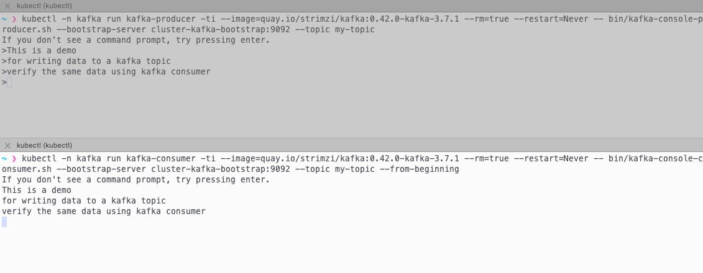
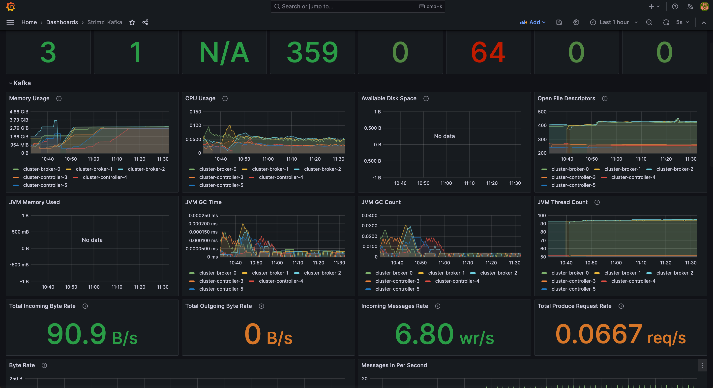

import CollapsibleContent from '../../../src/components/CollapsibleContent';

# Apache Kafka
[Apache Kafka](https://kafka.apache.org/) is an open-source distributed event streaming platform used by thousands of companies for high-performance data pipelines, streaming analytics, data integration, and mission-critical applications. This blueprint implements Kafka using **KRaft (Kafka Raft) mode**, a significant architectural improvement that eliminates the need for Zookeeper.

## Why and what's KRaft?
KRaft mode simplifies Kafka deployments, enhances scalability, and improves overall system performance. By using a built-in consensus protocol, KRaft reduces operational complexity, potentially speeds up broker startup times, and allows for better handling of metadata operations. This architectural shift enables Kafka to manage larger clusters more efficiently, making it an attractive option for organizations looking to streamline their event streaming infrastructure and prepare for future scalability needs.

## Strimzi for Apache Kafka
[Strimzi](https://strimzi.io/) provides a way to run an Apache Kafka cluster on Kubernetes in various deployment configurations. Strimzi combines security and simple configuration to deploy and manage Kafka on Kubernetes using kubectl and/or GitOps based on the Operator Pattern.

As of version `0.32.0`, Strimzi provides full support for deploying Kafka clusters using KRaft, making it easier for organizations to leverage this new architecture. By using Strimzi, you can seamlessly deploy and manage Kafka clusters in KRaft mode on Kubernetes, taking advantage of its custom resource definitions (CRDs) and operators to handle the complexities of configuration and lifecycle management.

## Architecture

:::info

Architecture diagram work in progress

:::

<CollapsibleContent header={<h2><span>Managed Alternatives</span></h2>}>

### Amazon Managed Streaming for Apache Kafka (MSK)
[Amazon Managed Streaming for Apache Kafka (Amazon MSK)](https://aws.amazon.com/msk/) is a fully managed service that enables you to build and run applications that use Apache Kafka to process streaming data. Amazon MSK provides the control-plane operations, such as those for creating, updating, and deleting clusters. It lets you use Apache Kafka data-plane operations, such as those for producing and consuming data. It runs open-source versions of Apache Kafka. This means existing applications, tooling, and plugins from partners and the Apache Kafka community are supported. You can use Amazon MSK to create clusters that use any of the Apache Kafka versions listed under [Supported Apache Kafka versions](https://docs.aws.amazon.com/msk/latest/developerguide/supported-kafka-versions.html). Amazon MSK offers cluster-based or serverless deployment types.

### Amazon Kinesis Data Streams (KDS)
[Amazon Kinesis Data Streams (KDS)](https://aws.amazon.com/kinesis/data-streams/) allows users to collect and process large streams of data records in real time. You can create data-processing applications, known as Kinesis Data Streams applications. A typical Kinesis Data Streams application reads data from a data stream as data records. You can send the processed records to dashboards, use them to generate alerts, dynamically change pricing and advertising strategies, or send data to a variety of other AWS services. Kinesis Data Streams support your choice of stream processing framework including Kinesis Client Library (KCL), Apache Flink, and Apache Spark Streaming. It is serverless, and scales automatically.

</CollapsibleContent>

<CollapsibleContent header={<h2><span>Storage considerations when self-managing Kafka</span></h2>}>

The most common resource bottlenecks for Kafka clusters are network throughput, storage throughput, and network throughput between brokers and the storage backend for brokers using network attached storage such as [Amazon Elastic Block Store (EBS)](https://aws.amazon.com/ebs/).

### Advantages to using EBS as persistent storage backend
1. **Improved flexibility and faster recovery:** Fault tolerance is commonly achieved via broker (server) replication within
the cluster and/or maintaining cross-AZ or region replicas. Since the lifecycle of EBS volumes is independent of
Kafka brokers, if a broker fails and needs to be replaced, the EBS volume attached to the failed broker can be reattached to a replacement broker. Most of the replicated data for the replacement broker is already available in the
EBS volume, and does not need to be copied over the network from another broker. This avoids most of the
replication traffic required to bring the replacement broker up to speed with current operations.
2. **Just in time scale up:** The characteristics of EBS volumes can be modified while they’re in use. Broker storage can be
automatically scaled over time rather than provisioning storage for peak or adding additional brokers.
3. **Optimized for frequently-accessed-throughput-intensive workloads:** Volume types such as st1 can be a good fit
since these volumes are offered at a relatively low cost, support a large 1 MiB I/O block size, max IOPS of
500/volume, and includes the ability to burst up to 250 MB/s per TB, with a baseline throughput of 40 MB/s per TB,
and a maximum throughput of 500 MB/s per volume.

### What EBS volumes should I use when self-managing Kafka on AWS?
* General purpose SSD volume **gp3** with a balanced price and performance are widely used, and you can **independently** provision storage (up to 16TiB), IOPS (up to 16,000) and throughput (up to 1,000MiB/s)
* **st1** is a low-cost HDD option for frequently accessed and throughput intensive workloads with up to 500 IOPS and 500 MiB/s
* For critical applications such as Zookeeper, provisioned IOPS volumes (**io2 Block Express, io2**) provide higher durability

### What about NVMe SSD Instance Storage for performance reasons?
While EBS provides flexibility and ease of management, some high-performance use cases may benefit from using local NVMe SSD instance storage. This approach can offer significant performance improvements but comes with trade-offs in terms of data persistence and operational complexity.

#### Considerations and challenges with NVMe SSD Instance Storage
1. **Data Persistence:** Local storage is ephemeral. If an instance fails or is terminated, the data on that storage is lost. This requires careful consideration of your replication strategy and disaster recovery plans, especially if the cluster is big (hundreds of TBs of data).
2. **Cluster Upgrades:** Upgrading Kafka or EKS becomes more complex, as you need to ensure data is properly migrated or replicated before making changes to nodes with local storage.
3. **Scaling Complexity:** Scaling the cluster may require data rebalancing, which can be more time-consuming and resource-intensive compared to using network-attached storage.
4. **Instance Type Lock-in:** Your choice of instance types becomes more limited, as you need to select instances with appropriate local storage options.

#### So, when should you to consider to use Local Storage?
1. For extremely high-performance requirements where every millisecond of latency matters.
2. When your use case can tolerate potential data loss on individual node failures, relying on Kafka's replication for data durability.

While local storage can offer performance benefits, it's important to carefully weigh these against the operational challenges, especially in a dynamic environment like EKS. For most use cases, we recommend starting with EBS storage for its flexibility and easier management, and only considering local storage for specific high-performance scenarios where the trade-offs are justified.

</CollapsibleContent>

<CollapsibleContent header={<h2><span>Deploying the Solution</span></h2>}>

In this [example](https://github.com/awslabs/data-on-eks/tree/main/streaming/kafka), you will provision the following resources to run Kafka Cluster on EKS.

This example deploys an EKS Cluster with Kafka into a new VPC.

- Creates a new sample VPC, 3 Private Subnets and 3 Public Subnets.
- Creates Internet gateway for Public Subnets and NAT Gateway for Private Subnets.
- Creates EKS Cluster Control plane with public endpoint (for demo reasons only) with one managed node group.
- Deploys Metrics server, Karpenter, self-managed ebs-csi-driver, Strimzi Kafka Operator, Grafana Operator.
- Strimzi Kafka Operator is a Kubernetes Operator for Apache Kafka deployed to `strimzi-kafka-operator` namespace. The operator by default watches and handles `kafka` in all namespaces.

### Prerequisites
Ensure that you have installed the following tools on your machine.

1. [aws cli](https://docs.aws.amazon.com/cli/latest/userguide/install-cliv2.html)
2. [kubectl](https://Kubernetes.io/docs/tasks/tools/)
3. [terraform](https://learn.hashicorp.com/tutorials/terraform/install-cli)

### Deploy

Clone the repository:

```bash
git clone https://github.com/awslabs/data-on-eks.git
```

Navigate into one of the example directories and run `install.sh` script:

```bash
cd data-on-eks/streaming/kafka
chmod +x install.sh
./install.sh
```

:::info

This deployment may take between 20 to 30 mins.

:::

## Verify the deployment

### Create kube config

Create kube config file.

```bash
aws eks --region $AWS_REGION update-kubeconfig --name kafka-on-eks
```

### Get nodes

Check if the deployment has created around 3 nodes for Core Node group:

```bash
kubectl get nodes
```

You should see something similar to this:

```text
NAME                                       STATUS   ROLES    AGE     VERSION
ip-10-1-0-193.eu-west-1.compute.internal   Ready    <none>   5h32m   v1.31.0-eks-a737599
ip-10-1-1-231.eu-west-1.compute.internal   Ready    <none>   5h32m   v1.31.0-eks-a737599
ip-10-1-2-20.eu-west-1.compute.internal    Ready    <none>   5h32m   v1.31.0-eks-a737599
```
</CollapsibleContent>

<CollapsibleContent header={<h2><span>Create a Kafka cluster</span></h2>}>

## Deploy the Kafka cluster manifests

Create a namespace dedicated to the Kafka cluster:

```bash
kubectl create namespace kafka
```

Deploy the Kafka cluster manifests:

```bash
kubectl apply -f kafka-manifests/
```

Deploy the Strimzi Kafka dashboards in Grafana:

```bash
kubectl apply -f monitoring-manifests/
```

### Check nodes provisioned by Karpenter

Check if you now see around 9 nodes, 3 nodes for Core Node group and 6 for Kafka brokers across 3 AZs:

```bash
kubectl get nodes
```

You should see something similar to this:

```text
NAME                                       STATUS   ROLES    AGE     VERSION
ip-10-1-1-231.eu-west-1.compute.internal   Ready    <none>   5h32m   v1.31.0-eks-a737599
ip-10-1-2-20.eu-west-1.compute.internal    Ready    <none>   5h32m   v1.31.0-eks-a737599
ip-10-1-0-193.eu-west-1.compute.internal   Ready    <none>   5h32m   v1.31.0-eks-a737599
ip-10-1-0-151.eu-west-1.compute.internal   Ready    <none>   62m     v1.31.0-eks-5da6378
ip-10-1-0-175.eu-west-1.compute.internal   Ready    <none>   62m     v1.31.0-eks-5da6378
ip-10-1-1-104.eu-west-1.compute.internal   Ready    <none>   62m     v1.31.0-eks-5da6378
ip-10-1-1-106.eu-west-1.compute.internal   Ready    <none>   62m     v1.31.0-eks-5da6378
ip-10-1-2-4.eu-west-1.compute.internal     Ready    <none>   62m     v1.31.0-eks-5da6378
ip-10-1-2-56.eu-west-1.compute.internal    Ready    <none>   62m     v1.31.0-eks-5da6378
```

### Verify Kafka Brokers and Controller

Verify the Kafka Broker and Controller pods and the status created by the Strimzi Operator.

```bash
kubectl get strimzipodsets.core.strimzi.io -n kafka
```

You should see something similar to this:

```text
NAME                 PODS   READY PODS   CURRENT PODS   AGE
cluster-broker       3      3            3              64m
cluster-controller   3      3            3              64m
```

Let's confirm that you have created a Kafka cluster in KRaft mode:

```bash
kubectl get kafka.kafka.strimzi.io -n kafka
```

You should see an output similar to this:

```text
NAME      DESIRED KAFKA REPLICAS   DESIRED ZK REPLICAS   READY   METADATA STATE   WARNINGS
cluster                                                  True    KRaft            True
```

### Verify the running Kafka pods
Let's confirm that the pods for the Kafka cluster are running:

```bash
kubectl get pods -n kafka
```

You should see an output similar to this:

```text
NAME                                      READY   STATUS    RESTARTS   AGE
cluster-broker-0                          1/1     Running   0          24m
cluster-broker-1                          1/1     Running   0          15m
cluster-broker-2                          1/1     Running   0          8m31s
cluster-controller-3                      1/1     Running   0          16m
cluster-controller-4                      1/1     Running   0          7m8s
cluster-controller-5                      1/1     Running   0          7m48s
cluster-cruise-control-74f5977f48-l8pzp   1/1     Running   0          24m
cluster-entity-operator-d46598d9c-xgwnh   2/2     Running   0          24m
cluster-kafka-exporter-5ff5ff4675-2cz9m   1/1     Running   0          24m
```
</CollapsibleContent>

<CollapsibleContent header={<h2><span>Create Kafka Topic and run Sample test</span></h2>}>

We will create one kafka topic and run sample producer script to produce new messages to the kafka topic.

### Create a kafka Topic

Run this command to create a new topic called `test-topic` under `kafka` namespace:

```bash
kubectl apply -f examples/kafka-topics.yaml
```

Confirm that the topic has been created:

```bash
kubectl get kafkatopic.kafka.strimzi.io -n kafka
```

You should see an output similar to this:

```text
NAME         CLUSTER   PARTITIONS   REPLICATION FACTOR   READY
test-topic   cluster   12           3                    True
```

Verify the status of the `test-topic` topic.

```bash
kubectl exec -it cluster-broker-0 -c kafka -n kafka -- /bin/bash -c "/opt/kafka/bin/kafka-topics.sh --list --bootstrap-server localhost:9092"
```

You should see an output similar to this:

```text
strimzi.cruisecontrol.metrics
strimzi.cruisecontrol.modeltrainingsamples
strimzi.cruisecontrol.partitionmetricsamples
test-topic
```

### Execute sample Kafka Producer

Open two terminals one for Kafka producer and one for Kafka Consumer. Execute the following command and press enter twice until you see the `>` prompt. Start typing some random content. This data will be written to the `test-topic`.

```bash
kubectl -n kafka run kafka-producer -ti --image=quay.io/strimzi/kafka:0.43.0-kafka-3.8.0 --rm=true --restart=Never -- bin/kafka-console-producer.sh --bootstrap-server cluster-kafka-bootstrap:9092 --topic test-topic
```

### Execute sample Kafka Consumer

Now, you can verify the data written to `test-topic` by running Kafka consumer pod in another terminal

```bash
kubectl -n kafka run kafka-consumer -ti --image=quay.io/strimzi/kafka:0.43.0-kafka-3.8.0 --rm=true --restart=Never -- bin/kafka-console-consumer.sh --bootstrap-server cluster-kafka-bootstrap:9092 --topic test-topic --from-beginning
```

### Kafka Producer and Consumer output



</CollapsibleContent>

<CollapsibleContent header={<h2><span>Grafana Dashboard for Kafka</span></h2>}>

### Login to Grafana
Login to Grafana dashboard by running the following command.

```bash
kubectl port-forward svc/kube-prometheus-stack-grafana 8080:80 -n kube-prometheus-stack
```
Open browser with local [Grafana Web UI](http://localhost:8080/)

Enter username as `admin` and **password** can be extracted from AWS Secrets Manager with the below command.

```bash
aws secretsmanager get-secret-value --secret-id kafka-on-eks-grafana --region $AWS_REGION --query "SecretString" --output text
```

### Open Strimzi Kafka Dashboard

Go to the `Dashboards` page at `http://localhost:8080/dashboards`, then click on `General`, and then on `Strimizi Kafka`.

You should see the below builtin Kafka dashboards which was created during the deployment:



</CollapsibleContent>

<CollapsibleContent header={<h2><span>Cleanup</span></h2>}>

To clean up your environment, run the following commands and enter the same region you used when creating the EKS cluster:

```bash
cd data-on-eks/streaming/kafka
chmod +x cleanup.sh
./cleanup.sh
```

:::info

This may take between 20 to 30 mins.

:::
</CollapsibleContent>
