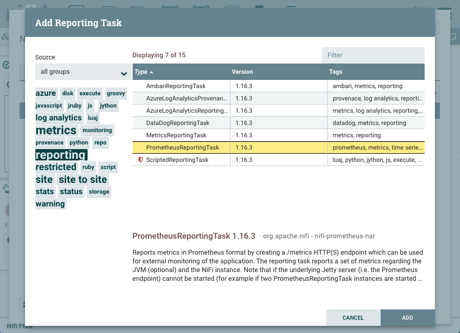
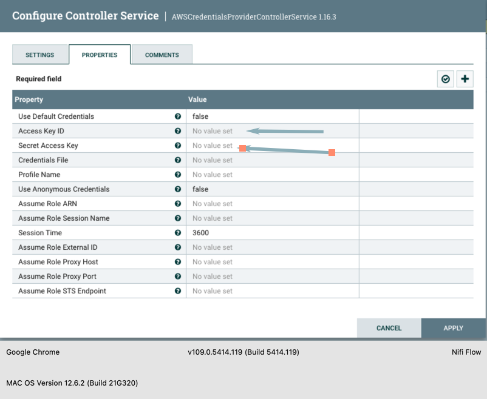
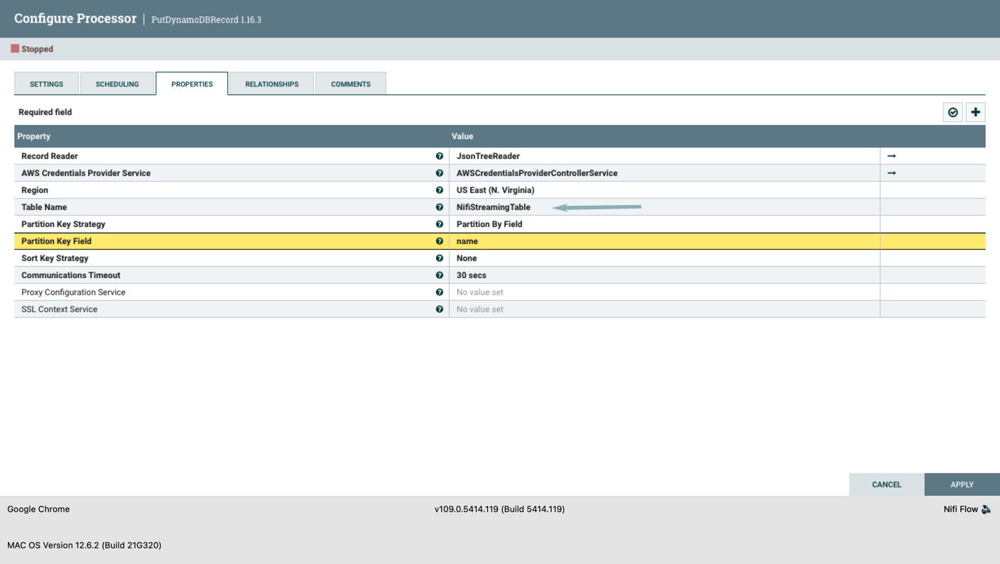
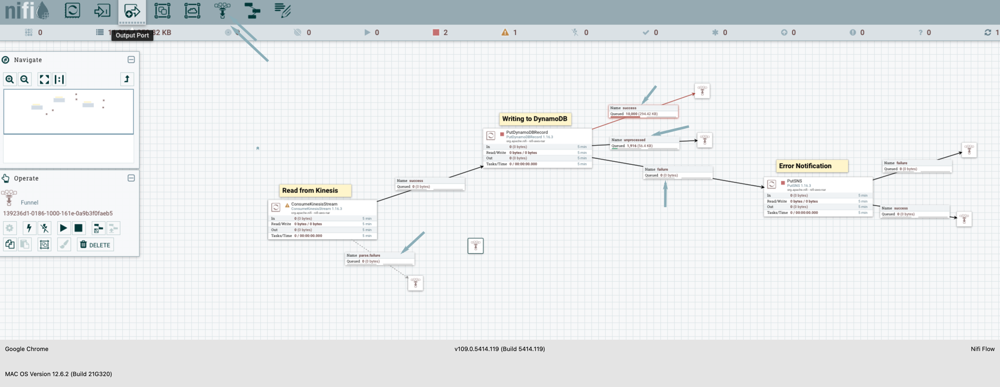

# Apache NiFi on EKS

## Introduction

Apache NiFi is an open-source data integration and management system designed to automate and manage the flow of data between systems. It provides a web-based user interface for creating, monitoring, and managing data flows in real-time.

With its powerful and flexible architecture, Apache NiFi can handle a wide range of data sources, cloud platforms, and formats, including structured and unstructured data, and can be used for a variety of data integration scenarios, such as data ingest, data processing (low to medium level), data routing, data transformation, and data dissemination.

Apache NiFi provides a GUI based interface for building and managing data flows, making it easier for non-technical users. It also offers robust security features, including SSL, SSH, and fine-grained access control, to ensure the safe and secure transfer of sensitive data. Whether you are a data analyst, a data engineer, or a data scientist, Apache NiFi provides a comprehensive solution for managing and integrating your data on AWS and other platforms.
:::caution

This blueprint should be considered as experimental and should only be used for proof of concept.
:::

This [example](https://github.com/awslabs/data-on-eks/tree/main/streaming-platforms/nifi) deploys an EKS Cluster running the Apache NiFi cluster. In the example, Apache NIfi is streaming data from the AWS Kinesis Data Stream to an Amazon DynamoDB table after some format transformation.

- Creates a new sample VPC, 3 Private Subnets and 3 Public Subnets
- Creates Internet gateway for Public Subnets and NAT Gateway for Private Subnets
- Creates EKS Cluster Control plane with public endpoint (for demo reasons only) with one managed node group
- Deploys Apache NiFi, AWS Load Balancer Controller, Cert Manager and External DNS (optional) add-ons
- Deploys Apache NiFi cluster in the `nifi` namespace

## Prerequisites

Ensure that you have installed the following tools on your machine.

1. [aws cli](https://docs.aws.amazon.com/cli/latest/userguide/install-cliv2.html)
2. [kubectl](https://Kubernetes.io/docs/tasks/tools/)
3. [terraform](https://learn.hashicorp.com/tutorials/terraform/install-cli)
4. [jq](https://stedolan.github.io/jq/)

Additionally, for end-to-end configuration of Ingress, you will need to provide the following:

1. A [Route53 Public Hosted Zone](https://docs.aws.amazon.com/Route53/latest/DeveloperGuide/dns-configuring.html) configured in the account where you are deploying this example. E.g. "example.com"
2. An [ACM Certificate](https://docs.aws.amazon.com/acm/latest/userguide/gs-acm-request-public.html) in the account + region where you are deploying this example. A wildcard certificate is preferred, e.g. "*.example.com"

## Deploy the EKS Cluster with Apache NiFi

### Clone the repository

```bash
git clone https://github.com/awslabs/data-on-eks.git
```

### Initialize Terraform

Navigate into the example directory and run `terraform init`

```bash
cd data-on-eks/streaming/nifi/
terraform init
```

### Terraform Plan

Run Terraform plan to verify the resources created by this execution.

Provide a Route53 Hosted Zone hostname and a corresponding ACM Certificate;

```bash
export TF_VAR_eks_cluster_domain="<CHANGEME - example.com>"
export TF_VAR_acm_certificate_domain="<CHANGEME - *.example.com>"
export TF_VAR_nifi_sub_domain="nifi"
export TF_VAR_nifi_username="admin"
```

### Deploy the pattern

```bash
terraform plan
terraform apply
```

Enter `yes` to apply.

```
Outputs:

configure_kubectl = "aws eks --region us-west-2 update-kubeconfig --name nifi-on-eks"
```


### Verify Deployment

Update kubeconfig

```bash
aws eks --region us-west-2 update-kubeconfig --name nifi-on-eks
```

Verify all pods are running.

```bash
NAMESPACE           NAME                                                         READY   STATUS    RESTARTS      AGE
amazon-cloudwatch   aws-cloudwatch-metrics-7fbcq                                 1/1     Running   1 (43h ago)   2d
amazon-cloudwatch   aws-cloudwatch-metrics-82c9v                                 1/1     Running   1 (43h ago)   2d
amazon-cloudwatch   aws-cloudwatch-metrics-blrmt                                 1/1     Running   1 (43h ago)   2d
amazon-cloudwatch   aws-cloudwatch-metrics-dhpl7                                 1/1     Running   0             19h
amazon-cloudwatch   aws-cloudwatch-metrics-hpw5k                                 1/1     Running   1 (43h ago)   2d
cert-manager        cert-manager-7d57b6576b-c52dw                                1/1     Running   1 (43h ago)   2d
cert-manager        cert-manager-cainjector-86f7f4749-hs7d9                      1/1     Running   1 (43h ago)   2d
cert-manager        cert-manager-webhook-66c85f8577-rxms8                        1/1     Running   1 (43h ago)   2d
external-dns        external-dns-57bb948d75-g8kbs                                1/1     Running   0             41h
grafana             grafana-7f5b7f5d4c-znrqk                                     1/1     Running   1 (43h ago)   2d
kube-system         aws-load-balancer-controller-7ff998fc9b-86gql                1/1     Running   1 (43h ago)   2d
kube-system         aws-load-balancer-controller-7ff998fc9b-hct9k                1/1     Running   1 (43h ago)   2d
kube-system         aws-node-4gcqk                                               1/1     Running   1 (43h ago)   2d
kube-system         aws-node-4sssk                                               1/1     Running   0             19h
kube-system         aws-node-4t62f                                               1/1     Running   1 (43h ago)   2d
kube-system         aws-node-g4ndt                                               1/1     Running   1 (43h ago)   2d
kube-system         aws-node-hlxmq                                               1/1     Running   1 (43h ago)   2d
kube-system         cluster-autoscaler-aws-cluster-autoscaler-7bd6f7b94b-j7td5   1/1     Running   1 (43h ago)   2d
kube-system         cluster-proportional-autoscaler-coredns-6ccfb4d9b5-27xsd     1/1     Running   1 (43h ago)   2d
kube-system         coredns-5c5677bc78-rhzkx                                     1/1     Running   1 (43h ago)   2d
kube-system         coredns-5c5677bc78-t7m5z                                     1/1     Running   1 (43h ago)   2d
kube-system         ebs-csi-controller-87c4ff9d4-ffmwh                           6/6     Running   6 (43h ago)   2d
kube-system         ebs-csi-controller-87c4ff9d4-nfw28                           6/6     Running   6 (43h ago)   2d
kube-system         ebs-csi-node-4mkc8                                           3/3     Running   0             19h
kube-system         ebs-csi-node-74xqs                                           3/3     Running   3 (43h ago)   2d
kube-system         ebs-csi-node-8cw8t                                           3/3     Running   3 (43h ago)   2d
kube-system         ebs-csi-node-cs9wp                                           3/3     Running   3 (43h ago)   2d
kube-system         ebs-csi-node-ktdb7                                           3/3     Running   3 (43h ago)   2d
kube-system         kube-proxy-4s72m                                             1/1     Running   0             19h
kube-system         kube-proxy-95ptn                                             1/1     Running   1 (43h ago)   2d
kube-system         kube-proxy-bhrdk                                             1/1     Running   1 (43h ago)   2d
kube-system         kube-proxy-nzvb6                                             1/1     Running   1 (43h ago)   2d
kube-system         kube-proxy-q9xkc                                             1/1     Running   1 (43h ago)   2d
kube-system         metrics-server-fc87d766-dd647                                1/1     Running   1 (43h ago)   2d
kube-system         metrics-server-fc87d766-vv8z9                                1/1     Running   1 (43h ago)   2d
logging             aws-for-fluent-bit-b5vqg                                     1/1     Running   1 (43h ago)   2d
logging             aws-for-fluent-bit-pklhr                                     1/1     Running   0             19h
logging             aws-for-fluent-bit-rq2nc                                     1/1     Running   1 (43h ago)   2d
logging             aws-for-fluent-bit-tnmtl                                     1/1     Running   1 (43h ago)   2d
logging             aws-for-fluent-bit-zzhfc                                     1/1     Running   1 (43h ago)   2d
nifi                nifi-0                                                       5/5     Running   0             41h
nifi                nifi-1                                                       5/5     Running   0             41h
nifi                nifi-2                                                       5/5     Running   0             41h
nifi                nifi-registry-0                                              1/1     Running   0             41h
nifi                nifi-zookeeper-0                                             1/1     Running   0             41h
nifi                nifi-zookeeper-1                                             1/1     Running   0             41h
nifi                nifi-zookeeper-2                                             1/1     Running   0             18h
prometheus          prometheus-alertmanager-655fcb46df-2qh8h                     2/2     Running   2 (43h ago)   2d
prometheus          prometheus-kube-state-metrics-549f6d74dd-wwhtr               1/1     Running   1 (43h ago)   2d
prometheus          prometheus-node-exporter-5cpzk                               1/1     Running   0             19h
prometheus          prometheus-node-exporter-8jhbk                               1/1     Running   1 (43h ago)   2d
prometheus          prometheus-node-exporter-nbd42                               1/1     Running   1 (43h ago)   2d
prometheus          prometheus-node-exporter-str6t                               1/1     Running   1 (43h ago)   2d
prometheus          prometheus-node-exporter-zkf5s                               1/1     Running   1 (43h ago)   2d
prometheus          prometheus-pushgateway-677c6fdd5-9tqkl                       1/1     Running   1 (43h ago)   2d
prometheus          prometheus-server-7bf9cbb9cf-b2zgl                           2/2     Running   2 (43h ago)   2d
vpa                 vpa-recommender-7c6bbb4f9b-rjhr7                             1/1     Running   1 (43h ago)   2d
vpa                 vpa-updater-7975b9dc55-g6zf6                                 1/1     Running   1 (43h ago)   2d
```

#### Apache NiFi UI

The Apache NiFi Dashboard can be opened at the following url "https://nifi.example.com/nifi"


Run the command below to retrieve NiFi user's password and default username as `admin`
```
aws secretsmanager get-secret-value --secret-id <nifi_login_password_secret_name from terraform outputs> --region <region> | jq '.SecretString' --raw-output
```


### Monitoring
Apache Nifi can be monitored using metrics reported by PrometheusReportingTask. JVM metrics are disabled by default, let's enable the JVM metrics by navigating to Controller Settings by the clicking on the hamburger icon (three horizontal bars) in the top right corner.


Next click on the `REPORTING TASK` tab and then click the `+` icon and search for `PrometheusReportingTask` in the filter. Select the `PrometheusReportingTask` and click `ADD` button.



The prometheus reporting task is stopped by default.


Click on the pencil icon to edit the task and click on the PROPERTIES tab. Set the `Send JVM metrics` to `true` and click on Apply. Start the task by clicking on the play icon and ensure it's in running state.


This blueprint uses the `prometheus` and `grafana` to create a monitoring stack for getting visibility into your Apache NiFi cluster.

```
aws secretsmanager get-secret-value --secret-id <grafana_secret_name from terraform outputs> --region <region> | jq '.SecretString' --raw-output
```

Run the command below and open the Grafana dashboard using the url "http://localhost:8080".

```
kubectl port-forward svc/grafana -n grafana 8080:80
```

Import Apache NiFi [Grafana dashboard](https://grafana.com/grafana/dashboards/12314-nifi-prometheusreportingtask-dashboard/)


### Example

#### Create IAM policies for accessing Amazon DynamoDB and AWS Kinesis

1. Create an AWS IAM role: Create an AWS IAM role with permissions to access the AWS Kinesis data stream and assign this role to the AWS EKS cluster hosting Apache NiFi.

2. Attach the IAM policy: Attach a policy to the IAM role that limits access to the Kinesis data stream to read-only and IAM policy to enable EKS role to write Amazon DynamoDB table. Here's an example policy:

```
{
    "Version": "2012-10-17",
    "Statement": [
        {
            "Sid": "Nifi-access-to-Kinesis",
            "Effect": "Allow",
            "Action": [
                "kinesis:DescribeStream",
                "kinesis:GetRecords",
                "kinesis:GetShardIterator",
                "kinesis:ListStreams"
            ],
            "Resource": "arn:aws:kinesis:<REGION>:<ACCOUNT-ID>:stream/kds-stream-nifi-on-EKS"
        }
    ]
}
```

```
{
    "Sid": "DynamoDBTableAccess",
    "Effect": "Allow",
    "Action": [
        "dynamodb:BatchGetItem",
        "dynamodb:BatchWriteItem",
        "dynamodb:ConditionCheckItem",
        "dynamodb:PutItem",
        "dynamodb:DescribeTable",
        "dynamodb:DeleteItem",
        "dynamodb:GetItem",
        "dynamodb:Scan",
        "dynamodb:Query",
        "dynamodb:UpdateItem"
    ],
    "Resource": "arn:aws:dynamodb:<REGION>:<ACCOUNT-ID>:table/NifiStreamingTable"
}
```

#### Create AWS Kinesis Data Stream
3. Create an AWS Kinesis data stream: Log in to the AWS Management Console, and create a Kinesis data stream in the region where you want to collect your data or use the below command line to create one.

```
aws kinesis create-stream --stream-name kds-stream-nifi-on-EKS
```

#### Create Amazon DynamoDB table
4. Create a Amazon DynamoDB in the same AWS Account using the AWS console or the command line. Create a JSON file with Amazon DynamoDb table information called JSONSchemaDynamoDBTABLE.json

```

    "TableName": "NifiStreamingTable",
    "KeySchema": [
      { "AttributeName": "Name", "KeyType": "HASH" },
      { "AttributeName": "Age", "KeyType": "RANGE" }},
      { "AttributeName": "Location", "KeyType": "RANGE" }
    ],
    "AttributeDefinitions": [
      { "AttributeName": "Name", "KeyType": "S" },
      { "AttributeName": "Age", "KeyType": "S" }},
      { "AttributeName": "Location", "KeyType": "S" }
    ],
    "ProvisionedThroughput": {
      "ReadCapacityUnits": 5,
      "WriteCapacityUnits": 5
    }
}
```

5. Execute the command line to create the Amazon DynamoDB table from the JSON file.

```
aws dynamodb create-table --cli-input-json  JSONSchemaDynamoDBTABLE.json
```

6. Open the Apache Nifi on the EKS UI using the endpoint, create a process group, and name it NifiStreamingExample.


7. Double-click on the Nifi-on-EKS-process-group and enter the process to create the data flow. Drag the processor icon from the top left, type Kinesis into the search window, and select the ConsumeKinesisStream processor. To create a Kinesis Consumer, click ADD. 


8. Double click on the Kinesis processor, select the properties tab, and fill in the information for the configuration below.
   a. Amazon Kinesis Stream Name
   b. Application Name
   c. Region
   d. AWS Credentials Provider Service - Select AWSCredentialsProviderControllerService and create one.


#### Create AWS credential setup

9. Setup the AWS credentials to access the AWS resource in the account using the AWS Credentials Provider Service. In this example, we are using the access key and secret key. <em>**Note** : Other options are IAM role-based, assumed role options to authenticate an AWS resources.</em>




10. Drag the processor icon from the top left, type "dynamoDB" into the search window, and select the "PutDynamoDBRecord processor. Click on ADD to create an Amazon DynamoDB writer. Configure the processor using the fields below.

a. Record Reader - Change it to JSONTreeReader
b. AWS Credentials Provider Service - select the previously created configuration
c. Region
b. Table Name
d. Partition Key Field - select the partition field





11. Hover over the Kinesis consumer and drag it to the DynamoDB writer. The connection will be made, and the success queue will be created.


12. For the Kinesis Consumer and DynamoDB, create an error route to a funnel. This is to route the unprocessed, failed, and successful records for further processing. Note: Under the Relationship tab, you can see all the options for each processor. For the DynamoDB writer, success should always point to a funnel.



13. Check that none of the processors have any Hazard symbols. Right-click on the grid and click "run the data flow." You can start seeing the data flowing in.

## Cleanup

To clean up your environment, destroy the Terraform modules in reverse order.

Destroy the Kubernetes Add-ons, EKS cluster with Node groups and VPC

```bash
terraform destroy -target="module.eks_blueprints_kubernetes_addons" --auto-approve
terraform destroy -target="module.eks" --auto-approve
terraform destroy -target="module.vpc" --auto-approve
```

Finally, destroy any additional resources that are not in the above modules

```bash
terraform destroy --auto-approve
```
