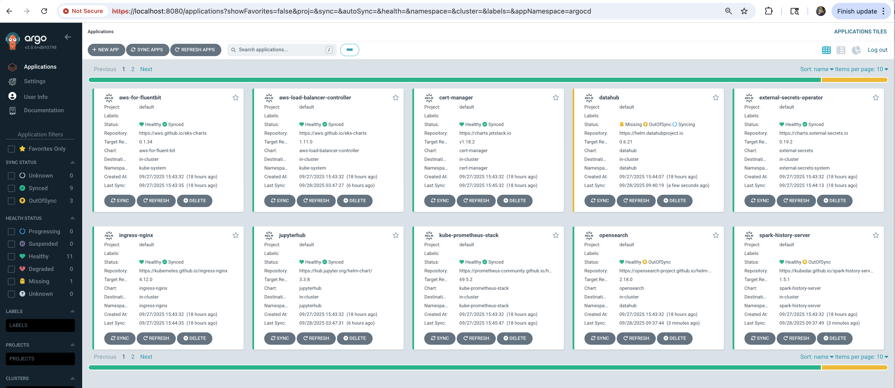

import '@site/src/css/datastack-tiles.css';
import '@site/src/css/clickhouse-architecture.css';

## ClickHouse on EKS Stack
[ClickHouse](https://clickhouse.com/) is a high-performance, column-oriented SQL database management system (DBMS) for online analytical processing (OLAP) that is open sourced under the Apache 2.0 license.


OLAP is software technology you can use to analyze business data from different points of view. Organizations collect and store data from multiple data sources, such as websites, applications, smart meters, and internal systems. OLAP helps organizations process and benefit from a growing amount of information by combining and groups this data into categories to provide actionable insights for strategic planning. For example, a retailer stores data about all the products it sells, such as color, size, cost, and location. The retailer also collects customer purchase data, such as the name of the items ordered and total sales value, in a different system. OLAP combines the datasets to answer questions such as which color products are more popular or how product placement impacts sales.

**Some key benefits of Clickhouse include:**

* Real-Time Analytics: ClickHouse can handle real-time data ingestion and analysis, making it suitable for use cases such as monitoring, logging, and event data processing.
* High Performance: ClickHouse is optimized for analytical workloads, providing fast query execution and high throughput.
* Scalability: ClickHouse is designed to scale horizontally across multiple nodes, allowing users to store and process petabytes of data across a distributed cluster. It supports sharding and replication for high availability and fault tolerance.
* Column-Oriented Storage: ClickHouse organizes data by columns rather than rows, which allows for efficient compression and faster query processing, especially for queries that involve aggregations and scans of large datasets.
* SQL Support: ClickHouse supports a subset of SQL, making it familiar and easy to use for developers and analysts who are already familiar with SQL-based databases.
* Integrated Data Formats: ClickHouse supports various data formats, including CSV, JSON, Apache Avro, and Apache Parquet, making it flexible for ingesting and querying different types of data.

## Getting Started

This stack provisions the **platform layer** for running ClickHouse on EKS:
an EKS cluster with Karpenter for node autoscaling, ArgoCD for GitOps
application management, and the
[ClickHouse Kubernetes operator](https://github.com/Altinity/clickhouse-operator)
ready to manage `ClickHouseCluster` and `KeeperCluster` custom resources.

`./deploy.sh` does **not** deploy an actual ClickHouse cluster — it only
provisions the operator. To stand up a sharded, replicated cluster and run
analytical queries, follow the
[Sample Workload — Hits Dataset](./sample-workload.md) guide once this
infrastructure is up.

### Architecture

<div className="ch-arch-diagram">
  <div className="ch-arch-operator-wrapper">
    <div className="ch-arch-operator-label">EKS Cluster</div>
    <div className="ch-arch-legend">
      <span className="ch-arch-legend-item ch-arch-legend-controller">controller</span>
      <span className="ch-arch-legend-item ch-arch-legend-resource">managed resource</span>
    </div>

    {/* GitOps layer */}
    <div className="ch-arch-layer">
      <div className="ch-arch-layer-label">
        <b>GitOps</b>
      </div>
      <div className="ch-arch-keeper-nodes">
        <div className="ch-arch-keeper-node">
          <svg className="ch-arch-node-icon" viewBox="0 0 16 16" fill="none" stroke="var(--ch-blue)" strokeWidth="1.25">
            <path d="M8 1.5l5.8 3.3v6.4L8 14.5 2.2 11.2V4.8z" />
            <path d="M5.5 8l1.8 1.8L11 6" />
          </svg>
          <span className="ch-arch-node-label">ArgoCD</span>
        </div>
      </div>
    </div>

    <div className="ch-arch-connector">
      <div className="ch-arch-connector-line" />
      <div className="ch-arch-connector-label">deploys</div>
      <div className="ch-arch-connector-arrow" />
    </div>

    {/* Applications layer */}
    <div className="ch-arch-layer">
      <div className="ch-arch-layer-label">
        <b>Applications</b>
      </div>
      <div className="ch-arch-keeper-nodes">
        <div className="ch-arch-keeper-node">
          <svg className="ch-arch-node-icon" viewBox="0 0 16 16" fill="none" stroke="var(--ch-blue)" strokeWidth="1.25">
            <path d="M3 8l5-4 5 4" />
            <path d="M3 12l5-4 5 4" />
          </svg>
          <span className="ch-arch-node-label">Karpenter</span>
        </div>
        <div className="ch-arch-keeper-node">
          <svg className="ch-arch-node-icon" viewBox="0 0 16 16" fill="none" stroke="var(--ch-blue)" strokeWidth="1.25">
            <circle cx="8" cy="8" r="2.5" />
            <path d="M8 1.5v2M8 12.5v2M14.5 8h-2M3.5 8h-2M12.6 3.4l-1.4 1.4M4.8 11.2l-1.4 1.4M12.6 12.6l-1.4-1.4M4.8 4.8L3.4 3.4" />
          </svg>
          <span className="ch-arch-node-label">ClickHouse Operator</span>
        </div>
        <div className="ch-arch-keeper-node">
          <svg className="ch-arch-node-icon" viewBox="0 0 16 16" fill="none" stroke="var(--ch-blue)" strokeWidth="1.25">
            <rect x="2" y="2" width="5" height="5" rx="0.6" />
            <rect x="9" y="2" width="5" height="5" rx="0.6" />
            <rect x="2" y="9" width="5" height="5" rx="0.6" />
            <rect x="9" y="9" width="5" height="5" rx="0.6" />
          </svg>
          <span className="ch-arch-node-label">Other add-ons</span>
        </div>
      </div>
    </div>

    <div className="ch-arch-connector-split">
      <div className="ch-arch-connector">
        <div className="ch-arch-connector-line" />
        <div className="ch-arch-connector-label">provisions</div>
        <div className="ch-arch-connector-arrow" />
      </div>
      <div className="ch-arch-connector">
        <div className="ch-arch-connector-line" />
        <div className="ch-arch-connector-label">reconciles</div>
        <div className="ch-arch-connector-arrow" />
      </div>
      <div className="ch-arch-connector-spacer" />
    </div>

    {/* Managed resources layer */}
    <div className="ch-arch-layer">
      <div className="ch-arch-layer-label">
        <b>Managed Resources</b>
      </div>
      <div className="ch-arch-nodes">
        <div className="ch-arch-shard">
          <div className="ch-arch-shard-label">Compute · Karpenter</div>
          <div className="ch-arch-node">
            <svg className="ch-arch-node-icon" viewBox="0 0 16 16" fill="none" stroke="var(--ch-amber)" strokeWidth="1.25">
              <rect x="1.5" y="2.5" width="13" height="4.5" rx="0.6" />
              <rect x="1.5" y="9" width="13" height="4.5" rx="0.6" />
              <circle cx="3.8" cy="4.75" r="0.7" fill="var(--ch-amber)" stroke="none" />
              <circle cx="3.8" cy="11.25" r="0.7" fill="var(--ch-amber)" stroke="none" />
            </svg>
            <span className="ch-arch-node-label">EC2 nodes (on-demand &amp; spot)</span>
          </div>
        </div>
        <div className="ch-arch-shard">
          <div className="ch-arch-shard-label">Workload · ClickHouse Operator</div>
          <div className="ch-arch-node">
            <svg className="ch-arch-node-icon" viewBox="0 0 16 16" fill="none" stroke="var(--ch-amber)" strokeWidth="1.25">
              <rect x="2" y="2" width="12" height="3.2" rx="0.5" />
              <rect x="2" y="6.4" width="12" height="3.2" rx="0.5" />
              <rect x="2" y="10.8" width="12" height="3.2" rx="0.5" />
            </svg>
            <span className="ch-arch-node-label">StatefulSet</span>
          </div>
          <div className="ch-arch-node">
            <svg className="ch-arch-node-icon" viewBox="0 0 16 16" fill="none" stroke="var(--ch-amber)" strokeWidth="1.25">
              <circle cx="8" cy="3" r="1.6" />
              <circle cx="3" cy="13" r="1.6" />
              <circle cx="13" cy="13" r="1.6" />
              <path d="M8 4.6L3.6 11.6M8 4.6l4.4 7" />
            </svg>
            <span className="ch-arch-node-label">Service</span>
          </div>
          <div className="ch-arch-node">
            <svg className="ch-arch-node-icon" viewBox="0 0 16 16" fill="none" stroke="var(--ch-amber)" strokeWidth="1.25">
              <path d="M3 1.5h7l3 3v10H3z" />
              <path d="M10 1.5v3h3" />
              <path d="M5.5 8.5h5M5.5 11h5" />
            </svg>
            <span className="ch-arch-node-label">ConfigMap</span>
          </div>
          <div className="ch-arch-node">
            <svg className="ch-arch-node-icon" viewBox="0 0 16 16" fill="none" stroke="var(--ch-amber)" strokeWidth="1.25">
              <ellipse cx="8" cy="3" rx="5.5" ry="1.4" />
              <path d="M2.5 3v10c0 .8 2.5 1.4 5.5 1.4s5.5-.6 5.5-1.4V3" />
              <path d="M2.5 7.5c0 .8 2.5 1.4 5.5 1.4s5.5-.6 5.5-1.4" />
            </svg>
            <span className="ch-arch-node-label">PersistentVolumeClaim</span>
          </div>
        </div>
      </div>
    </div>

  </div>
</div>

- **Amazon EKS Cluster:** The core Kubernetes environment that hosts everything in the diagram.
- **ArgoCD:** Deploys all Applications — including Karpenter, the ClickHouse operator, and other platform add-ons — in a GitOps fashion.
- **Karpenter:** Provisions EC2 nodes on demand when pods are scheduled (using `nodeSelector` constraints).
- **ClickHouse Operator:** Watches `ClickHouseCluster` (and `KeeperCluster`) custom resources and reconciles them into the underlying Kubernetes resources — `StatefulSet`, `ConfigMap`, `Service`, `PersistentVolumeClaim`, etc.


### Deploy the stack

Clone the repository, then run the deployment script:

```bash
export CLICKHOUSE_DIR=$(git rev-parse --show-toplevel)/data-stacks/clickhouse-on-eks
cd $CLICKHOUSE_DIR
./deploy.sh
```

Deployment will take ~20 minutes to complete.


### Verify deployment

The deployment script displays ArgoCD credentials at the end. Access the UI:

```bash
# Port forward ArgoCD server
export KUBECONFIG=$CLICKHOUSE_DIR/kubeconfig.yaml
kubectl port-forward svc/argocd-server -n argocd 8080:443
```

Open https://localhost:8080 in your browser:
- **Username:** `admin`
- **Password:** Displayed at end of `deploy.sh` output

:::info
It may take an additional ~5 minutes for all applications (including the ClickHouse operator) to show **Synced** and **Healthy** status.
:::




## Next Steps

With infrastructure deployed, you can now run any ClickHouse example:

- [Sample Workload — Hits Dataset](/data-on-eks/docs/datastacks/databases/clickhouse-on-eks/sample-workload) — load the public `hits` dataset, run analytical queries with `EXPLAIN`, and demonstrate replica failover.


## Cleanup

To remove all resources, use the dedicated cleanup script:

```bash
# Navigate to stack directory
cd $CLICKHOUSE_DIR

# Run cleanup script
./cleanup.sh
```

:::warning

This command will delete all resources and data. Make sure to backup any important data first.

:::

:::note

**If cleanup fails:**
- Rerun the same command: `./cleanup.sh`
- Keep rerunning until all resources are deleted
- Some AWS resources may have dependencies that require multiple cleanup attempts

:::
